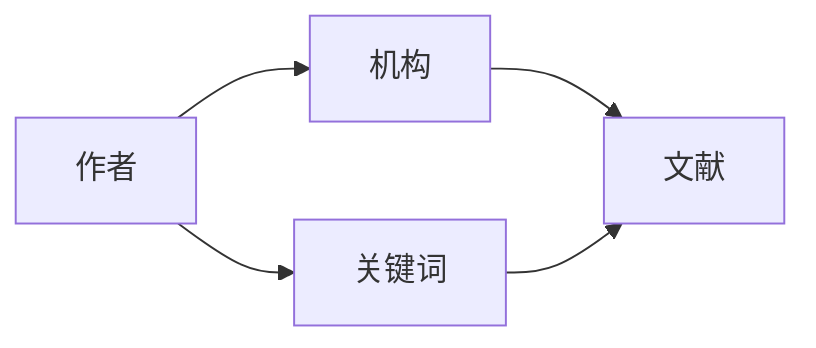
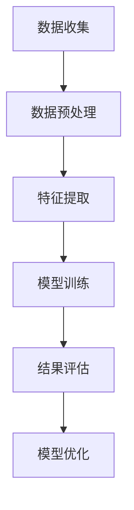
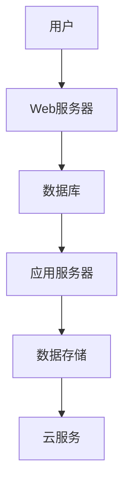

                 

### 引言

在当今全球化发展的背景下，知识的生产、传播和应用已经成为推动社会进步和经济发展的核心动力。然而，传统的知识传播模式却存在着诸多障碍，使得知识壁垒日益凸显。知识壁垒不仅限制了学术资源的共享，还阻碍了全球范围内人们对世界理解的深化。为了打破这一壁垒，开放获取运动应运而生，成为当今学术界和科技界的热门话题。

开放获取（Open Access, OA）运动旨在实现科学研究成果的广泛可及，使任何人都能免费获取和利用学术文献。这一运动的核心理念是消除知识壁垒，促进全球范围内的知识共享和协同创新。然而，开放获取运动并非一蹴而就，其背后涉及诸多策略和方法，包括知识共享平台建设、知识传播与数字鸿沟的缓解、跨学科合作与协同创新等。

本文将围绕开放获取运动的推进策略和方法展开讨论。首先，我们将介绍开放获取运动的背景与发展历程，阐述其核心概念和理念。接着，我们将探讨如何消除知识壁垒，包括知识共享平台建设、知识传播与数字鸿沟的缓解以及跨学科合作与协同创新等方面的策略和方法。随后，我们将分析开放获取运动的实践案例，探讨其在学术界和产业界的融合、挑战与展望等方面的应用。此外，我们还将探讨开放获取运动的经济与社会影响，以及技术支持与工具应用。最后，我们将讨论开放获取运动的政策与法规，以及未来展望与趋势。

通过本文的探讨，我们希望能够为开放获取运动的推进提供一些有益的思考和实践指导，促进全球范围内的知识共享与理解，为人类社会的发展贡献力量。

### 第1章：开放获取运动的背景与核心概念

#### 1.1 开放获取运动的起源与发展

1. **背景介绍**

开放获取运动（Open Access Movement）的起源可以追溯到20世纪90年代末和21世纪初。这一时期，互联网的普及和学术研究的迅速发展，使得学术出版系统逐渐暴露出诸多问题。传统的学术出版模式以付费订阅为主，使得学术文献的可获取性受到限制，学术资源的共享面临巨大障碍。此外，学术出版的高成本和垄断现象，使得研究成果的传播速度受到限制，阻碍了科学知识的普及和应用。

2. **学术出版系统的变革**

面对上述问题，学术界和科技界开始寻求变革。首先，学术出版领域开始出现一些倡导开放获取的期刊和出版社，如`BMC`和`PLoS`等。这些新兴的学术出版机构采用了开放获取的模式，允许作者将研究成果免费发布，并允许读者自由阅读、下载、复制、传播和引用。这一变革为开放获取运动奠定了基础。

3. **开放获取运动的兴起**

随着互联网技术的不断进步和学术研究的深入，开放获取运动逐渐兴起。2001年，`Budapest Open Access Initiative`（BOAI）发布了开放获取的声明，明确了开放获取的定义和目标。声明提出，学术文献应当免费且无限制地提供给所有人，从而实现知识的自由流通。这一声明标志着开放获取运动的正式兴起。

4. **里程碑事件**

自开放获取运动兴起以来，全球范围内发生了一系列里程碑事件，推动了开放获取运动的进一步发展：

   - **2003年**，`Wellcome Trust`发布了一项重要的声明，承诺资助的研究成果必须在开放获取期刊上发表。
   - **2005年**，`Open Access Week`首次举行，旨在提高公众对开放获取的认识和支持。
   - **2012年**，`Research Councils UK`发布政策，要求所有资助的研究成果必须开放获取。
   - **2013年**，`PLoS`期刊发布了关于开放获取研究的重大成果，揭示了开放获取对研究质量的影响。

#### 1.2 开放获取运动的核心理念

1. **开放获取的定义**

开放获取（Open Access, OA）是指学术文献在互联网上免费、永久且无限制地提供给所有人。具体来说，开放获取包括以下几个方面：

   - **免费访问**：任何人都可以免费获取和阅读学术文献，无需支付订阅费用。
   - **永久保存**：学术文献在互联网上被永久保存，不会因期刊订阅到期或出版商破产而消失。
   - **无限制使用**：任何人都可以自由阅读、下载、复制、传播和引用学术文献。

2. **开放获取与知识自由**

开放获取运动的核心目标是实现知识自由（Knowledge Freedom）。知识自由是指知识应自由流通，不受任何形式的限制。开放获取运动通过消除知识壁垒，促进知识共享，实现知识自由。知识自由具有以下重要意义：

   - **提高科研效率**：开放获取使科研人员能够快速获取所需文献，提高科研效率。
   - **促进创新**：开放获取促进学术交流与合作，激发创新思维，推动科学进步。
   - **增强社会公正**：开放获取使学术资源更加公平地分配，减少资源匮乏地区的不平等现象。

3. **开放获取的价值**

开放获取运动具有重要的社会价值，体现在以下几个方面：

   - **知识普及**：开放获取使学术文献更加普及，使更多的人能够获取和利用知识。
   - **科研投资**：开放获取提高了科研成果的可见性和影响力，有助于科研投资的合理配置。
   - **经济贡献**：开放获取为出版商带来了新的商业模式，同时也减少了学术资源的浪费。

#### 1.3 开放获取运动与知识壁垒的关系

1. **知识壁垒的概念**

知识壁垒（Knowledge Barrier）是指阻碍知识共享和传播的各种因素，包括经济、技术、法律、文化等。知识壁垒导致学术资源的获取受到限制，使得知识无法自由流通。知识壁垒主要包括以下几个方面：

   - **经济壁垒**：学术文献的高昂订阅费用限制了学术资源的共享。
   - **技术壁垒**：互联网的普及和数字技术的应用尚未完全解决知识传播的问题。
   - **法律壁垒**：版权法和相关法规对学术资源的传播和再利用构成限制。
   - **文化壁垒**：不同国家和地区之间的文化差异影响了学术资源的传播。

2. **知识壁垒对全球理解的影响**

知识壁垒阻碍了全球范围内的知识共享和理解，对人类社会的发展产生负面影响：

   - **科研进展受阻**：知识壁垒限制了科研人员获取学术资源，影响了科研进展。
   - **知识普及受限**：知识壁垒导致学术资源无法普及，限制了知识的传播和应用。
   - **社会不平等加剧**：知识壁垒使得学术资源分配不均，加剧了社会不平等现象。

3. **开放获取运动如何消除知识壁垒**

开放获取运动旨在消除知识壁垒，促进知识共享和传播。其具体措施包括：

   - **建设开放获取平台**：建立开放获取平台，提供免费、永久且无限制的学术文献服务。
   - **推动政策支持**：倡导政府和科研机构制定开放获取政策，支持学术资源的开放获取。
   - **加强国际合作**：推动国际社会合作，共同推进开放获取运动的发展。
   - **提高数字素养**：提高公众的数字素养，培养知识共享和传播的意识和能力。

通过上述措施，开放获取运动致力于消除知识壁垒，促进全球范围内的知识共享和理解，为人类社会的发展贡献力量。

### 1.2.3 开放获取运动的价值

开放获取运动的核心价值在于消除知识壁垒，促进全球范围内的知识共享和协同创新。以下是开放获取运动在消除知识壁垒方面的具体价值：

#### 1. 提高科研效率

开放获取运动使得学术文献的获取变得便捷，大大提高了科研效率。研究人员无需花费大量时间和金钱购买期刊订阅，只需通过开放获取平台即可轻松获取所需文献。这使得研究人员能够更快地查阅相关研究成果，减少重复劳动，提高科研产出。

#### 2. 促进知识普及

开放获取运动使得学术资源更加普及，有助于知识的传播和普及。不仅研究人员能够轻松获取学术文献，普通公众也能通过开放获取平台了解前沿科研成果。这有助于提高公众的科学素养，促进科学知识的普及，减少知识鸿沟。

#### 3. 推动创新

开放获取运动促进了学术交流与合作，激发了创新思维。研究人员能够更方便地分享研究成果，与其他领域的专家进行交流，从而实现跨学科的合作。这种协同创新有助于推动科学技术的进步，促进新技术的研发和应用。

#### 4. 增强社会公正

开放获取运动有助于实现学术资源的公平分配，减少社会不平等现象。由于开放获取平台提供的学术资源是免费且无限制的，无论个人的经济状况如何，任何人都可以平等地获取学术文献。这使得学术资源更加公平地分配，提高了社会的公平性。

#### 5. 促进可持续发展

开放获取运动有助于推动可持续发展。通过消除知识壁垒，开放获取运动促进了科学技术的传播和应用，有助于解决全球性问题，如气候变化、疾病防控等。此外，开放获取运动还推动了绿色科研的发展，促进了环境保护和可持续发展。

#### 6. 提高科研投资效益

开放获取运动提高了科研成果的可见性和影响力，有助于科研投资的合理配置。当科研成果能够免费且无限制地提供给所有人时，科研成果的传播速度和影响力将得到显著提升，从而提高科研投资的经济和社会效益。

#### 7. 降低学术出版成本

开放获取运动减少了学术出版的成本。传统学术出版模式中，出版商需要投入大量资金进行编辑、排版、印刷和分发等工作。而开放获取期刊则采用电子出版方式，大大降低了出版成本。这有助于降低学术资源的获取成本，使更多的学者能够参与学术出版。

#### 8. 促进全球科研合作

开放获取运动促进了全球范围内的科研合作。研究人员可以通过开放获取平台自由地获取和分享研究成果，与其他领域的专家进行交流与合作。这种全球科研合作有助于打破学科壁垒，推动科学技术的进步。

总之，开放获取运动在消除知识壁垒、促进知识共享和协同创新方面具有重要的价值。通过消除知识壁垒，开放获取运动为人类社会的发展贡献了巨大的力量。

### 1.3 开放获取运动与知识壁垒的关系

开放获取运动的核心目标之一是消除知识壁垒，以促进全球范围内的知识共享与理解。然而，要理解开放获取运动如何实现这一目标，我们首先需要明确知识壁垒的概念及其对知识传播的影响。

#### 知识壁垒的概念

知识壁垒是指阻碍知识自由流动的各种障碍，这些障碍可能源自多个方面，包括：

1. **经济壁垒**：传统学术出版系统通常采用付费订阅模式，这导致学术资源难以被所有人获取，尤其是在经济条件较差的地区。
2. **技术壁垒**：互联网接入和数字技术的不平等分布，使得知识获取受到地域和设备限制。
3. **法律壁垒**：版权法和其他知识产权法律可能限制学术资源的自由复制和传播。
4. **文化壁垒**：不同的文化背景和社会结构可能影响知识的传播和理解。

#### 知识壁垒对知识传播的影响

知识壁垒对知识传播的影响是多方面的：

1. **限制知识获取**：经济壁垒导致许多人无法获取学术资源，尤其是那些生活在资源匮乏地区的学者和学生。
2. **减少知识传播**：技术壁垒限制了学术资源在全球范围内的传播，尤其是那些位于偏远或信息闭塞地区的群体。
3. **阻碍知识创新**：法律壁垒可能阻止学者合法地复制、分发和引用学术资源，限制了学术交流和创新。
4. **加剧社会不平等**：知识壁垒使得学术资源分配不均，加剧了社会不平等现象。

#### 开放获取运动如何消除知识壁垒

开放获取运动通过多种策略和措施来消除知识壁垒，以下是一些具体的方式：

1. **开放获取平台建设**：建立和维护开放获取平台，使得学术文献能够免费、无限制地提供给所有人。这些平台通常由学术机构、非营利组织或政府资助，确保资源的可访问性。
2. **政策推动**：通过政府、科研机构和学术机构的政策支持，鼓励开放获取模式的采用。例如，许多国家的科研资助机构要求其资助的研究成果必须开放获取。
3. **国际合作**：开放获取运动是一个全球性的运动，通过国际合作，各国学者和机构共同努力，推动开放获取在全球范围内的实施。
4. **数字素养教育**：提高公众的数字素养，使他们能够更好地利用开放获取资源，促进知识的传播和共享。

#### 开放获取运动的成效

开放获取运动已经取得了一些显著的成效：

1. **增加学术文献的访问量**：开放获取期刊和平台的文献访问量显著增加，使更多学者能够获取和利用学术资源。
2. **促进知识传播**：开放获取运动使得学术资源更加普及，促进了全球范围内的知识传播。
3. **推动科研合作**：开放获取促进了不同学科和领域之间的学术交流，推动了跨学科合作和协同创新。
4. **提高科研成果的可见性**：开放获取使得科研成果能够更广泛地传播，提高了研究的可见性和影响力。

综上所述，开放获取运动通过消除知识壁垒，促进了全球范围内的知识共享与理解。这一运动不仅有助于提高科研效率和创新，还有助于实现社会公正和可持续发展。

### 第2章：消除知识壁垒的策略与方法

#### 2.1 知识共享平台建设

在消除知识壁垒的过程中，知识共享平台建设是一个关键环节。这类平台旨在通过提供免费的学术资源和便捷的服务，打破经济、技术、法律和文化壁垒，促进知识的广泛传播和共享。

1. **平台的重要性**

知识共享平台的重要性体现在以下几个方面：

   - **普及学术资源**：开放获取平台可以提供免费的学术文献、研究成果和数据，使得更多学者和学生能够轻松获取所需资源。
   - **提高科研效率**：知识共享平台使得研究人员能够快速找到相关研究，减少重复劳动，提高科研产出。
   - **促进知识创新**：开放获取平台鼓励学术交流与合作，有助于激发创新思维，推动科学技术的进步。
   - **增强社会公正**：知识共享平台使得学术资源更加公平地分配，减少资源匮乏地区的不平等现象。

2. **建设方法**

建设知识共享平台的方法包括以下几个方面：

   - **确定平台目标**：明确平台的定位和目标，如提供学术文献、研究成果、数据资源等，以及服务的受众群体。
   - **技术基础设施**：建立可靠的技术基础设施，包括服务器、存储设备、网络安全等，确保平台的高效运行和数据的完整性。
   - **内容聚合**：通过合作、购买或爬取等方式，收集和聚合各种学术资源和数据，确保内容的丰富性和多样性。
   - **用户友好界面**：设计简洁、直观的用户界面，提供强大的搜索和筛选功能，方便用户快速找到所需资源。
   - **版权和隐私保护**：制定版权和隐私保护政策，确保学术资源的合法性和用户的隐私安全。

3. **成功案例**

以下是一些成功的知识共享平台案例：

   - **arXiv**：arXiv是一个开放获取的预印本服务器，涵盖了物理学、数学、计算机科学等领域。它通过提供免费的学术文献，促进了科研人员之间的交流与合作，成为全球科研界的重要资源。
   - **PubMed**：PubMed是由美国国立卫生研究院（NIH）开发的免费医学文献数据库，提供了大量的医学和生物学研究文献。它通过先进的搜索功能，使得研究人员能够快速找到相关研究，提高了科研效率。
   - **ResearchGate**：ResearchGate是一个开放获取的科研网络平台，允许研究人员发布和分享自己的研究成果，以及与全球同行进行交流。它通过建立学术社交网络，促进了知识的传播和合作。

通过知识共享平台的建设，我们可以有效消除知识壁垒，促进全球范围内的知识共享与理解。这不仅有助于提高科研效率和创新能力，还有助于实现社会公正和可持续发展。

#### 2.2 知识传播与数字鸿沟

在探讨如何消除知识壁垒的过程中，我们必须重视知识传播与数字鸿沟之间的关系。数字鸿沟是指由于信息技术（IT）的获取、使用和普及程度在不同地区、群体和国家之间的差异而产生的差距。这种差距限制了知识传播的广度和深度，从而对全球范围内的知识共享与理解产生负面影响。

1. **数字鸿沟的定义与影响**

数字鸿沟包括以下几个方面：

   - **接入鸿沟**：指不同地区、群体和国家在互联网接入方面的差异。一些地区或群体可能由于基础设施不足、经济条件限制等原因，无法获取互联网服务。
   - **技能鸿沟**：指不同地区、群体和国家在信息技术技能方面的差异。一些地区或群体可能由于教育资源不足、技术培训缺失等原因，缺乏有效使用信息技术的能力。
   - **内容鸿沟**：指不同地区、群体和国家在互联网内容获取方面的差异。一些地区或群体可能由于语言、文化或经济原因，无法访问或理解特定内容。

数字鸿沟对知识传播的影响主要包括：

   - **限制学术资源获取**：数字鸿沟使得一些地区或群体无法获取学术资源，导致知识传播的范围受限。
   - **减少知识传播深度**：数字鸿沟导致知识传播的效果不佳，使得知识难以深入普及和应用。
   - **加剧社会不平等**：数字鸿沟使得学术资源分配不均，加剧了社会不平等现象。

2. **缓解数字鸿沟的策略**

为了缓解数字鸿沟，促进知识传播，我们可以采取以下策略：

   - **基础设施建设**：投资建设互联网基础设施，提高互联网接入率。这包括建设宽带网络、无线网络和移动设备，确保全球范围内的网络覆盖。
   - **教育培训**：提供信息技术教育和培训，提高公众的数字素养。这包括开设计算机课程、提供在线学习资源，以及开展社区教育活动。
   - **内容本地化**：将学术资源翻译成多种语言，推广本地化内容。这有助于不同文化背景的群体理解和利用学术资源。
   - **开放获取**：推动开放获取运动，使学术资源免费、无限制地提供给所有人。这有助于打破学术资源的经济壁垒，促进全球范围内的知识传播。

3. **成功案例与挑战

以下是一些缓解数字鸿沟的成功案例：

   - **e-Learning for Development**：e-Learning for Development 是一个国际性项目，通过提供在线课程和培训，提高发展中国家的数字素养和信息技术技能。
   - **One Laptop per Child**：One Laptop per Child 是一个非营利组织，致力于为发展中国家的儿童提供低成本、高功能的笔记本电脑，以促进信息技术教育和知识传播。
   - **Open CourseWare**：Open CourseWare 是由麻省理工学院（MIT）发起的项目，通过提供免费的在线课程，使全球范围内的学生和学者能够自由学习。

尽管取得了一些成功，但缓解数字鸿沟仍然面临诸多挑战：

   - **资源限制**：基础设施建设、教育培训和内容本地化都需要大量资金和资源，这对一些发展中国家和地区来说是一个重大挑战。
   - **技术障碍**：一些地区可能由于地理环境、基础设施等原因，难以实现有效的互联网接入和信息技术应用。
   - **文化差异**：不同文化背景的群体对学术资源的理解和需求可能存在差异，这需要更多个性化的内容和教学策略。

总之，缓解数字鸿沟是促进知识传播和消除知识壁垒的重要任务。通过基础设施建设、教育培训和开放获取等多方面的努力，我们可以逐步缩小数字鸿沟，实现全球范围内的知识共享与理解。

#### 2.3 跨学科合作与协同创新

在当今快速变化的世界中，单一学科的界限逐渐模糊，跨学科合作与协同创新成为推动知识进步和创新的重要动力。开放获取运动在这一过程中发挥着关键作用，它不仅促进了学术资源的共享，还为跨学科合作提供了有力支持。

1. **跨学科合作的意义**

跨学科合作是指不同学科领域的专家和研究者在共同问题或目标下进行的合作研究。其意义体现在以下几个方面：

   - **拓宽研究视野**：跨学科合作使研究者能够从多个角度审视问题，吸收不同学科的思维方式和方法，从而提高研究的深度和广度。
   - **推动创新**：跨学科合作有助于激发创新思维，通过整合不同领域的知识和方法，创造新的理论和解决方案。
   - **提高研究效率**：跨学科合作可以优势互补，集中不同领域的专家力量，提高研究的效率和质量。
   - **解决复杂问题**：许多现实问题具有复杂性和多样性，需要多学科的知识和技能才能解决。

2. **跨学科合作的挑战**

尽管跨学科合作具有许多优势，但实际操作中仍然面临诸多挑战：

   - **沟通障碍**：不同学科的专业术语、研究方法和思维方式可能存在较大差异，导致沟通不畅，影响合作效果。
   - **资源分配**：跨学科研究往往涉及多个领域，资源分配不均可能导致某些领域资源不足，影响研究进展。
   - **利益冲突**：跨学科合作中的利益分配问题可能引发冲突，影响团队协作和项目进展。
   - **项目管理**：跨学科合作需要协调不同领域的项目进度和资源，管理复杂度增加，对项目管理能力提出更高要求。

3. **协同创新的实践与成果**

开放获取运动为跨学科合作与协同创新提供了良好的环境。以下是一些跨学科合作与协同创新的实践和成果：

   - **多学科研究团队**：许多研究机构成立了多学科研究团队，专门从事跨学科研究项目。例如，生物信息学研究团队结合生物学、计算机科学和信息学的知识，推动了生物医学研究的发展。
   - **联合研究中心**：高校和研究机构设立了联合研究中心，旨在推动跨学科研究和协同创新。例如，MIT-IBM 量子计算实验室，通过结合计算机科学、量子物理和材料科学的最新进展，开展量子计算研究。
   - **开放研究平台**：开放获取平台提供了丰富的学术资源和数据，促进了跨学科合作。例如，arXiv平台不仅涵盖了物理学、数学、计算机科学等领域，还促进了这些领域之间的交叉研究。

4. **成功案例

以下是一些跨学科合作与协同创新的成功案例：

   - **“人类基因组计划”**：这是一个跨学科的科研项目，涉及生物学、医学、计算机科学等多个领域。该项目通过测序和分析人类基因组，揭示了人类遗传信息的基本特征，对生物医学研究产生了深远影响。
   - **“地球系统科学计划”**：这是一个多学科合作项目，旨在研究地球系统中的各种复杂过程，包括气候、生态系统、地壳运动等。该项目通过整合地球科学、环境科学、天文学等领域的知识，提高了对地球系统的理解。
   - **“物联网（IoT）研究”**：物联网涉及计算机科学、电子工程、自动化控制等多个领域。跨学科合作在物联网的研究和开发中发挥了重要作用，推动了智能家居、智能交通、智能医疗等领域的创新。

总之，跨学科合作与协同创新是推动知识进步和创新的重要途径。开放获取运动通过消除知识壁垒，提供了丰富的学术资源和便捷的合作平台，为跨学科合作和协同创新创造了有利条件。通过加强跨学科合作，我们可以更好地应对复杂问题，推动科学技术的进步，为人类社会的发展贡献力量。

#### 3.1 案例分析：全球开放获取项目

在全球范围内，开放获取运动已经取得了显著进展，涌现出许多成功的开放获取项目。以下将介绍几个具有代表性的全球开放获取项目，分析其成功的原因和面临的挑战。

##### 1. Project MUSE

Project MUSE 是一个由约翰霍普金斯大学出版社运营的开放获取项目，提供包括文学、人文和社会科学等多个领域的学术期刊和书籍。Project MUSE 的成功原因主要包括以下几点：

- **广泛的学科覆盖**：Project MUSE 涵盖了文学、人文和社会科学等多个学科领域，满足了不同研究者的需求。
- **高质量的学术内容**：Project MUSE 的期刊和书籍都经过严格的同行评审，确保了内容的学术质量和权威性。
- **便捷的访问方式**：Project MUSE 提供了简单易用的访问界面，支持多种访问方式和设备，方便用户获取学术资源。

然而，Project MUSE 也面临着一些挑战，如：

- **版权问题**：由于部分学术资源受到版权保护，Project MUSE 在某些情况下无法完全实现开放获取。
- **资金压力**：运营一个高质量的开放获取项目需要大量资金，尤其是在面对经济压力时，维持项目的可持续发展是一个挑战。

##### 2. arXiv

arXiv 是一个由康奈尔大学运营的开放获取预印本服务器，主要涵盖物理学、数学、计算机科学等领域。arXiv 的成功原因主要包括以下几点：

- **免费且无限制的访问**：arXiv 提供了免费且无限制的学术文献访问，使得全球范围内的研究者都能够获取相关资源。
- **快速传播**：arXiv 的文献通常在短时间内得到广泛传播，加速了学术交流和研究进展。
- **开放的提交和审稿系统**：arXiv 采用开放的提交和审稿系统，允许任何研究者提交文献并进行同行评审。

尽管 arXiv 成功地推动了开放获取运动，但依然存在一些问题，如：

- **质量控制**：由于 arXiv 的提交和审稿系统是开放的，部分文献的质量难以保证，需要额外的质量控制措施。
- **资源支持**：arXiv 作为非营利项目，其运营和维护依赖于志愿者和资助，资源支持有限。

##### 3. PLoS

PLoS（公共图书馆科学）是一个国际性的开放获取出版社，涵盖生物学、医学、物理学等多个领域。PLoS 的成功原因主要包括以下几点：

- **严格的同行评审**：PLoS 的期刊都经过严格的同行评审，确保了内容的学术质量和创新性。
- **开放获取**：PLoS 的期刊采用了完全开放获取模式，允许用户自由阅读、下载和引用文献。
- **数据共享**：PLoS 强调数据共享，鼓励研究者分享实验数据，提高了科研的透明度和可重复性。

PLoS 也面临着一些挑战，如：

- **资金压力**：运营开放获取期刊需要大量资金，PLoS 需要不断寻找新的资助来源以维持运营。
- **版权和知识产权**：开放获取模式与版权和知识产权之间存在一定的冲突，需要制定合适的版权政策。

##### 4. Directory of Open Access Journals (DOAJ)

DOAJ 是一个提供开放获取期刊目录的网站，旨在促进开放获取期刊的发现和使用。DOAJ 的成功原因主要包括以下几点：

- **广泛的期刊覆盖**：DOAJ 收录了来自全球各地的开放获取期刊，涵盖了多个学科领域。
- **高效的检索功能**：DOAJ 提供了强大的检索功能，使得用户能够快速找到所需期刊和文献。
- **合作与支持**：DOAJ 与多个开放获取运动组织和学术机构合作，共同推动开放获取运动的发展。

DOAJ 也面临着一些挑战，如：

- **期刊质量**：确保收录的期刊质量是一个重要问题，DOAJ 需要建立有效的审核和评估机制。
- **国际化**：DOAJ 需要进一步推广到非英语国家和地区，以促进全球开放获取运动的发展。

总之，全球开放获取项目在推动开放获取运动方面取得了显著成果，但仍面临诸多挑战。通过不断改进和创新，这些项目将继续为全球范围内的知识共享与理解贡献力量。

#### 3.2 学术界与产业界的融合

开放获取运动不仅促进了学术资源的共享，还推动了学术界与产业界的深度融合。这种融合为科技创新和产业发展带来了新的机遇，同时也提出了新的挑战。

1. **融合的背景**

学术界与产业界的融合起源于科学研究与产业需求之间的相互依存。在开放获取运动背景下，学术成果的开放获取使得企业和研究机构能够更容易地获取和利用学术资源，从而加速技术创新和产业发展。此外，随着全球化和信息化的发展，学术界和产业界之间的合作需求日益增加，促进了双方融合。

2. **融合的动机**

学术界与产业界融合的动机主要包括以下几点：

   - **资源共享**：开放获取运动使得学术资源更加普及和便捷，学术界和产业界能够共享这些资源，提高研究效率。
   - **知识转移**：学术界的研究成果可以为产业界提供创新的思路和解决方案，促进技术的进步和应用。
   - **经济效益**：学术界与产业界的融合有助于将研究成果转化为实际产品和服务，提高企业的市场竞争力，推动产业升级。
   - **社会影响**：学术界与产业界的融合有助于解决社会问题，提高公众的生活质量。

3. **融合的途径**

学术界与产业界融合的途径主要包括以下几个方面：

   - **联合研究**：学术界和产业界可以共同发起科研项目，共同投入资源和人力，推动技术创新。
   - **合作开发**：学术界和产业界可以共同开发新技术、新产品，将研究成果应用于实际场景。
   - **人才培养**：学术界和产业界可以联合培养人才，提供跨学科教育和培训，提高人才的实用性和创新能力。
   - **知识共享平台**：学术界和产业界可以共同建立知识共享平台，提供学术资源和产业需求的信息交流。

4. **融合的挑战

尽管学术界与产业界的融合带来了诸多机遇，但同时也面临一些挑战：

   - **利益冲突**：学术界注重学术自由和独立研究，而产业界追求商业利益和市场竞争力，两者在目标和利益上可能存在冲突。
   - **知识产权**：开放获取运动对知识产权提出了新的挑战，学术界和产业界需要制定合适的知识产权政策，确保学术成果的合法权益。
   - **资源分配**：学术界和产业界在资源分配上可能存在差异，需要平衡双方的需求和利益。
   - **合作模式**：学术界和产业界的合作模式需要不断创新和优化，以适应双方的需求和特点。

5. **成功案例

学术界与产业界的融合在多个领域取得了显著成果，以下是一些成功案例：

   - **生物技术**：生物技术领域的研究成果被广泛应用于医疗、农业和工业领域。学术界和产业界的合作推动了基因编辑技术、疫苗研发等关键技术的进步。
   - **信息技术**：信息技术领域的研究成果推动了云计算、大数据、人工智能等技术的发展，学术界和产业界的合作促进了这些技术的商业应用。
   - **新能源**：新能源领域的研究成果被应用于太阳能、风能、电动汽车等领域，学术界和产业界的合作推动了新能源技术的发展和商业化。

总之，学术界与产业界的融合在开放获取运动的推动下取得了显著进展，为科技创新和产业发展带来了新的机遇。通过不断优化合作模式和应对挑战，学术界和产业界的融合将继续为人类社会的发展贡献力量。

#### 3.3 开放获取运动的挑战与展望

尽管开放获取运动在推动知识共享与理解方面取得了显著成果，但仍然面临诸多挑战。以下是开放获取运动在推进过程中遇到的主要挑战及其未来展望。

1. **资金问题**

开放获取运动需要大量的资金支持，包括学术期刊的运营、平台建设、版权支付等。传统学术出版系统主要依靠订阅模式获取收入，而开放获取模式则依赖于资助和赞助。资金问题成为制约开放获取运动发展的关键因素。未来，需要探索多元化的资金来源，包括政府资助、企业赞助、个人捐赠等，以确保开放获取项目的可持续发展。

2. **版权问题**

开放获取运动涉及到版权问题，尤其是如何平衡学术成果的开放获取与版权所有者的权益。现有版权法在开放获取运动中面临挑战，需要制定更加灵活的版权政策，以促进学术资源的共享和传播。未来，可以通过制定新的版权法、开放获取协议等方式，解决版权问题，确保开放获取运动的合法性和可持续性。

3. **质量控制**

开放获取期刊和平台需要确保学术资源的质量，以维护学术诚信和公信力。开放获取模式可能导致大量低质量甚至虚假的研究成果涌入平台，影响学术界的整体水平。未来，需要建立严格的质量控制机制，包括同行评审、引用评估等，确保开放获取资源的学术质量和可信度。

4. **国际化问题**

开放获取运动在全球化背景下具有重要意义，但不同国家和地区在开放获取运动中的参与度和贡献度存在差异。一些发展中国家和地区由于基础设施、资金等方面的限制，难以充分参与到开放获取运动中。未来，需要加强国际合作，推动开放获取在全球范围内的普及和深化，确保不同国家和地区都能享受到开放获取带来的益处。

5. **数字素养教育**

开放获取运动对公众的数字素养提出了更高要求。为了充分利用开放获取资源，人们需要具备一定的信息技术和检索技能。然而，不同群体在数字素养方面存在较大差异，这限制了开放获取运动的效果。未来，需要加强数字素养教育，提高公众的数字素养，使他们能够更好地利用开放获取资源。

6. **未来展望

未来，开放获取运动将在以下几个方面取得重要进展：

   - **政策支持**：各国政府和科研机构将加大对开放获取运动的支持，制定更加有力的政策和法规，推动学术资源的开放获取。
   - **技术进步**：随着人工智能、区块链等新技术的应用，开放获取平台将更加智能化、安全化和便捷化，提高学术资源的可访问性和可用性。
   - **跨学科合作**：开放获取运动将促进跨学科合作，推动多学科的协同创新，为解决复杂问题提供新的思路和方法。
   - **国际化发展**：开放获取运动将逐步在全球范围内普及，不同国家和地区将共同参与，推动全球范围内的知识共享与理解。

总之，开放获取运动在推进过程中面临诸多挑战，但通过不断探索和创新，未来将在知识共享、科技创新和社会发展等方面发挥更加重要的作用。

#### 4.1 经济影响：开放获取与科研投资

开放获取运动对经济领域产生了深远的影响，尤其在科研投资方面具有重要意义。首先，开放获取运动通过降低学术资源的获取成本，提高了科研投资的效益。在传统的学术出版模式中，研究人员需要支付高额的订阅费用才能访问学术期刊和书籍，这限制了学术资源的普及和应用。而开放获取运动通过免费提供学术文献，使得更多的研究人员能够轻松获取所需资源，从而降低了科研成本。

其次，开放获取运动有助于提高科研成果的可见性和影响力，吸引更多的投资。当研究成果可以免费、无限制地提供给所有人时，科研成果的传播速度和影响力将显著提升。这不仅有助于提高研究人员的学术声誉，还能吸引更多的资金投入科研领域。例如，许多国家的研究资助机构已经将开放获取作为科研项目的评价指标之一，推动更多的研究成果以开放获取的形式发布。

此外，开放获取运动对出版行业的商业模式也产生了影响。传统出版商主要通过订阅模式和授权模式获取收益，而开放获取运动的发展使得出版商需要探索新的商业模式。一些出版商开始采用“作者付费”的模式，即作者支付一定费用来出版文章，而读者可以免费访问。这种模式在降低读者获取成本的同时，也为出版商提供了新的收入来源。此外，开放获取运动还推动了新兴的开放获取出版社的发展，这些出版社通过提供高质量的开放获取服务，逐渐在出版市场中占据了一席之地。

开放获取运动对科研投资的具体影响体现在以下几个方面：

1. **提高科研效率**：开放获取运动使得研究人员能够更快地获取相关研究成果，减少了重复劳动，提高了科研效率。这有助于优化科研资源的配置，提高科研投资的经济效益。

2. **吸引更多投资**：开放获取运动提高了科研成果的可见性和影响力，吸引了更多的资金投入科研领域。这不仅有助于科研项目的顺利实施，还能推动科学技术的进步和创新。

3. **降低科研成本**：开放获取运动通过免费提供学术文献，降低了科研人员的获取成本，使得更多的研究人员能够参与到科研活动中。这有助于扩大科研队伍，提高科研的整体水平。

4. **优化科研资源配置**：开放获取运动促进了学术资源的共享和传播，优化了科研资源的配置。研究人员可以更便捷地获取全球范围内的学术资源，减少了资源的浪费和重复投入。

总之，开放获取运动对经济领域产生了积极的影响，尤其是在科研投资方面具有重要意义。通过降低学术资源获取成本、提高科研成果的可见性和影响力，开放获取运动为科研投资的合理配置和经济效益的提高提供了有力支持。

#### 4.2 社会影响：开放获取与知识普及

开放获取运动不仅在科研领域产生了深远影响，还在社会层面促进了知识普及，提高了公众的科学素养。以下将详细探讨开放获取运动对社会的影响，包括知识普及的推动、科学素养的提升以及教育机会的扩大。

1. **知识普及的推动**

开放获取运动的核心目标是实现学术资源的自由流通，使所有人都能无障碍地获取学术文献。这一目标在知识普及方面具有重要意义。通过开放获取平台，学术资源不再局限于学术机构和研究人员，普通公众也能够免费获取和阅读学术文献。这不仅有助于提高公众的科学素养，还能够促进知识的广泛传播和应用。

具体来说，开放获取运动在知识普及方面取得了以下成效：

   - **降低了获取成本**：开放获取运动降低了学术资源的获取门槛，使得更多公众能够负担得起获取学术文献的费用。传统学术出版模式下，高昂的订阅费用和采购成本限制了学术资源的普及，而开放获取运动使得学术资源变得更加普惠。
   - **提高了知识获取的便利性**：开放获取平台提供了便捷的知识获取渠道，用户可以通过网络轻松地找到所需文献。这使得知识获取不再受地域和时间的限制，为公众提供了更多的学习机会。
   - **丰富了知识资源**：开放获取平台汇集了来自全球各地的学术文献，涵盖了多个学科领域。这种多样化的知识资源为公众提供了更广阔的视野，有助于他们更好地了解和掌握不同领域的知识。

2. **科学素养的提升**

开放获取运动不仅推动了知识的普及，还提高了公众的科学素养。科学素养是指个人具备理解科学概念、评估科学信息、运用科学方法和逻辑思维能力的能力。开放获取运动通过以下方式提升了公众的科学素养：

   - **提供了丰富的学习资源**：开放获取平台提供了丰富的学术文献和学习资源，用户可以通过阅读和研究这些资源，提升自己的科学素养。例如，开放获取期刊和图书提供了最新的科研成果和理论，使得公众能够及时了解科学发展的动态。
   - **培养了科学思维**：开放获取运动鼓励公众积极参与学术讨论和科学探究，培养了他们的科学思维和逻辑分析能力。通过阅读和研究学术文献，公众能够学会如何评估和批判科学信息，提高科学判断能力。
   - **促进了科学教育**：开放获取运动为科学教育提供了有力的支持，教师和学生可以通过开放获取平台获取丰富的教学资源和学习资料。这有助于提高科学教育的质量，培养更多具备科学素养的人才。

3. **教育机会的扩大**

开放获取运动不仅提高了公众的科学素养，还扩大了教育机会，促进了教育公平。在传统教育模式中，教育资源分配不均，一些地区和群体由于经济、地理等因素的限制，难以获得优质的教育资源。而开放获取运动通过提供免费、无限制的学术资源，打破了教育资源的壁垒，使得更多的人能够接受高质量的教育。

具体来说，开放获取运动在教育机会方面产生了以下影响：

   - **提高了教育质量**：开放获取运动为教师和学生提供了丰富的教学资源和学习资料，有助于提高教育质量。教师可以通过开放获取平台获取最新的教育资源和研究成果，为学生提供更高质量的教育服务。
   - **促进了教育公平**：开放获取运动使得学术资源更加普及和公平地分配，无论个人所在地区的经济条件如何，他们都能够获取到优质的教育资源。这有助于缩小教育差距，促进教育公平。
   - **扩大了学习途径**：开放获取运动为学习者提供了更多的学习途径，他们可以通过在线课程、电子图书、学术论文等多种形式获取知识。这有助于学习者根据自己的需求和兴趣进行学习，提高学习效果。

总之，开放获取运动对社会产生了深远的影响，尤其在知识普及、科学素养提升和教育机会扩大方面具有重要意义。通过消除知识壁垒，开放获取运动为公众提供了丰富的学术资源和学习机会，促进了社会的进步和发展。

#### 4.3 开放获取运动与可持续发展

开放获取运动不仅在知识共享和科技创新方面取得了显著成果，还对可持续发展产生了深远影响。可持续发展是指满足当前需求而不损害子孙后代满足其需求的能力。开放获取运动在促进知识传播、提高资源利用效率和推动社会公正方面，为可持续发展做出了重要贡献。

1. **知识传播与可持续发展**

开放获取运动通过消除知识壁垒，促进了知识的广泛传播。在全球范围内，开放获取平台提供了大量学术文献、研究成果和开放数据，使得更多的人能够获取和利用这些资源。这种知识的普及有助于提高公众的科学素养，促进科技创新和社会进步。具体来说，开放获取运动在知识传播方面对可持续发展的影响体现在：

   - **提高了资源利用效率**：开放获取运动使得学术资源得以广泛传播和共享，减少了资源的浪费。传统学术出版模式下，大量学术文献被锁在付费墙后，只有少数人能够获取。而开放获取运动使得学术资源得到更广泛的应用，提高了资源的利用效率。
   - **促进了知识创新**：开放获取运动鼓励学术交流和合作，激发了创新思维。通过开放获取平台，研究人员可以更容易地获取和引用其他领域的成果，推动跨学科合作和知识创新。这种知识创新有助于解决全球性问题，推动科学技术的进步。
   - **增强了社会公正**：开放获取运动使得学术资源更加公平地分配，缩小了知识鸿沟。无论是发达国家还是发展中国家，无论是富裕群体还是贫困群体，开放获取平台为所有人提供了平等获取学术资源的机会。这有助于减少社会不平等现象，促进社会公正。

2. **提高资源利用效率与可持续发展**

开放获取运动在提高资源利用效率方面具有重要意义，对可持续发展产生了积极影响。以下是一些具体方面：

   - **降低科研成本**：开放获取运动通过提供免费的学术文献，降低了研究人员的获取成本。研究人员无需购买订阅或支付高昂的文献费用，从而节省了科研资金，提高了科研经费的利用效率。
   - **促进资源共享**：开放获取平台汇集了来自全球各地的学术资源，研究人员可以方便地获取和共享这些资源。这种资源共享有助于避免重复研究，提高科研资源的利用效率。
   - **优化资源配置**：开放获取运动使得学术资源的配置更加合理。通过开放获取平台，学术资源得以更广泛地传播和应用，避免了资源的浪费。同时，政府和科研机构可以根据开放获取数据，更好地规划和配置科研资源。

3. **社会公正与可持续发展**

开放获取运动在社会公正方面具有重要的意义，对可持续发展产生了积极影响。以下是一些具体方面：

   - **提高教育公平**：开放获取运动为所有人提供了平等获取学术资源的机会，缩小了教育差距。无论是在校学生还是非正规教育者，开放获取平台都为他们提供了丰富的学习资源，提高了教育公平。
   - **促进知识普及**：开放获取运动通过提供免费、无限制的学术资源，促进了知识的普及和传播。这有助于提高公众的科学素养，增强社会的创新能力。
   - **增强社会凝聚力**：开放获取运动通过促进知识共享和传播，增强了社会的凝聚力和共同发展。在全球化的背景下，开放获取运动有助于加强不同国家和地区之间的合作与交流，推动全球可持续发展。

总之，开放获取运动在促进知识传播、提高资源利用效率和推动社会公正方面，为可持续发展做出了重要贡献。通过消除知识壁垒，开放获取运动为人类社会的发展提供了强有力的支持，推动了可持续发展的实现。

### 第5章：技术支持与工具应用

#### 5.1 开放获取技术基础

开放获取运动的成功离不开技术支持，尤其是在数据管理、存储和传输方面。以下将介绍开放获取技术的基础，包括数据管理、存储和传输等方面的技术原理。

1. **数据管理**

数据管理是开放获取技术的核心，它涉及到数据的收集、存储、组织和访问。以下是一些关键技术：

   - **数据收集**：开放获取平台需要从多个来源收集数据，包括学术期刊、图书、会议论文等。数据收集技术包括爬虫、API接口和手动录入。
   - **数据存储**：数据存储技术需要确保数据的持久性和安全性。常用的数据存储技术包括关系型数据库（如MySQL）、非关系型数据库（如MongoDB）和分布式文件系统（如HDFS）。
   - **数据组织**：数据组织技术用于对大量数据进行分类、索引和标签化，以便用户能够快速查找和访问所需资源。常用的数据组织技术包括元数据管理、命名约定和目录结构。
   - **数据访问**：数据访问技术需要确保用户能够便捷地获取和利用数据。常用的数据访问技术包括RESTful API、GraphQL和Web爬虫。

2. **数据存储**

数据存储是开放获取技术的关键环节，以下是一些常见的数据存储技术：

   - **关系型数据库**：关系型数据库（如MySQL、PostgreSQL）通过表和关系来组织数据，适用于结构化数据存储。它们具有数据一致性高、查询速度快等优点。
   - **非关系型数据库**：非关系型数据库（如MongoDB、Cassandra）适用于存储大量非结构化或半结构化数据。它们具有灵活性高、扩展性强等优点。
   - **分布式文件系统**：分布式文件系统（如HDFS、Ceph）适用于存储大量数据，具有高可用性和高性能等优点。它们通过分布式存储和计算，提高了数据存储和访问的效率。

3. **数据传输**

数据传输技术是开放获取平台的重要组成部分，以下是一些常见的数据传输技术：

   - **HTTP/HTTPS**：HTTP/HTTPS是开放获取平台常用的数据传输协议，适用于传输文本、图片、音频和视频等数据。它们具有传输速度快、安全性高等优点。
   - **FTP**：FTP（文件传输协议）适用于传输大量文件，具有传输速度快、支持断点续传等优点。
   - **WebDAV**：WebDAV（Web分布式作者和版本控制）是一种基于HTTP的协议，适用于传输和共享文件。它支持文件的创建、删除、修改和版本控制等功能。

#### 5.2 知识图谱与数据挖掘

知识图谱和数据挖掘技术在开放获取运动中发挥着重要作用，它们有助于组织、分析和利用大量的学术数据，提高知识的可发现性和可访问性。

1. **知识图谱**

知识图谱是一种用于表示实体及其之间关系的图形结构。在开放获取运动中，知识图谱可以用于：

   - **实体识别**：通过分析文本数据，识别出学术文献中的关键实体，如作者、机构、关键词等。
   - **关系抽取**：通过分析文本数据，抽取实体之间的关系，如作者与机构之间的隶属关系、关键词与文献之间的关联等。
   - **知识整合**：将来自不同数据源的信息进行整合，构建一个统一的知识图谱，提高数据的可利用性。

以下是一个简单的知识图谱表示：

2. **数据挖掘**

数据挖掘是一种从大量数据中发现有价值信息的方法。在开放获取运动中，数据挖掘可以用于：

   - **文献推荐**：通过分析用户的阅读行为和文献特征，为用户推荐相关文献。
   - **趋势分析**：通过分析大量学术数据，发现研究领域的发展趋势和研究热点。
   - **异常检测**：通过分析数据，发现潜在的问题和异常，如文献质量评估、数据篡改等。

以下是一个简单的数据挖掘流程：

#### 5.3 开源软件与云服务

开源软件和云服务在开放获取运动中发挥着重要作用，它们为开放获取平台提供了强大的技术支持和灵活性。

1. **开源软件**

开源软件在开放获取运动中得到了广泛应用，以下是一些常用的开源软件：

   - **Apache Kafka**：用于构建实时数据流平台，适用于大规模数据传输和处理。
   - **Apache Hadoop**：用于分布式存储和计算，适用于处理海量数据。
   - **Elasticsearch**：用于全文搜索和分析，适用于构建搜索引擎和知识图谱。
   - **Django**：用于构建Web应用程序，具有快速开发和易于扩展的特点。

2. **云服务**

云服务为开放获取平台提供了强大的计算和存储能力，以下是一些常用的云服务：

   - **AWS**：提供全面的云计算服务，包括计算、存储、数据库和人工智能等。
   - **Azure**：提供云计算服务，包括虚拟机、容器和人工智能等。
   - **Google Cloud**：提供云计算服务，包括计算、存储、数据库和人工智能等。

以下是一个简单的云服务架构：

总之，开放获取技术基础、知识图谱与数据挖掘、以及开源软件与云服务的应用，为开放获取运动提供了强有力的技术支持，促进了学术资源的共享与利用。

### 第6章：开放获取运动的政策与法规

#### 6.1 政策背景与国际合作

开放获取运动在全球范围内的推广离不开政策背景和国际合作的推动。各国政府、科研机构和学术组织纷纷出台相关政策，支持开放获取运动的发展，并积极参与国际合作。

1. **政策背景**

开放获取运动的政策背景主要包括以下几个方面：

   - **政府支持**：许多国家政府意识到开放获取运动对科研和经济发展的重要性，出台了相关政策，支持开放获取运动的发展。例如，美国国家科学基金会（NSF）和美国国立卫生研究院（NIH）要求其资助的研究成果必须开放获取。
   - **科研机构政策**：许多科研机构也制定了开放获取政策，鼓励研究人员在开放获取期刊上发表研究成果。例如，哈佛大学和麻省理工学院等顶尖大学都要求其研究人员在开放获取期刊上发表研究成果。
   - **学术组织倡议**：国际学术组织，如国际科学理事会（ICSU）和国际开放获取委员会（IJOAC）等，积极推动开放获取运动的发展，发布了多项倡议和指南，为开放获取政策的制定提供了参考。

2. **国际合作**

国际合作在推动开放获取运动方面发挥了重要作用。以下是一些国际合作的关键方面：

   - **全球合作项目**：许多国际性合作项目致力于推动开放获取运动的发展。例如，开放获取倡议（Open Access Initiative, BOAI）是一个全球性的项目，旨在促进开放获取运动的推广和实践。
   - **跨国合作研究**：各国科研机构和学术组织通过跨国合作研究，共同推动开放获取运动的发展。这些合作研究项目不仅促进了学术交流，还推动了开放获取运动在全球范围内的普及。
   - **国际会议与论坛**：国际会议与论坛为各国学者提供了交流与合作的平台，促进了开放获取运动的国际交流与合作。例如，开放获取会议（Open Access Conference）和国际开放获取论坛（International Open Access Forum）等。

3. **政策成效**

各国政策与国际合作在推动开放获取运动方面取得了显著成效：

   - **提高学术资源的可及性**：政府支持和科研机构政策的出台，提高了学术资源的可及性，使得更多的研究人员和学生能够免费获取学术文献。
   - **促进知识共享**：国际合作项目的推进，促进了全球范围内的知识共享，提高了科研的透明度和协作性。
   - **提升科研影响力**：开放获取运动的推广，提高了科研成果的可见性和影响力，促进了科研产出的提升。

#### 6.2 法规框架与版权问题

开放获取运动在实施过程中面临着诸多法律和版权问题，制定合适的法规框架是确保开放获取运动顺利推进的关键。

1. **法规框架**

开放获取运动的法规框架主要包括以下几个方面：

   - **版权法**：开放获取运动需要在版权法的框架内进行。版权法保护作者的创作成果，同时也允许一定程度的合理使用和二次创作。开放获取运动需要制定合理的版权政策，确保作者和出版社的权益。
   - **知识产权**：开放获取运动涉及到知识产权的转移和保护。科研机构和学术组织需要制定知识产权政策，明确研究成果的知识产权归属和使用权限。
   - **数据保护**：开放获取运动中的数据保护也是一个重要问题。数据保护法确保个人数据和隐私的安全，开放获取平台需要遵守相关数据保护法规，确保用户数据的安全。

2. **版权问题**

开放获取运动在版权方面面临以下几个主要问题：

   - **版权所有者权益**：开放获取运动需要平衡版权所有者的权益与知识共享的需求。一些版权所有者担心开放获取会导致他们的收益减少，从而影响他们的创作积极性。
   - **版权许可**：开放获取运动需要制定合理的版权许可政策，确保学术文献的合法使用和传播。常见的版权许可协议包括Creative Commons（CC）许可协议，这些协议允许作者在一定条件下授权他人使用其作品。
   - **合理使用**：合理使用原则是开放获取运动中的一个重要概念，它允许在特定条件下未经授权使用版权作品。开放获取运动需要明确合理使用的范围和条件，确保学术资源的合法使用。

3. **版权解决方案

为了解决开放获取运动中的版权问题，可以采取以下解决方案：

   - **版权许可协议**：采用Creative Commons等版权许可协议，明确作品的版权和使用权限，确保学术资源的合法使用和传播。
   - **版权共享**：通过版权共享机制，鼓励作者和出版社将作品授权给开放获取平台，促进学术资源的开放共享。
   - **政策引导**：政府和科研机构可以出台相关政策，引导和鼓励开放获取运动的实施，同时制定合理的版权政策，保护版权所有者的权益。

#### 6.3 我国开放获取运动的现状与趋势

我国在开放获取运动方面取得了显著进展，以下将介绍我国开放获取运动的现状与趋势。

1. **现状

我国开放获取运动现状主要包括以下几个方面：

   - **政策支持**：我国政府高度重视开放获取运动，出台了多项政策，如《中华人民共和国促进科技成果转化法》和《关于进一步加强学术期刊治理的若干意见》等，支持开放获取运动的发展。
   - **开放获取平台**：我国已建立了多个开放获取平台，如中国知网（CNKI）和万方数据等，提供了大量的学术文献和开放数据。
   - **开放获取期刊**：我国开放获取期刊数量逐渐增加，如《中国科技论文在线》和《开放科学：资源、服务和过程》（Open Science）等，这些期刊在国内外产生了广泛影响。

2. **趋势

我国开放获取运动未来发展趋势主要包括以下几个方面：

   - **政策引导**：我国将继续出台更多政策，推动开放获取运动的发展，鼓励学术机构和研究人员在开放获取期刊上发表研究成果。
   - **技术进步**：随着大数据、人工智能等技术的发展，我国开放获取平台将进一步提高服务质量，提供更丰富的学术资源和更便捷的访问方式。
   - **国际化发展**：我国开放获取运动将更加注重国际化发展，加强与国际开放获取运动的交流与合作，推动开放获取在全球范围内的普及。

总之，我国开放获取运动在政策支持、平台建设和期刊发展等方面取得了显著成果，未来将继续发展，为全球开放获取运动贡献力量。

### 第7章：未来展望与趋势

#### 7.1 开放获取运动的发展趋势

开放获取运动在全球范围内取得了显著的进展，但其发展仍然面临诸多挑战和机遇。以下是对开放获取运动未来发展趋势的展望。

1. **政策支持的加强**

随着全球对知识共享和科技创新的重视，各国政府将继续加大对开放获取运动的政策支持。预计将有更多国家出台相关政策，要求科研机构在开放获取期刊上发表研究成果，并鼓励学术机构和企业建立开放获取平台。

2. **技术进步的推动**

未来，随着大数据、人工智能、区块链等新技术的不断发展，开放获取平台将实现更高的服务质量和更便捷的访问方式。这些技术将帮助开放获取平台更好地管理和利用学术资源，提高知识的传播和利用效率。

3. **开放获取模式的多样化**

未来，开放获取模式将更加多样化，不仅包括传统的“金开放获取”（作者付费）模式，还将出现更多适应不同需求和场景的混合开放获取模式。例如，部分付费开放获取（Hybrid Open Access）模式和转型开放获取（Transitioning to Open Access）模式，这些模式将更好地平衡学术资源提供者和使用者的利益。

4. **国际合作的深化**

开放获取运动将继续深化国际合作，各国学术机构、科研机构和出版商将加强合作，共同推动开放获取运动的全球发展。国际性开放获取联盟和项目将进一步扩大，推动开放获取在全球范围内的普及。

5. **开放获取与可持续发展

开放获取运动与可持续发展密不可分。未来，开放获取运动将继续推动知识的共享和传播，为解决全球性问题提供支持。同时，开放获取运动也将促进科技创新和社会进步，为可持续发展做出贡献。

#### 7.2 开放获取运动的新机遇

随着开放获取运动的不断发展，新的机遇也在不断涌现。以下是一些新机遇：

1. **知识传播与普及**

开放获取运动将进一步加强知识的传播与普及，使得学术资源更加普惠。这将有助于提高公众的科学素养，推动知识普及，缩小知识鸿沟。

2. **学术资源的再利用**

开放获取运动将促进学术资源的再利用，研究人员可以更方便地访问和利用已有的学术成果，减少重复研究，提高科研效率。

3. **科研合作与协同创新**

开放获取运动将推动全球范围内的科研合作与协同创新。通过开放获取平台，研究人员可以更方便地分享研究成果，与其他领域的专家进行交流与合作，推动科学技术的进步。

4. **开放获取商业模式的创新**

随着开放获取运动的推广，新的商业模式将不断涌现。例如，基于开放获取的学术出版、知识共享平台和在线教育等新兴商业模式，将为学术界和产业界带来新的机遇。

#### 7.3 开放获取运动的未来挑战

尽管开放获取运动面临许多机遇，但未来仍将面临诸多挑战：

1. **资金问题**

开放获取运动需要大量资金支持，包括平台建设、运营和维护等。未来，如何确保开放获取运动的可持续发展，将是一个重要挑战。

2. **版权问题**

开放获取运动与版权问题密切相关。如何平衡开放获取与版权所有者的权益，确保学术资源的合法使用和传播，将是一个持续存在的挑战。

3. **质量控制

开放获取平台需要确保学术资源的质量。如何建立有效的质量控制机制，防止低质量甚至虚假的研究成果流入平台，将是一个重要问题。

4. **国际化发展

尽管开放获取运动在全球范围内取得了进展，但不同国家和地区的开放获取运动发展程度不同。未来，如何促进开放获取运动的国际化发展，确保全球范围内的知识共享与理解，将是一个重要挑战。

总之，开放获取运动在未来将继续发展，面临诸多机遇和挑战。通过不断探索和创新，开放获取运动将为全球知识共享与理解、科技创新和社会进步做出更大贡献。

