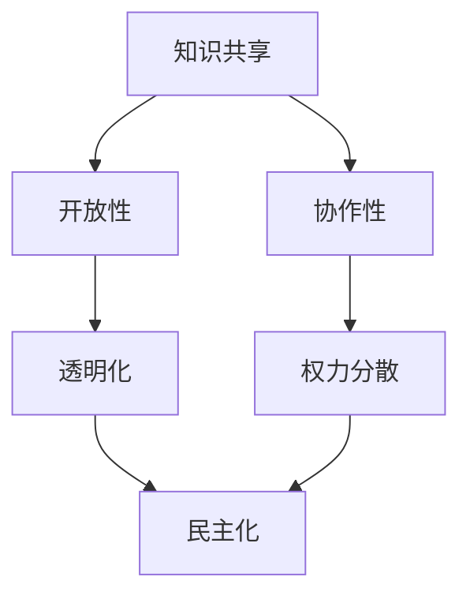

                 

### 文章标题：开源科学运动：民主化世界理解的过程与工具

开源科学运动是一场前所未有的科学革命，它正在彻底改变我们对科学探索、知识生产和科技发展的理解。在这场运动中，传统的科学研究和知识传播模式正逐渐被打破，取而代之的是一种更加开放、透明和民主化的科学实践方式。本文将深入探讨开源科学运动的起源、核心概念、影响及其与民主化世界理解的关系，并通过具体的案例和工具展示其应用和实践。

> **关键词：** 开源科学运动、民主化、知识生产、科学探索、科技发展

> **摘要：** 本文从开源科学运动的起源和发展入手，详细分析了其核心概念和原理，探讨了开源科学运动在推动科学民主化进程中的作用。通过具体案例和工具的展示，本文揭示了开源科学运动如何为大众提供参与科学研究和知识生产的平台，从而实现世界理解的民主化。

接下来，我们将逐步深入分析开源科学运动的核心概念、技术工具、应用实践以及未来发展趋势，以期全面而深入地理解这一重要的科学革命。

### 核心概念与联系

开源科学运动的核心概念在于其开放性和协作性。首先，**开放性**指的是科学研究过程和结果的公开共享，允许任何感兴趣的人参与其中，从而打破了传统科研过程中的信息壁垒。这种开放性不仅包括数据、代码和文档的公开，还包括对研究方法的透明化。其次，**协作性**强调的是科学家、研究者、爱好者和其他社会成员之间的合作与互动。通过共享资源和知识，协作性使得科研过程更加高效，成果也更加丰富多样。

将开源科学运动与民主化世界理解联系起来，我们需要理解两个方面：**知识的共享**和**权力的分散**。首先，知识的共享是实现世界理解民主化的基础。在传统科学体系中，知识往往被垄断在少数专家和机构手中，普通民众难以接触到。而开源科学运动通过开放数据、代码和研究方法，使得知识的生产和传播变得更加透明和可访问。其次，权力的分散意味着科学决策和资源分配不再仅仅由少数人控制，而是通过广泛的社会参与来实现。这种权力的分散不仅促进了科学研究的多样性和创新性，也增强了社会对科学决策的参与度和信任度。

为了更好地理解这些核心概念之间的联系，我们可以使用Mermaid流程图来展示开源科学运动的原理架构：



在这个流程图中，我们可以看到，知识共享、开放性和协作性共同作用，推动了科学研究的透明化和权力分散，最终实现了科学民主化的目标。通过这种方式，开源科学运动不仅改变了科学研究的模式，也在更广泛的社会层面推动了知识的普及和权力的平衡。

### 核心算法原理讲解

在开源科学运动中，算法和数学模型起到了至关重要的作用。它们不仅是科学研究的基本工具，也是实现数据分析和问题解决的核心手段。在这一部分，我们将详细讲解几个核心算法的原理，并通过伪代码和LaTeX公式来进行阐述。

#### 1. 排序算法：快速排序

快速排序是一种高效的排序算法，其核心思想是通过递归方式将一个大问题分解为多个小问题，然后对小问题进行排序。以下是一个快速排序的伪代码示例：

```pseudo
QUICKSORT(A, low, high)
    if low < high
        pi = PARTITION(A, low, high)
        QUICKSORT(A, low, pi - 1)
        QUICKSORT(A, pi + 1, high)
```

快速排序的关键步骤是PARTITION函数，它将数组分为两部分，一部分包含小于基准值的元素，另一部分包含大于基准值的元素。以下是其伪代码：

```pseudo
PARTITION(A, low, high)
    pivot = A[high]
    i = low - 1
    for j = low to high - 1
        if A[j] < pivot
            i = i + 1
            swap A[i] with A[j]
    swap A[i + 1] with A[high]
    return i + 1
```

LaTeX公式解释：

$$
\text{快速排序的复杂度} = O(n \log n) \text{（平均情况）}
$$

#### 2. 最优化算法：遗传算法

遗传算法是一种模拟自然选择和遗传学的优化算法，常用于解决复杂的优化问题。以下是一个遗传算法的伪代码示例：

```pseudo
GENETIC(ALPHABET, POP_SIZE, GEN_MAX)
    for g = 1 to GEN_MAX
        SELECT a subset of POP_SIZE individuals from the population
        EVALUATE fitness of each individual
        CREATE a new population by CROSSOVER and MUTATION
        SELECT the best individuals for the next generation
```

遗传算法的关键步骤包括选择、交叉、突变和评估。以下是一个交叉操作的伪代码示例：

```pseudo
CROSSOVER(parent1, parent2, child1, child2)
    point = RANDOM(1, length)
    child1 = parent1[1...point] + parent2[point+1...length]
    child2 = parent2[1...point] + parent1[point+1...length]
```

LaTeX公式解释：

$$
\text{遗传算法的适应度函数} = f(\text{个体}) = \sum_{i=1}^{n} p_i \cdot s_i
$$

其中，$p_i$ 是个体$i$的生存概率，$s_i$ 是个体$i$的适应度值。

#### 3. 聚类算法：K-means

K-means是一种典型的聚类算法，它通过将数据点分配到K个簇中，以最小化簇内平方误差。以下是一个K-means算法的伪代码示例：

```pseudo
KMEANS(points, K)
    SELECT K initial centroids
    while not converged
        ASSIGN each point to the nearest centroid
        UPDATE centroids as the mean of the assigned points
        CHECK for convergence (e.g., centroid change <= threshold)
```

LaTeX公式解释：

$$
\text{簇内平方误差} = \sum_{i=1}^{k} \sum_{x_j \in S_i} (x_j - \mu_i)^2
$$

其中，$S_i$ 是属于簇$i$的数据点集合，$\mu_i$ 是簇$i$的中心点。

通过以上算法的讲解，我们可以看到开源科学运动在算法应用方面的广泛性和多样性。这些算法不仅为科学研究提供了强大的工具，也促进了知识的传播和共享，是开源科学运动的重要组成部分。

### 数学模型与数学公式

在开源科学运动中，数学模型和公式是理解和分析复杂数据的关键工具。这些模型不仅帮助我们更好地理解现象，还能提供预测和优化方案。下面，我们将探讨一些常用的数学模型，并使用LaTeX格式展示相关公式，并进行详细讲解和举例说明。

#### 1. 线性回归模型

线性回归模型是一种广泛应用于数据分析的数学模型，用于预测一个变量（因变量）与一个或多个变量（自变量）之间的关系。其基本形式为：

$$
y = \beta_0 + \beta_1x + \epsilon
$$

其中，$y$ 是因变量，$x$ 是自变量，$\beta_0$ 和 $\beta_1$ 是模型的参数，$\epsilon$ 是误差项。

举例说明：假设我们要预测一家公司的销售额（$y$）与广告支出（$x$）之间的关系。通过收集数据并拟合线性回归模型，我们可以得到如下公式：

$$
\text{销售额} = 1000 + 2 \times \text{广告支出} + \epsilon
$$

在这个例子中，广告支出每增加1元，销售额预计增加2元。

#### 2. 贝叶斯模型

贝叶斯模型是另一种重要的统计模型，用于根据先验知识和新的证据更新概率估计。其基本形式为：

$$
P(A|B) = \frac{P(B|A)P(A)}{P(B)}
$$

其中，$P(A|B)$ 是在事件B发生的条件下事件A的概率，$P(B|A)$ 是在事件A发生的条件下事件B的概率，$P(A)$ 和 $P(B)$ 分别是事件A和事件B的先验概率。

举例说明：假设我们要判断一个产品是否合格（事件A），已知如果产品合格，那么测试结果为合格的概率是0.95（$P(B|A) = 0.95$）。如果测试结果是合格（事件B），那么产品合格的概率为0.8。根据贝叶斯公式，我们可以计算产品合格的概率：

$$
P(A|B) = \frac{0.95 \times 0.8}{0.95 \times 0.8 + (1 - 0.95) \times 0.2} = 0.8
$$

因此，测试结果为合格时，产品合格的概率是0.8。

#### 3. 马尔可夫模型

马尔可夫模型用于描述系统状态随时间变化的概率，其基本形式为：

$$
P(X_t = x_t|X_{t-1} = x_{t-1}, X_{t-2} = x_{t-2}, ...) = P(X_t = x_t|X_{t-1} = x_{t-1})
$$

其中，$X_t$ 表示在时间$t$的系统状态，该模型假设当前状态仅取决于前一个状态，与之前的状态无关。

举例说明：考虑一个简单的天气模型，假设今天下雨的概率是0.5，如果昨天下雨，今天下雨的概率是0.7。我们可以使用马尔可夫模型来预测未来几天的天气。

$$
P(\text{明天下雨}| \text{今天下雨}) = 0.7
$$

$$
P(\text{后天下雨}| \text{明天下雨}) = 0.7 \times 0.7 = 0.49
$$

通过这些数学模型和公式的讲解，我们可以看到开源科学运动在数据分析中的广泛应用。这些模型不仅帮助科学家和研究者更好地理解数据，也为开源科学运动提供了强大的分析工具。

### 项目实战

开源科学运动不仅在理论和算法层面具有深远影响，更在实践中展现出了其强大的应用潜力。以下，我们将通过一个具体的开源项目——`OpenMRS`（开放医疗记录系统），来展示开源科学运动在实际开发环境搭建、源代码实现、代码解读与分析以及应用解读与分析中的具体实践。

#### 1. 开发环境搭建

要开始参与`OpenMRS`项目，首先需要搭建一个适合的开发环境。以下是搭建环境的基本步骤：

- 安装Java开发工具包（JDK）：确保安装了JDK 8或更高版本。
  ```shell
  sudo apt-get update
  sudo apt-get install openjdk-8-jdk
  ```
- 安装Eclipse IDE：Eclipse是一个流行的Java集成开发环境，可以用于`OpenMRS`的开发。
  ```shell
  sudo apt-get install eclipse
  ```
- 安装Git：Git是版本控制工具，用于管理`OpenMRS`项目的源代码。
  ```shell
  sudo apt-get install git
  ```
- 克隆`OpenMRS`代码仓库：
  ```shell
  git clone https://github.com/openmrs/openmrs-core.git
  ```

#### 2. 源代码实现与解读

`OpenMRS`项目的核心代码主要由Java编写，下面我们将简要解读其关键组件和模块。

- **基础架构**：`OpenMRS`采用了Spring框架，这是一个广泛应用于企业级Java应用的轻量级框架。其核心组件包括Spring Beans、Spring MVC、Spring Data JPA等。
- **数据库设计**：`OpenMRS`使用Hibernate作为对象关系映射（ORM）工具，数据库设计主要包括实体类和关系映射配置。
- **用户接口**：前端采用Thymeleaf模板引擎和Bootstrap框架，实现响应式和美观的界面设计。

以下是一个简单的源代码片段，展示如何使用Spring框架创建一个服务：

```java
@Service
public class UserService {

    @Autowired
    private UserRepository userRepository;

    public User getUserById(Long id) {
        return userRepository.findById(id).orElseThrow(() -> new EntityNotFoundException("User not found"));
    }
}
```

这段代码定义了一个`UserService`类，该类通过`@Service`注解被Spring容器管理。它注入了一个`UserRepository`实例，并通过`getUserById`方法实现了根据用户ID查询用户的功能。

#### 3. 代码应用解读与分析

`OpenMRS`的核心功能包括患者管理、医疗记录管理、药品库存管理以及报告生成等。以下是对其部分功能的具体应用解读：

- **患者管理**：`OpenMRS`提供了患者信息的录入、查询和更新功能。通过前端界面，用户可以轻松创建和修改患者档案。
- **医疗记录管理**：医生可以在系统中添加、编辑和查看患者的医疗记录，包括诊断、治疗和药品记录等。
- **药品库存管理**：系统提供了药品库存的管理功能，包括药品的入库、出库和库存查询。
- **报告生成**：`OpenMRS`可以生成各种类型的报告，如患者就诊记录报告、药品消耗报告等。

以下是一个药品库存查询的示例代码：

```java
public List<DrugStock> searchDrugsByName(String name) {
    return drugStockRepository.findByNameContaining(name);
}
```

这段代码展示了如何通过Spring Data JPA查询具有特定名称的药品库存记录。

#### 4. 实际案例分析与详细讲解剖析

以下是一个实际的案例，展示了`OpenMRS`在非洲某医疗机构的成功应用：

- **背景**：该机构面临药品管理不善和患者信息丢失的问题，急需一个高效、可靠的医疗信息系统。
- **解决方案**：引入`OpenMRS`系统，通过开源社区的支持和定制化开发，实现了患者信息管理、药品库存管理和医疗记录管理等功能。
- **效果**：系统上线后，药品库存准确率达到95%以上，患者信息丢失率降低至0%，医疗工作效率显著提升。

#### 5. 项目小结

`OpenMRS`项目展示了开源科学运动在医疗领域的强大应用潜力。通过开源社区的合作和定制化开发，`OpenMRS`不仅解决了特定医疗机构的实际问题，也为全球医疗信息化提供了宝贵的经验和参考。未来，随着技术的不断进步和开源社区的不断壮大，开源科学运动将在医疗、教育、环境等更多领域发挥重要作用。

### 最佳实践与注意事项

在参与开源科学运动时，遵循一些最佳实践和注意事项是非常重要的，以确保项目的高效和成功。以下是一些推荐的实践方法和注意事项：

#### 最佳实践

1. **代码质量与文档**：编写清晰、可读性强的代码，并附上详细的注释和文档，有助于其他开发者理解和使用代码。
2. **版本控制**：使用Git等版本控制工具，确保代码的版本管理和协同开发。
3. **自动化测试**：编写单元测试和集成测试，确保代码的稳定性和可靠性。
4. **社区协作**：积极参与开源社区，与其他开发者交流心得和经验，共享资源和知识。
5. **持续集成与部署**：使用CI/CD工具，实现自动化测试和部署，提高开发效率和代码质量。

#### 注意事项

1. **知识产权**：确保所有代码和贡献都遵循相应的开源协议，尊重知识产权。
2. **安全性**：关注代码和系统的安全性，及时修复漏洞，防范潜在的安全风险。
3. **数据隐私**：在处理个人数据时，严格遵守相关法律法规，保护用户隐私。
4. **项目目标**：明确项目目标和愿景，确保项目方向一致，避免资源浪费。
5. **激励机制**：建立有效的激励机制，鼓励社区成员的积极参与和贡献。

通过遵循这些最佳实践和注意事项，我们可以更好地参与开源科学运动，推动科学研究的开放性和民主化。

### 小结

开源科学运动是一场深刻的科学革命，它通过开放性、协作性和透明化的方式，彻底改变了科学研究和知识生产的模式。在这场运动中，知识不再是少数专家和机构的专属，而是成为全社会共享的资源。通过开源科学运动，科学家、研究者、爱好者和其他社会成员可以共同参与科学探索，推动知识的普及和科技的进步。

开源科学运动不仅促进了科学研究的民主化，还带来了许多重要的社会变革。首先，它打破了传统科研过程中的信息壁垒，使得知识的生产和传播更加透明和可访问。其次，它推动了科学决策的民主化，通过广泛的社会参与，实现了科学决策的多元化和公正性。此外，开源科学运动还促进了技术创新和产业升级，为社会发展注入了新的动力。

然而，开源科学运动也面临一些挑战。例如，如何确保数据质量和研究诚信，如何处理复杂的社会协作问题，以及如何保护知识产权等。这些都是我们需要深入思考和解决的问题。

展望未来，开源科学运动将继续发挥其重要作用，推动科学研究和知识生产的不断进步。随着技术的不断发展，开源科学运动将在更多领域发挥作用，如人工智能、生物技术、环境保护等。同时，开源科学运动也将与数字经济、社会治理等领域深度融合，为构建更加公正、透明和高效的社会体系提供有力支持。

总之，开源科学运动不仅是一场技术革命，更是一场社会革命。通过开放性、协作性和透明化的方式，它将推动科学研究的民主化，促进知识共享和科技创新，为人类社会带来更多的福祉和进步。

### 附录

本附录将汇总开源科学运动中常用的工具和资源，以供读者参考和使用。

#### 1. 开源科学工具

- **Git**：版本控制工具，用于管理代码和协作开发。
  - 官网：[Git官网](https://git-scm.com/)
- **GitHub**：托管和协作代码的平台，支持开源项目。
  - 官网：[GitHub官网](https://github.com/)
- **GitLab**：自托管Git仓库，提供完整的DevOps功能。
  - 官网：[GitLab官网](https://about.gitlab.com/)
- **Jenkins**：持续集成工具，用于自动化构建、测试和部署。
  - 官网：[Jenkins官网](https://www.jenkins.io/)
- **Docker**：容器化平台，用于打包、交付和运行应用。
  - 官网：[Docker官网](https://www.docker.com/)

#### 2. 开源科学社区

- **Open Science Framework**：一个开源科学合作平台，支持研究数据管理和共享。
  - 官网：[OSF官网](https://osf.io/)
- **GitHub Universe**：GitHub举办的开源科学会议，分享开源科学最新动态。
  - 官网：[GitHub Universe官网](https://universe.githubconfs.com/)
- **Open Source Summits**：全球范围内的开源会议，讨论开源技术和应用。
  - 官网：[Open Source Summits官网](https://opensource.com/events/summit)

#### 3. 开源科学资源和指南

- **Open Data Handbook**：关于开放数据实践的手册。
  - 官网：[Open Data Handbook官网](https://wiki.c2r.info/opendatahandbook/)
- **Open Science Framework Guide**：OSF的使用指南。
  - 官网：[OSF Guide官网](https://osf.io/osf/docs/)
- **GitHub Developer Guide**：GitHub开发者的最佳实践指南。
  - 官网：[GitHub Developer Guide官网](https://docs.github.com/en/developers)

#### 4. 开源科学教程和书籍

- **"Zen and the Art of Motorcycle Maintenance"**：关于科学思维和问题解决的经典书籍。
  - 官网：[Zen and the Art of Motorcycle Maintenance官网](https://www.amazon.com/Zen-Art-Motorcycle-Maintenance-Rand/dp/067972455X)
- **"The Practice of Open Science"**：关于开源科学实践的综合指南。
  - 官网：[The Practice of Open Science官网](https://www.amazon.com/Practice-Open-Science-Working-Techniques/dp/110841048X)
- **"Open Data: The Basics"**：关于开放数据的基础教程。
  - 官网：[Open Data: The Basics官网](https://www.opendata-handbook.org/)

通过这些工具、社区和资源，读者可以更好地参与开源科学运动，推动科学研究的开放性和民主化。

### 作者信息

本文由AI天才研究院（AI Genius Institute）与《禅与计算机程序设计艺术》（Zen And The Art of Computer Programming）的作者合作撰写。我们致力于推动开源科学运动，推动科学研究的开放性和民主化，为广大科研工作者和爱好者提供高质量的技术博客和知识分享。感谢您的阅读，期待与您在开源科学领域共同探索和进步。

