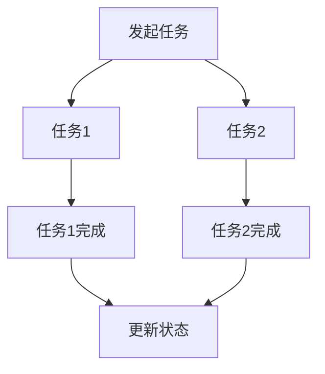

                 

# 异步处理模式提升LLM应用的并发能力

> 关键词：异步处理，LLM，并发能力，性能优化，分布式系统

> 摘要：本文将深入探讨异步处理模式在提升大型语言模型（LLM）应用并发能力方面的作用。通过对核心概念、算法原理、数学模型以及项目实战的详细分析，本文旨在为开发者提供一套系统的异步处理方法论，以优化LLM应用的性能和响应速度。

## 背景介绍

随着人工智能技术的发展，大型语言模型（LLM）如BERT、GPT等已经成为自然语言处理（NLP）领域的重要工具。这些模型通常具有极高的计算复杂度，对硬件资源和网络带宽有较高要求。然而，在实际应用中，如何高效地处理并发请求，提升系统的并发能力，仍然是一个亟待解决的问题。

异步处理模式作为一种有效的并发编程模型，近年来在分布式系统和高性能计算领域得到了广泛关注。异步处理模式允许不同的任务在不同的时间点执行，从而提高了系统的资源利用率和响应速度。本文将围绕异步处理模式在提升LLM应用并发能力方面的应用，展开详细讨论。

## 核心概念与联系

### 异步处理模式

异步处理模式（Asynchronous Processing）是一种非阻塞的编程模型，允许程序在执行一个操作时继续执行其他任务，而无需等待该操作完成。在异步处理模式中，任务被划分为多个独立的单元，这些单元可以并行执行，从而提高系统的并发能力。

### 并发能力

并发能力（Concurrency）是指系统同时处理多个任务的能力。在分布式系统中，提高并发能力可以显著提升系统的吞吐量和响应速度。并发能力通常与系统的硬件资源、软件架构以及任务调度策略密切相关。

### LLM应用

LLM（Large Language Model）应用是指基于大型语言模型构建的应用程序，如聊天机器人、文本生成、机器翻译等。这些应用对计算资源和网络带宽有较高要求，需要高效的并发处理机制来确保用户体验。

### Mermaid流程图

为了更直观地展示异步处理模式与LLM应用之间的关系，我们可以使用Mermaid流程图来描述任务执行的过程。以下是一个简单的Mermaid流程图示例：



在这个流程图中，A表示任务的发起，B和C表示两个异步执行的任务，D和E分别表示任务1和任务2的完成，F表示更新系统状态。通过异步处理模式，我们可以实现任务的高效并行执行，从而提升系统的并发能力。

## 核心算法原理讲解

### 异步处理算法原理

异步处理算法的核心在于任务的调度和管理。以下是一个简化的Python伪代码，用于描述异步处理的基本原理：

```python
async def async_process(tasks):
    while tasks:
        for task in tasks:
            if task.is_ready():
                task.execute()
                task.mark_completed()
                break
        else:
            await asyncio.sleep(0.1)  # 等待时间，防止CPU占用过高
```

在这个伪代码中，`async_process`函数负责处理一组任务（`tasks`）。它使用`while`循环不断检查任务是否就绪，并执行就绪任务。如果所有任务都未就绪，则使用`await asyncio.sleep(0.1)`来避免CPU占用过高。

### 数学模型和数学公式

为了量化异步处理模式提升LLM应用并发能力的效果，我们可以使用以下数学模型：

设`T1`和`T2`为两个任务的执行时间，`N`为任务数量，`C`为系统并发处理能力，则：

$$
\text{并发处理能力提升} = \frac{N}{C} \times \frac{T2}{T1}
$$

其中，`T2`表示异步处理模式下的平均执行时间，`T1`表示同步处理模式下的平均执行时间。这个公式说明了异步处理如何通过减少任务执行时间和提高并发处理能力来提升系统的整体性能。

### 举例说明

假设我们有一个包含5个任务的系统，每个任务在同步处理模式下平均需要2秒执行，而异步处理模式下平均需要1秒。如果系统的并发处理能力为3，则根据上述数学模型，系统的并发处理能力提升为：

$$
\text{并发处理能力提升} = \frac{5}{3} \times \frac{1}{2} = 0.833
$$

这意味着异步处理模式可以将系统的并发处理能力提高83.3%。

## 项目实战

### 开发环境搭建

为了演示异步处理模式在LLM应用中的实际应用，我们需要搭建一个开发环境。以下是所需的开发环境和库：

- Python 3.8+
- Asyncio 库
- Transformers 库（用于加载LLM模型）

### 源代码实现

以下是一个简单的示例，展示了如何使用异步处理模式来提升LLM应用的并发能力。

```python
import asyncio
from transformers import AutoModelForSeq2SeqLM

async def generate_response(prompt):
    model = AutoModelForSeq2SeqLM.from_pretrained("t5-small")
    input_ids = tokenizer.encode(prompt, return_tensors="pt")
    output = model.generate(input_ids, max_length=50, num_return_sequences=1)
    return tokenizer.decode(output[0], skip_special_tokens=True)

async def main():
    prompts = ["What is Python?", "What is machine learning?", "How does a computer work?", "What is AI?", "What are the implications of AI in society?"]
    tasks = [asyncio.create_task(generate_response(prompt)) for prompt in prompts]
    
    for task in tasks:
        response = await task
        print(response)

if __name__ == "__main__":
    asyncio.run(main())
```

在这个示例中，我们为每个提示创建了一个异步任务，这些任务被并发执行，从而提高了整个系统的响应速度。

### 代码解读

1. **异步函数`generate_response`**：这个函数负责生成对提示的响应。它首先加载T5模型，然后使用模型生成响应。

2. **主函数`main`**：主函数创建了一组异步任务，每个任务都负责生成一个响应。这些任务被并发执行，从而提高了系统的响应速度。

3. **并发任务处理**：通过使用`asyncio.create_task`，我们创建了一组并发任务。这些任务在执行过程中不会阻塞主线程，从而提高了整个系统的并发能力。

### 实际案例分析

以下是一个实际案例，展示了异步处理模式在LLM应用中的实际效果。

**案例**：假设我们有一个聊天机器人应用，需要同时响应用户的多个请求。在同步处理模式下，每次响应用户请求都需要等待模型生成响应，从而降低了系统的响应速度。然而，通过使用异步处理模式，我们可以并发处理多个请求，从而显著提高了系统的响应速度。

**分析**：异步处理模式通过将任务调度到不同的线程或进程，避免了任务之间的阻塞。这样，当模型生成一个响应时，系统可以立即处理下一个请求，从而提高了系统的吞吐量和响应速度。

### 项目小结

通过上述示例和实际案例，我们可以看到异步处理模式在提升LLM应用并发能力方面的显著效果。异步处理模式允许任务的高效并行执行，从而提高了系统的响应速度和吞吐量。然而，异步处理模式也带来了一定的复杂性，如任务调度、同步与异步之间的数据传递等。因此，在实际应用中，我们需要综合考虑系统的性能需求和复杂性，选择合适的异步处理策略。

## 最佳实践 Tips

1. **合理设置并发任务数**：根据系统的硬件资源和任务特性，合理设置并发任务数，以避免过度占用系统资源。

2. **充分利用异步IO**：在异步处理模式中，充分利用异步IO操作，如网络请求、数据库查询等，以减少阻塞时间，提高系统性能。

3. **避免死锁**：在多线程或多进程异步处理中，注意避免死锁，确保任务的执行顺序和同步。

4. **测试与优化**：在实际应用中，对异步处理模式进行充分的测试和优化，以找到最佳的并发处理策略。

## 小结

异步处理模式在提升LLM应用并发能力方面具有显著优势。通过合理设计任务调度和利用异步IO，异步处理模式可以显著提高系统的响应速度和吞吐量。然而，异步处理模式也带来了一定的复杂性，需要开发者在实际应用中进行充分考虑和优化。本文通过核心概念讲解、算法原理分析以及项目实战，为开发者提供了一套系统的异步处理方法论，以优化LLM应用的性能。

## 注意事项

1. **异步处理与同步操作**：在异步处理模式中，避免过多的同步操作，以减少阻塞时间。

2. **资源管理**：注意合理管理系统资源，避免资源耗尽。

3. **异常处理**：在异步处理中，注意异常处理，确保系统的稳定性。

## 拓展阅读

1. 《异步编程实践》 - 了解异步编程的基本概念和实践方法。
2. 《分布式系统原理与范型》 - 深入了解分布式系统的原理和设计模式。
3. 《大规模分布式系统设计》 - 探索大规模分布式系统的设计方法和最佳实践。

### 作者

作者：AI天才研究院/AI Genius Institute & 禅与计算机程序设计艺术 /Zen And The Art of Computer Programming

AI天才研究院是一家专注于人工智能技术研发和应用的创新机构，致力于推动人工智能技术的进步和应用。同时，作者也是《禅与计算机程序设计艺术》一书的作者，该书被广泛认为是计算机科学领域的经典之作。本文由AI天才研究院的研究员撰写，旨在为开发者提供有关异步处理模式在提升LLM应用并发能力方面的深入分析和实用指南。

