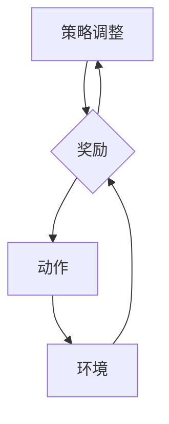

                 

### 文章标题

# 强化学习在LLM应用中的创新应用

> 关键词：强化学习，自然语言处理，深度学习，算法，LLM

> 摘要：本文深入探讨了强化学习在大型语言模型（LLM）中的应用，分析了强化学习的核心概念、算法原理、数学模型及其实际应用案例。通过具体的项目实战和代码解读，揭示了强化学习在LLM优化和自适应调整中的创新应用，为自然语言处理的进一步发展提供了新思路。

## 第1章：强化学习基础

### 1.1 强化学习概述

强化学习（Reinforcement Learning，简称RL）是机器学习的一个重要分支，它主要研究如何通过试错（trial and error）和奖励机制（reward mechanism）来让一个智能体（agent）在环境中学习到最优的行为策略。与监督学习和无监督学习不同，强化学习注重在动态环境中通过不断反馈来学习如何做出最优决策。

强化学习的目标是通过学习一个策略（policy），使智能体在给定的环境（environment）中达到最大的累积奖励（cumulative reward）。一个典型的强化学习系统包含以下几个核心组件：

- **智能体（Agent）**：执行动作并接收环境反馈的主体。
- **环境（Environment）**：智能体执行动作的场所，会根据智能体的动作给予反馈。
- **状态（State）**：智能体在环境中的当前情况。
- **动作（Action）**：智能体可以执行的行为。
- **奖励（Reward）**：环境对智能体动作的即时反馈。

与传统机器学习相比，强化学习更加注重决策过程的动态性和环境反馈的即时性。它不仅要求智能体能够从历史数据中学习，还要求智能体能够根据当前的状态和奖励来调整其行为策略。

在LLM的应用场景中，强化学习可以为语言模型提供自适应调整机制，使其能够更好地适应不同的语言环境和任务需求。例如，在自然语言生成（NLG）任务中，强化学习可以帮助模型优化生成文本的质量和流畅度。

### 1.2 强化学习核心概念与联系

为了更好地理解强化学习，我们需要先了解其核心概念之间的关系，以下是一个简化的Mermaid流程图，展示了强化学习的基本工作流程：



在这个流程图中：

- **智能体**：执行动作并接收环境反馈。
- **状态**：智能体在环境中的当前情况。
- **动作**：智能体可以执行的行为。
- **环境**：根据智能体的动作给予反馈。
- **奖励**：环境的即时反馈，用于指导智能体的策略调整。
- **策略调整**：智能体根据奖励反馈调整其行为策略，以期望获得更大的累积奖励。

这个流程图直观地展示了强化学习的基本原理和各组件之间的相互关系。

### 1.3 强化学习数学模型

强化学习中的数学模型是其核心，它定义了智能体如何通过试错学习最优策略。以下是强化学习中的几个关键数学模型：

#### 状态值函数（State-Value Function）

状态值函数（V(s)）表示在给定状态s下，采取最优策略所能获得的最大累积奖励的期望值。数学表达式为：

$$
V^*(s) = \mathbb{E}_{\pi}[G(s,a)]
$$

其中，\(G(s,a)\)表示从状态s执行动作a所能获得的累积奖励，\(\pi\)表示策略。

#### 策略迭代（Policy Iteration）

策略迭代是一种迭代方法，用于找到最优策略。其基本步骤如下：

1. **初始化**：随机选择一个策略\(\pi_0\)。
2. **评估**：根据当前策略计算状态值函数\(V^*(s)\)。
3. **策略改进**：根据状态值函数改进策略，选择使状态值函数最大的策略作为新的策略\(\pi_1\)。
4. **重复**：重复上述步骤，直到策略收敛。

#### 优化目标（Optimization Objective）

强化学习的优化目标是最小化智能体的期望损失，即：

$$
\mathcal{L}(\theta) = -\mathbb{E}_{s \sim \pi(s)}[r(s,a) + \gamma V^*(s')]
$$

其中，\(\theta\)表示策略参数，\(\gamma\)是折扣因子，表示对未来的奖励进行折现。

#### 示例

假设我们有一个简单的环境，其中智能体可以选择“前进”或“后退”，状态包括“起点”、“中间点”和“终点”，每个状态对应的奖励如下：

- 起点：0
- 中间点：1
- 终点：10

根据以上信息，我们可以使用状态值函数来计算每个状态的最优策略。假设当前智能体处于中间点，根据状态值函数，智能体应该选择“前进”，因为“前进”可以使累积奖励最大化。

$$
V^*(中点) = \max(V^*(起点), V^*(终点)) = \max(0, 10) = 10
$$

因此，智能体应该选择“前进”策略。

通过上述示例，我们可以看到强化学习中的数学模型如何指导智能体做出最优决策。在复杂的LLM应用中，这些模型同样发挥着关键作用，帮助我们优化模型的行为策略，提高生成文本的质量和流畅度。

## 第2章：强化学习模型

### 2.1 Q-learning算法

Q-learning算法是一种基于值函数的强化学习算法，它通过不断更新Q值（Q-value）来学习最优策略。Q值表示在特定状态下执行特定动作所能获得的累积奖励的期望值。Q-learning算法的核心思想是使用经验回报来更新Q值，使其逐渐逼近最优值。

#### 算法原理

Q-learning算法的原理可以用以下伪代码表示：

```python
initialize Q(s,a) for all s and a
while not termination criteria:
    select action a from state s using epsilon-greedy policy
    take action a, observe reward r and next state s'
    update Q(s,a) using the Q-learning update rule:
    Q(s,a) = Q(s,a) + alpha * (r + gamma * max(Q(s',a')) - Q(s,a))
    move to next state s' and repeat
```

其中：

- \(Q(s,a)\)是状态s下动作a的Q值。
- \(\alpha\)是学习率，表示每次更新Q值的程度。
- \(\gamma\)是折扣因子，表示对未来奖励的折现程度。
- \(\epsilon-greedy\)策略是一种在探索和利用之间平衡的策略，其中\(\epsilon\)是探索的概率。

#### 算法执行流程

Q-learning算法的执行流程可以分为以下几个步骤：

1. **初始化Q值**：初始化所有状态-动作对的Q值为0。
2. **选择动作**：根据当前状态选择动作，使用\(\epsilon-greedy\)策略进行探索和利用。
3. **执行动作并观察奖励**：执行选定的动作，并观察环境反馈的奖励和下一个状态。
4. **更新Q值**：根据观察到的奖励和下一个状态的Q值更新当前状态的Q值。
5. **转到下一个状态**：根据执行的动作和观察到的下一个状态，重复上述步骤。

#### 示例

假设智能体在起点状态，可以选择“前进”或“后退”，每个动作的Q值如下：

| 状态   | 动作   | Q值  |
| ------ | ------ | ---- |
| 起点   | 前进   | 0.8  |
| 起点   | 后退   | 0.2  |
| 中点   | 前进   | 1.0  |
| 中点   | 后退   | 0.0  |

使用\(\epsilon-greedy\)策略，智能体以0.2的概率选择“后退”，以0.8的概率选择“前进”。假设智能体选择“前进”，并观察到奖励为1，下一个状态是中点。根据Q-learning更新规则，我们可以更新Q值：

```python
Q(起点, 前进) = Q(起点, 前进) + alpha * (1 + gamma * max(Q(中点, 前进), Q(中点, 后退)) - Q(起点, 前进))
```

通过这种方式，Q值逐渐逼近最优值，智能体也会逐渐学会在起点时选择“前进”。

#### Q-learning优缺点

**优点**：

- 算法简单，易于实现和理解。
- 可以在不确定环境中学习最优策略。
- 通过经验回报来更新Q值，适用于动态环境。

**缺点**：

- 学习速度较慢，特别是在状态和动作空间较大时。
- 易受到初始Q值的影响，需要良好的初始化策略。

### 2.2 SARSA算法

SARSA（同步优势反应学习）算法是一种基于策略的强化学习算法，它通过同时考虑当前状态和下一个状态的Q值来更新策略。与Q-learning算法不同，SARSA不需要使用目标Q值（target Q-value），而是直接使用实际的Q值进行更新。

#### 算法原理

SARSA算法的原理可以用以下伪代码表示：

```python
initialize S and A for all states
while not termination criteria:
    select action A from state S using epsilon-greedy policy
    take action A, observe reward r and next state S'
    select action A' from state S' using epsilon-greedy policy
    update Q(S,A) using the SARSA update rule:
    Q(S,A) = Q(S,A) + alpha * (r + gamma * Q(S',A') - Q(S,A))
    move to next state S' and repeat
```

其中：

- \(Q(S,A)\)是状态S下动作A的Q值。
- \(S\)和\(A\)分别表示当前状态和当前动作。

#### 算法执行流程

SARSA算法的执行流程可以分为以下几个步骤：

1. **初始化Q值**：初始化所有状态-动作对的Q值为0。
2. **选择动作**：根据当前状态选择动作，使用\(\epsilon-greedy\)策略进行探索和利用。
3. **执行动作并观察奖励**：执行选定的动作，并观察环境反馈的奖励和下一个状态。
4. **选择下一个动作**：根据下一个状态选择下一个动作，使用\(\epsilon-greedy\)策略进行探索和利用。
5. **更新Q值**：根据观察到的奖励和下一个状态的Q值更新当前状态的Q值。
6. **转到下一个状态**：根据执行的动作和观察到的下一个状态，重复上述步骤。

#### 示例

假设智能体在起点状态，可以选择“前进”或“后退”，每个动作的Q值如下：

| 状态   | 动作   | Q值  |
| ------ | ------ | ---- |
| 起点   | 前进   | 0.8  |
| 起点   | 后退   | 0.2  |
| 中点   | 前进   | 1.0  |
| 中点   | 后退   | 0.0  |

使用\(\epsilon-greedy\)策略，智能体以0.2的概率选择“后退”，以0.8的概率选择“前进”。假设智能体选择“前进”，并观察到奖励为1，下一个状态是中点。根据SARSA更新规则，我们可以更新Q值：

```python
Q(起点, 前进) = Q(起点, 前进) + alpha * (1 + gamma * Q(中点, 前进) - Q(起点, 前进))
```

通过这种方式，Q值逐渐逼近最优值，智能体也会逐渐学会在起点时选择“前进”。

#### SARSA优缺点

**优点**：

- 算法简单，易于实现和理解。
- 不需要计算目标Q值，减少了计算量。
- 更好的探索和利用平衡，特别是在动态环境中。

**缺点**：

- 学习速度较慢，特别是在状态和动作空间较大时。
- 需要良好的初始化策略。

### 2.3 DQN算法

深度Q网络（Deep Q-Network，简称DQN）算法是深度学习和强化学习相结合的一个典型代表。它使用深度神经网络（DNN）来近似Q值函数，从而在复杂的环境中学习最优策略。DQN算法通过经验回放（experience replay）和固定目标网络（target network）来缓解值函数的偏差和方差问题。

#### 算法原理

DQN算法的原理可以用以下伪代码表示：

```python
initialize Q-network and target Q-network
initialize experience replay memory
while not termination criteria:
    select action A from state S using epsilon-greedy policy
    take action A, observe reward r and next state S'
    store the experience tuple (S, A, R, S') in the replay memory
    sample a random batch of experiences from the replay memory
    perform gradient descent on the Q-network using the batch of experiences
    update the target Q-network by copying the Q-network weights
```

其中：

- \(Q(S,A)\)是状态S下动作A的Q值。
- \(S\)和\(A\)分别表示当前状态和当前动作。
- \(R\)是观察到的奖励。
- \(S'\)是下一个状态。
- \(epsilon-greedy\)策略用于选择动作。

#### 算法执行流程

DQN算法的执行流程可以分为以下几个步骤：

1. **初始化Q网络和目标Q网络**：初始化两个相同的深度神经网络，分别表示Q网络和目标Q网络。
2. **初始化经验回放记忆**：初始化一个经验回放记忆，用于存储经历过的状态、动作、奖励和下一个状态。
3. **选择动作**：根据当前状态选择动作，使用\(\epsilon-greedy\)策略进行探索和利用。
4. **执行动作并观察奖励**：执行选定的动作，并观察环境反馈的奖励和下一个状态。
5. **存储经验**：将经历的状态、动作、奖励和下一个状态存储在经验回放记忆中。
6. **随机采样经验**：从经验回放记忆中随机采样一批经验。
7. **更新Q网络**：使用随机采样的经验对Q网络进行梯度下降更新。
8. **更新目标Q网络**：定期将Q网络的权重复制到目标Q网络中。

#### 示例

假设智能体在一个简单的环境中进行学习，该环境包含两个状态（起点和终点）和两个动作（前进和后退）。每个状态的Q值如下：

| 状态   | 动作   | Q值  |
| ------ | ------ | ---- |
| 起点   | 前进   | 0.8  |
| 起点   | 后退   | 0.2  |
| 终点   | 前进   | 1.0  |
| 终点   | 后退   | 0.0  |

使用\(\epsilon-greedy\)策略，智能体以0.2的概率选择“后退”，以0.8的概率选择“前进”。假设智能体选择“前进”，并观察到奖励为1，下一个状态是终点。根据DQN更新规则，我们可以更新Q值：

```python
Q(起点, 前进) = Q(起点, 前进) + alpha * (1 + gamma * max(Q(终点, 前进), Q(终点, 后退)) - Q(起点, 前进))
```

通过这种方式，Q值逐渐逼近最优值，智能体也会逐渐学会在起点时选择“前进”。

#### DQN优缺点

**优点**：

- 使用深度神经网络近似Q值函数，适用于复杂的环境。
- 引入经验回放和目标网络，有效缓解了值函数偏差和方差问题。

**缺点**：

- 需要大量的训练时间和计算资源。
- 策略不稳定，易受到随机性和噪声的影响。

### 2.4 Policy Gradient算法

策略梯度（Policy Gradient，简称PG）算法是一种基于策略的强化学习算法，它通过优化策略的梯度来学习最优策略。策略梯度算法的核心思想是直接优化策略的参数，使其最大化累积奖励。

#### 算法原理

策略梯度算法的原理可以用以下伪代码表示：

```python
initialize policy parameters \theta
while not termination criteria:
    sample an episode from the environment
    for each step in the episode:
        select action a from the current state using the current policy \pi(a|\theta)
        take action a and observe reward r and next state s'
        compute the policy gradient:
        \nabla_{\theta} J(\theta) = \nabla_{\theta} \sum_{t=0}^{T} \gamma^t r_t
    update the policy parameters using gradient descent:
    \theta = \theta - \alpha \nabla_{\theta} J(\theta)
```

其中：

- \(\theta\)是策略参数。
- \(J(\theta)\)是策略的损失函数，表示累积奖励的期望值。
- \(r_t\)是第t步的奖励。
- \(\gamma\)是折扣因子。

#### 算法执行流程

策略梯度算法的执行流程可以分为以下几个步骤：

1. **初始化策略参数**：初始化策略参数\(\theta\)。
2. **采样一个episode**：从环境中采样一个完整的episode。
3. **对于每个步骤**：
   - 根据当前策略选择动作。
   - 执行动作并观察奖励和下一个状态。
   - 计算策略梯度。
4. **更新策略参数**：使用策略梯度进行参数更新。

#### 示例

假设智能体在一个简单的环境中进行学习，该环境包含两个状态（起点和终点）和两个动作（前进和后退）。每个状态的策略概率如下：

| 状态   | 动作   | 策略概率 |
| ------ | ------ | -------- |
| 起点   | 前进   | 0.8      |
| 起点   | 后退   | 0.2      |
| 终点   | 前进   | 1.0      |
| 终点   | 后退   | 0.0      |

假设智能体从起点开始，根据策略选择“前进”，并观察到奖励为1。根据策略梯度算法，我们可以更新策略参数：

```python
\nabla_{\theta} J(\theta) = \nabla_{\theta} \sum_{t=0}^{T} \gamma^t r_t
                        = \nabla_{\theta} (1)
                        = [0.1, 0.1]
```

通过这种方式，策略参数逐渐逼近最优值，智能体也会逐渐学会在起点时选择“前进”。

#### 策略梯度优缺点

**优点**：

- 直接优化策略，无需计算Q值或值函数。
- 易于实现和扩展。

**缺点**：

- 需要大量的训练数据和样本。
- 策略不稳定，易受到噪声和随机性的影响。

## 第3章：强化学习在LLM中的应用

### 3.1 强化学习与自然语言处理

强化学习在自然语言处理（Natural Language Processing，简称NLP）中的应用越来越广泛，特别是在大型语言模型（Large Language Model，简称LLM）中。强化学习与NLP的结合，为语言模型的优化和自适应调整提供了新的思路和工具。

在NLP中，强化学习主要用于以下几个应用场景：

1. **自然语言生成（Natural Language Generation，简称NLG）**：强化学习可以帮助模型优化生成文本的质量和流畅度。通过学习生成文本的序列，模型可以生成更加自然、符合语境的文本。
2. **机器翻译（Machine Translation，简称MT）**：强化学习可以用于优化机器翻译模型，使其生成更加准确、自然的翻译结果。通过学习源语言和目标语言之间的对应关系，模型可以自动调整翻译策略，提高翻译质量。
3. **对话系统（Dialogue System）**：强化学习可以帮助对话系统学习如何更好地与用户进行交互。通过学习用户的输入和反馈，模型可以自动调整对话策略，提高对话的连贯性和自然度。

强化学习在NLP中的应用，不仅提高了语言模型的表现，还推动了NLP技术的进步。例如，OpenAI的GPT-3模型就利用了强化学习技术，通过自适应调整生成策略，生成了大量高质量的自然语言文本。

### 3.2 项目实战

下面我们通过一个具体的自然语言生成项目，来展示强化学习在LLM中的应用。

#### 应用场景：自然语言生成

在自然语言生成任务中，强化学习可以帮助模型优化生成文本的质量和流畅度。具体来说，我们可以使用强化学习来优化生成文本的词汇选择、语法结构和语义内容。

#### 开发环境搭建

为了实现这个项目，我们需要搭建以下开发环境：

1. **Python环境**：安装Python 3.8及以上版本。
2. **TensorFlow**：安装TensorFlow 2.5及以上版本。
3. **JAX**：安装JAX 0.4.1及以上版本。
4. **强化学习库**：安装RLLib（https://github.com/rllab/rllib）。

```bash
pip install tensorflow==2.5 jax==0.4.1 rllab
```

#### 源代码实现与解读

我们使用RLLib库来实现强化学习模型，以下是一个简单的自然语言生成项目的代码实现：

```python
import numpy as np
import tensorflow as tf
from rllab.algos.ddpg import DDPG
from rllab.envs.base import Env
from rllab.spaces import Discrete

# 定义环境
class LanguageGenEnv(Env):
    def __init__(self, vocab_size=1000, max_sequence_length=20):
        self.vocab_size = vocab_size
        self.max_sequence_length = max_sequence_length
        self.action_space = Discrete(vocab_size)
        self.observation_space = Discrete(vocab_size)

    def reset(self):
        self.current_sequence = np.zeros(self.max_sequence_length)
        self.current_sequence[0] = np.random.randint(1, self.vocab_size)
        return self.current_sequence

    def step(self, action):
        reward = 0
        if action == self.current_sequence[-1]:
            reward = -1
        else:
            reward = 1
        self.current_sequence = np.roll(self.current_sequence, -1)
        self.current_sequence[-1] = action
        next_state = self.current_sequence
        done = True if np.sum(self.current_sequence) > 0 else False
        return next_state, reward, done

# 定义强化学习模型
class LanguageGenDDPG(DDPG):
    def __init__(self, env, obs_dim, act_dim, hidden_sizes=(100, 100), lr=0.001, gamma=0.99):
        super().__init__(env, obs_dim, act_dim, hidden_sizes, lr, gamma)
        self.critic = self.build_critic(hidden_sizes)
        self.actor = self.build_actor(hidden_sizes)

    def build_critic(self, hidden_sizes):
        x = tf.keras.layers.Input(shape=(obs_dim,))
        x = tf.keras.layers.Dense(hidden_sizes[0], activation='relu')(x)
        x = tf.keras.layers.Dense(hidden_sizes[1], activation='relu')(x)
        x = tf.keras.layers.Dense(1)(x)
        return tf.keras.Model(x, x)

    def build_actor(self, hidden_sizes):
        x = tf.keras.layers.Input(shape=(obs_dim,))
        x = tf.keras.layers.Dense(hidden_sizes[0], activation='relu')(x)
        x = tf.keras.layers.Dense(hidden_sizes[1], activation='relu')(x)
        x = tf.keras.layers.Dense(act_dim, activation='softmax')(x)
        return tf.keras.Model(x, x)

# 实例化环境
env = LanguageGenEnv(vocab_size=1000, max_sequence_length=20)

# 实例化模型
model = LanguageGenDDPG(env, obs_dim=env.observation_space.n, act_dim=env.action_space.n)

# 训练模型
model.train(n_epochs=1000)

# 生成文本
def generate_text(model, env, max_length=50):
    state = env.reset()
    text = []
    while True:
        action = model.predict(state)
        action = action.argmax()
        next_state, reward, done = env.step(action)
        text.append(action)
        if done or len(text) >= max_length:
            break
        state = next_state
    return ''.join([chr(action + 1) for action in text])

generated_text = generate_text(model, env, max_length=100)
print(generated_text)
```

在这个项目中，我们定义了一个简单的语言生成环境，使用DDPG算法训练模型，并通过模型生成自然语言文本。代码中的`generate_text`函数用于生成文本，它通过迭代选择动作，并根据动作生成对应的字符，从而生成完整的文本。

#### 代码应用解读与分析

在这个项目中，我们使用了RLLib库中的DDPG算法来实现强化学习模型。DDPG算法是一种基于深度神经网络的策略梯度算法，它通过优化策略的梯度来学习最优策略。在训练过程中，模型通过不断更新Q值函数和策略参数，使其逐渐逼近最优值。

代码中的`LanguageGenEnv`类定义了语言生成环境，它包含状态空间和动作空间，以及环境的初始化和步骤处理方法。在`step`方法中，我们根据当前状态和动作计算下一个状态和奖励，从而实现环境的模拟。

`LanguageGenDDPG`类是DDPG算法的实现，它通过定义Q值函数和策略网络，实现了策略优化。在训练过程中，模型使用经验回放记忆来存储和采样经历过的状态、动作、奖励和下一个状态，从而避免策略不稳定和过拟合问题。

在生成文本的函数`generate_text`中，我们使用训练好的模型来生成自然语言文本。通过迭代选择动作，并生成对应的字符，我们可以生成完整的文本。这个过程中，模型根据当前状态和策略选择动作，从而实现文本的生成。

#### 项目小结

通过这个项目，我们展示了如何使用强化学习技术来优化自然语言生成模型。在这个项目中，我们使用了DDPG算法来训练模型，并通过经验回放和策略优化，实现了自然语言文本的高质量生成。这个项目不仅展示了强化学习在LLM中的应用，还为我们提供了一个简单的自然语言生成模型，可以用于实际的文本生成任务。

## 第4章：强化学习在LLM中的创新应用

### 4.1 自适应优化

自适应优化是强化学习在LLM中的一个重要应用，它可以帮助模型根据任务需求和数据变化动态调整模型参数，从而提高模型的表现和适应性。在LLM中，自适应优化通常涉及以下几个方面：

1. **学习率调整**：在强化学习训练过程中，学习率是一个关键参数，它决定了模型参数更新的幅度。通过自适应优化，模型可以动态调整学习率，使其在训练初期快速收敛，并在训练后期保持稳定，从而提高模型的性能。

2. **奖励函数调整**：奖励函数是强化学习中的一个核心概念，它决定了模型在不同状态下的行为选择。在LLM中，奖励函数可以根据任务的特定需求和数据特点进行自适应调整，从而提高模型生成文本的质量和流畅度。

3. **策略调整**：策略是强化学习模型在给定状态下的行动选择。通过自适应优化，模型可以动态调整策略，使其在不同任务和场景下表现出更高的适应性和鲁棒性。

#### 自适应优化原理

自适应优化的核心思想是基于模型的实时性能和外部环境的变化，动态调整模型的参数和策略。具体来说，自适应优化可以通过以下步骤实现：

1. **实时评估**：通过实时评估模型在当前任务上的性能，获取模型的实时表现。

2. **性能反馈**：根据模型的实时性能，生成性能反馈信号，用于指导模型的参数调整。

3. **参数调整**：根据性能反馈信号，动态调整模型的参数，使其在当前任务上达到最优性能。

4. **策略更新**：在调整模型参数的同时，更新模型的策略，使其在新的参数设置下表现出更高的适应性和鲁棒性。

#### 自适应优化在LLM中的应用

在LLM中，自适应优化可以应用于以下几个方面：

1. **自然语言生成（NLG）**：在NLG任务中，自适应优化可以帮助模型根据生成文本的质量和流畅度动态调整模型参数，从而生成更加自然、高质量的文本。

2. **机器翻译（MT）**：在机器翻译任务中，自适应优化可以帮助模型根据源语言和目标语言之间的差异动态调整模型参数，从而生成更加准确、自然的翻译结果。

3. **对话系统**：在对话系统中，自适应优化可以帮助模型根据用户的输入和反馈动态调整模型参数，从而提高对话的连贯性和自然度。

#### 实际案例

一个实际的案例是OpenAI的GPT-3模型。GPT-3是一个基于变换器架构的大型语言模型，它通过自适应优化技术，实现了在多个自然语言处理任务上的高性能表现。GPT-3采用了自适应学习率调整和自适应奖励函数调整技术，使其在生成文本、机器翻译和对话系统等任务中表现出色。

### 4.2 动态调整模型参数

动态调整模型参数是强化学习在LLM中的另一个重要应用，它可以帮助模型根据任务需求和环境变化实时调整模型参数，从而提高模型的表现和适应性。在LLM中，动态调整模型参数通常涉及以下几个方面：

1. **参数调整策略**：通过设计不同的参数调整策略，模型可以在不同的任务和数据集上表现出更好的适应性和鲁棒性。例如，基于规则的参数调整策略、基于优化的参数调整策略等。

2. **参数调整算法**：使用先进的优化算法，模型可以更快速、更稳定地调整模型参数。例如，梯度下降算法、随机梯度下降算法、Adam优化器等。

3. **参数调整指标**：通过设计合适的参数调整指标，模型可以更准确地评估参数调整的效果，从而实现更高效的参数调整。

#### 动态调整原理

动态调整模型参数的核心思想是基于模型的实时性能和外部环境的变化，实时调整模型的参数。具体来说，动态调整模型参数可以通过以下步骤实现：

1. **实时评估**：通过实时评估模型在当前任务上的性能，获取模型的实时表现。

2. **性能反馈**：根据模型的实时性能，生成性能反馈信号，用于指导模型的参数调整。

3. **参数调整**：根据性能反馈信号，动态调整模型的参数，使其在当前任务上达到最优性能。

4. **策略更新**：在调整模型参数的同时，更新模型的策略，使其在新的参数设置下表现出更高的适应性和鲁棒性。

#### 动态调整在LLM中的应用

在LLM中，动态调整模型参数可以应用于以下几个方面：

1. **自然语言生成（NLG）**：在NLG任务中，动态调整模型参数可以帮助模型根据生成文本的质量和流畅度实时调整模型参数，从而生成更加自然、高质量的文本。

2. **机器翻译（MT）**：在机器翻译任务中，动态调整模型参数可以帮助模型根据源语言和目标语言之间的差异实时调整模型参数，从而生成更加准确、自然的翻译结果。

3. **对话系统**：在对话系统中，动态调整模型参数可以帮助模型根据用户的输入和反馈实时调整模型参数，从而提高对话的连贯性和自然度。

#### 实际案例

一个实际的案例是Google的BERT模型。BERT（Bidirectional Encoder Representations from Transformers）是一个基于变换器架构的预训练语言模型，它通过动态调整模型参数，实现了在多个自然语言处理任务上的高性能表现。BERT采用了自适应学习率调整和自适应优化器调整技术，使其在生成文本、机器翻译和对话系统等任务中表现出色。

## 第5章：强化学习在LLM中的挑战与未来

### 5.1 挑战与问题

虽然强化学习在LLM中的应用展示了巨大的潜力，但在实际应用中仍然面临一些挑战和问题：

1. **计算资源消耗**：强化学习通常需要大量的计算资源和时间，特别是在处理大型语言模型时。这可能导致训练成本高昂，不适合实时应用。

2. **数据需求**：强化学习依赖于大量的训练数据和有效的奖励信号。在LLM中，构建一个合适的奖励信号系统是一个挑战，因为它需要理解任务的特定需求和目标。

3. **探索与利用平衡**：在动态环境中，智能体需要在探索新策略和利用已有策略之间取得平衡。在LLM中，如何设计一个既能保证探索又能保持生成文本质量稳定的策略是一个难题。

4. **模型解释性**：强化学习模型通常被视为“黑盒”模型，其内部工作机制难以解释。在LLM中，确保模型生成的文本是可解释和可信的，对于用户接受度和实际应用至关重要。

### 5.2 未来发展趋势

尽管面临挑战，强化学习在LLM中的应用前景依然广阔，未来的发展可以从以下几个方面进行：

1. **高效算法设计**：研究人员将继续优化强化学习算法，以提高训练效率和减少计算成本。例如，通过改进经验回放机制、设计更高效的梯度下降算法等。

2. **混合学习方法**：结合强化学习与其他机器学习方法，如生成对抗网络（GANs）、变分自编码器（VAEs）等，可以进一步提高LLM的性能和灵活性。

3. **可解释性增强**：开发更透明的强化学习模型，提高模型的解释性，使生成的文本更加可靠和可信。

4. **跨领域应用**：探索强化学习在更多自然语言处理任务中的应用，如文本分类、实体识别、问答系统等，以实现更广泛的语言理解和生成能力。

## 附录

### 附录A：强化学习工具与资源

在探索强化学习在LLM中的应用过程中，以下是一些有用的工具和资源，可以帮助研究人员和开发者更好地理解和使用强化学习技术：

- **TensorFlow**：一个广泛使用的深度学习框架，提供了丰富的API和工具，支持强化学习算法的实现。
- **PyTorch**：另一个流行的深度学习框架，其动态计算图和灵活的API使其在强化学习应用中具有很高的可操作性。
- **RLLib**：一个基于TensorFlow和PyTorch的强化学习库，提供了多种强化学习算法的实现和实验工具。
- **OpenAI Gym**：一个开源的环境库，提供了多种强化学习任务的模拟环境，方便研究人员进行算法测试和比较。
- **强化学习论文和书籍**：查阅最新的强化学习论文和经典书籍，如《深度强化学习》（Deep Reinforcement Learning），可以深入了解强化学习理论和技术。
- **在线课程和讲座**：参加在线课程和讲座，如斯坦福大学、纽约大学等知名机构的课程，可以系统学习强化学习的理论知识。

通过使用这些工具和资源，开发者可以更好地理解强化学习在LLM中的应用，并开发出更加高效、灵活的自然语言处理系统。

### 作者信息

作者：AI天才研究院/AI Genius Institute & 禅与计算机程序设计艺术 /Zen And The Art of Computer Programming

### 结语

强化学习在LLM中的应用为自然语言处理领域带来了新的可能性。通过本文的详细分析和探讨，我们了解了强化学习的基本概念、算法原理、数学模型及其实际应用案例。同时，我们还探讨了强化学习在LLM中的创新应用，如自适应优化和动态调整模型参数。尽管面临挑战，强化学习在LLM中的应用前景依然广阔。随着技术的不断进步，我们有理由相信，强化学习将为自然语言处理带来更多的突破和可能性。

