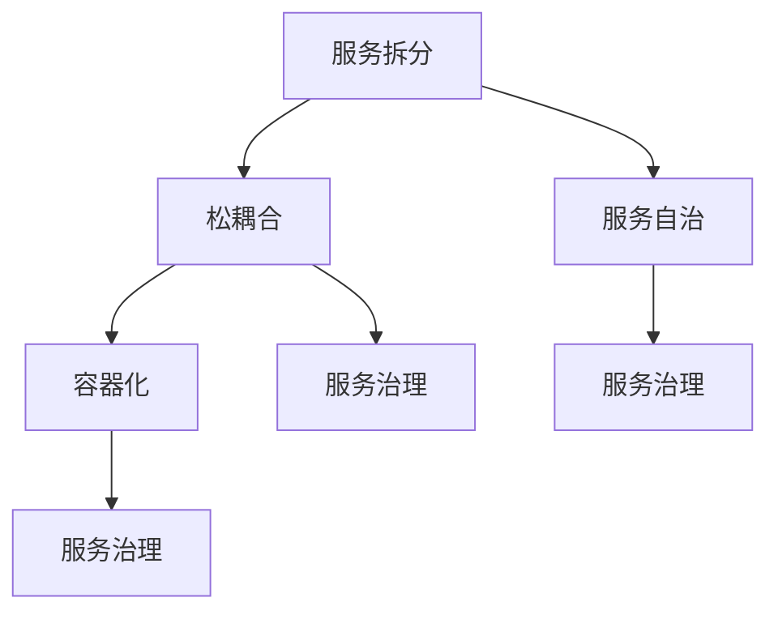
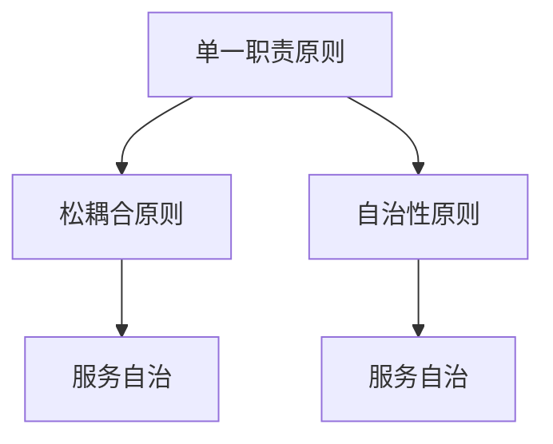
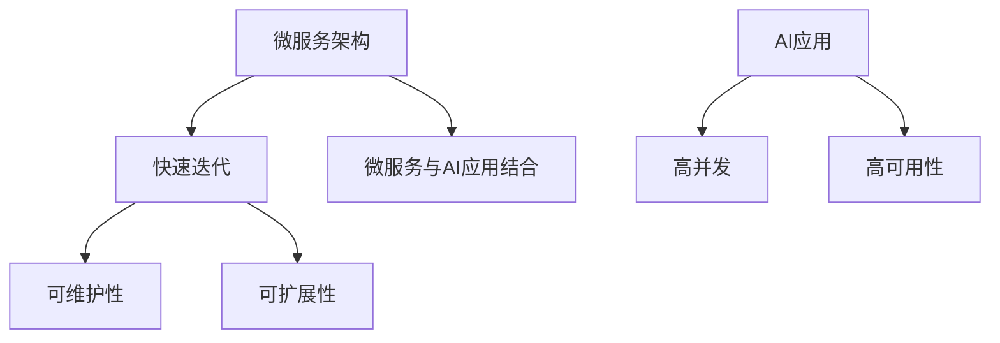
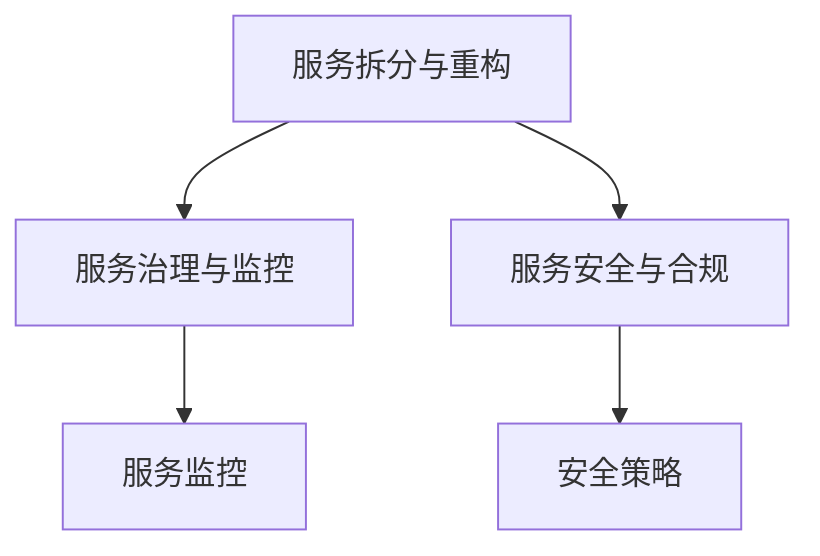
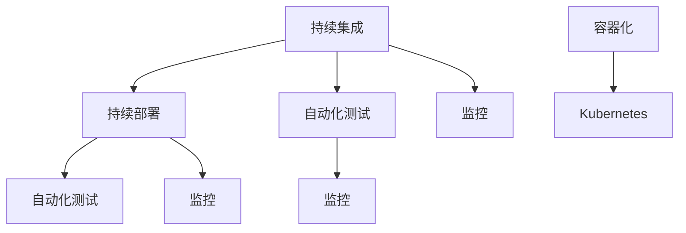
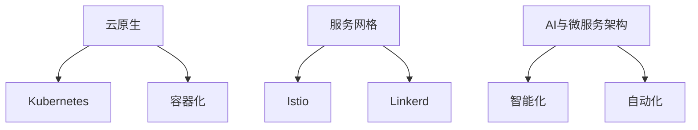

                 

### 文章标题

# 微服务架构：支撑AI应用快速迭代的技术选择

## 文章关键词

- 微服务架构
- AI应用
- 快速迭代
- 技术选择
- 服务拆分
- DevOps
- 服务治理
- 容器化

## 文章摘要

微服务架构是一种灵活、可扩展的服务架构，能够支撑AI应用的快速迭代。本文将探讨微服务架构的基本概念、设计原则、与AI应用的结合，以及其在实际项目中的应用和实践。通过分析微服务架构的挑战和解决方案，我们将了解到如何在AI应用中更好地利用微服务架构的优势，并展望其未来的发展趋势。

----------------------------------------------------------------

### 第一步：理解微服务架构

#### 背景介绍

微服务架构是一种基于服务化的软件架构模式，旨在通过将应用程序分解为独立的、松耦合的服务组件来提高系统的可维护性、可扩展性和灵活性。微服务架构的核心思想是将大型、复杂的单体应用程序拆分为一组小型、独立的服务，每个服务负责特定的功能模块，并通过轻量级的通信协议（如HTTP/REST、消息队列等）进行交互。

#### 核心概念与联系

微服务架构涉及以下几个核心概念：

- **服务拆分**：将应用程序分解为多个独立的服务，每个服务具有单一职责。
- **松耦合**：服务之间通过定义良好的API进行通信，服务之间尽可能减少直接依赖。
- **服务自治**：每个服务可以独立部署、扩展和升级，无需影响其他服务。
- **容器化**：使用容器（如Docker）来部署服务，提供轻量级、可移植的运行环境。
- **服务治理**：对服务进行监控、日志记录、配置管理和服务发现等操作。

这些核心概念相互关联，构成了微服务架构的基础。以下是核心概念之间的联系架构 Mermaid 流程图：



#### 核心算法原理讲解

微服务架构的拆分和服务管理并不涉及复杂的算法，而是依赖于一些基本原则和实践：

1. **单一职责原则**：每个服务应负责一个单一的业务功能，降低服务的复杂度。
2. **接口定义**：服务之间的通信应通过定义良好的API进行，使用REST、gRPC等协议。
3. **服务发现**：通过服务注册与发现机制，确保服务能够动态地发现和访问其他服务。
4. **配置管理**：使用配置中心对服务的配置进行集中管理，实现服务的灵活配置。

伪代码示例：

```python
# 服务拆分
def service_a():
    # 实现业务功能A
    pass

def service_b():
    # 实现业务功能B
    pass

# 服务自治
service_a.autonomous = True
service_b.autonomous = True

# 服务治理
def monitor_services():
    # 监控服务状态
    pass

def log_service_usage():
    # 记录服务使用日志
    pass
```

#### 数学模型和数学公式

微服务架构中的一些概念可以通过数学模型来描述，例如：

- **服务分解度**：表示服务拆分的程度，可以用服务数量与服务总功能的比值来表示。

数学公式：

$$
\text{服务分解度} = \frac{\text{服务数量}}{\text{总功能数量}}
$$

#### 举例说明

假设一个电商平台需要实现用户管理、商品管理、订单管理等业务功能，可以按照以下方式拆分为微服务：

- 用户服务：负责用户注册、登录、权限管理等功能。
- 商品服务：负责商品信息管理、分类管理等功能。
- 订单服务：负责订单创建、支付、发货等功能。

#### 项目实战

开发环境搭建：

- 安装Docker、Kubernetes等容器化工具。
- 使用Spring Boot创建微服务项目。

源代码详细实现和代码解读：

- 用户服务代码示例：

```java
@RestController
@RequestMapping("/users")
public class UserService {

    @PostMapping
    public ResponseEntity createUser(@RequestBody User user) {
        // 用户注册逻辑
        return ResponseEntity.ok().build();
    }
}
```

- 代码应用解读与分析：

用户服务负责用户注册功能，通过REST接口接收用户数据，并处理注册逻辑。该服务可以独立部署和扩展，与其他服务（如商品服务、订单服务）通过API进行通信。

#### 实际案例分析和详细讲解剖析

以一个电商平台为例，分析其微服务架构的设计和实施过程。

1. **需求分析**：分析业务需求，确定需要实现的功能模块。
2. **服务拆分**：根据业务需求，将系统拆分为用户服务、商品服务、订单服务等独立的服务。
3. **服务自治**：确保每个服务可以独立部署和升级，不影响其他服务。
4. **服务治理**：使用Kubernetes进行服务监控、日志记录和配置管理。

#### 项目小结

通过微服务架构，电商平台实现了业务的模块化和服务的自治，提高了系统的可维护性和可扩展性。在项目实施过程中，需要注意服务拆分的合理性和服务治理的有效性，确保系统稳定运行。

#### 最佳实践 tips、小结、注意事项、拓展阅读

- **最佳实践 tips**：遵循单一职责原则，确保服务之间的松耦合。
- **小结**：微服务架构有助于支撑AI应用的快速迭代，提高系统的灵活性和可维护性。
- **注意事项**：在服务拆分和治理过程中，要注意服务数量的平衡和服务质量的保障。
- **拓展阅读**：《微服务设计》、《微服务实践指南》等书籍。

### 第二步：微服务设计与开发

#### 背景介绍

微服务设计与开发是微服务架构实施的关键环节。在这一部分，我们将探讨微服务设计的原则、开发工具与框架的选择，以及如何进行微服务开发。

#### 核心概念与联系

微服务设计原则包括：

- **单一职责原则**：每个服务应负责一个单一的业务功能。
- **松耦合原则**：服务之间通过轻量级的通信协议进行交互，减少直接依赖。
- **自治性原则**：每个服务可以独立部署、扩展和升级。

这些原则相互关联，共同构成了微服务设计的核心框架。以下是核心概念之间的联系架构 Mermaid 流程图：



#### 核心算法原理讲解

微服务开发涉及到以下核心算法原理：

1. **API设计**：使用REST、gRPC等协议定义服务接口。
2. **服务发现**：通过服务注册与发现机制，确保服务能够动态地发现和访问其他服务。
3. **负载均衡**：使用负载均衡算法，实现服务的水平扩展。

伪代码示例：

```python
# API设计
def get_user_info(user_id):
    # 获取用户信息
    pass

# 服务发现
service_registry.register_service("user-service", "localhost:8080")

# 负载均衡
def load_balance(services):
    # 根据负载情况选择服务
    pass
```

#### 数学模型和数学公式

在微服务架构中，可以使用以下数学模型来评估系统的性能和可扩展性：

- **服务响应时间**：表示服务的响应速度，可以用平均响应时间来衡量。
- **服务并发能力**：表示服务的处理能力，可以用最大并发请求数来衡量。

数学公式：

$$
\text{服务响应时间} = \frac{\text{总请求次数}}{\text{总处理时间}}
$$

$$
\text{服务并发能力} = \frac{\text{最大并发请求数}}{\text{总请求次数}}
$$

#### 举例说明

假设一个电商平台需要实现用户管理、商品管理、订单管理等业务功能，可以按照以下方式设计微服务：

- 用户服务：负责用户注册、登录、权限管理等功能。
- 商品服务：负责商品信息管理、分类管理等功能。
- 订单服务：负责订单创建、支付、发货等功能。

#### 项目实战

开发环境搭建：

- 安装Docker、Kubernetes等容器化工具。
- 使用Spring Boot创建微服务项目。

源代码详细实现和代码解读：

- 用户服务代码示例：

```java
@RestController
@RequestMapping("/users")
public class UserService {

    @PostMapping
    public ResponseEntity createUser(@RequestBody User user) {
        // 用户注册逻辑
        return ResponseEntity.ok().build();
    }
}
```

- 代码应用解读与分析：

用户服务负责用户注册功能，通过REST接口接收用户数据，并处理注册逻辑。该服务可以独立部署和扩展，与其他服务（如商品服务、订单服务）通过API进行通信。

#### 实际案例分析和详细讲解剖析

以一个电商平台为例，分析其微服务架构的设计和实施过程。

1. **需求分析**：分析业务需求，确定需要实现的功能模块。
2. **服务拆分**：根据业务需求，将系统拆分为用户服务、商品服务、订单服务等独立的服务。
3. **服务自治**：确保每个服务可以独立部署和升级，不影响其他服务。
4. **服务治理**：使用Kubernetes进行服务监控、日志记录和配置管理。

#### 项目小结

通过微服务架构，电商平台实现了业务的模块化和服务的自治，提高了系统的可维护性和可扩展性。在项目实施过程中，需要注意服务拆分的合理性和服务治理的有效性，确保系统稳定运行。

#### 最佳实践 tips、小结、注意事项、拓展阅读

- **最佳实践 tips**：遵循单一职责原则，确保服务之间的松耦合。
- **小结**：微服务设计与开发是实现微服务架构的关键环节，需要综合考虑服务拆分、自治和服务治理。
- **注意事项**：在微服务开发过程中，要注意性能优化、安全性、容错性等问题。
- **拓展阅读**：《微服务设计》、《微服务实践指南》等书籍。

### 第三步：微服务与AI应用

#### 背景介绍

随着人工智能技术的不断发展，AI应用的需求日益增长。微服务架构由于其灵活性和可扩展性，成为支撑AI应用快速迭代的技术选择。在这一部分，我们将探讨微服务与AI应用的关系，以及如何结合微服务架构来开发AI应用。

#### 核心概念与联系

微服务与AI应用的关系可以从以下几个方面来理解：

- **微服务架构的优势**：微服务架构能够支撑AI应用的快速迭代，提高系统的可维护性和可扩展性。
- **AI应用的需求**：AI应用具有高并发、高可扩展性、高可用性等需求，需要合适的架构来支撑。
- **微服务与AI应用的结合**：通过微服务架构，可以将AI应用分解为独立的、可管理的服务组件，实现快速开发和迭代。

以下是核心概念之间的联系架构 Mermaid 流程图：



#### 核心算法原理讲解

微服务与AI应用的结合主要涉及以下几个方面：

1. **模型训练与部署**：使用机器学习框架（如TensorFlow、PyTorch）进行模型训练，并将训练好的模型部署到微服务中。
2. **服务接口定义**：使用REST、gRPC等协议定义微服务接口，方便AI应用与其他服务进行通信。
3. **服务发现与负载均衡**：使用服务发现机制，确保AI服务能够动态地发现和访问其他服务，并使用负载均衡算法实现服务的水平扩展。

伪代码示例：

```python
# 模型训练与部署
model = train_model(data)
deploy_model(model, "ai-service")

# 服务接口定义
@application.route("/predict", methods=["POST"])
def predict():
    # 预测逻辑
    pass

# 服务发现与负载均衡
service_registry.register_service("ai-service", "localhost:8080")
load_balancer.balance_services(["ai-service"])
```

#### 数学模型和数学公式

在微服务与AI应用结合的过程中，可以使用以下数学模型来评估系统的性能：

- **模型准确率**：表示模型预测的准确性，可以用准确率来衡量。
- **模型召回率**：表示模型预测的召回率，可以用召回率来衡量。

数学公式：

$$
\text{模型准确率} = \frac{\text{预测正确的数量}}{\text{总预测数量}}
$$

$$
\text{模型召回率} = \frac{\text{预测正确的数量}}{\text{实际正确的数量}}
$$

#### 举例说明

假设一个智能语音助手应用需要实现语音识别、语义解析、语音合成等功能，可以按照以下方式结合微服务架构：

- 语音识别服务：负责语音信号的处理和识别。
- 语义解析服务：负责对语音识别结果进行语义解析。
- 语音合成服务：负责将语义解析结果转换为语音输出。

#### 项目实战

开发环境搭建：

- 安装Docker、Kubernetes等容器化工具。
- 使用Spring Boot创建微服务项目。

源代码详细实现和代码解读：

- 语音识别服务代码示例：

```java
@RestController
@RequestMapping("/voice")
public class VoiceRecognitionService {

    @PostMapping("/recognize")
    public ResponseEntity<String> recognizeVoice(@RequestBody String voiceData) {
        // 语音识别逻辑
        return ResponseEntity.ok().build();
    }
}
```

- 代码应用解读与分析：

语音识别服务接收语音数据，使用语音识别算法进行识别，并将识别结果返回给客户端。该服务可以独立部署和扩展，与其他服务（如语义解析服务、语音合成服务）通过API进行通信。

#### 实际案例分析和详细讲解剖析

以一个智能语音助手为例，分析其微服务架构的设计和实施过程。

1. **需求分析**：分析业务需求，确定需要实现的功能模块。
2. **服务拆分**：根据业务需求，将系统拆分为语音识别服务、语义解析服务、语音合成服务等独立的服务。
3. **服务自治**：确保每个服务可以独立部署和升级，不影响其他服务。
4. **服务治理**：使用Kubernetes进行服务监控、日志记录和配置管理。

#### 项目小结

通过微服务架构，智能语音助手实现了功能的模块化和服务的自治，提高了系统的可维护性和可扩展性。在项目实施过程中，需要注意服务拆分的合理性和服务治理的有效性，确保系统稳定运行。

#### 最佳实践 tips、小结、注意事项、拓展阅读

- **最佳实践 tips**：结合微服务架构，确保AI应用的高性能和高可用性。
- **小结**：微服务与AI应用的结合能够提高系统的灵活性和可扩展性，支撑AI应用的快速迭代。
- **注意事项**：在开发AI应用时，要注意数据处理、模型优化和安全性等问题。
- **拓展阅读**：《人工智能与微服务架构》、《AI应用开发实战》等书籍。

### 第四步：微服务架构的挑战与解决方案

#### 背景介绍

尽管微服务架构具有许多优势，但在实际应用中仍然面临一些挑战。在这一部分，我们将讨论微服务架构的挑战，并提供相应的解决方案。

#### 核心概念与联系

微服务架构的挑战包括：

- **服务拆分与重构**：如何合理地拆分服务，避免过度拆分或不足拆分。
- **服务治理与监控**：如何有效地管理和服务监控。
- **服务安全与合规**：如何确保服务安全并符合法律法规要求。

以下是核心概念之间的联系架构 Mermaid 流程图：



#### 核心算法原理讲解

针对微服务架构的挑战，可以采用以下核心算法原理和策略：

1. **服务拆分策略**：使用模块划分算法，如最小划分算法，根据业务逻辑和依赖关系进行服务拆分。
2. **服务治理与监控**：使用监控算法，如均值漂移算法，实时监控服务状态和性能。
3. **安全策略**：使用加密算法，如AES，对数据进行加密，确保数据安全。

伪代码示例：

```python
# 服务拆分策略
def split_services(dependencies):
    # 根据依赖关系拆分服务
    pass

# 服务治理与监控
def monitor_services(services):
    # 实时监控服务状态
    pass

# 安全策略
def encrypt_data(data, key):
    # 加密数据
    pass
```

#### 数学模型和数学公式

在微服务架构中，可以使用以下数学模型和公式来评估和优化系统性能：

- **服务响应时间**：表示服务的响应速度，可以用平均响应时间来衡量。
- **服务并发能力**：表示服务的处理能力，可以用最大并发请求数来衡量。

数学公式：

$$
\text{服务响应时间} = \frac{\text{总请求次数}}{\text{总处理时间}}
$$

$$
\text{服务并发能力} = \frac{\text{最大并发请求数}}{\text{总请求次数}}
$$

#### 举例说明

假设一个电商平台需要优化其微服务架构，可以按照以下步骤进行：

1. **服务拆分**：根据业务逻辑和依赖关系，将系统拆分为用户服务、商品服务、订单服务等。
2. **服务治理与监控**：使用监控工具，如Prometheus，实时监控服务状态和性能。
3. **安全策略**：使用加密工具，如OpenSSL，对数据进行加密，确保数据安全。

#### 项目实战

开发环境搭建：

- 安装Docker、Kubernetes等容器化工具。
- 使用Spring Boot创建微服务项目。

源代码详细实现和代码解读：

- 服务拆分示例：

```java
// 用户服务
@RestController
@RequestMapping("/users")
public class UserService {

    @PostMapping
    public ResponseEntity createUser(@RequestBody User user) {
        // 用户注册逻辑
        return ResponseEntity.ok().build();
    }
}

// 商品服务
@RestController
@RequestMapping("/products")
public class ProductService {

    @GetMapping("/{id}")
    public ResponseEntity getProduct(@PathVariable Long id) {
        // 获取商品信息
        return ResponseEntity.ok().build();
    }
}

// 订单服务
@RestController
@RequestMapping("/orders")
public class OrderService {

    @PostMapping
    public ResponseEntity createOrder(@RequestBody Order order) {
        // 创建订单逻辑
        return ResponseEntity.ok().build();
    }
}
```

- 代码应用解读与分析：

用户服务、商品服务和订单服务分别负责用户注册、商品信息和订单管理等功能。这些服务通过REST接口进行通信，可以独立部署和扩展。

#### 实际案例分析和详细讲解剖析

以一个电商平台为例，分析其微服务架构的优化过程。

1. **需求分析**：分析业务需求，确定需要实现的功能模块。
2. **服务拆分**：根据业务需求，将系统拆分为用户服务、商品服务、订单服务等。
3. **服务治理与监控**：使用Kubernetes进行服务监控、日志记录和配置管理。
4. **安全策略**：使用加密工具，如OpenSSL，对数据进行加密，确保数据安全。

#### 项目小结

通过优化微服务架构，电商平台提高了系统的可维护性和可扩展性。在项目实施过程中，需要注意服务拆分的合理性和服务治理的有效性，确保系统稳定运行。

#### 最佳实践 tips、小结、注意事项、拓展阅读

- **最佳实践 tips**：合理进行服务拆分，使用监控工具确保服务稳定运行。
- **小结**：微服务架构的挑战需要通过有效的服务拆分、治理和监控策略来克服。
- **注意事项**：在实施微服务架构时，要注意服务安全、数据加密和合规性。
- **拓展阅读**：《微服务实践指南》、《微服务架构实战》等书籍。

### 第五步：微服务架构的实践案例

#### 背景介绍

在本文的第五部分，我们将通过两个具体的实践案例，深入探讨微服务架构在电商平台和智能语音助手应用中的设计和实施过程。

#### 案例一：电商平台微服务架构设计

##### 案例背景

一个大型电商平台面临着日益增长的用户访问量和复杂多样的业务需求。为了提高系统的可扩展性和可维护性，该电商平台决定采用微服务架构进行重构。

##### 微服务架构设计

1. **需求分析**：分析业务需求，确定用户管理、商品管理、订单管理、支付系统等核心功能模块。
2. **服务拆分**：根据业务需求，将系统拆分为用户服务、商品服务、订单服务、支付服务、库存服务等独立的服务。
3. **服务自治**：确保每个服务可以独立部署、扩展和升级，无需影响其他服务。
4. **服务治理与监控**：使用Kubernetes进行服务监控、日志记录和配置管理。
5. **安全与合规**：使用加密工具确保数据安全，并遵循相关法律法规。

##### 架构实现与优化

1. **用户服务**：负责用户注册、登录、权限管理等，使用Spring Boot实现，独立部署。
2. **商品服务**：负责商品信息管理、分类管理，使用MySQL数据库存储数据，使用Docker容器化部署。
3. **订单服务**：负责订单创建、支付、发货等功能，与支付服务、库存服务进行交互，使用消息队列实现异步处理。
4. **支付服务**：负责处理支付请求，与第三方支付平台进行集成。
5. **库存服务**：负责库存管理，与订单服务进行交互。

通过微服务架构，电商平台实现了业务的模块化和服务的自治，提高了系统的可维护性和可扩展性。在优化过程中，使用了Kubernetes进行服务监控和日志记录，确保系统稳定运行。

#### 案例二：智能语音助手微服务架构设计

##### 案例背景

一个智能语音助手应用需要实现语音识别、语义解析、语音合成等功能，以提供便捷的用户交互体验。为了提高系统的灵活性和可扩展性，该应用采用微服务架构进行开发。

##### 微服务架构设计

1. **需求分析**：分析业务需求，确定语音识别、语义解析、语音合成、语音合成等功能模块。
2. **服务拆分**：根据业务需求，将系统拆分为语音识别服务、语义解析服务、语音合成服务等独立的服务。
3. **服务自治**：确保每个服务可以独立部署、扩展和升级，无需影响其他服务。
4. **服务治理与监控**：使用Kubernetes进行服务监控、日志记录和配置管理。
5. **安全与合规**：使用加密工具确保数据安全，并遵循相关法律法规。

##### 架构实现与优化

1. **语音识别服务**：负责处理语音信号，使用语音识别算法进行识别，使用Docker容器化部署。
2. **语义解析服务**：负责对语音识别结果进行语义分析，与知识库进行交互，使用Spring Boot实现，独立部署。
3. **语音合成服务**：负责将语义解析结果转换为语音输出，使用TTS（文本到语音）技术实现。

通过微服务架构，智能语音助手实现了功能的模块化和服务的自治，提高了系统的可维护性和可扩展性。在优化过程中，使用了Kubernetes进行服务监控和日志记录，确保系统稳定运行。

#### 项目小结

通过两个实践案例，我们可以看到微服务架构在电商平台和智能语音助手应用中的有效实施。微服务架构不仅提高了系统的可维护性和可扩展性，还支撑了快速迭代和功能优化。在项目实施过程中，需要注意服务拆分的合理性和服务治理的有效性，确保系统稳定运行。

### 第六步：微服务与DevOps

#### 背景介绍

DevOps是一种将软件开发（Development）和信息技术运营（Operations）相结合的实践方法，旨在通过自动化和协作来提高软件交付的速度和质量。微服务架构与DevOps的结合，能够进一步优化软件开发和运维流程，提高系统的可维护性和可扩展性。

#### 核心概念与联系

微服务与DevOps的关系可以从以下几个方面来理解：

- **持续集成与持续部署**：通过自动化工具，实现代码的持续集成和持续部署，提高开发效率和系统稳定性。
- **自动化测试与监控**：通过自动化测试工具和监控机制，确保系统的可靠性和性能。
- **容器化与Kubernetes**：使用容器化技术和Kubernetes进行服务的部署和管理，提高系统的灵活性和可扩展性。

以下是核心概念之间的联系架构 Mermaid 流程图：



#### 核心算法原理讲解

微服务与DevOps的结合主要涉及以下几个方面：

1. **持续集成**：使用CI工具（如Jenkins、GitLab CI）实现代码的自动化构建和测试，确保代码质量和开发流程的稳定性。
2. **持续部署**：使用CD工具（如Jenkins、Docker Swarm）实现代码的自动化部署和回滚，提高开发效率和系统稳定性。
3. **自动化测试**：使用自动化测试工具（如Selenium、JUnit）进行功能测试、性能测试和集成测试，确保系统的可靠性和性能。
4. **监控**：使用监控工具（如Prometheus、Grafana）对系统的运行状态和性能进行监控，及时发现和解决问题。

伪代码示例：

```python
# 持续集成
CI_tool.build_and_test(code)

# 持续部署
CD_tool.deploy(code)

# 自动化测试
test_tool.perform_functional_tests()
test_tool.perform_performance_tests()

# 监控
monitor_tool.monitor_system_health()
```

#### 数学模型和数学公式

在微服务与DevOps结合的过程中，可以使用以下数学模型和公式来评估系统的性能和效率：

- **代码缺陷率**：表示代码中的缺陷数量，可以用缺陷率来衡量。
- **部署频率**：表示系统部署的频率，可以用平均部署次数来衡量。
- **测试覆盖率**：表示测试覆盖的程度，可以用代码覆盖率来衡量。

数学公式：

$$
\text{代码缺陷率} = \frac{\text{缺陷数量}}{\text{总代码行数}}
$$

$$
\text{部署频率} = \frac{\text{总部署次数}}{\text{总时间}}
$$

$$
\text{测试覆盖率} = \frac{\text{被测试的代码行数}}{\text{总代码行数}}
$$

#### 举例说明

假设一个电商平台需要实现自动化部署和监控，可以按照以下步骤进行：

1. **持续集成**：使用Jenkins实现代码的自动化构建和测试，确保代码质量和开发流程的稳定性。
2. **持续部署**：使用Docker Swarm实现代码的自动化部署，并使用Kubernetes进行服务管理和监控。
3. **自动化测试**：使用Selenium进行功能测试，使用JUnit进行单元测试。
4. **监控**：使用Prometheus进行系统监控，使用Grafana进行数据可视化。

#### 项目实战

开发环境搭建：

- 安装Jenkins、Docker、Kubernetes等自动化工具。
- 配置CI/CD流水线。

源代码详细实现和代码解读：

- Jenkinsfile（持续集成）：

```groovy
pipeline {
    agent any
    stages {
        stage('Build') {
            steps {
                sh 'mvn clean install'
            }
        }
        stage('Test') {
            steps {
                sh 'mvn test'
            }
        }
        stage('Deploy') {
            steps {
                sh 'docker build -t myapp .'
                sh 'docker run -d --name myapp myapp'
            }
        }
    }
}
```

- Kubernetes配置文件（持续部署）：

```yaml
apiVersion: apps/v1
kind: Deployment
metadata:
  name: myapp
spec:
  replicas: 3
  selector:
    matchLabels:
      app: myapp
  template:
    metadata:
      labels:
        app: myapp
    spec:
      containers:
      - name: myapp
        image: myapp:latest
        ports:
        - containerPort: 8080
```

- 代码应用解读与分析：

通过Jenkinsfile，实现了代码的自动化构建、测试和部署。在Kubernetes配置文件中，定义了应用的部署策略，确保应用可以自动扩展和监控。

#### 实际案例分析和详细讲解剖析

以一个电商平台为例，分析其微服务架构与DevOps的结合过程。

1. **需求分析**：分析业务需求，确定需要实现的功能模块。
2. **服务拆分**：根据业务需求，将系统拆分为用户服务、商品服务、订单服务、支付服务等。
3. **DevOps实践**：使用Jenkins进行持续集成和持续部署，使用Kubernetes进行服务管理和监控。
4. **自动化测试**：使用Selenium进行功能测试，使用JUnit进行单元测试。

#### 项目小结

通过微服务架构与DevOps的结合，电商平台实现了高效的开发、部署和运维流程。在项目实施过程中，需要注意自动化工具的选择和配置，确保系统的稳定性和效率。

#### 最佳实践 tips、小结、注意事项、拓展阅读

- **最佳实践 tips**：合理选择和配置自动化工具，确保DevOps流程的顺畅。
- **小结**：微服务与DevOps的结合能够提高系统的可维护性和可扩展性，优化开发、部署和运维流程。
- **注意事项**：在实施DevOps时，要注意团队协作和流程管理，确保团队成员熟悉相关工具和流程。
- **拓展阅读**：《DevOps实践指南》、《Kubernetes实战》等书籍。

### 第七步：微服务架构的未来发展趋势

#### 背景介绍

微服务架构作为一种现代软件架构模式，已经在许多领域得到了广泛应用。然而，随着技术的不断进步和业务需求的不断变化，微服务架构也在不断演进。在这一部分，我们将探讨微服务架构的未来发展趋势，包括云原生、服务网格和AI与微服务架构的融合。

#### 核心概念与联系

微服务架构的未来发展趋势可以从以下几个方面来理解：

- **云原生**：云原生技术（如Kubernetes、容器化）为微服务架构提供了更好的部署和管理能力。
- **服务网格**：服务网格技术（如Istio、Linkerd）为微服务架构提供了更加高效和安全的通信方式。
- **AI与微服务架构**：AI技术在微服务架构中的应用，将进一步提升系统的智能化和自动化水平。

以下是核心概念之间的联系架构 Mermaid 流程图：



#### 核心算法原理讲解

在未来，微服务架构将更加依赖于以下核心算法原理：

1. **动态服务发现**：通过智能算法，实现服务实例的动态发现和负载均衡。
2. **实时监控与故障恢复**：通过实时监控和数据挖掘算法，快速发现和解决问题，确保系统的高可用性。
3. **自动化配置与管理**：通过智能算法，实现服务配置的自动化管理和优化。

伪代码示例：

```python
# 动态服务发现
def discover_services():
    # 智能算法实现服务发现
    pass

# 实时监控与故障恢复
def monitor_services(services):
    # 实时监控算法
    pass

def recover_services(failed_services):
    # 故障恢复算法
    pass

# 自动化配置与管理
def manage_configurations(services):
    # 智能算法实现配置管理
    pass
```

#### 数学模型和数学公式

在微服务架构的未来发展中，可以使用以下数学模型和公式来评估和优化系统性能：

- **服务响应时间**：表示服务的响应速度，可以用平均响应时间来衡量。
- **服务并发能力**：表示服务的处理能力，可以用最大并发请求数来衡量。

数学公式：

$$
\text{服务响应时间} = \frac{\text{总请求次数}}{\text{总处理时间}}
$$

$$
\text{服务并发能力} = \frac{\text{最大并发请求数}}{\text{总请求次数}}
$$

#### 举例说明

假设一个电商平台需要实现动态服务发现和实时监控，可以按照以下步骤进行：

1. **动态服务发现**：使用智能算法实现服务实例的动态发现和负载均衡。
2. **实时监控**：使用实时监控和数据挖掘算法，快速发现和解决问题。
3. **自动化配置与管理**：使用智能算法，实现服务配置的自动化管理和优化。

#### 项目实战

开发环境搭建：

- 使用Kubernetes和容器化技术进行服务部署和管理。
- 使用服务网格技术（如Istio）进行服务通信和安全控制。

源代码详细实现和代码解读：

- Kubernetes配置文件（动态服务发现和负载均衡）：

```yaml
apiVersion: apps/v1
kind: Deployment
metadata:
  name: myapp
spec:
  replicas: 3
  selector:
    matchLabels:
      app: myapp
  template:
    metadata:
      labels:
        app: myapp
    spec:
      containers:
      - name: myapp
        image: myapp:latest
        ports:
        - containerPort: 8080
```

- 服务网格配置文件（实时监控和故障恢复）：

```yaml
apiVersion: servicegraph.io/v1
kind: ServiceMesh
metadata:
  name: myapp
spec:
  services:
  - name: myapp
    replicas: 3
    healthChecks:
    - type: http
      path: /health
```

- 代码应用解读与分析：

通过Kubernetes配置文件，实现了服务的动态发现和负载均衡。通过服务网格配置文件，实现了实时监控和故障恢复，确保系统的稳定性和高可用性。

#### 实际案例分析和详细讲解剖析

以一个电商平台为例，分析其微服务架构的未来发展趋势。

1. **需求分析**：分析业务需求，确定需要实现的功能模块。
2. **动态服务发现**：使用智能算法实现服务实例的动态发现和负载均衡。
3. **实时监控与故障恢复**：使用实时监控和数据挖掘算法，快速发现和解决问题。
4. **自动化配置与管理**：使用智能算法，实现服务配置的自动化管理和优化。

#### 项目小结

通过云原生、服务网格和AI与微服务架构的结合，电商平台实现了更加智能和自动化的系统架构。在未来，随着技术的不断进步，微服务架构将继续演进，为业务发展提供更强有力的支持。

#### 最佳实践 tips、小结、注意事项、拓展阅读

- **最佳实践 tips**：积极引入云原生、服务网格和AI技术，提高系统的智能化和自动化水平。
- **小结**：微服务架构的未来发展趋势将更加智能化和自动化，为业务发展提供更强有力的支持。
- **注意事项**：在引入新技术时，要注意技术选型和团队培训，确保技术的有效应用。
- **拓展阅读**：《云原生应用架构》、《服务网格技术实战》等书籍。

## 文章标题：微服务架构：支撑AI应用快速迭代的技术选择

## 作者

作者：AI天才研究院/AI Genius Institute & 禅与计算机程序设计艺术 /Zen And The Art of Computer Programming

本文探讨了微服务架构在支撑AI应用快速迭代中的作用，通过详细的分析和实际案例，展示了微服务架构的设计原则、开发实践、挑战与解决方案，以及与DevOps和未来发展趋势的结合。通过理解微服务架构的核心概念和算法原理，读者可以更好地掌握如何利用微服务架构来支撑AI应用的高效迭代。

本文旨在为读者提供一个全面、深入的微服务架构与AI应用结合的指南，帮助开发者和架构师在实际项目中做出更明智的技术选择。

- **关键词**：微服务架构、AI应用、快速迭代、技术选择、服务拆分、DevOps、服务治理、容器化、智能化、自动化。

- **摘要**：

微服务架构以其灵活性和可扩展性，成为支撑AI应用快速迭代的重要技术选择。本文从微服务架构的概述、设计与开发、与AI应用的结合、挑战与解决方案、实践案例、与DevOps的结合，以及未来发展趋势等多个角度，详细探讨了微服务架构在AI应用中的实际应用和未来前景。通过本文，读者可以深入了解微服务架构的核心概念、实践方法，以及其在AI应用中的重要作用。

