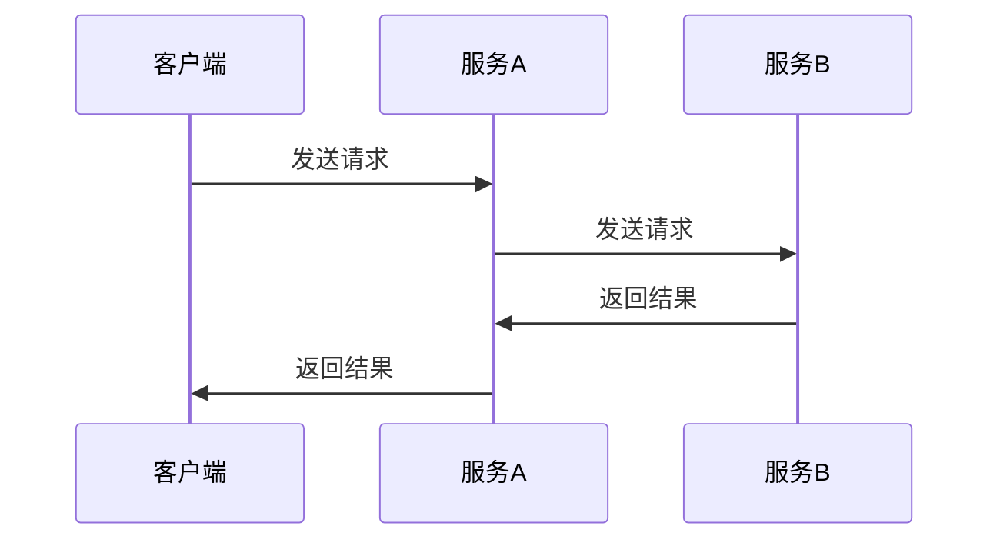

                 

# 《微服务通信：同步vs异步在LLM应用中的选择》

## 关键词

- 微服务
- 同步通信
- 异步通信
- LLM应用
- 性能优化
- 实践案例

## 摘要

本文探讨了微服务架构中通信模式的选择问题，特别是同步与异步通信在LLM（大型语言模型）应用中的不同应用场景和效果。通过对微服务通信机制的介绍，详细分析了同步与异步通信的基本概念、原理及其在LLM应用中的实现和优化策略。文章还结合实际案例，对比了同步与异步通信在LLM应用中的表现，为开发者提供了实用的选择指南。

## 引言

随着互联网技术的快速发展，微服务架构逐渐成为企业级应用的黄金标准。微服务通过将应用程序分解为独立的、松散耦合的服务单元，提高了系统的可扩展性、可维护性和灵活性。然而，微服务之间的通信方式选择对于系统的性能、稳定性和用户体验具有重要影响。在LLM应用中，这种选择更为关键，因为LLM处理大量数据和复杂计算，对通信效率的要求极高。

本文旨在探讨微服务通信中的同步与异步通信模式，分析它们在LLM应用中的适用性，并探讨如何在实际项目中进行选择和优化。文章将分为以下几个部分：

1. **微服务通信概述**：介绍微服务的基本概念和通信机制。
2. **同步通信模式详解**：阐述同步通信的基本原理和在LLM应用中的实践。
3. **异步通信模式详解**：分析异步通信的基本原理和在LLM应用中的实践。
4. **同步vs异步通信比较与选择**：对比同步与异步通信，探讨在LLM应用中的选择策略。
5. **案例分析**：结合实际案例，分析同步与异步通信在LLM应用中的表现。
6. **未来展望与趋势**：展望微服务通信在LLM应用中的未来发展方向。

## 第一部分：微服务通信概述

### 第1章：微服务与通信基础

#### 1.1 微服务架构简介

微服务架构是一种基于独立、自治的服务单元来构建应用程序的方法。每个微服务都是一个小型、独立运行的应用，负责处理特定的业务功能。这些服务通过轻量级的通信协议进行交互，例如HTTP/HTTPS、gRPC、消息队列等。

微服务架构的主要特点包括：

- **独立性**：每个微服务都是独立的，可以独立部署、升级和扩展。
- **解耦合**：服务之间通过接口进行通信，降低服务之间的依赖性。
- **可扩展性**：可以通过增加或减少服务实例来水平扩展系统。
- **灵活性**：服务可以根据需要使用不同的编程语言、数据库和技术栈。

#### 1.2 微服务通信机制

微服务之间的通信方式可以分为同步通信和异步通信。同步通信是指服务之间的请求-响应模式，客户端发送请求后，必须等待服务端返回响应。异步通信则是在客户端发送请求后，不需要等待服务端返回响应，客户端可以在其他任务中继续执行。

#### 1.3 微服务通信协议

常用的微服务通信协议包括：

- **RESTful API**：基于HTTP/HTTPS协议，使用JSON或XML进行数据传输。
- **gRPC**：基于HTTP/2协议，使用Protocol Buffers进行数据序列化。
- **消息队列**：如RabbitMQ、Kafka等，通过消息传递机制进行异步通信。
- **事件驱动架构**：通过发布-订阅模式，服务之间通过事件进行通信。

### Mermaid流程图



## 第二部分：同步通信模式详解

### 第2章：同步通信原理

#### 2.1 同步通信的基本概念

同步通信是指客户端发送请求后，必须等待服务端返回响应，才能继续执行下一步操作。在同步通信中，客户端与服务端之间通常采用请求-响应模式，客户端发起请求，服务端处理请求并返回结果。

同步通信的特点包括：

- **阻塞**：客户端在等待响应期间会被阻塞，无法执行其他任务。
- **确定性**：客户端可以确保在某个特定时间点获得服务端的响应。
- **资源占用**：客户端需要占用一定的资源，直到收到响应。

#### 2.2 同步通信的工作原理

在同步通信中，客户端向服务端发送请求，服务端接收请求并处理，然后将结果返回给客户端。整个通信过程可以分为以下几个步骤：

1. **客户端发送请求**：客户端使用HTTP/HTTPS等协议，将请求发送到服务端。
2. **服务端接收请求**：服务端接收到请求后，开始处理请求。
3. **服务端处理请求**：服务端根据请求类型，执行相应的业务逻辑，并获取请求结果。
4. **服务端返回结果**：服务端将处理结果返回给客户端。
5. **客户端接收结果**：客户端接收到服务端返回的结果后，继续执行后续操作。

#### 2.3 同步通信的优缺点

同步通信的优点包括：

- **简单易用**：同步通信模式简单，易于理解和实现。
- **确定性**：客户端可以确保在某个特定时间点获得服务端的响应。
- **适用于简单场景**：适用于那些对响应时间要求不高，且通信逻辑简单的场景。

同步通信的缺点包括：

- **阻塞**：客户端在等待响应期间会被阻塞，无法执行其他任务。
- **资源占用**：客户端需要占用一定的资源，直到收到响应。
- **性能瓶颈**：在处理大量请求时，同步通信可能会导致性能瓶颈。

#### 2.4 同步通信在LLM应用中的实践

在LLM应用中，同步通信可以用于处理一些简单的查询和操作。例如，当用户查询某个特定信息时，客户端可以使用同步通信模式，向LLM服务端发送请求，并等待服务端返回结果。以下是一个简单的同步通信示例：

```python
import requests

def get_query_result(query):
    url = "http://llm-service:8080/query"
    payload = {"query": query}
    response = requests.get(url, params=payload)
    return response.json()

query = "What is the capital of France?"
result = get_query_result(query)
print(result)
```

## 第三部分：异步通信模式详解

### 第3章：异步通信原理

#### 2.1 异步通信的基本概念

异步通信是指客户端发送请求后，不需要等待服务端返回响应，客户端可以在其他任务中继续执行。在异步通信中，客户端与服务端之间通常采用回调机制，客户端发送请求后，服务端处理请求并在完成后通知客户端。

异步通信的特点包括：

- **非阻塞**：客户端在发送请求后，可以继续执行其他任务，不会被阻塞。
- **异步性**：客户端可以在任意时间点获取服务端响应，无需等待。
- **高效性**：适用于处理大量并发请求的场景，可以提高系统性能。

#### 2.2 异步通信的工作原理

在异步通信中，客户端向服务端发送请求，服务端接收请求并处理，将处理结果存储在一个队列中，客户端可以在适当的时候从队列中获取结果。整个通信过程可以分为以下几个步骤：

1. **客户端发送请求**：客户端使用HTTP/HTTPS等协议，将请求发送到服务端。
2. **服务端接收请求**：服务端接收到请求后，开始处理请求。
3. **服务端处理请求**：服务端根据请求类型，执行相应的业务逻辑，并获取请求结果。
4. **服务端将结果存储在队列中**：服务端将处理结果存储在一个队列中。
5. **客户端从队列中获取结果**：客户端在适当的时候，从队列中获取结果。

#### 2.3 异步通信的优缺点

异步通信的优点包括：

- **非阻塞**：客户端在发送请求后，可以继续执行其他任务，不会被阻塞。
- **高效性**：适用于处理大量并发请求的场景，可以提高系统性能。
- **解耦**：客户端与服务端之间解耦合，降低系统复杂度。

异步通信的缺点包括：

- **复杂度**：异步通信模式相对复杂，需要处理回调和事件监听等逻辑。
- **资源管理**：异步通信需要管理队列和线程等资源，增加了系统维护成本。

#### 2.4 异步通信在LLM应用中的实践

在LLM应用中，异步通信可以用于处理大量的查询和操作。例如，当用户提交大量查询请求时，客户端可以使用异步通信模式，向LLM服务端发送请求，并将请求结果存储在一个队列中，客户端可以在适当的时候从队列中获取结果。以下是一个简单的异步通信示例：

```python
import requests
from concurrent.futures import ThreadPoolExecutor

def get_query_result(query):
    url = "http://llm-service:8080/async_query"
    payload = {"query": query}
    response = requests.post(url, data=payload)
    return response.json()

queries = ["What is the capital of France?", "What is the population of China?"]

with ThreadPoolExecutor(max_workers=5) as executor:
    futures = [executor.submit(get_query_result, query) for query in queries]

for future in futures:
    result = future.result()
    print(result)
```

## 第四部分：同步vs异步通信比较与选择

### 第4章：同步与异步通信比较

#### 4.1 同步与异步通信的比较

同步通信和异步通信在微服务通信中都有各自的应用场景和优势。下面是同步与异步通信的对比：

| 对比项       | 同步通信 | 异步通信 |
| ------------ | -------- | -------- |
| **通信模式** | 请求-响应 | 回调机制 |
| **阻塞**     | 阻塞     | 非阻塞   |
| **响应时间** | 较长     | 较短     |
| **并发性**   | 受限     | 较高     |
| **复杂度**   | 低       | 高       |
| **适用场景** | 简单、确定性要求高 | 复杂、并发性要求高 |

#### 4.2 不同场景下的选择

在LLM应用中，同步与异步通信的选择取决于应用场景和需求。以下是一些常见的场景和选择策略：

- **简单查询**：对于简单的查询操作，可以使用同步通信模式，因为其实现简单、易于理解。
- **批量查询**：对于批量查询操作，可以使用异步通信模式，因为可以处理大量并发请求，提高系统性能。
- **实时查询**：对于实时查询操作，需要考虑同步与异步通信的综合性能，根据实际情况进行选择。
- **高可用性**：异步通信可以提高系统的可用性，因为可以在处理请求的同时，处理其他任务。

### 第5章：LLM应用中的通信模式选择

#### 5.1 LLM应用特点分析

LLM应用具有以下特点：

- **大量数据处理**：LLM处理大量的文本数据，需要进行复杂的计算和模型推理。
- **高并发请求**：用户可以同时提交大量的查询请求，系统需要高效处理并发请求。
- **低延迟要求**：用户对查询响应速度有较高的要求，特别是在实时查询场景中。
- **高可扩展性**：系统需要具备良好的可扩展性，以便在用户量增加时进行水平扩展。

#### 5.2 同步与异步通信在LLM应用中的效果评估

在LLM应用中，同步与异步通信的效果取决于具体的场景和系统设计。以下是对同步与异步通信在LLM应用中的效果评估：

- **同步通信**：在简单查询和实时查询场景中，同步通信可以提供确定性响应，但可能会导致性能瓶颈。在批量查询场景中，同步通信可能会因为阻塞而影响整体性能。
- **异步通信**：在批量查询和高并发请求场景中，异步通信可以显著提高系统性能，减少响应时间。在实时查询场景中，异步通信可以释放系统资源，提高系统可扩展性。

#### 5.3 综合效果评估与选择

在LLM应用中，选择同步或异步通信模式需要综合考虑以下因素：

- **查询复杂性**：对于复杂查询，可以考虑使用异步通信模式，以提高系统性能。
- **并发请求量**：对于高并发请求，异步通信模式更适合，可以减少响应时间。
- **延迟要求**：对于实时查询，需要权衡同步与异步通信的性能，选择合适的模式。
- **系统可扩展性**：异步通信模式可以提高系统的可扩展性，适用于需要高并发处理和可扩展性的场景。

在实际项目中，可以根据具体需求和应用特点，选择合适的通信模式，并进行相应的性能优化和系统设计。

## 第五部分：案例分析

### 第6章：同步vs异步通信在LLM应用中的实践

#### 6.1 案例一：基于同步通信的LLM应用实践

**应用场景**：用户提交一个简单的查询请求，例如“查询某地天气情况”。

**系统设计**：

1. 客户端发送查询请求到LLM服务端。
2. LLM服务端接收到请求后，调用天气查询API，获取天气信息。
3. LLM服务端将天气信息返回给客户端。

**实现与性能分析**：

```python
import requests

def get_weather_info(city):
    url = "http://weather-service:8080/weather"
    payload = {"city": city}
    response = requests.get(url, params=payload)
    return response.json()

city = "Shanghai"
weather_info = get_weather_info(city)
print(weather_info)
```

在简单查询场景中，同步通信可以实现快速响应，但可能会因为服务端处理时间较长而影响用户体验。在实际项目中，可以通过优化服务端处理逻辑，减少响应时间。

#### 6.2 案例二：基于异步通信的LLM应用实践

**应用场景**：用户提交一个批量查询请求，例如“查询多个城市的天气情况”。

**系统设计**：

1. 客户端发送批量查询请求到LLM服务端。
2. LLM服务端将请求分解为多个子任务，每个子任务负责查询一个城市的天气信息。
3. LLM服务端将子任务分配给天气查询API，异步处理查询请求。
4. LLM服务端将处理结果存储在队列中。
5. 客户端从队列中获取处理结果。

**实现与性能分析**：

```python
import requests
from concurrent.futures import ThreadPoolExecutor

def get_weather_info(city):
    url = "http://weather-service:8080/async_weather"
    payload = {"city": city}
    response = requests.post(url, data=payload)
    return response.json()

cities = ["Shanghai", "Beijing", "New York"]

with ThreadPoolExecutor(max_workers=5) as executor:
    futures = [executor.submit(get_weather_info, city) for city in cities]

for future in futures:
    weather_info = future.result()
    print(weather_info)
```

在批量查询场景中，异步通信可以显著提高系统性能，减少响应时间。同时，异步通信还可以提高系统的可扩展性，适用于处理大量并发请求的场景。

## 第六部分：未来展望与趋势

### 第7章：微服务通信在LLM应用中的未来发展趋势

随着云计算、物联网和人工智能技术的不断发展，微服务通信在LLM应用中的发展也呈现出一些趋势：

1. **通信协议的优化**：未来的微服务通信协议将更加高效、可靠和灵活，支持多种数据传输格式和通信方式。
2. **异步通信的普及**：异步通信模式将越来越普及，适用于处理大量并发请求和高性能场景。
3. **边缘计算的融合**：边缘计算与微服务通信的结合，将进一步提高系统性能和响应速度。
4. **人工智能的赋能**：人工智能技术将赋能微服务通信，实现智能路由、流量管理和故障恢复等。
5. **标准化与生态建设**：微服务通信的标准化和生态建设将得到进一步发展，提高系统的兼容性和可扩展性。

## 结语

微服务通信是LLM应用中至关重要的环节。通过分析同步与异步通信模式的原理、特点和应用，本文为开发者提供了实用的选择指南。在实际项目中，可以根据具体需求和场景，选择合适的通信模式，并不断优化和改进系统性能。未来，随着技术的不断发展，微服务通信在LLM应用中将发挥更加重要的作用，为用户提供更优质的服务体验。

## 作者信息

作者：AI天才研究院/AI Genius Institute & 禅与计算机程序设计艺术 /Zen And The Art of Computer Programming

