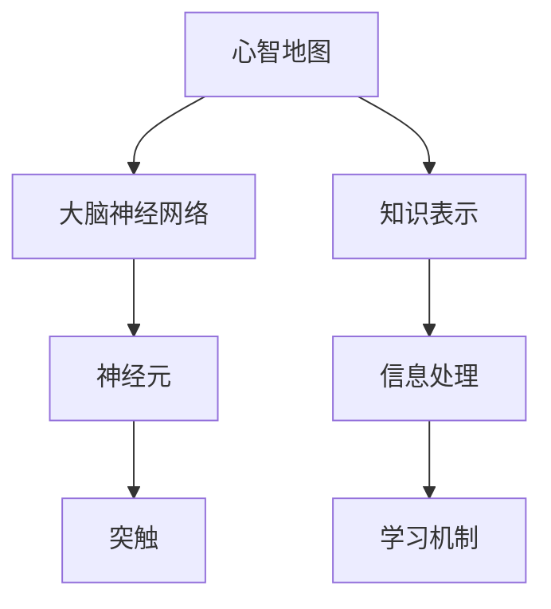

                 


为了撰写一篇高质量的《心智地图：大脑神经网络的数学模型》技术博客，我们将遵循以下步骤进行思考和结构规划：

### 1. 确定文章目的与结构

首先，我们要明确文章的主要目的：介绍心智地图的概念，阐述其与大脑神经网络的关系，并通过数学模型来深入解析这一关系。文章结构将包括：

- 引言部分：介绍心智地图和大脑神经网络的基本概念。
- 核心概念与联系部分：使用Mermaid流程图展示核心概念之间的关系。
- 核心算法原理讲解部分：使用伪代码详细阐述神经网络的工作原理。
- 数学模型与公式部分：使用LaTeX格式书写数学公式并进行解释。
- 项目实战部分：通过具体案例展示如何应用心智地图。
- 未来展望部分：讨论心智地图的发展趋势和挑战。

### 2. 引言部分

#### 背景介绍

- **心智地图的定义**：心智地图是一种用于表示知识和信息的图形化工具，可以帮助我们组织和理解复杂的概念和关系。
- **大脑神经网络的基本原理**：大脑神经网络是大脑中神经元和突触的连接网络，负责处理信息和学习。

#### 核心概念与联系

- **心智地图与大脑神经网络的关系**：心智地图可以看作是一种模拟大脑神经网络的方式来组织和表达信息。

使用Mermaid流程图展示核心概念之间的联系：



### 3. 核心算法原理讲解

#### 神经元与突触

- **神经元的工作原理**：神经元通过电信号传递信息，并在突触处与其他神经元连接。
- **突触的传递机制**：突触负责将一个神经元的信号传递给另一个神经元。

使用伪代码详细阐述神经元与突触的工作原理：

```python
def neuron_output(input_signal, weights, bias):
    return activation_function(sum(input_signal * weights) + bias)

def synapse_signal(pre_neuron_signal, pre_neuron_weight):
    return pre_neuron_signal * pre_neuron_weight
```

### 4. 数学模型与公式

#### 神经网络的数学模型

- **权重和偏置**：权重和偏置是神经网络中的重要参数。
- **激活函数**：激活函数用于确定神经元是否应该“激活”。
- **神经网络的梯度计算**：梯度计算是神经网络训练过程中的核心。

使用LaTeX格式书写相关数学公式：

```latex
\begin{align*}
    \text{神经元输出} &= \text{激活函数} \left( \sum_{i} \text{输入信号} \cdot \text{权重}_i + \text{偏置} \right) \\
    \text{权重更新} &= \text{学习率} \cdot \nabla \text{损失函数} \\
    \text{梯度计算} &= \frac{\partial \text{损失函数}}{\partial \text{参数}}
\end{align*}
```

### 5. 项目实战

#### 开发环境搭建

- **开发工具的选择**：Python、TensorFlow或PyTorch等。
- **数据集的准备**：收集和预处理相关数据集。

#### 源代码实现

- **模型设计与实现**：构建神经网络模型。
- **模型训练与优化**：使用反向传播算法训练模型，并优化参数。

#### 案例分析与讨论

- **情感分析**：使用心智地图进行情感分析。
- **智能推荐**：构建智能推荐系统。

### 6. 未来展望

- **人工智能的发展方向**：讨论心智地图在人工智能领域的应用前景。
- **心智地图的挑战与机遇**：分析心智地图在技术实现和应用中的挑战和机遇。

### 7. 总结

- **心智地图的意义**：总结心智地图在知识表示和数据处理中的重要性。
- **未来的研究方向**：提出未来心智地图研究的可能方向。

通过以上步骤，我们可以确保文章内容逻辑清晰、结构紧凑、易于理解，同时涵盖技术原理和实际应用。接下来，我们将根据这些步骤撰写详细的正文内容。首先，让我们开始撰写引言部分。

