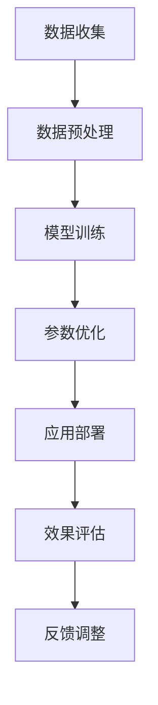
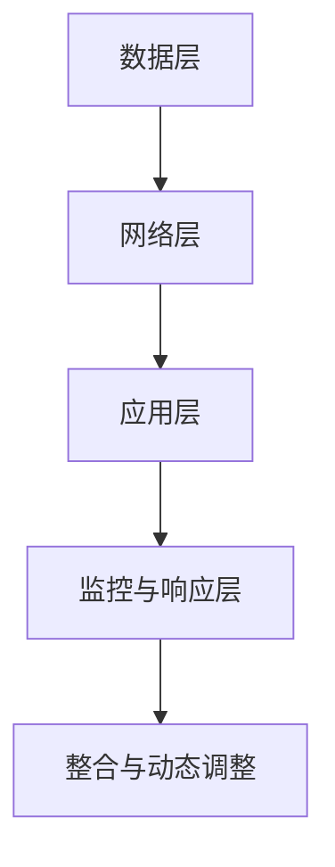

                 

### 文章标题：快速响应安全威胁：LLM应用的防护策略

> 关键词：快速响应，安全威胁，LLM应用，防护策略

> 摘要：本文将探讨在人工智能领域，特别是大型语言模型（LLM）应用中，如何快速响应安全威胁。通过深入分析LLM的技术原理、常见威胁类型及其影响，本文提出了一系列针对性的防护策略，并提供实际案例，旨在为读者提供实用的指导，帮助他们在面对安全威胁时迅速作出有效应对。

### 引言

随着人工智能技术的飞速发展，特别是大型语言模型（LLM）的出现，其在各个领域的应用越来越广泛。LLM在自然语言处理、智能客服、文本生成等方面展现出强大的能力，极大地提升了自动化和智能化水平。然而，随着其应用范围的扩大，安全威胁问题也逐渐显现出来。

快速响应安全威胁对于保障LLM应用的安全至关重要。首先，安全威胁可能导致敏感数据泄露，影响用户隐私。其次，安全威胁可能影响系统的稳定性和可靠性，导致业务中断。此外，恶意攻击者可能利用LLM进行恶意操作，给企业带来巨大的经济损失。因此，如何快速响应安全威胁，构建有效的防护策略，成为当前人工智能领域亟待解决的问题。

本文将从以下几个方面展开讨论：首先，介绍LLM的技术原理和常见应用场景；其次，分析LLM面临的主要安全威胁类型及其影响；然后，提出针对性的防护策略；最后，通过实际案例，展示如何具体实施这些防护策略。希望通过本文的探讨，能够为读者提供有价值的参考和指导。

### LLM原理与应用

大型语言模型（LLM）是基于深度学习和自然语言处理技术构建的一种人工智能模型，具有处理和理解自然语言的能力。LLM的核心原理包括神经网络的架构、训练过程和应用场景。

#### 神经网络架构

LLM通常采用多层感知器（MLP）或变换器架构（Transformer）。MLP是一种基于前馈神经网络的结构，包含输入层、多个隐藏层和输出层。每个神经元接收前一层神经元的输出，通过激活函数进行非线性变换，最终输出预测结果。而Transformer架构则采用自注意力机制，通过计算输入序列中每个词与其他词之间的相互作用来生成预测结果。

#### 训练过程

LLM的训练过程主要包括数据准备、模型训练和参数优化。首先，收集大量高质量的语言数据，如文本、语音和图像等。然后，通过数据预处理，将原始数据转换为适合模型训练的格式。接下来，使用训练算法（如梯度下降法）优化模型参数，使其能够准确预测自然语言中的各种任务，如文本分类、机器翻译和问答系统。

#### 应用场景

LLM在多个领域具有广泛的应用，其中最为突出的是自然语言处理和文本生成。以下是一些典型的应用场景：

1. **智能客服**：利用LLM构建智能客服系统，能够自动回答用户的问题，提高客户服务质量。

2. **文本生成**：LLM可以生成各种类型的文本，如文章、报告和诗歌等，应用于内容创作、广告营销等领域。

3. **机器翻译**：LLM在机器翻译领域表现出色，能够实现跨语言文本的自动翻译。

4. **问答系统**：LLM可以构建智能问答系统，用于处理用户的查询，提供准确、及时的答案。

5. **情感分析**：LLM可以分析文本中的情感倾向，应用于市场调研、舆情监控等领域。

6. **文本摘要**：LLM能够生成文章的摘要，帮助用户快速获取关键信息。

#### 流程图

为了更好地理解LLM的原理和应用，我们可以通过Mermaid流程图来展示其关键步骤：



#### Mermaid流程图


通过上述分析，我们可以看出，LLM在各个领域具有广泛的应用前景。然而，随着其应用范围的扩大，如何保障其安全也成为亟待解决的问题。在接下来的部分，我们将深入探讨LLM面临的主要安全威胁类型及其影响。

### 常见安全威胁类型及影响

随着大型语言模型（LLM）的广泛应用，其面临的安全威胁也日益增多。这些威胁不仅可能对LLM的应用造成严重影响，还可能对企业和用户带来巨大的经济损失。以下是几种常见的安全威胁类型及其影响：

#### 数据泄露

数据泄露是LLM面临的主要安全威胁之一。LLM在训练和部署过程中需要大量的数据，这些数据可能包括用户的个人信息、企业机密文件等。如果这些数据遭到恶意攻击者的窃取，将导致严重的隐私泄露问题。具体影响包括：

1. **用户隐私泄露**：用户的个人信息，如姓名、电话号码、地址等，如果泄露，可能导致用户受到骚扰、欺诈等。
2. **企业机密泄露**：企业的商业机密，如客户信息、市场策略等，如果泄露，可能导致竞争对手获取不公平的优势，对企业造成重大损失。
3. **法律风险**：数据泄露可能导致企业面临法律责任和罚款，影响企业的声誉和信誉。

#### 恶意攻击

恶意攻击者可能利用LLM进行各种恶意操作，给企业和用户带来严重的安全威胁。以下是几种常见的恶意攻击方式及其影响：

1. **注入攻击**：攻击者通过注入恶意代码或数据，控制LLM的行为，导致系统崩溃、数据损坏等。
2. **拒绝服务攻击（DDoS）**：攻击者通过大量虚假请求，使LLM的服务器资源耗尽，导致系统瘫痪，无法提供服务。
3. **中间人攻击**：攻击者截取LLM与用户之间的通信，窃取敏感信息或篡改数据。
4. **数据篡改**：攻击者篡改LLM训练数据，导致模型预测结果不准确，影响业务决策。

#### 恶意软件

恶意软件，如病毒、木马、勒索软件等，可能对LLM系统造成严重破坏。以下是恶意软件可能带来的影响：

1. **系统破坏**：恶意软件可能破坏LLM系统的文件和配置，导致系统无法正常运行。
2. **数据丢失**：恶意软件可能删除LLM系统中的数据，导致数据丢失，影响业务连续性。
3. **资源占用**：恶意软件可能占用LLM系统的计算资源，导致系统性能下降，影响用户体验。

#### 虚假信息传播

LLM在生成文本时，可能被恶意利用，生成和传播虚假信息。虚假信息可能对社会造成以下影响：

1. **误导用户**：虚假信息可能误导用户，导致用户做出错误的决策，影响其日常生活和利益。
2. **破坏社会稳定**：虚假信息可能被用于政治、社会动荡等目的，破坏社会稳定，引发公共安全事件。
3. **损害企业声誉**：虚假信息可能被恶意攻击者用于攻击特定企业，损害企业声誉，影响业务发展。

#### 恶意用户行为

恶意用户可能利用LLM进行恶意行为，如欺诈、恶意评论等。这些行为可能对平台和用户造成以下影响：

1. **降低用户体验**：恶意用户的行为可能导致平台用户体验下降，影响平台的用户留存和转化率。
2. **增加运营成本**：平台需要投入大量资源进行用户管理和内容审核，以应对恶意用户行为。
3. **法律风险**：恶意用户的行为可能导致平台面临法律责任和罚款，影响平台的长期发展。

#### 资源滥用

恶意用户可能滥用LLM资源，如大量请求、频繁调用等，导致系统资源耗尽，影响其他用户的正常使用。资源滥用可能导致以下问题：

1. **系统性能下降**：大量请求可能导致系统性能下降，影响平台的响应速度和稳定性。
2. **服务中断**：系统资源耗尽可能导致服务中断，影响用户体验和业务连续性。
3. **经济成本**：平台需要投入大量资源进行资源管理和监控，以应对资源滥用问题。

通过上述分析，我们可以看出，LLM面临的安全威胁类型多样，且可能对企业和用户造成严重的影响。在接下来的部分，我们将探讨如何针对这些威胁提出有效的防护策略。

### 防护策略概述

为了有效应对LLM应用中的安全威胁，我们需要构建一个全面、多层次的防护体系。以下是一些关键步骤和措施，以确保LLM系统的安全性和稳定性：

#### 1. 数据安全保护

数据是LLM应用的核心，因此保护数据安全至关重要。以下是一些具体措施：

- **数据加密**：对存储和传输的数据进行加密，防止数据泄露。
- **访问控制**：实施严格的访问控制策略，确保只有授权人员才能访问敏感数据。
- **数据备份**：定期备份数据，确保在数据丢失或损坏时能够快速恢复。

#### 2. 防火墙和入侵检测

通过部署防火墙和入侵检测系统，可以有效地防止恶意攻击和入侵。以下是一些关键措施：

- **防火墙配置**：配置防火墙规则，过滤恶意流量，阻止未授权访问。
- **入侵检测系统**：部署入侵检测系统，实时监控网络流量，发现异常行为并及时响应。
- **安全审计**：定期进行安全审计，检查系统和网络的安全性，及时发现潜在威胁。

#### 3. 安全协议和认证机制

确保通信安全是保障LLM系统安全的关键。以下是一些具体措施：

- **TLS/SSL协议**：使用TLS/SSL协议加密网络通信，防止中间人攻击和数据篡改。
- **多因素认证**：采用多因素认证（MFA）机制，提高用户身份验证的可靠性。
- **安全域划分**：根据不同的安全需求，划分不同的安全域，限制跨域访问。

#### 4. 定期更新和补丁管理

及时更新系统和应用程序，修补安全漏洞，是防止恶意攻击的关键。以下是一些具体措施：

- **自动化更新**：使用自动化工具定期更新系统和应用程序。
- **补丁管理**：建立补丁管理流程，及时评估和部署安全补丁。

#### 5. 安全培训和教育

提高员工的安全意识和技能，是保障LLM系统安全的重要一环。以下是一些具体措施：

- **安全培训**：定期组织安全培训，提高员工的安全意识和技能。
- **安全意识教育**：通过宣传和教育，提高员工对安全威胁的认识，预防恶意行为。

#### 6. 监控和日志分析

通过实时监控和日志分析，可以及时发现潜在的安全威胁并采取相应措施。以下是一些具体措施：

- **实时监控**：部署监控工具，实时监控系统运行状态和关键指标。
- **日志分析**：定期分析日志文件，发现异常行为和潜在威胁。

通过上述措施，我们可以构建一个全面的防护体系，有效应对LLM应用中的各种安全威胁。在接下来的部分，我们将详细讨论每种防护技术的原理和具体实现。

### 防护技术

为了保障LLM应用的安全性，我们需要运用多种防护技术。以下是几种常见的防护技术及其原理：

#### 1. 数据加密

数据加密是一种重要的数据保护技术，通过将数据转换为不可读的密文，防止未授权人员访问敏感信息。常见的数据加密算法包括：

- **对称加密**：如AES（高级加密标准），加密和解密使用相同的密钥。
- **非对称加密**：如RSA（Rivest-Shamir-Adleman），加密和解密使用不同的密钥。

#### 实现原理：

```plaintext
# 对称加密（AES）实现原理

输入明文数据，通过AES算法和密钥进行加密，生成密文。
密文可以通过相同的AES算法和解密密钥还原为明文。

# 非对称加密（RSA）实现原理

输入明文数据，通过RSA算法和公钥进行加密，生成密文。
密文可以通过私钥进行解密，还原为明文。
```

#### 2. 访问控制

访问控制是一种限制用户对系统资源和数据的访问权限的技术，通过身份验证和权限管理，确保只有授权用户才能访问敏感信息。

#### 实现原理：

- **身份验证**：通过用户名和密码、双因素认证（MFA）等方式，验证用户身份。
- **权限管理**：根据用户的角色和权限，限制用户对系统资源和数据的访问。

```plaintext
# 访问控制实现原理

1. 用户尝试访问系统资源。
2. 系统对用户进行身份验证，确认其身份。
3. 系统根据用户的权限，允许或拒绝访问。
```

#### 3. 入侵检测系统（IDS）

入侵检测系统是一种实时监控网络流量和系统行为的系统，用于检测和响应恶意攻击。常见的入侵检测技术包括：

- **基于特征的入侵检测**：通过检测网络流量中的恶意特征，识别潜在攻击。
- **基于行为的入侵检测**：通过监控系统行为，识别异常行为和潜在威胁。

#### 实现原理：

```plaintext
# 入侵检测系统（IDS）实现原理

1. 系统实时监控网络流量。
2. 检测网络流量中的恶意特征。
3. 发现异常行为和潜在威胁。
4. 发送警报并采取相应措施。
```

#### 4. 防火墙

防火墙是一种网络安全设备，用于控制进出网络的数据流量，防止未授权访问和恶意攻击。

#### 实现原理：

```plaintext
# 防火墙实现原理

1. 定义防火墙规则，允许或拒绝特定类型的数据流量。
2. 检查网络流量，根据防火墙规则进行过滤。
3. 阻止恶意流量进入网络。
```

#### 5. 安全域划分

安全域划分是一种将网络划分为不同安全区域的技术，通过限制跨域访问，提高系统的安全性。

#### 实现原理：

```plaintext
# 安全域划分实现原理

1. 将网络划分为不同安全域，如内部域、外部域等。
2. 设置安全域之间的访问控制策略。
3. 限制跨域访问，防止恶意攻击。
```

通过上述防护技术，我们可以构建一个多层次、多角度的安全防护体系，保障LLM应用的安全性。在接下来的部分，我们将探讨如何通过构建防护体系来整合这些技术，确保整体安全性。

### 防护体系

为了确保大型语言模型（LLM）应用的安全性，我们需要构建一个全面、多层次、动态调整的防护体系。这个防护体系需要整合前述提到的各种防护技术，形成一个协同工作的整体。以下是构建防护体系的关键步骤和整体架构。

#### 1. 防护体系架构

防护体系可以分为以下几个层次：

- **数据层**：包括数据加密、备份和访问控制等，保护数据的安全性和完整性。
- **网络层**：包括防火墙、入侵检测系统和安全域划分等，保护网络流量和边界安全。
- **应用层**：包括安全协议、认证机制和应用程序层面的安全措施，保障应用的安全运行。
- **监控与响应层**：包括实时监控、日志分析和应急响应等，及时发现和处理安全事件。

以下是防护体系的Mermaid流程图：



#### 2. 防护体系实现

（1）**数据层**：

- **数据加密**：使用AES或RSA等加密算法，对存储和传输的数据进行加密，确保数据在传输和存储过程中的安全性。
- **数据备份**：定期备份数据，并将备份数据存储在异地，以防止数据丢失或损坏。
- **访问控制**：通过身份验证和权限管理，确保只有授权用户才能访问敏感数据。

（2）**网络层**：

- **防火墙**：配置防火墙规则，过滤恶意流量，阻止未授权访问。
- **入侵检测系统（IDS）**：部署IDS，实时监控网络流量，发现异常行为并及时响应。
- **安全域划分**：根据不同安全需求，划分内部域、外部域等，设置跨域访问控制策略。

（3）**应用层**：

- **安全协议**：使用TLS/SSL等安全协议，加密网络通信，防止数据篡改和中间人攻击。
- **认证机制**：采用多因素认证（MFA），提高用户身份验证的可靠性。
- **应用程序安全**：定期进行安全审计，修补漏洞，确保应用程序的安全运行。

（4）**监控与响应层**：

- **实时监控**：部署监控工具，实时监控系统运行状态和关键指标，及时发现异常。
- **日志分析**：定期分析日志文件，发现潜在威胁和异常行为。
- **应急响应**：建立应急响应计划，及时应对和处理安全事件。

#### 3. 整合与动态调整

- **整合**：将各种防护技术整合到统一的防护体系中，确保各层次之间协同工作，形成整体防护能力。
- **动态调整**：根据安全威胁的变化和系统的运行情况，动态调整防护策略，确保防护体系的适应性。

通过上述构建的防护体系，我们可以有效地保障LLM应用的安全性。在接下来的部分，我们将通过实际案例，展示如何具体实施这些防护策略。

### 实战案例一：某企业面临的威胁与应对

#### 案例背景

某企业是一家全球领先的科技公司，致力于开发和应用人工智能技术，其核心产品包括智能客服系统和文本生成工具。由于公司的业务涉及大量用户数据和敏感信息，企业面临着严峻的安全威胁。

#### 威胁类型

1. **数据泄露**：企业的用户数据和商业机密可能被窃取。
2. **恶意攻击**：恶意攻击者可能利用LLM系统进行注入攻击、拒绝服务攻击等。
3. **恶意软件**：恶意软件可能破坏企业系统，导致数据丢失和服务中断。
4. **虚假信息传播**：恶意用户可能利用LLM生成虚假信息，损害企业声誉。

#### 应对策略

1. **数据安全保护**：
   - **数据加密**：对企业存储和传输的数据进行AES加密，确保数据在传输和存储过程中的安全性。
   - **数据备份**：定期备份数据，并将备份数据存储在异地，以防止数据丢失或损坏。
   - **访问控制**：实施严格的访问控制策略，确保只有授权人员才能访问敏感数据。

2. **防火墙和入侵检测**：
   - **防火墙配置**：配置防火墙规则，过滤恶意流量，阻止未授权访问。
   - **入侵检测系统**：部署入侵检测系统，实时监控网络流量，发现异常行为并及时响应。

3. **安全协议和认证机制**：
   - **安全协议**：使用TLS/SSL协议，加密网络通信，防止数据篡改和中间人攻击。
   - **多因素认证**：采用多因素认证（MFA），提高用户身份验证的可靠性。

4. **监控和日志分析**：
   - **实时监控**：部署监控工具，实时监控系统运行状态和关键指标，及时发现异常。
   - **日志分析**：定期分析日志文件，发现潜在威胁和异常行为。

5. **安全培训和教育**：
   - **安全培训**：定期组织安全培训，提高员工的安全意识和技能。
   - **安全意识教育**：通过宣传和教育，提高员工对安全威胁的认识，预防恶意行为。

#### 具体实施

1. **数据层**：
   - 实施数据加密和备份策略，确保数据的安全性和完整性。
   - 实施严格的访问控制，限制对敏感数据的访问。

2. **网络层**：
   - 配置防火墙规则，过滤恶意流量，阻止未授权访问。
   - 部署入侵检测系统，实时监控网络流量，发现异常行为并及时响应。

3. **应用层**：
   - 使用TLS/SSL协议，加密网络通信，防止数据篡改和中间人攻击。
   - 实施多因素认证，提高用户身份验证的可靠性。

4. **监控与响应层**：
   - 部署监控工具，实时监控系统运行状态和关键指标，及时发现异常。
   - 定期分析日志文件，发现潜在威胁和异常行为。
   - 建立应急响应计划，及时应对和处理安全事件。

#### 结果分析

通过实施上述防护策略，企业有效地降低了安全威胁的风险，确保了LLM应用的安全性。具体来说：

1. 数据泄露事件显著减少，用户隐私得到了更好的保护。
2. 恶意攻击得到了有效防范，系统稳定性和可靠性得到了提升。
3. 恶意软件被及时检测和清除，系统安全得到了保障。
4. 虚假信息传播得到了控制，企业声誉得到了维护。

通过这个案例，我们可以看到，快速响应安全威胁并采取有效的防护策略，对于保障LLM应用的安全至关重要。在接下来的案例中，我们将探讨另一个场景，进一步展示如何具体实施这些防护策略。

### 实战案例二：某金融机构的LLM防护策略

#### 案例背景

某金融机构是一家全球领先的银行，其业务涵盖零售银行、投资银行和金融服务等多个领域。作为金融行业的重要参与者，金融机构的LLM应用在为客户提供个性化服务、提高业务效率和风险管理等方面发挥了重要作用。然而，由于涉及大量用户数据和金融信息，金融机构面临的安全威胁也更为严峻。

#### 威胁类型

1. **数据泄露**：用户个人金融信息可能被恶意攻击者窃取，导致用户财产损失和隐私泄露。
2. **恶意攻击**：黑客可能利用LLM系统进行DDoS攻击、注入攻击等，导致系统瘫痪和服务中断。
3. **恶意软件**：恶意软件可能破坏金融机构的系统，导致数据丢失和业务中断。
4. **内部威胁**：内部员工可能滥用权限，进行非法操作或泄露敏感信息。

#### 应对策略

1. **数据安全保护**：
   - **数据加密**：对存储和传输的用户金融信息进行AES加密，确保数据在传输和存储过程中的安全性。
   - **数据备份**：定期备份数据，并将备份数据存储在异地，以防止数据丢失或损坏。
   - **访问控制**：实施严格的访问控制策略，确保只有授权人员才能访问敏感数据。

2. **网络防护**：
   - **防火墙配置**：配置防火墙规则，过滤恶意流量，阻止未授权访问。
   - **入侵检测系统（IDS）**：部署IDS，实时监控网络流量，发现异常行为并及时响应。
   - **安全域划分**：将网络划分为内部域、外部域等，设置跨域访问控制策略。

3. **安全协议和认证机制**：
   - **安全协议**：使用TLS/SSL协议，加密网络通信，防止数据篡改和中间人攻击。
   - **多因素认证**：采用多因素认证（MFA），提高用户身份验证的可靠性。
   - **安全审计**：定期进行安全审计，检查系统和网络的安全性，及时发现潜在威胁。

4. **监控和日志分析**：
   - **实时监控**：部署监控工具，实时监控系统运行状态和关键指标，及时发现异常。
   - **日志分析**：定期分析日志文件，发现潜在威胁和异常行为。
   - **应急响应**：建立应急响应计划，及时应对和处理安全事件。

5. **内部安全控制**：
   - **权限管理**：实施严格的权限管理，限制内部员工对敏感数据的访问。
   - **安全培训**：定期组织安全培训，提高员工的安全意识和技能。
   - **内部审计**：定期进行内部审计，检查员工行为是否符合安全规范。

#### 具体实施

1. **数据层**：
   - 对用户金融信息进行AES加密，确保数据在传输和存储过程中的安全性。
   - 定期备份数据，并将备份数据存储在异地，以防止数据丢失或损坏。
   - 实施严格的访问控制，确保只有授权人员才能访问敏感数据。

2. **网络层**：
   - 配置防火墙规则，过滤恶意流量，阻止未授权访问。
   - 部署IDS，实时监控网络流量，发现异常行为并及时响应。
   - 将网络划分为内部域、外部域等，设置跨域访问控制策略。

3. **应用层**：
   - 使用TLS/SSL协议，加密网络通信，防止数据篡改和中间人攻击。
   - 实施多因素认证，提高用户身份验证的可靠性。
   - 定期进行安全审计，检查系统和网络的安全性，及时发现潜在威胁。

4. **监控与响应层**：
   - 部署监控工具，实时监控系统运行状态和关键指标，及时发现异常。
   - 定期分析日志文件，发现潜在威胁和异常行为。
   - 建立应急响应计划，及时应对和处理安全事件。

5. **内部安全控制**：
   - 实施严格的权限管理，限制内部员工对敏感数据的访问。
   - 定期组织安全培训，提高员工的安全意识和技能。
   - 定期进行内部审计，检查员工行为是否符合安全规范。

#### 结果分析

通过实施上述防护策略，金融机构有效地降低了安全威胁的风险，确保了LLM应用的安全性。具体来说：

1. 数据泄露事件得到了有效控制，用户隐私得到了更好的保护。
2. 恶意攻击得到了有效防范，系统稳定性和可靠性得到了提升。
3. 恶意软件被及时检测和清除，系统安全得到了保障。
4. 内部员工的安全意识和技能得到了提高，内部威胁得到了有效控制。

通过这个案例，我们可以看到，金融机构通过全面、多层次的防护策略，成功应对了各种安全威胁，保障了LLM应用的安全。这为其他企业提供了宝贵的经验和参考。

### 案例三：某政府机构的威胁响应实践

#### 案例背景

某政府机构负责管理和维护国家重要的基础设施和公共服务，其业务涉及大量敏感信息和国家安全。作为政府机构，该机构面临着复杂多样的安全威胁，尤其是大型语言模型（LLM）的应用。这些威胁可能对国家的稳定和信息安全造成严重影响。

#### 威胁类型

1. **数据泄露**：政府机构的敏感信息可能被恶意攻击者窃取，导致国家安全受威胁。
2. **恶意攻击**：黑客可能利用LLM系统进行注入攻击、DDoS攻击等，导致系统瘫痪和服务中断。
3. **内部威胁**：内部员工可能滥用权限，泄露敏感信息或进行非法操作。
4. **虚假信息传播**：恶意用户可能利用LLM生成虚假信息，干扰社会秩序，损害政府形象。

#### 应对策略

1. **数据安全保护**：
   - **数据加密**：对存储和传输的敏感信息进行AES加密，确保数据在传输和存储过程中的安全性。
   - **数据备份**：定期备份数据，并将备份数据存储在异地，以防止数据丢失或损坏。
   - **访问控制**：实施严格的访问控制策略，确保只有授权人员才能访问敏感数据。

2. **网络防护**：
   - **防火墙配置**：配置防火墙规则，过滤恶意流量，阻止未授权访问。
   - **入侵检测系统（IDS）**：部署IDS，实时监控网络流量，发现异常行为并及时响应。
   - **安全域划分**：将网络划分为内部域、外部域等，设置跨域访问控制策略。

3. **安全协议和认证机制**：
   - **安全协议**：使用TLS/SSL协议，加密网络通信，防止数据篡改和中间人攻击。
   - **多因素认证**：采用多因素认证（MFA），提高用户身份验证的可靠性。
   - **安全审计**：定期进行安全审计，检查系统和网络的安全性，及时发现潜在威胁。

4. **监控和日志分析**：
   - **实时监控**：部署监控工具，实时监控系统运行状态和关键指标，及时发现异常。
   - **日志分析**：定期分析日志文件，发现潜在威胁和异常行为。
   - **应急响应**：建立应急响应计划，及时应对和处理安全事件。

5. **内部安全控制**：
   - **权限管理**：实施严格的权限管理，限制内部员工对敏感数据的访问。
   - **安全培训**：定期组织安全培训，提高员工的安全意识和技能。
   - **内部审计**：定期进行内部审计，检查员工行为是否符合安全规范。

#### 具体实施

1. **数据层**：
   - 对敏感信息进行AES加密，确保数据在传输和存储过程中的安全性。
   - 定期备份数据，并将备份数据存储在异地，以防止数据丢失或损坏。
   - 实施严格的访问控制，确保只有授权人员才能访问敏感数据。

2. **网络层**：
   - 配置防火墙规则，过滤恶意流量，阻止未授权访问。
   - 部署IDS，实时监控网络流量，发现异常行为并及时响应。
   - 将网络划分为内部域、外部域等，设置跨域访问控制策略。

3. **应用层**：
   - 使用TLS/SSL协议，加密网络通信，防止数据篡改和中间人攻击。
   - 实施多因素认证，提高用户身份验证的可靠性。
   - 定期进行安全审计，检查系统和网络的安全性，及时发现潜在威胁。

4. **监控与响应层**：
   - 部署监控工具，实时监控系统运行状态和关键指标，及时发现异常。
   - 定期分析日志文件，发现潜在威胁和异常行为。
   - 建立应急响应计划，及时应对和处理安全事件。

5. **内部安全控制**：
   - 实施严格的权限管理，限制内部员工对敏感数据的访问。
   - 定期组织安全培训，提高员工的安全意识和技能。
   - 定期进行内部审计，检查员工行为是否符合安全规范。

#### 结果分析

通过实施上述防护策略，政府机构有效地降低了安全威胁的风险，确保了LLM应用的安全性。具体来说：

1. 数据泄露事件得到了有效控制，国家安全得到了更好的保障。
2. 恶意攻击得到了有效防范，系统稳定性和可靠性得到了提升。
3. 内部员工的安全意识和技能得到了提高，内部威胁得到了有效控制。
4. 恶意信息传播得到了有效遏制，社会秩序得到了维护。

通过这个案例，我们可以看到，政府机构通过全面、多层次的防护策略，成功应对了各种安全威胁，保障了LLM应用的安全。这为其他政府机构和公共部门提供了宝贵的经验和参考。

### 未来展望

在快速响应安全威胁方面，未来的发展将主要围绕以下几个方面展开：

#### 1. 技术创新

随着人工智能技术的不断进步，新的防护技术将不断涌现。例如，基于人工智能的威胁检测和响应系统将能够更快速、准确地识别和应对安全威胁。此外，量子计算、区块链等新兴技术也可能为安全防护带来新的解决方案。

#### 2. 标准化与法规

为了应对日益复杂的安全威胁，国际和国内标准化组织将推出更多的安全标准和法规。这些标准和法规将规范安全防护的技术和流程，提高整个行业的防护水平。

#### 3. 跨领域合作

安全威胁的复杂性和多样性要求不同领域的技术和资源进行协同合作。未来，各行业、企业和研究机构将更加重视跨领域合作，共同研发和实施有效的安全防护策略。

#### 4. 持续培训与教育

随着安全威胁的演变，持续培训和教育将变得至关重要。企业和政府机构需要定期组织安全培训，提高员工的安全意识和技能，确保他们能够迅速响应和应对安全威胁。

#### 5. 智能化与自动化

未来，智能化和自动化将成为快速响应安全威胁的重要趋势。通过人工智能技术，安全防护系统将能够自动检测、分析和响应安全事件，提高响应速度和效果。

### 结语

快速响应安全威胁是保障大型语言模型（LLM）应用安全的关键。本文通过分析LLM的技术原理、常见威胁类型及其影响，提出了一系列针对性的防护策略，并通过实际案例展示了如何具体实施这些策略。未来，随着技术的不断进步和法规的完善，安全防护将迎来新的发展机遇和挑战。希望本文能为读者提供有价值的参考和启示。

### 作者信息

作者：AI天才研究院/AI Genius Institute & 禅与计算机程序设计艺术 /Zen And The Art of Computer Programming

感谢您的阅读，希望本文对您在快速响应安全威胁方面有所启发。如果您对本文有任何疑问或建议，欢迎在评论区留言，我们将尽快为您解答。

### 最佳实践 Tips、小结、注意事项、拓展阅读

#### 最佳实践 Tips

1. **数据加密与备份**：确保对敏感数据进行AES加密，并定期进行备份，以防数据泄露和丢失。

2. **访问控制与权限管理**：实施严格的访问控制策略，确保只有授权人员才能访问敏感数据。

3. **实时监控与日志分析**：部署实时监控工具，定期分析日志文件，以发现潜在的安全威胁。

4. **多因素认证**：采用多因素认证（MFA），提高用户身份验证的可靠性。

5. **安全培训与教育**：定期组织安全培训，提高员工的安全意识和技能。

#### 小结

本文通过分析大型语言模型（LLM）的技术原理和安全威胁类型，提出了一系列针对性的防护策略，并通过实际案例展示了如何具体实施这些策略。快速响应安全威胁是保障LLM应用安全的关键。

#### 注意事项

1. **及时更新系统**：定期更新系统和应用程序，修补安全漏洞，以防止恶意攻击。

2. **防火墙与入侵检测**：配置防火墙规则，部署入侵检测系统（IDS），实时监控网络流量。

3. **安全协议与认证**：使用TLS/SSL协议加密网络通信，实施多因素认证，提高安全防护水平。

4. **内部安全控制**：实施严格的权限管理，定期进行内部审计，确保员工行为符合安全规范。

#### 拓展阅读

1. **《网络安全法》**：了解我国的网络安全法律法规，确保企业在合规的前提下进行安全防护。

2. **《人工智能伦理与安全指南》**：了解人工智能领域的伦理和安全问题，为安全防护提供指导。

3. **《大型语言模型安全防护手册》**：深入了解大型语言模型（LLM）的安全防护技术和实践。

4. **《人工智能与安全》**：探讨人工智能技术在安全防护领域的应用和发展趋势。

通过以上最佳实践、小结、注意事项和拓展阅读，希望读者能够更好地理解和应对大型语言模型（LLM）应用中的安全威胁。祝您在安全防护工作中取得成功！

