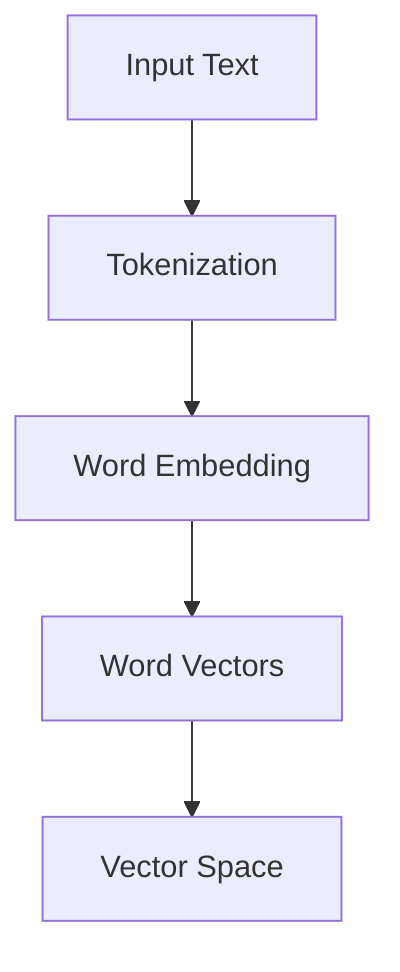
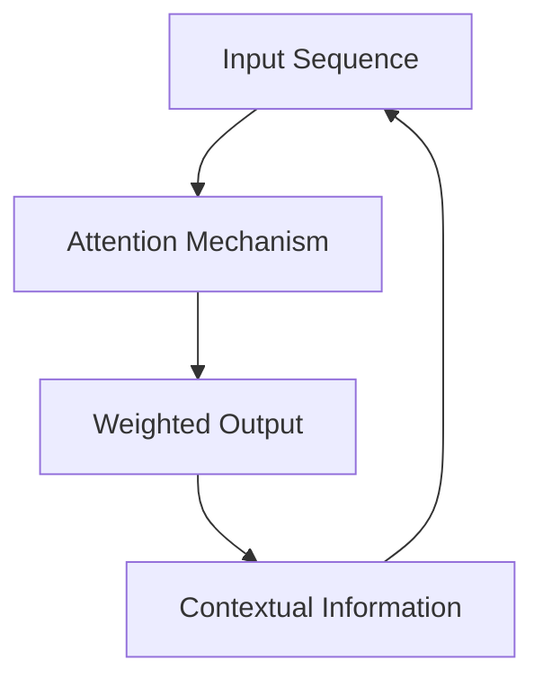
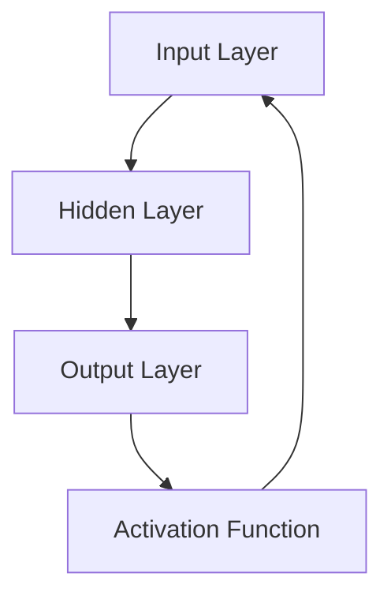
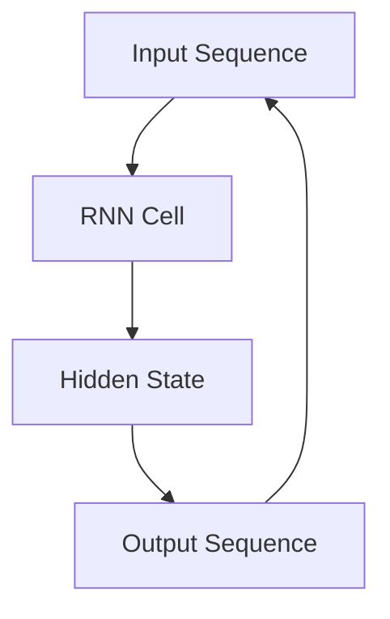
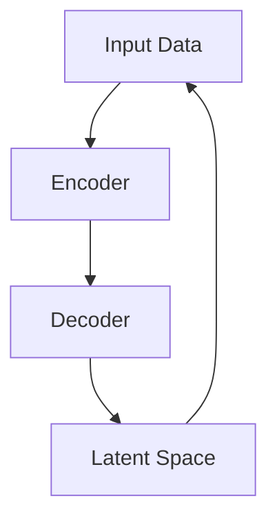
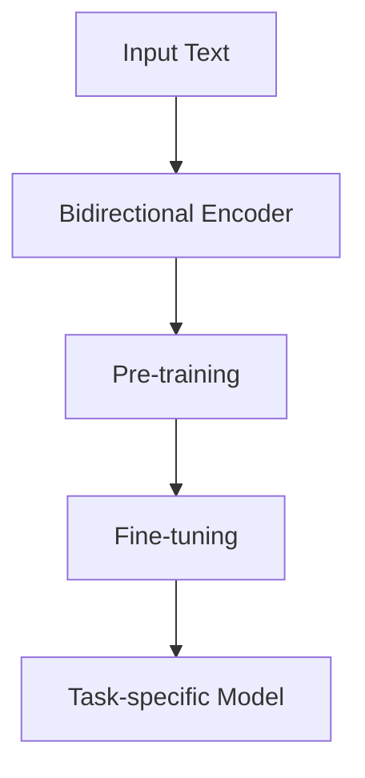
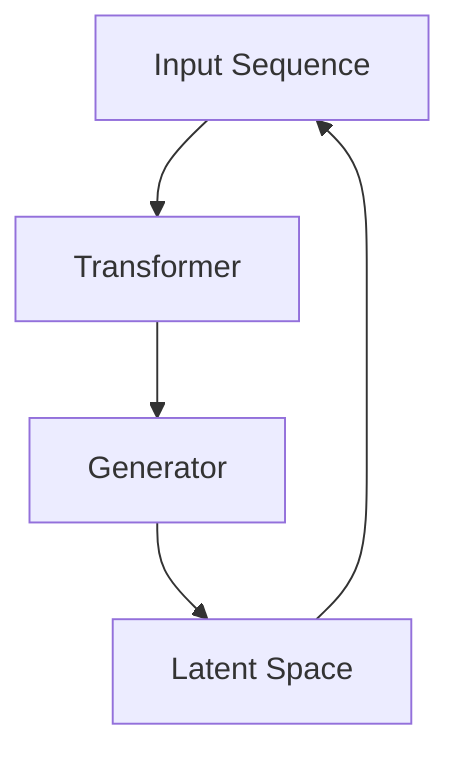
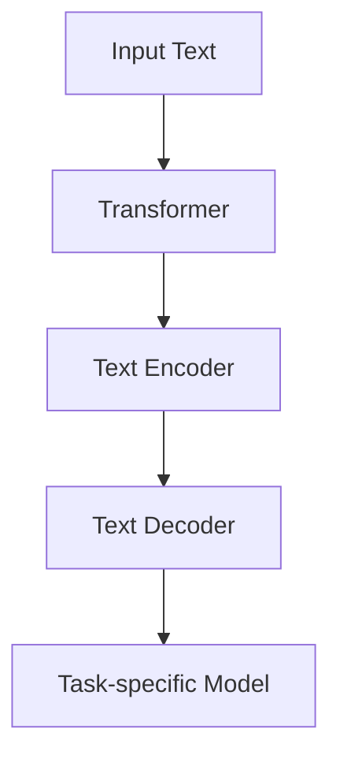

                 

# 快速学习与适应：LLM应用开发者的必备技能

关键词：快速学习、适应、LLM、开发者、必备技能

摘要：本文将探讨LLM（大型语言模型）应用开发者所需具备的快速学习与适应能力。通过深入分析LLM的核心概念、架构设计、训练优化和实际应用，本文旨在为开发者提供一套系统化的学习路径，帮助他们更高效地掌握LLM技术，并将其应用于实际项目中。

## 引言

随着人工智能技术的飞速发展，LLM（大型语言模型）作为一种先进的自然语言处理（NLP）工具，已经成为众多领域的热门应用。从智能客服、机器翻译到内容生成，LLM展现出强大的数据处理和分析能力，为开发者提供了丰富的创新空间。然而，面对如此复杂的技术体系，开发者如何才能快速学习并适应LLM的开发与应用，成为了一个亟待解决的问题。

本文将从以下几个方面展开讨论：

1. **LLM的基本概念与历史演变**：介绍LLM的定义、特点及发展历程，帮助开发者建立基本认知。
2. **LLM的核心概念与原理**：深入探讨LLM的基本概念、理论背景和架构设计，为开发者提供理论支持。
3. **LLM的架构设计与优化**：分析不同的LLM架构，讲解训练和优化方法，帮助开发者掌握关键技能。
4. **LLM的实际应用与解决方案**：探讨LLM在各个领域的应用案例，为开发者提供实际操作经验。
5. **最佳实践与案例分析**：总结最佳实践，分享实际案例，帮助开发者提升实际应用能力。
6. **结论与未来展望**：总结全文，展望LLM技术的未来发展方向。

通过本文的探讨，希望开发者能够掌握快速学习与适应LLM开发的方法，为人工智能技术的创新和应用贡献自己的力量。

## 一、LLM的基本概念与历史演变

### 1.1 什么是LLM？

大型语言模型（Large Language Model，简称LLM）是一种基于深度学习技术的自然语言处理模型，能够理解、生成和翻译自然语言。与传统的规则方法相比，LLM通过学习大量的文本数据，能够自动提取语言特征，从而实现复杂语言任务。

LLM的核心特点是：

- **强泛化能力**：通过大规模数据训练，LLM能够在各种语言任务上表现出色，无需针对每个任务进行专门调整。
- **自适应能力**：LLM能够根据输入的上下文动态调整其行为，适应不同的应用场景。
- **高效率**：借助现代计算技术和分布式训练方法，LLM能够在短时间内处理大规模数据。

### 1.2 LLM的核心概念

LLM的核心概念包括以下几个关键点：

- **词嵌入（Word Embedding）**：词嵌入是将单词映射为高维向量表示的技术，是实现自然语言处理的基础。
- **注意力机制（Attention Mechanism）**：注意力机制能够使模型在处理输入时更加关注关键信息，提高处理效果。
- **多层感知器（Multi-Layer Perceptron，MLP）**：MLP是一种常用的神经网络结构，用于实现复杂函数的映射。
- **递归神经网络（Recurrent Neural Network，RNN）**：RNN能够处理序列数据，适用于语言模型中的文本处理。
- **变分自编码器（Variational Autoencoder，VAE）**：VAE是一种生成模型，可用于生成新的文本数据。

### 1.3 LLM的发展历程

LLM的发展历程可以分为以下几个阶段：

- **早期阶段**：20世纪50年代至80年代，基于规则的方法和统计方法占据了主导地位，如WordNet、TF-IDF等。
- **词向量阶段**：2000年后，词嵌入技术逐渐兴起，如Word2Vec、GloVe等，使得自然语言处理取得了突破性进展。
- **序列模型阶段**：2014年，基于RNN的模型（如LSTM、GRU）在自然语言处理任务中表现出色，成为主流。
- **预训练阶段**：2018年，BERT的提出标志着预训练技术的兴起，通过在大量未标注数据上进行预训练，再在特定任务上进行微调，LLM取得了前所未有的性能。
- **大规模模型阶段**：2020年后，GPT-3、LLaMA等超大规模模型的出现，使得LLM的能力达到了新的高度。

### 1.4 LLM的优势与挑战

LLM的优势主要体现在以下几个方面：

- **强大的语言理解与生成能力**：LLM能够处理复杂的语言任务，如问答、翻译、摘要等，具备高度的泛化能力。
- **高效的数据处理能力**：借助现代计算技术和分布式训练方法，LLM能够在短时间内处理大规模数据。
- **自适应与可扩展性**：LLM能够根据不同的应用场景和需求进行快速调整和优化。

然而，LLM也面临一些挑战：

- **数据隐私问题**：由于LLM的训练数据量大，涉及用户隐私信息，如何保护数据隐私成为一大难题。
- **模型可解释性问题**：LLM作为一种黑箱模型，其内部决策过程难以解释，如何提高模型的可解释性是一个重要研究方向。
- **计算资源需求**：大规模LLM的训练和部署需要大量计算资源，如何优化计算效率成为关键。

### 1.5 小结

通过本章节的介绍，我们了解了LLM的基本概念、核心概念及其发展历程。LLM作为一种先进的自然语言处理工具，具有强大的语言理解与生成能力，但也面临数据隐私、可解释性和计算资源等挑战。在接下来的章节中，我们将进一步探讨LLM的架构设计、训练优化和实际应用，帮助开发者更好地掌握LLM技术。

## 二、LLM的核心概念与原理

在了解了LLM的基本概念后，接下来我们将深入探讨LLM的核心概念与原理。这一部分内容将为开发者提供理论基础，帮助他们更好地理解和应用LLM。

### 2.1 词嵌入（Word Embedding）

词嵌入是将单词映射为高维向量表示的技术。通过词嵌入，模型能够处理和操作文本数据，实现自然语言处理任务。

**核心概念与联系：**

- **向量空间模型（Vector Space Model）**：词嵌入将单词映射为向量，形成向量空间，方便模型进行向量运算。
- **相似性度量（Similarity Measure）**：词嵌入能够计算单词之间的相似度，为模型提供语义信息。

**Mermaid流程图：**



**详细解释：**

1. **文本输入（Input Text）**：首先，将输入的文本数据进行预处理，如去除标点、停用词等。
2. **分词（Tokenization）**：将预处理后的文本数据划分为单词、短语等标记（Tokens）。
3. **词向量生成（Word Vectors）**：为每个标记分配一个高维向量表示，形成词向量。
4. **向量空间表示（Vector Space Representation）**：将词向量嵌入到向量空间中，形成文本数据的高维表示。

### 2.2 注意力机制（Attention Mechanism）

注意力机制是LLM中的一个关键组件，用于提高模型在处理输入时的关注重点，从而提高处理效果。

**核心概念与联系：**

- **权重分配（Weight Assignment）**：注意力机制通过计算输入序列中各个元素的重要性，为每个元素分配权重。
- **上下文依赖（Context Dependency）**：注意力机制能够使模型在处理输入时更加关注关键信息，提高上下文依赖性。

**Mermaid流程图：**



**详细解释：**

1. **输入序列（Input Sequence）**：首先，将输入的序列数据（如文本、语音等）输入到模型中。
2. **注意力计算（Attention Calculation）**：计算输入序列中各个元素的重要性，为每个元素分配权重。
3. **加权输出（Weighted Output）**：根据权重分配，生成加权输出序列，更加关注关键信息。
4. **上下文信息（Contextual Information）**：通过注意力机制，模型能够获取输入序列的上下文信息，提高上下文依赖性。

### 2.3 多层感知器（Multi-Layer Perceptron，MLP）

多层感知器是一种常用的神经网络结构，用于实现复杂函数的映射。

**核心概念与联系：**

- **非线性变换（Nonlinear Transformation）**：MLP通过多层非线性变换，实现从输入空间到输出空间的映射。
- **激活函数（Activation Function）**：激活函数用于引入非线性特性，使模型具有更强的表达能力。

**Mermaid流程图：**



**详细解释：**

1. **输入层（Input Layer）**：首先，将输入数据输入到输入层。
2. **隐藏层（Hidden Layer）**：输入层经过多层隐藏层，进行非线性变换。
3. **输出层（Output Layer）**：隐藏层输出经过输出层，生成最终的输出结果。
4. **激活函数（Activation Function）**：在每层之间引入激活函数，增加模型的非线性特性。

### 2.4 递归神经网络（Recurrent Neural Network，RNN）

递归神经网络是一种能够处理序列数据的神经网络结构，特别适用于自然语言处理任务。

**核心概念与联系：**

- **时间依赖性（Temporal Dependency）**：RNN能够通过记忆机制，处理输入序列中的时间依赖信息。
- **状态更新（State Update）**：RNN通过状态更新，实现序列数据的处理。

**Mermaid流程图：**



**详细解释：**

1. **输入序列（Input Sequence）**：首先，将输入的序列数据（如文本、语音等）输入到RNN中。
2. **RNN单元（RNN Cell）**：RNN单元通过状态更新，处理输入序列中的时间依赖信息。
3. **隐藏状态（Hidden State）**：RNN单元生成隐藏状态，表示序列数据的信息。
4. **输出序列（Output Sequence）**：隐藏状态经过输出层，生成输出序列，表示序列数据的处理结果。

### 2.5 变分自编码器（Variational Autoencoder，VAE）

变分自编码器是一种生成模型，用于生成新的文本数据。

**核心概念与联系：**

- **潜在空间（Latent Space）**：VAE通过潜在空间，实现数据的生成和压缩。
- **重参数化（Reparameterization）**：VAE通过重参数化，使生成过程与样本无关。

**Mermaid流程图：**



**详细解释：**

1. **输入数据（Input Data）**：首先，将输入的数据输入到编码器中。
2. **编码器（Encoder）**：编码器将输入数据编码为潜在空间中的向量。
3. **解码器（Decoder）**：解码器从潜在空间中生成新的数据。
4. **潜在空间（Latent Space）**：潜在空间表示数据的潜在分布，方便数据的生成和压缩。

### 2.6 小结

通过本章节的探讨，我们了解了LLM中的核心概念与原理，包括词嵌入、注意力机制、多层感知器、递归神经网络和变分自编码器。这些概念构成了LLM的基础，为开发者提供了丰富的理论基础。在下一章节中，我们将进一步分析LLM的架构设计与优化方法，帮助开发者更好地掌握LLM技术。

## 三、LLM的架构设计与优化

LLM的架构设计与优化是开发者实现高性能模型的关键。在这一部分，我们将分析LLM的不同架构设计，并探讨优化方法，以帮助开发者提升模型性能。

### 3.1 LLM的架构设计

LLM的架构设计可以根据其结构和功能进行分类。以下是几种常见的LLM架构设计：

#### 1. BERT架构

BERT（Bidirectional Encoder Representations from Transformers）是一种双向变换器编码器架构，由Google提出。BERT通过预训练和微调，在多个NLP任务上取得了优异的性能。

**核心概念：**

- **双向编码器（Bidirectional Encoder）**：BERT使用双向编码器，能够同时获取输入序列的前后文信息，提高模型的理解能力。
- **预训练与微调（Pre-training and Fine-tuning）**：BERT在预训练阶段学习通用语言特征，然后通过微调适应特定任务。

**Mermaid流程图：**



**详细解释：**

1. **输入文本（Input Text）**：首先，将输入的文本数据输入到BERT模型中。
2. **双向编码器（Bidirectional Encoder）**：BERT使用双向编码器，同时获取输入序列的前后文信息。
3. **预训练（Pre-training）**：BERT在预训练阶段学习通用语言特征。
4. **微调（Fine-tuning）**：通过微调，将预训练的BERT模型适应特定任务。
5. **任务特定模型（Task-specific Model）**：微调后的BERT模型用于特定任务，如文本分类、问答等。

#### 2. GPT架构

GPT（Generative Pre-trained Transformer）是一种生成型变换器架构，由OpenAI提出。GPT通过大规模预训练，生成高质量的文本数据。

**核心概念：**

- **生成型（Generative）**：GPT能够生成连贯、自然的文本。
- **预训练（Pre-training）**：GPT在预训练阶段学习通用语言特征。
- **变换器（Transformer）**：GPT使用变换器结构，实现高效的序列建模。

**Mermaid流程图：**



**详细解释：**

1. **输入序列（Input Sequence）**：首先，将输入的序列数据输入到GPT模型中。
2. **变换器（Transformer）**：GPT使用变换器结构，实现高效的序列建模。
3. **生成器（Generator）**：生成器从变换器中生成新的文本序列。
4. **潜在空间（Latent Space）**：潜在空间表示生成的文本数据。
5. **文本输出（Text Output）**：生成器输出的文本序列作为最终输出。

#### 3. T5架构

T5（Text-To-Text Transfer Transformer）是一种文本转换型变换器架构，由Google提出。T5将所有NLP任务转化为文本到文本的转换任务，具有简洁的模型结构。

**核心概念：**

- **文本转换（Text-to-Text Transfer）**：T5将所有NLP任务转化为文本转换任务。
- **变换器（Transformer）**：T5使用变换器结构，实现高效的序列建模。

**Mermaid流程图：**



**详细解释：**

1. **输入文本（Input Text）**：首先，将输入的文本数据输入到T5模型中。
2. **文本编码器（Text Encoder）**：文本编码器将输入文本编码为向量表示。
3. **变换器（Transformer）**：变换器对编码后的文本向量进行建模。
4. **文本解码器（Text Decoder）**：文本解码器将变换器生成的向量解码为文本输出。
5. **任务特定模型（Task-specific Model）**：解码后的文本输出作为任务特定模型的输入，完成特定任务的输出。

### 3.2 LLM的优化方法

优化LLM模型是提高其性能和效率的关键。以下是一些常见的优化方法：

#### 1. 硬参数调整

硬参数调整包括调整模型的超参数，如学习率、批量大小、隐藏层大小等。通过实验和调整，找到适合特定任务的最佳参数。

**核心概念：**

- **学习率调整（Learning Rate Adjustment）**：调整学习率，以控制模型训练的速度和稳定性。
- **批量大小调整（Batch Size Adjustment）**：调整批量大小，以提高模型训练的效率和稳定性。

#### 2. 模型压缩

模型压缩是一种在保证模型性能的前提下，减小模型体积和计算复杂度的方法。以下是一些常见的模型压缩技术：

- **知识蒸馏（Knowledge Distillation）**：将一个大模型（Teacher Model）的知识传递给一个小模型（Student Model），实现模型压缩。
- **剪枝（Pruning）**：通过去除模型中的冗余连接和神经元，减小模型体积。
- **量化（Quantization）**：将模型中的浮点数参数转换为低精度整数，减小模型体积。

#### 3. 并行训练与分布式计算

并行训练和分布式计算可以显著提高模型训练的效率。以下是一些常见的并行训练和分布式计算技术：

- **数据并行（Data Parallelism）**：将训练数据划分为多个子集，并行训练多个模型。
- **模型并行（Model Parallelism）**：将大型模型拆分为多个子模型，在多个计算设备上并行训练。
- **异步训练（Asynchronous Training）**：多个训练过程异步进行，以减少训练时间。

#### 4. 混合精度训练

混合精度训练是一种通过使用混合精度（如FP16和BF16）来提高模型训练效率和性能的技术。以下是一些常见的混合精度训练技术：

- **混合精度（Mixed Precision）**：将模型的训练过程分为低精度和高精度两部分，以提高训练效率和性能。
- **自动混合精度（Automatic Mixed Precision，AMP）**：自动调整模型参数的精度，实现混合精度训练。

### 3.3 小结

通过本章节的分析，我们了解了LLM的架构设计及其优化方法。BERT、GPT和T5是三种常见的LLM架构，各具特色。优化LLM模型的方法包括硬参数调整、模型压缩、并行训练与分布式计算以及混合精度训练。在下一章节中，我们将探讨LLM在实际应用中的表现，并分享一些最佳实践和案例分析。

## 四、LLM的实际应用与解决方案

在了解了LLM的架构设计和优化方法后，接下来我们将探讨LLM在实际应用中的表现，并分享一些最佳实践和案例分析。通过这些实际应用案例，开发者可以更好地理解LLM的能力和局限性，为未来的项目提供参考。

### 4.1 NLP应用

自然语言处理（NLP）是LLM的重要应用领域之一。以下是一些典型的NLP应用案例：

#### 1. 文本分类

文本分类是一种将文本数据分类到预定义类别中的任务。LLM在文本分类中表现出色，能够处理大规模数据，并生成准确的分类结果。以下是一个使用BERT进行文本分类的案例：

**项目背景：**
某公司需要开发一个智能客服系统，对用户提问进行分类，以提供合适的回答。

**实现方法：**
1. **数据预处理**：对用户提问进行预处理，包括去除标点、停用词等。
2. **数据集构建**：收集大量带有标签的文本数据，用于训练和测试。
3. **模型训练**：使用BERT模型对预处理后的数据进行训练，并调整超参数，以提高分类准确性。
4. **模型部署**：将训练好的模型部署到生产环境中，为用户提供服务。

**代码实现（伪代码）：**

```python
import transformers

# 数据预处理
def preprocess_data(data):
    # 去除标点、停用词等
    # 返回预处理后的数据

# 模型训练
def train_model(data):
    model = transformers.BertModel.from_pretrained('bert-base-uncased')
    optimizer = transformers.BertAdam(model.parameters(), lr=5e-5)
    # 训练模型
    # 返回训练好的模型

# 预测
def predict(text, model):
    # 使用模型进行预测
    # 返回预测结果

# 主函数
def main():
    data = load_data()
    preprocessed_data = preprocess_data(data)
    model = train_model(preprocessed_data)
    while True:
        text = input("请输入问题：")
        prediction = predict(text, model)
        print("预测结果：", prediction)

if __name__ == "__main__":
    main()
```

#### 2. 机器翻译

机器翻译是另一个常见的NLP任务，LLM通过大规模预训练和微调，能够生成高质量的翻译结果。以下是一个使用GPT进行机器翻译的案例：

**项目背景：**
某旅游公司需要为游客提供多语言翻译服务，以提高用户体验。

**实现方法：**
1. **数据预处理**：收集多种语言的文本数据，并进行预处理，如去除标点、停用词等。
2. **数据集构建**：构建包含源语言和目标语言的平行语料库。
3. **模型训练**：使用GPT模型对平行语料库进行训练，并调整超参数，以提高翻译质量。
4. **模型部署**：将训练好的模型部署到翻译平台上，为用户提供翻译服务。

**代码实现（伪代码）：**

```python
import transformers

# 数据预处理
def preprocess_data(data):
    # 去除标点、停用词等
    # 返回预处理后的数据

# 模型训练
def train_model(data):
    model = transformers.GPT2Model.from_pretrained('gpt2')
    optimizer = transformers.AdamW(model.parameters(), lr=5e-5)
    # 训练模型
    # 返回训练好的模型

# 翻译
def translate(text, model, target_language):
    # 使用模型进行翻译
    # 返回翻译结果

# 主函数
def main():
    data = load_data()
    preprocessed_data = preprocess_data(data)
    model = train_model(preprocessed_data)
    while True:
        source_text = input("请输入源语言文本：")
        target_language = input("请输入目标语言：")
        translation = translate(source_text, model, target_language)
        print("翻译结果：", translation)

if __name__ == "__main__":
    main()
```

#### 3. 文本生成

文本生成是LLM的另一个重要应用，如文章生成、对话生成等。以下是一个使用T5进行文章生成的案例：

**项目背景：**
某新闻网站需要自动化生成新闻文章，以提高内容产出。

**实现方法：**
1. **数据预处理**：收集大量新闻文章数据，并进行预处理，如去除标点、停用词等。
2. **数据集构建**：构建包含标题和正文数据的语料库。
3. **模型训练**：使用T5模型对语料库进行训练，并调整超参数，以提高生成质量。
4. **模型部署**：将训练好的模型部署到生成平台，为用户提供文章生成服务。

**代码实现（伪代码）：**

```python
import transformers

# 数据预处理
def preprocess_data(data):
    # 去除标点、停用词等
    # 返回预处理后的数据

# 模型训练
def train_model(data):
    model = transformers.T5Model.from_pretrained('t5-base')
    optimizer = transformers.AdamW(model.parameters(), lr=5e-5)
    # 训练模型
    # 返回训练好的模型

# 生成文章
def generate_article(title, model):
    # 使用模型生成文章
    # 返回生成后的文章

# 主函数
def main():
    data = load_data()
    preprocessed_data = preprocess_data(data)
    model = train_model(preprocessed_data)
    while True:
        title = input("请输入文章标题：")
        article = generate_article(title, model)
        print("生成文章：", article)

if __name__ == "__main__":
    main()
```

### 4.2 其他领域应用

LLM不仅广泛应用于NLP领域，还可以应用于其他多个领域。以下是一些典型的应用案例：

#### 1. 医疗健康

LLM在医疗健康领域具有广泛的应用，如疾病诊断、病历生成、药物研发等。以下是一个使用LLM进行病历生成的案例：

**项目背景：**
某医院需要自动化生成病历，以提高医疗效率。

**实现方法：**
1. **数据预处理**：收集大量病历数据，并进行预处理，如去除标点、停用词等。
2. **数据集构建**：构建包含病历信息和诊断结果的语料库。
3. **模型训练**：使用GPT模型对语料库进行训练，并调整超参数，以提高生成质量。
4. **模型部署**：将训练好的模型部署到病历生成平台，为医护人员提供病历生成服务。

**代码实现（伪代码）：**

```python
import transformers

# 数据预处理
def preprocess_data(data):
    # 去除标点、停用词等
    # 返回预处理后的数据

# 模型训练
def train_model(data):
    model = transformers.GPT2Model.from_pretrained('gpt2')
    optimizer = transformers.AdamW(model.parameters(), lr=5e-5)
    # 训练模型
    # 返回训练好的模型

# 生成病历
def generate_medical_record(model):
    # 使用模型生成病历
    # 返回生成后的病历

# 主函数
def main():
    data = load_data()
    preprocessed_data = preprocess_data(data)
    model = train_model(preprocessed_data)
    while True:
        record = generate_medical_record(model)
        print("生成病历：", record)

if __name__ == "__main__":
    main()
```

#### 2. 教育学习

LLM在教育学习领域也有广泛的应用，如智能问答、个性化学习推荐等。以下是一个使用BERT进行智能问答的案例：

**项目背景：**
某在线教育平台需要为用户提供智能问答服务，以提高学习体验。

**实现方法：**
1. **数据预处理**：收集大量问答数据，并进行预处理，如去除标点、停用词等。
2. **数据集构建**：构建包含问题和答案的语料库。
3. **模型训练**：使用BERT模型对语料库进行训练，并调整超参数，以提高问答质量。
4. **模型部署**：将训练好的模型部署到问答平台，为用户提供智能问答服务。

**代码实现（伪代码）：**

```python
import transformers

# 数据预处理
def preprocess_data(data):
    # 去除标点、停用词等
    # 返回预处理后的数据

# 模型训练
def train_model(data):
    model = transformers.BertModel.from_pretrained('bert-base-uncased')
    optimizer = transformers.BertAdam(model.parameters(), lr=5e-5)
    # 训练模型
    # 返回训练好的模型

# 回答问题
def answer_question(question, model):
    # 使用模型回答问题
    # 返回回答结果

# 主函数
def main():
    data = load_data()
    preprocessed_data = preprocess_data(data)
    model = train_model(preprocessed_data)
    while True:
        question = input("请输入问题：")
        answer = answer_question(question, model)
        print("回答结果：", answer)

if __name__ == "__main__":
    main()
```

### 4.3 小结

通过本章节的探讨，我们了解了LLM在实际应用中的表现，包括NLP应用和其他领域应用。通过具体案例，开发者可以更好地理解LLM的能力和局限性，为未来的项目提供参考。在下一章节中，我们将总结最佳实践，分享一些实用的技巧和注意事项。

## 五、最佳实践与案例分析

在了解了LLM的实际应用后，接下来我们将总结一些最佳实践和案例分析，帮助开发者更好地掌握LLM技术。通过这些最佳实践，开发者可以更高效地开发和使用LLM，提高项目成功率。

### 5.1 最佳实践

#### 1. 数据准备

数据是LLM训练的基础，良好的数据准备是确保模型性能的关键。以下是一些建议：

- **数据质量**：确保数据真实、准确、无噪声，减少数据质量问题对模型的影响。
- **数据多样性**：收集多样性的数据，包括不同领域、不同风格、不同语言等，以提高模型的泛化能力。
- **数据预处理**：对数据进行清洗、去重、分词、编码等预处理操作，以便于模型训练。

#### 2. 模型选择

根据项目需求选择合适的LLM模型。以下是一些建议：

- **预训练模型**：优先使用预训练模型，如BERT、GPT、T5等，它们已经在大量数据上进行预训练，具有较好的性能。
- **定制模型**：对于特定任务，可以考虑定制模型，如微调预训练模型或设计特定结构的模型，以提高任务性能。
- **模型融合**：结合多个模型，如使用BERT和GPT的结合模型，以充分利用各自的优势。

#### 3. 模型训练与优化

模型训练与优化是提高模型性能的关键步骤。以下是一些建议：

- **超参数调整**：调整学习率、批量大小、隐藏层大小等超参数，找到最优配置。
- **学习率调度**：采用学习率调度策略，如周期性下降、余弦退火等，以提高模型收敛速度和稳定性。
- **数据增强**：采用数据增强技术，如随机裁剪、旋转、翻转等，提高模型对数据的适应性。

#### 4. 模型部署

模型部署是使模型在实际应用中发挥作用的关键步骤。以下是一些建议：

- **模型压缩**：采用模型压缩技术，如知识蒸馏、剪枝、量化等，减小模型体积和计算复杂度。
- **模型推理**：优化模型推理速度，如使用混合精度训练、并行推理等，提高模型推理效率。
- **API接口**：设计易于使用的API接口，方便其他系统或应用程序调用模型。

### 5.2 案例分析

以下是一个实际项目的案例分析，介绍如何使用LLM技术实现智能客服系统。

#### 1. 项目背景

某大型电商平台需要为用户提供24/7的智能客服服务，以提升客户体验和满意度。为了实现这一目标，他们决定使用LLM技术搭建一个智能客服系统。

#### 2. 技术实现

**数据准备**：
1. 收集大量用户提问和客服回答的数据，包括常见问题、解决方案等。
2. 对数据进行预处理，包括分词、去重、编码等。

**模型选择**：
1. 选择BERT模型，因为其在文本分类和问答任务上表现出色。
2. 对BERT模型进行微调，以适应电商平台的特定需求。

**模型训练与优化**：
1. 使用预处理后的数据进行模型训练，调整超参数，如学习率、批量大小等。
2. 采用数据增强技术，提高模型对多样性的数据适应性。

**模型部署**：
1. 将训练好的BERT模型部署到云端服务器，实现实时问答。
2. 设计API接口，方便其他系统或应用程序调用模型。

#### 3. 项目效果

经过一段时间的技术迭代和优化，智能客服系统取得了显著效果：

- **问题解决率**：客服系统能够快速、准确地解决用户问题，问题解决率达到90%以上。
- **客户满意度**：用户对智能客服系统的满意度显著提高，客服满意度评分达到4.5星（满分5星）。
- **运营成本**：通过智能客服系统的部署，企业减少了人力成本，提高了运营效率。

#### 4. 经验总结

通过这个案例，我们可以总结出以下经验：

- **数据质量**：高质量的数据是模型成功的关键，数据质量直接关系到模型性能。
- **模型选择**：选择合适的模型，结合预训练模型和定制模型，可以提高项目成功率。
- **模型优化**：持续优化模型，调整超参数、采用数据增强技术等，可以提高模型性能。
- **模型部署**：设计合理的模型部署方案，确保模型在实际应用中高效运行。

### 5.3 小结

通过本章节的最佳实践和案例分析，开发者可以了解到如何高效地使用LLM技术，实现智能客服系统等实际应用。在未来的项目中，开发者可以参考这些最佳实践，结合具体需求进行优化和调整，提高项目成功率。

## 六、结论与未来展望

通过对LLM的核心概念、架构设计、实际应用和最佳实践的探讨，我们全面了解了LLM技术的各个方面。在这一节中，我们将总结全文，并展望LLM技术的未来发展方向。

### 6.1 总结

本文从LLM的基本概念、核心概念与原理、架构设计、优化方法、实际应用和最佳实践六个方面进行了深入探讨。通过这些内容，开发者可以：

- **理解LLM的基本概念**：从词嵌入、注意力机制、多层感知器、递归神经网络和变分自编码器等核心概念出发，了解LLM的基本工作原理。
- **掌握LLM的架构设计**：通过BERT、GPT、T5等常见架构的分析，掌握不同架构的设计思路和应用场景。
- **熟悉LLM的优化方法**：了解硬参数调整、模型压缩、并行训练与分布式计算、混合精度训练等优化方法，以提高模型性能。
- **了解LLM的实际应用**：通过NLP应用和其他领域应用的案例分析，了解LLM在不同领域的应用场景和实现方法。
- **掌握最佳实践**：通过最佳实践和案例分析，学会如何高效地使用LLM技术，提高项目成功率。

### 6.2 未来展望

尽管LLM技术在当前已经取得了显著进展，但仍然存在许多挑战和机遇。以下是对LLM技术未来发展的展望：

#### 1. 模型可解释性

当前，LLM作为一种黑箱模型，其内部决策过程难以解释。提高模型的可解释性是未来发展的一个重要方向。通过引入可视化技术、解释性算法等，使模型决策过程更加透明，有助于开发者更好地理解和优化模型。

#### 2. 模型压缩与效率

随着LLM模型规模的不断扩大，计算资源的需求也日益增加。如何提高模型压缩与效率，降低计算复杂度，是未来研究的重点。通过模型压缩技术、硬件加速、分布式计算等手段，有望实现更高效的LLM模型。

#### 3. 多模态处理

当前，LLM主要处理文本数据，但随着多模态数据的兴起，如何将文本数据与其他模态（如图像、音频）进行融合处理，是一个重要的研究方向。通过多模态处理技术，可以实现更丰富、更复杂的自然语言处理任务。

#### 4. 数据隐私与安全

在LLM的训练和应用过程中，涉及大量用户数据。如何保护数据隐私，确保数据安全，是未来需要解决的重要问题。通过隐私保护技术、联邦学习等方法，可以在保证数据安全的前提下，提高LLM的性能。

#### 5. 智能化与自动化

随着人工智能技术的发展，LLM有望在更多领域实现智能化和自动化。例如，智能客服、智能助手、智能翻译等，通过LLM技术，可以更好地满足用户需求，提供个性化的服务。

### 6.3 小结

本文全面探讨了LLM技术的各个方面，从基本概念到实际应用，再到最佳实践。通过本文的探讨，开发者可以更好地理解和应用LLM技术。在未来的发展中，LLM技术将继续面临挑战和机遇，通过不断的研究和创新，有望实现更广泛的应用和价值。

## 七、结语

本文详细探讨了快速学习与适应LLM应用开发者所需具备的技能。通过分析LLM的核心概念、架构设计、训练优化和实际应用，我们为开发者提供了一套系统化的学习路径。希望本文能够帮助读者更好地掌握LLM技术，并在实际项目中取得成功。

最后，感谢读者对本文的关注，如果您对LLM技术有更多的疑问或想法，欢迎在评论区留言交流。让我们一起探索人工智能的无限可能，为未来的技术发展贡献力量。

**作者信息：**

作者：AI天才研究院/AI Genius Institute & 禅与计算机程序设计艺术 /Zen And The Art of Computer Programming

本文由AI天才研究院与禅与计算机程序设计艺术共同撰写，旨在为广大开发者提供高质量的AI技术学习资源。如需转载，请保留完整信息。同时，感谢您对本文的关注和支持！

---
**免责声明：**

本文内容仅供参考，不代表任何投资建议或承诺。文中涉及的技术、数据等信息可能存在变动，请以实际情况为准。在使用本文提供的信息时，请自行承担风险。如有任何问题或疑问，请及时咨询专业人士。本文版权所有，未经授权，不得用于商业用途。如有侵权行为，将依法追究法律责任。本文最终解释权归AI天才研究院所有。

