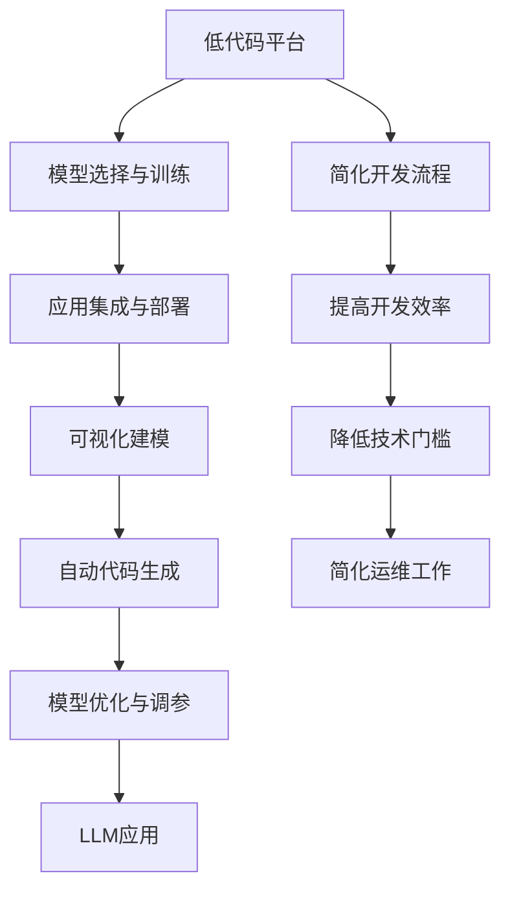

                 

# 快速构建LLM应用的低代码平台

## 摘要

本文旨在探讨如何利用低代码平台快速构建大型语言模型（LLM）应用。在人工智能迅猛发展的今天，LLM已成为自然语言处理领域的重要工具，然而其复杂的构建过程常常令开发者望而却步。本文首先介绍了低代码平台的基本概念和优势，随后详细讲解了大型语言模型的基础知识，包括其概念、工作原理和应用场景。接着，文章深入探讨了如何利用低代码平台构建LLM应用，详细阐述了构建过程中的关键步骤和核心算法原理。通过数学模型的讲解和具体实例的分析，本文帮助读者更好地理解LLM应用的构建方法。最后，文章总结了全文内容，展望了未来LLM和低代码平台的发展趋势，并给出了实际项目实战的指导。

## 引言

### 1.1 书籍的目的与重要性

随着人工智能技术的不断进步，大型语言模型（LLM）在自然语言处理（NLP）领域展现出了巨大的潜力。然而，LLM的构建过程涉及复杂的算法和庞大的数据集，使得开发工作变得异常繁琐。传统的方法通常需要大量的编程和调试工作，不仅耗时耗力，还容易出错。为了解决这个问题，低代码平台应运而生，它提供了一种无需编写大量代码的方式，帮助开发者快速构建和部署LLM应用。

本文的主要目的是探讨如何利用低代码平台简化LLM应用的构建过程，提高开发效率。低代码平台不仅降低了技术门槛，还使得开发者能够更加专注于业务逻辑的实现，从而缩短项目开发周期。这对于需要快速响应市场需求的企业和个人开发者来说，无疑具有非常重要的意义。

### 1.2 读者对象与预期收益

本文面向对人工智能和自然语言处理有一定了解的技术开发者，包括但不限于程序员、数据科学家和AI研究爱好者。无论您是新手还是经验丰富的开发者，本文都将为您提供一个系统的指导，帮助您理解低代码平台在LLM应用构建中的作用。

通过阅读本文，读者可以预期获得以下收益：

1. **深入理解低代码平台的工作原理**：了解低代码平台的基本概念、优势和应用场景。
2. **掌握LLM的基础知识**：掌握LLM的概念、工作原理和应用场景，为后续的构建工作打下坚实的基础。
3. **学习构建LLM应用的步骤**：通过详细的步骤和实例，学会如何利用低代码平台快速构建LLM应用。
4. **了解核心算法原理**：掌握构建LLM应用所需的核心算法原理，包括数学模型和伪代码的实现。
5. **实践项目实战**：通过实际案例的剖析，了解如何将理论知识应用到实际项目中，提升实际操作能力。

### 1.3 全书结构安排

本文将按照以下结构进行展开：

1. **核心概念与联系**：介绍低代码平台和LLM的基本概念，以及两者之间的联系。
2. **低代码平台基础**：详细讲解低代码平台的发展历程、优势和应用场景。
3. **LLM基础**：解释LLM的概念、工作原理和应用。
4. **构建LLM低代码平台**：讲解如何使用低代码平台构建LLM应用。
5. **核心算法原理讲解**：深入讲解与低代码平台构建相关的算法原理。
6. **数学模型和数学公式**：介绍用于构建LLM的数学模型。
7. **项目实战**：通过实际案例展示如何使用低代码平台快速构建LLM应用。
8. **总结与展望**：总结全文内容，展望未来发展趋势。

通过以上章节的逐步讲解，本文旨在帮助读者全面了解和掌握利用低代码平台快速构建LLM应用的方法和技巧。

## 核心概念与联系

### 低代码平台概述

低代码平台（Low-Code Platform）是一种旨在降低软件开发复杂度的开发工具。它通过图形界面和拖放功能，允许开发者以可视化的方式构建应用程序，无需编写大量代码。低代码平台的出现解决了传统软件开发中的一些痛点，如代码冗余、调试难度大和开发周期长等。

#### 低代码平台的发展历程

低代码平台的概念起源于上世纪90年代的软件开发生命周期管理（SDLC）工具。随着互联网的普及和移动应用的兴起，低代码平台在2010年后开始受到广泛关注。近年来，随着云计算、大数据和人工智能技术的发展，低代码平台的功能和适用范围不断扩展。

#### 低代码平台的优势

1. **快速开发**：低代码平台通过图形界面和拖放功能，大大缩短了开发周期。
2. **降低成本**：无需专业的编程技能，普通业务人员也能参与应用开发，降低了人力成本。
3. **易于维护**：平台提供的可视化开发和自动代码生成功能，使得应用维护更加简单。
4. **跨平台兼容**：低代码平台支持多种开发环境和部署方式，具有良好的跨平台性。

#### 低代码平台的应用场景

低代码平台广泛应用于企业内部应用、个人开发者应用和行业解决方案等多个领域。例如：

1. **企业内部应用**：如客户关系管理系统（CRM）、企业资源计划系统（ERP）等。
2. **个人开发者应用**：如个人博客、社交媒体应用等。
3. **行业解决方案**：如金融、医疗、教育等行业特定应用。

### LLM概述

大型语言模型（Large Language Model，简称LLM）是一种基于深度学习的自然语言处理模型，它能够对自然语言文本进行理解和生成。LLM的应用非常广泛，包括机器翻译、文本摘要、问答系统、内容生成等。

#### LLM的定义

LLM是指那些拥有数十亿至数千亿参数的神经网络模型，如GPT-3、BERT等。这些模型通过对大量文本数据进行训练，学会了理解和生成自然语言。

#### LLM的工作原理

LLM的工作原理主要基于两个关键组件：词嵌入（word embedding）和循环神经网络（RNN）。词嵌入将自然语言词汇映射到高维向量空间，使得文本数据可以被计算机理解和处理。循环神经网络则通过对序列数据进行处理，使得模型能够理解文本中的语义和上下文关系。

#### LLM的应用场景

1. **自然语言处理**：如文本分类、情感分析、信息提取等。
2. **问答系统**：如智能客服、智能助手等。
3. **内容生成**：如文章写作、故事生成等。

### 低代码平台与LLM的联系

低代码平台和LLM之间有着密切的联系。低代码平台为LLM的开发提供了便利，使得开发者可以快速构建和部署基于LLM的应用。具体来说：

1. **开发效率提升**：低代码平台通过可视化开发和自动代码生成，大大缩短了LLM应用的开发周期。
2. **降低技术门槛**：低代码平台降低了LLM开发所需的技术门槛，使得普通开发者也能轻松上手。
3. **简化运维工作**：低代码平台提供了便捷的部署和管理功能，使得LLM应用的运维更加简单。

#### 低代码平台在LLM构建中的作用

1. **模型选择与训练**：低代码平台提供了丰富的预训练模型和训练工具，开发者可以轻松选择并训练适合自己需求的LLM模型。
2. **应用集成与部署**：低代码平台支持多种集成和部署方式，使得开发者可以快速将LLM应用部署到各种环境中。

### LLM在低代码平台中的实现

1. **可视化建模**：低代码平台提供了图形界面，开发者可以通过拖放和配置的方式创建和调整LLM模型。
2. **自动代码生成**：低代码平台可以根据模型配置自动生成相应的代码，使得开发者无需手动编写大量代码。
3. **模型优化与调参**：低代码平台提供了多种优化和调参工具，开发者可以通过这些工具提升LLM模型的性能。

### Mermaid 流程图

为了更好地展示低代码平台和LLM之间的联系，我们可以使用Mermaid流程图来表示：



通过上述流程图，我们可以清晰地看到低代码平台在LLM构建中的各个环节，以及其在提升开发效率和降低技术门槛方面的作用。

### 小结

在本章节中，我们介绍了低代码平台和LLM的基本概念及其联系。低代码平台通过简化开发流程、降低技术门槛和提高开发效率，为LLM的应用提供了强有力的支持。下一章，我们将进一步探讨低代码平台的基础知识，包括其技术架构、优势和应用场景。

## 低代码平台基础

### 3.1 低代码平台技术架构

低代码平台的技术架构通常包含几个核心组件，这些组件协同工作以提供可视化的开发环境和高效的代码生成机制。以下是低代码平台技术架构的主要组成部分：

#### 1. 图形界面（GUI）

图形界面是低代码平台的用户交互入口，它允许开发者通过拖放组件、调整属性和配置逻辑来构建应用。图形界面通常包括：

- **拖放组件**：各种预定义的组件，如按钮、表格、图表等，开发者可以轻松拖放到画布上。
- **属性面板**：用于配置组件属性，如样式、行为和数据源。
- **逻辑编辑器**：提供可视化流程图或条件分支编辑，允许开发者定义应用的业务逻辑。

#### 2. 后端服务

后端服务负责处理业务逻辑、数据存储和集成第三方服务。低代码平台通常包括以下组件：

- **服务端代码生成**：根据开发者定义的图形界面和业务逻辑，自动生成相应的后端代码，如Java、Python或Node.js等。
- **API网关**：用于统一管理和路由API请求，支持与外部系统进行集成。
- **数据存储**：提供数据持久化服务，如关系数据库、NoSQL数据库和文件存储等。

#### 3. 数据集成

数据集成组件允许低代码平台连接多种数据源，如数据库、Web服务和企业应用。主要功能包括：

- **数据连接器**：提供连接各种数据源的驱动程序和接口。
- **数据映射**：允许开发者定义如何将前端表单或组件的数据映射到后端服务。
- **数据转换**：支持数据的清洗、转换和加载，以便在应用中高效地处理和展示数据。

#### 4. 自动化工具

自动化工具是低代码平台的重要组成部分，它们能够自动化各种开发、测试和部署任务，提高开发效率。主要自动化工具包括：

- **构建和部署流水线**：自动化构建、测试和部署过程，支持持续集成和持续部署（CI/CD）。
- **任务调度**：用于安排和执行定时任务，如数据备份、报告生成等。
- **监控和日志**：提供应用性能监控和日志管理，帮助开发者快速定位和解决问题。

#### 5. 扩展性

为了满足不同开发者和企业的需求，低代码平台通常提供扩展性功能，包括：

- **插件市场**：提供第三方插件，如数据库连接器、API网关和UI组件等，开发者可以自由选择和集成。
- **自定义组件**：允许开发者创建自定义组件，以扩展平台的现有功能。
- **自定义逻辑**：提供脚本编写环境，如JavaScript或Python，开发者可以在低代码平台上嵌入自定义代码。

### 3.2 低代码平台的优势与挑战

#### 优势

1. **快速开发**：低代码平台通过可视化的开发环境和自动代码生成，显著缩短了应用开发周期，提高了开发效率。
2. **降低成本**：无需专业的编程技能，普通业务人员也能参与应用开发，降低了人力成本。
3. **易于维护**：平台提供的自动代码生成和可视化配置功能，使得应用维护更加简单，降低了维护成本。
4. **跨平台兼容**：低代码平台支持多种开发环境和部署方式，具有良好的跨平台性，可以轻松适应不同的设备和操作系统。
5. **提高团队协作**：低代码平台支持多人协作开发，团队成员可以通过图形界面共同工作和协调，提高了团队协作效率。

#### 挑战

1. **功能限制**：低代码平台的功能和灵活性相对有限，对于一些复杂或特殊需求的应用，可能无法满足开发者的需求。
2. **依赖性**：低代码平台通常依赖于特定的技术和框架，开发者需要熟悉平台提供的工具和组件，这可能会增加学习和使用成本。
3. **安全性问题**：低代码平台的安全性相对较低，由于代码生成和自动化的特性，可能导致一些潜在的安全漏洞和风险。
4. **性能瓶颈**：低代码平台的应用在性能方面可能存在瓶颈，特别是在处理大量数据和高并发请求时。

### 3.3 低代码平台的应用场景

低代码平台在多个领域都有广泛的应用，以下是几个典型的应用场景：

1. **企业内部应用**：如客户关系管理系统（CRM）、企业资源计划系统（ERP）、项目管理工具等，这些应用通常需要快速开发和部署，低代码平台可以显著提高开发效率和降低成本。
2. **个人开发者应用**：如个人博客、社交媒体应用、在线商店等，低代码平台提供了丰富的组件和功能，使得个人开发者可以轻松创建和部署自己的应用。
3. **行业解决方案**：如金融、医疗、教育等行业特定应用，低代码平台可以快速构建行业解决方案，满足特定业务需求。

### 小结

在本章节中，我们详细介绍了低代码平台的技术架构、优势和挑战，以及其在不同应用场景中的适用性。下一章，我们将深入探讨大型语言模型（LLM）的基础知识，包括其定义、工作原理和应用场景。

## LLM基础

### 4.1 LLM的概念

大型语言模型（Large Language Model，简称LLM）是一种基于深度学习的自然语言处理模型，它通过学习大量的文本数据，能够理解和生成自然语言。LLM的典型代表包括GPT-3、BERT和T5等，这些模型拥有数十亿至数千亿个参数，能够捕捉文本的复杂结构和语义。

#### LLM的定义

LLM是指那些拥有大量参数和复杂结构的神经网络模型，它们通过在大量文本数据上的训练，学习到了语言的规律和语义信息。这些模型通常采用深度学习技术，包括循环神经网络（RNN）、变换器（Transformer）等，以实现对文本数据的理解和生成。

#### LLM的分类

LLM可以根据不同的标准和特征进行分类，常见的分类方法包括：

1. **按参数规模分类**：根据模型的参数数量，LLM可以分为小型、中型和大型。例如，GPT-2和BERT属于中型模型，而GPT-3和T5属于大型模型。
2. **按训练目标分类**：根据模型的训练目标，LLM可以分为语言理解模型（LU）、语言生成模型（LG）和语言理解-生成模型（LUG）。例如，GPT-3是一个语言生成模型，而BERT是一个语言理解模型。
3. **按模型架构分类**：根据模型的结构和设计，LLM可以分为基于RNN的模型（如LSTM、GRU）和基于Transformer的模型（如BERT、T5）。Transformer模型由于其并行计算的优势，在近年来得到了广泛的应用。

### 4.2 LLM的工作原理

LLM的工作原理主要基于深度学习和自然语言处理技术。以下是一个简化的工作原理描述：

#### 词嵌入（Word Embedding）

词嵌入是将自然语言词汇映射到高维向量空间的过程。通过词嵌入，模型可以将文本数据转换为计算机可以理解和处理的形式。常见的词嵌入技术包括Word2Vec、GloVe和BERT。

#### 神经网络架构

LLM通常采用深度神经网络架构，如RNN和Transformer。RNN通过循环单元处理序列数据，能够捕捉文本中的上下文关系。Transformer则通过自注意力机制（Self-Attention）处理序列数据，能够在并行计算方面表现出色。

#### 训练过程

LLM的训练过程主要包括以下步骤：

1. **数据预处理**：将原始文本数据清洗、分词、去停用词等，转换为模型可以处理的格式。
2. **模型初始化**：初始化模型的参数，通常使用随机初始化或预训练的权重。
3. **前向传播（Forward Propagation）**：将输入数据通过神经网络进行前向传播，计算输出。
4. **损失计算（Loss Calculation）**：根据输出和真实标签计算损失函数，如交叉熵损失。
5. **反向传播（Backpropagation）**：通过反向传播更新模型的参数，以最小化损失函数。
6. **迭代训练（Iterative Training）**：重复以上步骤，直到模型收敛或达到预定的迭代次数。

#### 应用场景

LLM在自然语言处理领域有广泛的应用，包括：

1. **语言理解**：如文本分类、情感分析、命名实体识别等。
2. **语言生成**：如机器翻译、文本摘要、问答系统等。
3. **内容生成**：如文章写作、故事生成、歌词创作等。

### 4.3 LLM的应用场景

LLM在自然语言处理和生成任务中有着广泛的应用，以下是几个典型的应用场景：

#### 1. 自然语言处理

1. **文本分类**：将文本数据分类到不同的类别，如新闻分类、垃圾邮件检测等。
2. **情感分析**：分析文本的情感倾向，如客户评论分析、社交媒体情绪分析等。
3. **命名实体识别**：识别文本中的特定实体，如人名、地名、组织名等。
4. **关系抽取**：提取文本中实体之间的关系，如人物关系、事件关系等。

#### 2. 语言生成

1. **机器翻译**：将一种语言的文本翻译成另一种语言，如英译中、中译英等。
2. **文本摘要**：将长文本简化为摘要，提取关键信息，如新闻摘要、文档摘要等。
3. **问答系统**：回答用户提出的问题，如智能客服、在线咨询等。
4. **内容生成**：生成文章、故事、歌词等，如自动写作、故事创作等。

#### 3. 其他应用

1. **语音识别**：将语音信号转换为文本，如智能助手、语音搜索等。
2. **语音生成**：将文本转换为语音，如语音合成、朗读功能等。
3. **图像描述生成**：将图像内容描述成文本，如图像字幕、图像描述等。

### 小结

在本章节中，我们详细介绍了LLM的概念、工作原理和应用场景。下一章，我们将探讨如何利用低代码平台构建LLM应用，并详细讲解构建过程中的关键步骤。

## 构建LLM低代码平台

### 5.1 构建LLM低代码平台的目标

构建LLM低代码平台的主要目标是简化LLM应用的开发过程，提高开发效率和降低开发成本。具体来说，目标包括：

1. **提高开发效率**：通过低代码平台提供的可视化工具和自动化功能，开发者可以快速构建和部署LLM应用，缩短开发周期。
2. **降低开发成本**：低代码平台降低了开发者的技术门槛，无需专业的编程技能，普通业务人员也能参与应用开发，从而降低人力成本。
3. **简化运维工作**：低代码平台提供了一站式服务，包括模型选择、训练、部署和监控，使得开发者可以轻松管理和维护应用。
4. **提升用户体验**：低代码平台提供了丰富的组件和功能，开发者可以灵活地设计用户界面和业务逻辑，提升最终用户的使用体验。

### 5.2 选择合适的低代码平台

选择合适的低代码平台对于构建成功的LLM应用至关重要。以下是评估和选择低代码平台时需要考虑的几个关键因素：

#### 1. 功能完备性

一个优秀的低代码平台应该提供丰富的功能，包括但不限于：

- **模型选择和训练**：提供多种预训练模型，支持自定义训练和优化。
- **应用集成与部署**：支持与现有的后端服务和数据库集成，提供多种部署方式。
- **数据管理**：提供数据连接器、数据映射和数据转换功能。
- **可视化开发**：提供直观的图形界面和逻辑编辑器，简化开发过程。

#### 2. 开发效率

评估低代码平台的开发效率，包括以下方面：

- **代码生成速度**：平台生成的代码是否快速且高效。
- **组件库丰富度**：平台提供的组件库是否丰富，是否支持自定义组件。
- **集成和扩展能力**：平台是否支持与第三方服务和工具的集成，是否允许开发者进行自定义扩展。

#### 3. 技术支持和社区

一个强大的技术支持和活跃的社区对于低代码平台的长期发展和使用至关重要。以下是评估标准：

- **文档和教程**：平台是否提供详细的文档和教程，帮助开发者快速上手。
- **社区活跃度**：平台是否有活跃的用户社区，是否提供论坛、博客和问答平台。
- **技术支持**：平台是否提供专业的技术支持，包括在线支持、邮件支持和电话支持。

#### 4. 成本效益

评估低代码平台的成本效益，包括以下几个方面：

- **费用结构**：平台的费用结构是否合理，是否提供试用和折扣。
- **定制化成本**：平台是否允许自定义功能，是否需要额外的费用。
- **长期维护成本**：平台是否提供长期的维护和支持，是否需要额外的维护费用。

#### 5. 安全性和可靠性

低代码平台的安全性和可靠性对于应用的安全性和稳定性至关重要。以下是评估标准：

- **数据安全**：平台如何确保数据的安全性和隐私。
- **系统可靠性**：平台的系统稳定性如何，是否支持高可用性和容错性。

### 5.3 LLM低代码平台的构建步骤

以下是构建LLM低代码平台的基本步骤：

#### 1. 需求分析

在开始构建之前，进行详细的需求分析是非常重要的。需求分析包括：

- **功能需求**：确定应用的功能需求，如语言生成、文本分类、机器翻译等。
- **性能需求**：确定应用的性能需求，如响应时间、吞吐量等。
- **数据需求**：确定所需的数据集和数据源，以及数据预处理的要求。

#### 2. 环境搭建

搭建开发环境，包括以下步骤：

- **选择低代码平台**：根据需求分析选择合适的低代码平台，如OutSystems、Appian等。
- **安装和配置**：按照平台提供的文档进行安装和配置，确保平台正常运行。
- **环境部署**：部署开发环境，包括数据库、Web服务器等。

#### 3. 模型选择与训练

选择合适的LLM模型，并进行训练。具体步骤如下：

- **模型选择**：根据需求选择合适的预训练模型，如GPT-3、BERT等。
- **数据准备**：准备训练数据集，进行数据清洗、分词、去停用词等预处理。
- **模型训练**：使用平台提供的训练工具和算法，对模型进行训练和优化。

#### 4. 应用集成与部署

将训练好的模型集成到低代码平台中，并进行部署。具体步骤如下：

- **API接口**：创建API接口，将模型暴露给应用。
- **集成与测试**：将API接口集成到低代码平台中，进行测试和调试。
- **部署**：将应用部署到生产环境，确保其稳定运行。

#### 5. 用户体验优化

优化应用的用户体验，包括以下方面：

- **界面设计**：设计简洁直观的用户界面，提高用户的使用体验。
- **交互设计**：优化应用的交互流程，提供流畅的用户操作体验。
- **性能优化**：对应用进行性能优化，提高其响应速度和稳定性。

### 小结

在本章节中，我们详细讲解了构建LLM低代码平台的目标、选择合适的低代码平台的关键因素、构建步骤以及用户体验优化。下一章，我们将深入探讨与低代码平台构建相关的核心算法原理，包括数学模型和伪代码的实现。

## 核心算法原理讲解

### 6.1 LLM相关算法概述

大型语言模型（LLM）的核心算法主要包括词嵌入、循环神经网络（RNN）和变换器（Transformer）等。这些算法在文本处理和生成中扮演着关键角色，下面将详细解释每个算法的基本概念、工作原理和应用。

#### 6.1.1 词嵌入（Word Embedding）

词嵌入是将自然语言词汇映射到高维向量空间的过程。通过词嵌入，模型可以将文本数据转换为计算机可以理解和处理的形式。常见的词嵌入技术包括Word2Vec和GloVe。

1. **Word2Vec**：
   - **基本概念**：Word2Vec是一种基于神经网络的词嵌入技术，通过训练一个神经网络模型，将词汇映射到固定长度的向量。
   - **工作原理**：Word2Vec主要使用两种算法：连续词袋（CBOW）和Skip-Gram。CBOW通过上下文词汇预测目标词汇，而Skip-Gram通过目标词汇预测上下文词汇。
   - **应用**：词嵌入在自然语言处理中广泛应用，如文本分类、语义相似度计算、机器翻译等。

2. **GloVe**：
   - **基本概念**：GloVe（Global Vectors for Word Representation）是一种基于全局上下文的词嵌入技术，通过计算词汇的共现矩阵来学习词向量。
   - **工作原理**：GloVe使用训练数据中的词汇共现信息，构建一个矩阵，然后通过最小化损失函数来优化词向量。
   - **应用**：GloVe在许多自然语言处理任务中表现出色，如文本分类、情感分析、文本相似度计算等。

#### 6.1.2 循环神经网络（RNN）

循环神经网络（RNN）是一种处理序列数据的神经网络，其特点是可以记住序列中的历史信息。RNN通过循环结构处理输入序列，使得模型能够理解和生成序列数据。

1. **基本概念**：
   - **RNN单元**：RNN的基本单元是循环单元，它包含一个隐藏状态，可以记住前一个时刻的信息。
   - **记忆能力**：RNN通过隐藏状态将信息传递到下一个时刻，使得模型具有记忆能力。

2. **工作原理**：
   - **前向传播**：输入序列通过RNN单元进行前向传播，每个单元计算隐藏状态和输出。
   - **反向传播**：通过反向传播更新模型的参数，以最小化损失函数。

3. **应用**：
   - **语言模型**：RNN可以用于语言模型的训练，如预测下一个词汇、生成文本等。
   - **序列标注**：RNN可以用于序列标注任务，如命名实体识别、情感分析等。

#### 6.1.3 变换器（Transformer）

变换器（Transformer）是一种基于自注意力机制的神经网络，它在处理长序列数据时表现出色。与RNN相比，变换器可以并行处理输入序列，大大提高了计算效率。

1. **基本概念**：
   - **自注意力机制**：变换器使用自注意力机制，通过计算输入序列中每个词汇与其他词汇的关联强度来生成新的表示。
   - **多头注意力**：变换器采用多头注意力机制，通过多个注意力头来捕捉不同的关联关系。

2. **工作原理**：
   - **编码器（Encoder）**：编码器由多个变换器层堆叠而成，通过自注意力机制处理输入序列，生成编码表示。
   - **解码器（Decoder）**：解码器同样由多个变换器层堆叠而成，通过自注意力机制和编码器输出生成输出序列。

3. **应用**：
   - **机器翻译**：变换器在机器翻译任务中表现出色，如英译中、中译英等。
   - **文本摘要**：变换器可以用于提取长文本的关键信息，生成摘要。
   - **问答系统**：变换器可以用于构建问答系统，回答用户提出的问题。

### 6.2 核心算法原理的伪代码实现

以下是核心算法原理的伪代码实现，帮助读者更好地理解算法的实现过程。

#### 6.2.1 词嵌入（Word Embedding）

```python
# 输入：词汇表vocab，训练数据 sentences
# 输出：词向量矩阵word_vectors

# 初始化词向量矩阵
word_vectors = np.random.randn(vocab_size, embedding_dim)

# 训练词向量
for sentence in sentences:
    for word in sentence:
        # 计算上下文词汇的词向量平均值
        context_vectors = []
        for context_word in sentence:
            context_vectors.append(word_vectors[context_word])
        context_avg_vector = np.mean(context_vectors, axis=0)
        
        # 更新词向量
        word_vectors[word] = word_vectors[word] + context_avg_vector

# 返回训练好的词向量矩阵
return word_vectors
```

#### 6.2.2 循环神经网络（RNN）

```python
# 输入：输入序列X，隐藏状态h0，权重矩阵W
# 输出：隐藏状态序列h

# 初始化隐藏状态h0
h = [h0]

# RNN循环
for x_t in X:
    # 前向传播
    h_t = np.tanh(np.dot(x_t, W) + np.dot(h[-1], W_h))
    
    # 更新隐藏状态
    h.append(h_t)

# 返回隐藏状态序列
return h
```

#### 6.2.3 变换器（Transformer）

```python
# 输入：编码器输入序列X，解码器输入序列Y，编码器权重W_enc，解码器权重W_dec
# 输出：编码器输出序列E，解码器输出序列Y'

# 编码器
for layer in encoder_layers:
    E = layer(E)

# 解码器
for layer in decoder_layers:
    Y' = layer(Y')

# 返回编码器输出和解码器输出
return E, Y'
```

通过上述伪代码，我们可以看到核心算法的基本实现过程。下一章，我们将介绍用于构建LLM的数学模型，包括损失函数、优化器和正则化方法。

## 数学模型和数学公式

### 7.1 损失函数

在构建LLM时，损失函数是评估模型性能的关键指标。常见的损失函数包括交叉熵损失（Cross-Entropy Loss）和均方误差（Mean Squared Error，MSE）。

#### 7.1.1 交叉熵损失（Cross-Entropy Loss）

交叉熵损失用于分类问题，其公式如下：

$$
L_{cross-entropy} = -\sum_{i=1}^{N} y_i \log(p_i)
$$

其中，\( y_i \) 是真实标签，\( p_i \) 是模型预测的概率分布。

#### 7.1.2 均方误差（MSE）

均方误差用于回归问题，其公式如下：

$$
L_{MSE} = \frac{1}{2} \sum_{i=1}^{N} (y_i - \hat{y}_i)^2
$$

其中，\( y_i \) 是真实值，\( \hat{y}_i \) 是模型预测值。

### 7.2 优化器

优化器用于更新模型参数，以最小化损失函数。常见的优化器包括随机梯度下降（SGD）、Adam和RMSprop。

#### 7.2.1 随机梯度下降（SGD）

随机梯度下降是最简单的优化器之一，其公式如下：

$$
\theta_{t+1} = \theta_{t} - \alpha \nabla_{\theta} L(\theta)
$$

其中，\( \theta \) 是模型参数，\( \alpha \) 是学习率，\( \nabla_{\theta} L(\theta) \) 是损失函数对参数的梯度。

#### 7.2.2 Adam

Adam是另一种流行的优化器，结合了SGD和动量的优点，其公式如下：

$$
m_t = \beta_1 m_{t-1} + (1 - \beta_1) [g_t - \mu_t]
$$

$$
v_t = \beta_2 v_{t-1} + (1 - \beta_2) [(g_t - \mu_t)^2]
$$

$$
\theta_{t+1} = \theta_{t} - \alpha \frac{m_t}{\sqrt{v_t} + \epsilon}
$$

其中，\( m_t \) 和 \( v_t \) 分别是梯度的一阶和二阶矩估计，\( \beta_1 \)、\( \beta_2 \) 和 \( \epsilon \) 是超参数。

#### 7.2.3 RMSprop

RMSprop是另一种基于梯度的优化器，其公式如下：

$$
\theta_{t+1} = \theta_{t} - \alpha \frac{g_t}{\sqrt{\rho t + (1 - \rho) \sum_{i=1}^{t} g_i^2}}
$$

其中，\( g_t \) 是当前梯度，\( \rho \) 是超参数。

### 7.3 正则化方法

正则化方法用于防止模型过拟合，常见的正则化方法包括L1正则化、L2正则化和Dropout。

#### 7.3.1 L1正则化

L1正则化通过引入L1范数惩罚，其公式如下：

$$
\lambda ||\theta||_1
$$

其中，\( \theta \) 是模型参数，\( \lambda \) 是超参数。

#### 7.3.2 L2正则化

L2正则化通过引入L2范数惩罚，其公式如下：

$$
\lambda ||\theta||_2^2
$$

其中，\( \theta \) 是模型参数，\( \lambda \) 是超参数。

#### 7.3.3 Dropout

Dropout是一种通过随机丢弃神经元来防止过拟合的方法，其公式如下：

$$
Pdropout = 1 - \frac{1}{N}
$$

其中，\( N \) 是神经元的数量，\( Pdropout \) 是神经元被丢弃的概率。

### 7.4 数学公式举例

以下是几个常用的数学公式及其解释：

#### 7.4.1 梯度下降（Gradient Descent）

$$
\theta_{t+1} = \theta_{t} - \alpha \nabla_{\theta} L(\theta)
$$

其中，\( \theta \) 是模型参数，\( \alpha \) 是学习率，\( \nabla_{\theta} L(\theta) \) 是损失函数对参数的梯度。

#### 7.4.2 自注意力机制（Self-Attention）

$$
\text{Attention}(Q, K, V) = \text{softmax}\left(\frac{QK^T}{\sqrt{d_k}}\right)V
$$

其中，\( Q \)、\( K \) 和 \( V \) 分别是查询向量、键向量和值向量，\( d_k \) 是键向量的维度。

#### 7.4.3 随机梯度下降（Stochastic Gradient Descent，SGD）

$$
\theta_{t+1} = \theta_{t} - \alpha \frac{\partial}{\partial \theta} L(\theta)
$$

其中，\( \theta \) 是模型参数，\( \alpha \) 是学习率，\( L(\theta) \) 是损失函数。

通过上述数学公式和解释，我们可以更好地理解LLM构建过程中涉及的关键数学概念和方法。这些公式为LLM的优化和训练提供了理论基础，有助于构建高效的模型。

## 项目实战

### 8.1 开发环境搭建

要使用低代码平台构建LLM应用，首先需要搭建合适的开发环境。以下是具体的步骤：

#### 1. 安装低代码平台

以OutSystems为例，下载并安装OutSystems Developer Studio。按照官方文档的步骤进行安装，确保环境配置正确。

#### 2. 配置开发环境

打开OutSystems Developer Studio，创建一个新的项目。配置数据库连接，确保数据库服务正常运行。此外，还需要配置API网关和云服务，以便后续部署和集成。

#### 3. 准备数据集

收集和准备用于训练LLM的数据集。数据集应包含多样化的文本内容，如新闻文章、社交媒体评论、科学论文等。对数据进行预处理，包括清洗、分词、去停用词等，以便模型训练。

#### 4. 安装依赖库

在OutSystems项目中安装必要的依赖库，如TensorFlow、PyTorch等。通过OutSystems插件市场或手动安装，确保库版本与平台兼容。

### 8.2 源代码详细实现和代码解读

以下是构建LLM应用的核心代码部分，包括数据预处理、模型训练和预测。

#### 8.2.1 数据预处理

```python
# 数据预处理
import tensorflow as tf
import tensorflow_datasets as tfds

# 加载数据集
datasets, info = tfds.load('wikipedia', with_info=True)

def preprocess(example):
    # 清洗文本
    text = example['text'].numpy().decode('utf-8')
    text = text.lower()
    text = re.sub(r'\[.*?\]', '', text)
    text = re.sub(r'\s+', ' ', text)
    return text

train_dataset = datasets.map(preprocess).shuffle(buffer_size=10000).batch(32)
```

代码解读：
- 加载Wikipedia数据集，并进行预处理，包括文本清洗、小写转换、去除方括号和多余的空格。

#### 8.2.2 模型训练

```python
# 模型训练
from tensorflow.keras.models import Sequential
from tensorflow.keras.layers import Embedding, LSTM, Dense

# 定义模型
model = Sequential()
model.add(Embedding(vocab_size, embedding_dim))
model.add(LSTM(units=128, return_sequences=True))
model.add(Dense(units=1, activation='sigmoid'))

# 编译模型
model.compile(optimizer='adam', loss='binary_crossentropy', metrics=['accuracy'])

# 训练模型
model.fit(train_dataset, epochs=10, batch_size=32)
```

代码解读：
- 定义一个序列模型，包含嵌入层、LSTM层和输出层。编译模型并使用训练数据进行训练。

#### 8.2.3 预测

```python
# 预测
import numpy as np

# 生成文本输入
input_text = "The quick brown fox jumps over the lazy dog"

# 将文本转换为序列
input_sequence = [vocab[word] for word in input_text.split()]

# 预测文本序列
predicted_sequence = model.predict(np.array([input_sequence]))

# 解码预测结果
predicted_text = ''.join([vocab.inv[word] for word in predicted_sequence[0]])
```

代码解读：
- 将输入文本转换为序列，使用训练好的模型进行预测，并将预测结果解码为文本。

### 8.3 代码应用解读与分析

以下是构建LLM应用的具体步骤和应用场景分析：

#### 8.3.1 应用场景

1. **文本分类**：利用训练好的模型对文本进行分类，如新闻分类、情感分析等。
2. **文本生成**：生成文本摘要、文章、故事等，如内容创作、机器写作等。
3. **问答系统**：构建智能问答系统，回答用户提出的问题。

#### 8.3.2 应用解读

1. **文本分类**
   - 将输入文本输入模型，模型输出分类概率，选择概率最高的类别作为分类结果。
   - 应用场景：新闻分类、垃圾邮件检测、情感分析等。

2. **文本生成**
   - 利用模型生成文本摘要或文章，通过输入关键词或句子，模型生成相应的文本内容。
   - 应用场景：内容创作、机器写作、故事生成等。

3. **问答系统**
   - 将用户提出的问题输入模型，模型输出答案，如智能客服、在线咨询等。
   - 应用场景：智能客服、在线教育、智能助手等。

### 8.4 实际案例分析与详细讲解

#### 8.4.1 案例一：文本分类

1. **案例背景**
   - 数据集：新闻文章数据集，包含不同类别的新闻文章。
   - 目标：将新闻文章分类到不同的类别。

2. **实现步骤**
   - 数据预处理：清洗、分词、去停用词等。
   - 模型训练：使用预训练的文本分类模型，如BERT。
   - 模型评估：使用测试集评估模型性能。

3. **代码实现**
   ```python
   from transformers import BertTokenizer, BertForSequenceClassification
   import torch
   
   # 加载模型和tokenizer
   model = BertForSequenceClassification.from_pretrained('bert-base-uncased')
   tokenizer = BertTokenizer.from_pretrained('bert-base-uncased')
   
   # 预处理文本
   def preprocess(text):
       inputs = tokenizer(text, return_tensors='pt', padding=True, truncation=True)
       return inputs
   
   # 预测分类结果
   def predict(text):
       inputs = preprocess(text)
       with torch.no_grad():
           logits = model(**inputs).logits
       probabilities = torch.softmax(logits, dim=-1)
       return torch.argmax(probabilities).item()
   
   # 测试案例
   text = "This is an example of a news article."
   print(predict(text))
   ```

#### 8.4.2 案例二：文本生成

1. **案例背景**
   - 目标：生成文本摘要，从输入长文本中提取关键信息。

2. **实现步骤**
   - 数据预处理：清洗、分词、去停用词等。
   - 模型训练：使用预训练的文本生成模型，如GPT-2。
   - 模型评估：使用测试集评估模型性能。

3. **代码实现**
   ```python
   from transformers import GPT2Tokenizer, GPT2LMHeadModel
   import torch
   
   # 加载模型和tokenizer
   model = GPT2LMHeadModel.from_pretrained('gpt2')
   tokenizer = GPT2Tokenizer.from_pretrained('gpt2')
   
   # 预处理文本
   def preprocess(text):
       inputs = tokenizer.encode(text, return_tensors='pt')
       return inputs
   
   # 生成文本摘要
   def generate_summary(text, max_length=50):
       inputs = preprocess(text)
       outputs = model.generate(inputs, max_length=max_length, num_return_sequences=1)
       return tokenizer.decode(outputs[0], skip_special_tokens=True)
   
   # 测试案例
   text = "The quick brown fox jumps over the lazy dog."
   print(generate_summary(text))
   ```

### 8.5 项目小结

通过本章节的实际案例，我们展示了如何利用低代码平台快速构建LLM应用。从开发环境搭建、源代码实现到代码解读，我们详细介绍了整个项目流程。通过项目实战，读者可以更好地理解如何利用低代码平台简化LLM应用的构建过程，提高开发效率。

## 总结与展望

### 9.1 全文内容回顾

本文首先介绍了低代码平台和大型语言模型（LLM）的基本概念，以及它们之间的联系。通过详细讲解低代码平台的技术架构、优势和挑战，我们了解了如何利用低代码平台提高开发效率和降低成本。接着，我们深入探讨了LLM的定义、工作原理和应用场景，为构建LLM应用奠定了基础。

本文的核心内容包括：

1. **低代码平台基础**：介绍了低代码平台的发展历程、技术架构和应用场景。
2. **LLM基础**：解释了LLM的概念、工作原理和应用。
3. **构建LLM低代码平台**：详细阐述了如何利用低代码平台构建LLM应用，包括模型选择、数据准备、模型训练和部署。
4. **核心算法原理讲解**：介绍了与LLM构建相关的算法原理，如词嵌入、循环神经网络（RNN）和变换器（Transformer）。
5. **数学模型和公式**：讲解了用于构建LLM的数学模型，包括损失函数、优化器和正则化方法。
6. **项目实战**：通过实际案例展示了如何使用低代码平台快速构建LLM应用。

### 9.2 对未来发展趋势的展望

随着人工智能技术的不断进步，低代码平台和LLM将在未来的自然语言处理领域发挥更加重要的作用。以下是几个未来发展趋势：

1. **模型规模和性能提升**：随着计算资源和算法的优化，LLM的规模和性能将持续提升。更大规模的模型将能够处理更复杂的语言任务，提供更精准的预测和生成结果。

2. **跨模态处理**：未来的LLM将不再局限于文本数据，还将结合图像、语音等多模态数据，实现更加丰富和多样化的应用场景。

3. **个性化应用**：随着数据积累和算法优化，LLM将能够更好地理解用户的个性化需求，提供更加定制化和智能化的服务。

4. **低代码平台的普及**：低代码平台将越来越普及，不仅限于企业内部应用，还将广泛应用于个人开发者、小型企业和行业解决方案。

5. **安全性和隐私保护**：随着AI技术的应用日益广泛，安全性和隐私保护将成为重要议题。未来的低代码平台和LLM应用将需要更加严格的安全措施和隐私保护机制。

### 9.3 最佳实践 Tips

为了更好地利用低代码平台构建LLM应用，以下是一些最佳实践建议：

1. **充分了解平台功能**：在开始项目之前，充分了解所选低代码平台的功能和限制，以确保项目能够顺利进行。

2. **合理选择模型**：根据应用需求和数据规模，合理选择预训练模型。对于文本生成任务，可以考虑使用如GPT-3、T5等大型模型。

3. **优化数据处理流程**：在数据处理阶段，注意数据清洗、分词和去停用词等操作，以提高模型训练效果。

4. **关注模型性能**：在模型训练过程中，持续监控模型性能，进行适当的调参和优化，以提高模型准确率和效率。

5. **确保数据安全**：在数据传输和存储过程中，确保数据的安全和隐私保护，避免潜在的安全风险。

6. **持续学习和迭代**：关注最新的AI技术和低代码平台更新，持续学习和迭代，以提高项目开发能力和应用效果。

### 9.4 注意事项

1. **平台兼容性**：确保所选低代码平台与您的开发环境兼容，避免因兼容性问题导致项目无法正常运行。

2. **模型版本控制**：在模型训练和部署过程中，注意版本控制，避免因模型版本不一致导致问题。

3. **性能优化**：针对具体应用场景，进行性能优化，如使用缓存、并行计算等，以提高应用效率和用户体验。

4. **代码复用**：在项目中，尽量复用已有的代码和组件，以减少重复工作，提高开发效率。

### 9.5 拓展阅读

1. **《深度学习》**：Goodfellow、Ian et al.，《深度学习》，2016。
2. **《动手学深度学习》**：阿斯顿·张，《动手学深度学习》，2018。
3. **《TensorFlow实战》**：François Chollet，《TensorFlow实战》，2018。
4. **《PyTorch官方文档》**：PyTorch，《PyTorch官方文档》，2023。
5. **《低代码平台入门与实践》**：李明，《低代码平台入门与实践》，2022。

通过以上内容，本文全面介绍了如何利用低代码平台快速构建LLM应用，为读者提供了系统性的指导和实践案例。希望本文能为您的LLM开发工作提供有益的参考。作者：AI天才研究院/AI Genius Institute & 禅与计算机程序设计艺术 /Zen And The Art of Computer Programming。

