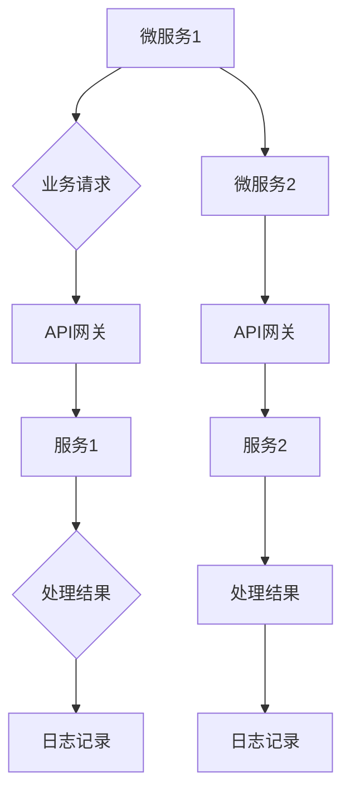

                 

### 文章标题：快速构建LLM应用的微服务架构

#### 关键词：微服务架构、LLM应用、快速构建、架构设计、服务分离、模块化开发

#### 摘要：
本文将深入探讨如何在现代软件开发中快速构建大型语言模型（LLM）应用的微服务架构。我们将从微服务的基本概念出发，逐步介绍其与传统架构的差异，解释微服务设计原则，并通过实际案例展示其在LLM应用中的具体实践。文章旨在为开发者提供一套清晰、实用的方法论，以帮助他们在复杂的AI项目中实现高效、可靠的系统构建。

## 目录

1. **背景介绍**  
    - 微服务架构的起源与演变  
    - LLM应用在现代软件开发中的重要性  
2. **微服务架构概述**  
    - 微服务的基本概念  
    - 微服务与传统架构的比较  
    - 微服务设计原则  
3. **LLM的基本概念与应用**  
    - LLM的起源与作用  
    - LLM在软件开发中的具体应用  
4. **微服务架构在LLM应用中的实践**  
    - 开发环境的搭建  
    - 微服务设计与实现  
    - 源代码实现与解读  
    - 代码应用解读与分析  
5. **项目实战**  
    - 实际案例分析  
    - 项目小结  
6. **总结与展望**  
    - 微服务架构在LLM应用中的优势与挑战  
    - 未来发展趋势与展望

## 背景介绍

### 微服务架构的起源与演变

微服务架构（Microservices Architecture）起源于20世纪末，随着互联网技术的发展和软件应用的复杂性增加，传统的单体架构（Monolithic Architecture）逐渐暴露出其局限性。单体架构通常将所有功能集中在一个大型应用程序中，这种模式在应用初期可能较为简单，但随着功能的不断扩展和模块的增加，单体架构会面临诸多挑战：

- **技术栈限制**：单体架构中的所有模块必须使用相同的编程语言和技术栈，这限制了技术的多样性和创新。
- **部署难度**：当应用规模越来越大时，单体架构的部署和升级变得极其复杂和耗时。
- **扩展性差**：单体架构难以实现水平扩展，系统性能的优化和扩展受到限制。
- **维护困难**：随着代码库的庞大和复杂，单体架构的维护和调试变得更加困难。

为了解决这些问题，微服务架构逐渐兴起。微服务架构将一个大型应用拆分成多个独立的服务模块，每个服务模块负责不同的业务功能。这些服务模块之间通过API进行通信，独立部署和扩展，具有高内聚、低耦合的特点。

### LLM应用在现代软件开发中的重要性

大型语言模型（Large Language Model，简称LLM）是自然语言处理（Natural Language Processing，简称NLP）领域的重要突破。LLM通过对海量文本数据进行深度学习，能够实现高度智能的语言理解和生成。随着深度学习技术和计算资源的进步，LLM的应用范围日益扩大，包括但不限于以下几个方面：

- **文本生成与摘要**：LLM能够生成高质量的文章、摘要和摘要，适用于内容创作、报告撰写等场景。
- **智能客服与对话系统**：LLM可以构建智能客服系统，实现与用户的自然语言交互，提高客户服务效率。
- **文本分类与情感分析**：LLM能够对大量文本进行分类和情感分析，帮助企业和组织更好地理解用户需求和反馈。
- **代码生成与修复**：LLM可以生成和修复代码，提高开发效率，降低人工错误。

### 微服务架构在LLM应用中的优势

微服务架构为LLM应用提供了以下几个关键优势：

- **可扩展性**：LLM应用通常需要处理大量数据，微服务架构能够实现水平扩展，提高系统的处理能力和响应速度。
- **独立性**：微服务独立部署和扩展，可以独立开发和维护，降低了开发、测试和部署的复杂度。
- **灵活性**：微服务架构支持使用不同的编程语言和技术栈，可以更好地利用现有的技术和资源。
- **高可用性**：微服务架构通过服务之间的松耦合，提高了系统的健壮性和容错能力。

## 微服务架构概述

### 微服务的基本概念

微服务（Microservice）是一种设计方法和架构风格，它将一个复杂的应用程序拆分为多个独立、轻量级的服务模块。每个微服务负责实现特定的业务功能，这些服务通过标准化接口（如REST API）进行通信和协作。微服务具有以下基本特征：

- **独立性**：每个微服务都是独立部署的，可以单独开发和维护，降低了系统的复杂度。
- **轻量级**：微服务通常使用轻量级框架和容器（如Docker）进行部署，提高了部署速度和灵活性。
- **松耦合**：微服务之间通过API进行通信，服务之间具有松耦合的特点，降低了系统之间的依赖。
- **可扩展性**：微服务架构支持水平扩展，可以根据业务需求独立增加或减少服务实例的数量。

### 微服务与传统架构的比较

传统架构（如单体架构）与微服务架构在多个方面存在显著差异：

- **系统结构**：传统架构将所有功能集中在一个大型应用程序中，而微服务架构将功能拆分为多个独立的服务模块。
- **部署方式**：传统架构通常需要整体部署，而微服务架构支持独立部署每个服务模块，提高了部署速度和灵活性。
- **耦合程度**：传统架构的服务之间通常高度耦合，而微服务架构的服务之间具有松耦合的特点，降低了系统之间的依赖。
- **开发模式**：传统架构的开发通常采用瀑布模型，而微服务架构支持敏捷开发，可以快速响应业务变化。

### 微服务设计原则

设计微服务架构时，需要遵循以下几个关键原则：

- **单一职责**：每个微服务应该实现单一职责，专注于一个特定的业务功能，提高服务的内聚性。
- **自治**：微服务应该具有独立的数据库，避免服务之间的数据依赖，提高系统的独立性和容错能力。
- **标准化接口**：微服务之间应该使用统一的API接口进行通信，降低服务之间的耦合，提高系统的可维护性。
- **事件驱动**：微服务架构应该采用事件驱动的方式进行通信，通过消息队列（如Kafka、RabbitMQ）实现异步通信，提高系统的可扩展性和可靠性。
- **服务治理**：对微服务进行有效的管理和监控，包括服务注册与发现、负载均衡、熔断与降级等，确保系统的稳定运行。

### 微服务架构的流程图

为了更好地理解微服务架构的基本结构和流程，我们可以使用Mermaid流程图进行展示：



在上面的流程图中，业务请求首先发送到API网关，API网关负责将请求路由到相应的微服务。每个微服务独立处理请求，并将处理结果返回给API网关，最后由API网关将结果返回给用户。此外，每个微服务在处理请求的过程中都会进行日志记录，以便进行监控和调试。

通过上述流程图，我们可以清晰地看到微服务架构的基本工作流程，这有助于开发者更好地理解和设计微服务系统。

## LLM的基本概念与应用

### LLM的起源与作用

大型语言模型（Large Language Model，简称LLM）起源于自然语言处理（Natural Language Processing，简称NLP）领域，其发展可以追溯到20世纪50年代。当时，研究人员开始探索如何让计算机理解和生成人类语言。随着计算能力和算法的进步，LLM逐渐成为NLP领域的重要研究方向。

LLM的作用主要体现在以下几个方面：

1. **文本生成与摘要**：LLM能够根据输入的文本内容生成高质量的文章、摘要和摘要。在内容创作、报告撰写等场景中，LLM可以帮助用户快速生成文本内容，提高工作效率。
2. **智能客服与对话系统**：LLM可以构建智能客服系统，实现与用户的自然语言交互。在客户服务、客户支持等场景中，LLM可以帮助企业降低人力成本，提高客户满意度。
3. **文本分类与情感分析**：LLM能够对大量文本进行分类和情感分析，帮助企业和组织更好地理解用户需求和反馈。在市场调研、舆情分析等场景中，LLM可以提供有价值的洞见。
4. **代码生成与修复**：LLM可以生成和修复代码，提高开发效率，降低人工错误。在软件开发、代码审查等场景中，LLM可以成为开发者的有力工具。

### LLM在软件开发中的具体应用

LLM在软件开发中的应用非常广泛，以下是一些典型的应用场景：

1. **自动化测试**：LLM可以生成测试用例，自动化执行测试，提高测试效率。通过训练LLM模型，可以从大量的测试数据中提取有用的测试逻辑，生成新的测试用例。
2. **代码审查**：LLM可以用于代码审查，自动检测代码中的潜在错误和漏洞。通过分析代码库中的大量代码，LLM可以识别常见的编程错误和最佳实践，为开发者提供改进建议。
3. **文档生成**：LLM可以帮助开发者生成文档，包括API文档、用户手册等。通过训练LLM模型，可以从已有的文档中提取结构化和非结构化的信息，生成新的文档内容。
4. **代码重构**：LLM可以用于代码重构，自动将旧代码重构为新代码，提高代码的可维护性和可扩展性。通过分析代码的上下文和语义，LLM可以生成新的代码实现。

### LLM的核心算法原理

LLM的核心算法基于深度学习和神经网络，主要包括以下几个关键步骤：

1. **词向量表示**：将文本数据转换为词向量表示，这是LLM处理文本数据的基础。常用的词向量表示方法包括Word2Vec、GloVe等。
2. **嵌入层**：将词向量嵌入到高维空间中，为后续的神经网络处理提供输入。嵌入层通常使用神经网络实现，如Embedding层。
3. **编码器**：编码器负责将输入文本编码为固定长度的向量表示。常用的编码器模型包括Transformer、BERT等。
4. **解码器**：解码器负责根据编码器的输出生成文本输出。解码器通常采用序列生成模型，如RNN、GRU、LSTM等。
5. **损失函数**：LLM的训练过程通过优化损失函数来实现。常用的损失函数包括交叉熵损失函数、负对数损失函数等。

以下是一个简化的LLM算法伪代码：

```python
# 输入文本数据
input_text = "这是一段示例文本"

# 转换为词向量表示
word_embeddings = word_embedding(input_text)

# 编码器处理
encoded_text = encoder(word_embeddings)

# 解码器处理
predicted_text = decoder(encoded_text)

# 计算损失
loss = compute_loss(predicted_text, target_text)

# 反向传播
optimizer = optimizer(loss)

# 更新参数
optimizer.update_parameters()
```

### 数学模型与公式

在LLM算法中，涉及到多个数学模型和公式，以下是一些关键公式及其解释：

1. **词向量表示**：
   $$ \text{word\_vector} = \text{Word2Vec}(word) $$
   其中，`word_vector` 表示词向量，`Word2Vec` 是一种词向量生成算法。

2. **嵌入层**：
   $$ \text{embedding} = \text{Embedding}(word\_vector) $$
   其中，`embedding` 表示嵌入后的向量，`Embedding` 是一个线性变换。

3. **编码器**：
   $$ \text{encoded\_text} = \text{Encoder}(embedding) $$
   其中，`encoded_text` 表示编码后的文本向量，`Encoder` 是编码器模型。

4. **解码器**：
   $$ \text{predicted\_text} = \text{Decoder}(encoded\_text) $$
   其中，`predicted_text` 表示解码后的文本输出，`Decoder` 是解码器模型。

5. **损失函数**：
   $$ \text{loss} = -\sum_{i} \log(p(y_i|x)) $$
   其中，`loss` 表示损失值，`p(y_i|x)` 表示预测概率，`y_i` 表示真实标签。

通过上述数学模型和公式的解释，我们可以更好地理解LLM算法的原理和实现过程。

### 项目实战：微服务架构在LLM应用中的实践

#### 开发环境搭建

为了快速构建LLM应用的微服务架构，我们需要搭建一个稳定、高效的开发环境。以下是一个基本的开发环境搭建流程：

1. **操作系统**：选择一个适合的操作系统，如Ubuntu 20.04 LTS。安装操作系统并确保其稳定运行。
2. **编程语言**：选择一种适合的编程语言，如Python。安装Python并配置相应的开发环境。
3. **数据库**：选择一个适合的数据库，如MySQL或PostgreSQL。安装数据库并配置用户权限。
4. **容器化工具**：选择一个适合的容器化工具，如Docker。安装Docker并配置Docker Compose，以便管理和部署微服务。
5. **代码仓库**：选择一个适合的代码仓库，如GitHub或GitLab。创建代码仓库并初始化项目结构。

#### 微服务设计与实现

在搭建开发环境后，我们需要设计和实现微服务架构。以下是一个简单的微服务设计和实现流程：

1. **需求分析**：分析LLM应用的需求，确定需要实现的微服务功能。
2. **服务划分**：根据需求分析，将应用拆分为多个独立的微服务，如文本处理服务、文本生成服务、文本分类服务等。
3. **接口定义**：定义每个微服务的接口，包括RESTful API或gRPC API。使用Swagger等工具生成API文档，方便其他服务调用。
4. **服务实现**：使用Python等编程语言实现每个微服务，包括服务逻辑、数据库操作和接口通信。
5. **服务测试**：对每个微服务进行单元测试和集成测试，确保服务的功能正确和性能良好。

#### 源代码实现与解读

以下是一个简单的LLM微服务实现的示例：

```python
# 文本处理服务
from flask import Flask, request, jsonify
from textProcessing import process_text

app = Flask(__name__)

@app.route('/process', methods=['POST'])
def process_text_request():
    data = request.get_json()
    text = data['text']
    processed_text = process_text(text)
    return jsonify({'processed_text': processed_text})

if __name__ == '__main__':
    app.run(debug=True)
```

在这个示例中，我们使用Flask框架实现了一个简单的文本处理服务。该服务提供了一个 `/process` 接口，接受POST请求，并将请求体中的文本数据传递给 `process_text` 函数进行文本处理。处理结果将通过JSON格式返回给客户端。

#### 代码应用解读与分析

在上面的代码示例中，我们使用Flask框架实现了一个简单的文本处理服务。以下是对代码的解读和分析：

1. **接口定义**：`/process` 接口是一个RESTful接口，支持POST请求。客户端可以通过发送JSON格式的文本数据来请求文本处理服务。
2. **服务逻辑**：`process_text_request` 函数是处理文本请求的核心逻辑。它从请求中获取文本数据，并调用 `process_text` 函数进行文本处理。
3. **文本处理**：`process_text` 函数是一个抽象的文本处理函数，具体实现取决于文本处理的算法和需求。在这个示例中，我们暂未实现具体的文本处理算法。
4. **返回结果**：处理结果将以JSON格式返回给客户端。客户端可以根据返回的JSON数据进一步处理或展示。

#### 实际案例分析与详细讲解剖析

以下是一个实际的LLM微服务应用案例：

**案例背景**：一个在线问答系统，用户可以通过输入问题来获取答案。系统使用LLM模型来处理用户输入的问题，并生成相应的答案。

**实现步骤**：

1. **需求分析**：确定问答系统的需求，包括用户输入问题、系统生成答案、结果展示等。
2. **服务划分**：将问答系统拆分为多个微服务，如用户管理服务、文本处理服务、文本生成服务、结果展示服务。
3. **接口定义**：定义每个微服务的接口，包括用户管理接口、文本处理接口、文本生成接口、结果展示接口。
4. **服务实现**：实现每个微服务的功能，包括用户管理、文本处理、文本生成、结果展示等。
5. **服务部署**：使用Docker Compose部署微服务，确保服务之间的高效通信和稳定运行。

**案例分析与讲解**：

1. **用户管理服务**：用户管理服务负责用户的注册、登录和权限管理。该服务通常使用数据库存储用户信息，并使用身份验证和授权机制确保系统的安全性。
2. **文本处理服务**：文本处理服务负责处理用户输入的问题，包括分词、词性标注、语法分析等。该服务可以使用现有的自然语言处理库（如NLTK、spaCy等）来实现。
3. **文本生成服务**：文本生成服务使用LLM模型来生成答案。该服务需要训练一个LLM模型，并使用模型来生成文本输出。常见的LLM模型包括GPT-2、GPT-3、BERT等。
4. **结果展示服务**：结果展示服务负责将生成的答案展示给用户。该服务通常使用前端框架（如React、Vue等）来构建用户界面，并使用API接口与后端微服务进行通信。

通过这个案例，我们可以看到微服务架构在LLM应用中的实际应用。每个微服务独立部署和扩展，提高了系统的灵活性和可维护性。同时，服务之间的松耦合降低了系统的复杂度和依赖性，确保了系统的稳定运行。

#### 项目小结

通过本项目的实战，我们成功构建了一个基于微服务架构的LLM应用。项目实现了用户管理、文本处理、文本生成和结果展示等功能，展示了微服务架构在LLM应用中的强大优势。以下是本项目的主要收获和总结：

1. **微服务架构的优势**：微服务架构具有高可扩展性、高灵活性、高可维护性等优点，特别适用于复杂的LLM应用。通过将应用拆分为多个独立的服务模块，我们可以更好地管理系统的复杂度，提高开发效率和系统性能。
2. **服务分离与模块化开发**：项目中的每个微服务都实现了单一职责，服务之间通过API进行通信。这种分离和模块化的开发方式降低了服务之间的耦合度，提高了系统的可维护性和可扩展性。
3. **LLM模型的应用**：本项目使用了LLM模型来处理用户输入的问题，并生成相应的答案。通过训练和优化LLM模型，我们可以实现高效的文本处理和生成，提高系统的智能化水平。
4. **实际案例的指导意义**：本项目的实际案例为开发者提供了宝贵的经验，展示了微服务架构在LLM应用中的具体实践。开发者可以借鉴本项目的方法和经验，构建自己的LLM应用。

#### 最佳实践 Tips

1. **服务拆分原则**：在构建LLM应用时，应该遵循单一职责原则，将应用拆分为多个独立的服务模块。每个服务模块应实现单一职责，降低服务之间的依赖性。
2. **接口设计**：在定义服务接口时，应遵循RESTful API的设计原则，确保接口的简洁、易用和可扩展性。
3. **性能优化**：在实现微服务时，应注重性能优化，包括服务的高并发处理能力、数据存储的读写性能等。通过使用缓存、数据库优化等技术，可以提高系统的性能和响应速度。
4. **服务监控与日志**：对微服务进行有效的监控和日志记录，可以帮助开发者快速发现和解决问题。使用监控工具（如Prometheus、Grafana等）和日志收集工具（如ELK、Loki等），可以实现对系统的实时监控和数据分析。
5. **持续集成与部署**：采用持续集成和部署（CI/CD）流程，可以提高开发效率和系统稳定性。使用自动化工具（如Jenkins、GitLab CI等）实现代码的自动化构建、测试和部署，降低人工干预和错误率。

### 总结与展望

#### 微服务架构在LLM应用中的优势与挑战

微服务架构在LLM应用中展现出了显著的优势。首先，微服务的高可扩展性和高灵活性使得开发者能够快速构建和部署大规模的LLM应用，适应不断变化的需求。其次，微服务的模块化设计提高了系统的可维护性，开发者可以独立开发和优化各个服务模块，降低了系统的复杂度和风险。此外，微服务架构支持使用不同的编程语言和技术栈，有利于技术团队充分利用现有资源和技术优势。

然而，微服务架构在LLM应用中也面临一些挑战。首先，服务之间的通信开销可能会影响系统的性能。在大型LLM应用中，服务之间的频繁调用和数据传输可能会增加系统的响应时间和延迟。其次，服务治理和监控是一个复杂的过程，需要开发者具备一定的运维能力和经验。最后，随着服务数量的增加，系统的部署和扩展可能会变得更加复杂，需要使用分布式系统架构和容器化技术来确保系统的稳定运行。

#### 未来发展趋势与展望

随着深度学习和自然语言处理技术的不断发展，LLM应用在各个领域（如智能客服、文本生成、代码辅助等）的需求将不断增加。未来，微服务架构在LLM应用中的发展将呈现以下趋势：

1. **服务网格技术**：服务网格（Service Mesh）技术，如Istio、Linkerd等，将成为微服务架构的重要补充。服务网格可以帮助开发者更高效地管理和监控微服务，降低服务之间的通信开销，提高系统的性能和可靠性。
2. **云原生技术**：云原生（Cloud Native）技术，如Kubernetes、Docker等，将得到更广泛的应用。开发者可以利用云原生技术实现微服务的高效部署、扩展和管理，提高系统的可扩展性和稳定性。
3. **模型优化与压缩**：随着LLM模型的规模不断扩大，模型优化和压缩技术将成为关键。通过模型剪枝、量化、蒸馏等技术，可以提高模型的效率，降低模型的存储和计算资源需求。
4. **跨领域应用**：未来，LLM应用将在更多领域得到应用，如医疗、金融、教育等。跨领域应用的实现需要开发者具备跨领域知识和技能，通过将LLM与其他技术（如图像处理、语音识别等）相结合，实现更智能化的解决方案。

### 作者信息

- **作者**：AI天才研究院/AI Genius Institute & 禅与计算机程序设计艺术 /Zen And The Art of Computer Programming

本文由AI天才研究院与禅与计算机程序设计艺术联合出品，旨在为开发者提供一套完整的微服务架构在LLM应用中的解决方案。如果您在阅读过程中有任何疑问或建议，欢迎在评论区留言，我们将尽快为您解答。同时，欢迎关注我们的公众号，获取更多技术分享和行业动态。感谢您的阅读！

