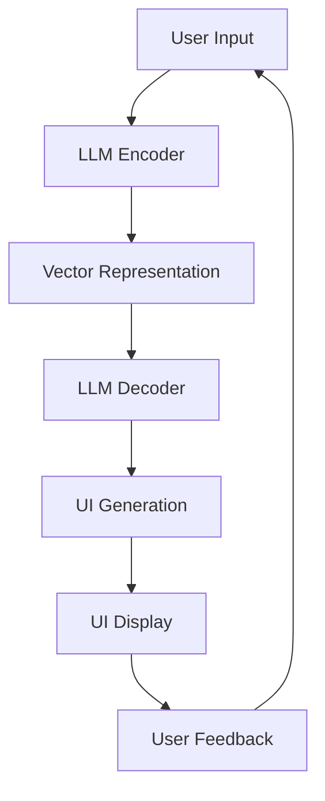
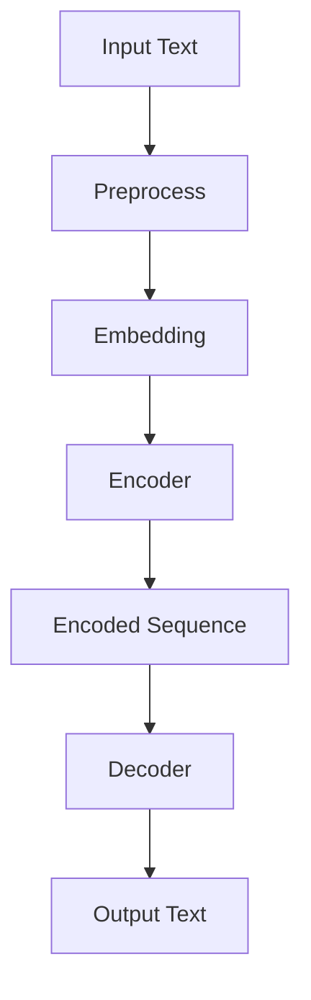

                 

### 文章标题

# 快速迭代LLM应用的用户界面设计

### 关键词

- **大型语言模型（LLM）**
- **用户界面设计**
- **快速迭代**
- **人机交互**
- **人机协同**

### 摘要

本文将探讨如何快速迭代基于大型语言模型（LLM）的应用用户界面设计。通过介绍LLM的基本概念、用户界面设计的核心原则，以及快速迭代的方法，本文将提供一个系统化的框架，帮助开发者在短时间内实现高效的用户界面迭代。文章还通过实际案例，详细展示了从开发环境搭建到代码实现、解析与优化的一系列过程，为开发者提供实用的经验和最佳实践。

### 引言

在当今技术飞速发展的时代，人工智能（AI）尤其是大型语言模型（LLM）已经逐渐成为影响各行各业的关键技术。LLM，如GPT-3、ChatGLM等，凭借其强大的自然语言处理能力，正在改变着我们的工作和生活方式。然而，LLM的应用不仅依赖于模型本身的性能，还取决于用户界面的设计。一个直观、易用的用户界面（UI）能够极大提升用户体验，使得AI应用更加普及和高效。

用户界面设计不仅仅是美学问题，它涉及到用户与系统之间的交互逻辑、信息架构、以及操作流程等多方面的考量。在快速迭代的开发模式下，如何高效地进行用户界面设计，成为开发者面临的重要挑战。快速迭代意味着在短时间内进行多次迭代，不断改进和完善用户界面。这种方法要求开发者具备敏捷的思维和高效的执行能力，同时也需要一套系统化的设计流程和方法。

本文将围绕快速迭代LLM应用的用户界面设计，从基础概念到具体实践，进行详细探讨。文章结构如下：

1. **核心概念与联系**
2. **核心算法原理讲解**
3. **数学模型与公式**
4. **用户界面设计原则**
5. **实际应用案例**
6. **总结与展望**

通过本文的阅读，读者将能够理解快速迭代用户界面设计的方法和技巧，掌握LLM应用设计的核心原理，并在实际项目中应用这些知识，提高开发效率和用户满意度。

### 核心概念与联系

#### 大型语言模型（LLM）

大型语言模型（LLM）是一种基于深度学习的自然语言处理（NLP）模型，能够理解和生成自然语言。它们通过训练大量文本数据，学习到语言的结构和规律，从而实现文本生成、语义理解、问答系统等复杂任务。LLM的核心是神经网络的架构和参数，通过优化这些参数，模型能够实现对输入文本的准确理解和响应。

LLM的基本组成包括：

- **编码器（Encoder）**：将输入文本转换为固定长度的向量表示。
- **解码器（Decoder）**：利用编码器输出的向量，生成文本的每个单词或标记。

LLM的训练过程通常分为两个阶段：

1. **预训练**：在大量未标记的文本数据上，使用无监督的方法，学习语言的通用特征。
2. **微调**：在特定任务的数据上，进一步优化模型的参数，使其适应特定任务的需求。

#### 用户界面（UI）设计

用户界面设计是确保用户能够高效、舒适地与系统交互的关键环节。一个优秀的UI设计应该满足以下原则：

- **直观性**：界面布局清晰，操作简单，用户无需过多的学习即可上手。
- **一致性**：界面元素的风格、颜色、布局保持一致，使用户在不同页面间转换时感觉连贯。
- **响应性**：界面能够适应不同的设备和屏幕尺寸，提供良好的用户体验。
- **交互性**：界面提供丰富的交互元素，如按钮、菜单、滚动条等，以增强用户与系统的互动。

UI设计的主要组成部分包括：

- **布局**：确定界面的整体结构，包括页面的宽度、高度、内容区的分布等。
- **色彩**：使用色彩来传达信息、情感和功能，通常遵循品牌色彩标准。
- **字体**：选择易读、美观的字体，确保界面信息传达的清晰性。
- **交互元素**：设计用户与系统交互的按钮、输入框、菜单等元素。

#### LLM与UI设计的关系

LLM和UI设计之间的联系在于它们共同的目标：提供高效、自然的交互体验。LLM负责理解用户输入并生成响应，而UI设计则负责将这种交互转化为直观、易用的界面。

1. **自然语言交互**：LLM能够理解和生成自然语言，这意味着用户可以通过自然语言与系统进行交互，而无需学习特定的命令或界面操作。
2. **动态内容生成**：LLM可以根据用户输入动态生成文本内容，这为UI设计提供了丰富的可能性，如个性化推荐、实时问答等。
3. **智能反馈**：通过LLM，界面可以提供智能化的反馈，如错误提示、操作建议等，提高用户的操作效率。

为了更好地理解LLM与UI设计的关系，我们可以使用Mermaid流程图来展示它们之间的交互过程：



在这个流程图中，用户输入通过编码器（Encoder）转换为向量表示，解码器（Decoder）利用这些向量生成文本，然后通过UI生成（UI Generation）模块，动态构建用户界面，并在界面中显示给用户。用户的反馈再次传递给LLM，形成一个闭环的交互过程。

通过这个流程图，我们可以看到，LLM和UI设计并不是独立的模块，而是相互依存、协同工作，共同为用户提供高效、自然的交互体验。理解这个关系对于快速迭代LLM应用的用户界面设计至关重要。

### 核心算法原理讲解

为了深入理解LLM的工作原理，我们需要详细讲解其核心算法。LLM通常基于深度学习技术，其核心算法包括编码器（Encoder）和解码器（Decoder）两部分。以下将分别介绍这两部分的工作原理，并使用伪代码进行阐述。

#### 编码器（Encoder）

编码器负责将输入文本转换为固定长度的向量表示。这一过程通常包括以下几个步骤：

1. **文本预处理**：对输入文本进行分词、去停用词等处理，将其转换为单词或字符的序列。
2. **嵌入（Embedding）**：将每个单词或字符映射为向量，这些向量通常通过预训练的词向量模型获得。
3. **序列编码**：使用神经网络（如Transformer）对嵌入向量进行编码，生成固定长度的向量表示。

以下是编码器的伪代码：

```python
def encode_input(text):
    # 步骤1：文本预处理
    tokens = preprocess_text(text)

    # 步骤2：嵌入
    embeddings = embed_tokens(tokens)

    # 步骤3：序列编码
    encoded_sequence = encoder(embeddings)

    return encoded_sequence
```

#### 解码器（Decoder）

解码器负责根据编码器输出的向量，生成文本的每个单词或标记。其工作原理如下：

1. **初始化**：初始化解码器的输入，通常使用编码器输出的最后一个隐藏状态。
2. **预测与生成**：通过循环处理，每次预测一个单词或标记，并更新解码器的输入。
3. **输出生成**：将生成的单词或标记序列转换为文本输出。

以下是解码器的伪代码：

```python
def decode_output(encoded_sequence):
    # 步骤1：初始化解码器输入
    decoder_input = init_decoder(encoded_sequence)

    # 步骤2：预测与生成
    for _ in range(target_sequence_length):
        predictions = decoder(decoder_input)
        next_word = select_next_word(predictions)
        decoder_input = append_word_to_sequence(decoder_input, next_word)

    # 步骤3：输出生成
    output_sequence = decode_sequence_to_text(decoder_input)

    return output_sequence
```

通过上述伪代码，我们可以看到编码器和解码器的核心算法原理。编码器将输入文本转换为向量表示，而解码器则利用这些向量生成文本输出。在实际应用中，这些算法会通过大量数据进行训练，从而优化模型的参数，使其能够准确理解和生成自然语言。

#### 算法流程图

为了更直观地理解LLM的算法流程，我们可以使用Mermaid流程图进行展示：



在这个流程图中，输入文本（A）首先经过预处理（B），然后被嵌入为向量（C）。这些向量通过编码器（D）编码，生成编码后的序列（E）。解码器（F）利用这个序列，生成文本输出（G），从而实现从输入文本到输出文本的转换。

通过理解LLM的核心算法原理，开发者可以更好地设计基于LLM的应用，并优化用户界面的交互体验。接下来，我们将进一步探讨与LLM相关的数学模型和公式，为读者提供更深入的技术解析。

### 数学模型与公式

大型语言模型（LLM）的强大功能得益于其复杂的数学模型和优化方法。在本节中，我们将介绍与LLM相关的几个关键数学模型和公式，并详细解释这些公式的应用和意义。

#### 语言模型中的概率分布

语言模型的核心任务是从给定的文本序列中预测下一个单词或标记的概率分布。这种概率分布通常是通过神经网络模型来估计的。一个简单的概率分布公式如下：

$$
P(w_i|s) = \frac{e^{<s,w_i>}}{\sum_{j} e^{<s,w_j>}}
$$

其中，\( P(w_i|s) \) 表示在给定前文 \( s \) 下，单词 \( w_i \) 的条件概率；\( <s, w_i> \) 表示单词 \( w_i \) 和前文 \( s \) 之间的点积；\( e \) 是自然对数的底数。这个公式表示，单词 \( w_i \) 的概率与其和前文 \( s \) 的点积成正比，而与其他单词的概率成反比。

在实际应用中，这个公式用于神经网络的输出层，将编码器输出的固定长度的向量表示转换为概率分布。例如，在GPT模型中，每个单词或标记对应一个向量，通过计算点积，可以生成一个包含所有可能单词的概率分布。

#### 语言模型中的正则化

在训练语言模型时，为了避免过拟合，通常会引入正则化（Regularization）技术。正则化通过对模型参数施加惩罚，降低模型复杂度，从而提高模型的泛化能力。一个常用的正则化公式如下：

$$
J(\theta) = -\frac{1}{m}\sum_{i=1}^{m} \sum_{j=1}^{n} y_{ij} \log(p(w_j|s_i)) + \alpha \sum_{j=1}^{n} \theta_j^2
$$

其中，\( J(\theta) \) 是模型的损失函数；\( m \) 是样本数量；\( n \) 是特征数量；\( y_{ij} \) 是目标变量，表示第 \( i \) 个样本的第 \( j \) 个特征是否为1；\( p(w_j|s_i) \) 是模型对单词 \( w_j \) 在前文 \( s_i \) 下生成的概率；\( \alpha \) 是正则化参数；\( \theta_j \) 是模型参数。这个公式表示，损失函数由两部分组成：一部分是经典的交叉熵损失，用于衡量模型预测概率与实际标签之间的差距；另一部分是L2正则化项，用于惩罚模型的参数。

通过正则化，模型在训练过程中会更加稳定，减少过拟合现象，从而提高模型的泛化能力。正则化参数 \( \alpha \) 需要通过交叉验证等方法来优化，以达到最佳的训练效果。

#### 模型评估与优化

在训练完成后，我们需要对模型进行评估，以确定其性能。常用的评估指标包括准确率（Accuracy）、损失函数（Loss）和词向量相似度（Word Similarity）。以下是一个简化的评估公式：

$$
Accuracy = \frac{Correct Predictions}{Total Predictions}
$$

其中，\( Correct Predictions \) 是模型预测正确的次数，\( Total Predictions \) 是模型预测的总次数。准确率越高，表示模型的预测能力越强。

此外，我们还可以使用以下公式来评估模型对词向量的表示能力：

$$
Similarity = \cos(\theta)
$$

其中，\( \theta \) 是两个词向量之间的夹角，余弦值越大，表示词向量越相似。通过这个公式，我们可以比较不同词向量之间的相似度，评估模型的语义表示能力。

在实际应用中，为了优化模型，我们通常需要进行多次迭代训练，调整模型参数，并在评估指标上进行优化。这个过程涉及多种技术，如批量归一化（Batch Normalization）、Dropout、梯度下降（Gradient Descent）等。通过不断调整和优化，我们可以得到性能更优的模型，从而提升用户界面的交互体验。

通过以上数学模型和公式的介绍，我们可以看到，LLM的强大功能离不开这些复杂而精细的数学原理。理解这些模型和公式，对于深入掌握LLM技术、进行高效的用户界面设计至关重要。在接下来的章节中，我们将进一步探讨用户界面设计的原则和方法，帮助开发者快速实现高效、直观的LLM应用。

### 用户界面设计原则

用户界面设计（UI Design）是确保用户能够高效、舒适地与系统交互的关键环节。一个优秀的UI设计不仅仅追求美观，更注重实用性、易用性和用户体验。以下是几个核心的用户界面设计原则，以及如何根据用户需求快速设计界面的方法。

#### 1. 直观性

直观性是UI设计的首要原则。一个直观的界面应具备以下特点：

- **清晰的导航**：用户可以轻松找到他们需要的功能和内容。
- **简明的信息展示**：避免过多的信息堆叠，通过合理的布局和视觉层次，突出关键信息。
- **一致性**：界面元素的外观和交互行为保持一致，减少用户的认知负担。

为了设计直观的界面，首先需要了解用户的行为模式和习惯。可以通过用户调研、访谈和用户体验测试，收集用户反馈，不断调整和优化界面设计。

#### 2. 一致性

一致性确保用户在使用不同页面或功能时，感受到连贯的体验。具体包括：

- **颜色和字体**：遵循品牌色彩和字体规范，保持视觉元素的一致性。
- **布局和结构**：页面布局和导航结构保持一致，使用户在转换页面时能够快速适应。
- **交互行为**：按钮、链接、输入框等元素的交互行为一致，如点击后颜色变化、提示信息等。

快速迭代界面设计时，可以通过创建设计指南（Design Guidelines）和样式指南（Style Guide），确保团队成员在设计过程中遵循一致的标准。

#### 3. 响应性

响应性设计使界面能够适应不同的设备和屏幕尺寸，提供良好的用户体验。具体措施包括：

- **弹性布局（Responsive Layout）**：使用相对单位（如百分比）定义布局元素的大小和位置，确保在不同屏幕尺寸下都能保持良好的布局。
- **媒体查询（Media Queries）**：通过CSS媒体查询，为不同设备制定特定的样式规则。
- **触摸友好的交互**：确保按钮和链接足够大，便于触摸操作，提供适当的触觉反馈。

在设计响应性界面时，可以使用原型工具（如Sketch、Adobe XD）快速制作不同屏幕尺寸的界面原型，并通过用户测试进行验证和调整。

#### 4. 交互性

交互性设计强调用户与界面之间的互动，提升用户的参与感和控制感。具体包括：

- **反馈机制**：提供即时反馈，如加载动画、操作确认等，增强用户的互动体验。
- **引导和帮助**：通过提示、帮助文档、视频教程等，引导用户了解和使用功能。
- **个性化定制**：允许用户根据个人喜好定制界面元素，如主题、字体、布局等。

快速迭代交互性设计时，可以通过用户反馈和使用数据，识别用户需求和使用习惯，不断优化交互体验。

#### 如何根据用户需求快速设计界面

1. **需求分析**：通过用户调研、访谈、问卷调查等，收集用户的需求和痛点，明确设计目标。
2. **原型制作**：使用原型工具快速制作界面原型，可以通过低保真原型（Low-Fidelity Prototype）进行初步验证。
3. **用户测试**：通过用户测试，收集用户对界面的反馈，识别问题并进行迭代优化。
4. **迭代优化**：根据用户反馈，不断调整和优化界面设计，实现快速迭代。

通过遵循这些用户界面设计原则和快速迭代的方法，开发者可以设计出既美观又实用的LLM应用用户界面，提升用户体验，实现高效的人机交互。

### 实际应用案例

在本节中，我们将通过两个具体案例展示如何快速迭代LLM应用的用户界面设计。这些案例包括聊天机器人和智能搜索系统，通过从开发环境搭建、源代码实现到代码解读与分析，详细描述整个设计和迭代过程。

#### 案例一：聊天机器人界面迭代

**1. 开发环境搭建**

首先，我们需要搭建一个合适的开发环境。以下是搭建聊天机器人开发环境的步骤：

- **工具与库**：选择Python作为开发语言，使用TensorFlow或PyTorch框架搭建LLM模型。此外，需要使用UI框架（如Tkinter、PyQt等）来构建用户界面。
- **安装依赖**：安装必要的库和依赖，如TensorFlow、PyTorch、Keras等。
- **配置环境**：设置Python环境变量，确保能够正常运行模型和界面代码。

**2. 源代码实现**

接下来，我们实现一个基本的聊天机器人。以下是核心代码实现：

```python
import tensorflow as tf
from tkinter import Tk, Label, Entry, Button

# 加载预训练的LLM模型
model = tf.keras.models.load_model('chatbot_model.h5')

# 用户界面设计
root = Tk()
root.title('ChatBot')

label = Label(root, text='问些什么？')
label.pack()

entry = Entry(root)
entry.pack()

button = Button(root, text='发送', command=lambda: send_message())
button.pack()

def send_message():
    user_input = entry.get()
    response = generate_response(user_input)
    print(response)
    entry.delete(0, 'end')

def generate_response(input_text):
    # 使用LLM模型生成响应
    input_sequence = prepare_input_sequence(input_text)
    predictions = model.predict(input_sequence)
    response = interpret_predictions(predictions)
    return response

# 辅助函数
def prepare_input_sequence(input_text):
    # 预处理输入文本
    processed_text = preprocess_text(input_text)
    return processed_text

def interpret_predictions(predictions):
    # 解码预测结果
    top_prediction = tf.argmax(predictions, axis=-1).numpy()[0]
    return decode_prediction(top_prediction)

root.mainloop()
```

**3. 代码解读与分析**

上述代码实现了聊天机器人的基本功能。以下是代码的详细解读：

- **模型加载**：使用`tf.keras.models.load_model`加载预训练的LLM模型。
- **用户界面**：使用Tkinter框架创建用户界面，包括文本框、标签和按钮。
- **发送消息**：定义`send_message`函数，获取用户输入，调用`generate_response`函数生成响应，并在控制台中输出。
- **响应生成**：`generate_response`函数首先预处理用户输入，然后使用LLM模型生成预测结果，并解码为文本响应。
- **辅助函数**：`prepare_input_sequence`和`interpret_predictions`用于预处理输入文本和解码预测结果。

**4. 实际案例分析与详细讲解**

在实际应用中，我们需要不断优化聊天机器人的界面和功能。以下是一些优化策略：

- **界面优化**：根据用户反馈，调整界面布局和交互设计，使其更加直观和易用。
- **功能增强**：通过添加更多训练数据和改进模型，提升聊天机器人的响应准确性和丰富度。
- **错误处理**：增加错误处理机制，如当用户输入无效时，提供友好的提示信息。

通过以上步骤和策略，我们可以快速迭代聊天机器人的用户界面，提升用户体验。

#### 案例二：智能搜索系统界面优化

**1. 开发环境搭建**

智能搜索系统的开发环境搭建步骤如下：

- **工具与库**：选择Elasticsearch作为搜索引擎后端，使用Python的Elasticsearch客户端进行交互。前端界面可以使用React或Vue等框架。
- **安装依赖**：安装Elasticsearch服务器，配置Python环境，安装Elasticsearch客户端库。
- **配置环境**：配置Elasticsearch索引，定义搜索字段和索引策略。

**2. 源代码实现**

以下是智能搜索系统的核心代码实现：

```python
from elasticsearch import Elasticsearch
import React, {useState} from 'react';
import ReactDOM from 'react-dom';

const SearchBar = () => {
  const [searchTerm, setSearchTerm] = useState('');

  const handleSearch = () => {
    searchItems(searchTerm);
  };

  return (
    <div>
      <input
        type="text"
        placeholder="Search..."
        value={searchTerm}
        onChange={(e) => setSearchTerm(e.target.value)}
      />
      <button onClick={handleSearch}>Search</button>
    </div>
  );
};

const searchItems = async (searchTerm) => {
  const es = new Elasticsearch();
  const response = await es.search(index="items", body={
    "query": {
      "match": {
        "description": searchTerm
      }
    }
  });
  console.log(response['hits']['hits']);
};

const App = () => {
  return (
    <div>
      <SearchBar />
    </div>
  );
};

ReactDOM.render(<App />, document.getElementById('root'));
```

**3. 代码解读与分析**

上述代码实现了智能搜索系统的基本功能。以下是代码的详细解读：

- **前端界面**：使用React创建搜索栏组件，包括输入框和搜索按钮。
- **搜索功能**：`searchItems`函数使用Elasticsearch客户端执行搜索操作，返回匹配的结果。
- **数据展示**：搜索结果在控制台中输出，可以通过前端界面进行进一步处理和展示。

**4. 实际案例分析与详细讲解**

在实际应用中，我们可以通过以下步骤优化智能搜索系统的界面和功能：

- **界面优化**：根据用户行为数据，调整搜索栏的位置和设计，提升用户体验。
- **搜索算法优化**：通过改进Elasticsearch查询，提升搜索效率和准确性。
- **结果展示**：使用图表、列表等形式，更直观地展示搜索结果，并提供筛选和排序功能。

通过以上步骤和策略，我们可以快速迭代智能搜索系统的用户界面，提升用户搜索体验。

#### 项目小结

通过以上两个案例，我们可以看到，快速迭代LLM应用的用户界面设计需要从开发环境搭建、源代码实现到代码解读与分析等多个方面进行系统性工作。在实际项目中，我们需要不断收集用户反馈，优化界面设计和功能，以实现高效的用户交互。快速迭代的方法使得我们能够在短时间内实现多次改进，不断提升用户体验。

### 最佳实践 Tips

在快速迭代LLM应用的用户界面设计过程中，以下是一些实用的最佳实践和注意事项：

1. **用户调研**：定期进行用户调研和访谈，了解用户需求和行为模式，确保设计符合用户期望。
2. **版本控制**：使用版本控制系统（如Git），记录每次迭代的变化，便于管理和回滚。
3. **自动化测试**：编写自动化测试脚本，确保每次迭代后界面功能正常，避免引入新问题。
4. **持续集成**：集成CI/CD流程，实现自动化构建和部署，提高开发效率和稳定性。
5. **用户反馈机制**：建立高效的反馈机制，及时收集用户意见和建议，快速响应和调整。
6. **文档记录**：详细记录设计文档和开发日志，方便团队成员间的沟通和协作。

通过遵循这些最佳实践，我们可以更加高效地设计和迭代LLM应用的用户界面，提升用户体验和开发效率。

### 小结

本文围绕快速迭代LLM应用的用户界面设计，系统地介绍了核心概念、算法原理、数学模型、设计原则及实际应用案例。通过深入探讨这些内容，读者可以全面了解LLM应用设计的全过程，掌握快速迭代的方法和技巧。快速迭代不仅是提升用户体验的关键，也是应对技术快速发展的有效手段。未来，随着LLM技术的不断进步，用户界面设计将更加智能化、个性化，为人机协同提供更多可能性。

### 拓展阅读

- **《深度学习自然语言处理》**：吴恩达著，详细介绍了深度学习在自然语言处理中的应用。
- **《用户界面设计原则》**：艾伦·库珀著，系统地阐述了用户界面设计的核心原则和实践。
- **《敏捷软件开发：原则、实践与模式》**：杰拉尔德·贝克尔著，介绍了敏捷开发的方法和实践。
- **《大型语言模型的原理与实现》**：齐向东著，深入讲解了大型语言模型的理论和实践。

通过阅读这些书籍，读者可以进一步深入了解相关技术，提升专业水平。

