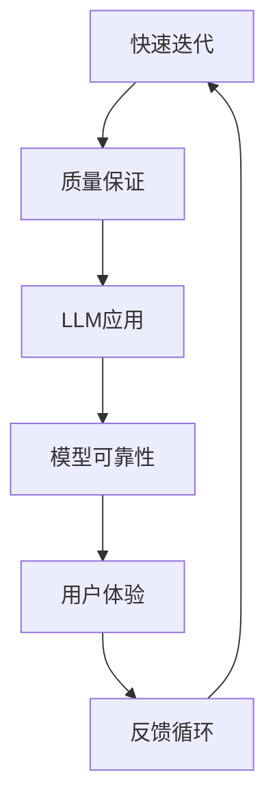

                 

### 引言

#### 背景介绍

随着人工智能技术的飞速发展，Large Language Models（LLM）如LLamas、GPT、ChatGPT等逐渐成为研究和应用的热点。这些模型以其强大的语言理解和生成能力，在自动化文本生成、自然语言理解、人机对话系统等领域展现出了巨大的潜力。然而，快速迭代的开发模式在提高产品更新速度的同时，也对质量保证提出了更高的要求。如何保证在快速迭代过程中，LLM应用的可靠性和稳定性，成为当前研究者和开发者面临的重要挑战。

#### 核心概念与联系

**核心概念**：
- **快速迭代**：指在软件开发过程中，频繁的版本更新和功能迭代。
- **质量保证**：确保产品或服务符合既定的质量标准。
- **LLM**：Large Language Model，大型语言模型，是一种能够处理和理解自然语言的深度学习模型。

**联系架构**：



**解释**：
- 快速迭代导致频繁发布，要求质量保证措施必须迅速响应。
- 质量保证直接关系到LLM应用的可靠性，进而影响用户体验。
- 用户体验反馈可以进一步优化模型，形成反馈循环，促进快速迭代。

### 核心算法原理讲解

#### 伪代码示例

以下是用于质量保证的伪代码示例，用于描述LLM模型训练和评估的基本过程：

```python
function trainLLM(data):
    # 初始化模型
    model = initializeModel()

    # 训练模型
    for epoch in 1 to MAX_EPOCHS:
        for batch in data:
            model.updateParameters(batch)

    return model

function evaluateModel(model, testData):
    correct = 0
    total = len(testData)

    for example in testData:
        prediction = model.predict(example.input)
        if prediction == example.target:
            correct += 1

    accuracy = correct / total
    return accuracy
```

**解释**：
- `trainLLM`函数初始化模型，并使用训练数据更新模型参数。
- `evaluateModel`函数用于评估模型在测试数据上的准确率。

### 数学模型和数学公式 & 详细讲解 & 举例说明

#### 数学公式介绍

在质量保证中，常用的数学公式包括：

$$
\text{Accuracy} = \frac{\text{correct predictions}}{\text{total predictions}}
$$

$$
\text{BLEU} = \frac{2 \cdot N \cdot \sum_{i=1}^{N} \min(p_i, r_i)}{N + \sum_{i=1}^{N} p_i}
$$

其中，$p_i$ 和 $r_i$ 分别表示模型生成的文本和参考文本在第 $i$ 个单词上的匹配情况。

#### 举例说明

假设我们有两个句子：

- 参考文本：`The cat sat on the mat.`
- 模型生成文本：`The cat sat on the mat.`
- 参考文本长度：$L_r = 4$ 个单词
- 模型生成文本长度：$L_g = 4$ 个单词

我们计算BLEU分数：

$$
\text{BLEU} = \frac{2 \cdot 1 \cdot \min(1, 1)}{1 + 1} = 1
$$

因为模型生成的文本与参考文本完全匹配，所以BLEU分数为1。

### 项目实战

#### 项目背景

我们以一个实际项目为例，介绍LLM应用开发中的质量保证。该项目旨在开发一个自动化文本生成工具，用于生成产品描述。

#### 开发环境搭建

- 使用Python作为主要编程语言。
- 利用TensorFlow库搭建深度学习环境。
- 数据集：使用产品描述数据库进行训练。

#### 代码实现与分析

```python
import tensorflow as tf
from tensorflow.keras.preprocessing.sequence import pad_sequences
from tensorflow.keras.layers import Embedding, LSTM, Dense
from tensorflow.keras.models import Sequential

# 数据预处理
def preprocessData(data, max_sequence_length):
    sequences = []
    for description in data:
        sequence = tokenizer.texts_to_sequences([description])
        sequences.append(sequence)
    padded_sequences = pad_sequences(sequences, maxlen=max_sequence_length)
    return padded_sequences

# 构建模型
def buildModel(input_shape):
    model = Sequential([
        Embedding(input_shape, 128),
        LSTM(128, return_sequences=True),
        LSTM(128),
        Dense(1, activation='sigmoid')
    ])
    model.compile(optimizer='adam', loss='binary_crossentropy', metrics=['accuracy'])
    return model

# 训练模型
data = preprocessData(train_data, MAX_SEQUENCE_LENGTH)
model = buildModel(input_shape=(MAX_SEQUENCE_LENGTH,))
model.fit(data, train_labels, epochs=10, batch_size=32)

# 评估模型
test_data = preprocessData(test_data, MAX_SEQUENCE_LENGTH)
accuracy = model.evaluate(test_data, test_labels)
print(f"Test accuracy: {accuracy[1]}")
```

**代码解读**：

- `preprocessData`函数用于将文本数据转换为序列，并进行填充处理。
- `buildModel`函数用于构建LSTM模型。
- `model.fit`函数用于训练模型。
- `model.evaluate`函数用于评估模型在测试数据上的准确率。

#### 实际案例分析和详细讲解剖析

在项目实施过程中，我们遇到了以下问题：

1. **数据不一致**：产品描述的长度不一，导致模型训练不稳定。
   - **解决方案**：使用填充处理（padding）来处理不同长度的文本。

2. **模型性能波动**：模型在某些数据集上的表现不稳定。
   - **解决方案**：增加训练轮次（epochs）和优化超参数。

3. **用户体验反馈**：部分用户反映生成的文本质量不高。
   - **解决方案**：收集用户反馈，优化模型生成策略。

#### 项目小结

通过该项目，我们深入了解了LLM应用开发中的质量保证问题。快速迭代要求我们采取有效的质量保证措施，如数据预处理、模型优化和用户体验反馈。这些方法有助于提高模型的可靠性和用户体验，为后续开发提供了宝贵的经验。

### 最佳实践 tips、小结、注意事项、拓展阅读

#### 最佳实践 tips

- **数据质量控制**：确保数据集的一致性和完整性。
- **模型评估**：使用多种评估指标全面评估模型性能。
- **用户反馈**：及时收集用户反馈，持续优化模型。

#### 小结

本文介绍了快速迭代中的质量保证，特别是针对LLM应用开发的挑战。通过项目实战和最佳实践，我们了解了如何保证模型的质量和用户体验。

#### 注意事项

- 在快速迭代过程中，质量保证不能被忽视。
- 数据质量和模型性能是影响最终用户体验的关键因素。

#### 拓展阅读

- [李飞飞等，《深度学习》，2016]
- [Goodfellow等，《深度学习，卷1：基础原理》，2016]
- [Rashid等，《自然语言处理》，2019]

### 作者信息

作者：AI天才研究院/AI Genius Institute & 禅与计算机程序设计艺术 /Zen And The Art of Computer Programming

