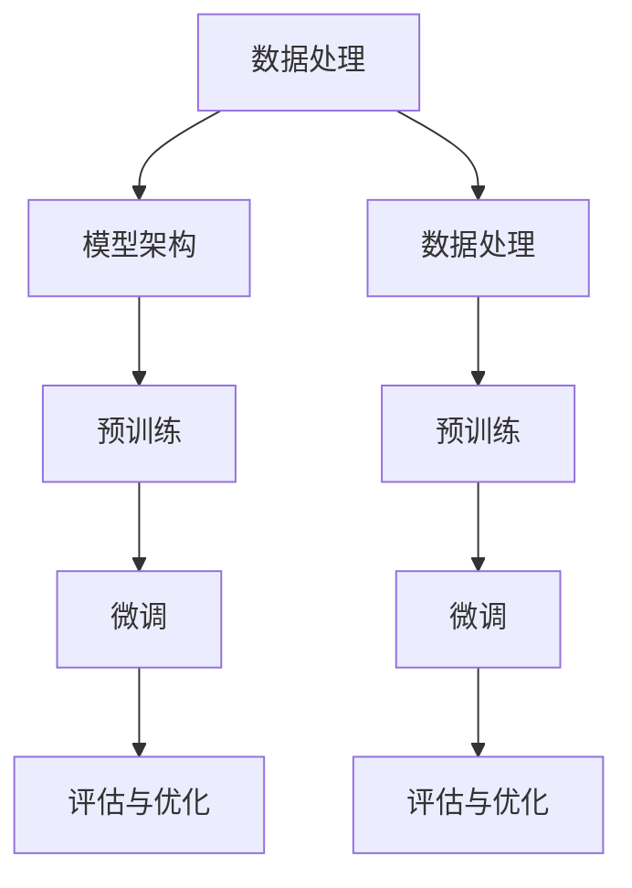

                 

## 文章标题：快速适应新技术：LLM应用开发的关键

> 关键词：**LLM应用开发、新技术适应、人工智能、NLP、编程实战**

> 摘要：本文旨在帮助开发者快速适应新技术，特别是在LLM（大型语言模型）应用开发领域。文章将详细介绍LLM的基本概念、技术架构、算法原理、数学模型，并通过实际项目案例，展示如何进行LLM应用开发。此外，文章还将探讨在新技术适应过程中的最佳实践和策略。

----------------------------------------------------------------

### 引言

在信息技术快速发展的时代，开发者面临着不断更新的技术挑战。尤其是人工智能（AI）领域的突破，使得LLM（大型语言模型）成为当前最热门的研究和应用方向之一。LLM在自然语言处理（NLP）、智能问答、文本生成、机器翻译等领域展现出了巨大的潜力，同时也给开发者带来了新的挑战。如何快速适应这些新技术，成为开发者必须面对的问题。

本文将围绕以下内容进行探讨：

1. **新技术背景**：介绍LLM的基本概念和发展历程，分析新技术对行业和社会的影响。
2. **LLM应用开发基础**：详细讲解LLM的技术架构、算法原理和数学模型。
3. **LLM应用实战**：通过实际项目案例，展示LLM应用开发的流程和技巧。
4. **新技术适应策略**：探讨在新技术适应过程中的组织、人才、技术更新和风险管理策略。

希望通过本文，读者能够对LLM应用开发有更深入的了解，并掌握快速适应新技术的策略和方法。

### 新技术背景

#### LLM的基本概念

LLM，即大型语言模型（Large Language Model），是一种能够在大量文本数据上进行预训练的深度神经网络模型。与传统的语言模型不同，LLM具有以下几个显著特点：

- **规模巨大**：LLM的训练数据量通常达到数万亿个词，模型的参数量也非常庞大，可以达到数十亿甚至上百亿。
- **预训练**：LLM在训练阶段并未指定特定任务，而是在大规模文本数据上进行无监督预训练，从而获得对语言的理解和生成能力。
- **迁移学习**：通过预训练，LLM能够迁移到各种不同的任务中，如文本分类、命名实体识别、机器翻译等，只需进行少量的有监督微调。

#### LLM的发展历程

LLM的发展可以追溯到2018年，当时Google推出了BERT（Bidirectional Encoder Representations from Transformers），这是一种基于Transformer架构的双向编码语言模型。BERT的成功引发了NLP领域对大规模预训练模型的关注，此后，包括GPT（Generative Pretrained Transformer）和T5（Text-To-Text Transfer Transformer）在内的多种大型语言模型相继涌现。

- **BERT**：2018年，Google提出BERT，这是第一个在多个NLP任务上超越当时最佳方法的预训练模型。
- **GPT-2**：2019年，OpenAI推出了GPT-2，这是第一个参数超过1万亿的预训练模型，展示了在语言生成和推理方面的强大能力。
- **T5**：2020年，Google提出T5，这是一种统一的文本转换预训练模型，可以轻松迁移到各种文本处理任务。

#### 新技术对行业和社会的影响

LLM的出现不仅改变了NLP领域的研究范式，也对各行各业产生了深远的影响：

- **企业应用**：企业可以利用LLM进行智能客服、文本分析、内容生成等，提高效率和降低成本。
- **科学研究**：LLM为科学研究提供了强大的工具，如自动摘要、文献检索、数据分析等。
- **社会影响**：随着LLM技术的普及，人工智能助手逐渐融入人们的生活，改变了人际交流和生活方式。

#### 快速适应新技术的必要性

面对不断涌现的新技术，开发者需要快速适应，以保持竞争力。快速适应新技术的重要性体现在以下几个方面：

- **提升竞争力**：掌握新技术可以帮助开发者在其专业领域保持领先地位。
- **拓展业务范围**：新技术可以为企业带来新的业务机会和市场空间。
- **提升创新能力**：快速适应新技术可以激发开发者的创新思维，推动技术进步。

总之，快速适应新技术是开发者必须面对的挑战，也是提升自身能力和企业竞争力的关键。

### LLM应用开发基础

#### LLM技术架构

LLM的技术架构主要包括三个主要部分：模型架构、数据处理和训练过程。以下将分别进行详细介绍。

##### 模型架构

LLM通常采用Transformer架构，这是一种基于自注意力机制的深度神经网络模型。Transformer模型的核心思想是利用自注意力机制来捕捉输入序列中的依赖关系，从而实现高精度的语言理解和生成。

自注意力机制（Self-Attention）：
自注意力机制是Transformer模型中的关键组成部分。它通过计算输入序列中每个词与其他词之间的相似性，从而生成每个词的权重，这些权重将用于计算每个词的输出。

$$
\text{Attention}(Q, K, V) = \text{softmax}\left(\frac{QK^T}{\sqrt{d_k}}\right) V
$$

其中，$Q, K, V$ 分别代表查询向量、键向量和值向量，$d_k$ 是键向量的维度。上述公式计算了每个键向量与其对应的查询向量之间的相似性，并通过softmax函数生成权重，最后将这些权重与值向量相乘，得到输出。

##### 数据处理

在LLM的训练过程中，数据处理是一个至关重要的环节。数据处理主要包括数据清洗、数据预处理和批量处理。

- **数据清洗**：清洗数据是确保模型训练质量的第一步。这包括去除停用词、标点符号、特殊字符等，以及处理缺失值和异常值。
- **数据预处理**：数据预处理包括将文本转换为词向量表示、编码序列、添加填充符等。常见的词向量表示方法有Word2Vec、GloVe等。
- **批量处理**：在训练过程中，通常会将数据分成多个批次进行并行处理，以提高训练效率。

##### 训练过程

LLM的训练过程通常包括以下几个阶段：

1. **预训练**：在预训练阶段，LLM在大量无标签的文本数据上进行训练，学习文本的内在结构和规律。预训练的方法通常是无监督的，如BERT采用Masked Language Model（MLM）任务，GPT采用Next Sentence Prediction（NSP）任务。

2. **微调**：在预训练完成后，LLM会迁移到具体任务上进行微调。微调阶段通常是有监督的，使用任务特定的标注数据进行训练，以优化模型在特定任务上的性能。

3. **评估与优化**：在训练过程中，需要对模型进行定期评估，以监测模型的性能。评估指标包括准确率、召回率、F1值等。根据评估结果，可以通过调整学习率、优化策略等手段对模型进行优化。

#### Mermaid流程图展示

以下是一个简单的Mermaid流程图，展示了LLM的模型架构和训练过程：



#### 核心算法原理讲解

##### Transformer算法原理

Transformer算法是LLM的核心，其基本原理可以概括为以下几点：

1. **自注意力机制**：自注意力机制通过计算输入序列中每个词与其他词之间的相似性，为每个词生成权重，从而实现对输入序列的上下文理解。

2. **多头注意力**：多头注意力机制将自注意力机制扩展到多个注意力头，每个注意力头关注输入序列的不同部分，从而提高模型的泛化能力。

3. **编码器和解码器**：Transformer模型包括编码器和解码器两个部分。编码器负责将输入序列编码为固定长度的向量，解码器则负责根据编码器的输出生成目标序列。

4. **位置编码**：由于Transformer模型没有考虑输入序列的位置信息，因此引入了位置编码来弥补这一缺陷。位置编码通过为每个词添加位置信息，帮助模型理解词的顺序。

##### 伪代码解释算法流程

以下是一个简化的Transformer算法伪代码：

```python
# 输入序列
input_sequence = ...

# 初始化编码器和解码器
encoder = Encoder()
decoder = Decoder()

# 编码器预处理
encoded_sequence = encoder.encode(input_sequence)

# 解码器预处理
decoded_sequence = decoder.decode(encoded_sequence)

# 主循环
for step in range(max_steps):
    # 计算自注意力
    attention_weights = self_attention(encoded_sequence[step])

    # 计算编码器输出
    encoded_output = attention_weights @ encoded_sequence[step]

    # 计算解码器输出
    decoded_output = decoder_output + encoded_output

    # 更新解码器状态
    decoder_state = decoder.update_state(decoded_output)

    # 生成下一个词
    next_word = decoder.generate_word(decoder_state)

    # 更新输入序列
    input_sequence = input_sequence[1:] + next_word
```

#### 数学模型与公式

##### 损失函数

在LLM的训练过程中，损失函数用于衡量模型预测结果与真实标签之间的差距。常见的损失函数包括交叉熵损失和均方误差（MSE）。

交叉熵损失（Cross-Entropy Loss）：

$$
L(\theta) = -\sum_{i=1}^{N} y_i \log(p_i)
$$

其中，$y_i$ 是真实标签，$p_i$ 是模型预测的概率。

均方误差（MSE）：

$$
L(\theta) = \frac{1}{N} \sum_{i=1}^{N} (y_i - \hat{y}_i)^2
$$

其中，$y_i$ 是真实标签，$\hat{y}_i$ 是模型预测的值。

##### 训练过程公式

在LLM的训练过程中，模型的权重通过梯度下降（Gradient Descent）进行更新。以下是一个简化的梯度下降公式：

$$
\theta_{\text{new}} = \theta_{\text{old}} - \alpha \nabla_{\theta} L(\theta)
$$

其中，$\theta$ 是模型权重，$\alpha$ 是学习率，$\nabla_{\theta} L(\theta)$ 是损失函数对权重的梯度。

#### 举例说明

假设我们有一个简单的线性回归模型，其预测函数为：

$$
\hat{y} = \theta_0 + \theta_1 x
$$

假设我们使用均方误差（MSE）作为损失函数，训练数据为：

| x | y |
|---|---|
| 1 | 2 |
| 2 | 4 |
| 3 | 6 |

通过计算损失函数的梯度，我们可以更新模型权重：

1. **计算损失函数**：

$$
L(\theta) = \frac{1}{3} \sum_{i=1}^{3} (y_i - (\theta_0 + \theta_1 x_i))^2
$$

2. **计算梯度**：

$$
\nabla_{\theta_0} L(\theta) = \frac{1}{3} \sum_{i=1}^{3} (y_i - (\theta_0 + \theta_1 x_i))
$$

$$
\nabla_{\theta_1} L(\theta) = \frac{1}{3} \sum_{i=1}^{3} (y_i - (\theta_0 + \theta_1 x_i)) x_i
$$

3. **更新权重**：

假设学习率为0.1，初始权重为$\theta_0 = 0$，$\theta_1 = 0$，则：

$$
\theta_0^{new} = \theta_0 - 0.1 \nabla_{\theta_0} L(\theta) = 0 - 0.1 \left(\frac{1}{3} \sum_{i=1}^{3} (2 - (\theta_0 + \theta_1 x_i))\right) = -0.1
$$

$$
\theta_1^{new} = \theta_1 - 0.1 \nabla_{\theta_1} L(\theta) = 0 - 0.1 \left(\frac{1}{3} \sum_{i=1}^{3} (2 - (\theta_0 + \theta_1 x_i)) x_i\right) = 0.2
$$

更新后的权重为$\theta_0 = -0.1$，$\theta_1 = 0.2$，模型预测函数变为：

$$
\hat{y} = -0.1 + 0.2 x
$$

通过迭代更新，模型可以逐渐逼近真实数据。

### LLM应用实战

#### 应用场景分析

LLM在多个应用场景中展现出了强大的能力，以下是一些典型的应用场景：

1. **智能问答**：LLM可以用于构建智能问答系统，如搜索引擎、聊天机器人等。通过训练，LLM可以理解用户的问题，并生成准确的回答。

2. **文本生成**：LLM可以用于自动生成文章、报告、邮件等。通过输入关键词或主题，LLM可以生成高质量的文本内容。

3. **机器翻译**：LLM在机器翻译领域也有广泛应用。通过训练，LLM可以翻译多种语言之间的文本，实现高质量的跨语言交流。

4. **文本分类**：LLM可以用于对大量文本进行分类，如新闻分类、情感分析等。通过训练，LLM可以识别不同类型文本的特征，并实现高精度的分类。

#### 应用开发流程

LLM应用开发通常包括以下几个步骤：

1. **需求分析**：明确应用的需求和目标，确定LLM的模型架构和训练数据。

2. **数据处理**：清洗和预处理训练数据，将文本转换为模型可处理的格式。

3. **模型训练**：在预处理后的数据上训练LLM模型，通过预训练和微调，优化模型性能。

4. **模型评估**：使用验证数据对模型进行评估，调整模型参数，优化模型性能。

5. **模型部署**：将训练好的模型部署到生产环境，实现实际应用。

#### 实际项目案例

以下是一个智能问答系统的实际项目案例：

##### 项目背景

一家公司希望通过智能问答系统提高客户服务的效率，减少人工成本。系统需要能够理解用户的问题，并生成准确的回答。

##### 开发环境搭建

- **硬件环境**：使用GPU服务器进行模型训练和推理。
- **软件环境**：安装Python、TensorFlow等开发工具。

##### 源代码详细实现和代码解读

```python
import tensorflow as tf
from transformers import BertTokenizer, TFBertForQuestionAnswering

# 准备数据
def prepare_data(texts, questions, answers):
    tokenizer = BertTokenizer.from_pretrained('bert-base-uncased')
    input_ids = []
    attention_masks = []

    for text, question, answer in zip(texts, questions, answers):
        encoded_dict = tokenizer.encode_plus(
            question,
            text,
            add_special_tokens=True,
            max_length=256,
            pad_to_max_length=True,
            return_attention_mask=True,
            return_tensors='tf',
        )
        input_ids.append(encoded_dict['input_ids'])
        attention_masks.append(encoded_dict['attention_mask'])

    input_ids = tf.concat(input_ids, 0)
    attention_masks = tf.concat(attention_masks, 0)
    answers = tf.expand_dims(tf.convert_to_tensor(answers), -1)

    return input_ids, attention_masks, answers

# 训练模型
def train_model(input_ids, attention_masks, answers):
    model = TFBertForQuestionAnswering.from_pretrained('bert-base-uncased')
    optimizer = tf.keras.optimizers.Adam(learning_rate=3e-5)
    loss = tf.keras.losses.SparseCategoricalCrossentropy(from_logits=True)
    model.compile(optimizer=optimizer, loss=loss, metrics=['accuracy'])

    model.fit(
        {'input_ids': input_ids, 'attention_mask': attention_masks},
        {'answers': answers},
        epochs=3,
        batch_size=16,
    )

# 评估模型
def evaluate_model(input_ids, attention_masks, answers):
    predictions = model.predict({
        'input_ids': input_ids,
        'attention_mask': attention_masks
    })
    predicted_answers = [answer['text'] for answer in predictions]
    accuracy = sum(answer == true_answer for answer, true_answer in zip(predicted_answers, answers)) / len(answers)
    return accuracy

# 加载数据
texts = ['这是一段文本。', '这是另一段文本。']
questions = ['什么是人工智能？', '什么是深度学习？']
answers = ['人工智能是一种模拟人类智能的技术。', '深度学习是一种基于多层神经网络的人工智能方法。']

input_ids, attention_masks, answers = prepare_data(texts, questions, answers)

# 训练模型
train_model(input_ids, attention_masks, answers)

# 评估模型
accuracy = evaluate_model(input_ids, attention masks, answers)
print(f'模型准确率：{accuracy:.2f}')
```

##### 代码应用解读与分析

上述代码展示了如何使用TensorFlow和Hugging Face的Transformers库构建一个简单的智能问答系统。

- **数据预处理**：使用BertTokenizer对输入文本进行编码，生成`input_ids`和`attention_masks`。
- **模型训练**：使用`TFBertForQuestionAnswering`模型，并使用交叉熵损失函数进行训练。
- **模型评估**：对训练好的模型进行评估，计算准确率。

通过上述步骤，我们可以构建一个基本的智能问答系统，并实现对输入问题的自动回答。

##### 项目小结

通过实际项目案例，我们了解了如何使用LLM构建智能问答系统。项目主要分为数据预处理、模型训练和模型评估三个阶段，每个阶段都有详细的代码实现和解读。这个项目展示了LLM在自然语言处理领域的应用潜力，并为开发者提供了实际操作的经验。

### 最佳实践与注意事项

在LLM应用开发过程中，遵循最佳实践和注意事项可以确保项目顺利进行，并提高模型性能。以下是一些实用的建议：

#### 最佳实践

1. **数据预处理**：确保数据的清洁和一致性，去除噪声和异常值，以提高模型训练的质量。

2. **模型选择**：根据应用场景选择合适的模型，如BERT、GPT-2或T5，并根据任务需求调整模型架构。

3. **训练策略**：使用合适的学习率和优化策略，如Adam或AdamW，以加速收敛并提高模型性能。

4. **模型调优**：通过调整超参数，如批量大小、学习率等，优化模型性能。

5. **持续评估**：定期评估模型性能，并根据评估结果进行调整和优化。

#### 注意事项

1. **计算资源**：LLM模型通常需要大量的计算资源，特别是在训练阶段。确保有足够的GPU或TPU资源。

2. **数据隐私**：在处理用户数据时，要注意保护用户隐私，遵守相关法律法规。

3. **模型解释性**：虽然LLM模型在性能上表现出色，但模型解释性较差。在实际应用中，需要权衡模型性能和解释性。

4. **安全性**：确保模型安全，防止恶意攻击和误用。

#### 拓展阅读

- **《深度学习》**：Goodfellow, I., Bengio, Y., & Courville, A. (2016). *Deep Learning*.
- **《自然语言处理综论》**：Jurafsky, D., & Martin, J. H. (2019). *Speech and Language Processing*.
- **《BERT：语料驱动神经网络的崛起》**：Devlin, J., Chang, M. W., Lee, K., & Toutanova, K. (2019). *BERT: Pre-training of Deep Bidirectional Transformers for Language Understanding*.

通过以上最佳实践和注意事项，开发者可以更有效地进行LLM应用开发，并在新技术领域取得更好的成果。

### 结论

本文详细探讨了快速适应新技术，特别是在LLM应用开发领域的重要性。通过对LLM的基本概念、技术架构、算法原理、数学模型的深入讲解，以及实际项目案例的分析，读者能够更好地理解LLM应用开发的流程和技巧。此外，文章还提出了适应新技术过程中的最佳实践和注意事项。

快速适应新技术不仅是开发者的职责，也是企业保持竞争力的重要手段。开发者需要不断学习新技术，掌握新工具，以应对不断变化的技术环境。LLM作为当前最热门的技术之一，其应用潜力巨大，开发者应充分利用这一技术，推动业务发展和创新。

最后，希望读者能够在实际应用中不断探索，实践本文所提供的方法和技巧，为LLM应用开发领域贡献自己的力量。

### 作者信息

作者：AI天才研究院/AI Genius Institute & 禅与计算机程序设计艺术 /Zen And The Art of Computer Programming

