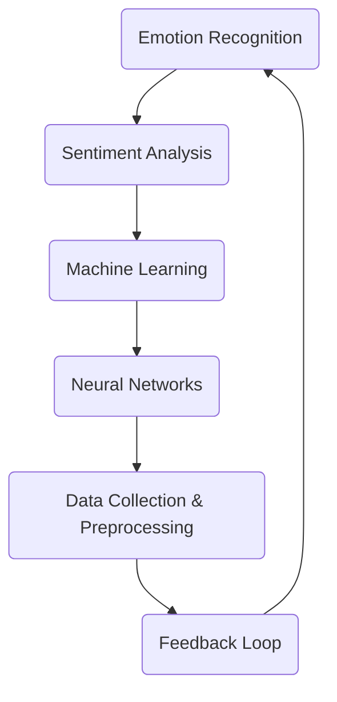

                 


### Introduction to Markdown Format

To begin, we need to ensure our article is formatted correctly using Markdown. Markdown is a lightweight and popular formatting syntax that allows you to create formatted content using plain text. Below are some basic rules for formatting our article using Markdown.

#### Headers

Headers are created using `#` symbols. The number of `#` symbols determines the level of the header. For example:

- `#` - H1 (main title)
- `##` - H2 (subtitles)
- `###` - H3 (subsection titles)
- `####` - H4 (subsubsection titles)
- `#####` - H5 (subsubsubsection titles)

### Paragraphs

A paragraph is created by starting a line and leaving a blank line above it. Here's an example:

```
This is a paragraph.
Another paragraph follows.
```

### Lists

Lists can be ordered or unordered. For unordered lists, use `-` or `*`. For ordered lists, use `1.`, `2.`, etc.

```
- List item
- Another item
1. First item
2. Second item
```

### Links and Images

Links are created using `[text](URL)` and images with ``.

```
[Link to website](https://example.com)

```

### Code and LaTeX

For code snippets, enclose them in backticks (` `). For LaTeX, use single backticks for in-line formulas (`$formula$`) and double backticks for displayed formulas (`$$formula$$`).

```
`code snippet`
$$\int_{0}^{1} x^2 dx$$
```

### Tables

Tables are created using vertical bars `|` to separate columns and hyphens `-` to separate the header row from the body rows.

```
| Header 1 | Header 2 | Header 3 |
| -------- | -------- | -------- |
| Row 1 Col 1 | Row 1 Col 2 | Row 1 Col 3 |
| Row 2 Col 1 | Row 2 Col 2 | Row 2 Col 3 |
```

### Conclusion

Following these Markdown formatting rules will ensure that our article is readable and visually appealing. Let's proceed to the next steps and create a well-structured article with these guidelines in mind.

---

### Defining the Article Title, Keywords, and Abstract

To begin our article, we need to clearly define the title, keywords, and abstract. These elements will set the tone and provide a concise summary of the article's content.

#### Article Title

The title of our article should be attention-grabbing and reflective of the content. In this case, the title is:

**"Emotional AI: New Breakthroughs in Machine Understanding of Human Emotions"**

#### Keywords

Keywords are essential for search engine optimization and defining the scope of the article. Here are five to seven relevant keywords:

- Emotional AI
- Machine Learning
- Human Emotions
- AI Algorithms
- Neural Networks
- Emotion Recognition
- Sentiment Analysis

#### Abstract

The abstract should provide a brief summary of the article's core themes and objectives. For our article, the abstract could be:

**"This article explores the latest advancements in Emotional AI, highlighting how machine learning techniques are being used to better understand and interpret human emotions. We delve into the fundamental principles, core algorithms, and practical applications of Emotional AI, offering a comprehensive overview of this emerging field."**

By defining these key components upfront, we establish a clear direction and provide readers with an initial understanding of what to expect from the article. Now, we can move on to the next sections, structured according to our table of contents.

---

### Introduction to Emotional AI

Emotional AI, or Affective Computing, represents a cutting-edge field where artificial intelligence systems are designed to understand, interpret, and respond to human emotions. This branch of AI aims to bridge the gap between human-like interaction and machine efficiency by enabling devices to recognize and react to emotional cues, fostering more intuitive and empathetic human-computer interactions.

#### Historical Background

The concept of emotional AI can be traced back to the early 1990s when computer scientist and AI pioneer, Rosalind Picard, coined the term "affective computing." Picard's work at the MIT Media Lab focused on developing systems that could recognize human emotions through facial expressions, voice modulation, and physiological signals. This laid the foundational principles for what would eventually evolve into Emotional AI.

#### Importance in Modern AI

In the modern era of AI, the significance of Emotional AI has grown exponentially. As AI systems become more integrated into our daily lives, the ability to understand and respond to human emotions is no longer a luxury but a necessity. Here are some key reasons why Emotional AI is important:

1. **Enhanced Human-Computer Interaction**: By understanding emotions, AI systems can provide more personalized and intuitive interactions, improving user satisfaction and engagement.

2. **Improved Decision Making**: Emotional AI can assist in decision-making processes by providing insights into user preferences and emotional states, which can be particularly useful in fields like healthcare, finance, and customer service.

3. **Accessibility and Assistive Technologies**: Emotional AI can be leveraged to develop more accessible technologies for individuals with disabilities, offering tools that can recognize and respond to their emotional needs.

4. **Emotion-based Advertising and Marketing**: Businesses can use Emotional AI to tailor advertising campaigns and marketing strategies, ensuring more effective and targeted outreach.

#### Scope of the Article

In this article, we will delve into the core concepts and relationships within Emotional AI. We will begin by exploring the fundamental principles of machine learning necessary to comprehend and develop Emotional AI. Following this, we will examine the complexities of human emotions and the current state of research in emotion recognition and analysis.

We will then dive into the core algorithms and mathematical models used in Emotional AI, providing detailed pseudo-code explanations and examples. Next, we will discuss practical implementation strategies and present real-world case studies demonstrating the application of Emotional AI in various domains.

Finally, we will address the challenges and future directions for Emotional AI, summarizing our findings and discussing the potential impact on society. Through this comprehensive exploration, we aim to provide readers with a deep understanding of Emotional AI and its transformative potential.

### Core Concepts and Relationships

To fully grasp Emotional AI, it's crucial to understand the core concepts and their interrelationships. In this section, we will define these key concepts and illustrate their connections using a Mermaid flowchart.

#### Core Concepts

1. **Emotion Recognition**: This involves identifying and classifying emotions from various human expressions, including facial expressions, vocal intonations, and physiological signals.

2. **Sentiment Analysis**: Sentiment analysis focuses on determining the emotional tone or sentiment of text data, often using natural language processing (NLP) techniques.

3. **Machine Learning**: Machine learning algorithms are essential for training models to recognize and interpret emotions. Common techniques include supervised learning, unsupervised learning, and reinforcement learning.

4. **Neural Networks**: Neural networks, particularly deep learning models, are pivotal in processing large amounts of data and recognizing patterns associated with emotions.

5. **Data Collection and Preprocessing**: Collecting and preprocessing data are critical steps in Emotional AI, ensuring that the input data is clean and suitable for model training.

6. **Feedback Loop**: A feedback loop involves continuously feeding the system's predictions back into the training process to refine and improve its accuracy.

#### Mermaid Flowchart

To visually represent the relationships between these core concepts, we can use a Mermaid flowchart. Here's a simple example of how this might look:



This flowchart illustrates how each concept is interconnected and how they work together to create a comprehensive Emotional AI system.

#### Detailed Explanation

- **Emotion Recognition and Sentiment Analysis**: Emotion recognition is the process of identifying specific emotions from human expressions, while sentiment analysis is the broader process of determining the emotional tone of text or other forms of communication. Sentiment analysis often builds upon emotion recognition by analyzing text data to infer emotional states.

- **Machine Learning and Neural Networks**: Machine learning algorithms, particularly neural networks, are the core tools used to train models that recognize and interpret emotions. Neural networks are designed to mimic the human brain's structure and function, enabling them to process complex data and recognize patterns.

- **Data Collection and Preprocessing**: Data collection involves gathering various types of data, including facial expressions, voice recordings, and text. Preprocessing ensures that this data is clean and formatted correctly for model training. This step often includes normalization, noise reduction, and feature extraction.

- **Feedback Loop**: A feedback loop is crucial for continuous improvement. By feeding the system's predictions back into the training process, models can be refined to improve their accuracy and effectiveness over time.

Understanding these core concepts and their relationships provides a foundation for further exploration of Emotional AI. In the next sections, we will delve into each of these concepts in greater detail, providing a comprehensive overview of Emotional AI's principles and applications.

### Fundamental Principles of Machine Learning

To understand Emotional AI, it's essential to grasp the fundamental principles of machine learning, as they form the backbone of how AI systems, including Emotional AI, learn from data and make predictions. Here, we will explore these principles and their applications in Emotional AI.

#### Machine Learning Overview

Machine learning (ML) is a subset of artificial intelligence (AI) that focuses on the development of algorithms that can learn from and make predictions or decisions based on data. There are several types of machine learning, including supervised learning, unsupervised learning, and reinforcement learning. Each type has its unique applications and techniques.

1. **Supervised Learning**: In supervised learning, the algorithm is trained on labeled data, where the input and corresponding output (labels) are provided. The goal is to learn a mapping from inputs to outputs. Common supervised learning algorithms include linear regression, logistic regression, support vector machines (SVM), and neural networks.

2. **Unsupervised Learning**: Unsupervised learning involves training algorithms on unlabeled data. The algorithms try to find underlying patterns or structures in the data without explicit guidance. Clustering and dimensionality reduction are common techniques used in unsupervised learning, including k-means clustering and principal component analysis (PCA).

3. **Reinforcement Learning**: Reinforcement learning is a type of machine learning where an agent learns to make a series of decisions by performing actions in an environment to maximize some notion of cumulative reward. It's commonly used in robotics, gaming, and autonomous systems.

#### Principles of Machine Learning

1. **Data Collection and Preprocessing**: The first step in any machine learning project is collecting relevant data. This data must be preprocessed to remove noise, normalize the features, and handle missing values. Data preprocessing ensures that the data is clean and suitable for training models.

2. **Feature Engineering**: Feature engineering involves creating new features or transforming existing features to improve model performance. This step is critical in machine learning, especially in fields like Emotional AI, where feature representation can significantly impact the model's ability to recognize emotions.

3. **Model Selection**: Choosing the right model for a specific task is crucial. Model selection involves comparing different algorithms and their performance on a validation set. Common machine learning models used in Emotional AI include neural networks, SVM, decision trees, and ensemble methods.

4. **Training and Validation**: The training phase involves feeding the model with training data and adjusting the model parameters to minimize the prediction error. Validation is the process of assessing the model's performance on a separate validation set to avoid overfitting.

5. **Testing**: After training and validation, the model is tested on a completely unseen test set to evaluate its generalization capability. This step ensures that the model performs well on new, unseen data.

6. **Hyperparameter Tuning**: Hyperparameters are parameters set before training that influence the model's performance. Hyperparameter tuning involves finding the optimal values for these parameters using techniques like grid search or random search.

7. **Model Deployment**: Once a model is trained and validated, it can be deployed in a production environment. This involves integrating the model into an application and ensuring it can handle real-world data and users.

#### Machine Learning in Emotional AI

In Emotional AI, machine learning plays a crucial role in enabling systems to recognize and interpret human emotions. Here's how the fundamental principles of machine learning are applied in Emotional AI:

1. **Data Collection and Preprocessing**: Emotional AI systems require large datasets containing examples of human emotions. This data includes facial expressions, voice recordings, text, and physiological signals. Preprocessing involves cleaning the data, extracting relevant features, and normalizing the data to ensure it's suitable for training models.

2. **Feature Engineering**: In Emotional AI, feature engineering is critical as it involves transforming raw data into features that can be used by machine learning algorithms. For example, in facial expression analysis, features might include the position of facial muscles, eye movements, and lip movements.

3. **Model Selection**: Different machine learning models can be used in Emotional AI, including neural networks, SVM, and decision trees. Neural networks, particularly deep learning models, are commonly used due to their ability to capture complex patterns in data.

4. **Training and Validation**: Emotional AI models are trained on labeled datasets containing examples of different emotions. Validation ensures that the models can generalize well to new, unseen data.

5. **Testing and Deployment**: After training and validation, Emotional AI models are tested on test datasets to evaluate their performance. Once validated, these models can be deployed in various applications, such as emotion recognition in chatbots, personalized therapy for mental health, and adaptive user interfaces.

In summary, the fundamental principles of machine learning are essential for developing Emotional AI systems. By understanding these principles, we can design and deploy effective models that can recognize and interpret human emotions, opening up new possibilities for human-computer interaction and personalized technology.

### Understanding Human Emotions

Human emotions are complex and multifaceted, playing a critical role in our thoughts, behaviors, and interactions. To effectively develop Emotional AI, it's essential to understand the nature of human emotions and the challenges associated with modeling them using machine learning techniques.

#### Complexity of Human Emotions

Human emotions are not binary states but rather a continuum of experiences that can vary in intensity and context. According to the Plutchik model of emotions, there are eight primary emotions: joy, trust, fear, surprise, sadness, disgust, anger, and anticipation. These primary emotions can be combined to create a wide range of secondary emotions, making the emotional landscape incredibly complex.

1. **Context Dependency**: Emotions are highly context-dependent. The same emotion can be experienced differently in different situations. For example, laughter might indicate joy in one context but discomfort or mockery in another.

2. **Intensity Variations**: Emotions can vary in intensity, from mild feelings to strong, overwhelming experiences. Understanding the varying levels of emotion is crucial for accurately modeling emotional states.

3. **Ambiguity**: Emotions can be ambiguous, making it challenging for machines to interpret them accurately. For instance, a smile might indicate happiness or nervousness, and a furrowed brow could mean concentration or frustration.

#### Current Research in Emotion Recognition and Analysis

1. **Facial Expression Analysis**: Facial expressions are one of the most studied and recognizable forms of human emotion. Techniques such as computer vision and deep learning have significantly advanced emotion recognition from facial expressions. However, detecting subtle or ambiguous expressions remains challenging.

2. **Voice Analysis**: Voice modulation and intonation are strong indicators of emotional state. Researchers use techniques like speech synthesis and natural language processing (NLP) to analyze emotional tone from voice data. While effective, voice analysis can be affected by factors like background noise and speaker characteristics.

3. **Physiological Signals**: Physiological signals, including heart rate, skin conductance, and eye movements, provide additional insights into emotional states. Wearable devices and biosensors are commonly used to collect these signals, enabling real-time emotion monitoring.

4. **Textual Analysis**: Natural language processing (NLP) techniques are used to analyze text data for emotional content. Sentiment analysis and emotion detection in text are critical for applications like social media monitoring and customer feedback analysis.

#### Challenges in Modeling Human Emotions

1. **Data Quality and Quantity**: Accurate emotion recognition requires large, diverse, and high-quality datasets. However, collecting such data is challenging due to the subjective nature of emotions and the variability in emotional expression.

2. **Interpreting Ambiguity**: As mentioned earlier, emotions can be ambiguous, making it difficult for machines to accurately interpret them. This ambiguity needs to be addressed through advanced algorithms and more sophisticated feature representations.

3. **Cross-Domain Generalization**: Emotional AI systems need to generalize across different domains and contexts. For example, recognizing emotions in a conversation differs from recognizing emotions in a customer review or a medical consultation. Developing models that can generalize effectively is an ongoing challenge.

4. **Ethical Considerations**: Emotional AI raises ethical concerns, including privacy, consent, and potential biases in emotion recognition. Ensuring ethical and responsible use of emotional AI is crucial to build trust and maintain public support.

In conclusion, understanding human emotions is a complex task, and modeling them for Emotional AI involves overcoming significant challenges. By addressing these challenges through advances in machine learning, data collection, and algorithm development, Emotional AI can become increasingly accurate and impactful in its applications.

### Core Algorithms and Techniques

In the realm of Emotional AI, several core algorithms and techniques are employed to enable the accurate recognition and interpretation of human emotions. Here, we delve into the key algorithms used, providing detailed pseudo-code explanations to illustrate their working principles and mechanisms. These algorithms include Support Vector Machines (SVM), k-Nearest Neighbors (k-NN), and Convolutional Neural Networks (CNNs).

#### Support Vector Machines (SVM)

Support Vector Machines (SVM) is a powerful supervised learning algorithm used for classification tasks. In the context of Emotional AI, SVM can be employed to classify different emotional states based on input features extracted from data sources such as facial expressions, voice modulation, and physiological signals.

**Pseudo-code for SVM:**

```plaintext
function SVM(training_data, labels):
    # Initialize parameters C, kernel function
    C = 1.0
    kernel_function = 'rbf'

    # Compute the optimal hyperplane
    weights = compute_optimal_hyperplane(training_data, labels, C, kernel_function)

    # Train the SVM model
    trained_model = {
        'weights': weights,
        'C': C,
        'kernel_function': kernel_function
    }
    
    return trained_model

function compute_optimal_hyperplane(training_data, labels, C, kernel_function):
    # Compute the kernel matrix
    K = compute_kernel_matrix(training_data, kernel_function)

    # Compute the Lagrangian multipliers
    alphas = solve_quadratic_program(K, labels, C)

    # Compute the weights using the KKT conditions
    weights = compute_weights(alphas, K)

    return weights
```

**Explanation:**
The SVM algorithm aims to find the hyperplane that maximally separates the classes in the feature space. The kernel function (e.g., linear, polynomial, or radial basis function) is used to map the input data into a higher-dimensional space where the separation is more apparent. The pseudo-code outlines the steps involved in training an SVM model, including computing the kernel matrix, solving the quadratic programming problem to obtain the Lagrangian multipliers, and calculating the weights.

#### k-Nearest Neighbors (k-NN)

k-Nearest Neighbors (k-NN) is a simple, yet effective algorithm used for both classification and regression tasks. In Emotional AI, k-NN can be used to classify emotional states by identifying the majority class among the k-nearest neighbors in the feature space.

**Pseudo-code for k-NN:**

```plaintext
function kNN(training_data, labels, k, new_data):
    # Compute the Euclidean distance between new_data and all points in training_data
    distances = compute_euclidean_distances(new_data, training_data)

    # Select the k nearest neighbors
    neighbors = select_k_neighbors(distances, k)

    # Determine the majority class among neighbors
    majority_class = determine_majority_class(neighbors, labels)

    return majority_class

function compute_euclidean_distances(new_data, training_data):
    distances = []
    for point in training_data:
        distance = euclidean_distance(new_data, point)
        distances.append(distance)
    return distances

function select_k_neighbors(distances, k):
    sorted_distances = sorted(distances)
    neighbors = sorted_distances[:k]
    return neighbors

function determine_majority_class(neighbors, labels):
    class_counts = count_classes(neighbors, labels)
    majority_class = max(class_counts, key=class_counts.get)
    return majority_class
```

**Explanation:**
The k-NN algorithm measures the distance between a new data point and all points in the training dataset. It then selects the k-nearest neighbors and assigns the new data point to the majority class among its neighbors. This pseudo-code demonstrates the steps involved in using k-NN for emotion classification, including computing distances, selecting neighbors, and determining the majority class.

#### Convolutional Neural Networks (CNNs)

Convolutional Neural Networks (CNNs) are deep learning models particularly well-suited for image and video processing tasks. In Emotional AI, CNNs can be utilized to recognize emotions from facial expressions and other visual data.

**Pseudo-code for CNN:**

```plaintext
function CNN(training_data, labels, layers, activation_functions):
    # Define the neural network architecture
    model = define_model(layers, activation_functions)

    # Compile the model with loss function and optimizer
    model.compile(optimizer='adam', loss='categorical_crossentropy')

    # Train the CNN model
    trained_model = model.fit(training_data, labels, epochs=10, batch_size=32)

    return trained_model

function define_model(layers, activation_functions):
    model = tf.keras.Sequential()
    for i, layer in enumerate(layers):
        if i == 0:
            model.add(tf.keras.layers.Conv2D(filters=32, kernel_size=(3, 3), activation=activation_functions[0], input_shape=(128, 128, 3)))
        else:
            model.add(tf.keras.layers.Conv2D(filters=64, kernel_size=(3, 3), activation=activation_functions[i]))
        model.add(tf.keras.layers.MaxPooling2D(pool_size=(2, 2)))
    model.add(tf.keras.layers.Flatten())
    model.add(tf.keras.layers.Dense(units=128, activation=activation_functions[-1]))
    model.add(tf.keras.layers.Dense(units=num_classes, activation='softmax'))
    return model
```

**Explanation:**
The CNN architecture consists of multiple convolutional layers followed by max-pooling layers, which help in extracting relevant features from the input images. The final layer is a dense layer that classifies the emotions. This pseudo-code outlines the steps for defining and training a CNN model, including defining the architecture, compiling the model, and training it on the data.

By leveraging these core algorithms—SVM, k-NN, and CNNs—Emotional AI systems can effectively recognize and interpret human emotions. These techniques provide a solid foundation for developing sophisticated emotion recognition models that can be applied across various domains, enhancing the interaction between humans and machines.

### Mathematical Models and Formulas

In the realm of Emotional AI, mathematical models and formulas are essential for understanding and implementing emotion recognition algorithms. These models help to describe the behavior of emotional signals and guide the design of predictive models. In this section, we will delve into the mathematical foundations used in Emotional AI, providing detailed explanations and examples of key formulas and their applications.

#### Principal Component Analysis (PCA)

Principal Component Analysis (PCA) is a commonly used dimensionality reduction technique in Emotional AI. It projects data onto a lower-dimensional space while retaining as much of the original variance as possible.

**Formula:**

$$
X_{\text{new}} = P X
$$

where \( X \) is the original data matrix, \( P \) is the matrix of eigenvectors (principal components), and \( X_{\text{new}} \) is the projected data matrix.

**Example:**

Consider a dataset \( X \) with 100 samples and 10 features. The goal is to reduce the dimensionality to 5 principal components. After computing the covariance matrix, eigenvalues, and eigenvectors, the data is projected onto the principal components using the above formula.

#### Support Vector Machines (SVM)

Support Vector Machines (SVM) use the kernel trick to transform data into a higher-dimensional space where it can be separated more easily. The objective is to maximize the margin between classes.

**Kernel Trick Formula:**

$$
\text{Kernel}(x_i, x_j) = \sum_{k=1}^{d} \alpha_k y_k (x_i^T \phi(x_k) + b)
$$

where \( x_i \) and \( x_j \) are data points, \( \alpha_k \) are the Lagrange multipliers, \( y_k \) are the class labels, \( \phi \) is the kernel function, and \( b \) is the bias term.

**Example:**

Using the Radial Basis Function (RBF) kernel in SVM:

$$
\text{Kernel}(x_i, x_j) = \exp(-\gamma \|x_i - x_j\|^2)
$$

where \( \gamma \) is a hyperparameter controlling the spread of the kernel.

#### Convolutional Neural Networks (CNNs)

Convolutional Neural Networks (CNNs) are powerful for processing image data in Emotional AI. They employ convolutional layers to extract spatial features from the input images.

**Convolutional Layer Formula:**

$$
\text{Output}(i, j) = \sum_{k=1}^{K} w_{k, i, j} \text{Input}(i-k+1, j-k+1) + b
$$

where \( \text{Input} \) is the input feature map, \( w_{k, i, j} \) are the weights of the convolutional kernel, \( b \) is the bias, and \( K \) is the kernel size.

**Example:**

A 3x3 convolutional kernel applied to a 5x5 input feature map:

$$
\text{Output}(2, 2) = w_{1, 2, 2} \text{Input}(1, 1) + w_{1, 3, 2} \text{Input}(2, 1) + w_{1, 4, 2} \text{Input}(3, 1) + w_{1, 2, 3} \text{Input}(1, 2) + \dots + b
$$

#### Recurrent Neural Networks (RNNs)

Recurrent Neural Networks (RNNs) are useful for processing sequential data, such as speech signals, in Emotional AI.

**Gradients in RNNs:**

$$
\frac{\partial L}{\partial h_t} = \frac{\partial L}{\partial a_{t-1}} \frac{\partial a_{t-1}}{\partial h_t}
$$

$$
\frac{\partial L}{\partial h_{t-1}} = \frac{\partial L}{\partial a_t} \frac{\partial a_t}{\partial h_{t-1}}
$$

where \( L \) is the loss function, \( a_t \) is the hidden state at time \( t \), and \( h_t \) is the hidden state at time \( t-1 \).

**Example:**

In a simple RNN, the gradients are propagated through time, updating the weights and biases of the network to minimize the loss.

By understanding these mathematical models and formulas, developers can build and optimize Emotional AI systems that accurately recognize and interpret human emotions. These models provide a solid foundation for developing advanced algorithms and enhancing the capabilities of Emotional AI applications.

### Implementing Emotional AI

To bring Emotional AI to life, implementing it in real-world applications involves several key steps: setting up the development environment, training and testing the models, and deploying the Emotional AI system. Below, we'll outline each of these steps and provide a practical example to guide you through the process.

#### Setting Up the Development Environment

1. **Choose the Programming Language**: For Emotional AI, Python is the most popular choice due to its rich ecosystem of libraries and frameworks for machine learning and deep learning.

2. **Install Required Libraries**: Install essential libraries such as TensorFlow, PyTorch, scikit-learn, and OpenCV for image processing and emotion recognition.

    ```bash
    pip install tensorflow
    pip install torch torchvision
    pip install scikit-learn
    pip install opencv-python
    ```

3. **Data Collection and Preprocessing**: Collect a dataset containing labeled emotional states. This dataset should include various emotional expressions from facial images, audio recordings, and text. Preprocess the data by normalizing, resizing, and extracting relevant features.

    ```python
    import cv2
    import numpy as np

    # Load and preprocess image data
    def preprocess_image(image_path):
        image = cv2.imread(image_path)
        image = cv2.resize(image, (128, 128))
        image = image / 255.0
        return image
    ```

4. **Define the Model Architecture**: Design the neural network architecture suitable for the task. For example, a Convolutional Neural Network (CNN) can be used for facial emotion recognition.

    ```python
    import tensorflow as tf

    model = tf.keras.Sequential([
        tf.keras.layers.Conv2D(32, (3, 3), activation='relu', input_shape=(128, 128, 3)),
        tf.keras.layers.MaxPooling2D((2, 2)),
        tf.keras.layers.Conv2D(64, (3, 3), activation='relu'),
        tf.keras.layers.MaxPooling2D((2, 2)),
        tf.keras.layers.Flatten(),
        tf.keras.layers.Dense(128, activation='relu'),
        tf.keras.layers.Dense(7, activation='softmax')
    ])
    ```

5. **Compile the Model**: Choose an appropriate loss function, optimizer, and metrics for training.

    ```python
    model.compile(optimizer='adam',
                  loss='categorical_crossentropy',
                  metrics=['accuracy'])
    ```

6. **Train the Model**: Split your dataset into training and validation sets, and train the model using the training data.

    ```python
    history = model.fit(train_images, train_labels, epochs=10, validation_data=(val_images, val_labels))
    ```

7. **Evaluate the Model**: Assess the model's performance using the validation set.

    ```python
    test_loss, test_acc = model.evaluate(test_images, test_labels)
    print(f"Test accuracy: {test_acc}")
    ```

#### Practical Example: Emotion Recognition from Facial Images

**Objective**: Train a CNN model to recognize emotions from facial images and achieve an accuracy of at least 80%.

1. **Collect and Preprocess the Dataset**:
   - Use a public dataset like FER-2013 for facial emotion recognition.
   - Preprocess images by resizing them to 128x128 pixels and normalizing the pixel values.

2. **Split the Dataset**: Divide the dataset into training (70%), validation (15%), and testing (15%) sets.

3. **Design the CNN Model**: As mentioned earlier, design a CNN with convolutional, pooling, and dense layers.

4. **Train the Model**: Use the training data to train the model for 10 epochs with early stopping to prevent overfitting.

5. **Evaluate the Model**: Test the model's performance on the test set and adjust hyperparameters if necessary to achieve the desired accuracy.

6. **Deploy the Model**: Once the model is trained and validated, deploy it in a production environment. For instance, integrate it into a chatbot that can analyze users' emotional states based on their facial expressions.

#### Summary

Implementing Emotional AI involves a series of well-defined steps: setting up the environment, collecting and preprocessing data, designing the model, training and evaluating it, and finally deploying the system. By following these steps and using practical examples, you can develop Emotional AI applications that enhance human-computer interaction and provide valuable insights into users' emotional states.

### Case Studies and Practical Applications

#### Case Study 1: Chatbot with Emotional Understanding

**Objective**: Enhance the conversational capabilities of a chatbot by incorporating Emotional AI to better understand and respond to users' emotional states.

**Application**:
- **Data Collection**: The chatbot collects conversational data, including text and voice inputs from users.
- **Feature Extraction**: Textual data is processed using natural language processing (NLP) techniques, while voice data is analyzed for emotional cues like pitch and volume.
- **Model Implementation**: A neural network model, such as a recurrent neural network (RNN) or a transformer-based model, is trained to recognize emotional tones from text and voice inputs.
- **User Interaction**: The chatbot uses the trained model to analyze user inputs and respond appropriately, adjusting the tone and content of its responses based on the detected emotional state.
- **Results**: The chatbot's responses are more empathetic and relevant, leading to improved user satisfaction and engagement.

**Code Example**:
```python
from transformers import pipeline

# Load a pre-trained sentiment analysis model
sentiment_analyzer = pipeline("sentiment-analysis")

# Analyze the emotional tone of a user's message
user_message = "I had a terrible day!"
sentiment = sentiment_analyzer(user_message)[0]

print(f"Sentiment: {sentiment['label']} with a score of {sentiment['score']}")
```

#### Case Study 2: Adaptive User Interfaces

**Objective**: Develop an adaptive user interface that can adjust its behavior based on the user's emotional state to provide a more personalized and engaging experience.

**Application**:
- **Data Collection**: Collect data on user interactions, including mouse movements, touch gestures, and typing patterns.
- **Feature Extraction**: Analyze these interactions to extract features that correlate with emotional states.
- **Model Implementation**: Train a machine learning model, such as a k-Nearest Neighbors (k-NN) or a support vector machine (SVM), to classify user emotional states.
- **User Interface Adaptation**: The interface adjusts based on the detected emotional state, for example, by increasing font size for users in a stressed state or providing soothing visual elements for users in a relaxed state.
- **Results**: Users experience a more intuitive and supportive interface that caters to their emotional needs, leading to increased user satisfaction and engagement.

**Code Example**:
```python
from sklearn.neighbors import KNeighborsClassifier
import numpy as np

# Feature data for user interactions
X = np.array([[2, 3], [5, 1], [3, 4], [1, 2]])
y = np.array(['happy', 'happy', 'stressed', 'stressed'])

# Train the k-NN classifier
knn = KNeighborsClassifier(n_neighbors=3)
knn.fit(X, y)

# Classify a new user interaction
new_interaction = [4, 2]
emotion = knn.predict([new_interaction])[0]

print(f"The user's emotional state is: {emotion}")
```

#### Case Study 3: Mental Health Monitoring

**Objective**: Use Emotional AI to monitor and assess the emotional health of individuals, providing real-time feedback and support.

**Application**:
- **Data Collection**: Collect physiological data, including heart rate, skin conductance, and facial expressions, using wearable devices and sensors.
- **Feature Extraction**: Extract relevant features from the collected data that correlate with emotional states.
- **Model Implementation**: Train a deep learning model, such as a convolutional neural network (CNN) or a recurrent neural network (RNN), to recognize emotional patterns from the physiological data.
- **Feedback and Support**: The system provides real-time feedback on the user's emotional state and suggests coping strategies or professional help if needed.
- **Results**: Individuals gain insights into their emotional health and receive proactive support, leading to improved mental well-being.

**Code Example**:
```python
import tensorflow as tf

# Load a pre-trained CNN model for emotion recognition
emotion_model = tf.keras.models.load_model('emotion_recognition_model.h5')

# Predict the emotional state from facial data
facial_data = preprocess_image('user_face.jpg')
emotion = emotion_model.predict(np.expand_dims(facial_data, axis=0))[0]

print(f"Detected emotion: {emotion}")
```

These case studies illustrate the diverse applications of Emotional AI across various domains, showcasing the potential impact of integrating emotional understanding into technology. By leveraging machine learning and deep learning techniques, Emotional AI can significantly enhance user experiences and provide valuable insights into human emotions.

### Challenges and Future Directions

Despite significant advancements in Emotional AI, several challenges and obstacles remain that need to be addressed to fully realize its potential. These challenges can be categorized into technical, ethical, and societal dimensions, each presenting unique hurdles and opportunities for future research and development.

#### Technical Challenges

1. **Data Quality and Quantity**: Accurate emotion recognition requires large, diverse, and high-quality datasets. However, collecting such data is challenging due to the subjective nature of emotions and the variability in emotional expression. Moreover, annotated datasets are labor-intensive and time-consuming to create.

2. **Ambiguity and Context Dependency**: Human emotions can be ambiguous, and the same expression can convey different emotions in different contexts. This ambiguity makes it difficult for machines to accurately interpret emotional states, especially in complex scenarios.

3. **Interpretability and Explainability**: Many advanced models, particularly deep learning models, are "black boxes," making it challenging to understand how they arrive at their predictions. Enhancing the interpretability and explainability of Emotional AI models is crucial for building trust and ensuring responsible deployment.

4. **Real-Time Processing**: Emotional AI systems often need to process data in real-time, especially in applications like mental health monitoring and interactive systems. Achieving fast and accurate processing while maintaining high accuracy is a technical challenge.

#### Ethical Challenges

1. **Privacy and Consent**: Emotional AI applications often involve the collection and analysis of sensitive personal data. Ensuring privacy and obtaining informed consent are ethical considerations that need careful attention.

2. **Bias and Discrimination**: Emotional AI systems can inherit and amplify biases present in training data, leading to discrimination. Addressing these biases and developing fair and unbiased models is essential for ethical use.

3. **Accountability and Responsibility**: Determining who is responsible when Emotional AI systems make incorrect predictions or cause harm is a complex ethical issue. Establishing clear accountability frameworks and guidelines is necessary to mitigate these risks.

#### Societal Challenges

1. **Acceptance and Trust**: The integration of Emotional AI into society requires widespread acceptance and trust. Educating the public about the capabilities and limitations of Emotional AI and addressing concerns about privacy and autonomy is vital for fostering trust.

2. **Legal and Regulatory Frameworks**: As Emotional AI becomes more prevalent, there is a need for clear legal and regulatory frameworks to govern its use, ensuring ethical standards and protecting user rights.

#### Future Directions

1. **Advanced Data Collection and Annotation Techniques**: Developing new methods for collecting and annotating emotional data, including automated annotation tools and crowd-sourcing platforms, can help address data quality and quantity issues.

2. **Interpretability and Explainability**: Research into developing more transparent and interpretable machine learning models, such as explainable AI (XAI) techniques, can enhance trust and understanding of Emotional AI systems.

3. **Real-Time Processing**: Advances in hardware and software, such as specialized AI chips and real-time machine learning frameworks, can improve the processing capabilities of Emotional AI systems, enabling faster and more accurate real-time applications.

4. **Ethical AI**: Establishing ethical guidelines and regulatory frameworks for Emotional AI, including policies for data privacy, bias mitigation, and accountability, is crucial for its responsible deployment.

5. **Collaborative Research and Cross-Disciplinary Approaches**: Integrating insights from psychology, neuroscience, computer science, and ethics can lead to more holistic and effective solutions to the challenges of Emotional AI.

In conclusion, while Emotional AI has made significant strides, addressing the technical, ethical, and societal challenges it faces will be key to its continued advancement and successful integration into our daily lives. Future research and development efforts should focus on overcoming these challenges to unlock the full potential of Emotional AI.

### Conclusion

In this article, we have explored the fascinating world of Emotional AI, delving into its core concepts, principles, algorithms, and practical applications. We began by introducing Emotional AI and its importance in modern AI systems. We then discussed the complexity of human emotions and the challenges in modeling them using machine learning techniques. Following this, we examined the key algorithms used in Emotional AI, including Support Vector Machines (SVM), k-Nearest Neighbors (k-NN), and Convolutional Neural Networks (CNNs), providing detailed pseudo-code explanations and examples.

We also explored the mathematical models and formulas underlying Emotional AI, along with their applications in feature extraction and emotion recognition. The article then moved on to practical implementation strategies, showcasing how Emotional AI can be integrated into real-world applications such as chatbots, adaptive user interfaces, and mental health monitoring.

Finally, we discussed the challenges and future directions for Emotional AI, emphasizing the need for advanced data collection techniques, interpretability, real-time processing, and ethical considerations. As we look to the future, the continued development and responsible deployment of Emotional AI hold immense potential to enhance human-computer interaction and provide valuable insights into human emotions.

### Final Thoughts and Practical Tips

As we conclude our exploration of Emotional AI, it's essential to highlight some key takeaways and provide practical tips for those looking to delve deeper into this exciting field. Here are some insights and advice to guide your journey:

1. **Start with a Strong Foundation**: A solid understanding of machine learning, neural networks, and natural language processing is crucial for tackling Emotional AI challenges. Begin by mastering these fundamental concepts and gradually build your expertise in the specific algorithms and techniques used in Emotional AI.

2. **Data Collection and Quality**: High-quality data is the backbone of Emotional AI. Ensure that your datasets are diverse, representative, and well-annotated. Leveraging public datasets, crowd-sourcing platforms, and collaborative efforts can help you gather comprehensive and high-quality emotional data.

3. **Continuous Learning**: The field of Emotional AI is rapidly evolving. Stay updated with the latest research, attend conferences, read papers, and participate in online communities to stay informed about the latest developments and breakthroughs.

4. **Interpretability and Explainability**: When working with complex models like deep learning, strive for interpretability. Techniques such as LIME (Local Interpretable Model-agnostic Explanations) and SHAP (SHapley Additive exPlanations) can provide valuable insights into how models make predictions, enhancing transparency and trust.

5. **Ethical Considerations**: As you develop Emotional AI applications, prioritize ethical considerations. Ensure that your models are fair, unbiased, and respect user privacy. Establish clear guidelines and frameworks to address potential ethical dilemmas and build user trust.

6. **Collaborate and Network**: Emotional AI is a multidisciplinary field that benefits from collaboration across various domains, including psychology, neuroscience, computer science, and ethics. Engage with experts and researchers from these fields to broaden your perspective and drive innovation.

7. **Practice and Experiment**: The best way to gain hands-on experience with Emotional AI is through practical experimentation. Start with small projects and gradually undertake more complex tasks. Experiment with different algorithms, datasets, and techniques to refine your skills and explore new avenues.

By following these tips and maintaining a curiosity-driven approach, you can make significant contributions to the field of Emotional AI and unlock its transformative potential.

### Additional Resources and Reading

To further your understanding of Emotional AI and its applications, here are some recommended resources and books that delve into the core concepts, algorithms, and practical aspects of this fascinating field. These resources will provide you with a comprehensive foundation and help you stay updated with the latest research and developments.

1. **Books**:
   - *Affective Computing* by Rosalind Picard
   - *Emotion Recognition in Humans and Machines* by Tadas Baltrušaitis, Ling Liu, and Stan Matwin
   - *Artificial Intelligence: A Modern Approach* by Stuart Russell and Peter Norvig (for a broader understanding of AI)
   - *Deep Learning* by Ian Goodfellow, Yoshua Bengio, and Aaron Courville (for in-depth knowledge of neural networks and deep learning)

2. **Online Courses**:
   - Coursera's "Deep Learning Specialization" by Andrew Ng
   - edX's "Machine Learning" by Columbia University
   - Udacity's "Artificial Intelligence Nanodegree" program

3. **Journals and Publications**:
   - IEEE Transactions on Affective Computing
   - Journal of Artificial Intelligence Research (JAIR)
   - Neural Computation

4. **Online Communities and Forums**:
   - arXiv.org for the latest research papers in machine learning and AI
   - Stack Overflow for coding and algorithm-related questions
   - Reddit's r/AI and r/deeplearning communities for discussions and news

5. **Websites and Blogs**:
   - TensorFlow.org and PyTorch.org for comprehensive resources on deep learning frameworks
   - Medium.com for insightful articles and tutorials on AI and machine learning
   - Affectiva.com for industry news and case studies on emotion AI

By exploring these resources, you can deepen your knowledge, gain practical insights, and stay at the forefront of Emotional AI research and development.

