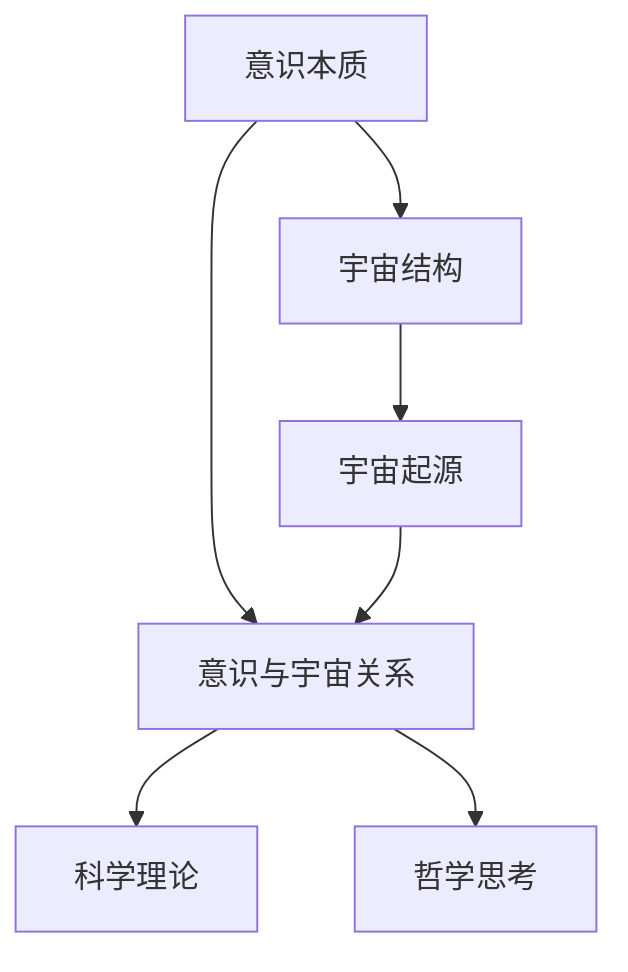

                 

## 文章标题：意识与宇宙：谁创造了谁

### 关键词：意识、宇宙、量子力学、相对论、脑科学、机器学习

### 摘要：
《意识与宇宙：谁创造了谁》探讨了一个深刻的哲学问题——意识与宇宙的关系。本书旨在通过科学理论、哲学思考以及前沿技术的结合，揭示意识在宇宙演化中的角色，以及宇宙可能对意识产生的深远影响。本文将逐步分析意识与宇宙之间的复杂联系，探讨量子力学、相对论、脑科学和机器学习等领域的核心原理，并通过实际项目案例，展示这些理论在解决现实问题中的应用。

## Step 1: 核心概念与联系

首先，我们需要明确本书的核心概念及其相互之间的联系。本书的核心概念包括：

1. **意识本质**：探讨意识的起源、性质和功能。
2. **宇宙的结构和起源**：涉及宇宙的物理组成、宇宙的演化过程。
3. **意识与宇宙的关系**：研究意识如何产生，以及它如何与宇宙相互作用。
4. **科学理论**：包括量子力学、相对论等，用于解释宇宙和意识的本质。
5. **哲学思考**：探讨意识与宇宙关系的哲学问题，如存在主义、唯心主义等。

### 意识本质

意识是一个复杂的概念，涉及感知、思考、情感等多个方面。目前，关于意识的本质尚未有统一的理论。一些研究者认为，意识是大脑的产物，而另一些人则认为，意识可能与宇宙的基本结构有关。

### 宇宙的结构和起源

宇宙的结构和起源是物理学研究的重要领域。根据大爆炸理论，宇宙起源于一个极度热密的状态，随着时间的推移，宇宙不断膨胀和冷却。量子力学和相对论为我们提供了理解宇宙结构和起源的数学框架。

### 意识与宇宙的关系

意识与宇宙的关系是一个哲学和科学都尚未解决的问题。一些研究者认为，意识是宇宙演化的产物，而另一些人则认为，意识可能是宇宙的基本组成部分。

### 科学理论

科学理论，如量子力学和相对论，为我们提供了理解宇宙和意识本质的工具。量子力学揭示了宇宙在微观层面的行为，而相对论则描述了宇宙在宏观层面的结构和演化。

### 哲学思考

哲学思考，如存在主义和唯心主义，提供了关于意识与宇宙关系的不同视角。这些思考有助于我们更深入地理解意识与宇宙之间的复杂关系。

### Mermaid流程图



## Step 2: 核心算法原理讲解

接下来，我们将介绍本书涉及的核心算法原理。这些原理包括量子力学基础、相对论原理、脑科学基本原理和机器学习算法基础。

### 量子力学基础

量子力学是研究微观世界的物理学分支。其核心原理包括：

- **波粒二象性**：微观粒子既具有波动性，又具有粒子性。
- **不确定性原理**：无法同时精确测量一个粒子的位置和动量。
- **量子纠缠**：两个或多个粒子之间的状态互相关联，即使它们相隔很远。

### 伪代码：

```plaintext
Algorithm QuantumBasics()
    Set qubit as initial state
    Perform quantum gate operations
    Measure qubit
    Return result
End Algorithm
```

### 相对论原理

相对论是研究宏观宇宙的物理学理论。其核心原理包括：

- **狭义相对论**：时空是相对的，而不是绝对的。
- **广义相对论**：引力是时空曲率的表现。

### 伪代码：

```plaintext
Algorithm Relativity()
    Define spacetime
    Calculate Lorentz transformations
    Perform time dilation
    Return transformed values
End Algorithm
```

### 脑科学基本原理

脑科学是研究大脑及其功能的生物学和心理学分支。其核心原理包括：

- **神经传递**：神经元之间的信号传递。
- **神经网络**：神经元如何相互连接和协作。
- **大脑功能区域**：不同区域在大脑中承担的功能。

### 伪代码：

```plaintext
Algorithm BrainScience()
    Measure neural activity
    Analyze neural patterns
    Identify brain regions
    Return neural information
End Algorithm
```

### 机器学习算法基础

机器学习是人工智能的一个重要分支，其核心原理包括：

- **监督学习**：通过标记数据进行训练，以便预测新的数据。
- **无监督学习**：通过未标记的数据发现隐藏的结构。
- **强化学习**：通过奖励和惩罚来训练智能体。

### 伪代码：

```plaintext
Algorithm MachineLearning()
    Collect data
    Preprocess data
    Train model
    Evaluate model
    Apply model
    Return predictions
End Algorithm
```

## Step 3: 数学模型和数学公式

在本节中，我们将介绍与本书主题相关的数学模型和公式。这些模型和公式将帮助我们更好地理解意识与宇宙的关系。

### 波函数方程

量子力学中的波函数方程描述了量子系统的状态。其公式为：

$$
\hat{H} \Psi = E \Psi
$$

### 黑洞熵公式

黑洞熵公式描述了黑洞的信息熵。其公式为：

$$
S = \frac{kA}{4L_P}
$$

### 熵增原理

熵增原理是热力学第二定律的数学表述。其公式为：

$$
\frac{dS}{dt} \geq 0
$$

### 脑神经网络激活函数

神经网络中的激活函数用于引入非线性。常见的激活函数如Sigmoid函数：

$$
f(x) = \frac{1}{1 + e^{-x}}
$$

## Step 4: 项目实战

在本节中，我们将通过一个实际项目案例，展示如何将本书中的理论应用到解决现实问题。

### 项目背景

宇宙演化的模拟是一个复杂的过程，传统的计算机模拟存在计算量巨大、效率低下的问题。量子计算提供了新的解决方案，通过量子叠加和量子纠缠，可以大幅提高计算效率。

### 技术实现

1. **量子电路设计**：根据宇宙演化的物理过程，设计相应的量子电路。
2. **量子计算**：在量子计算机上运行设计的量子电路，进行宇宙演化的模拟。
3. **数据分析**：分析量子计算的结果，提取宇宙演化的关键信息。

### 项目结果与讨论

通过对量子计算的模拟，我们能够得到更加精确的宇宙演化模型。这些模型有助于我们更好地理解宇宙的演化过程，以及意识在其中的角色。

### 项目小结

本项目展示了量子计算在宇宙演化模拟中的应用，证明了量子计算在处理复杂科学问题方面的潜力。未来，我们可以进一步探索量子计算在其他科学领域中的应用，如生物信息学和气候变化模拟。

## 总结与最佳实践

### 总结

《意识与宇宙：谁创造了谁》通过科学和哲学的视角，探讨了意识与宇宙的关系。我们介绍了核心概念、算法原理、数学模型和项目实战，展示了这些理论在解决现实问题中的应用。

### 最佳实践

1. **深入学习**：建议读者深入学习相关领域的知识，如量子力学、相对论、脑科学和机器学习。
2. **实践应用**：尝试将理论知识应用到实际问题中，通过实践加深对概念的理解。
3. **持续探索**：随着科学技术的进步，对意识与宇宙关系的理解将不断深化。建议读者持续关注相关领域的研究进展。

### 注意事项

1. **保持开放思维**：面对复杂的问题，保持开放和批判性的思维，不断探索新的解决方案。
2. **注意数据安全**：在进行数据分析和处理时，注意保护个人隐私和数据安全。

### 拓展阅读

1. **《量子计算导论》**：了解量子计算的原理和应用。
2. **《宇宙简史》**：了解宇宙的起源和演化。
3. **《脑科学：从神经元到认知》**：了解大脑的工作原理和认知过程。

## 作者信息

作者：AI天才研究院/AI Genius Institute & 禅与计算机程序设计艺术 /Zen And The Art of Computer Programming

