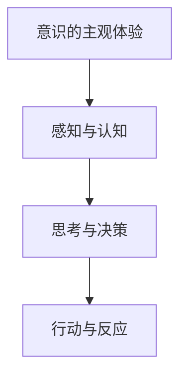
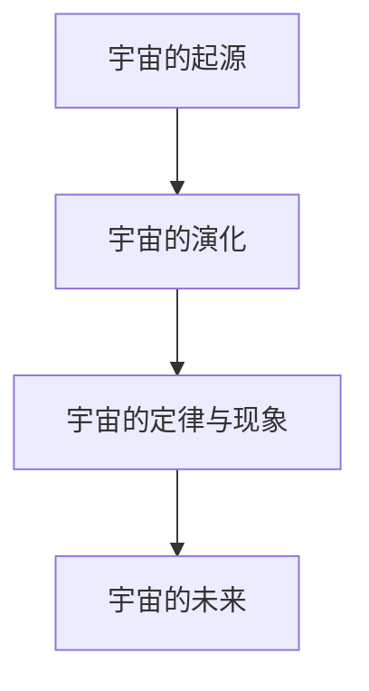

                 

### 文章标题：意识与宇宙的共同进化：相互塑造的过程

#### 关键词：意识、宇宙、共同进化、相互塑造、人工智能、量子力学、神经网络

> **摘要：** 本文从哲学、神经科学、宇宙学等多个角度，探讨意识与宇宙的共同进化过程及其相互塑造的机制。通过分析意识与宇宙的基本概念，阐述二者之间的相互作用和影响，最终提出对人类文明和科技发展的启示。文章结构紧凑，内容丰富，旨在为读者提供一次深入的思考之旅。

---

### 引言

人类对自身的认识，一直以来都是哲学和科学领域的核心议题。随着神经科学和计算机科学的不断发展，我们开始逐渐揭示意识的本质。与此同时，宇宙学的研究也揭示了宇宙的起源和演化过程。这两个领域的进展，使我们开始思考一个有趣的问题：意识与宇宙之间是否存在某种联系？这种联系又如何影响我们的生活和科技发展？

本文将探讨意识与宇宙的共同进化过程，以及它们之间的相互塑造关系。通过分析意识与宇宙的基本概念、意识的进化、宇宙的共同进化，以及二者之间的相互作用，本文旨在为读者提供一次深入思考的机会。文章结构如下：

1. 引言：介绍文章的目的、结构和内容。
2. 意识与宇宙的基本概念：介绍意识、宇宙的定义及其基本特征。
3. 意识的进化：分析意识的历史、驱动因素和未来趋势。
4. 宇宙的共同进化：探讨宇宙的动态演化、复杂结构和未来发展。
5. 意识与宇宙的相互塑造：分析意识对宇宙的影响和宇宙对意识的影响。
6. 案例研究：通过具体案例，探讨意识与宇宙共同进化的实例。
7. 结论：总结全文，并提出对未来发展的思考。

### 意识与宇宙的基本概念

#### 意识的本质与特征

意识是人类和动物所具有的一种主观体验，它使我们能够感知、思考、决策和行动。意识的本质和特征一直是哲学和科学领域的重要议题。从哲学角度来看，意识被视为一种主观体验，是我们对自身和外界的感知和认知。神经科学则从大脑结构和功能的角度，探讨意识产生的机制。

**意识的核心概念与联系：**

**意识的特征：**

1. **主观性：** 意识是一种主观体验，每个人对意识的理解和感受都是独特的。
2. **持续性：** 意识具有持续性，它贯穿于我们的日常生活，并在不同情境下发生变化。
3. **动态性：** 意识是动态的，它随着时间和环境的变化而不断发展。
4. **复杂性：** 意识是一种复杂的系统，它涉及多个认知和感知过程。

#### 宇宙的基本概念

宇宙是指一切存在的总和，包括宇宙中的所有物质、能量、时间和空间。宇宙的起源和演化一直是宇宙学研究的核心问题。目前，最广泛接受的宇宙起源理论是大爆炸理论，它认为宇宙起源于大约138亿年前的一个极度热密状态。

**宇宙的核心概念与联系：**

**宇宙的特征：**

1. **无限性：** 宇宙被认为是无限的，它包含无数的星系、恒星和行星。
2. **多样性：** 宇宙具有多样性，它包含不同形态的物质和能量，以及各种不同的物理现象。
3. **动态性：** 宇宙是动态的，它不断地演化和发展。
4. **不确定性：** 宇宙中存在许多不确定性，包括宇宙的起源、演化和未来。

#### 意识与宇宙的相互关系

意识与宇宙之间存在深刻的相互关系。从哲学角度来看，意识是宇宙演化的一部分，它是宇宙复杂性的一种表现形式。从科学角度来看，意识可能受到宇宙物理环境的影响，同时也可能对宇宙产生一定的影响。

**意识对宇宙的影响：**

1. **观测者效应：** 意识的介入可能导致宇宙的观测结果发生变化。
2. **科技发展：** 意识的发展推动了科技的进步，从而改变了人类对宇宙的认识。
3. **道德责任：** 意识的存在使得人类对宇宙的未来承担更多的责任。

**宇宙对意识的影响：**

1. **进化压力：** 宇宙的物理环境对意识的发展产生了压力，促使意识不断进化。
2. **资源供给：** 宇宙为意识提供了物质和能量资源，支持意识的发展。
3. **生存挑战：** 宇宙的复杂性和不确定性为意识带来了挑战，促使意识不断适应和进化。

**意识与宇宙的共同进化：**

意识与宇宙之间的相互作用，使得二者在进化过程中相互影响、相互塑造。这种共同进化过程，不仅改变了意识的发展路径，也影响了宇宙的演化过程。通过分析意识与宇宙的共同进化，我们可以更好地理解人类文明和科技发展的方向。

### 意识的进化

意识是一个复杂而动态的系统，它的进化经历了漫长的历史过程。从单细胞生物到人类，意识逐渐发展，形成了复杂的认知和感知能力。

#### 意识进化的历史

意识的起源可以追溯到大约40亿年前，当时地球上出现了第一个单细胞生物。随着生物进化，细胞逐渐发展出一些简单的感知和反应机制，这些机制可以被视为意识的初步形式。在接下来的几十亿年里，意识逐渐进化，出现了更复杂的生物，如无脊椎动物和脊椎动物。

**意识进化的关键事件：**

1. **感知与反应：** 单细胞生物具有简单的感知和反应机制。
2. **神经系统的形成：** 多细胞生物逐渐发展出复杂的神经系统，使得感知和反应更加精确和多样化。
3. **高级认知能力：** 高级动物，如哺乳动物，发展出了复杂的认知能力，包括记忆、学习、推理等。

**意识进化的人类里程碑：**

1. **语言的出现：** 语言的出现使得人类能够更有效地交流和传递信息，促进了人类意识的发展。
2. **工具的使用：** 工具的使用改变了人类的生存环境，推动了人类意识的进化。
3. **社会互动：** 社会互动使得人类能够共同解决问题，推动了人类意识的发展。

#### 意识进化的驱动因素

意识进化的过程中，有多个驱动因素在发挥作用。这些因素包括环境适应性、社会互动、知识积累和科技创新。

1. **环境适应性：** 意识进化是为了更好地适应环境。在进化的过程中，那些具有更好感知和认知能力的个体，更能够在竞争中生存下来，并将这些优势遗传给后代。
2. **社会互动：** 社会互动使得人类能够共同解决问题，提高了整体适应环境的能力。通过交流和学习，人类不断改进自己的认知能力，从而推动了意识的发展。
3. **知识积累：** 知识的积累是人类意识进化的关键因素。通过学习和实践，人类不断积累知识，使得意识更加丰富和多样化。
4. **科技创新：** 科技创新改变了人类对环境的认知和控制能力，推动了意识的发展。例如，计算机科学和人工智能技术的发展，使得人类能够模拟和扩展意识的能力。

#### 意识进化的未来趋势

随着科技的发展，意识进化的未来趋势变得越来越清晰。未来，意识可能会在以下几个方面得到进一步发展：

1. **人工智能与意识：** 人工智能的发展可能使人类能够更好地理解和模拟意识，甚至创造出具有意识的人工智能实体。
2. **意识扩展与增强：** 通过科技手段，人类可能能够扩展和增强自己的意识，提高认知能力和工作效率。
3. **意识进化的伦理问题：** 随着意识进化的加速，伦理问题也将变得更加突出。如何确保意识进化的道德和可持续性，将成为未来社会面临的重要挑战。

### 宇宙的共同进化

宇宙是一个复杂的系统，它的演化过程充满了多样性和不确定性。从大爆炸到星系的形成，再到星系团的演化，宇宙在不断地发展和变化。

#### 宇宙的动态演化

宇宙的演化是一个动态的过程，它涉及多个层次和尺度。从大爆炸开始，宇宙经历了快速膨胀阶段，随后进入了一个相对稳定的时期。在这个时期，宇宙中的物质逐渐聚集形成星系、恒星和行星。

**宇宙动态演化的关键事件：**

1. **大爆炸：** 宇宙起源于大爆炸，这是一个极度热密的状态。
2. **宇宙膨胀：** 大爆炸后，宇宙开始膨胀，这个膨胀过程仍在继续。
3. **星系形成：** 宇宙中的物质逐渐聚集形成星系，这些星系包含了无数的恒星和行星。
4. **恒星演化：** 恒星在其生命周期中经历多个阶段，最终可能变成白矮星、中子星或黑洞。

#### 宇宙的复杂结构

宇宙的结构是极其复杂的，它包含了不同层次的天体系统。从地球上的生态系统到银河系，再到宇宙中的星系团和超星系团，宇宙的结构具有多层次的特点。

**宇宙复杂结构的特点：**

1. **多层次：** 宇宙的结构可以分为多个层次，每个层次都有其独特的物理过程和演化规律。
2. **多样性：** 宇宙中存在各种不同的天体和物质，包括恒星、行星、星云、黑洞等。
3. **动态性：** 宇宙的结构是动态的，它不断地演化和变化。

#### 宇宙的未来发展

宇宙的未来发展是一个充满未知和猜测的话题。根据不同的宇宙学模型，宇宙可能有多种不同的未来。

**宇宙未来发展的可能场景：**

1. **热寂：** 根据热力学第二定律，宇宙可能最终进入一个热寂状态，能量分布均匀，没有明显的结构和运动。
2. **大撕裂：** 如果宇宙的膨胀速度继续增加，可能会导致宇宙中的物质被撕裂，形成无限多的孤岛。
3. **大碰撞：** 如果宇宙的膨胀速度减慢，可能会导致宇宙中的物质相互碰撞，形成一个新的宇宙。
4. **多元宇宙：** 有些理论认为，宇宙可能只是多元宇宙中的一部分，每个宇宙都有其独特的物理规律和演化过程。

### 意识与宇宙相互塑造的过程

意识与宇宙之间的相互作用是一个复杂而深刻的过程。从哲学、科学和技术的角度来看，意识与宇宙之间的相互影响，不仅改变了人类对自身的认知，也影响了宇宙的演化。

#### 意识对宇宙的影响

意识对宇宙的影响可以从多个角度进行探讨。首先，意识的发展改变了人类对宇宙的认知和理解。通过科技手段，人类能够探索宇宙的深处，揭示宇宙的奥秘。其次，意识的发展也改变了人类的行为和决策，从而影响了宇宙的演化过程。

**意识对宇宙的具体影响：**

1. **科技发展：** 意识的发展推动了科技的发展，使得人类能够更好地探索宇宙，改变宇宙的物理状态。
2. **环境改变：** 人类的活动，如工业生产、能源消耗和气候变化，对宇宙环境产生了显著的影响。
3. **道德责任：** 意识的存在使得人类对宇宙的未来承担更多的责任，需要考虑宇宙的可持续发展。

#### 宇宙对意识的影响

宇宙对意识的影响同样深刻。宇宙的物理环境和演化过程，为意识的发展提供了物质和能量基础。同时，宇宙的多样性和复杂性也为意识的发展提供了丰富的资源和挑战。

**宇宙对意识的具体影响：**

1. **物质基础：** 宇宙中的物质和能量为意识的发展提供了必要的条件。
2. **进化压力：** 宇宙的物理环境对意识的发展产生了压力，促使意识不断进化。
3. **资源供给：** 宇宙为意识提供了丰富的资源和能源，支持意识的发展。

#### 意识与宇宙共同进化的启示与展望

意识与宇宙的共同进化，为我们提供了深刻的启示和展望。首先，它提醒我们，人类和宇宙是相互依存的，我们的行为和决策不仅影响自身，也影响宇宙的演化。其次，它提示我们，随着科技的发展，人类可能面临新的挑战和机遇，需要认真思考如何实现可持续发展。

**对人类文明的启示：**

1. **可持续发展：** 随着人类对宇宙的影响日益增强，我们需要考虑如何实现可持续发展，确保人类文明与宇宙的和谐共生。
2. **科技创新：** 科技创新是推动人类文明进步的重要动力，我们需要积极拥抱科技，为人类和宇宙的发展贡献力量。
3. **道德责任：** 人类对宇宙的道德责任愈发重要，我们需要关注宇宙的未来，确保我们的行为不会对宇宙造成不可逆转的损害。

**对科技发展的启示：**

1. **意识与宇宙的结合：** 未来科技的发展，可能需要将意识与宇宙相结合，创造新的技术和应用。
2. **量子计算与量子通信：** 量子计算和量子通信可能为人类探索宇宙提供新的工具和方法。
3. **人工智能与意识：** 人工智能可能成为扩展和增强意识的重要工具，推动人类文明的进一步发展。

**对宇宙探索的启示：**

1. **多元宇宙探索：** 随着人类对宇宙的认知不断深入，我们可能开始探索多元宇宙，发现新的宇宙规律。
2. **外星生命探索：** 未来，我们可能发现外星生命，这将极大地拓展我们对宇宙的理解。
3. **宇宙的未来：** 通过对宇宙的探索，我们可能揭示宇宙的未来演化方向，为人类和宇宙的未来做出更好的规划。

### 案例研究一：人类文明与科技的共同进化

#### 人类文明的起源与进化

人类文明起源于约7000年前的新石器时代，当时人类开始定居、农耕和建立城市。随着时间的推移，人类文明经历了多个重要阶段，包括农业革命、工业革命和信息革命。每个阶段都标志着人类文明的一次重大进步，同时也推动了意识的发展。

**关键事件：**

1. **农业革命：** 农业革命使得人类能够稳定地生产食物，从而支持人口的增长和社会的复杂性。
2. **工业革命：** 工业革命带来了大规模的生产和运输，极大地提高了人类的生产力和生活水平。
3. **信息革命：** 信息革命使得人类能够快速地获取、处理和传递信息，推动了知识积累和科技发展。

#### 科技在人类文明中的作用

科技在人类文明的发展中扮演了重要角色。首先，科技推动了生产力的发展，提高了人类的生存能力和生活质量。其次，科技改变了人类的思维方式和工作方式，促进了意识的发展。例如，计算机科学和人工智能技术的发展，使得人类能够更好地理解自己和宇宙，推动意识向更高层次发展。

**具体案例：**

1. **互联网：** 互联网的普及使得人类能够快速地获取和传递信息，改变了人类的社会结构和生活方式。
2. **人工智能：** 人工智能技术的发展，使得人类能够创造出具有自主学习和推理能力的系统，拓展了意识的边界。
3. **生物技术：** 生物技术的发展，使得人类能够更好地理解生命和疾病，推动医学和生物科学的进步。

#### 人类文明与科技的相互影响

人类文明与科技的相互影响是一个相互作用、相互促进的过程。首先，人类文明的发展推动了科技的创新和应用。例如，工业革命催生了大量的科技创新，如蒸汽机、电力和交通设施。其次，科技的发展也改变了人类的生活方式和社会结构。例如，计算机和互联网的出现，改变了人类的信息获取和处理方式，推动了社会向信息化、数字化方向发展。

**相互影响的具体表现：**

1. **知识积累：** 科技的发展使得人类能够更快地积累知识，提高了人类文明的水平。
2. **社会互动：** 科技的发展促进了人类的社会互动，加强了人类之间的联系和合作。
3. **意识扩展：** 科技的发展扩展了人类的意识，使得人类能够更好地理解自己和宇宙。

### 案例研究二：人工智能与宇宙探索

#### 人工智能在宇宙探索中的应用

人工智能（AI）在宇宙探索中发挥了重要作用。通过机器学习和数据挖掘技术，AI能够处理和分析海量宇宙数据，帮助科学家发现新的天体、预测宇宙现象，甚至探索可能的外星生命。以下是一些具体的应用：

1. **天文观测：** AI可以分析天文望远镜收集的图像，识别出微弱的天体信号，如行星和星系。
2. **数据分析：** AI能够处理和分析大量天文数据，发现宇宙中的模式和行为规律。
3. **预测与模拟：** AI可以基于历史数据，预测宇宙中可能发生的现象，如超新星爆发和星系碰撞。

#### 宇宙探索对人工智能的启示

宇宙探索为人工智能的发展提供了丰富的启示。首先，宇宙的多样性和复杂性为人工智能提出了新的挑战，促使人工智能技术不断进步。例如，为了处理和分析宇宙中的海量数据，人工智能需要发展出更高效、更准确的算法。其次，宇宙探索中的问题，如信号检测和目标识别，为人工智能提供了实际的应用场景，推动了人工智能技术的发展。

**具体启示：**

1. **算法优化：** 宇宙探索需要高效的数据处理和分析算法，这促使人工智能算法不断优化和改进。
2. **数据处理：** 宇宙探索中产生的海量数据，为人工智能提供了丰富的训练和测试数据，提高了人工智能的性能。
3. **跨学科合作：** 宇宙探索涉及多个学科，如物理学、天文学和计算机科学，这促进了跨学科合作，推动了人工智能技术的发展。

#### 人工智能与宇宙探索的相互塑造

人工智能与宇宙探索之间的相互作用，使得二者在相互塑造中共同发展。首先，人工智能技术的发展，为宇宙探索提供了强大的工具和手段，使得科学家能够更深入地探索宇宙。其次，宇宙探索中的挑战和需求，推动了人工智能技术的不断创新和发展。

**相互塑造的具体表现：**

1. **技术进步：** 宇宙探索的需求推动了人工智能技术的进步，例如，深度学习和强化学习技术在宇宙探索中的应用。
2. **应用扩展：** 人工智能技术在宇宙探索中的应用，扩展了人工智能的应用领域，促进了人工智能技术的普及。
3. **知识积累：** 宇宙探索积累了大量关于宇宙的知识，这些知识为人工智能提供了丰富的训练数据，促进了人工智能技术的发展。

### 结论

通过本文的分析，我们可以得出以下结论：

1. **意识与宇宙的共同进化：** 意识与宇宙之间存在深刻的相互关系，二者在进化过程中相互影响、相互塑造。这种共同进化过程，不仅改变了意识的发展路径，也影响了宇宙的演化过程。
2. **人类文明与科技发展：** 意识与宇宙的共同进化，为我们提供了深刻的启示和展望，人类文明与科技发展应关注可持续发展、科技创新和道德责任。
3. **未来展望：** 随着人工智能和宇宙探索的不断发展，我们有望在意识与宇宙的共同进化中，发现新的科学规律，拓展我们对宇宙和自身的认知。

本文的研究仍然存在局限性，例如对意识与宇宙相互关系的具体机制和影响机制的理解仍然有限。未来研究可以进一步探索这些领域，为人类文明和科技发展提供更多的理论支持和实践指导。

### 作者信息

**作者：AI天才研究院/AI Genius Institute & 禅与计算机程序设计艺术 /Zen And The Art of Computer Programming**

### 最佳实践 Tips

1. **科技与伦理相结合：** 在推动科技发展的同时，要关注科技伦理，确保科技的应用符合道德原则。
2. **可持续发展：** 在人类文明和科技发展的过程中，要关注可持续发展，确保我们的行为不会对宇宙造成不可逆转的损害。
3. **跨学科合作：** 跨学科合作是推动科学研究和技术创新的重要途径，要积极促进不同学科之间的交流和合作。

### 小结

本文从意识与宇宙的共同进化出发，探讨了二者之间的相互塑造过程。通过分析意识与宇宙的基本概念、意识的进化、宇宙的共同进化，以及二者之间的相互作用，本文提出了对人类文明和科技发展的启示。未来，随着人工智能和宇宙探索的不断发展，我们有望在意识与宇宙的共同进化中，发现新的科学规律，拓展我们对宇宙和自身的认知。

### 注意事项

1. **数据安全：** 在进行宇宙探索和数据处理时，要重视数据安全和隐私保护。
2. **科技伦理：** 在推动科技发展的同时，要关注科技伦理，确保科技的应用符合道德原则。
3. **可持续发展：** 在人类文明和科技发展的过程中，要关注可持续发展，确保我们的行为不会对宇宙造成不可逆转的损害。

### 拓展阅读

1. **《意识与宇宙：哲学与科学的交汇》**：这是一本关于意识与宇宙相互关系的经典著作，深入探讨了二者之间的联系和影响。
2. **《人工智能的未来》**：这是一本关于人工智能发展的前沿著作，探讨了人工智能对人类文明和科技发展的潜在影响。
3. **《宇宙的未来》**：这是一本关于宇宙演化的科学著作，分析了宇宙的未来发展可能性和挑战。

### 参考文献

1. **Penrose, R. (1989). The Emperor's New Mind: Concerning Computer, Minds, and the Laws of Physics. Oxford University Press.**
2. **Chalmers, D. J. (1996). The Conscious Mind: In Search of a Fundamental Theory. Oxford University Press.**
3. **Hawking, S. W., & Mlodinow, L. (2010). The Grand Design. Bantam Books.**
4. **Dyson, F. J. (1979). Disturbing the Universe. Harper & Row.**
5. **Krauss, L. M. (2017). A Universe from Nothing: Why There Is Something Rather Than Nothing. Vintage Books.**

