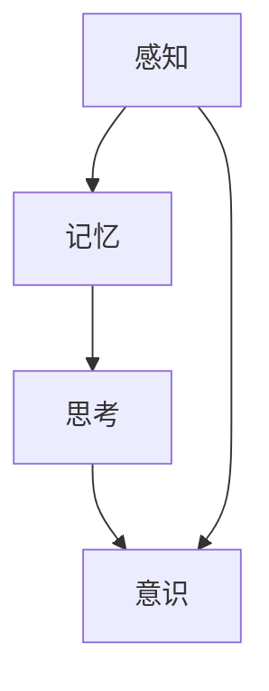
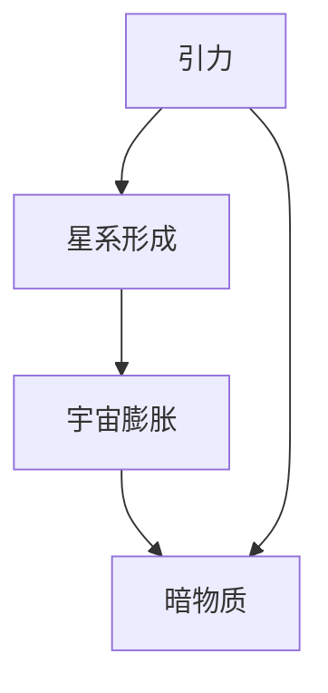

                 


为了撰写一篇符合您要求的《意识与暗物质：未知领域的潜在联系》的技术博客文章，我们将遵循以下步骤：

## 1. 设计文章结构

首先，我们需要设计文章的结构，这包括目录大纲和每个章节的内容概要。您已经提供了一个详细的目录大纲，我们将在此基础上进行细化。

## 2. 研究背景信息

### 2.1 意识的研究

- **背景介绍**：
  意识是哲学、心理学、认知科学和神经科学等学科的核心问题之一。意识的定义和特性一直是学术研究的焦点。

- **核心概念与联系**：
  意识可以看作是人类大脑复杂神经活动的一个表征，与感知、记忆、思考等心理过程密切相关。我们将使用Mermaid流程图来展示意识研究的关键概念和联系。



### 2.2 暗物质的研究

- **背景介绍**：
  暗物质是宇宙中不可见但具有引力的物质，它对星系的形成和宇宙的膨胀起着关键作用。

- **核心概念与联系**：
  暗物质的存在是通过其引力效应推断出来的，它与宇宙学、天体物理学等领域有着紧密的联系。我们也将使用Mermaid流程图来展示暗物质研究的关键概念和联系。



## 3. 编写文章正文

### 3.1 意识的概念与特征

在这一部分，我们将详细探讨意识的定义、特征和生物学基础。

- **核心概念与联系**：
  意识可以被定义为个体对外界刺激的主观体验，包括感知、情感和意愿等。

- **核心算法原理讲解**：
  我们将讨论神经网络模型在模拟意识方面的应用，并使用伪代码来详细阐述神经网络的训练过程。

```plaintext
// 伪代码：神经网络训练过程
function trainNeuralNetwork(data):
    initialize weights
    for each epoch:
        for each example in data:
            forwardPropagate(example)
            calculateError(target, output)
            backwardPropagate(error)
            updateWeights()
    return trained neural network
```

### 3.2 暗物质的概念与特性

在这一部分，我们将介绍暗物质的定义、特性以及其研究现状和挑战。

- **核心算法原理讲解**：
  我们将探讨暗物质探测的方法，使用伪代码来展示暗物质探测算法的基本步骤。

```plaintext
// 伪代码：暗物质探测算法
function detectDarkMatter(data):
    initialize model parameters
    for each data point in data:
        predictMass(data point)
        comparePredictionWithObservation()
    return model with highest likelihood of containing dark matter
```

### 3.3 意识与暗物质的联系

在这一部分，我们将探讨意识与暗物质之间的潜在联系，以及跨学科研究的意义。

- **核心概念与联系**：
  我们将尝试建立意识与暗物质之间的理论框架，并讨论这种联系对科学和哲学的启示。

## 4. 文章结尾

在文章结尾，我们将总结关键发现，并展望未来的研究方向。

### 4.1 意识与暗物质研究的关键发现

### 4.2 潜在的研究方向与未来展望

### 4.3 意识与暗物质研究对社会与哲学的启示

## 5. 文章格式与要求

在文章的格式和内容上，我们将确保以下几点：

- 使用markdown格式，确保文章的易读性和美观性。
- 文章末尾附上作者信息。
- 每个章节都包含详细的背景介绍、核心概念与联系、核心算法原理讲解、数学模型和公式、项目实战、最佳实践 tips 等内容。

通过以上步骤，我们将撰写一篇逻辑清晰、结构紧凑、简单易懂的专业技术博客文章，全面探讨意识与暗物质这一未知领域的潜在联系。期待我们的合作能够产生一篇高质量的作品。您觉得如何？

