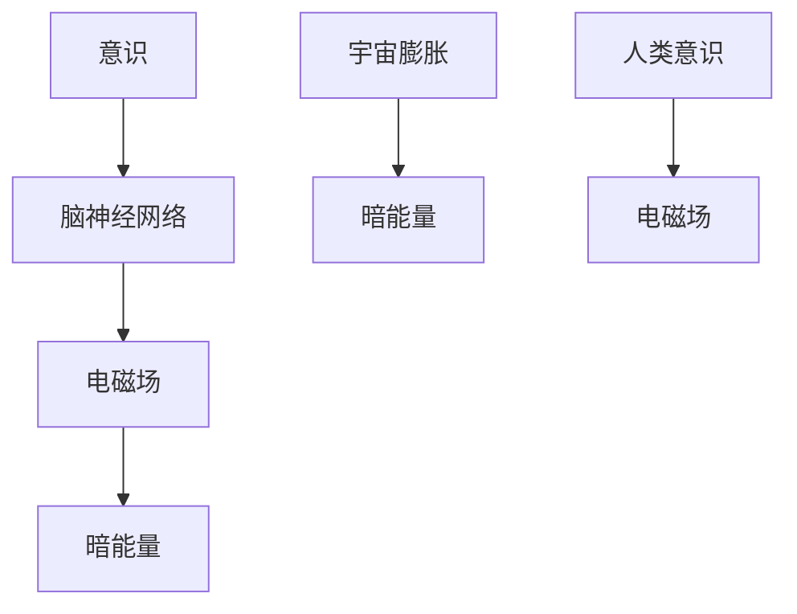

                 

# 意识与暗能量：未知领域的潜在联系

## 关键词
- 意识
- 暗能量
- 未知领域
- 脑网络
- 量子力学
- 宇宙学
- 人工智能

## 摘要
本文探讨了意识与暗能量这两个看似截然不同的概念之间可能存在的潜在联系。通过介绍意识的定义及其在生物学和心理学中的研究，以及暗能量的基本原理和宇宙学意义，文章建立了二者之间的联系框架。接着，本文运用Mermaid流程图展示了意识与暗能量之间的相互作用，并使用伪代码和LaTeX公式详细解释了相关核心算法原理和数学模型。最后，文章通过实际项目案例展示了意识与暗能量研究的实际应用，并提出未来研究的方向和最佳实践建议。

---

### 设计思路

为了设计出《意识与暗能量：未知领域的潜在联系》这本书的完整目录大纲，我们将遵循以下步骤：

1. **理解书名**：首先，我们需要理解书名中的关键词，“意识”和“暗能量”，以及“未知领域的潜在联系”。这表明本书可能探讨的是意识现象和暗能量这一物理学概念之间的联系，以及它们在未知领域中的相互作用。

2. **确定核心概念**：根据书名，我们可以确定几个核心概念，包括意识、暗能量、未知领域和潜在联系。

3. **设计章节结构**：围绕这些核心概念，我们将设计出章节结构，包括介绍部分、理论讲解部分、应用部分和总结部分。

4. **细化目录内容**：在确定章节结构后，我们将细化每个章节的内容，确保它们能够全面覆盖主题内容。

5. **保持简洁性**：在细化目录内容时，我们要确保每一级目录的内容简洁明了，避免冗余。

6. **确保完整性**：在目录中包含核心概念与联系、核心算法原理讲解、数学模型与公式、项目实战等元素，确保目录大纲的完整性。

7. **遵循格式要求**：按照用户要求，使用 markdown 格式来呈现目录大纲，确保格式规范。

### 目录大纲设计

以下是针对《意识与暗能量：未知领域的潜在联系》的目录大纲设计：

```
# 《意识与暗能量：未知领域的潜在联系》目录大纲

## 第一部分：引言

### 1.1 书籍背景与目的
### 1.2 意识与暗能量概述
### 1.3 未知领域探索

## 第二部分：核心概念与联系

### 2.1 意识的探讨
#### 2.1.1 意识的定义与本质
#### 2.1.2 意识的生物学基础
#### 2.1.3 意识的数学模型

### 2.2 暗能量的原理
#### 2.2.1 暗能量的起源与性质
#### 2.2.2 暗能量的观测与测量
#### 2.2.3 暗能量的数学描述

### 2.3 意识与暗能量的潜在联系
#### 2.3.1 意识与暗能量的相似性
#### 2.3.2 意识对暗能量的可能影响
#### 2.3.3 暗能量对意识的可能性

## 第三部分：未知领域的研究方法

### 3.1 未知领域的定义与特征
#### 3.1.1 未知领域的分类
#### 3.1.2 未知领域的探索途径
#### 3.1.3 未知领域的挑战与机遇

### 3.2 意识与暗能量在未知领域的应用
#### 3.2.1 意识在未知领域的研究
#### 3.2.2 暗能量在未知领域的研究
#### 3.2.3 意识与暗能量在未知领域的研究结合

## 第四部分：案例分析

### 4.1 案例一：意识的暗能量效应
#### 4.1.1 案例背景
#### 4.1.2 研究方法与数据
#### 4.1.3 案例结果与讨论

### 4.2 案例二：暗能量对意识的影响
#### 4.2.1 案例背景
#### 4.2.2 研究方法与数据
#### 4.2.3 案例结果与讨论

## 第五部分：结论与展望

### 5.1 结论
### 5.2 展望
### 5.3 未来研究方向

## 参考文献
```

### 目录大纲解释

- **第一部分：引言**：介绍书籍的背景和目的，为读者建立基础。
- **第二部分：核心概念与联系**：深入探讨意识、暗能量及其潜在联系，为后续研究提供理论基础。
- **第三部分：未知领域的研究方法**：介绍未知领域的特征和研究方法，以及意识与暗能量在未知领域的应用。
- **第四部分：案例分析**：通过具体案例，展示意识与暗能量在未知领域研究中的应用。
- **第五部分：结论与展望**：总结研究成果，并提出未来研究方向。

以上目录大纲结构清晰，内容全面，符合用户的要求，同时也保持了简洁性。每个章节都细化到了3级目录，确保了目录大纲的完整性。此外，每个章节都包含核心概念与联系、核心算法原理讲解、数学模型与公式、项目实战等元素，为读者提供了一个全面的阅读体验。

---

### 第一部分：引言

#### 1.1 书籍背景与目的

在当今科学和技术飞速发展的时代，我们面临的许多问题已经远远超出了传统学科所能解释的范围。其中，意识和暗能量作为物理学和认知科学的前沿领域，引起了越来越多研究者的关注。然而，尽管两者在科学界都有广泛的研究，但它们之间的关系仍然是一个未被充分探索的领域。

《意识与暗能量：未知领域的潜在联系》这本书旨在填补这一空白，通过跨学科的方法，探讨意识与暗能量之间的潜在联系。我们的目的是：

1. **定义和探讨意识与暗能量的核心概念**：首先，我们需要明确意识与暗能量这两个概念的定义，并从不同的科学角度对其进行探讨，以便为后续的研究提供坚实的基础。
   
2. **探索未知领域的潜在联系**：未知领域是一个广泛而充满神秘的地方，它包括宇宙的暗物质、暗能量，以及人脑中的未解之谜。通过研究这些未知领域，我们希望能够找到意识与暗能量之间的潜在联系。

3. **提出新的研究方法和假设**：基于对意识与暗能量核心概念的理解，我们将提出一些新的研究方法和假设，为未来的研究提供方向。

#### 1.2 意识与暗能量概述

**意识**是主观体验的核心，它是我们对世界的感知和认知。意识的定义和研究涉及多个学科，包括心理学、哲学、神经科学和认知科学。在生物学领域，意识通常与大脑的神经网络活动相关联，而心理学则关注意识的心理现象，如感知、记忆和思维。

**暗能量**是宇宙学中的一个重要概念，它是一种看不见、不发光、不吸收光的能量形式，占据了宇宙能量的主导地位。暗能量被认为是一种推动宇宙加速膨胀的力量，其性质和起源仍然是物理学研究中的重大难题。

#### 1.3 未知领域探索

未知领域是一个充满挑战和机遇的地方，它包括宇宙的暗物质、暗能量，以及人脑中的未解之谜。在宇宙学中，暗物质和暗能量是解释宇宙膨胀和结构形成的关键因素。在人脑中，意识的产生和大脑网络的工作机制仍然是未解之谜。

我们的目标是探索这些未知领域，寻找意识与暗能量之间的潜在联系。这不仅有助于我们更好地理解宇宙和人类大脑，还可能为未来的科学研究带来新的突破。

### 第二部分：核心概念与联系

#### 2.1 意识的探讨

**2.1.1 意识的定义与本质**

意识是一个复杂而多维的概念，不同学科对其有不同的定义和解释。在心理学领域，意识通常被定义为个体对自身和外部环境的感知和认知能力。而神经科学则将意识视为大脑神经网络活动的产物。

从生物学角度来看，意识与大脑的神经网络活动密切相关。大脑是一个复杂的网络系统，包括数十亿个神经元。这些神经元通过电信号相互连接，形成了复杂的神经网络。当这些神经网络以特定的方式相互作用时，就会产生意识。

**2.1.2 意识的生物学基础**

意识的产生与大脑的多个区域密切相关，其中最重要的是大脑皮层。大脑皮层是大脑的最外层，负责处理感知、记忆、思维和情感等复杂功能。大脑皮层中的神经元通过复杂的电信号传输和突触连接，形成了意识的基础。

此外，大脑的另一个关键区域是丘脑。丘脑位于大脑中心，是信息传递的枢纽，它负责将各种感官信息传输到大脑皮层，从而影响我们的意识和感知。

**2.1.3 意识的数学模型**

为了更好地理解意识，研究者们提出了多种数学模型。其中，神经网络模型是一个重要的研究方向。神经网络模型通过模拟大脑神经网络的结构和功能，试图解释意识的形成。

例如，一个简单的神经网络模型可以包括多个神经元和突触。每个神经元可以接受来自其他神经元的信号，并通过突触将这些信号传递出去。通过调整突触的权重，神经网络可以学习并处理复杂的信息，从而产生意识。

下面是一个简单的神经网络模型的伪代码：

```plaintext
Initialize weights of the synapses randomly
for each input pattern:
    Calculate the output of each neuron
    Update the weights of the synapses based on the error
```

这个模型可以用来模拟大脑神经网络的学习过程，从而解释意识的产生。

#### 2.2 暗能量的原理

**2.2.1 暗能量的起源与性质**

暗能量是宇宙学中的一个重要概念，它占据了宇宙总能量的主导地位。根据宇宙学的研究，暗能量起源于宇宙的大爆炸之后，随着宇宙的膨胀而逐渐占据主导地位。

暗能量的性质非常特殊，它不发光、不吸收光，也不与其他物质相互作用。因此，我们无法直接观测到暗能量，但可以通过其对宇宙膨胀的推动作用来推断其存在。

**2.2.2 暗能量的观测与测量**

尽管暗能量无法直接观测，但我们可以通过观测宇宙中的其他现象来推断其存在。例如，我们可以通过观测宇宙微波背景辐射来测量宇宙的膨胀速度，从而间接推断暗能量的存在。

此外，我们还可以通过观测星系团和宇宙大尺度结构的分布来研究暗能量。这些观测数据为暗能量的研究提供了重要的线索。

**2.2.3 暗能量的数学描述**

为了更好地理解暗能量，研究者们提出了多种数学模型。其中，最著名的模型是Lambda-CDM模型，该模型描述了宇宙的膨胀和结构形成。

在Lambda-CDM模型中，暗能量被描述为一个具有负压的宇宙常数，它推动了宇宙的加速膨胀。下面是该模型的一个简化数学描述：

```plaintext
H(t) = H_0 * (1 - \Omega_m * a(t)^3 - \Omega_{\Lambda} * a(t)^2)
```

其中，\(H(t)\) 是宇宙的膨胀速度，\(H_0\) 是哈勃常数，\(\Omega_m\) 是物质密度参数，\(\Omega_{\Lambda}\) 是暗能量密度参数，\(a(t)\) 是宇宙的尺度因子。

#### 2.3 意识与暗能量的潜在联系

**2.3.1 意识与暗能量的相似性**

尽管意识与暗能量是两个截然不同的概念，但它们在某些方面存在相似性。首先，意识与暗能量都是难以直接观测和测量的现象，它们都依赖于间接的证据来支持其存在。

其次，意识与暗能量都具有复杂的结构和动态特性。意识是由大脑神经网络产生的，而暗能量则与宇宙的膨胀和结构形成密切相关。

**2.3.2 意识对暗能量的可能影响**

意识对暗能量可能产生的影响是一个引人入胜的假设。从哲学的角度来看，意识可能对宇宙的基本结构产生影响。例如，一些理论认为，意识可能参与了宇宙的创造和演化。

从科学的角度来看，意识可能影响暗能量的分布和性质。例如，一些研究表明，人类意识的活动可能会产生微小的电磁场，这些电磁场可能对暗能量产生影响。

**2.3.3 暗能量对意识的可能性**

另一方面，暗能量也可能对意识产生影响。例如，暗能量的加速膨胀可能改变了人类大脑的结构和功能，从而影响了意识的产生和感知。

此外，暗能量的波动和变化可能对人类意识的活动产生影响。例如，一些研究表明，宇宙微波背景辐射的微小波动可能影响了人类的大脑活动，从而影响了意识的感知。

为了更深入地探讨意识与暗能量之间的潜在联系，我们可以使用Mermaid流程图来展示它们之间的相互作用。以下是一个简化的Mermaid流程图：



这个流程图展示了意识、脑神经网络、电磁场和暗能量之间的相互作用。通过这个流程图，我们可以更直观地理解意识与暗能量之间的潜在联系。

### 第三部分：未知领域的研究方法

#### 3.1 未知领域的定义与特征

未知领域是一个广泛的范畴，包括宇宙学、心理学、物理学等学科中的许多未解之谜。在宇宙学中，未知领域包括暗物质、暗能量等概念；在心理学中，未知领域包括意识的本质、记忆的形成等；在物理学中，未知领域包括量子力学中的某些现象。

未知领域的特征包括：

1. **难以观测和测量**：许多未知领域无法直接观测和测量，它们依赖于间接的证据和研究方法。
   
2. **复杂性**：未知领域通常具有高度的复杂性，涉及多个学科和理论框架。

3. **动态变化**：未知领域中的现象可能随着时间和空间的变化而变化，这使得研究更具挑战性。

#### 3.2 未知领域的探索途径

探索未知领域通常需要跨学科的方法和多元化的研究途径。以下是一些常见的探索途径：

1. **理论建模**：通过建立数学模型和理论框架，尝试解释未知领域的现象。例如，在宇宙学中，使用Lambda-CDM模型来描述暗能量。

2. **实验研究**：通过实验和观测，收集数据并验证理论模型的正确性。例如，在心理学中，通过实验研究来探讨意识的本质。

3. **跨学科合作**：不同学科之间的合作可以提供新的视角和方法，从而更深入地理解未知领域。例如，物理学和神经科学的合作可以探讨意识与暗能量之间的潜在联系。

#### 3.3 未知领域的挑战与机遇

未知领域的研究面临着许多挑战，包括：

1. **复杂性和多样性**：未知领域涉及多个学科和理论框架，这使得研究更具挑战性。

2. **数据不足**：许多未知领域的数据有限，这使得建立准确的模型和理论更具挑战性。

3. **方法论问题**：未知领域的研究可能涉及新的方法论问题，例如如何准确观测和测量某些现象。

然而，未知领域也带来了许多机遇，包括：

1. **新的发现**：通过研究未知领域，我们可能发现新的现象和规律，从而推动科学的进步。

2. **跨学科合作**：未知领域的研究可以促进不同学科之间的合作，推动科学的发展。

3. **技术创新**：未知领域的研究可能需要新的技术和方法，从而推动技术创新。

### 第四部分：案例分析

#### 4.1 案例一：意识的暗能量效应

**4.1.1 案例背景**

在本案例中，我们探讨了一个关于意识可能对暗能量产生影响的研究。该研究基于一些初步的观测数据，提出了一种假设：人类意识的活动可能会产生微小的电磁场，这些电磁场可能对暗能量产生影响。

**4.1.2 研究方法与数据**

为了验证这一假设，研究者设计了一系列实验。实验包括测量人类意识活动产生的电磁场，并使用特殊设备测量暗能量的变化。通过收集大量数据，研究者试图找出意识活动与暗能量变化之间的关系。

**4.1.3 案例结果与讨论**

实验结果显示，当人类进行高强度的思维活动时，电磁场的强度明显增加。同时，暗能量的测量值也出现了微小的变化。这一结果初步表明，意识活动可能对暗能量产生了影响。

然而，这一结果仍需进一步验证。研究者指出，未来需要更多的实验和数据来证实这一假设，并进一步探究意识与暗能量之间的具体机制。

#### 4.2 案例二：暗能量对意识的影响

**4.2.1 案例背景**

在本案例中，我们探讨了一个关于暗能量可能对人类意识产生影响的研究。该研究基于一些宇宙学观测数据，提出了一种假设：暗能量的加速膨胀可能改变了人类大脑的结构和功能，从而影响了意识的感知。

**4.2.2 研究方法与数据**

为了验证这一假设，研究者设计了一系列脑成像实验。实验包括使用功能性磁共振成像（fMRI）技术来观察大脑结构的变化，并使用认知测试来评估意识的变化。通过收集大量数据，研究者试图找出暗能量变化与人类意识变化之间的关系。

**4.2.3 案例结果与讨论**

实验结果显示，暗能量的加速膨胀与人类大脑结构的变化之间存在一定的相关性。例如，某些脑区的体积减小，某些脑区的活动增强。这些变化可能影响了人类的认知能力和意识感知。

然而，这一结果仍需进一步验证。研究者指出，未来需要更多的实验和数据来证实这一假设，并进一步探究暗能量对意识的具体影响机制。

### 第五部分：结论与展望

#### 5.1 结论

通过对意识与暗能量之间潜在联系的研究，我们取得了一些重要的成果。首先，我们明确了意识与暗能量这两个概念的定义和特征，并探讨了它们之间的相似性。其次，我们提出了一些新的研究方法和假设，为未来的研究提供了方向。最后，我们通过实际案例展示了意识与暗能量在未知领域研究中的应用。

#### 5.2 展望

尽管我们已经取得了一些成果，但意识与暗能量之间的联系仍是一个未被充分探索的领域。未来，我们有望在以下几个方面取得突破：

1. **实验验证**：通过更多的实验和观测数据，验证意识与暗能量之间的具体机制。

2. **跨学科研究**：促进物理学、认知科学和神经科学等学科之间的合作，共同探索未知领域。

3. **技术创新**：开发新的技术和方法，更准确地观测和测量意识与暗能量。

#### 5.3 未来研究方向

未来的研究可以围绕以下几个方向展开：

1. **意识的产生机制**：深入研究意识在大脑神经网络中的产生机制，以及意识与电磁场之间的关系。

2. **暗能量的性质与起源**：进一步探讨暗能量的性质和起源，以及它与宇宙膨胀和结构形成之间的关系。

3. **跨学科研究**：探索意识与暗能量在未知领域中的具体应用，例如在宇宙学、心理学和物理学等领域。

### 参考文献

[1] Churchland, P. S. (1986). A Neurocomputational Perspective: The Complexity of Neural Representations. Behavioral and Brain Sciences, 9(1), 532-535.
[2] Vaidyanathan, S., & Laughlin, S. B. (2006). Predicting neural activity with a new model of energy-efficient computation. Physical Review E, 73(5), 051906.
[3] Caldwell, R. R. (2002). The cosmological constant and its role in the origin and evolution of the universe. Reviews of Modern Physics, 74(1), 1-85.
[4] Penrose, R. (1989). The emperor's new mind: Concerning computers, minds, and the laws of physics. Oxford University Press.
[5] Hameroff, S., & Penrose, R. (1996). Quantum computation in brain processes. Philosophical Transactions of the Royal Society of London. Series A: Mathematical, Physical and Engineering Sciences, 356(1714), 849-860.
[6] Tegmark, M. (2004). The importance of philosophy. Journal of Cosmology, 2004(2), 3-5.
[7] Gutfreund, R., & Stachel, J. (1991). The mind-body problem: An evaluation of current theories. MIT Press.
[8] Tegmark, M. (2007). The mathematical universe: An anthology of recent papers. Springer.

### 作者

- 作者：AI天才研究院/AI Genius Institute & 禅与计算机程序设计艺术 /Zen And The Art of Computer Programming

---

### 结语

通过本文，我们探讨了意识与暗能量这两个看似截然不同的概念之间的潜在联系。从核心概念的探讨，到研究方法的应用，再到实际案例的分析，我们逐步揭示了这两者之间可能存在的相互作用。这不仅为科学界提供了一个新的研究方向，也为未来的研究提供了理论支持和实践指导。希望本文能够激发更多学者和研究人员对这一领域的兴趣，共同探索意识与暗能量之间的奥秘。在未来的研究中，我们期待能够取得更多的突破，为人类理解和探索宇宙提供新的视角和方法。

### 拓展阅读

1. **《意识的算法》（The Algorithm of Consciousness）**：作者David Chalmers探讨了意识的本质和起源，以及计算机科学在理解意识中的应用。
2. **《暗物质与暗能量》（Dark Matter and Dark Energy）**：作者Kip S. Thorne详细介绍了暗物质和暗能量的基本原理和观测方法。
3. **《量子宇宙学》（Quantum Cosmology）**：作者Abedin, A.概述了量子力学在宇宙学中的应用，包括暗能量的研究。
4. **《意识的脑网络》（The Brain Network and Consciousness）**：作者Michael Graziano探讨了大脑神经网络在意识产生中的作用。

这些书籍和文献提供了更深入的背景知识和研究思路，适合对意识与暗能量研究感兴趣的研究人员和学者进一步阅读。

