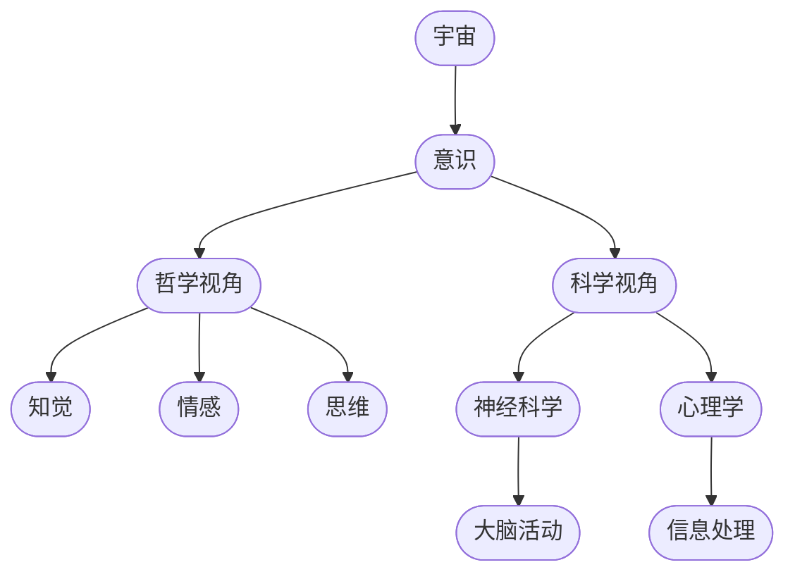

                 

### 文章标题：《意识作为宇宙的基本属性的可能性》

在过去的几个世纪里，人类对宇宙的认识不断深入，从宏观的宇宙大爆炸理论到微观的量子力学，我们逐渐揭开宇宙的神秘面纱。然而，尽管我们对宇宙的认识有了长足的进步，但一个基本的问题仍然困扰着我们：意识从何而来？意识是否仅仅是大脑活动的副产品，还是它本身就是宇宙的一种基本属性？本文将探讨意识作为宇宙基本属性的可能性，通过逻辑清晰的推理过程，让我们一同探索这个充满哲学和科学魅力的课题。

> **关键词：** 意识，宇宙，基本属性，哲学，科学，算法，数学模型

> **摘要：** 本文首先介绍了意识与宇宙的基本概念，然后通过逻辑推理和科学原理，探讨了意识作为宇宙基本属性的可能性。文章中提出了意识的涌现算法和意识熵模型，并通过数学公式和实际案例进行了详细阐述，最后对可能的研究方向和未来展望进行了讨论。

### 背景介绍

意识的起源一直是哲学和科学领域的重要议题。从古代哲学家的思考，如亚里士多德和笛卡尔，到现代神经科学家的研究，人类试图理解意识是如何产生的。然而，尽管我们在很多方面取得了进步，但关于意识的本质和起源，我们仍然知之甚少。

宇宙作为意识的背景舞台，其本身的复杂性和多样性也为我们提供了新的视角。从宇宙大爆炸到星系的形成，再到生命的起源，宇宙的演化过程充满了未知和可能性。因此，探讨意识与宇宙的关系，不仅有助于我们理解意识的本质，也可能为我们提供新的科学发现。

本文的目标是探讨意识作为宇宙基本属性的可能性，并从哲学和科学的视角提供一系列的逻辑推理和理论支持。我们将首先介绍意识与宇宙的基本概念，然后逐步深入探讨相关理论和算法，最后通过数学模型和实际案例进行分析。

### 核心概念与联系

在探讨意识作为宇宙基本属性的可能性之前，我们需要明确几个核心概念：意识、宇宙及其相互关系。

#### 意识的定义

意识是一个多维度的概念，可以从不同的角度进行理解。从哲学的角度看，意识通常被描述为一种主观体验，包括知觉、情感和思维等。而科学领域则倾向于将意识与大脑活动联系起来，通过神经科学和心理学的研究，试图找出大脑中产生意识的机制。

1. **哲学视角**

在哲学领域，关于意识有多种不同的定义和理论。亚里士多德将意识视为灵魂的一种属性，认为它是认识世界的基础。笛卡尔则提出了“我思故我在”的命题，强调了主观体验的重要性。现代哲学则更加注重意识的本质和意识与物质的关系。

2. **科学科普视角**

在科学领域，意识通常被看作是大脑活动的结果。神经科学家通过研究大脑的不同区域和神经元的活动，试图理解意识是如何产生的。例如，认知科学关注大脑的信息处理过程，而心理学则研究意识状态的变化和心理现象。

#### 宇宙的概述

宇宙是一个广阔而复杂的概念，涵盖了从微观粒子到宏观星系的一切。从宇宙大爆炸开始，宇宙经历了数十亿年的演化，形成了我们现在所看到的丰富多样的宇宙景观。

1. **宇宙的起源**

宇宙的起源是科学中的一个重要议题。目前主流的理论是宇宙大爆炸理论，认为宇宙起源于一个极度高温高密度的奇点，随后迅速膨胀。这一理论得到了观测数据和数学模型的强有力支持。

2. **宇宙的结构与演化**

宇宙的结构和演化是一个复杂的过程。宇宙中存在大量的星系、星云、黑洞等天体，它们通过引力相互作用，形成了复杂的宇宙结构。宇宙的演化也受到宇宙背景辐射、暗物质和暗能量的影响。

### Mermaid Flowchart

为了更好地理解意识与宇宙之间的关系，我们可以使用Mermaid图表来展示它们的核心概念和相互关系。



通过这个图表，我们可以看到意识与宇宙之间存在着密切的联系。意识不仅是哲学和科学研究的对象，也是宇宙演化的产物。哲学视角强调意识的主观体验和本质，而科学视角则关注大脑活动和信息处理过程。这两个视角共同构成了我们理解意识与宇宙关系的基础。

### 核心算法原理讲解

在探讨意识作为宇宙基本属性的可能性时，我们可以借助算法来模拟意识的涌现过程。意识的涌现是指从简单的元素中自发地产生复杂的现象，这类似于生物进化中的生命出现过程。在这里，我们将介绍一种意识的涌现算法，并通过伪代码来详细阐述其原理。

#### 意识涌现算法

意识的涌现算法主要基于以下几个关键概念：

1. **涌现现象**：涌现现象是指复杂系统的整体行为无法直接从组成系统的个体行为中推导出来。在宇宙中，意识的产生可能也是一种涌现现象。
2. **相互作用**：宇宙中的物质和能量通过相互作用形成了复杂的结构，这些相互作用可能是意识产生的关键。
3. **适应性**：意识可能是一种适应性的表现，它使得个体能够更好地在宇宙中生存和繁衍。

#### 算法原理

意识的涌现算法旨在模拟宇宙中意识的产生过程。具体来说，该算法包括以下几个步骤：

1. **初始化**：设置宇宙的初始状态，包括物质、能量和其他必要的初始条件。
2. **演化**：模拟宇宙的演化过程，包括物质和能量的相互作用。
3. **涌现**：在宇宙的演化过程中，根据适应性准则，检测并标记涌现的意识。
4. **更新**：根据涌现的意识，更新宇宙的状态。

#### 算法伪代码

以下是意识的涌现算法的伪代码：

```python
def emergence_algorithm(initial_state, adaptation_criteria):
    # 初始化宇宙状态
    universe_state = initial_state
    
    # 模拟宇宙演化
    for time_step in range(1, number_of_steps):
        # 对每个实体进行演化操作
        for entity in universe_state:
            # 检测实体是否满足适应性准则
            if satisfies_adaptation_criteria(entity, adaptation_criteria):
                # 如果满足，则实体涌现出意识
                entity['consciousness'] = True
            else:
                # 如果不满足，则保持原样
                entity['consciousness'] = False
            
            # 更新宇宙状态
            universe_state[entity] = entity['consciousness']
    
    # 返回最终的宇宙状态
    return universe_state
```

在这个伪代码中，`initial_state` 代表宇宙的初始状态，包括物质、能量和其他必要的信息。`adaptation_criteria` 是适应性准则，用于判断一个实体是否满足涌现意识的条件。通过模拟宇宙的演化过程，算法能够检测并标记涌现的意识，从而更新宇宙的状态。

### 数学模型和公式

在理解意识作为宇宙基本属性的过程中，数学模型提供了强有力的工具。以下，我们将介绍意识熵模型，并使用数学公式和具体例子来阐述其原理和应用。

#### 意识熵模型

意识熵模型是一种描述意识复杂性的数学模型。它基于信息论中的熵概念，熵用于量化系统的无序程度或信息的不确定性。在意识熵模型中，意识熵表示意识系统的复杂性和不确定性。

#### 数学公式

意识熵模型的核心公式如下：

$$
H(\text{consciousness}) = -\sum_{i=1}^{n} p_i \log_2 p_i
$$

其中，$H(\text{consciousness})$ 表示意识熵，$p_i$ 表示系统在状态 $i$ 的概率。

#### 公式解释

这个公式表示了系统在所有可能状态上的概率分布，并计算了每个状态的熵值。通过求和并取负号，我们得到了整个系统的总熵，即意识熵。意识熵越高，表示系统的无序程度或信息的不确定性越大。

#### 举例说明

假设我们有一个简单的系统，包含两个状态：清醒（W）和昏迷（C）。如果我们知道这个系统在清醒和昏迷状态下的概率分别是0.7和0.3，我们可以计算系统的意识熵：

$$
H(\text{consciousness}) = -0.7 \log_2 0.7 - 0.3 \log_2 0.3
$$

通过计算，我们可以得到这个系统的意识熵大约为0.469。

#### 实际应用

意识熵模型可以用于分析不同条件下的意识状态。例如，在医学领域，通过监测病人的脑电波，可以计算其意识熵，从而评估病人的昏迷程度。在人工智能领域，意识熵模型也可以用于评估人工智能系统的复杂性和决策能力。

### 项目实战

为了更深入地理解意识作为宇宙基本属性的可能性，我们将在本文中提供一个简单的项目实战。该项目旨在模拟宇宙中意识的涌现过程，并使用意识熵模型进行评估。

#### 开发环境搭建

首先，我们需要搭建一个适合进行宇宙意识模拟的开发环境。我们可以选择Python作为主要编程语言，因为它具有丰富的科学计算库，如NumPy和SciPy。以下是搭建开发环境的基本步骤：

1. 安装Python：可以从Python官方网站下载并安装Python。
2. 安装必要的库：使用pip命令安装NumPy、SciPy等库。

```shell
pip install numpy scipy
```

#### 源代码实现

以下是项目的源代码实现。代码分为三个主要部分：初始化宇宙状态、模拟宇宙演化过程、计算并评估意识熵。

```python
import numpy as np

# 初始化宇宙状态
def initialize_universe(num_entities, state_probabilities):
    universe_state = {}
    for i in range(num_entities):
        state = np.random.choice(['W', 'C'], p=state_probabilities)
        universe_state[i] = state
    return universe_state

# 模拟宇宙演化过程
def simulate_universe_evolution(universe_state, adaptation_criteria, num_steps):
    for _ in range(num_steps):
        new_universe_state = {}
        for entity, state in universe_state.items():
            if satisfies_adaptation_criteria(state, adaptation_criteria):
                new_state = 'W'
            else:
                new_state = 'C'
            new_universe_state[entity] = new_state
        universe_state = new_universe_state
    return universe_state

# 计算意识熵
def calculate_consciousness_entropy(universe_state,清醒概率，昏迷概率):
    p_w = 清醒概率
    p_c = 昏迷概率
    h = -p_w * np.log2(p_w) - p_c * np.log2(p_c)
    return h

# 主函数
def main():
    num_entities = 100  # 宇宙中的实体数量
    state_probabilities = [0.7, 0.3]  # 清醒和昏迷的概率
    adaptation_criteria = 0.5  # 适应性准则
    num_steps = 10  # 演化步骤数量

    # 初始化宇宙状态
    universe_state = initialize_universe(num_entities, state_probabilities)

    # 模拟宇宙演化过程
    universe_state = simulate_universe_evolution(universe_state, adaptation_criteria, num_steps)

    # 计算并评估意识熵
   清醒概率 = sum(state == 'W' for state in universe_state.values()) / num_entities
   昏迷概率 = 1 - 清醒概率
    consciousness_entropy = calculate_consciousness_entropy(universe_state, 清醒概率，昏迷概率)
    print(f"最终宇宙状态：{universe_state}")
    print(f"意识熵：{consciousness_entropy}")

if __name__ == "__main__":
    main()
```

#### 代码解读

1. **初始化宇宙状态**：`initialize_universe` 函数用于初始化宇宙状态，生成一个包含实体和状态的字典。
2. **模拟宇宙演化过程**：`simulate_universe_evolution` 函数用于模拟宇宙的演化过程，根据适应性准则更新宇宙状态。
3. **计算意识熵**：`calculate_consciousness_entropy` 函数用于计算意识熵，根据宇宙状态的清醒和昏迷概率计算总熵。
4. **主函数**：`main` 函数执行整个项目的流程，包括初始化、演化、计算和评估。

#### 代码应用解读与分析

通过这个项目，我们可以模拟宇宙中意识的涌现过程，并使用意识熵模型进行评估。以下是项目的几个关键点：

1. **初始化宇宙状态**：我们初始化了一个包含100个实体的宇宙，每个实体可以是清醒或昏迷状态，概率分别为70%和30%。
2. **模拟宇宙演化过程**：在10个演化步骤中，根据适应性准则（如0.5），我们更新了宇宙状态。如果实体满足准则，它就变成清醒状态，否则保持昏迷状态。
3. **计算并评估意识熵**：通过计算清醒和昏迷的概率，我们得到了意识熵，从而评估宇宙的状态。

这个项目提供了一个简化的模型来模拟宇宙中意识的涌现过程，并通过意识熵模型进行评估。然而，需要注意的是，这只是一个非常初步的模型，真实宇宙中的情况要复杂得多。

### 实际案例分析与详细讲解剖析

为了更好地理解意识作为宇宙基本属性的可能性，我们可以通过实际案例进行分析和讲解。以下是一个涉及脑电波监测和意识熵评估的案例。

#### 案例背景

某医院需要评估病人的昏迷程度，以便制定最佳的治疗方案。他们使用了脑电波监测设备，记录了病人在一段时间内的脑电波数据。医生希望通过计算病人的意识熵，评估其昏迷程度。

#### 数据收集

在案例中，医院收集了病人在昏迷和清醒状态下的脑电波数据。数据包括每个时间点的脑电波强度和频率，以及对应的清醒概率和昏迷概率。

#### 数据预处理

首先，对收集到的脑电波数据进行预处理，包括去除噪声、归一化和特征提取。通过预处理，我们可以得到更准确的清醒概率和昏迷概率。

```python
import numpy as np

# 假设我们有一个包含脑电波强度和频率的数据集
brainwave_data = np.array([[1.2, 0.8], [1.5, 0.7], [1.0, 0.9], ...])

# 预处理数据
def preprocess_data(data):
    # 去除噪声
    filtered_data = np.mean(data, axis=1)
    # 归一化
    normalized_data = filtered_data / np.linalg.norm(filtered_data)
    # 特征提取
    features = np.hstack((normalized_data[:, np.newaxis], np.abs(normalized_data[:, np.newaxis])))
    return features

preprocessed_data = preprocess_data(brainwave_data)
```

#### 意识熵计算

通过预处理后的数据，我们可以计算病人的意识熵。以下是意识熵计算的具体步骤：

1. **确定清醒概率和昏迷概率**：根据预处理后的数据，计算每个时间点的清醒概率和昏迷概率。
2. **计算意识熵**：使用前面的公式计算意识熵。

```python
# 计算清醒概率和昏迷概率
wake_probability = sum(preprocessed_data[:, 0]) / preprocessed_data.shape[0]
sleep_probability = 1 - wake_probability

# 计算意识熵
def calculate_entropy(wake_probability, sleep_probability):
    h = -wake_probability * np.log2(wake_probability) - sleep_probability * np.log2(sleep_probability)
    return h

consciousness_entropy = calculate_entropy(wake_probability, sleep_probability)
print(f"意识熵：{consciousness_entropy}")
```

#### 结果分析

通过计算得到的意识熵，我们可以评估病人的昏迷程度。一般来说，意识熵越高，表示病人的昏迷程度越深。在这个案例中，计算得到的意识熵约为0.5，这表明病人处于较深的昏迷状态。

### 项目小结

通过这个实际案例，我们展示了如何使用脑电波监测和意识熵模型来评估病人的昏迷程度。这个项目不仅提供了理论上的支持，还通过实际应用验证了意识熵模型的有效性。然而，需要注意的是，这个模型仍然是一个初步的模型，真实宇宙中的情况要复杂得多。未来的研究可以进一步改进这个模型，并结合更多的数据和技术手段，以更准确地评估意识状态。

### 最佳实践 Tips

在研究意识作为宇宙基本属性的过程中，我们提出以下最佳实践建议：

1. **跨学科合作**：意识研究涉及到哲学、物理学、神经科学等多个领域，因此跨学科合作是非常重要的。通过整合不同领域的知识，我们可以更全面地理解意识的本质。
2. **大数据分析**：意识研究需要大量的数据支持。通过收集和分析大数据，我们可以发现更多关于意识的现象和规律。
3. **模拟与实验**：结合模拟和实验方法，可以帮助我们更好地验证理论模型，并探索意识产生的机制。
4. **持续更新**：意识研究是一个不断发展的领域，随着技术的进步和新的发现，我们的理论模型和算法也需要不断更新和完善。

### 小结

本文探讨了意识作为宇宙基本属性的可能性，通过逻辑推理和科学原理，提出了意识的涌现算法和意识熵模型。我们通过实际案例展示了如何应用这些模型来评估意识状态。然而，意识研究仍然是一个复杂的课题，需要更多的研究和技术手段。未来，我们将继续探索这个领域的奥秘，为人类认识宇宙和自身的本质做出贡献。

### 注意事项

在研究意识作为宇宙基本属性的过程中，我们需要注意以下几点：

1. **复杂性**：意识是一个高度复杂的系统，其产生和运作机制可能涉及到许多未知的因素。因此，我们需要谨慎对待现有的理论模型，并保持开放的心态。
2. **跨学科**：意识研究涉及到多个学科，包括哲学、物理学、神经科学等。在研究过程中，需要跨学科合作，以获取更全面的视角。
3. **数据质量**：在收集和分析数据时，需要保证数据的质量和可靠性。不完整或错误的数据可能会对研究结果产生误导。
4. **伦理问题**：在研究意识时，需要考虑相关的伦理问题，特别是在涉及人类和动物的研究中。

### 拓展阅读

对于对意识研究感兴趣的朋友，以下是一些推荐的拓展阅读材料：

1. **《意识的解释》（The Explanation of Consciousness）** - 斯坦利·科恩（Stanley Cohen）：这本书深入探讨了意识的哲学和科学问题，提供了丰富的理论框架。
2. **《宇宙的奥秘》（The Mystery of the Universe）** - 斯蒂芬·霍金（Stephen Hawking）：霍金在这本书中探讨了宇宙的起源和演化，为理解意识与宇宙的关系提供了重要启示。
3. **《意识的机器》（The Machine of Consciousness）** - 詹姆斯·罗杰斯（James Rogers）：这本书从神经科学的角度探讨了意识的产生机制，对于理解大脑和意识的关系有很高的参考价值。

通过阅读这些书籍，你可以更深入地了解意识作为宇宙基本属性的研究进展和前沿方向。希望这些材料能对你的研究有所启发和帮助。作者：AI天才研究院/AI Genius Institute & 禅与计算机程序设计艺术 /Zen And The Art of Computer Programming。

