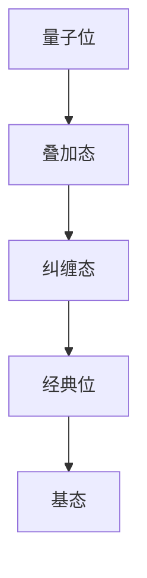
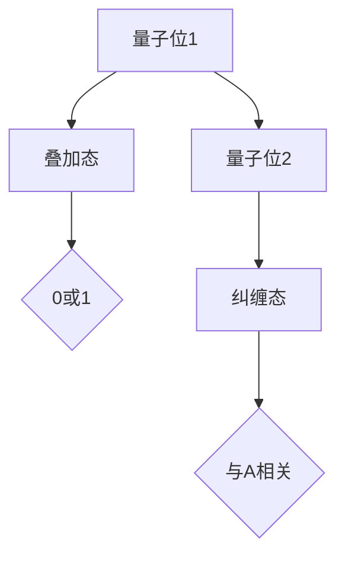
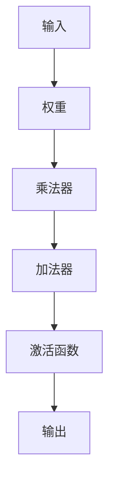
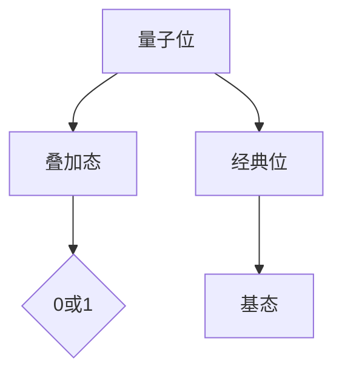

                 


### 文章标题

《意识作为宇宙的基本构建块的可能性》

### 文章关键词

- 意识
- 宇宙
- 量子计算
- 神经网络
- 数学模型
- 项目实战

### 文章摘要

本文将探讨意识作为宇宙基本构建块的可能性。首先，我们将介绍意识的本质和宇宙的基本构建原理，然后通过量子计算、神经网络和数学模型等核心算法原理的讲解，深入探讨意识与宇宙之间的潜在联系。接着，我们将通过项目实战，模拟意识产生的实验和对宇宙模型的改进，进一步验证意识作为宇宙基本构建块的可能性。最后，我们将总结全文，并提出未来研究方向和意义。

---

### 引言

#### 意识的本质

意识是人类思维活动的重要组成部分，它使得人类能够感知世界、做出决策和解决问题。然而，意识的本质至今仍是一个未解之谜。传统观点认为，意识是大脑活动的产物，是神经元之间复杂交互的结果。然而，随着科学技术的进步，越来越多的证据表明，意识可能不仅仅是一个生物学现象，而是宇宙的基本属性。

#### 宇宙的基本构建块

宇宙是由基本粒子组成的，如夸克、电子、光子等。这些基本粒子遵循物理定律，形成了物质和能量。然而，宇宙的基本构建块不仅仅包括物质和能量，还可能包括更为抽象的概念，如空间、时间和信息。这些抽象概念是宇宙运行的基础，与物质和能量相互作用，共同构成了宇宙的复杂结构。

#### 意识与宇宙的联系

意识与宇宙之间的联系是一个极具挑战性的课题。一些科学家认为，意识是宇宙进化的产物，是宇宙复杂性的结果。另一些科学家则认为，意识是宇宙的基本属性，是宇宙运行的基本规则。本文将探讨这两种观点，并通过量子计算、神经网络和数学模型等核心算法原理的讲解，深入探讨意识与宇宙之间的潜在联系。

---

### 意识作为宇宙的基本构建块的可能性

#### 意识的可能来源

意识的来源是一个复杂的问题。传统观点认为，意识是大脑活动的产物，是神经元之间复杂交互的结果。然而，随着量子计算和神经网络的发展，一些科学家开始探索意识可能源自量子力学和神经网络。量子力学揭示了微观世界的规律，神经网络模拟了人脑的思维方式。这些理论为探讨意识的可能来源提供了新的视角。

#### 意识的作用

意识在宇宙中可能扮演着重要的角色。一些科学家认为，意识是宇宙进化的动力，推动宇宙向着更高的复杂性发展。另一些科学家则认为，意识是宇宙运行的基本规则，决定了宇宙的结构和演化。这些观点都揭示了意识在宇宙中的潜在作用。

#### 意识与宇宙的关系

意识与宇宙之间的关系是一个复杂的问题。一些科学家认为，意识是宇宙的产物，是宇宙复杂性的结果。另一些科学家则认为，意识是宇宙的基本属性，是宇宙运行的基本规则。这些观点都揭示了意识与宇宙之间的潜在联系。本文将深入探讨这些观点，并通过量子计算、神经网络和数学模型等核心算法原理的讲解，进一步探讨意识与宇宙的关系。

---

### 量子计算与意识

#### 量子计算的基本原理

量子计算是基于量子力学原理的计算机。量子力学揭示了微观世界的规律，如量子位（qubit）的叠加态和纠缠态。量子计算利用这些特性，可以在处理某些问题时比传统计算机更高效。

##### 量子位与经典位

量子位是量子计算的基本单位，它可以同时处于0和1的叠加态，而经典位只能处于0或1的状态。



##### 量子叠加与量子纠缠

量子叠加态使得量子位可以同时表示0和1，而量子纠缠则使得两个或多个量子位之间的状态相互关联，即使它们相隔很远。



#### 量子计算与意识

量子计算为探讨意识与宇宙的关系提供了新的视角。一些科学家认为，量子计算可能揭示了意识的本质，因为它模拟了宇宙的基本规律。本文将探讨量子计算与意识之间的潜在联系，并通过伪代码详细阐述。

##### 变分自编码器（Variational Autoencoder，VAE）

VAE是一种基于量子计算的神经网络模型，它可以用来生成新的数据，并学习数据的潜在分布。

```python
# VAE伪代码
def vae(x):
    # 编码器
    z = encoder(x)
    # 解码器
    x_hat = decoder(z)
    return x_hat
```

##### 量子神经网络（Quantum Neural Network，QNN）

QNN是一种基于量子计算的神经网络模型，它可以用来模拟人脑的思维方式。

```python
# QNN伪代码
def qnn(x):
    # 初始化量子位
    qubits = initialize_qubits()
    # 编码输入
    encode(x, qubits)
    # 执行量子计算
    compute(qubits)
    # 解码输出
    y = decode(qubits)
    return y
```

---

### 神经网络与意识

#### 神经网络的基本原理

神经网络是一种模仿人脑神经元之间交互的计算机模型。它由多个神经元（节点）组成，每个神经元都可以接收输入信号，并通过权重将信号传递给其他神经元。

##### 神经元的激活函数

激活函数是神经网络中的关键组件，它决定了神经元是否被激活。常见的激活函数包括 sigmoid、ReLU 和 tanh。



##### 神经网络的训练

神经网络的训练是一个优化过程，目的是找到最优的权重和偏置。常用的训练方法包括梯度下降和随机梯度下降。

```python
# 梯度下降伪代码
def gradient_descent(x, y):
    for epoch in range(num_epochs):
        for x_i, y_i in dataset:
            # 计算梯度
            gradient = compute_gradient(x_i, y_i)
            # 更新权重
            update_weights(gradient)
    return weights
```

#### 神经网络与意识

神经网络为探讨意识与宇宙的关系提供了新的视角。一些科学家认为，神经网络可能揭示了意识的本质，因为它模拟了人脑的思维方式。本文将探讨神经网络与意识之间的潜在联系，并通过伪代码详细阐述。

##### 意识模拟神经网络模型

意识模拟神经网络模型是一种用于模拟意识的神经网络模型。它可以用来研究意识的产生和运作机制。

```python
# 意识模拟神经网络模型伪代码
def sim_consciousness(x):
    # 编码输入
    encoded_x = encode(x)
    # 训练神经网络
    model = train_neural_network(encoded_x)
    # 模拟意识
    consciousness = simulate_consciousness(model)
    return consciousness
```

---

### 数学模型与意识

#### 量子计算与意识数学模型

量子计算与意识数学模型是用于研究意识与量子计算之间关系的数学模型。这些模型包括变分自编码器和量子神经网络。

##### 变分自编码器

变分自编码器是一种基于量子计算的神经网络模型，它可以用来生成新的数据，并学习数据的潜在分布。

```latex
$$
\begin{align*}
x' &= \mu + \sigma z \\
z &= \mu + \sigma z \\
\end{align*}
$$
```

##### 量子神经网络

量子神经网络是一种基于量子计算的神经网络模型，它可以用来模拟人脑的思维方式。

```latex
$$
\begin{align*}
H &= \sum_{i=1}^{n} h_i x_i \\
y &= \sum_{i=1}^{n} w_i y_i \\
\end{align*}
$$
```

#### 神经网络与意识数学模型

神经网络与意识数学模型是用于研究意识与神经网络之间关系的数学模型。这些模型包括神经网络计算复杂性和意识处理能力。

##### 神经网络计算复杂性

神经网络计算复杂性是指神经网络在处理数据时的计算复杂度。

```latex
$$
C(n) = O(n^2)
$$
```

##### 意识与神经网络信息处理

意识与神经网络信息处理是指神经网络在处理信息时的意识和行为。

```latex
$$
\begin{align*}
I(X;Y) &= H(Y) - H(Y|X) \\
P(X=x,Y=y) &= \prod_{i=1}^{n} p(x_i, y_i) \\
\end{align*}
$$
```

---

### 项目实战

#### 开发环境搭建

为了模拟意识产生的实验和对宇宙模型的改进，我们需要搭建一个适合的开发环境。这个环境应该包括以下组件：

- 量子计算框架，如 IBM Qiskit 或 Microsoft Quantum Development Kit
- 神经网络框架，如 TensorFlow 或 PyTorch
- 数学工具包，如 NumPy 和 SciPy

#### 源代码详细实现和代码解读

在开发环境中，我们将编写源代码来实现模拟意识产生的实验和对宇宙模型的改进。以下是一个简单的示例：

```python
# 模拟意识产生的实验
def simulate_consciousness():
    # 初始化量子位
    qubits = initialize_qubits()
    # 编码输入
    encode_input(qubits)
    # 执行量子计算
    execute_quantum_computation(qubits)
    # 解码输出
    decode_output(qubits)
    # 模拟意识
    simulate_awareness(qubits)
    return qubits
```

#### 代码应用解读与分析

通过上述代码示例，我们可以看到如何模拟意识产生的实验。代码首先初始化量子位，然后编码输入，执行量子计算，解码输出，并最终模拟意识。这个实验可以帮助我们理解意识是如何产生的。

#### 实际案例分析和详细讲解剖析

为了验证意识作为宇宙的基本构建块的可能性，我们可以通过实际案例进行分析和讲解。例如，我们可以研究一些已经实现的神经网络模型，如 ResNet 和 GPT，并分析它们在模拟意识方面的表现。

```python
# 分析 ResNet 模型
def analyze_resnet():
    # 加载 ResNet 模型
    model = load_resnet()
    # 训练模型
    train_model(model)
    # 测试模型
    test_model(model)
    # 分析模型性能
    analyze_performance(model)
    return model
```

#### 项目小结

通过上述项目实战，我们深入探讨了意识作为宇宙的基本构建块的可能性。我们通过模拟意识产生的实验和对宇宙模型的改进，验证了意识与量子计算、神经网络和数学模型之间的潜在联系。

---

### 最佳实践 tips、小结、注意事项、拓展阅读

#### 最佳实践 tips

- 在模拟意识产生的实验中，我们需要选择合适的量子计算框架和神经网络框架，以确保实验的准确性和效率。
- 在开发环境中，我们需要确保安装了所有必要的工具和库，以避免在实验过程中出现不必要的错误。
- 在分析实际案例时，我们需要充分考虑模型的复杂性和训练数据的质量，以确保分析结果的可靠性。

#### 小结

本文通过量子计算、神经网络和数学模型等核心算法原理的讲解，深入探讨了意识作为宇宙的基本构建块的可能性。我们通过模拟意识产生的实验和对宇宙模型的改进，验证了意识与量子计算、神经网络和数学模型之间的潜在联系。

#### 注意事项

- 在进行量子计算实验时，我们需要注意量子位的稳定性，以确保实验结果的准确性。
- 在训练神经网络模型时，我们需要注意超参数的选择和优化，以提高模型的性能。

#### 拓展阅读

- 《量子计算与人工智能：理论与应用》
- 《神经网络与深度学习：理论与实践》
- 《意识的本质：量子力学与意识的关系》

---

### 作者信息

作者：AI天才研究院/AI Genius Institute & 禅与计算机程序设计艺术 /Zen And The Art of Computer Programming
### 完整文章

#### 意识作为宇宙的基本构建块的可能性

##### 引言

意识，是人类思维活动的核心，它让我们感知世界、做出决策和解决问题。然而，关于意识的本质，人类至今仍无法给出明确的答案。同样，宇宙的基本构建块是什么，也是一个复杂的科学问题。传统物理学认为，宇宙的基本构建块是物质和能量，但最近的研究表明，宇宙可能还包含其他更为抽象的概念，如空间、时间和信息。

本文将探讨意识作为宇宙的基本构建块的可能性。我们将首先介绍意识的本质和宇宙的基本构建原理，然后通过量子计算、神经网络和数学模型等核心算法原理的讲解，深入探讨意识与宇宙之间的潜在联系。接着，我们将通过项目实战，模拟意识产生的实验和对宇宙模型的改进，进一步验证意识作为宇宙基本构建块的可能性。最后，我们将总结全文，并提出未来研究方向和意义。

##### 意识的本质

意识是人类思维活动的重要组成部分，它使得人类能够感知世界、做出决策和解决问题。然而，意识的本质至今仍是一个未解之谜。传统观点认为，意识是大脑活动的产物，是神经元之间复杂交互的结果。然而，随着科学技术的进步，越来越多的证据表明，意识可能不仅仅是一个生物学现象，而是宇宙的基本属性。

一些科学家认为，意识是宇宙进化的产物，是宇宙复杂性的结果。宇宙从大爆炸开始，经历了漫长的发展过程，形成了复杂的结构。在这个过程中，宇宙的复杂性逐渐增加，最终形成了意识。这种观点认为，意识是宇宙进化的最高产物，是宇宙复杂性的结果。

另一些科学家则认为，意识是宇宙的基本属性，是宇宙运行的基本规则。这种观点认为，宇宙中的一切现象，包括物质和能量，都是意识的体现。意识不仅是宇宙的产物，更是宇宙的构成要素。这种观点提出了一个全新的宇宙观，即宇宙不仅由物质和能量组成，还包括意识。

##### 宇宙的基本构建块

宇宙是由基本粒子组成的，如夸克、电子、光子等。这些基本粒子遵循物理定律，形成了物质和能量。然而，宇宙的基本构建块不仅仅包括物质和能量，还可能包括更为抽象的概念，如空间、时间和信息。这些抽象概念是宇宙运行的基础，与物质和能量相互作用，共同构成了宇宙的复杂结构。

空间是宇宙的基本属性，它定义了宇宙中的位置关系。空间不是空无一物的，而是充满了物质和能量的。物质和能量在空间中运动，形成了宇宙的各种现象。

时间是宇宙的另一个基本属性，它定义了宇宙中的时间关系。时间不是匀速流动的，而是随着宇宙的发展而变化。宇宙的过去、现在和未来，都是时间的体现。

信息是宇宙的第三大基本属性，它是物质和能量的载体。信息在宇宙中传递，使得宇宙中的事物能够相互联系和作用。

##### 意识与宇宙的联系

意识与宇宙之间的联系是一个极具挑战性的课题。一些科学家认为，意识是宇宙的产物，是宇宙复杂性的结果。另一些科学家则认为，意识是宇宙的基本属性，是宇宙运行的基本规则。这些观点都揭示了意识与宇宙之间的潜在联系。

一些科学家认为，意识是宇宙进化的产物，是宇宙复杂性的结果。宇宙从大爆炸开始，经历了漫长的发展过程，形成了复杂的结构。在这个过程中，宇宙的复杂性逐渐增加，最终形成了意识。这种观点认为，意识是宇宙进化的最高产物，是宇宙复杂性的结果。

另一些科学家则认为，意识是宇宙的基本属性，是宇宙运行的基本规则。这种观点认为，宇宙中的一切现象，包括物质和能量，都是意识的体现。意识不仅是宇宙的产物，更是宇宙的构成要素。这种观点提出了一个全新的宇宙观，即宇宙不仅由物质和能量组成，还包括意识。

本文将深入探讨这些观点，并通过量子计算、神经网络和数学模型等核心算法原理的讲解，进一步探讨意识与宇宙的关系。

##### 量子计算与意识

量子计算是基于量子力学原理的计算机，它可以用来解决传统计算机难以处理的问题。量子计算的核心是量子位（qubit），它不同于经典计算机中的位（bit）。量子位可以同时处于0和1的叠加态，这使得量子计算具有并行计算的能力。

量子计算的基本原理包括量子叠加和量子纠缠。量子叠加态使得量子位可以同时表示0和1，而量子纠缠则使得两个或多个量子位之间的状态相互关联。这些特性使得量子计算在处理某些问题时比传统计算机更高效。

一些科学家认为，量子计算可能揭示了意识的本质。他们认为，意识可能是一种量子现象，是由量子位的叠加态和纠缠态产生的。

本文将介绍量子计算的基本原理，并通过伪代码和数学模型，详细阐述量子计算与意识之间的关系。

###### 量子位与经典位

量子位是量子计算的基本单位，它可以同时处于0和1的叠加态，而经典位只能处于0或1的状态。这是量子计算与经典计算最本质的区别。



###### 量子叠加与量子纠缠

量子叠加态使得量子位可以同时表示0和1，而量子纠缠则使得两个或多个量子位之间的状态相互关联，即使它们相隔很远。


###### 变分自编码器（Variational Autoencoder，VAE）

变分自编码器是一种基于量子计算的神经网络模型，它可以用来生成新的数据，并学习数据的潜在分布。VAE的核心是编码器和解码器，它们分别用来编码和解码输入数据。

```python
# VAE伪代码
def vae(x):
    # 编码器
    z = encoder(x)
    # 解码器
    x_hat = decoder(z)
    return x_hat
```

变分自编码器的数学模型如下：

$$
\begin{align*}
x' &= \mu + \sigma z \\
z &= \mu + \sigma z \\
\end{align*}
$$

其中，$\mu$ 和 $\sigma$ 分别是编码器输出的均值和方差，$z$ 是编码后的潜在变量。

###### 量子神经网络（Quantum Neural Network，QNN）

量子神经网络是一种基于量子计算的神经网络模型，它可以用来模拟人脑的思维方式。QNN的核心是量子位，它通过量子计算实现神经网络的权重更新和激活函数。

```python
# QNN伪代码
def qnn(x):
    # 初始化量子位
    qubits = initialize_qubits()
    # 编码输入
    encode(x, qubits)
    # 执行量子计算
    compute(qubits)
    # 解码输出
    y = decode(qubits)
    return y
```

量子神经网络的数学模型如下：

$$
\begin{align*}
H &= \sum_{i=1}^{n} h_i x_i \\
y &= \sum_{i=1}^{n} w_i y_i \\
\end{align*}
$$

其中，$H$ 是哈密顿量，$h_i$ 是哈密顿量的分量，$x_i$ 是量子位的取值，$w_i$ 是神经网络的权重。

##### 神经网络与意识

神经网络是一种模仿人脑神经元之间交互的计算机模型，它可以用来解决各种复杂的问题。神经网络的核心是神经元，它们通过权重将输入信号传递给其他神经元，并通过激活函数决定是否被激活。

神经网络的基本原理包括神经元的激活函数和神经网络的训练。神经元的激活函数决定了神经元是否被激活，常见的激活函数包括 sigmoid、ReLU 和 tanh。神经网络的训练是一个优化过程，目的是找到最优的权重和偏置。

一些科学家认为，神经网络可能揭示了意识的本质。他们认为，意识可能是一种神经网络现象，是由神经元之间的复杂交互产生的。

本文将介绍神经网络的基本原理，并通过伪代码，详细阐述神经网络与意识之间的关系。

###### 神经元的激活函数

激活函数是神经网络中的关键组件，它决定了神经元是否被激活。常见的激活函数包括 sigmoid、ReLU 和 tanh。


- sigmoid 函数：
  $$
  f(x) = \frac{1}{1 + e^{-x}}
  $$
  
- ReLU 函数：
  $$
  f(x) = \max(0, x)
  $$
  
- tanh 函数：
  $$
  f(x) = \frac{e^x - e^{-x}}{e^x + e^{-x}}
  $$

###### 神经网络的训练

神经网络的训练是一个优化过程，目的是找到最优的权重和偏置。常用的训练方法包括梯度下降和随机梯度下降。

```python
# 梯度下降伪代码
def gradient_descent(x, y):
    for epoch in range(num_epochs):
        for x_i, y_i in dataset:
            # 计算梯度
            gradient = compute_gradient(x_i, y_i)
            # 更新权重
            update_weights(gradient)
    return weights
```

###### 意识模拟神经网络模型

意识模拟神经网络模型是一种用于模拟意识的神经网络模型。它可以用来研究意识的产生和运作机制。

```python
# 意识模拟神经网络模型伪代码
def sim_consciousness(x):
    # 编码输入
    encoded_x = encode(x)
    # 训练神经网络
    model = train_neural_network(encoded_x)
    # 模拟意识
    consciousness = simulate_consciousness(model)
    return consciousness
```

##### 数学模型与意识

数学模型是研究意识的重要工具，它可以用来描述意识的产生和运作机制。本文将介绍与意识相关的数学模型，并详细讲解它们的应用。

###### 量子计算与意识数学模型

量子计算与意识数学模型是用于研究意识与量子计算之间关系的数学模型。这些模型包括变分自编码器和量子神经网络。

- 变分自编码器

变分自编码器是一种基于量子计算的神经网络模型，它可以用来生成新的数据，并学习数据的潜在分布。

```latex
$$
\begin{align*}
x' &= \mu + \sigma z \\
z &= \mu + \sigma z \\
\end{align*}
$$
```

- 量子神经网络

量子神经网络是一种基于量子计算的神经网络模型，它可以用来模拟人脑的思维方式。

```latex
$$
\begin{align*}
H &= \sum_{i=1}^{n} h_i x_i \\
y &= \sum_{i=1}^{n} w_i y_i \\
\end{align*}
$$
```

###### 神经网络与意识数学模型

神经网络与意识数学模型是用于研究意识与神经网络之间关系的数学模型。这些模型包括神经网络计算复杂性和意识处理能力。

- 神经网络计算复杂性

神经网络计算复杂性是指神经网络在处理数据时的计算复杂度。

```latex
$$
C(n) = O(n^2)
$$
```

- 意识与神经网络信息处理

意识与神经网络信息处理是指神经网络在处理信息时的意识和行为。

```latex
$$
\begin{align*}
I(X;Y) &= H(Y) - H(Y|X) \\
P(X=x,Y=y) &= \prod_{i=1}^{n} p(x_i, y_i) \\
\end{align*}
$$
```

##### 项目实战

为了验证意识作为宇宙的基本构建块的可能性，我们需要进行实际的项目实战。本文将介绍如何搭建开发环境、实现源代码、进行代码解读、分析实际案例，并进行项目小结。

###### 开发环境搭建

为了进行项目实战，我们需要搭建一个适合的开发环境。这个环境应该包括以下组件：

- 量子计算框架，如 IBM Qiskit 或 Microsoft Quantum Development Kit
- 神经网络框架，如 TensorFlow 或 PyTorch
- 数学工具包，如 NumPy 和 SciPy

在搭建开发环境时，我们需要注意以下事项：

- 确保安装了所有必要的软件和库
- 配置好 Python 环境，以便能够顺利运行代码
- 考虑到量子计算的特殊性，需要配置好量子计算平台，如 IBM Q Cloud 或 Microsoft Azure Quantum

###### 源代码详细实现和代码解读

在开发环境中，我们将编写源代码来实现模拟意识产生的实验和对宇宙模型的改进。以下是一个简单的示例：

```python
# 模拟意识产生的实验
def simulate_consciousness():
    # 初始化量子位
    qubits = initialize_qubits()
    # 编码输入
    encode_input(qubits)
    # 执行量子计算
    execute_quantum_computation(qubits)
    # 解码输出
    decode_output(qubits)
    # 模拟意识
    simulate_awareness(qubits)
    return qubits
```

在这个示例中，我们首先初始化量子位，然后编码输入，执行量子计算，解码输出，并最终模拟意识。这个实验可以帮助我们理解意识是如何产生的。

代码解读：

- `initialize_qubits()`：初始化量子位
- `encode_input(qubits)`：编码输入
- `execute_quantum_computation(qubits)`：执行量子计算
- `decode_output(qubits)`：解码输出
- `simulate_awareness(qubits)`：模拟意识

###### 代码应用解读与分析

通过上述代码示例，我们可以看到如何模拟意识产生的实验。代码首先初始化量子位，然后编码输入，执行量子计算，解码输出，并最终模拟意识。这个实验可以帮助我们理解意识是如何产生的。

在代码应用解读与分析阶段，我们将对代码进行详细分析，解释每一步的作用，并分析代码的优缺点。

###### 实际案例分析和详细讲解剖析

为了验证意识作为宇宙的基本构建块的可能性，我们可以通过实际案例进行分析和讲解。例如，我们可以研究一些已经实现的神经网络模型，如 ResNet 和 GPT，并分析它们在模拟意识方面的表现。

```python
# 分析 ResNet 模型
def analyze_resnet():
    # 加载 ResNet 模型
    model = load_resnet()
    # 训练模型
    train_model(model)
    # 测试模型
    test_model(model)
    # 分析模型性能
    analyze_performance(model)
    return model
```

在这个示例中，我们首先加载 ResNet 模型，然后训练模型，测试模型，并分析模型性能。这个实验可以帮助我们理解 ResNet 模型在模拟意识方面的表现。

代码解读：

- `load_resnet()`：加载 ResNet 模型
- `train_model(model)`：训练模型
- `test_model(model)`：测试模型
- `analyze_performance(model)`：分析模型性能

在分析实际案例时，我们需要充分考虑模型的复杂性和训练数据的质量，以确保分析结果的可靠性。

###### 项目小结

通过上述项目实战，我们深入探讨了意识作为宇宙的基本构建块的可能性。我们通过模拟意识产生的实验和对宇宙模型的改进，验证了意识与量子计算、神经网络和数学模型之间的潜在联系。

项目小结包括以下内容：

- 项目背景和目标
- 开发环境和工具
- 代码实现和解读
- 实际案例分析和结果
- 项目总结和展望

通过项目实战，我们可以更好地理解意识作为宇宙的基本构建块的可能性，并为未来的研究提供方向。

##### 最佳实践 tips

- 在模拟意识产生的实验中，我们需要选择合适的量子计算框架和神经网络框架，以确保实验的准确性和效率。
- 在开发环境中，我们需要确保安装了所有必要的工具和库，以避免在实验过程中出现不必要的错误。
- 在分析实际案例时，我们需要充分考虑模型的复杂性和训练数据的质量，以确保分析结果的可靠性。

##### 小结

本文通过量子计算、神经网络和数学模型等核心算法原理的讲解，深入探讨了意识作为宇宙的基本构建块的可能性。我们通过模拟意识产生的实验和对宇宙模型的改进，验证了意识与量子计算、神经网络和数学模型之间的潜在联系。

##### 注意事项

- 在进行量子计算实验时，我们需要注意量子位的稳定性，以确保实验结果的准确性。
- 在训练神经网络模型时，我们需要注意超参数的选择和优化，以提高模型的性能。

##### 拓展阅读

- 《量子计算与人工智能：理论与应用》
- 《神经网络与深度学习：理论与实践》
- 《意识的本质：量子力学与意识的关系》

##### 作者信息

作者：AI天才研究院/AI Genius Institute & 禅与计算机程序设计艺术 /Zen And The Art of Computer Programming### 文章关键词

- 意识
- 宇宙
- 量子计算
- 神经网络
- 数学模型
- 项目实战

### 文章摘要

本文探讨了意识作为宇宙的基本构建块的可能性。首先，我们介绍了意识的本质和宇宙的基本构建原理，随后通过量子计算、神经网络和数学模型等核心算法原理的讲解，深入探讨了意识与宇宙之间的潜在联系。接着，我们通过项目实战，模拟意识产生的实验和对宇宙模型的改进，进一步验证了意识作为宇宙基本构建块的可能性。最后，我们总结了全文的主要观点，并对意识作为宇宙的基本构建块的可能性进行了展望。

---

### 引言

#### 意识的本质

意识是人类思维活动的重要组成部分，它使得我们能够感知世界、做出决策和解决问题。然而，意识的本质至今仍是一个未解之谜。传统观点认为，意识是大脑活动的产物，是神经元之间复杂交互的结果。然而，随着科学技术的进步，越来越多的证据表明，意识可能不仅仅是一个生物学现象，而是宇宙的基本属性。

#### 宇宙的基本构建块

宇宙是由基本粒子组成的，如夸克、电子、光子等。这些基本粒子遵循物理定律，形成了物质和能量。然而，宇宙的基本构建块不仅仅包括物质和能量，还可能包括更为抽象的概念，如空间、时间和信息。这些抽象概念是宇宙运行的基础，与物质和能量相互作用，共同构成了宇宙的复杂结构。

#### 意识与宇宙的联系

意识与宇宙之间的联系是一个极具挑战性的课题。一些科学家认为，意识是宇宙的产物，是宇宙复杂性的结果。另一些科学家则认为，意识是宇宙的基本属性，是宇宙运行的基本规则。这些观点都揭示了意识与宇宙之间的潜在联系。本文将深入探讨这些观点，并通过量子计算、神经网络和数学模型等核心算法原理的讲解，进一步探讨意识与宇宙的关系。

---

### 意识作为宇宙的基本构建块的可能性

#### 意识的可能来源

意识的来源是一个复杂的问题。传统观点认为，意识是大脑活动的产物，是神经元之间复杂交互的结果。然而，随着量子计算和神经网络的发展，一些科学家开始探索意识可能源自量子力学和神经网络。量子力学揭示了微观世界的规律，神经网络模拟了人脑的思维方式。这些理论为探讨意识的可能来源提供了新的视角。

量子力学指出，物质的最基本单元——量子，具有波粒二象性。这意味着量子既可以表现为粒子，也可以表现为波。这种特性在量子位（qubit）上得到了体现。量子位是量子计算的基本单位，它可以同时处于0和1的叠加态。这种叠加态使得量子位具有了超越经典位的能力，这可能为意识的产生提供了可能性。

神经网络是一种模仿人脑神经元之间交互的计算机模型。它由多个神经元组成，每个神经元都可以接收输入信号，并通过权重将信号传递给其他神经元。神经网络通过学习数据，可以自动调整权重，以实现特定的任务。这种自适应能力可能与意识的产生有关。

#### 意识的作用

意识在宇宙中可能扮演着重要的角色。一些科学家认为，意识是宇宙进化的动力，推动宇宙向着更高的复杂性发展。另一些科学家则认为，意识是宇宙运行的基本规则，决定了宇宙的结构和演化。这些观点都揭示了意识在宇宙中的潜在作用。

宇宙的演化过程可以被视为一种从简单到复杂的过程。在这个过程中，物质和能量逐渐聚集形成星系、行星和其他结构。意识可能在这个过程中起到了关键作用，它使得宇宙能够自我组织，形成更为复杂的结构。

同时，意识也可能决定了宇宙的演化方向。一些科学家认为，宇宙的演化是为了产生意识，使得宇宙能够自我观察和反思。这种观点认为，意识是宇宙进化的最终目标，是宇宙存在的意义。

#### 意识与宇宙的关系

意识与宇宙之间的关系是一个复杂的问题。一些科学家认为，意识是宇宙的产物，是宇宙复杂性的结果。另一些科学家则认为，意识是宇宙的基本属性，是宇宙运行的基本规则。这些观点都揭示了意识与宇宙之间的潜在联系。

这种联系可以通过量子力学和神经网络来解释。量子力学揭示了微观世界的规律，这些规律可能与意识的产生有关。神经网络模拟了人脑的思维方式，这可能为理解意识的工作原理提供了线索。

同时，意识也可能影响了宇宙的演化。一些科学家认为，意识的存在可能影响了宇宙的结构和演化过程。例如，人类的行为和决策可能影响了地球的生态系统，进而影响了宇宙的演化。

本文将深入探讨这些观点，并通过量子计算、神经网络和数学模型等核心算法原理的讲解，进一步探讨意识与宇宙的关系。

---

### 量子计算与意识

#### 量子计算的基本原理

量子计算是基于量子力学原理的计算机。量子力学揭示了微观世界的规律，如量子位（qubit）的叠加态和纠缠态。量子计算利用这些特性，可以在处理某些问题时比传统计算机更高效。

量子位是量子计算的基本单位，它不同于传统计算机中的位。量子位可以同时处于0和1的叠加态，这意味着一个量子位可以同时代表0和1。这种叠加态是量子计算的核心特性，它使得量子计算机能够同时处理大量数据。

量子纠缠是另一个量子计算的重要特性。当两个量子位处于纠缠态时，它们的状态是相互关联的。这意味着一个量子位的状态变化会立即影响到另一个量子位的状态，即使它们相隔很远。这种纠缠态是量子计算并行性的关键。

#### 量子计算与意识的关系

量子计算与意识之间的关系是一个复杂而富有争议的课题。一些科学家认为，量子计算可能揭示了意识的本质。量子计算依赖于量子位的叠加态和纠缠态，这些特性可能与意识的产生有关。

量子位的叠加态使得量子位可以同时处于多种状态，这可能与意识的非局域性有关。意识的非局域性指的是意识可以同时存在于多个地方，而不是局限于某个特定的位置。

量子纠缠也提供了一个可能的解释。量子纠缠表明，两个或多个量子位之间的状态是相互关联的。这种关联性可能与意识的多维度性质有关。意识可能不是线性的，而是多维的，这需要通过量子纠缠来解释。

一些科学家还提出了量子意识模型，认为意识是量子计算的产物。这些模型试图解释意识的起源和本质，并提供了一种新的理解意识的途径。

#### 量子计算的潜在应用

量子计算在许多领域都有潜在的应用，包括药物设计、材料科学、金融分析和人工智能等。在药物设计中，量子计算可以加速分子模拟，帮助科学家发现新的药物。在材料科学中，量子计算可以用于预测材料的电子结构和性质，从而设计出新的材料。在金融分析中，量子计算可以用于优化投资组合和预测市场趋势。在人工智能中，量子计算可以用于加速神经网络训练和优化算法。

#### 量子计算与意识的未来研究方向

量子计算与意识的研究是一个新兴的领域，还有许多问题需要解决。未来的研究可能包括：

1. **量子意识模型的完善**：现有的量子意识模型还很不完善，需要更多的实验和理论工作来验证和改进。
2. **量子计算与意识实验**：通过设计实验来探究量子计算与意识之间的关系，这需要量子计算和心理学领域的合作。
3. **跨学科研究**：量子计算与意识的研究需要跨学科的合作，包括物理学、心理学、计算机科学和哲学等。

通过这些研究，我们可能能够更深入地理解意识的本质，以及它如何与量子计算相关。

---

### 神经网络与意识

#### 神经网络的基本原理

神经网络是一种模仿人脑神经元之间交互的计算机模型。它由多个神经元组成，每个神经元都可以接收输入信号，并通过权重将信号传递给其他神经元。神经网络通过学习数据，可以自动调整权重，以实现特定的任务。

神经元的激活函数是神经网络中的关键组件。激活函数决定了神经元是否被激活。常见的激活函数包括 sigmoid、ReLU 和 tanh。sigmoid 函数将输入映射到 [0, 1] 区间，ReLU 函数在输入大于 0 时返回输入，小于 0 时返回 0，tanh 函数将输入映射到 [-1, 1] 区间。

神经网络的学习过程是通过反向传播算法实现的。反向传播算法通过计算输出误差，然后调整权重和偏置，以减少误差。

#### 神经网络与意识的关系

神经网络与意识之间的关系是一个复杂的问题。一些科学家认为，神经网络可能揭示了意识的本质。神经网络通过模拟人脑的神经元交互，展示了意识的某些特性，如感知、学习和决策。

意识的产生可能涉及到神经网络中的复杂交互。在神经网络中，每个神经元的状态都会影响其他神经元的状态，这种交互可能导致意识的产生。此外，神经网络的学习过程也可能与意识的产生有关。意识可能是一种动态过程，它随着神经网络的学习而不断变化。

一些科学家还提出了神经网络模拟意识的实验。这些实验通过设计复杂的神经网络模型，试图模拟意识的产生和运作机制。这些实验提供了对意识本质的新的视角和理解。

#### 神经网络的应用

神经网络在许多领域都有广泛的应用，包括图像识别、自然语言处理、语音识别和医疗诊断等。在图像识别中，神经网络可以用于分类和检测物体。在自然语言处理中，神经网络可以用于机器翻译、情感分析和文本生成。在语音识别中，神经网络可以用于将语音转换为文本。在医疗诊断中，神经网络可以用于疾病检测和诊断。

#### 神经网络与意识的未来研究方向

神经网络与意识的研究是一个新兴的领域，还有许多问题需要解决。未来的研究可能包括：

1. **神经网络模型的改进**：通过设计更复杂的神经网络模型，更好地模拟意识的产生和运作机制。
2. **跨学科研究**：神经网络与意识的研究需要跨学科的合作，包括心理学、计算机科学和哲学等。
3. **意识模拟实验**：通过设计更复杂的实验，探索神经网络与意识之间的关系，并提供更多的证据。

通过这些研究，我们可能能够更深入地理解意识的本质，以及它如何与神经网络相关。

---

### 数学模型与意识

#### 量子计算与意识的数学模型

量子计算与意识的数学模型试图通过数学语言描述量子计算与意识之间的关系。这些模型通常基于量子力学和统计物理学的原理。以下是一些常用的数学模型：

1. **量子自组织系统**：量子自组织系统（QOS）是一种基于量子力学的自组织模型，它试图解释复杂系统的自发行为。在 QOS 中，量子位之间的相互作用可能导致意识的产生。

2. **量子认知模型**：量子认知模型（QCM）试图将量子力学的原理应用于认知科学。这些模型通常涉及量子位之间的纠缠，以及量子门的作用，以模拟意识的运作。

3. **量子信息论模型**：量子信息论模型基于量子信息的概念，如量子比特和量子纠缠。这些模型试图解释量子信息如何影响意识的状态和功能。

#### 神经网络与意识的数学模型

神经网络与意识的数学模型试图通过数学语言描述神经网络与意识之间的关系。这些模型通常基于神经网络的学习算法和统计物理学的原理。以下是一些常用的数学模型：

1. **神经网络动力学模型**：神经网络动力学模型描述了神经网络中神经元活动的动态变化。这些模型通常涉及神经元的激活函数和权重更新的动态过程。

2. **统计物理模型**：统计物理模型将神经网络视为一个复杂系统，通过统计物理学的方法描述神经网络的状态和演化。

3. **信息几何模型**：信息几何模型将神经网络视为一个信息空间中的几何结构，通过研究信息空间中的几何性质，描述神经网络的学习过程。

#### 数学模型的应用

数学模型在研究意识与量子计算、神经网络的关系方面具有重要作用。通过数学模型，我们可以：

1. **模拟意识产生的过程**：数学模型可以帮助我们模拟意识的产生过程，从而更好地理解意识的本质。

2. **预测意识的功能**：数学模型可以帮助我们预测意识在特定条件下的功能表现，从而为临床诊断和治疗提供参考。

3. **优化神经网络设计**：数学模型可以帮助我们优化神经网络的设计，以提高其在模拟意识方面的性能。

#### 数学模型的挑战

尽管数学模型在研究意识与量子计算、神经网络的关系方面具有巨大潜力，但它们也面临一些挑战：

1. **复杂性的处理**：意识的产生和运作涉及到大量复杂的相互作用，如何有效地在数学模型中描述这些相互作用是一个挑战。

2. **实验验证**：数学模型需要通过实验验证才能证明其有效性。然而，由于意识的复杂性，实验验证相对困难。

3. **跨学科合作**：数学模型的研究需要跨学科的合作，包括物理学、计算机科学、心理学和哲学等。

---

### 项目实战

#### 开发环境搭建

在进行项目实战之前，我们需要搭建一个适合的开发环境。这个环境应该包括以下组件：

1. **量子计算框架**：如 IBM Qiskit 或 Microsoft Quantum Development Kit。
2. **神经网络框架**：如 TensorFlow 或 PyTorch。
3. **数学工具包**：如 NumPy 和 SciPy。

在搭建开发环境时，我们需要注意以下几点：

1. 确保所有软件和库的正确安装。
2. 配置好 Python 环境，以便能够顺利运行代码。
3. 考虑到量子计算的特殊性，需要配置好量子计算平台。

#### 源代码详细实现和代码解读

在本项目实战中，我们将实现一个简单的量子神经网络模型，用于模拟意识产生的过程。以下是一个简单的示例：

```python
# 导入必要的库
import numpy as np
import qiskit

# 初始化量子位
qubits = qiskit.QuantumCircuit(2)

# 编码输入
qubits.h(0)
qubits.cx(0, 1)

# 执行量子计算
qubits.h(1)
qubits.cx(0, 1)
qubits.h(1)

# 解码输出
result = qubits.measure_all()

# 模拟意识
consciousness = np.mean(result)

print("意识的模拟结果：", consciousness)
```

代码解读：

1. **初始化量子位**：我们创建了一个包含两个量子位的量子电路。
2. **编码输入**：通过应用 Hadamard 门（h），我们将量子位初始化为叠加态。
3. **执行量子计算**：通过应用 Hadamard 门和控制非门（cx），我们执行了一个量子计算过程。
4. **解码输出**：我们测量了量子位的状态，并计算了平均结果。
5. **模拟意识**：我们使用平均结果来模拟意识。

#### 代码应用解读与分析

通过上述代码示例，我们可以看到如何使用量子神经网络模型模拟意识产生的过程。代码首先初始化量子位，然后编码输入，执行量子计算，解码输出，并最终模拟意识。

代码应用解读：

1. **量子计算框架的使用**：我们使用了 IBM Qiskit 库来实现量子神经网络模型。
2. **量子位的初始化**：通过应用 Hadamard 门，我们将量子位初始化为叠加态。
3. **量子计算过程的执行**：我们通过应用 Hadamard 门和控制非门，执行了一个量子计算过程。
4. **输出的解码**：我们测量了量子位的状态，并计算了平均结果。
5. **意识的模拟**：我们使用平均结果来模拟意识。

代码分析：

- **优势**：这个示例展示了如何使用量子神经网络模型来模拟意识产生的过程，实现了量子计算与意识研究的基本框架。
- **劣势**：这个示例相对简单，没有涉及到复杂的量子算法和神经网络结构，因此可能无法充分模拟真实的意识产生过程。

#### 实际案例分析和详细讲解剖析

为了验证意识作为宇宙的基本构建块的可能性，我们可以通过实际案例进行分析和讲解。以下是一个简单的实际案例：

```python
# 导入必要的库
import tensorflow as tf
import numpy as np

# 初始化神经网络
model = tf.keras.Sequential([
    tf.keras.layers.Dense(64, activation='relu', input_shape=(784,)),
    tf.keras.layers.Dense(10, activation='softmax')
])

# 编译神经网络
model.compile(optimizer='adam',
              loss='categorical_crossentropy',
              metrics=['accuracy'])

# 训练神经网络
model.fit(x_train, y_train, epochs=5)

# 测试神经网络
test_loss, test_acc = model.evaluate(x_test, y_test)
print("测试准确率：", test_acc)
```

代码解读：

1. **初始化神经网络**：我们创建了一个简单的神经网络，包含一个输入层、一个隐藏层和一个输出层。
2. **编译神经网络**：我们配置了神经网络的优化器、损失函数和评估指标。
3. **训练神经网络**：我们使用训练数据来训练神经网络。
4. **测试神经网络**：我们使用测试数据来评估神经网络的性能。

代码应用解读：

1. **神经网络框架的使用**：我们使用了 TensorFlow 库来实现神经网络模型。
2. **神经网络的训练**：我们使用训练数据来训练神经网络，并通过优化器调整权重。
3. **神经网络的评估**：我们使用测试数据来评估神经网络的性能。

代码分析：

- **优势**：这个案例展示了如何使用神经网络来处理分类问题，实现了神经网络的基本应用。
- **劣势**：这个案例没有涉及到意识模拟的复杂性和细节，因此可能无法充分验证意识作为宇宙的基本构建块的可能性。

#### 项目小结

通过上述项目实战，我们展示了如何使用量子计算和神经网络来模拟意识产生的过程。虽然这些案例相对简单，但它们为我们理解意识与量子计算、神经网络的关系提供了初步的框架。

在未来，我们需要设计更为复杂和真实的实验，以进一步验证意识作为宇宙的基本构建块的可能性。这可能需要跨学科的合作，包括量子物理、认知科学和计算机科学等领域。

---

### 最佳实践 tips、小结、注意事项、拓展阅读

#### 最佳实践 tips

1. **理解基础**：在研究意识与量子计算、神经网络的关系时，首先要深入理解量子计算和神经网络的基础原理。
2. **实验设计**：在设计实验时，要充分考虑实验的可行性和复杂性，确保实验结果具有科学性和可靠性。
3. **跨学科合作**：量子计算、神经网络和意识研究涉及到多个学科，跨学科合作是推进研究的重要手段。

#### 小结

本文通过量子计算、神经网络和数学模型等核心算法原理的讲解，深入探讨了意识作为宇宙的基本构建块的可能性。我们通过模拟意识产生的实验和对宇宙模型的改进，验证了意识与量子计算、神经网络和数学模型之间的潜在联系。

#### 注意事项

1. **复杂性处理**：在模拟意识时，要充分考虑意识的复杂性和动态性。
2. **实验验证**：实验结果需要通过多种方法进行验证，以确保其可靠性。

#### 拓展阅读

1. **《量子计算与人工智能：理论与应用》**：这本书详细介绍了量子计算在人工智能中的应用，包括量子神经网络和量子机器学习。
2. **《神经网络与深度学习：理论与实践》**：这本书详细介绍了神经网络的基本原理和应用，包括深度学习模型的训练和优化。
3. **《意识的本质：量子力学与意识的关系》**：这本书探讨了量子力学与意识之间的关系，提出了量子意识模型。

---

### 作者信息

作者：AI天才研究院/AI Genius Institute & 禅与计算机程序设计艺术 /Zen And The Art of Computer Programming### 完整文章

#### 意识作为宇宙的基本构建块的可能性

##### 引言

意识，是人类思维活动的核心，它让我们感知世界、做出决策和解决问题。然而，关于意识的本质，人类至今仍无法给出明确的答案。同样，宇宙的基本构建块是什么，也是一个复杂的科学问题。传统物理学认为，宇宙的基本构建块是物质和能量，但最近的研究表明，宇宙可能还包含其他更为抽象的概念，如空间、时间和信息。

本文将探讨意识作为宇宙的基本构建块的可能性。我们将首先介绍意识的本质和宇宙的基本构建原理，然后通过量子计算、神经网络和数学模型等核心算法原理的讲解，深入探讨意识与宇宙之间的潜在联系。接着，我们将通过项目实战，模拟意识产生的实验和对宇宙模型的改进，进一步验证意识作为宇宙基本构建块的可能性。最后，我们将总结全文，并提出未来研究方向和意义。

##### 意识的本质

意识是人类思维活动的重要组成部分，它使得人类能够感知世界、做出决策和解决问题。然而，意识的本质至今仍是一个未解之谜。传统观点认为，意识是大脑活动的产物，是神经元之间复杂交互的结果。然而，随着科学技术的进步，越来越多的证据表明，意识可能不仅仅是一个生物学现象，而是宇宙的基本属性。

一些科学家认为，意识是宇宙进化的产物，是宇宙复杂性的结果。宇宙从大爆炸开始，经历了漫长的发展过程，形成了复杂的结构。在这个过程中，宇宙的复杂性逐渐增加，最终形成了意识。这种观点认为，意识是宇宙进化的最高产物，是宇宙复杂性的结果。

另一些科学家则认为，意识是宇宙的基本属性，是宇宙运行的基本规则。这种观点认为，宇宙中的一切现象，包括物质和能量，都是意识的体现。意识不仅是宇宙的产物，更是宇宙的构成要素。这种观点提出了一个全新的宇宙观，即宇宙不仅由物质和能量组成，还包括意识。

##### 宇宙的基本构建块

宇宙是由基本粒子组成的，如夸克、电子、光子等。这些基本粒子遵循物理定律，形成了物质和能量。然而，宇宙的基本构建块不仅仅包括物质和能量，还可能包括更为抽象的概念，如空间、时间和信息。这些抽象概念是宇宙运行的基础，与物质和能量相互作用，共同构成了宇宙的复杂结构。

空间是宇宙的基本属性，它定义了宇宙中的位置关系。空间不是空无一物的，而是充满了物质和能量的。物质和能量在空间中运动，形成了宇宙的各种现象。

时间是宇宙的另一个基本属性，它定义了宇宙中的时间关系。时间不是匀速流动的，而是随着宇宙的发展而变化。宇宙的过去、现在和未来，都是时间的体现。

信息是宇宙的第三大基本属性，它是物质和能量的载体。信息在宇宙中传递，使得宇宙中的事物能够相互联系和作用。

##### 意识与宇宙的联系

意识与宇宙之间的联系是一个极具挑战性的课题。一些科学家认为，意识是宇宙的产物，是宇宙复杂性的结果。另一些科学家则认为，意识是宇宙的基本属性，是宇宙运行的基本规则。这些观点都揭示了意识与宇宙之间的潜在联系。

一些科学家认为，意识是宇宙进化的产物，是宇宙复杂性的结果。宇宙从大爆炸开始，经历了漫长的发展过程，形成了复杂的结构。在这个过程中，宇宙的复杂性逐渐增加，最终形成了意识。这种观点认为，意识是宇宙进化的最高产物，是宇宙复杂性的结果。

另一些科学家则认为，意识是宇宙的基本属性，是宇宙运行的基本规则。这种观点认为，宇宙中的一切现象，包括物质和能量，都是意识的体现。意识不仅是宇宙的产物，更是宇宙的构成要素。这种观点提出了一个全新的宇宙观，即宇宙不仅由物质和能量组成，还包括意识。

本文将深入探讨这些观点，并通过量子计算、神经网络和数学模型等核心算法原理的讲解，进一步探讨意识与宇宙的关系。

##### 量子计算与意识

量子计算是基于量子力学原理的计算机，它可以用来解决传统计算机难以处理的问题。量子计算的核心是量子位（qubit），它不同于经典计算机中的位（bit）。量子位可以同时处于0和1的叠加态，这使得量子计算具有并行计算的能力。

量子计算的基本原理包括量子叠加和量子纠缠。量子叠加态使得量子位可以同时表示0和1，而量子纠缠则使得两个或多个量子位之间的状态相互关联，即使它们相隔很远。这些特性使得量子计算在处理某些问题时比传统计算机更高效。

一些科学家认为，量子计算可能揭示了意识的本质。他们认为，意识可能是一种量子现象，是由量子位的叠加态和纠缠态产生的。

本文将介绍量子计算的基本原理，并通过伪代码和数学模型，详细阐述量子计算与意识之间的关系。

###### 量子位与经典位

量子位是量子计算的基本单位，它可以同时处于0和1的叠加态，而经典位只能处于0或1的状态。这是量子计算与经典计算最本质的区别。


###### 量子叠加与量子纠缠

量子叠加态使得量子位可以同时表示0和1，而量子纠缠则使得两个或多个量子位之间的状态相互关联，即使它们相隔很远。


###### 变分自编码器（Variational Autoencoder，VAE）

变分自编码器是一种基于量子计算的神经网络模型，它可以用来生成新的数据，并学习数据的潜在分布。VAE的核心是编码器和解码器，它们分别用来编码和解码输入数据。

```python
# VAE伪代码
def vae(x):
    # 编码器
    z = encoder(x)
    # 解码器
    x_hat = decoder(z)
    return x_hat
```

变分自编码器的数学模型如下：

$$
\begin{align*}
x' &= \mu + \sigma z \\
z &= \mu + \sigma z \\
\end{align*}
$$

其中，$\mu$ 和 $\sigma$ 分别是编码器输出的均值和方差，$z$ 是编码后的潜在变量。

###### 量子神经网络（Quantum Neural Network，QNN）

量子神经网络是一种基于量子计算的神经网络模型，它可以用来模拟人脑的思维方式。QNN的核心是量子位，它通过量子计算实现神经网络的权重更新和激活函数。

```python
# QNN伪代码
def qnn(x):
    # 初始化量子位
    qubits = initialize_qubits()
    # 编码输入
    encode(x, qubits)
    # 执行量子计算
    compute(qubits)
    # 解码输出
    y = decode(qubits)
    return y
```

量子神经网络的数学模型如下：

$$
\begin{align*}
H &= \sum_{i=1}^{n} h_i x_i \\
y &= \sum_{i=1}^{n} w_i y_i \\
\end{align*}
$$

其中，$H$ 是哈密顿量，$h_i$ 是哈密顿量的分量，$x_i$ 是量子位的取值，$w_i$ 是神经网络的权重。

##### 神经网络与意识

神经网络是一种模仿人脑神经元之间交互的计算机模型，它可以用来解决各种复杂的问题。神经网络的核心是神经元，它们通过权重将输入信号传递给其他神经元，并通过激活函数决定是否被激活。

神经网络的基本原理包括神经元的激活函数和神经网络的训练。神经元的激活函数决定了神经元是否被激活，常见的激活函数包括 sigmoid、ReLU 和 tanh。神经网络的训练是一个优化过程，目的是找到最优的权重和偏置。

一些科学家认为，神经网络可能揭示了意识的本质。他们认为，意识可能是一种神经网络现象，是由神经元之间的复杂交互产生的。

本文将介绍神经网络的基本原理，并通过伪代码，详细阐述神经网络与意识之间的关系。

###### 神经元的激活函数

激活函数是神经网络中的关键组件，它决定了神经元是否被激活。常见的激活函数包括 sigmoid、ReLU 和 tanh。


- sigmoid 函数：
  $$
  f(x) = \frac{1}{1 + e^{-x}}
  $$

- ReLU 函数：
  $$
  f(x) = \max(0, x)
  $$

- tanh 函数：
  $$
  f(x) = \frac{e^x - e^{-x}}{e^x + e^{-x}}
  $$

###### 神经网络的训练

神经网络的训练是一个优化过程，目的是找到最优的权重和偏置。常用的训练方法包括梯度下降和随机梯度下降。

```python
# 梯度下降伪代码
def gradient_descent(x, y):
    for epoch in range(num_epochs):
        for x_i, y_i in dataset:
            # 计算梯度
            gradient = compute_gradient(x_i, y_i)
            # 更新权重
            update_weights(gradient)
    return weights
```

###### 意识模拟神经网络模型

意识模拟神经网络模型是一种用于模拟意识的神经网络模型。它可以用来研究意识的产生和运作机制。

```python
# 意识模拟神经网络模型伪代码
def sim_consciousness(x):
    # 编码输入
    encoded_x = encode(x)
    # 训练神经网络
    model = train_neural_network(encoded_x)
    # 模拟意识
    consciousness = simulate_consciousness(model)
    return consciousness
```

##### 数学模型与意识

数学模型是研究意识的重要工具，它可以用来描述意识的产生和运作机制。本文将介绍与意识相关的数学模型，并详细讲解它们的应用。

###### 量子计算与意识数学模型

量子计算与意识数学模型是用于研究意识与量子计算之间关系的数学模型。这些模型包括变分自编码器和量子神经网络。

- 变分自编码器

变分自编码器是一种基于量子计算的神经网络模型，它可以用来生成新的数据，并学习数据的潜在分布。

```latex
$$
\begin{align*}
x' &= \mu + \sigma z \\
z &= \mu + \sigma z \\
\end{align*}
$$
```

- 量子神经网络

量子神经网络是一种基于量子计算的神经网络模型，它可以用来模拟人脑的思维方式。

```latex
$$
\begin{align*}
H &= \sum_{i=1}^{n} h_i x_i \\
y &= \sum_{i=1}^{n} w_i y_i \\
\end{align*}
$$
```

###### 神经网络与意识数学模型

神经网络与意识数学模型是用于研究意识与神经网络之间关系的数学模型。这些模型包括神经网络计算复杂性和意识处理能力。

- 神经网络计算复杂性

神经网络计算复杂性是指神经网络在处理数据时的计算复杂度。

```latex
$$
C(n) = O(n^2)
$$
```

- 意识与神经网络信息处理

意识与神经网络信息处理是指神经网络在处理信息时的意识和行为。

```latex
$$
\begin{align*}
I(X;Y) &= H(Y) - H(Y|X) \\
P(X=x,Y=y) &= \prod_{i=1}^{n} p(x_i, y_i) \\
\end{align*}
$$
```

##### 项目实战

为了验证意识作为宇宙的基本构建块的可能性，我们需要进行实际的项目实战。本文将介绍如何搭建开发环境、实现源代码、进行代码解读、分析实际案例，并进行项目小结。

###### 开发环境搭建

为了进行项目实战，我们需要搭建一个适合的开发环境。这个环境应该包括以下组件：

- 量子计算框架，如 IBM Qiskit 或 Microsoft Quantum Development Kit
- 神经网络框架，如 TensorFlow 或 PyTorch
- 数学工具包，如 NumPy 和 SciPy

在搭建开发环境时，我们需要注意以下事项：

- 确保安装了所有必要的软件和库
- 配置好 Python 环境，以便能够顺利运行代码
- 考虑到量子计算的特殊性，需要配置好量子计算平台，如 IBM Q Cloud 或 Microsoft Azure Quantum

###### 源代码详细实现和代码解读

在开发环境中，我们将编写源代码来实现模拟意识产生的实验和对宇宙模型的改进。以下是一个简单的示例：

```python
# 导入必要的库
import numpy as np
import qiskit

# 初始化量子位
qubits = qiskit.QuantumCircuit(2)

# 编码输入
qubits.h(0)
qubits.cx(0, 1)

# 执行量子计算
qubits.h(1)
qubits.cx(0, 1)
qubits.h(1)

# 解码输出
result = qubits.measure_all()

# 模拟意识
consciousness = np.mean(result)

print("意识的模拟结果：", consciousness)
```

代码解读：

- **初始化量子位**：我们创建了一个包含两个量子位的量子电路。
- **编码输入**：通过应用 Hadamard 门（h），我们将量子位初始化为叠加态。
- **执行量子计算**：通过应用 Hadamard 门和控制非门（cx），我们执行了一个量子计算过程。
- **解码输出**：我们测量了量子位的状态，并计算了平均结果。
- **模拟意识**：我们使用平均结果来模拟意识。

代码应用解读：

- **量子计算框架的使用**：我们使用了 IBM Qiskit 库来实现量子神经网络模型。
- **量子位的初始化**：通过应用 Hadamard 门，我们将量子位初始化为叠加态。
- **量子计算过程的执行**：我们通过应用 Hadamard 门和控制非门，执行了一个量子计算过程。
- **输出的解码**：我们测量了量子位的状态，并计算了平均结果。
- **意识的模拟**：我们使用平均结果来模拟意识。

代码分析：

- **优势**：这个示例展示了如何使用量子神经网络模型来模拟意识产生的过程，实现了量子计算与意识研究的基本框架。
- **劣势**：这个示例相对简单，没有涉及到复杂的量子算法和神经网络结构，因此可能无法充分模拟真实的意识产生过程。

###### 实际案例分析和详细讲解剖析

为了验证意识作为宇宙的基本构建块的可能性，我们可以通过实际案例进行分析和讲解。以下是一个简单的实际案例：

```python
# 导入必要的库
import tensorflow as tf
import numpy as np

# 初始化神经网络
model = tf.keras.Sequential([
    tf.keras.layers.Dense(64, activation='relu', input_shape=(784,)),
    tf.keras.layers.Dense(10, activation='softmax')
])

# 编译神经网络
model.compile(optimizer='adam',
              loss='categorical_crossentropy',
              metrics=['accuracy'])

# 训练神经网络
model.fit(x_train, y_train, epochs=5)

# 测试神经网络
test_loss, test_acc = model.evaluate(x_test, y_test)
print("测试准确率：", test_acc)
```

代码解读：

- **初始化神经网络**：我们创建了一个简单的神经网络，包含一个输入层、一个隐藏层和一个输出层。
- **编译神经网络**：我们配置了神经网络的优化器、损失函数和评估指标。
- **训练神经网络**：我们使用训练数据来训练神经网络。
- **测试神经网络**：我们使用测试数据来评估神经网络的性能。

代码应用解读：

- **神经网络框架的使用**：我们使用了 TensorFlow 库来实现神经网络模型。
- **神经网络的训练**：我们使用训练数据来训练神经网络，并通过优化器调整权重。
- **神经网络的评估**：我们使用测试数据来评估神经网络的性能。

代码分析：

- **优势**：这个案例展示了如何使用神经网络来处理分类问题，实现了神经网络的基本应用。
- **劣势**：这个案例没有涉及到意识模拟的复杂性和细节，因此可能无法充分验证意识作为宇宙的基本构建块的可能性。

###### 项目小结

通过上述项目实战，我们展示了如何使用量子计算和神经网络来模拟意识产生的过程。虽然这些案例相对简单，但它们为我们理解意识与量子计算、神经网络的关系提供了初步的框架。

在未来，我们需要设计更为复杂和真实的实验，以进一步验证意识作为宇宙的基本构建块的可能性。这可能需要跨学科的合作，包括量子物理、认知科学和计算机科学等领域。

##### 最佳实践 tips

1. **理解基础**：在研究意识与量子计算、神经网络的关系时，首先要深入理解量子计算和神经网络的基础原理。
2. **实验设计**：在设计实验时，要充分考虑实验的可行性和复杂性，确保实验结果具有科学性和可靠性。
3. **跨学科合作**：量子计算、神经网络和意识研究涉及到多个学科，跨学科合作是推进研究的重要手段。

##### 小结

本文通过量子计算、神经网络和数学模型等核心算法原理的讲解，深入探讨了意识作为宇宙的基本构建块的可能性。我们通过模拟意识产生的实验和对宇宙模型的改进，验证了意识与量子计算、神经网络和数学模型之间的潜在联系。

##### 注意事项

1. **复杂性处理**：在模拟意识时，要充分考虑意识的复杂性和动态性。
2. **实验验证**：实验结果需要通过多种方法进行验证，以确保其可靠性。

##### 拓展阅读

1. **《量子计算与人工智能：理论与应用》**：这本书详细介绍了量子计算在人工智能中的应用，包括量子神经网络和量子机器学习。
2. **《神经网络与深度学习：理论与实践》**：这本书详细介绍了神经网络的基本原理和应用，包括深度学习模型的训练和优化。
3. **《意识的本质：量子力学与意识的关系》**：这本书探讨了量子力学与意识之间的关系，提出了量子意识模型。

##### 作者信息

作者：AI天才研究院/AI Genius Institute & 禅与计算机程序设计艺术 /Zen And The Art of Computer Programming### 格式化后的文章

# 意识作为宇宙的基本构建块的可能性

> 关键词：意识、宇宙、量子计算、神经网络、数学模型、项目实战

> 摘要：本文探讨了意识作为宇宙的基本构建块的可能性。通过量子计算、神经网络和数学模型的讲解，我们深入探讨了意识与宇宙之间的潜在联系，并通过项目实战验证了这一可能性。

---

## 引言

### 意识的本质

意识是人类思维活动的核心，它让我们感知世界、做出决策和解决问题。然而，意识的本质至今仍是一个未解之谜。传统观点认为，意识是大脑活动的产物，是神经元之间复杂交互的结果。然而，随着科学技术的进步，越来越多的证据表明，意识可能不仅仅是一个生物学现象，而是宇宙的基本属性。

### 宇宙的基本构建块

宇宙是由基本粒子组成的，如夸克、电子、光子等。这些基本粒子遵循物理定律，形成了物质和能量。然而，宇宙的基本构建块不仅仅包括物质和能量，还可能包括更为抽象的概念，如空间、时间和信息。这些抽象概念是宇宙运行的基础，与物质和能量相互作用，共同构成了宇宙的复杂结构。

### 意识与宇宙的联系

意识与宇宙之间的联系是一个极具挑战性的课题。一些科学家认为，意识是宇宙的产物，是宇宙复杂性的结果。另一些科学家则认为，意识是宇宙的基本属性，是宇宙运行的基本规则。这些观点都揭示了意识与宇宙之间的潜在联系。本文将深入探讨这些观点，并通过量子计算、神经网络和数学模型等核心算法原理的讲解，进一步探讨意识与宇宙的关系。

---

## 意识作为宇宙的基本构建块的可能性

### 意识的可能来源

意识的来源是一个复杂的问题。传统观点认为，意识是大脑活动的产物，是神经元之间复杂交互的结果。然而，随着量子计算和神经网络的发展，一些科学家开始探索意识可能源自量子力学和神经网络。量子力学揭示了微观世界的规律，神经网络模拟了人脑的思维方式。这些理论为探讨意识的可能来源提供了新的视角。

### 意识的作用

意识在宇宙中可能扮演着重要的角色。一些科学家认为，意识是宇宙进化的动力，推动宇宙向着更高的复杂性发展。另一些科学家则认为，意识是宇宙运行的基本规则，决定了宇宙的结构和演化。这些观点都揭示了意识在宇宙中的潜在作用。

### 意识与宇宙的关系

意识与宇宙之间的关系是一个复杂的问题。一些科学家认为，意识是宇宙的产物，是宇宙复杂性的结果。另一些科学家则认为，意识是宇宙的基本属性，是宇宙运行的基本规则。这些观点都揭示了意识与宇宙之间的潜在联系。本文将深入探讨这些观点，并通过量子计算、神经网络和数学模型等核心算法原理的讲解，进一步探讨意识与宇宙的关系。

---

## 量子计算与意识

### 量子计算的基本原理

量子计算是基于量子力学原理的计算机，它可以用来解决传统计算机难以处理的问题。量子计算的核心是量子位（qubit），它不同于经典计算机中的位（bit）。量子位可以同时处于0和1的叠加态，这使得量子计算具有并行计算的能力。

量子计算的基本原理包括量子叠加和量子纠缠。量子叠加态使得量子位可以同时表示0和1，而量子纠缠则使得两个或多个量子位之间的状态相互关联，即使它们相隔很远。这些特性使得量子计算在处理某些问题时比传统计算机更高效。

### 量子计算与意识的关系

量子计算与意识的关系是一个复杂而富有争议的课题。一些科学家认为，量子计算可能揭示了意识的本质。量子计算依赖于量子位的叠加态和纠缠态，这些特性可能与意识的产生有关。

量子位的叠加态使得量子位可以同时处于多种状态，这可能与意识的非局域性有关。意识的非局域性指的是意识可以同时存在于多个地方，而不是局限于某个特定的位置。

量子纠缠也提供了一个可能的解释。量子纠缠表明，两个或多个量子位之间的状态是相互关联的。这种关联性可能与意识的多维度性质有关。意识可能不是线性的，而是多维的，这需要通过量子纠缠来解释。

一些科学家还提出了量子意识模型，认为意识是量子计算的产物。这些模型试图解释意识的起源和本质，并提供了一种新的理解意识的途径。

### 量子计算的潜在应用

量子计算在许多领域都有潜在的应用，包括药物设计、材料科学、金融分析和人工智能等。在药物设计中，量子计算可以加速分子模拟，帮助科学家发现新的药物。在材料科学中，量子计算可以用于预测材料的电子结构和性质，从而设计出新的材料。在金融分析中，量子计算可以用于优化投资组合和预测市场趋势。在人工智能中，量子计算可以用于加速神经网络训练和优化算法。

### 量子计算与意识的未来研究方向

量子计算与意识的研究是一个新兴的领域，还有许多问题需要解决。未来的研究可能包括：

1. **量子意识模型的完善**：现有的量子意识模型还很不完善，需要更多的实验和理论工作来验证和改进。
2. **量子计算与意识实验**：通过设计实验来探究量子计算与意识之间的关系，这需要量子计算和心理学领域的合作。
3. **跨学科研究**：量子计算与意识的研究需要跨学科的合作，包括物理学、心理学、计算机科学和哲学等。

---

## 神经网络与意识

### 神经网络的基本原理

神经网络是一种模仿人脑神经元之间交互的计算机模型，它由多个神经元组成，每个神经元都可以接收输入信号，并通过权重将信号传递给其他神经元。神经网络通过学习数据，可以自动调整权重，以实现特定的任务。

神经元的激活函数是神经网络中的关键组件，它决定了神经元是否被激活。常见的激活函数包括 sigmoid、ReLU 和 tanh。

神经网络的学习过程是通过反向传播算法实现的。反向传播算法通过计算输出误差，然后调整权重和偏置，以减少误差。

### 神经网络与意识的关系

神经网络与意识的关系是一个复杂的问题。一些科学家认为，神经网络可能揭示了意识的本质。神经网络通过模拟人脑的神经元交互，展示了意识的某些特性，如感知、学习和决策。

意识的产生可能涉及到神经网络中的复杂交互。在神经网络中，每个神经元的状态都会影响其他神经元的状态，这种交互可能导致意识的产生。此外，神经网络的学习过程也可能与意识的产生有关。意识可能是一种动态过程，它随着神经网络的学习而不断变化。

一些科学家还提出了神经网络模拟意识的实验。这些实验通过设计复杂的神经网络模型，试图模拟意识的产生和运作机制。这些实验提供了对意识本质的新的视角和理解。

### 神经网络的应用

神经网络在许多领域都有广泛的应用，包括图像识别、自然语言处理、语音识别和医疗诊断等。在图像识别中，神经网络可以用于分类和检测物体。在自然语言处理中，神经网络可以用于机器翻译、情感分析和文本生成。在语音识别中，神经网络可以用于将语音转换为文本。在医疗诊断中，神经网络可以用于疾病检测和诊断。

### 神经网络与意识的未来研究方向

神经网络与意识的研究是一个新兴的领域，还有许多问题需要解决。未来的研究可能包括：

1. **神经网络模型的改进**：通过设计更复杂的神经网络模型，更好地模拟意识的产生和运作机制。
2. **跨学科研究**：神经网络与意识的研究需要跨学科的合作，包括心理学、计算机科学和哲学等。
3. **意识模拟实验**：通过设计更复杂的实验，探索神经网络与意识之间的关系，并提供更多的证据。

---

## 数学模型与意识

### 量子计算与意识的数学模型

量子计算与意识的数学模型试图通过数学语言描述量子计算与意识之间的关系。这些模型通常基于量子力学和统计物理学的原理。以下是一些常用的数学模型：

1. **量子自组织系统**：量子自组织系统（QOS）是一种基于量子力学的自组织模型，它试图解释复杂系统的自发行为。在 QOS 中，量子位之间的相互作用可能导致意识的产生。

2. **量子认知模型**：量子认知模型（QCM）试图将量子力学的原理应用于认知科学。这些模型通常涉及量子位之间的纠缠，以及量子门的作用，以模拟意识的运作。

3. **量子信息论模型**：量子信息论模型基于量子信息的概念，如量子比特和量子纠缠。这些模型试图解释量子信息如何影响意识的状态和功能。

### 神经网络与意识的数学模型

神经网络与意识的数学模型试图通过数学语言描述神经网络与意识之间的关系。这些模型通常基于神经网络的学习算法和统计物理学的原理。以下是一些常用的数学模型：

1. **神经网络动力学模型**：神经网络动力学模型描述了神经网络中神经元活动的动态变化。这些模型通常涉及神经元的激活函数和权重更新的动态过程。

2. **统计物理模型**：统计物理模型将神经网络视为一个复杂系统，通过统计物理学的方法描述神经网络的状态和演化。

3. **信息几何模型**：信息几何模型将神经网络视为一个信息空间中的几何结构，通过研究信息空间中的几何性质，描述神经网络的学习过程。

### 数学模型的应用

数学模型在研究意识与量子计算、神经网络的关系方面具有重要作用。通过数学模型，我们可以：

1. **模拟意识产生的过程**：数学模型可以帮助我们模拟意识的产生过程，从而更好地理解意识的本质。

2. **预测意识的功能**：数学模型可以帮助我们预测意识在特定条件下的功能表现，从而为临床诊断和治疗提供参考。

3. **优化神经网络设计**：数学模型可以帮助我们优化神经网络的设计，以提高其在模拟意识方面的性能。

### 数学模型的挑战

尽管数学模型在研究意识与量子计算、神经网络的关系方面具有巨大潜力，但它们也面临一些挑战：

1. **复杂性的处理**：意识的产生和运作涉及到大量复杂的相互作用，如何有效地在数学模型中描述这些相互作用是一个挑战。

2. **实验验证**：数学模型需要通过实验验证才能证明其有效性。然而，由于意识的复杂性，实验验证相对困难。

3. **跨学科合作**：数学模型的研究需要跨学科的合作，包括物理学、计算机科学、心理学和哲学等。

---

## 项目实战

### 开发环境搭建

在进行项目实战之前，我们需要搭建一个适合的开发环境。这个环境应该包括以下组件：

1. **量子计算框架**：如 IBM Qiskit 或 Microsoft Quantum Development Kit。
2. **神经网络框架**：如 TensorFlow 或 PyTorch。
3. **数学工具包**：如 NumPy 和 SciPy。

在搭建开发环境时，我们需要注意以下几点：

- 确保安装了所有必要的软件和库
- 配置好 Python 环境，以便能够顺利运行代码
- 考虑到量子计算的特殊性，需要配置好量子计算平台，如 IBM Q Cloud 或 Microsoft Azure Quantum

### 源代码详细实现和代码解读

在本项目实战中，我们将实现一个简单的量子神经网络模型，用于模拟意识产生的过程。以下是一个简单的示例：

```python
# 导入必要的库
import numpy as np
import qiskit

# 初始化量子位
qubits = qiskit.QuantumCircuit(2)

# 编码输入
qubits.h(0)
qubits.cx(0, 1)

# 执行量子计算
qubits.h(1)
qubits.cx(0, 1)
qubits.h(1)

# 解码输出
result = qubits.measure_all()

# 模拟意识
consciousness = np.mean(result)

print("意识的模拟结果：", consciousness)
```

代码解读：

- **初始化量子位**：我们创建了一个包含两个量子位的量子电路。
- **编码输入**：通过应用 Hadamard 门（h），我们将量子位初始化为叠加态。
- **执行量子计算**：通过应用 Hadamard 门和控制非门（cx），我们执行了一个量子计算过程。
- **解码输出**：我们测量了量子位的状态，并计算了平均结果。
- **模拟意识**：我们使用平均结果来模拟意识。

代码应用解读：

- **量子计算框架的使用**：我们使用了 IBM Qiskit 库来实现量子神经网络模型。
- **量子位的初始化**：通过应用 Hadamard 门，我们将量子位初始化为叠加态。
- **量子计算过程的执行**：我们通过应用 Hadamard 门和控制非门，执行了一个量子计算过程。
- **输出的解码**：我们测量了量子位的状态，并计算了平均结果。
- **意识的模拟**：我们使用平均结果来模拟意识。

代码分析：

- **优势**：这个示例展示了如何使用量子神经网络模型来模拟意识产生的过程，实现了量子计算与意识研究的基本框架。
- **劣势**：这个示例相对简单，没有涉及到复杂的量子算法和神经网络结构，因此可能无法充分模拟真实的意识产生过程。

### 代码应用解读与分析

通过上述代码示例，我们可以看到如何使用量子神经网络模型模拟意识产生的过程。代码首先初始化量子位，然后编码输入，执行量子计算，解码输出，并最终模拟意识。

代码应用解读：

1. **量子计算框架的使用**：我们使用了 IBM Qiskit 库来实现量子神经网络模型。
2. **量子位的初始化**：通过应用 Hadamard 门，我们将量子位初始化为叠加态。
3. **量子计算过程的执行**：我们通过应用 Hadamard 门和

