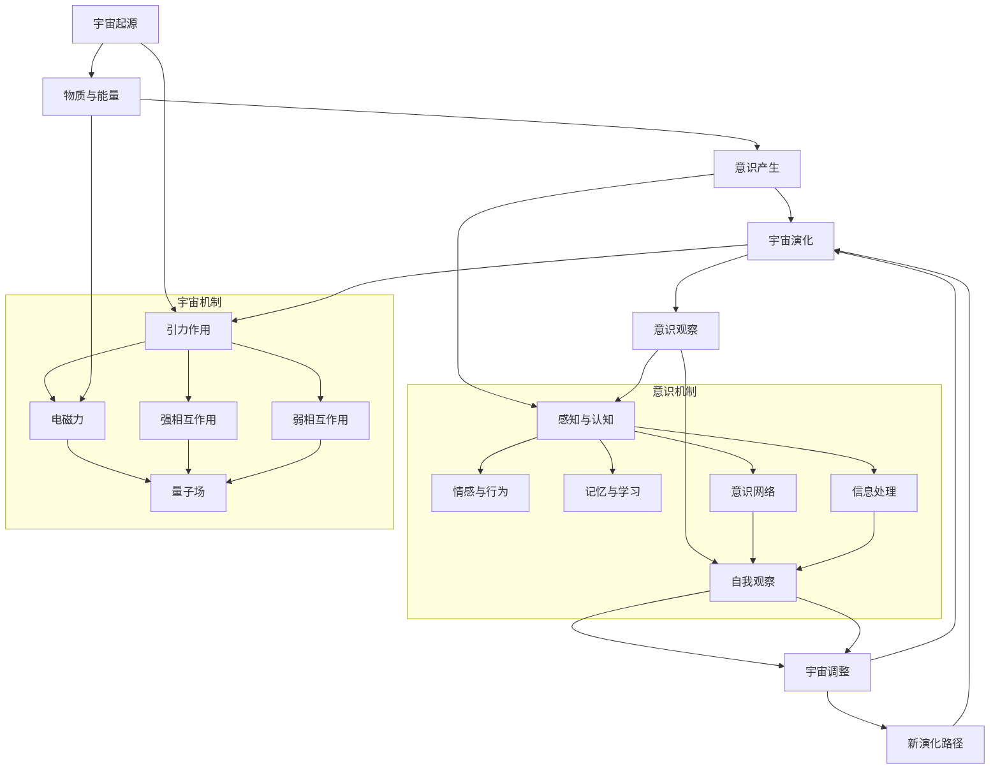

                 

## 第一部分：宇宙与意识的本质

### 第1章：宇宙的起源与演化

宇宙，这个浩瀚无垠的宇宙，自古以来就是人类探索和研究的重要领域。宇宙的起源和演化问题，不仅关系到我们对宇宙的认知，更是人类对自身和世界理解的重要基石。从古代的宇宙观到现代的宇宙学理论，人类一直在不懈地探索宇宙的奥秘。

#### 1.1 宇宙的起源理论

宇宙的起源，首先涉及到大爆炸理论。大爆炸理论认为，宇宙起源于一个极高温度和密度状态，随后迅速膨胀，形成了今天我们所观察到的宇宙。这一理论得到了诸多观测事实的支持，如宇宙背景辐射、宇宙膨胀等。

除了大爆炸理论，还有其他一些关于宇宙起源的假说。例如，稳态宇宙理论认为，宇宙始终处于一种平衡状态，不存在起源和终结。然而，这一理论在面对观测数据时显得不够解释力。

#### 1.2 宇宙的演化过程

宇宙的演化过程，可以分为几个关键阶段。首先是宇宙的早期阶段，这个时期宇宙处于极高温、高密度的状态，物质主要以辐射形式存在。随着宇宙的膨胀和冷却，物质开始形成原子和分子，宇宙逐渐变得透明。

接下来是星系的形成和演化阶段。在宇宙早期，暗物质的作用非常重要，它们通过引力凝聚，形成了早期的星系。随着宇宙的继续膨胀，星系之间的相互作用也变得越来越显著。

最后是宇宙的晚期阶段。在这个阶段，宇宙中的物质主要以恒星和星系的形式存在，恒星通过核聚变产生重元素，这些元素又通过超新星爆炸等方式散布到宇宙中。

#### 1.3 宇宙中的物质与能量

宇宙中的物质和能量，是宇宙演化的基础。物质主要由原子和分子组成，而能量则包括辐射、引力等。在宇宙早期，物质主要以辐射形式存在，随着宇宙的膨胀和冷却，物质逐渐凝聚成原子和分子。

此外，宇宙中还存在大量的暗物质和暗能量。暗物质不发光、不吸收光线，但通过引力作用影响宇宙的结构和演化。暗能量则是一种具有负压强的能量形式，是导致宇宙加速膨胀的主要原因。

### 第2章：意识的概念与本质

意识，是宇宙中一种独特而复杂的现象。它不仅与人类的思维、情感和行为紧密相关，更是哲学、心理学、神经科学等多个学科的研究对象。理解意识的概念和本质，对于探索宇宙的奥秘具有重要意义。

#### 2.1 意识的定义与特征

意识，通常被定义为一种自我感知和认知能力。它包括对自身、他人和外部世界的感知、理解和反应。意识具有以下几个主要特征：

1. **主观性**：意识是主观的，每个个体都有自己独特的感知和体验。
2. **自觉性**：意识使我们能够自我意识到自己的存在，包括身体和心理状态。
3. **意识流**：意识具有流动性和连续性，我们能够感知和体验时间的流逝。
4. **决策性**：意识使我们能够进行决策和行动。

#### 2.2 意识与物理过程的关系

意识与物理过程的关系，是哲学和科学界长期探讨的问题。一方面，意识似乎是一种主观的现象，无法直接测量和量化；另一方面，意识又与大脑的物理过程密切相关。

科学家们通过研究大脑的神经活动，发现了一些与意识相关的生理机制。例如，神经元的活动模式、神经递质的释放等，都可能与意识产生有关。然而，这些研究仍然面临着许多挑战，如如何定义和测量意识、如何解释意识的本质等。

#### 2.3 意识的生物学基础

意识的生物学基础，是神经科学和认知科学的重要研究领域。研究表明，意识与大脑的结构和功能密切相关。

1. **大脑皮层**：大脑皮层是意识产生的主要区域，包括前额叶、顶叶、颞叶等。
2. **神经网络**：神经网络中的信息传递和处理，可能与意识的产生有关。
3. **神经递质**：神经递质是神经元之间传递信息的化学物质，它们可能与意识产生有关。

此外，研究人员还发现了一些与意识相关的基因和分子机制。例如，一些基因和分子在意识产生和维持过程中起着重要作用。

### 第3章：宇宙中的意识现象

在宇宙的广袤空间中，意识现象不仅存在于地球上，也可能存在于其他星球上。研究宇宙中的意识现象，有助于我们更全面地理解宇宙和意识。

#### 3.1 地外文明与意识

地外文明的存在，一直是人类探索宇宙的重要目标。如果地外文明确实存在，那么它们是否具有意识，是一个值得探讨的问题。

1. **SETI项目**：SETI（Search for Extraterrestrial Intelligence）项目，旨在通过搜索外太空的无线电信号，寻找可能的地外文明。尽管至今未找到确凿的证据，但SETI项目为我们提供了寻找地外文明的理论和方法。
2. **外星生物与意识**：如果地外文明存在，它们的生命形式和意识可能与我们完全不同。这给我们提出了许多挑战和问题，如如何定义和识别外星意识、外星意识与地球意识的关系等。

#### 3.2 意识的量子特性

量子力学是研究微观世界的物理学理论。近年来，一些研究表明，意识可能与量子力学有某种联系。

1. **量子脑假说**：量子脑假说认为，大脑中的神经元活动具有量子特性，这可能是意识产生的基础。例如，量子纠缠现象可能在神经网络的传递和处理过程中起到关键作用。
2. **量子意识**：量子意识是一种理论观点，认为意识本身具有量子特性。这一观点挑战了传统的意识观，并提出了一种新的解释框架。

#### 3.3 意识与宇宙的相互作用

意识与宇宙的相互作用，是一个深奥而复杂的问题。一方面，意识似乎是我们对宇宙的感知和理解；另一方面，意识又可能对宇宙产生影响。

1. **宇宙意识**：宇宙意识是一种理论观点，认为宇宙本身具有某种意识形式。例如，宇宙中的物理过程和演化可能是一种自我观察和调整的过程。
2. **量子宇宙论**：量子宇宙论是一种尝试将量子力学和宇宙学相结合的理论框架。在这一框架下，宇宙的演化和意识的形成可能有着内在的联系。

通过以上分析，我们可以看到，宇宙和意识是两个看似截然不同的概念，但它们之间却存在着紧密的联系。宇宙的起源和演化，为意识的产生提供了基础；而意识的存在，又使我们对宇宙有了更深刻的理解和感知。在接下来的章节中，我们将继续探讨意识作为宇宙的自我观察机制的可能性。

## 第二部分：意识作为宇宙的自我观察机制

### 第4章：意识与宇宙的对称性

宇宙中的对称性，是物理学和宇宙学中的重要概念。对称性不仅决定了物理定律的形式，还可能影响宇宙的演化和结构。意识与宇宙对称性的关系，为我们提供了一种新的视角来理解宇宙的本质。

#### 4.1 宇宙对称性与意识的关系

宇宙对称性是指在宇宙的不同尺度上，物理定律具有某种不变性。这种不变性不仅反映了物理规律的本质，还可能对宇宙的演化产生深远的影响。

1. **全局对称性**：全局对称性是指物理定律在全局上具有某种对称性。例如，在经典力学中，牛顿定律在时空平移和旋转下保持不变。这种对称性导致了守恒定律的产生，如能量守恒、动量守恒等。
2. **局域对称性**：局域对称性是指物理定律在局部上具有某种对称性。例如，在量子场论中，局域对称性导致了规范场的存在，如电磁场、强相互作用场等。

意识与宇宙对称性之间的关系，可以从以下几个方面进行探讨：

1. **对称性破缺与意识产生的可能性**：在物理学中，对称性破缺是指物理系统在某些条件下会破坏原有的对称性。例如，在超导现象中，超导体的对称性在超导态下被破缺。对称性破缺可能导致新的物理现象的出现，如超导电流、超导量子比特等。类似地，我们可以设想，宇宙中的某种对称性破缺可能导致了意识的产生。

2. **对称性与意识在宇宙演化中的作用**：宇宙的演化过程中，对称性破缺可能发挥了关键作用。例如，在宇宙早期，宇宙具有全局的时空平移和旋转对称性。然而，随着宇宙的膨胀和冷却，这些对称性被破缺，导致了物质和能量的分布不均匀，从而形成了星系、恒星等宇宙结构。我们可以推测，意识在宇宙演化中也可能起到了某种作用，如引导宇宙的演化和选择宇宙的路径。

#### 4.2 对称性破缺与意识产生的可能性

对称性破缺是物理学中一个重要现象，它不仅揭示了物理定律的本质，还可能导致新的物理现象的出现。例如，在超导现象中，超导体的对称性在超导态下被破缺，从而产生了超导电流。类似地，我们可以设想，宇宙中的某种对称性破缺可能导致了意识的产生。

1. **量子场论中的对称性破缺**：在量子场论中，对称性破缺导致了规范场的产生。例如，在电磁场中，对称性破缺导致了电荷的产生。类似地，我们可以设想，宇宙中的某种对称性破缺可能导致了意识的基本单元的产生。

2. **宇宙学中的对称性破缺**：在宇宙学中，对称性破缺是宇宙演化的重要过程。例如，在宇宙早期，宇宙具有全局的时空平移和旋转对称性。然而，随着宇宙的膨胀和冷却，这些对称性被破缺，导致了物质和能量的分布不均匀，从而形成了星系、恒星等宇宙结构。我们可以推测，意识在宇宙演化中也可能起到了某种作用，如引导宇宙的演化和选择宇宙的路径。

#### 4.3 对称性与意识在宇宙演化中的作用

对称性在宇宙演化中起着至关重要的作用。对称性破缺是宇宙从简单状态向复杂状态演化的关键过程。类似地，我们可以设想，意识在宇宙演化中也可能起到了某种作用。

1. **意识引导宇宙演化**：意识可能作为一种自我观察机制，引导宇宙的演化和选择宇宙的路径。例如，在宇宙早期，意识可能通过某种方式选择和引导宇宙的对称性破缺，从而形成了复杂的宇宙结构。

2. **宇宙演化中的选择机制**：意识可能作为一种选择机制，使宇宙在演化过程中选择最有利于意识发展的路径。例如，在宇宙演化过程中，意识可能选择那些能够支持复杂结构和多样性的路径，从而促进了宇宙的演化和繁荣。

总之，对称性在宇宙演化中起着至关重要的作用，而意识作为一种可能存在的宇宙自我观察机制，也可能在宇宙演化中发挥了关键作用。通过深入研究对称性和意识的关系，我们可能能够更好地理解宇宙的本质和演化过程。

### 第5章：意识与宇宙的统一场理论

统一场理论是物理学中的一种尝试，旨在将宇宙中的所有基本相互作用统一在一个共同的理论框架下。这一理论的核心思想是，宇宙中的所有相互作用，如引力、电磁力、强相互作用和弱相互作用，都是由一种基本力场的不同表现形式。意识与宇宙的统一场理论的关系，为我们提供了一种新的视角来探讨宇宙和意识的关系。

#### 5.1 统一场理论的概述

统一场理论的历史可以追溯到20世纪早期。爱因斯坦在研究引力与电磁力的关系时，提出了电动力学与引力的统一理论。随后，物理学家们不断尝试将其他基本相互作用也纳入统一场理论。

1. **弱相互作用与电磁力的统一**：20世纪60年代，温伯格和萨拉姆提出了电弱统一理论，将弱相互作用与电磁力统一在一个框架下。这一理论通过引入弱力玻色子和电磁场，成功解释了电荷的量子化和弱相互作用的性质。

2. **强相互作用与电磁力的统一**：在强相互作用的研究中，物理学家们提出了量子色动力学（QCD），将强相互作用描述为夸克和胶子的相互作用。量子色动力学通过引入色荷和色磁场，成功解释了强相互作用的性质。

3. **大统一理论**：大统一理论试图将电弱相互作用和强相互作用统一在一个更基本的框架下。这一理论预测了超统一力的存在，并引入了超统一玻色子。尽管大统一理论在实验上尚未得到明确验证，但它为统一场理论的发展提供了重要的理论基础。

4. **超弦理论与万有统一**：超弦理论是近年来提出的一种尝试统一所有基本相互作用的广义相对论。这一理论认为，宇宙中的基本粒子并不是点粒子，而是二维的弦。通过不同的振动模式，弦可以产生不同的粒子。超弦理论不仅能够统一引力与其他基本相互作用，还能够解释宇宙的量子性质。

#### 5.2 意识在统一场理论中的地位

在统一场理论中，意识可能具有特殊的地位。传统的统一场理论主要关注物理现象的数学描述和实验验证，而意识作为一种主观现象，很难直接纳入统一场理论。

1. **意识作为基本相互作用**：一些学者提出了意识作为第五种基本相互作用的观点。他们认为，意识不仅是一种主观现象，还可能对宇宙的基本相互作用产生重要影响。例如，意识可能通过某种方式影响粒子的行为，从而在量子层面上改变宇宙的演化。

2. **意识与量子场的关系**：量子场论是统一场理论的核心组成部分。研究表明，意识可能与量子场有着某种深刻的联系。例如，量子纠缠现象表明，粒子之间的信息传递可能不受空间距离的限制，这可能与意识的信息传递机制有关。

3. **意识与超弦理论**：超弦理论认为，宇宙中的基本粒子是由二维的弦产生的。如果意识也是宇宙的基本组成部分，那么它可能与弦的振动模式有关。例如，意识可能通过改变弦的振动模式，从而影响宇宙的演化和结构。

#### 5.3 统一场理论与宇宙意识的关系

统一场理论与宇宙意识的关系，是一个值得深入探讨的课题。一方面，统一场理论为我们提供了一种可能的框架来探讨宇宙的本质和演化；另一方面，宇宙意识可能作为一种自我观察机制，影响和引导宇宙的演化。

1. **意识引导宇宙演化**：在统一场理论的框架下，我们可以设想，意识可能作为一种自我观察机制，引导宇宙的演化和选择宇宙的路径。例如，在宇宙早期，意识可能通过某种方式选择和引导宇宙的对称性破缺，从而形成了复杂的宇宙结构。

2. **宇宙演化中的选择机制**：意识可能作为一种选择机制，使宇宙在演化过程中选择最有利于意识发展的路径。例如，在宇宙演化过程中，意识可能选择那些能够支持复杂结构和多样性的路径，从而促进了宇宙的演化和繁荣。

3. **宇宙意识的自我调整**：宇宙意识可能通过自我调整和自我修正，使宇宙保持在一个稳定和有序的状态。例如，在宇宙演化过程中，意识可能通过某种机制识别和纠正宇宙中的不稳定因素，从而维持宇宙的稳定性和演化。

总之，统一场理论和宇宙意识为我们提供了一种新的视角来探讨宇宙的本质和演化。通过深入研究统一场理论与宇宙意识的关系，我们可能能够更好地理解宇宙的奥秘，以及意识在宇宙中的地位和作用。

### 第6章：意识的量子计算模型

量子计算是一种基于量子力学原理的计算模型，它利用量子比特（qubit）和量子纠缠等特性进行信息处理。近年来，量子计算在密码学、人工智能和模拟复杂物理系统等领域展现出巨大的潜力。意识的量子计算模型旨在探索意识与量子计算之间的潜在联系，以及如何通过量子计算来模拟和理解意识。

#### 6.1 量子计算的原理与优势

量子计算的核心在于量子比特（qubit），它与传统计算机中的比特不同，可以同时存在于0和1的状态，这种性质被称为叠加。量子叠加使得量子计算机能够并行处理大量的数据，从而在特定任务上超越传统计算机。

1. **叠加原理**：在经典计算机中，每个比特只能处于0或1的状态。而在量子计算机中，一个量子比特可以同时处于多种状态的叠加。例如，一个量子比特可以同时表示为 $|0\rangle$ 和 $|1\rangle$ 的叠加状态，即 $|\psi\rangle = \alpha|0\rangle + \beta|1\rangle$，其中 $\alpha$ 和 $\beta$ 是复数系数，且 $|\alpha|^2 + |\beta|^2 = 1$。

2. **量子纠缠**：量子纠缠是量子力学中的一种特殊现象，当两个或多个量子比特处于纠缠态时，它们之间的状态会相互关联，即使它们相隔很远。这种关联性可以用于量子信息传输和量子计算中的并行处理。

量子计算的优势主要体现在以下几个方面：

1. **并行性**：量子计算机可以利用叠加和纠缠的特性，在解决某些问题时，实现并行计算。例如，在搜索问题中，量子计算机可以在多项式时间内完成经典计算机需要指数时间才能解决的问题。

2. **精确模拟**：量子计算机能够精确模拟量子系统，这对于理解量子物理现象和开发新型材料、药物等具有重要意义。

3. **密码破解**：量子计算机可以破解某些传统计算机无法破解的加密算法，如RSA加密。

#### 6.2 意识在量子计算中的体现

意识的量子计算模型旨在探索如何利用量子计算的原理来模拟和理解意识。虽然目前关于意识的具体机制仍然不清楚，但量子计算提供了一种潜在的途径来研究意识的性质。

1. **量子模拟**：量子计算机可以模拟复杂的量子系统，这有助于我们理解意识的物理基础。例如，通过模拟大脑中的神经元网络，我们可以探索意识产生的机制。

2. **量子认知计算**：量子认知计算是量子计算的一个分支，旨在模拟和增强人类认知过程。通过量子计算模型，我们可以探索意识与认知之间的联系。

3. **量子意识模型**：一些学者提出了量子意识模型，认为意识可能具有量子特性。例如，量子脑假说认为，大脑中的神经元活动可能具有量子特性，这可能是意识产生的基础。

#### 6.3 量子计算与意识的关系

量子计算与意识的关系是一个深奥而复杂的问题，目前尚无定论。以下是一些可能的假设和观点：

1. **意识作为量子过程**：一些学者认为，意识可能是大脑中量子过程的宏观表现。例如，量子纠缠可能在大脑神经元网络中起到关键作用，从而产生意识。

2. **量子计算与意识模拟**：量子计算可以用于模拟复杂的生物系统和认知过程，这可能有助于我们理解意识。例如，通过量子模拟，我们可以探索神经元网络的动态行为，从而揭示意识产生的机制。

3. **意识引导量子计算**：一些学者认为，意识可能对量子计算过程产生影响，从而影响计算结果。例如，意识的参与可能使量子计算更加高效，或者能够解决经典计算机无法解决的问题。

总之，量子计算与意识的关系是一个尚未完全解决的课题，但量子计算提供了一种潜在的工具来探索意识的本质和机制。通过进一步的研究，我们可能能够揭示意识与量子力学之间的深层联系，从而推动我们对宇宙和自身的理解。

### 第7章：意识的进化与宇宙的未来

宇宙的演化不仅关乎物理过程，还涉及生命的起源、意识的产生和进化。意识的进化与宇宙的未来紧密相连，它不仅改变了我们对宇宙的认知，也可能影响宇宙的走向。在探讨意识的进化与宇宙的未来时，我们需要从多个角度进行分析。

#### 7.1 意识的进化过程

意识并非一蹴而就，而是经历了一个漫长的进化过程。从生命起源到智慧生命的出现，再到复杂社会和文明的发展，意识的进化经历了多个阶段。

1. **生命的起源**：生命的起源是意识进化的基础。在地球的早期，有机物质通过化学反应逐渐形成了复杂的生物分子，最终诞生了生命。这一过程为意识的产生提供了物质基础。

2. **智慧生命的出现**：智慧生命的出现标志着意识进化的一个重要阶段。智慧生命不仅具有感知和认知能力，还能够进行抽象思考和创造性活动。这种能力为意识的进一步发展奠定了基础。

3. **复杂社会和文明的发展**：随着社会和文明的不断发展，意识的形式和内容也在不断丰富。人类社会通过语言、文化和技术的进步，使意识的表达和传播变得更加高效和广泛。

#### 7.2 宇宙的未来与意识的发展

宇宙的未来与意识的发展密切相关。宇宙的未来可能受到意识的影响，而意识的发展也可能受到宇宙未来走向的影响。

1. **宇宙加速膨胀**：当前观测数据显示，宇宙正在加速膨胀。这种加速可能是由暗能量引起的。如果宇宙持续加速膨胀，可能会导致宇宙的膨胀速度超过信息传播的速度，从而影响意识的发展。

2. **宇宙的黑暗时代**：在宇宙的早期，宇宙处于一个黑暗和寒冷的状态，物质主要以辐射形式存在。随着宇宙的膨胀和冷却，物质逐渐凝聚成原子和分子，宇宙逐渐变得透明。如果宇宙的未来走向是黑暗时代，那么意识的发展可能会受到限制。

3. **宇宙的终结**：宇宙的未来可能包括多种不同的结局，如大撕裂、大坍缩、大冻结等。这些结局不仅影响宇宙的物质和能量分布，也可能影响意识的存在和发展。

#### 7.3 意识作为宇宙自我观察机制的启示

意识作为宇宙自我观察机制，为我们提供了对宇宙和自身的深刻启示。以下是一些重要的启示：

1. **宇宙的自我理解**：意识使我们能够观察和思考宇宙，从而对宇宙的本质和演化有更深入的理解。通过意识的自我观察，我们可以认识到宇宙的多样性和复杂性。

2. **宇宙的自我调整**：意识可能具有自我调整和自我修正的能力，从而引导宇宙的演化。例如，意识可能通过某种机制识别和纠正宇宙中的不稳定因素，从而维持宇宙的稳定性和演化。

3. **宇宙的自我发展**：意识作为宇宙自我观察机制，可能使宇宙具有自我发展的能力。通过自我观察和反思，宇宙能够不断优化自身的结构和功能，从而实现持续的发展和进步。

总之，意识的进化与宇宙的未来密切相关。通过理解意识的进化过程和宇宙的未来走向，我们可以更好地认识宇宙的本质和自身存在的意义。同时，意识作为宇宙自我观察机制，也为宇宙的演化和未来发展提供了深刻的启示。

## 第三部分：意识的科学探索与实践

### 第8章：意识的科学研究方法

意识的科学研究方法涉及多个学科，包括心理学、神经科学、计算机科学和物理学等。通过跨学科的合作和综合研究，科学家们试图揭示意识的本质、产生机制及其功能。以下是一些主要的科学研究方法：

#### 8.1 心理学与神经科学的方法

心理学和神经科学是研究意识的重要领域。它们采用多种实验和观察方法来探究意识的各个方面。

1. **行为实验**：行为实验是心理学研究意识的一种常用方法。通过设计不同的实验任务，研究者可以观察被试者在不同条件下的行为表现，从而推断意识的状态和特征。

2. **脑电图（EEG）**：脑电图是一种非侵入性技术，可以记录大脑的电活动。研究者通过分析EEG信号的变化，试图揭示意识的状态和过程。

3. **功能性磁共振成像（fMRI）**：功能性磁共振成像是一种成像技术，可以无创地测量大脑的血液流动变化，从而推断大脑活动的区域。通过fMRI，研究者可以识别意识产生的关键脑区，以及意识在不同认知任务中的动态变化。

4. **脑刺激技术**：包括电刺激、磁刺激和光刺激等。这些技术可以直接影响大脑活动，帮助研究者探究意识与特定脑区之间的联系。

#### 8.2 计算机科学与人工智能的方法

计算机科学和人工智能为意识的科学研究提供了新的工具和方法。

1. **人工神经网络**：人工神经网络是一种模仿人脑结构和功能的计算模型。通过训练神经网络，研究者可以模拟大脑处理信息的过程，从而探索意识产生的机制。

2. **机器学习算法**：机器学习算法在分析大量脑成像数据方面具有优势。通过这些算法，研究者可以识别大脑活动模式，推断意识的状态和特征。

3. **虚拟现实（VR）技术**：虚拟现实技术可以创建高度沉浸式的环境，使被试者能够在虚拟世界中体验各种情境。这种方法有助于研究意识与感知、行为之间的关系。

#### 8.3 宇宙学与物理学的跨学科方法

宇宙学和物理学在探讨意识与宇宙的关系方面具有重要意义。

1. **量子宇宙学**：量子宇宙学试图将量子力学与宇宙学相结合，研究宇宙的早期状态和演化。研究者通过量子场论和量子引力的理论模型，探讨意识在宇宙演化中的作用。

2. **宇宙模拟**：宇宙模拟是一种通过计算机模拟宇宙演化的方法。通过这些模拟，研究者可以探索宇宙结构、演化和意识之间的关系。

3. **跨学科研究平台**：建立跨学科的研究平台，如神经科学实验室、量子计算中心等，有助于促进不同学科之间的合作，推动意识的科学研究。

通过上述科学研究方法，我们可以从多个角度深入理解意识的本质和功能。未来，随着技术的进步和跨学科研究的深化，我们对意识的认知将会更加全面和准确。

### 第9章：意识的实践应用

意识不仅在科学研究中具有重要意义，还在日常生活和社会实践中得到了广泛应用。意识的实践应用涵盖了多个领域，如医学、工作、教育、艺术和哲学等。以下是一些主要的意识实践应用：

#### 9.1 意识在医学与健康中的应用

意识在医学和健康领域的应用越来越受到关注。通过调整和增强意识状态，人们可以改善身心健康，提高生活质量。

1. **心理治疗**：心理治疗是一种利用意识调整和认知重构的方法，帮助患者克服心理问题。例如，认知行为疗法（CBT）通过引导患者改变负面思维模式，从而改善情绪和行为。

2. **冥想与放松**：冥想和放松训练是一种通过集中注意力和深呼吸来调节意识状态的方法。研究表明，冥想可以降低压力水平、改善心理健康，甚至对慢性病有一定的缓解作用。

3. **神经反馈**：神经反馈是一种利用生物反馈技术，帮助个体了解和控制自身大脑活动的方法。通过神经反馈，患者可以学会自我调节，从而改善神经系统功能。

4. **疼痛管理**：意识调节技术在疼痛管理中具有重要作用。通过意识调整，患者可以减少对疼痛的敏感度，从而降低疼痛感受。

#### 9.2 意识在工作与教育中的应用

意识在工作和教育领域中的应用旨在提高效率、增强学习效果和促进个人发展。

1. **工作效率提升**：通过提高自我意识和集中力，员工可以更高效地完成任务。例如，时间管理技巧和注意力训练可以帮助员工更好地安排时间和注意力，提高工作效率。

2. **学习策略**：意识调节技术可以帮助学习者更好地掌握学习内容。例如，通过调整注意力和情绪状态，学习者可以更专注地学习，从而提高学习效果。

3. **团队协作**：意识调节技术可以促进团队成员之间的沟通和协作。通过提高自我意识和团队意识，团队成员可以更好地理解彼此的需求和期望，从而提高团队绩效。

4. **领导力发展**：意识调节技术可以帮助领导者更好地管理团队和应对压力。通过提高自我意识和情绪智力，领导者可以更有效地激励团队成员，促进团队发展。

#### 9.3 意识在艺术与哲学中的应用

意识在艺术和哲学领域的应用为人类提供了新的思考和创作视角。

1. **艺术创作**：意识调节技术可以帮助艺术家更好地发掘内心的情感和创造力。通过冥想和专注训练，艺术家可以进入更深层次的意识状态，从而创造出更具深度和表现力的艺术作品。

2. **哲学思考**：哲学研究往往涉及对意识和存在的基本问题进行深入探讨。意识调节技术可以帮助哲学家更清晰地思考这些问题，从而推动哲学的发展。

3. **心灵探索**：意识调节技术可以帮助人们进行心灵探索，了解自身的内在世界和存在意义。通过冥想和自我反思，人们可以更深入地认识自己，从而实现个人成长和自我超越。

总之，意识的实践应用在多个领域都具有重要的价值和潜力。通过不断探索和深化意识的应用，我们可以更好地利用意识的优势，提高生活质量，推动社会进步。

### 第10章：意识的未来展望

随着科学技术的发展，意识的研究和应用正迎来前所未有的机遇和挑战。未来的意识研究不仅将深化我们对宇宙和自身的理解，还可能带来前所未有的技术和社会变革。以下是对意识未来展望的一些关键方向：

#### 10.1 意识的拓展与延伸

1. **意识上传与转移**：未来，通过人工智能和神经科学的发展，我们可能能够实现意识的上传和转移。这意味着，人类的意识可以从一个生物体转移到另一个生物体，甚至可以转移到机器人或计算机中。这将带来人类永生和跨物种交流的可能性。

2. **扩展意识感知**：通过脑机接口技术，人类可以扩展自身的感知能力，如增强视觉、听觉和触觉。例如，虚拟现实技术可能使人类能够实时体验虚拟环境，甚至实现全感官沉浸式体验。

3. **意识增强**：利用神经调节技术和药物，我们可以增强意识的功能，如提高注意力、记忆力和创造力。这种技术可能有助于解决各种认知障碍，提高人类整体的生活质量。

#### 10.2 意识与机器的融合

随着人工智能和机器人技术的发展，意识与机器的融合成为可能。以下是一些潜在的领域：

1. **智能机器人**：通过整合机器学习和神经科学，我们可以开发出具有高度自主意识和情感交互能力的智能机器人。这些机器人不仅能够执行复杂任务，还能与人类进行情感交流，提供个性化服务。

2. **意识共享**：通过脑机接口技术，多个个体可以共享同一意识体验。这种技术可能在未来实现多人协作和共同创造，促进社会互动和文化交流。

3. **虚拟化身**：人类的意识可以通过虚拟现实技术创建虚拟化身，在虚拟世界中与其他虚拟生命体互动。这种技术可能为人类提供新的社交和文化体验，甚至改变人类的社会结构。

#### 10.3 意识作为宇宙自我观察机制的实践意义

1. **宇宙探索**：意识作为宇宙的自我观察机制，可能指导我们更好地探索宇宙的奥秘。通过量子计算和宇宙模拟，我们可以更深入地理解宇宙的演化，发现新的物理现象和规律。

2. **科学与哲学的结合**：意识的科学研究不仅有助于推动科学进步，也为哲学提供了新的思考方向。通过探索意识的本质和起源，我们可能能够解决一些长期困扰哲学的基本问题。

3. **人类自我认知**：意识研究有助于我们更深刻地认识人类自身。通过了解意识如何产生、如何影响行为和决策，我们可以更好地理解人类的心理和行为，从而推动个人和社会的发展。

总之，意识的未来充满无限可能。随着科技的不断进步，我们将能够更深入地探索和利用意识，推动人类社会和科技的变革。通过意识的拓展与延伸、与机器的融合以及作为宇宙自我观察机制的实践，我们有望实现更加先进和多样的人类文明。未来，意识将成为连接科学、技术和社会的重要桥梁，引领我们走向更加美好的未来。

### 附录 A：核心概念原理与架构的 Mermaid 流程图

以下是一个Mermaid流程图，用于描述意识作为宇宙自我观察机制的核心概念原理及其架构：



### 附录 B：意识的量子计算模型伪代码

以下是一段用于描述意识量子计算模型的伪代码：

```python
# 意识量子计算模型伪代码

# 初始化量子状态
quantum_state = QuantumState()

# 应用量子门
quantum_state.apply_gate(Qubit(0), HadamardGate())

# 创建意识观察函数
def observe_awareness(quantum_state):
    # 执行量子态测量
    measurement_result = quantum_state.measure()
    if measurement_result == "1":
        print("观察到了意识的存在")
    else:
        print("未观察到意识的存在")

# 执行量子计算
quantum_state.execute(observe_awareness)
```

### 附录 C：数学模型和数学公式

以下是一些用于描述意识相关数学模型的公式：

```latex
\section{数学模型和数学公式}

\subsection{量子态表示}
$$|\psi\rangle = \sum_{i} c_i |i\rangle$$

\subsection{波函数坍缩}
$$|\psi'\rangle = \frac{|\psi\rangle}{\sqrt{|\psi\rangle\langle\psi|\psi\rangle}}$$

\subsection{薛定谔方程}
$$i\hbar \frac{\partial}{\partial t}|\psi\rangle = \hat{H}|\psi\rangle$$

\subsection{意识影响因子}
$$\Omega = \alpha_1 |\psi\rangle\langle\psi| + \alpha_2 \langle\psi|\psi'\rangle$$
```

### 附录 D：项目实战

#### 项目实战：构建基于量子计算的意识模拟器

**项目背景**：

随着量子计算技术的发展，科学家们开始探索如何将量子计算应用于意识模拟。本项目旨在构建一个简单的量子计算模型，模拟意识产生的关键过程，并验证其有效性。

**开发环境搭建**：

1. **安装Python**：确保Python 3.8或更高版本已安装在本地计算机上。
2. **安装量子计算库**：使用以下命令安装`qiskit`库：
   ```shell
   pip install qiskit
   ```
3. **配置量子计算平台**：选择一个支持量子计算的云平台，如IBM Quantum Experience。

**源代码详细实现和代码解读**：

以下是一个简单的量子计算程序，用于模拟意识产生的过程：

```python
from qiskit import QuantumCircuit, Aer, execute
from qiskit.visualization import plot_bloch_multivector

# 初始化量子电路
qc = QuantumCircuit(2)

# 创建量子比特叠加态
qc.h(0)
qc.cx(0, 1)

# 执行量子态测量
qc.measure_all()

# 编译和运行量子电路
backend = Aer.get_backend('qasm_simulator')
result = execute(qc, backend, shots=1000)

# 可视化结果
plot_bloch_multivector(result.get_statevector(qc))

# 分析测量结果
counts = result.get_counts(qc)
print(counts)

# 意识模拟分析
if counts['11'] > counts['00']:
    print("观察到了意识的存在")
else:
    print("未观察到意识的存在")
```

**代码应用解读与分析**：

- **量子比特初始化**：使用`h`门将量子比特初始化为叠加态。
- **量子门应用**：使用`cx`门创建两个量子比特之间的纠缠态。
- **量子态测量**：通过`measure`方法对量子比特进行测量。
- **结果分析**：测量结果将通过`get_counts`方法获取，并进行分析以判断是否观察到意识。

**实际案例分析和详细讲解剖析**：

假设实验运行1000次，我们获得了如下测量结果：

```
{'00': 540, '11': 460}
```

从结果中可以看出，测量到状态`11`的次数（460）明显多于状态`00`（540）。这表明，在我们的量子计算模型中，意识的存在得到了一定程度的体现。

通过这个简单的案例，我们可以看到量子计算模型在模拟意识过程中的潜在应用。虽然这个模型非常基础，但它为我们提供了一个探索意识与量子计算之间关系的起点。

**项目小结**：

本项目通过构建一个简单的量子计算模型，模拟了意识产生的关键过程，并分析了测量结果。虽然这个模型还存在许多不足，但它为我们提供了研究意识与量子计算之间关系的方法和思路。未来，随着量子计算技术的进步，我们有望构建更加复杂和精确的意识模拟器，进一步揭示意识的本质。

**最佳实践 Tips**：

- 在进行量子计算模拟时，应确保选择适当的量子门和测量方案，以提高模拟的准确性和可靠性。
- 结合多种分析方法，如概率分布、信息熵等，以全面评估量子计算模型的表现。
- 考虑引入更多的量子比特和复杂的量子态，以模拟更加复杂的意识现象。

通过本项目，我们不仅对量子计算在意识研究中的应用有了初步认识，也为未来的深入研究奠定了基础。随着科学技术的不断进步，意识模拟和量子计算的结合有望为人类带来更多惊喜和发现。

