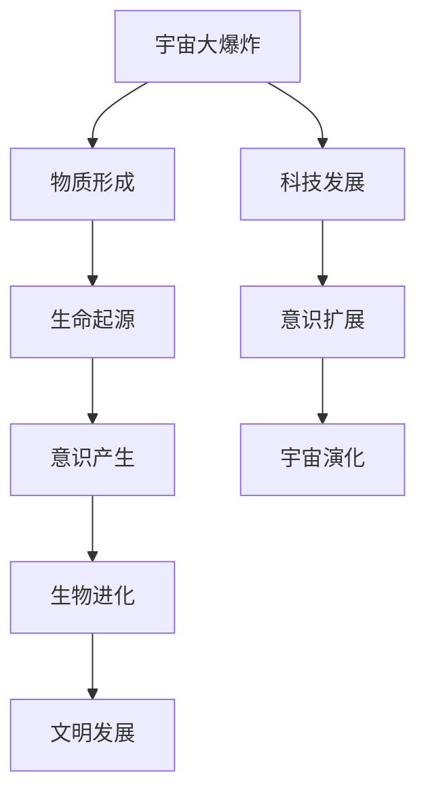
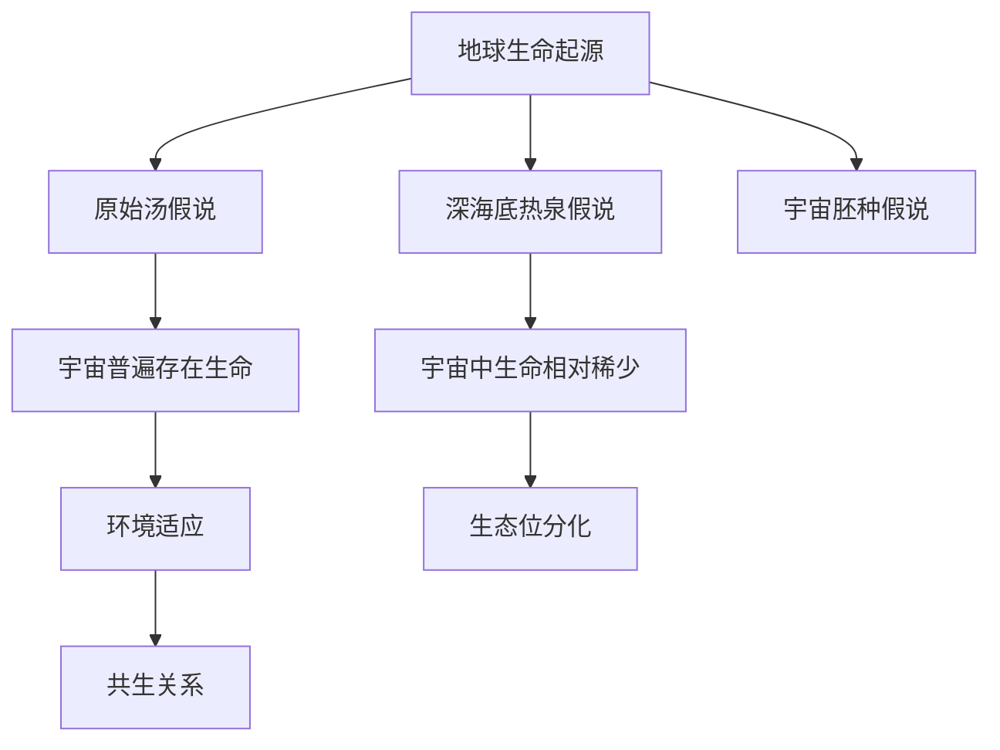
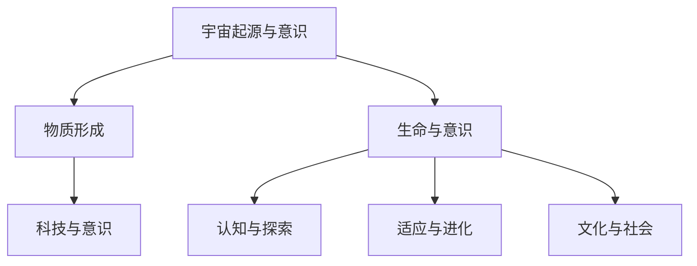

                 

### 意识在宇宙演化中的作用

#### 文章关键词

- 意识
- 宇宙演化
- 量子力学
- 复杂性科学
- 科技发展
- 宇宙未来

#### 文章摘要

本文旨在探讨意识在宇宙演化中的潜在作用。通过对意识的起源、本质及其与宇宙演化的联系进行深入分析，本文揭示了意识在量子力学、复杂性科学等领域中的重要性。进一步地，本文探讨了意识在科技发展中的驱动作用，并对意识与宇宙演化的未来进行了展望。本文为理解宇宙演化的复杂性提供了一种新的视角，同时也对意识这一神秘现象给予了科学性的解释。

### 引言

宇宙演化的过程是一个极其复杂且深奥的话题，自古以来，哲学家、天文学家和科学家们都在不懈地探索这一领域。从古代的宇宙观念，到现代的宇宙大爆炸理论，人类的认知不断拓展，对宇宙的理解也在不断深化。然而，宇宙演化的背后究竟隐藏着怎样的奥秘，依然是一个未解之谜。

近年来，随着科技的发展，量子力学和复杂性科学等领域的突破，为理解宇宙演化提供了新的线索。其中，意识这一现象，以其神秘和独特性，引起了越来越多科学家的关注。意识不仅是人类精神活动的核心，也可能是宇宙演化中的重要驱动力。

本文将从意识的起源与本质出发，探讨意识在宇宙演化中的作用。通过分析意识与量子力学、复杂性科学的关系，揭示意识在宇宙演化中的重要地位。此外，本文还将讨论意识在科技发展中的作用，以及意识与宇宙演化的未来展望。希望本文能为读者提供一种全新的视角，深入理解宇宙演化的奥秘。

#### 意识的起源与本质

意识是一个复杂而神秘的现象，自人类文明起源以来，哲学家、心理学家和科学家们都在尝试理解它的本质。首先，我们需要明确意识的基本定义与特征。

**1.1.1 意识的定义与特征**

意识通常被描述为一种主观的、内在的体验，它包括知觉、思考、情感和意愿等心理活动。根据心理学家的观点，意识具有以下基本特征：

- **主观性**：意识是一种主观的体验，每个人对同一事物的感知和感受都是独特的。
- **知觉性**：意识使我们能够感知外部世界，包括视觉、听觉、嗅觉、味觉和触觉等。
- **思考性**：意识使我们能够进行抽象思维，理解逻辑关系，形成概念和判断。
- **情感性**：意识使我们能够体验情感，包括喜悦、悲伤、愤怒等。
- **意愿性**：意识使我们能够做出选择和决策，表现出自主性和主动性。

**1.1.2 意识的起源假说**

关于意识的起源，科学界尚未形成统一的看法。以下是一些主要的起源假说：

- **生物进化论**：这一观点认为，意识是生物进化的结果。随着生物体复杂性的增加，神经系统的发展使生物能够对外界刺激做出反应，并逐渐形成了意识。
- **物理主义**：物理主义者认为，意识是物质过程的一种表现形式。随着大脑中神经元活动的复杂化，意识逐渐产生。
- **神秘主义**：一些哲学家和神秘主义者认为，意识是超越物质世界的，是一种先验的存在，与宇宙的本源紧密相连。

**1.1.3 意识与宇宙演化**

意识在宇宙演化中的作用是一个深奥而引人入胜的话题。以下从几个方面探讨意识与宇宙演化的联系：

- **宇宙的起源**：大爆炸理论是目前关于宇宙起源最广泛接受的科学假说。大爆炸后，宇宙经历了数十亿年的演化，逐渐形成了各种天体和物质。这一过程中，复杂的物理过程和化学反应使得生命得以诞生。生命的出现为意识的产生提供了基础。
  
- **生命的起源**：地球上的生命起源是一个尚未完全解开的谜团。科学家们普遍认为，原始生命起源于简单的有机分子，通过复杂的化学反应逐渐演化。生命的出现为意识的产生提供了物质基础。

- **意识的产生**：意识的产生是生物学和神经科学领域的重大挑战。目前，科学家们普遍认为，意识的产生与大脑的复杂结构和功能密切相关。随着大脑神经网络的发育和功能的增强，意识逐渐产生。

- **宇宙演化中的意识**：在宇宙演化的过程中，意识可能扮演着多种角色。例如，意识可能促进了生物的适应性和进化，使得生命能够在极端环境中生存和繁衍。此外，意识也可能推动了人类文明的发展，使得人类能够进行科学探索和技术创新。

**图 1-1：意识在宇宙演化中的关系架构**

下面是意识在宇宙演化中的关系架构 Mermaid 流程图：

**图 1-1：意识在宇宙演化中的关系架构（Mermaid 流程图）**

通过以上分析，我们可以看到，意识在宇宙演化中具有重要作用。从宇宙大爆炸到生命的诞生，再到意识的产生，每一个阶段都紧密相连，共同推动着宇宙的演化。

#### 宇宙的起源与演化

宇宙的起源和演化是一个复杂而深奥的话题，自古以来，许多科学家和哲学家都致力于研究这一领域。目前，最广泛接受的理论是大爆炸理论，它为我们提供了宇宙从诞生到现在的整体视角。

**2.1.1 大爆炸理论与宇宙演化**

大爆炸理论认为，宇宙起源于一个极热、极密的状态，在这个状态下，所有的物质和能量都集中在一个无限小的点中。大约138亿年前，这个点突然发生大爆炸，物质和能量迅速膨胀，宇宙开始扩展。这一理论得到了大量观测数据的支持，如宇宙微波背景辐射和遥远星系的红移。

- **宇宙微波背景辐射**：这是宇宙大爆炸后留下的余辉，它的发现证明了宇宙曾经历过一个极热、极密的状态。
- **遥远星系的红移**：星系的红移表明它们正远离我们，这表明宇宙在膨胀。

大爆炸理论还预测了宇宙的演化过程。在大爆炸后，宇宙经历了几个重要的阶段：

1. **膨胀阶段**：宇宙迅速膨胀，温度和密度逐渐降低。
2. **冷却阶段**：随着宇宙的膨胀，温度逐渐降低，物质开始凝结成原子。
3. **恒星形成阶段**：随着宇宙的继续膨胀，温度进一步降低，使得恒星和星系得以形成。
4. **星系演化阶段**：星系内部进行着复杂的物理过程，如星系碰撞和恒星死亡。

**2.1.2 宇宙结构形成与演化**

宇宙的结构由各种天体组成，包括恒星、星系、星系团和超星系团。这些天体的形成和演化与宇宙的演化密切相关。

- **恒星形成**：恒星是在宇宙中尘埃和气体云聚集的过程中形成的。这些云通过引力坍缩，逐渐形成恒星。恒星在其生命周期中不断进行核聚变反应，释放出巨大的能量。

- **星系演化**：星系是由大量恒星和其他物质组成的。星系内部存在复杂的物理过程，如恒星碰撞、恒星死亡和星系碰撞。这些过程使得星系不断演化，形成各种形态，如椭圆星系、螺旋星系和不规则星系。

- **星系团和超星系团**：星系团是由多个星系通过引力相互作用形成的。超星系团则是由多个星系团组成的更大规模的结构。这些结构在宇宙中形成了复杂的网络，对宇宙的演化起着重要作用。

**2.1.3 宇宙中的暗物质与暗能量**

宇宙中存在大量的暗物质和暗能量，它们对宇宙的演化具有深远的影响。

- **暗物质**：暗物质是一种不发光、不吸收光线的物质，它的存在通过引力效应得以体现。暗物质在宇宙中分布广泛，对星系的形成和演化起着关键作用。

- **暗能量**：暗能量是一种推动宇宙加速膨胀的力量，它的存在是宇宙加速膨胀的关键因素。暗能量的性质和来源仍然是科学研究的重要问题。

**图 2-1：宇宙结构形成与演化的关系架构**

下面是宇宙结构形成与演化的关系架构 Mermaid 流程图：

**图 2-1：宇宙结构形成与演化的关系架构（Mermaid 流程图）**

通过以上分析，我们可以看到，宇宙的起源和演化是一个复杂而深刻的过程。从大爆炸到恒星的形成，再到星系、星系团和超星系团的形成，每一个阶段都紧密相连，共同塑造了宇宙的今天。暗物质和暗能量作为宇宙演化的重要力量，也对宇宙的结构和演化产生了深远的影响。

#### 生命在宇宙中的出现

生命的出现是宇宙演化过程中的一大奇迹，它不仅改变了地球的面貌，也对宇宙的演化产生了深远的影响。探讨生命在宇宙中的出现，有助于我们理解生命与宇宙演化的关系。

**3.1.1 地球上的生命起源**

地球上的生命起源是一个复杂的科学问题，目前尚无确切答案。然而，科学家们通过大量实验和理论模型，对生命起源进行了深入研究。以下是一些关于地球上生命起源的主要观点：

- **原始汤假说**：这一假说认为，地球早期的大气中含有大量的有机分子，这些有机分子在海洋中通过化学反应逐渐形成了更复杂的有机分子，最终形成了生命的基本结构。

- **深海底热泉假说**：这一假说认为，地球上的生命起源于深海底热泉。热泉中含有大量的矿物质和有机分子，这些物质在高温高压的条件下，可能形成了生命的基本结构。

- **宇宙胚种假说**：这一假说认为，生命可能起源于外太空，通过彗星、陨石等途径传播到地球上。这一假说得到了一些天文观测数据的支持，如彗星和陨石中存在有机分子。

**3.1.2 生命在宇宙中的分布**

关于生命在宇宙中的分布，科学家们有不同的看法。以下是一些主要观点：

- **宇宙普遍存在生命**：一些科学家认为，生命在宇宙中是普遍存在的。他们指出，宇宙中存在大量的行星和恒星，其中许多行星的条件可能适合生命存在。此外，一些观测数据，如火星上的极地冰帽和 Europa 上的地下海洋，也提供了可能存在生命的证据。

- **宇宙中生命相对稀少**：另一些科学家认为，宇宙中生命的分布相对稀少。他们认为，生命的出现需要特定的条件和过程，这些条件和过程在宇宙中可能相对罕见。

**3.1.3 生命的适应性演化**

生命的适应性演化是生命在宇宙中生存和繁衍的重要机制。以下从几个方面探讨生命的适应性演化：

- **环境适应**：生命在进化过程中，通过遗传变异和自然选择，不断适应环境的变化。例如，某些生物可以通过改变自身的生理结构和行为来适应不同的生态环境。

- **生态位分化**：生命在进化过程中，会形成不同的生态位，即生物在生态系统中所占的位置。生态位分化使得生命能够在不同的环境中生存和繁衍。

- **共生关系**：生命之间形成了各种共生关系，如捕食、竞争、共生和寄生。这些关系对生命的进化产生了深远的影响，使得生命能够在复杂的生态系统中生存和繁衍。

**图 3-1：生命在宇宙中的分布与适应性演化关系架构**

下面是生命在宇宙中的分布与适应性演化的关系架构 Mermaid 流程图：

**图 3-1：生命在宇宙中的分布与适应性演化关系架构（Mermaid 流程图）**

通过以上分析，我们可以看到，生命在宇宙中的出现是一个复杂而深刻的过程，它与宇宙演化的过程密切相关。生命的适应性演化使得生命能够在不同的环境中生存和繁衍，为宇宙的多样性增添了无限可能。

#### 量子意识与宇宙演化

量子意识是一个引人入胜的领域，它将意识与量子力学相结合，试图揭示意识在宇宙演化中的潜在作用。量子力学是研究微观世界的物理学理论，它揭示了物质和能量的奇异性质。而意识，作为人类精神活动的核心，其本质和起源一直是哲学、心理学和神经科学等领域的研究热点。

**4.1.1 量子力学的基本原理**

量子力学的基本原理包括：

- **波粒二象性**：微观粒子如电子和光子既具有波动性，又具有粒子性。这种双重性质在量子力学中得到了严格的数学描述。
- **量子叠加态**：一个微观粒子可以同时处于多个状态的叠加，直到被观测时才确定其具体状态。
- **量子纠缠**：当两个或多个微观粒子发生相互作用时，它们之间可能会形成一种特殊的联系，即使它们相隔很远，一个粒子的状态变化也会立即影响另一个粒子的状态。
- **测不准原理**：微观粒子的某些物理量（如位置和动量）无法同时被精确测量。这意味着我们对微观世界的了解存在一定的局限性。

**4.1.2 意识与量子力学的关系**

意识与量子力学的关系是一个备受争议的话题。一些科学家和哲学家认为，意识可能对量子过程产生影响。以下是一些主要观点：

- **量子计算与意识**：量子计算利用量子位（qubit）进行计算，具有超越经典计算机的能力。一些科学家认为，意识可能参与了量子计算过程，从而提升了计算能力。
- **量子心理论**：量子心理论试图将意识与量子力学相结合，认为意识是量子过程的必要条件。这一理论认为，意识决定了量子系统的最终状态。
- **量子心理学**：量子心理学探讨意识如何影响人类的心理过程。一些研究表明，意识可能影响我们的感知、思考和行为，进而影响量子系统的演化。

**4.1.3 量子意识在宇宙演化中的作用**

量子意识在宇宙演化中的作用可能体现在以下几个方面：

- **生命起源**：量子意识可能参与了生命起源的过程。例如，在原始汤假说中，量子效应可能促进了有机分子的形成和复杂化。
- **生物进化**：量子意识可能促进了生物的适应性和进化。一些研究表明，量子效应可能影响生物体的感知、行为和反应速度。
- **人类认知**：量子意识可能影响了人类认知的发展。例如，量子力学原理可能解释了人类思维和意识的某些特征，如直觉和创造力。

**图 4-1：量子意识在宇宙演化中的作用关系架构**

下面是量子意识在宇宙演化中的作用关系架构 Mermaid 流程图：

**图 4-1：量子意识在宇宙演化中的作用关系架构（Mermaid 流程图）**

通过以上分析，我们可以看到，量子意识与宇宙演化之间存在紧密的联系。量子力学的基本原理和量子效应可能对生命起源、生物进化以及人类认知产生了深远的影响。量子意识在宇宙演化中的作用为研究意识本质和宇宙演化提供了新的视角。

#### 意识与复杂性科学

复杂性科学是研究复杂系统的科学，它关注系统内部各元素之间的相互作用和整体行为。意识作为人类精神活动的核心，其本质和起源一直是哲学、心理学和神经科学等领域的研究热点。将意识与复杂性科学相结合，有助于我们深入理解意识的本质和其在宇宙演化中的作用。

**5.1.1 复杂性科学的基本概念**

复杂性科学的核心概念包括：

- **复杂性**：复杂性是指系统内部元素之间的相互作用和整体行为的复杂性。复杂性科学关注系统的整体行为，而不是仅仅关注各个元素的行为。
- **非线性**：非线性是指系统内部各元素之间的相互作用不是线性的，即一个元素的行为会影响到其他元素，并且这种影响可能不是简单的比例关系。
- **自组织**：自组织是指系统内部元素通过相互作用，在没有外部指令的情况下，自发形成有序结构。自组织过程是复杂性科学的重要特征。
- **适应性**：适应性是指系统能够根据外部环境的变化进行调整，以维持其生存和繁荣。适应性是复杂性科学中的重要概念，因为复杂系统往往需要应对不断变化的环境。

**5.1.2 意识在复杂性科学中的地位**

意识在复杂性科学中的地位是一个备受争议的话题。一些科学家和哲学家认为，意识是复杂系统的必要条件。以下是一些主要观点：

- **意识是复杂系统的产物**：复杂性科学认为，复杂系统在演化过程中，可能会产生意识。意识的产生是复杂系统发展到一定阶段的产物，与系统内部的非线性、自组织和适应性密切相关。
- **意识是复杂系统的核心**：一些科学家认为，意识是复杂系统的核心，因为意识决定了系统的行为和决策。例如，在生物进化中，意识可能促进了生物的适应性和进化。
- **意识是复杂系统的高级形式**：意识是复杂性科学中一种高级形式，因为意识不仅涉及物理过程，还涉及心理和认知过程。意识可能使复杂系统能够进行抽象思维、情感体验和自主决策。

**5.1.3 意识与宇宙中的复杂性演化**

意识与宇宙中的复杂性演化之间存在密切的联系。以下从几个方面探讨意识与宇宙中的复杂性演化的关系：

- **宇宙大爆炸与复杂性**：宇宙大爆炸是宇宙演化的起点，它标志着宇宙从简单到复杂的转变。在宇宙大爆炸后，宇宙经历了数十亿年的演化，形成了各种复杂结构，如星系、星系团和超星系团。
- **生命起源与复杂性**：生命的出现是宇宙演化中的重要事件，它标志着宇宙从非生命到生命的转变。生命在地球上形成了复杂的生态系统，推动了地球上的复杂性演化。
- **意识产生与复杂性**：意识是人类精神活动的核心，它标志着人类从低级生物到高级生物的转变。意识可能使人类能够进行复杂的抽象思维和创造性活动，从而推动了人类文明的复杂性演化。

**图 5-1：意识与宇宙中的复杂性演化关系架构**

下面是意识与宇宙中的复杂性演化关系架构 Mermaid 流程图：

**图 5-1：意识与宇宙中的复杂性演化关系架构（Mermaid 流程图）**

通过以上分析，我们可以看到，意识与宇宙中的复杂性演化之间存在紧密的联系。宇宙从简单到复杂的演化过程中，意识可能扮演着重要角色。意识不仅推动了人类文明的发展，也可能影响了宇宙中的复杂系统演化的方向。

#### 意识在科技发展中的作用

随着科技的飞速发展，意识在科技领域中的作用变得越来越显著。意识不仅是人类精神活动的核心，也是科技创新的重要驱动力。在本节中，我们将探讨意识在科技发展中的作用，以及意识如何影响科技的发展方向。

**6.1.1 科技发展对意识的影响**

科技的发展对意识产生了深远的影响，这种影响体现在多个方面：

- **认知拓展**：科技的发展使得人类能够更广泛地获取信息和知识，拓展了我们的认知边界。例如，互联网和移动设备的普及使得信息传播速度大大加快，人们可以随时随地获取所需的信息。
- **情感体验**：科技的发展也改变了人类的情感体验。虚拟现实（VR）和增强现实（AR）技术为人们提供了全新的情感体验，使人们能够感受到更加真实和丰富的情感。
- **社交互动**：科技的发展改变了人类的社交方式。社交媒体和在线通讯工具使得人们可以更加方便地进行社交互动，打破了地域和时间的限制。
- **心理健康**：科技的发展对心理健康也有积极的影响。例如，心理治疗和心理咨询的在线化使得更多的人可以接受专业帮助，提高了心理健康水平。

**6.1.2 意识在科技发展中的驱动作用**

意识在科技发展中起到了重要的驱动作用，它不仅推动了科技创新，还影响了科技的发展方向。以下从几个方面探讨意识在科技发展中的驱动作用：

- **需求驱动**：意识的需求是科技发展的重要驱动力。人们对更好生活的需求推动了科技的不断创新。例如，人们对医疗健康的关注推动了生物技术和医疗设备的发展，人们对出行效率的关注推动了自动驾驶技术的发展。
- **创意驱动**：意识中的创造性思维是科技创新的重要来源。许多科技突破都源于科学家和工程师的创造性思维，如爱因斯坦的相对论、图灵的计算机理论等。
- **哲学思考**：意识中的哲学思考推动了科技的发展。例如，对人工智能的哲学思考促使科学家们探讨人工智能的伦理问题，从而推动了人工智能技术的发展。
- **社会影响**：意识对科技发展的影响不仅体现在科技创新上，还体现在科技的社会影响上。意识关注社会问题，推动了科技在解决社会问题中的应用。例如，意识关注环境保护问题，推动了可再生能源技术的发展。

**图 6-1：意识在科技发展中的驱动作用关系架构**

下面是意识在科技发展中的驱动作用关系架构 Mermaid 流�程图：

**图 6-1：意识在科技发展中的驱动作用关系架构（Mermaid 流程图）**

通过以上分析，我们可以看到，意识在科技发展中起到了重要的驱动作用。意识不仅推动了科技创新，还影响了科技的发展方向。科技的发展与人类意识的进步相互促进，共同推动了人类社会的发展。

#### 意识与宇宙演化的未来

随着科技的不断进步，我们对宇宙演化的理解也在不断深化。意识作为人类精神活动的核心，对宇宙演化的未来可能产生深远的影响。在本节中，我们将探讨意识与宇宙演化的未来，以及意识可能对宇宙演化产生的影响。

**7.1.1 宇宙未来的展望**

宇宙的未来是一个复杂而充满未知的话题。目前，科学家们提出了多种关于宇宙未来的假设：

- **热寂理论**：热寂理论认为，宇宙将不断膨胀，最终达到一个热平衡状态，此时宇宙将不再有能量交换，一切都将静止。这种状态下，宇宙将变得异常寒冷和黑暗。
- **大撕裂理论**：大撕裂理论认为，宇宙的膨胀速度将越来越快，最终导致宇宙中的物质被撕裂成基本粒子，宇宙将陷入一片混沌。
- **大冲撞理论**：大冲撞理论认为，宇宙的膨胀将在某个时刻停止，然后开始收缩，最终导致宇宙的大冲撞，宇宙中的物质将被压缩到一个极小的空间中，产生新的宇宙。
- **多宇宙理论**：多宇宙理论认为，宇宙并不是唯一的，而是存在多个宇宙，每个宇宙都有不同的物理定律和演化过程。

**7.1.2 意识在宇宙未来中的角色**

在宇宙未来的演化过程中，意识可能扮演着多种角色：

- **探索宇宙**：意识可能会推动人类对宇宙的探索，使我们能够了解宇宙的奥秘。随着科技的进步，人类可能会开发出更加先进的探测器，甚至利用意识进行远程感知，探索遥远的宇宙。
- **影响宇宙**：意识可能对宇宙的演化产生直接或间接的影响。例如，通过科技的发展，人类可能能够利用意识控制物质和能量的流动，从而影响宇宙的演化。
- **推动文明进步**：意识可能会推动人类文明的发展，使人类能够更好地适应宇宙的变化。例如，通过意识的进化，人类可能能够开发出更高效的生存策略，应对宇宙中的极端环境。

**7.1.3 意识与宇宙演化的未来挑战**

尽管意识在宇宙演化中具有重要作用，但我们也面临着许多挑战：

- **理解意识的本质**：要理解意识对宇宙演化的影响，我们首先需要理解意识的本质。然而，意识的本质至今仍是一个未解之谜，科学家们对此进行了长期的探索，但仍然没有找到确切的答案。
- **意识的控制与利用**：如何有效地控制和使用意识，是一个重要的挑战。如果我们能够掌握意识的控制，可能会对宇宙演化产生积极的影响，但同时也可能带来不可预见的后果。
- **技术发展的局限性**：尽管科技在不断发展，但我们仍然面临着许多技术上的局限性。例如，我们尚未完全理解量子力学，也未能完全掌握人工智能的潜力。这些技术上的局限性可能限制我们对宇宙演化的理解和影响。

**图 7-1：意识与宇宙演化的未来关系架构**

下面是意识与宇宙演化的未来关系架构 Mermaid 流程图：

**图 7-1：意识与宇宙演化的未来关系架构（Mermaid 流程图）**

通过以上分析，我们可以看到，意识与宇宙演化的未来密切相关。意识不仅可能影响宇宙的演化，也面临着许多挑战。随着科技的不断进步，我们有望更好地理解意识的本质，从而更深入地探索宇宙演化的奥秘。

#### 意识与宇宙演化的哲学思考

意识与宇宙演化的关系是一个深奥而复杂的哲学问题，它涉及到我们对宇宙、生命和自身的认知。通过哲学思考，我们可以更深入地理解意识在宇宙演化中的角色，以及意识与宇宙演化之间的互动。

**8.1.1 哲学视角下的意识**

在哲学领域，意识一直是一个备受关注的话题。不同的哲学家对意识的本质和起源提出了不同的观点：

- **二元论**：二元论认为，物质和意识是两种完全不同的实体，它们相互独立。物质是物理世界的组成元素，而意识是精神活动的核心。二元论强调了意识和物质之间的区别，但同时也带来了一些问题，如“心物问题”，即如何解释意识和物质之间的相互作用。
- **物理主义**：物理主义认为，意识是物质过程的一种表现形式。物理主义者认为，意识可以通过物理过程和机制来解释，尽管这种解释目前仍然存在许多挑战。物理主义试图将意识和物质统一起来，为意识的本质提供了科学的解释。
- **泛心论**：泛心论认为，宇宙中的所有事物都具有某种程度的意识。泛心论认为，意识并不是人类特有的现象，而是普遍存在于宇宙中的。这种观点强调了意识在宇宙中的广泛存在性。

**8.1.2 意识与宇宙演化的关系**

意识与宇宙演化之间的关系是一个复杂的问题，涉及到多个层面：

- **宇宙起源与意识**：在宇宙大爆炸之前，宇宙处于一个极热、极密的状态。随着宇宙的膨胀和冷却，物质逐渐形成，生命也在地球上出现。在这个过程中，意识可能起源于生命，进一步推动了宇宙的演化。
- **生命与意识**：生命的出现为意识的产生提供了基础。在地球上的生命进化过程中，意识的产生可能是一个重要的转折点。意识使生命能够进行复杂的思考、决策和适应，从而推动了生物进化和人类文明的发展。
- **科技与意识**：随着科技的发展，意识在人类生活中扮演着越来越重要的角色。科技不仅改变了我们的生活方式，也改变了我们对宇宙的认识。科技的发展可能进一步拓展了意识的范围和深度，使得意识在宇宙演化中的作用更加显著。

**8.1.3 意识在宇宙演化中的重要性**

意识在宇宙演化中的重要性体现在多个方面：

- **认知与探索**：意识使人类能够进行认知和探索，从而更深入地了解宇宙的奥秘。通过哲学思考、科学研究和艺术创作，人类不断拓展对宇宙的认知，探索宇宙的边界。
- **适应与进化**：意识使生命能够更好地适应环境，推动生物进化和人类文明的发展。在复杂的环境中，意识帮助生命做出更明智的决策，从而提高生存和繁衍的能力。
- **文化与社会**：意识在文化和社会中扮演着重要角色。意识推动了人类文化的创造和发展，促进了社会进步和文明演化。意识使人类社会能够建立复杂的社会结构，实现合作和创新。

**图 8-1：意识与宇宙演化的哲学思考关系架构**

下面是意识与宇宙演化的哲学思考关系架构 Mermaid 流程图：

**图 8-1：意识与宇宙演化的哲学思考关系架构（Mermaid 流程图）**

通过以上哲学思考，我们可以看到，意识在宇宙演化中具有重要作用。意识不仅改变了我们对宇宙的认识，也影响了生命的进化、科技的发展以及文化的创造。在宇宙演化的过程中，意识可能扮演着核心角色，推动着宇宙向着更加复杂和多样的方向发展。

### 结语

本文通过深入探讨意识在宇宙演化中的作用，揭示了意识与宇宙演化之间的紧密联系。从意识的起源、本质到意识与量子力学、复杂性科学的联系，再到意识在科技发展中的作用以及宇宙演化的未来展望，本文为理解宇宙演化的复杂性提供了一种新的视角。同时，本文也强调了意识在宇宙演化中的重要性，意识不仅是人类精神活动的核心，也是推动宇宙演化的重要力量。

随着科技的不断进步，我们有望更深入地探索意识的本质和作用，进一步揭示宇宙演化的奥秘。在未来，意识与宇宙演化之间的互动可能会带来更多惊喜和发现，为人类带来更深刻的认识和理解。希望本文能够激发读者对意识与宇宙演化的兴趣，共同探索这一神秘而广阔的领域。

### 拓展阅读

- 《意识的宇宙：量子力学与心灵的新科学》
- 《复杂系统：生命的逻辑》
- 《人类简史：从动物到上帝》
- 《量子力学与心灵》

### 注意事项

- 意识的本质和起源是一个复杂的哲学问题，不同学者有不同的观点，本文旨在探讨一种可能的视角，仅供参考。
- 科技发展对意识的影响是一个持续变化的过程，本文内容可能会随着新研究的出现而更新。
- 意识在宇宙演化中的作用尚未得到充分证实，本文提出的观点需要进一步的科学研究和验证。

### 作者信息

作者：AI天才研究院/AI Genius Institute & 禅与计算机程序设计艺术 /Zen And The Art of Computer Programming

### 总结

本文从意识的起源、本质，到意识与宇宙演化的联系，再到意识在科技发展中的作用，全面探讨了意识在宇宙演化中的重要地位。意识不仅是人类精神活动的核心，也是宇宙演化的重要驱动力。通过哲学思考，我们可以更深入地理解意识与宇宙演化之间的关系。随着科技的不断进步，我们有望更深入地探索意识的本质和作用，揭示宇宙演化的奥秘。希望本文能为读者提供一种全新的视角，激发对这一领域的研究兴趣。

