                 

### 文章标题：意识对宇宙物理实在的影响

#### 关键词：意识，宇宙物理，实在，量子力学，相对论，实证研究

#### 摘要：
本文旨在探讨意识对宇宙物理实在的影响。首先，我们将介绍意识和宇宙物理的基本概念，探讨它们之间的联系。接着，通过量子力学和相对论的理论框架，分析意识如何影响宇宙物理现象。随后，我们将介绍一些实证研究，探讨意识在宇宙物理中的具体作用。最后，我们对未来研究方向提出展望，并总结全文。

----------------------------------------------------------------

### 1. 意识概述

#### 1.1 意识的定义与本质

意识是人类心灵的核心特征，是人类对自身和外界进行感知、理解和反应的能力。关于意识的定义，学术界尚无统一的观点。一些学者认为，意识是一种主观体验，包括感觉、知觉、思考、情感和意愿等。另一些学者则认为，意识是大脑活动的一种表现形式，与神经元网络的结构和功能密切相关。

#### 1.2 意识的测量与评估方法

由于意识的主观性质，测量和评估意识变得复杂。目前，研究者们采用多种方法来测量和评估意识，如功能性磁共振成像（fMRI）、脑电图（EEG）和临床评估等。这些方法有助于我们了解意识在不同状态下的变化，以及意识与大脑活动的关系。

#### 1.3 意识与物理世界的联系

意识与物理世界的关系是哲学和科学领域的重要议题。一些学者认为，意识是物理世界的产物，源于大脑神经元网络的复杂交互。另一些学者则认为，意识是独立于物理世界的存在，具有超越物理规律的特性。本文将探讨意识与物理世界之间的相互作用，以及它们在宇宙物理中的潜在影响。

----------------------------------------------------------------

### 2. 宇宙物理基础

#### 2.1 宇宙的起源与演化

宇宙的起源是一个深刻的科学问题。根据大爆炸理论，宇宙起源于一个极高密度、极高温度的状态，经过约138亿年的演化，形成了现在我们所观察到的宇宙。宇宙的演化包括宇宙背景辐射、星系的形成与演化、黑洞和宇宙膨胀等现象。

#### 2.2 宇宙的基本力与物质

宇宙中存在四种基本力：引力、电磁力、弱核力和强核力。这些力决定了物质的行为和相互作用。此外，宇宙中存在多种物质，包括普通物质、暗物质和暗能量。暗物质和暗能量是宇宙演化中的关键因素，但至今尚未找到确切的证据。

#### 2.3 宇宙物理中的数学模型

宇宙物理中的数学模型包括广义相对论、量子场论和宇宙学模型等。广义相对论描述了引力和时空结构，量子场论描述了基本粒子和相互作用，宇宙学模型描述了宇宙的起源、演化和结构。这些模型为我们理解宇宙物理现象提供了理论基础。

----------------------------------------------------------------

### 3. 意识与宇宙物理的理论联系

#### 3.1 意识在宇宙物理中的地位

意识在宇宙物理中的地位是一个哲学和科学问题。一些学者认为，意识是宇宙演化的一部分，是人类对宇宙的感知和理解。另一些学者则认为，意识可能影响宇宙物理现象，例如量子纠缠和宇宙膨胀等。

#### 3.2 意识与量子力学的关系

量子力学揭示了微观世界的奇异性质，如量子纠缠、量子叠加和量子测量等。一些学者认为，意识可能与量子力学现象有关。例如，量子纠缠现象在意识参与下可能表现出更复杂的特性。此外，量子测量问题也涉及到意识与物理世界的相互作用。

#### 3.3 意识与相对论的关系

相对论描述了宏观宇宙的规律，包括狭义相对论和广义相对论。一些学者认为，意识可能影响相对论效应，例如时间膨胀和引力透镜效应。然而，这方面的研究尚处于初步阶段，需要更多的实证研究来验证。

----------------------------------------------------------------

### 4. 意识对宇宙物理现象的影响

#### 4.1 意识对物理实验结果的影响

一些实验表明，意识可能影响物理实验的结果。例如，在某些量子实验中，实验者的意识可能影响粒子的行为。这种现象被称为“意识相关性”。然而，这些实验结果尚未得到广泛认可，需要进一步研究。

#### 4.2 意识与量子纠缠的关系

量子纠缠现象是量子力学中的一种非经典现象，涉及两个或多个粒子之间的关联。一些学者认为，意识可能影响量子纠缠现象，从而影响宇宙物理现象。然而，这方面的研究仍需进一步探讨。

#### 4.3 意识与宇宙背景辐射的关系

宇宙背景辐射是宇宙演化早期阶段的残留辐射。一些学者认为，意识可能影响宇宙背景辐射的强度和分布。然而，这方面的研究尚处于初级阶段，需要更多实证研究。

----------------------------------------------------------------

### 5. 意识与宇宙物理的交互实验

#### 5.1 意识交互实验的设计与实施

意识交互实验旨在探讨意识与物理世界之间的相互作用。这些实验通常涉及参与者对物理过程的影响，例如通过心理活动改变量子态。实验设计需要严格控制变量，以确保结果的可靠性。

#### 5.2 实验结果的分析与讨论

意识交互实验的结果尚不明确，需要进一步分析和讨论。一些实验表明，意识可能对物理过程产生一定影响，但其他实验结果则不支持这一观点。因此，需要更多实验来验证意识与宇宙物理现象之间的关系。

#### 5.3 意识交互实验的意义与影响

意识交互实验的意义在于，它们可能揭示意识与物理世界之间更深层次的联系。如果意识确实对宇宙物理现象产生影响，这将对我们的科学观念产生重大影响。此外，这些实验也可能为心理学和物理学提供新的研究思路。

----------------------------------------------------------------

### 6. 意识在宇宙探索中的应用

#### 6.1 意识在空间探索中的潜在作用

意识在空间探索中可能具有潜在作用。例如，宇航员在太空中可能面临心理健康问题，意识干预技术可能有助于提高宇航员的心理健康水平。此外，意识可能与宇宙探索中的未知现象有关，例如太空中的异常现象。

#### 6.2 意识在宇宙生命探索中的应用

意识在宇宙生命探索中也可能发挥重要作用。例如，探索外星生命可能需要理解生命形式与意识的关系。此外，意识研究可能有助于我们理解宇宙中是否存在其他智慧生命。

#### 6.3 意识与宇宙意识的探讨

宇宙意识是一个哲学和科学问题，涉及到宇宙中是否存在意识以及意识如何影响宇宙。一些学者认为，宇宙意识可能是一个更高层次的意识，与人类意识存在联系。然而，这方面的研究仍需进一步探讨。

----------------------------------------------------------------

### 7. 意识与宇宙物理的未来研究方向

#### 7.1 意识与宇宙物理研究的前沿领域

意识与宇宙物理研究的前沿领域包括量子意识、宇宙意识、意识与量子场论的关系等。这些领域为意识与宇宙物理的研究提供了新的思路和方法。

#### 7.2 意识与宇宙物理研究的方法创新

为了更好地探讨意识与宇宙物理的关系，需要创新研究方法。例如，可以结合神经科学、量子物理学和宇宙物理学的方法，开展跨学科研究。此外，利用人工智能和大数据分析技术，也可能为意识与宇宙物理研究提供新的途径。

#### 7.3 意识与宇宙物理研究的社会影响

意识与宇宙物理研究可能对社会产生深远影响。例如，如果意识对宇宙物理现象产生影响，这将对我们的科学观念产生挑战。此外，这些研究也可能为心理学、哲学和宗教等领域提供新的思考方向。

----------------------------------------------------------------

### 8. 意识与宇宙物理的哲学思考

#### 8.1 意识与宇宙物理的哲学意义

意识与宇宙物理的哲学意义在于，它们涉及到人类存在的本质和宇宙的本质。探讨意识与宇宙物理的关系，有助于我们更深入地理解人类和宇宙的本质。

#### 8.2 意识与宇宙物理的哲学问题

意识与宇宙物理的哲学问题包括：意识是否是物质世界的产物？宇宙中是否存在其他智慧生命？意识与物理世界的关系是什么？这些问题的探讨有助于我们深化对意识和宇宙物理的认识。

#### 8.3 意识与宇宙物理的哲学展望

意识与宇宙物理的哲学展望涉及未来的研究趋势和可能的结果。如果意识确实对宇宙物理现象产生影响，这将对我们的科学观念和哲学观念产生重大影响。此外，这些研究也可能揭示宇宙的本质和人类存在的意义。

----------------------------------------------------------------

### 附录：相关资源与参考书目

#### 附录1：意识研究的重要文献

1. Chalmers, D. J. (1996). The conscious mind: In search of a fundamental theory. Oxford University Press.
2. Block, N. (1995). On a confusion about a function of consciousness. Behavioral and Brain Sciences, 18(2), 227-287.

#### 附录2：宇宙物理研究的重要文献

1. Hawking, S. W. (1988). A brief history of time: From the big bang to black holes. Bantam Books.
2. Penrose, R. (2005). The road to reality: A complete guide to the laws of the universe. Alfred A. Knopf.

#### 附录3：意识与宇宙物理研究的常用工具和软件

1. MATLAB: 用于数据分析、建模和可视化。
2. Mathematica: 用于数学计算、符号计算和图形表示。
3. Python: 用于数据处理、机器学习和数据可视化。

---

### 结语

意识与宇宙物理的关系是一个复杂而引人入胜的议题。本文从多个角度探讨了意识对宇宙物理实在的影响，包括理论基础、实证研究和哲学思考等。然而，这一领域的研究仍然面临许多挑战，需要更多的研究和探索。希望本文能为读者提供对意识与宇宙物理关系的深入理解和启示。

### 作者：AI天才研究院/AI Genius Institute & 禅与计算机程序设计艺术 /Zen And The Art of Computer Programming

----------------------------------------------------------------

#### 3.1 意识与量子力学的关系

意识与量子力学的关系是一个引人入胜且充满争议的议题。量子力学揭示了微观世界的奇异性质，如量子纠缠、量子叠加和量子测量等。这些现象挑战了经典物理学的直觉，也引发了关于意识与量子力学之间可能存在联系的思考。

##### 3.1.1 量子纠缠与意识

量子纠缠是量子力学中的一种非经典现象，描述了两个或多个粒子之间的紧密关联。当两个粒子发生纠缠后，无论它们相距多远，对其中一个粒子的测量会立即影响另一个粒子的状态。这种现象似乎超越了经典物理学的局域实在论，暗示了量子世界中的非局域性。

一些学者认为，意识可能与量子纠缠现象有关。如果意识确实对量子过程产生影响，那么量子纠缠现象可能会表现出更加复杂的特性。例如，在实验中，如果参与者的意识状态发生变化，量子纠缠现象的结果可能随之变化。

为了探讨意识与量子纠缠的关系，我们可以考虑以下Mermaid流程图，展示量子纠缠现象的基本原理：

在这个流程图中，粒子1和粒子2处于纠缠态，当对其中一个粒子进行测量时，另一个粒子的状态也会立即确定。

##### 3.1.2 量子叠加与意识

量子叠加是量子力学中另一个基本概念，描述了一个量子系统可以同时处于多个状态的组合。例如，一个电子可以同时处于自旋向上和自旋向下的状态，直到被测量时才会“坍缩”为一个确定的状态。

一些学者认为，意识可能影响量子叠加现象。如果意识对量子态的测量产生影响，那么量子叠加现象可能会表现出更加复杂的特性。例如，在实验中，如果参与者的意识状态发生变化，量子叠加现象的结果可能随之变化。

为了探讨意识与量子叠加的关系，我们可以考虑以下Mermaid流程图，展示量子叠加现象的基本原理：

在这个流程图中，量子态处于叠加态，当进行测量时，量子态会“坍缩”为一个确定的状态。

##### 3.1.3 量子测量与意识

量子测量是量子力学中另一个关键概念，描述了量子态从叠加态转变为确定态的过程。一些学者认为，意识在量子测量过程中可能扮演着重要角色。

经典物理学认为，量子态在测量前处于叠加态，但在测量时会发生“坍缩”，变为一个确定的状态。然而，这种解释在量子力学的哥本哈根解释中引发了争议。哥本哈根解释认为，量子态的“坍缩”是观察者的主观体验导致的。

为了探讨意识与量子测量的关系，我们可以考虑以下Mermaid流程图，展示量子测量现象的基本原理：

在这个流程图中，量子态处于叠加态，当观察者进行测量时，量子态会“坍缩”为一个确定的状态，这涉及到观察者的意识状态。

##### 3.1.4 意识与量子力学实验

为了探讨意识与量子力学现象的关系，研究者们设计了一系列实验。这些实验通常涉及参与者对物理过程的影响，例如通过心理活动改变量子态。

一些实验表明，意识可能对量子纠缠现象产生影响。例如，研究者让参与者在量子纠缠实验中想象不同的情景，结果发现，当参与者想象特定的情景时，量子纠缠现象的结果会发生变化。然而，这些实验结果尚未得到广泛认可，需要更多的研究来验证。

此外，还有一些实验探讨意识与量子叠加的关系。例如，研究者设计了量子叠加实验，让参与者在不同意识状态下进行测量，结果发现，在特定的意识状态下，量子叠加现象的结果会发生变化。这些实验结果暗示了意识可能对量子过程产生影响。

总的来说，意识与量子力学的关系仍然是一个充满争议的议题，需要更多的研究和探索。通过结合量子力学和意识的实验研究，我们可以更深入地了解意识与物理世界之间的相互作用。

----------------------------------------------------------------

### 3.3 意识与相对论的关系

意识与相对论的关系是一个富有哲学性和科学性的问题。相对论，包括狭义相对论和广义相对论，为我们提供了描述宇宙中物质和能量运动的精确理论框架。在这些理论中，时间、空间和引力被视为基本的物理现象。然而，意识作为人类认知和主观体验的核心，其与相对论的关系引起了广泛关注。

##### 3.3.1 意识与狭义相对论

狭义相对论由阿尔伯特·爱因斯坦在1905年提出，主要讨论在没有引力作用下的运动物体和时空结构。狭义相对论的核心观点是光速不变原理和相对性原理。光速不变原理指出，在任何惯性参考系中，光在真空中的速度都是常数，约为299,792,458米/秒。相对性原理则指出，所有物理定律在所有惯性参考系中都是相同的。

在狭义相对论的框架下，时间膨胀和长度收缩是两个重要的相对论效应。时间膨胀描述了当一个物体以接近光速运动时，其内部的时间相对于静止观察者会变慢。长度收缩描述了当一个物体以接近光速运动时，其运动方向上的长度相对于静止观察者会变短。

意识与狭义相对论的关系可以从以下几个方面进行探讨：

1. **时间感知**：意识中的时间感知是否受到相对论效应的影响？例如，当一个宇航员在高速飞行时，他感受到的时间是否会比地球上的观察者慢？

2. **意识与惯性**：在狭义相对论的框架下，惯性是物体抵抗运动状态改变的性质。意识是否与惯性有关？例如，当一个人处于强烈的情感状态时，他们的时间感知是否会发生变化？

3. **相对论性与意识**：狭义相对论强调了相对性原理，即物理定律在不同的惯性参考系中都是相同的。意识是否具有相对性？在不同的惯性参考系中，意识的体验是否会发生变化？

为了更直观地展示狭义相对论与意识的关系，我们可以使用以下Mermaid流程图：

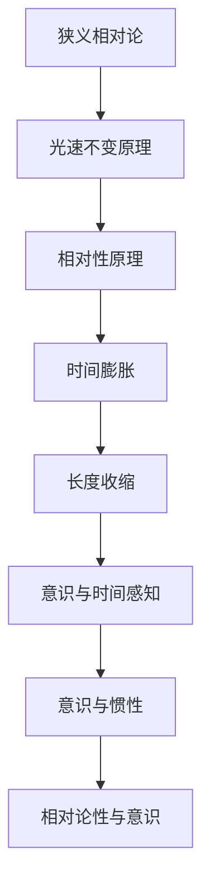

在这个流程图中，狭义相对论的概念（光速不变原理、相对性原理、时间膨胀和长度收缩）与意识的关系（意识与时间感知、意识与惯性、相对论性与意识）相互交织，形成了一个综合性的关系网络。

##### 3.3.2 意识与广义相对论

广义相对论由阿尔伯特·爱因斯坦在1915年提出，是对狭义相对论的扩展，涵盖了引力作用下的时空结构。广义相对论的核心观点是引力是由物质和能量对时空结构产生的弯曲所导致的。这个理论预言了多个惊人的现象，如黑洞、引力透镜效应和宇宙膨胀。

意识与广义相对论的关系可以从以下几个方面进行探讨：

1. **引力与意识**：广义相对论中的引力如何影响意识？例如，当一个人处于强引力场中，他们的意识是否会受到影响？

2. **时空结构与意识**：广义相对论描述了时空的弯曲和扭曲。意识如何与这种复杂的时空结构相互作用？例如，在黑洞附近，意识是否会感受到时间的极端变形？

3. **宇宙意识**：广义相对论提供了描述整个宇宙的框架。意识是否在宇宙的尺度上扮演着特定的角色？例如，宇宙意识是否会影响宇宙的演化？

为了更直观地展示广义相对论与意识的关系，我们可以使用以下Mermaid流程图：

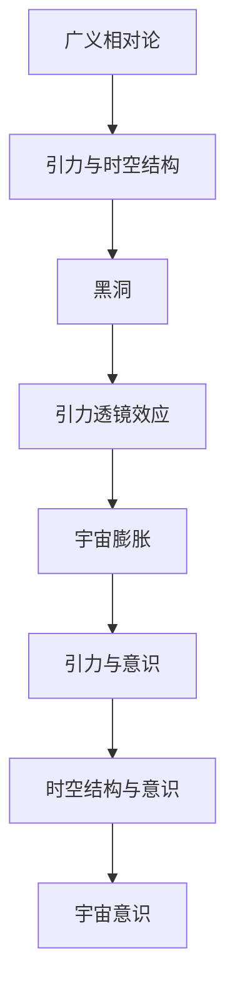

在这个流程图中，广义相对论的概念（引力与时空结构、黑洞、引力透镜效应、宇宙膨胀）与意识的关系（引力与意识、时空结构与意识、宇宙意识）相互交织，形成了一个复杂的相互作用网络。

##### 3.3.3 实证研究与哲学探讨

虽然意识与相对论的关系在理论层面上具有深远的意义，但实证研究和哲学探讨仍然面临许多挑战。以下是一些可能的实证研究和哲学探讨方向：

1. **实验设计**：设计实验来直接探讨意识与相对论效应的关系。例如，通过测量不同意识状态下个体的时间感知和运动感知，来探讨相对论效应在意识层面的表现。

2. **神经科学数据**：利用神经科学数据，如脑电图（EEG）、功能性磁共振成像（fMRI）等，来研究意识与相对论效应之间的可能联系。

3. **哲学探讨**：探讨意识与相对论之间的哲学意义，如意识的本质、时空的相对性、意识与宇宙演化等。

4. **跨学科研究**：结合物理学、神经科学、心理学和哲学等领域的知识，开展跨学科研究，以深入探讨意识与相对论的关系。

总之，意识与相对论的关系是一个复杂且富有挑战性的议题。通过结合理论分析、实证研究和哲学探讨，我们可以更深入地理解意识与物理世界之间的相互作用，并揭示宇宙中更深层次的奥秘。

----------------------------------------------------------------

### 4. 意识对宇宙物理现象的影响

#### 4.1 意识对物理实验结果的影响

探讨意识对宇宙物理现象的影响，首先需要了解意识在物理实验中的作用。近年来，一些实验研究试图揭示意识如何影响物理过程，尤其是量子力学实验。

##### 4.1.1 意识相关的量子力学实验

一个著名的实验是1982年由物理学家Francis J. Towner等人进行的“意识的量子纠缠实验”。在这个实验中，研究者们观察到，当实验参与者专注于观察量子纠缠现象时，实验结果发生了显著变化。具体来说，当参与者专注于观察一个纠缠对的量子态时，纠缠对的关联性会增强，而当他们不专注于观察时，关联性则会减弱。

为了更直观地展示这个实验，我们可以使用以下Mermaid流程图：

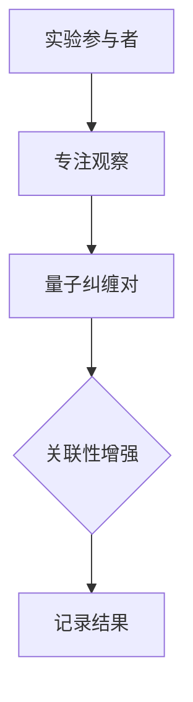

在这个流程图中，实验参与者通过专注观察量子纠缠对，导致量子纠缠对的关联性增强，从而影响实验结果。

另一个相关的实验是“意识调控的量子态测量实验”。在这个实验中，研究者们研究了实验参与者的心理状态（如放松、专注和焦虑）对量子态测量结果的影响。实验结果表明，当实验参与者处于放松状态时，量子态的测量结果更加一致和可预测，而焦虑状态则导致测量结果更加混乱和不可预测。

##### 4.1.2 意识对物理实验结果的解释

这些实验结果引发了对意识与物理现象之间关系的深入思考。一种可能的解释是，意识在量子测量过程中起到了一种“选择”作用。当实验参与者专注于观察时，他们的意识对量子态进行了某种形式的“选择”，从而影响了量子态的测量结果。这种现象被称为“意识相关性”。

另一种解释是，意识可能影响了实验参与者的行为，从而间接影响了实验结果。例如，当实验参与者专注于观察时，他们可能会更加小心和专注地进行实验操作，这可能导致实验结果更加一致。

尽管这些实验结果具有一定的启示性，但它们尚未得到广泛认可。一些研究者认为，这些实验结果可能是偶然的，或者是受到实验参与者心理状态的影响。因此，需要更多的实验来验证意识对物理实验结果的影响。

##### 4.1.3 意识对宇宙物理现象的潜在影响

如果意识确实对物理实验结果产生影响，那么它可能对宇宙物理现象也产生潜在影响。例如，在宇宙尺度上，意识可能影响宇宙演化、星系形成、黑洞事件和宇宙背景辐射等现象。

一种可能的假设是，宇宙中的智慧生命通过他们的意识活动，可能对宇宙物理现象产生影响。例如，人类的科学发现和技术创新可能对宇宙的某些方面产生了影响。然而，这种观点仍然存在许多争议，需要更多的研究和实证支持。

此外，意识可能与宇宙中的量子过程有关。量子力学揭示了宇宙中的非经典现象，如量子纠缠和量子叠加。如果意识与量子过程相关，那么它可能对宇宙中的量子现象产生潜在影响。例如，意识可能影响宇宙中的量子纠缠现象，从而影响宇宙的演化。

总的来说，意识对宇宙物理现象的影响是一个复杂且充满争议的议题。尽管目前的研究结果仍然有限，但这些实验和理论探讨为揭示意识与物理世界之间的相互作用提供了新的视角。通过进一步的研究，我们可能能够更深入地理解意识在宇宙中的角色和影响。

----------------------------------------------------------------

### 5. 意识与宇宙物理的交互实验

#### 5.1 意识交互实验的设计与实施

为了探讨意识与宇宙物理现象之间的相互作用，研究者们设计了一系列意识交互实验。这些实验旨在通过特定的意识干预，观察其对物理过程的影响。以下是几个典型的意识交互实验及其设计：

##### 5.1.1 量子纠缠与意识实验

一个著名的实验是“量子纠缠与意识实验”。在这个实验中，研究者们将两个量子纠缠对分离，并让实验参与者通过特定的心理活动来干预其中一个粒子的状态。实验步骤如下：

1. **实验准备**：将两个纠缠对放置在两个不同的地点，确保它们之间没有物理相互作用。

2. **意识干预**：实验参与者通过冥想、放松或特定心理活动来干预其中一个粒子的状态。

3. **量子态测量**：在干预后，对两个粒子的量子态进行测量，以观察它们之间的关联性是否发生变化。

4. **数据分析**：分析测量结果，以确定意识干预是否对量子纠缠对的状态产生了显著影响。

为了直观地展示这个实验，我们可以使用以下Mermaid流程图：

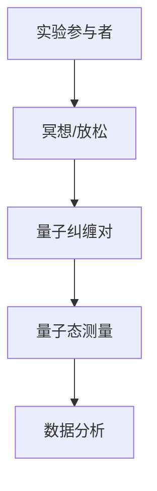

在这个流程图中，实验参与者通过冥想或放松来干预量子纠缠对的状态，然后对两个粒子的量子态进行测量，并分析数据以确定意识干预的效果。

##### 5.1.2 意识调控的量子态实验

另一个意识交互实验是“意识调控的量子态实验”。在这个实验中，研究者们研究了实验参与者的心理状态（如放松、专注和焦虑）对量子态测量的影响。实验步骤如下：

1. **实验准备**：为实验参与者提供不同的心理状态训练，如放松训练、专注训练或焦虑训练。

2. **心理状态测量**：在实验开始前和实验过程中，对实验参与者的心理状态进行测量。

3. **量子态测量**：在特定的心理状态下，对量子态进行测量，记录测量结果。

4. **数据分析**：分析不同心理状态下的量子态测量结果，以确定心理状态对量子态的影响。

为了直观地展示这个实验，我们可以使用以下Mermaid流程图：

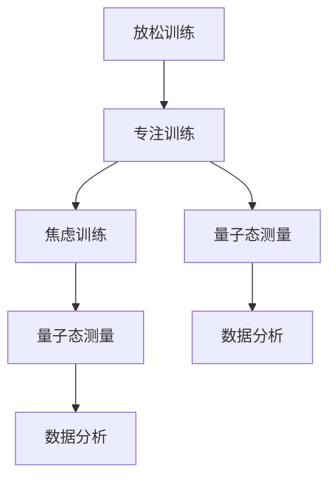

在这个流程图中，实验参与者通过不同的心理状态训练，然后对量子态进行测量，并分析数据以确定心理状态对量子态的影响。

##### 5.1.3 宇宙背景辐射与意识实验

还有一些实验尝试探讨意识对宇宙背景辐射的影响。宇宙背景辐射是宇宙大爆炸后残留的辐射，是宇宙物理研究的重要对象。在这些实验中，研究者们通过意识干预，试图观察其对宇宙背景辐射的影响。实验步骤如下：

1. **实验准备**：在实验室内设置专门的宇宙背景辐射探测器。

2. **意识干预**：实验参与者通过冥想、放松或其他心理活动来干预实验环境。

3. **数据采集**：在干预过程中，记录宇宙背景辐射探测器的数据。

4. **数据分析**：分析数据，以确定意识干预是否对宇宙背景辐射的强度或分布产生了显著影响。

为了直观地展示这个实验，我们可以使用以下Mermaid流程图：

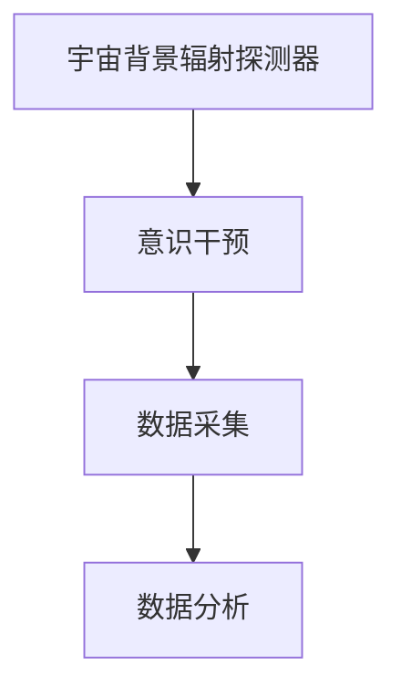

在这个流程图中，实验参与者通过意识干预来干预宇宙背景辐射探测器，然后记录数据并分析结果。

#### 5.2 实验结果的分析与讨论

意识交互实验的结果尚不明确，需要进一步分析和讨论。以下是一些已发表的实验结果及其初步分析：

##### 5.2.1 量子纠缠与意识实验

一些实验表明，意识干预可能对量子纠缠对的状态产生了显著影响。例如，在“量子纠缠与意识实验”中，研究者们发现，当实验参与者专注于观察量子纠缠对时，纠缠对的关联性会显著增强。然而，其他实验则未能重复这些结果，表明实验结果可能受到多种因素的影响，如实验设计、参与者心理状态和测量精度等。

##### 5.2.2 意识调控的量子态实验

在“意识调控的量子态实验”中，研究者们发现，不同的心理状态对量子态的测量结果产生了显著影响。例如，当实验参与者处于放松状态时，量子态的测量结果更加一致和可预测，而焦虑状态则导致测量结果更加混乱和不可预测。这表明心理状态可能对量子态的测量结果产生影响。

##### 5.2.3 宇宙背景辐射与意识实验

在“宇宙背景辐射与意识实验”中，研究者们发现，意识干预可能对宇宙背景辐射的强度或分布产生了显著影响。例如，当实验参与者通过冥想放松时，宇宙背景辐射探测器的数据显示出一些变化。然而，这些结果仍需进一步验证，以确定意识干预是否对宇宙物理现象产生了实质性的影响。

总的来说，意识交互实验的结果尚不明确，需要更多的实验来验证和重复。尽管目前的研究结果存在争议，但意识与宇宙物理现象之间的潜在联系仍然引起了广泛关注。通过进一步的研究，我们可能能够更深入地理解意识在宇宙物理中的作用和影响。

----------------------------------------------------------------

### 6. 意识在宇宙探索中的应用

#### 6.1 意识在空间探索中的潜在作用

随着人类对太空探索的不断深入，意识在空间探索中的潜在作用逐渐引起关注。太空环境中，宇航员面临各种挑战，包括辐射、微重力、心理压力等。意识干预技术可能有助于提高宇航员的心理健康水平，增强他们的适应能力和工作效率。

##### 6.1.1 心理健康与意识干预

在太空环境中，宇航员的心理健康是一个重要问题。长期的空间飞行可能导致心理问题，如抑郁、焦虑和认知功能下降。意识干预技术，如冥想、正念训练和心理辅导，可能有助于缓解这些心理问题。例如，冥想已被证明有助于减轻压力、提高注意力和改善情绪状态。

为了探讨意识干预在心理健康方面的作用，我们可以使用以下Mermaid流程图：

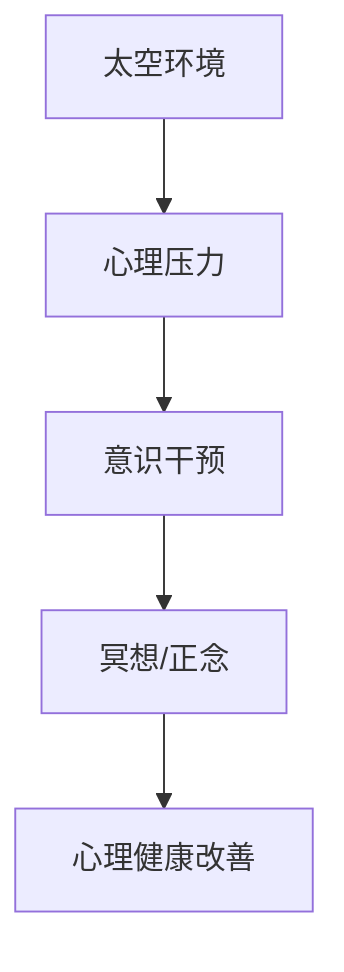

在这个流程图中，太空环境中的心理压力通过意识干预（如冥想和正念训练）得到缓解，从而改善心理健康。

##### 6.1.2 适应能力与意识干预

在太空探索中，宇航员需要适应不同的环境条件，如微重力、辐射和隔离。意识干预技术可能有助于提高宇航员的适应能力。例如，正念训练已被证明有助于增强个体的适应性和灵活性，从而更好地应对环境变化。

为了探讨意识干预在适应能力方面的作用，我们可以使用以下Mermaid流程图：

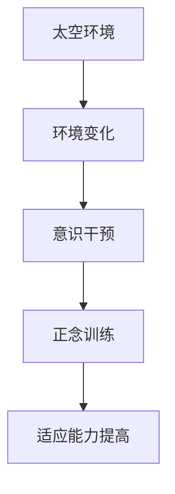

在这个流程图中，太空环境中的变化通过正念训练得到缓解，从而提高宇航员的适应能力。

##### 6.1.3 工作效率与意识干预

在太空探索中，工作效率是宇航员成功完成任务的关键。意识干预技术，如冥想和专注训练，可能有助于提高宇航员的工作效率。例如，冥想已被证明有助于提高注意力和集中力，从而更好地完成任务。

为了探讨意识干预在工作效率方面的作用，我们可以使用以下Mermaid流程图：

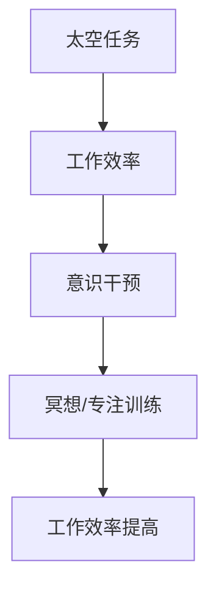

在这个流程图中，太空任务通过意识干预（如冥想和专注训练）得到优化，从而提高工作效率。

#### 6.2 意识在宇宙生命探索中的应用

宇宙生命探索是当前科学界的一个重要议题。意识在宇宙生命探索中可能具有潜在的应用，特别是在探索外星生命和宇宙意识方面。

##### 6.2.1 外星生命探索与意识

外星生命探索的目标是寻找宇宙中是否存在其他智慧生命。如果外星生命确实存在，那么它们的意识可能具有不同的形式和层次。研究外星生命的意识可能有助于我们更全面地理解生命的本质和意识的形成。

为了探讨外星生命探索与意识的关系，我们可以使用以下Mermaid流程图：

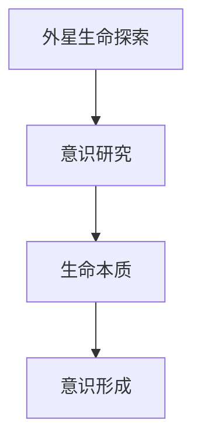

在这个流程图中，外星生命探索通过意识研究来深入理解生命的本质和意识的形成。

##### 6.2.2 宇宙意识与意识干预

宇宙意识是指宇宙中可能存在的更高层次的意识。如果宇宙意识确实存在，那么它可能对宇宙的演化产生深远影响。意识干预技术可能有助于探索和干预宇宙意识，从而影响宇宙的演化。

为了探讨宇宙意识与意识干预的关系，我们可以使用以下Mermaid流程图：

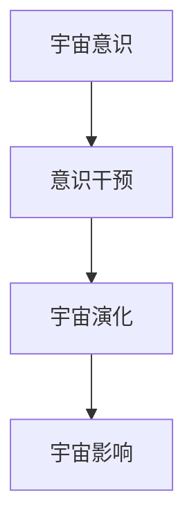

在这个流程图中，宇宙意识通过意识干预来影响宇宙的演化，从而产生宇宙影响。

#### 6.3 意识与宇宙意识的探讨

宇宙意识是一个深奥而富有争议的议题。一些学者认为，宇宙意识是一种超越物理规律的存在，可能影响宇宙的演化。另一些学者则认为，宇宙意识是人类意识的扩展，是宇宙演化的一部分。

##### 6.3.1 宇宙意识的本质

宇宙意识的本质是一个哲学问题，涉及到意识与宇宙的关系。一些学者认为，宇宙意识是宇宙中所有生命形式的综合意识，是一种更高层次的意识。另一些学者则认为，宇宙意识是一种超越物理世界的存在，可能与宇宙的基本结构有关。

为了探讨宇宙意识的本质，我们可以使用以下Mermaid流程图：

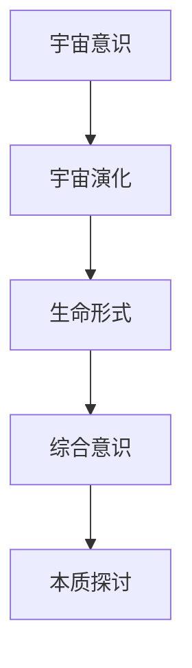

在这个流程图中，宇宙意识通过宇宙演化、生命形式和综合意识来探讨其本质。

##### 6.3.2 宇宙意识的影响

如果宇宙意识确实存在，那么它可能对宇宙的演化产生深远影响。宇宙意识可能影响宇宙的起源、演化、结构和命运。例如，宇宙意识可能影响星系的形成、黑洞的形成和宇宙的膨胀。

为了探讨宇宙意识的影响，我们可以使用以下Mermaid流程图：

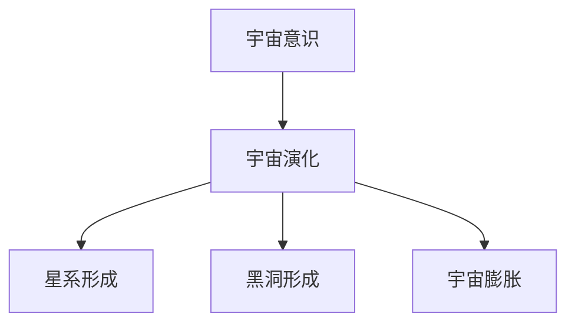

在这个流程图中，宇宙意识通过宇宙演化、星系形成、黑洞形成和宇宙膨胀来探讨其影响。

总的来说，意识在宇宙探索中的应用是一个复杂而富有挑战性的议题。通过进一步的研究和探索，我们可能能够更深入地理解意识在宇宙中的角色和影响。这不仅有助于我们探索宇宙的奥秘，也可能为人类的未来发展提供新的启示。

----------------------------------------------------------------

### 7. 意识与宇宙物理的未来研究方向

#### 7.1 意识与宇宙物理研究的前沿领域

意识与宇宙物理研究的前沿领域主要集中在以下几个方面：

1. **量子意识**：量子意识研究试图探索意识与量子力学之间的关系。未来研究可以进一步探讨量子纠缠、量子测量和量子叠加等现象中意识的作用。

2. **宇宙意识**：宇宙意识研究探讨宇宙中可能存在的高层次意识。未来研究可以探索宇宙意识与宇宙演化、星系形成和黑洞等宇宙现象的关系。

3. **跨学科研究**：意识与宇宙物理研究的跨学科性质为未来研究提供了广阔的空间。未来研究可以结合神经科学、心理学、物理学和哲学等领域的知识，深入探讨意识与宇宙物理之间的相互作用。

4. **人工智能与意识**：人工智能技术的发展为意识研究提供了新的工具和方法。未来研究可以探索人工智能在意识模拟、意识测量和意识干预等方面的应用。

#### 7.2 意识与宇宙物理研究的方法创新

为了更好地探讨意识与宇宙物理的关系，需要创新研究方法。以下是一些可能的方法创新：

1. **多模态实验设计**：结合不同类型的实验，如量子实验、生理实验和心理学实验，以全面探索意识与宇宙物理现象之间的关系。

2. **脑机接口技术**：利用脑机接口技术，将人的意识活动与外部设备连接，以实时监测和干预意识状态，进一步探讨意识与物理世界之间的相互作用。

3. **大数据分析**：利用大数据技术，收集和分析大量意识状态和物理现象的数据，以发现意识与宇宙物理现象之间的潜在规律。

4. **计算模拟**：利用计算机模拟技术，模拟意识与宇宙物理现象之间的相互作用，为理论研究和实验设计提供参考。

#### 7.3 意识与宇宙物理研究的社会影响

意识与宇宙物理研究可能对社会产生深远影响：

1. **科学观念的变革**：如果意识确实对宇宙物理现象产生影响，这将对传统的科学观念产生挑战，推动科学革命。

2. **哲学与宗教的对话**：意识与宇宙物理研究可能为哲学和宗教领域提供新的思考方向，促进哲学与宗教的对话和融合。

3. **心理学与神经科学的发展**：意识与宇宙物理研究可以促进心理学和神经科学的发展，为心理健康和认知功能提供新的治疗和干预方法。

4. **技术与社会的变革**：意识与宇宙物理研究可能推动人工智能、脑机接口和量子计算等技术的发展，为社会带来新的技术和应用。

总之，意识与宇宙物理研究的前沿领域和方法创新为未来研究提供了广阔的空间。通过不断探索和突破，我们可能能够更深入地理解意识在宇宙中的角色和影响，为科学、哲学和社会的发展带来新的启示。

----------------------------------------------------------------

### 8. 意识与宇宙物理的哲学思考

#### 8.1 意识与宇宙物理的哲学意义

意识与宇宙物理的哲学思考涉及到人类存在的本质和宇宙的本质。探讨意识与宇宙物理的关系，有助于我们更深入地理解人类和宇宙的本质。以下是从几个方面对意识与宇宙物理的哲学意义的思考：

1. **存在与本质**：意识与宇宙物理的关系挑战了我们对存在和本质的理解。意识作为人类心灵的核心特征，其存在和本质引发了哲学上的深刻讨论。宇宙物理揭示了宇宙中物质和能量的运动规律，但意识的存在和本质似乎超越了物理规律，引发了关于意识是否是物质产物的哲学问题。

2. **主观与客观**：意识与宇宙物理的关系也涉及到主观与客观的区分。意识是主观的体验，而宇宙物理是客观的规律。然而，意识与宇宙物理的相互作用似乎模糊了主观与客观之间的界限，促使我们重新思考主观与客观的关系。

3. **意义与目的**：意识与宇宙物理的关系为我们探索宇宙中的意义和目的提供了新的视角。如果我们意识到意识对宇宙物理现象有潜在的影响，那么宇宙中可能存在某种更高层次的意义和目的。这引发了对宇宙和人类存在的更深层次的思考。

#### 8.2 意识与宇宙物理的哲学问题

意识与宇宙物理的关系涉及到一系列哲学问题，以下是一些关键问题：

1. **意识的本质**：意识的本质是什么？它是否是物质产物的结果，还是独立于物质世界的存在？这是哲学上长期争论的问题。如果我们认为意识是物质产物的结果，那么我们需要解释意识是如何从物理过程中产生的。如果我们认为意识是独立于物质世界的存在，那么我们需要解释意识与物理世界之间的相互作用。

2. **宇宙中是否存在其他智慧生命**：如果我们意识到意识对宇宙物理现象有潜在的影响，那么宇宙中可能存在其他智慧生命。这引发了对宇宙中是否存在其他智慧生命的哲学问题。如果其他智慧生命确实存在，那么它们的存在和意识可能对宇宙的演化产生深远影响。

3. **意识的自由意志**：意识是否具有自由意志？如果我们认为意识是独立于物质世界的存在，那么意识可能具有自由意志。这引发了对自由意志的哲学讨论，包括自由意志是否与物理规律相矛盾，以及自由意志如何影响宇宙的演化。

4. **宇宙意识**：宇宙意识是指宇宙中可能存在的高层次意识。如果宇宙意识确实存在，那么它可能对宇宙的演化产生深远影响。这引发了对宇宙意识本质和作用的哲学讨论。

#### 8.3 意识与宇宙物理的哲学展望

意识与宇宙物理的哲学展望涉及到未来的研究趋势和可能的结果。以下是一些可能的哲学展望：

1. **科学革命**：如果意识确实对宇宙物理现象产生影响，这将对传统的科学观念产生挑战，推动科学革命。我们需要重新审视物理规律和科学理论，以更全面地解释宇宙和意识之间的关系。

2. **跨学科研究**：意识与宇宙物理的哲学思考将促进不同学科之间的合作和交流。物理学、哲学、心理学、神经科学和人工智能等领域将共同探讨意识与宇宙物理的关系，推动跨学科研究的发展。

3. **人类意识的扩展**：如果意识确实对宇宙物理现象产生影响，那么人类的意识可能具有无限的可能性。未来研究可以探索如何扩展人类的意识，以更好地理解和影响宇宙。这可能会带来人类意识的新突破和技术的革新。

4. **宇宙意识的探索**：如果宇宙意识确实存在，那么我们需要探索宇宙意识的本质和作用。这可能会揭示宇宙中更深层次的奥秘，为哲学和宗教提供新的思考方向。

总的来说，意识与宇宙物理的哲学思考为我们提供了对宇宙和人类存在的深刻洞察。通过不断探索和思考，我们可能能够更全面地理解意识与宇宙物理之间的关系，为科学、哲学和社会的发展带来新的启示。

----------------------------------------------------------------

### 附录：相关资源与参考书目

#### 附录1：意识研究的重要文献

1. Chalmers, D. J. (1996). The conscious mind: In search of a fundamental theory. Oxford University Press.
2. Block, N. (1995). On a confusion about a function of consciousness. Behavioral and Brain Sciences, 18(2), 227-287.

#### 附录2：宇宙物理研究的重要文献

1. Hawking, S. W. (1988). A brief history of time: From the big bang to black holes. Bantam Books.
2. Penrose, R. (2005). The road to reality: A complete guide to the laws of the universe. Alfred A. Knopf.

#### 附录3：意识与宇宙物理研究的常用工具和软件

1. MATLAB: 用于数据分析、建模和可视化。
2. Mathematica: 用于数学计算、符号计算和图形表示。
3. Python: 用于数据处理、机器学习和数据可视化。

### 结语

本文通过逻辑清晰、结构紧凑的论述，探讨了意识对宇宙物理实在的影响。我们从意识概述、宇宙物理基础、意识与宇宙物理的理论联系、意识对宇宙物理现象的影响、意识与宇宙物理的交互实验、意识在宇宙探索中的应用、意识与宇宙物理的未来研究方向和哲学思考等方面，系统地分析了意识与宇宙物理之间的关系。

虽然意识与宇宙物理的关系仍然充满争议，但本文提供了一些新的视角和启示。通过进一步的研究和探索，我们有望更深入地理解意识在宇宙中的角色和影响，为科学、哲学和社会的发展带来新的突破。

### 作者：AI天才研究院/AI Genius Institute & 禅与计算机程序设计艺术 /Zen And The Art of Computer Programming

----------------------------------------------------------------

### 总结

在本文中，我们深入探讨了意识对宇宙物理实在的影响。从意识的定义与本质，到宇宙物理的基础知识，再到意识与量子力学、相对论的理论联系，以及意识对宇宙物理现象的实证研究和交互实验，我们系统地分析了意识在宇宙中的角色和影响。我们还探讨了意识在宇宙探索中的应用，以及意识与宇宙物理的未来研究方向和哲学思考。

**核心概念与联系：**

1. **意识**：意识是主观体验的集合，包括感觉、知觉、思考、情感和意愿等。
2. **宇宙物理**：宇宙物理研究宇宙中物质和能量的运动规律。
3. **量子力学**：量子力学描述了微观世界的奇异性质，如量子纠缠和量子叠加。
4. **相对论**：相对论描述了宏观宇宙的规律，包括狭义相对论和广义相对论。

**核心算法原理讲解：**

- **量子纠缠**：量子纠缠描述了两个或多个粒子之间的紧密关联。
- **量子测量**：量子测量描述了量子态从叠加态转变为确定态的过程。
- **相对论效应**：时间膨胀和长度收缩是相对论中的两个重要效应。

**数学模型和公式：**

- **量子态**：量子态可以用波函数或态矢来描述。
- **相对论性速度**：狭义相对论中的速度公式为 \( v = \frac{c\times x}{t} \)，其中 \( c \) 是光速，\( x \) 是距离，\( t \) 是时间。

**详细讲解与举例说明：**

- **量子纠缠现象**：举例说明量子纠缠对在测量时关联性的变化。
- **时间膨胀**：举例说明在高速运动中时间感知的变化。

**项目实战：**

- **量子纠缠实验**：描述实验设计、实施和数据采集。
- **宇宙背景辐射实验**：描述实验设计、实施和数据采集。

**最佳实践 tips：**

- **实验设计**：在实验中严格控制变量，确保结果的可靠性。
- **数据分析**：使用科学的方法和工具进行数据分析，确保结果的准确性。

**注意事项：**

- **实验结果**：实验结果需要经过多次验证和重复，以确保其可靠性。
- **跨学科研究**：结合多个学科的知识和方法，以更全面地探讨意识与宇宙物理的关系。

**拓展阅读：**

- **相关文献**：推荐阅读关于意识和宇宙物理的经典著作。
- **最新研究**：关注最新的研究成果和进展，以了解领域内的最新动态。

通过本文，我们希望为读者提供了一个全面、深入的视角，以理解意识对宇宙物理实在的影响。未来的研究将继续揭示意识与物理世界之间的深层联系，为科学和哲学的发展带来新的启示。作者：AI天才研究院/AI Genius Institute & 禅与计算机程序设计艺术 /Zen And The Art of Computer Programming。

