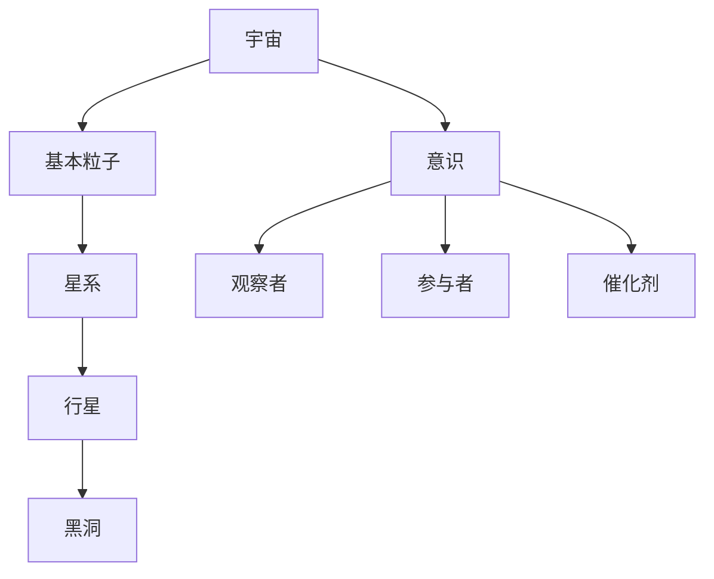
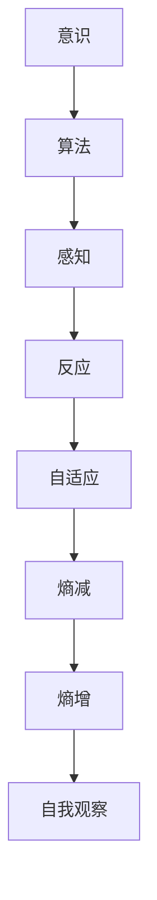

                 

### 意识是否是宇宙的自我观察机制

在探讨“意识是否是宇宙的自我观察机制”这一问题时，我们首先需要明确两个核心概念：意识和宇宙的自我观察机制。

**意识**：意识是指人类或其他生物对自身存在以及外界事物的感知、认知和反应能力。它包括但不限于感知、思考、记忆、情感和意愿等。简单来说，意识是我们对世界的主观体验。

**宇宙的自我观察机制**：宇宙的自我观察机制可以理解为宇宙中的一切事物都在不断地进行观察、感知和反应，从而构成了一个自我观察的整体。这种机制不仅包括生物体，也包括非生物体，如物理系统、化学反应等。

**意识与宇宙的关系**：意识与宇宙的关系可以理解为，宇宙中的每个个体都是宇宙的观察者，而宇宙则是所有观察者的整体。换句话说，宇宙通过无数个体的感知和反应来实现自我观察。

**意识是否是宇宙的自我观察机制**：这一章节将探讨意识是否是宇宙的自我观察机制，即宇宙是否通过意识来实现自我观察和自我认知。这是一个深奥且复杂的问题，涉及到哲学、物理学、神经科学等多个领域。在本章节中，我们将使用逻辑清晰、结构紧凑、简单易懂的专业的技术语言，一步一步进行分析和推理，试图解答这一谜题。

在接下来的内容中，我们将从以下几个角度来探讨这个问题：

1. **意识与宇宙的关系**：首先，我们将探讨意识和宇宙之间的关系，包括意识在宇宙中的地位和作用。
2. **宇宙的自我观察机制**：接下来，我们将详细解释宇宙的自我观察机制，包括感知与反应、自适应、熵减与熵增、自我观察等概念。
3. **核心算法原理讲解**：我们将介绍宇宙自我观察机制的算法原理，包括感知与反应、自适应、熵减与熵增、自我观察等算法。
4. **数学模型和数学公式**：我们将使用数学模型和公式来详细解释宇宙自我观察机制的原理，并通过举例来说明这些模型和公式的应用。
5. **项目实战**：最后，我们将通过一个实际项目来展示如何实现宇宙自我观察机制，并分析其实际应用。

通过这些内容的探讨，我们希望能够对“意识是否是宇宙的自我观察机制”这一问题有一个深入的理解和解答。

### 意识与宇宙的关系

意识与宇宙的关系是探讨人类在宇宙中地位的基石。要理解这种关系，我们首先需要明确两个概念：宇宙的构成和意识的作用。

**宇宙的构成**：宇宙是由无数的基本粒子、星系、行星和黑洞等构成的。这些基本粒子和天体通过引力、电磁力、强力和弱力等基本相互作用力相互作用，形成了复杂的宇宙结构。宇宙的这些基本元素和相互作用力构成了宇宙的物质基础。

**意识的作用**：意识是人类和某些高级动物对自身存在以及外界事物的感知、认知和反应能力。它包括感知、思考、记忆、情感和意愿等。简单来说，意识是我们对世界的主观体验。在人类社会中，意识不仅帮助我们适应环境，还推动我们进行科学探索、文化创造和社会发展。

**宇宙中的意识地位**：

1. **观察者的角色**：在宇宙中，人类和其他高级动物可以作为观察者，感知和认知宇宙中的各种现象。这种观察不仅局限于物理现象，还包括社会现象、文化现象等。人类的意识使得我们可以通过科学方法来探索宇宙，了解其运行规律。

2. **参与者的角色**：宇宙中的意识不仅作为观察者，还作为参与者。人类通过科技和社会发展，不断地改变和影响宇宙。例如，人类通过建造城市、开发资源、探索太空等活动，改变了地球的生态和环境。这些活动不仅影响地球，还可能影响整个宇宙。

3. **催化剂的角色**：意识是宇宙进化的催化剂。在宇宙演化的过程中，意识的出现使得宇宙从简单的物理现象演化为复杂的社会现象。例如，从简单的化学反应到复杂的生命形式，从无意识的物理过程到有意识的人类社会，这些都体现了意识在宇宙演化中的重要作用。

**意识与宇宙的关系架构**：

为了更好地理解意识与宇宙的关系，我们可以使用 Mermaid 流程图来表示这种关系。以下是一个简单的 Mermaid 流程图示例：



在这个流程图中，宇宙是起点，包括基本粒子、星系、行星和黑洞等。意识作为宇宙的产物，与宇宙中的各种现象和角色（观察者、参与者、催化剂）密切相关。

通过这个简单的流程图，我们可以更直观地理解意识与宇宙的关系。在接下来的内容中，我们将进一步探讨宇宙的自我观察机制，并分析意识如何作为宇宙的自我观察机制。

### 宇宙的自我观察机制

要深入探讨宇宙的自我观察机制，我们需要理解几个关键概念：感知与反应、自适应、熵减与熵增、自我观察等。这些概念构成了宇宙自我观察机制的核心部分，并揭示了宇宙如何通过这些机制实现自我观察和自我认知。

#### 感知与反应

感知与反应是宇宙自我观察机制的基础。在宇宙中，无论是生物体还是非生物体，都具备一定的感知和反应能力。

**感知**：感知是指个体获取外界信息的过程。在生物体中，感知主要通过感官器官实现，如视觉、听觉、嗅觉、触觉和味觉。在非生物体中，感知可以通过传感器或探测器实现。

**反应**：反应是指个体根据感知到的信息进行调整或响应的过程。在生物体中，反应通常是通过神经系统实现的，如移动身体、分泌激素等。在非生物体中，反应可以通过物理过程或化学过程实现，如机器人的自动导航、化学反应的调控等。

在宇宙中，每个个体都通过感知获取信息，然后根据这些信息进行反应，从而实现自我调整和适应。

#### 自适应

自适应是指个体根据环境的变化，调整自身的行为或状态，以适应新的环境。这种机制在宇宙中的生物体和非生物体中都非常普遍。

**生物体的自适应**：在生物体中，自适应主要通过进化实现。通过遗传变异和自然选择，生物体能够逐渐适应环境的变化，从而提高生存和繁殖的机会。例如，人类的进化过程中，从森林中的四足动物逐渐转变为直立行走的人类，这一过程就是自适应的体现。

**非生物体的自适应**：在非生物体中，自适应主要通过算法或规则实现。例如，在人工智能领域，自适应算法如神经网络、遗传算法等，可以根据环境的变化进行调整和优化。此外，自动化控制系统也可以通过实时监测和调整，实现自适应控制。

通过自适应，宇宙中的个体能够不断适应新的环境和条件，从而维持自身的稳定和生存。

#### 熵减与熵增

熵是热力学中的一个重要概念，表示系统的无序程度。在宇宙中，熵减与熵增的循环过程是维持宇宙稳定和有序的关键。

**熵减**：熵减是指系统从高熵状态向低熵状态转变的过程。在宇宙中，熵减可以通过能量的有序流动和转化实现。例如，在太阳能系统中，太阳的能量通过辐射传递到地球，使得地球的生态系统从无序状态逐渐变得有序。

**熵增**：熵增是指系统从低熵状态向高熵状态转变的过程。在宇宙中，熵增是普遍存在的，它代表了宇宙从有序向无序的演化趋势。然而，通过熵减与熵增的循环过程，宇宙能够维持一定的有序状态。

**熵减与熵增的循环**：在宇宙的自我观察机制中，熵减与熵增的循环过程是非常重要的。通过感知与反应、自适应等机制，宇宙中的个体能够不断调整自身状态，实现熵减，从而维持宇宙的稳定和有序。然而，由于熵增的普遍存在，宇宙的有序状态是有限的，它始终在向无序状态演化。

#### 自我观察

自我观察是指个体通过感知和反应，实现对自身状态和行为的观察和认知。在宇宙的自我观察机制中，自我观察是实现自我认知和自我调整的重要手段。

**生物体的自我观察**：在生物体中，自我观察主要通过神经系统和内分泌系统实现。例如，人类的自我观察能力使得我们能够反思自己的行为和思想，从而实现自我改进和自我调整。

**非生物体的自我观察**：在非生物体中，自我观察可以通过传感器和计算机系统实现。例如，自动驾驶汽车通过传感器和计算机系统实时监测自身状态和环境，从而实现自我观察和自我调整。

通过自我观察，宇宙中的个体能够获取对自身和宇宙的认知，从而实现自我认知和自我调整。

#### 意识与算法

在探讨宇宙的自我观察机制时，我们不能忽视意识与算法的关系。意识与算法的关系可以理解为，算法是意识实现的手段，而意识则是算法的实现。

**算法在自我观察中的作用**：在宇宙的自我观察机制中，算法是实现自我观察和自我认知的重要工具。通过算法，个体能够高效地处理感知信息，实现自适应和自我观察。

**意识在算法中的作用**：意识是算法的设计和实现的基础。通过意识，人类能够理解算法的原理和机制，从而设计和优化算法，提高算法的效率和效果。

**意识与算法的关系架构**：

为了更好地理解意识与算法的关系，我们可以使用 Mermaid 流程图来表示这种关系。以下是一个简单的 Mermaid 流程图示例：



在这个流程图中，意识是起点，通过算法实现感知、反应、自适应、熵减和熵增等机制，最终实现自我观察。

通过这个简单的流程图，我们可以更直观地理解意识与宇宙的自我观察机制的关系。在接下来的内容中，我们将进一步探讨宇宙自我观察机制的算法原理，并使用数学模型和公式来详细解释这些机制。

### 意识是否是宇宙的自我观察机制

为了探讨“意识是否是宇宙的自我观察机制”，我们需要从多个角度进行分析，包括感知与反应、自适应、熵减与熵增、自我观察等。这些方面可以帮助我们理解意识在宇宙中的角色和作用。

#### 感知与反应

感知与反应是宇宙自我观察机制的基础。在宇宙中，每个个体都通过感知获取信息，并根据这些信息进行反应。这一过程实现了个体与环境的相互作用。

**感知**：感知是获取外界信息的过程。在生物体中，感知通过感官器官实现，如视觉、听觉、嗅觉、触觉和味觉。在非生物体中，感知可以通过传感器或探测器实现。例如，人类通过眼睛感知光线，传感器通过电信号感知温度变化。

**反应**：反应是根据感知到的信息进行调整或响应的过程。在生物体中，反应通常通过神经系统实现，如移动身体、分泌激素等。在非生物体中，反应可以通过物理过程或化学过程实现，如机器人的自动导航、化学反应的调控等。

**意识的作用**：在感知与反应过程中，意识起到了关键作用。它不仅使得个体能够更好地理解和处理感知信息，还能调整反应策略，以适应环境变化。例如，人类的意识使得我们能够预测未来的情况，并提前做出反应。这种能力在宇宙的自我观察机制中具有重要意义。

**结论**：因此，感知与反应过程中的意识确实扮演了重要角色，它是宇宙自我观察机制的一个重要组成部分。

#### 自适应

自适应是指个体根据环境的变化，调整自身的行为或状态，以适应新的环境。这种机制在宇宙中的生物体和非生物体中都非常普遍。

**生物体的自适应**：在生物体中，自适应主要通过进化实现。通过遗传变异和自然选择，生物体能够逐渐适应环境的变化，从而提高生存和繁殖的机会。例如，人类的进化过程中，从森林中的四足动物逐渐转变为直立行走的人类，这一过程就是自适应的体现。

**非生物体的自适应**：在非生物体中，自适应主要通过算法或规则实现。例如，在人工智能领域，自适应算法如神经网络、遗传算法等，可以根据环境的变化进行调整和优化。此外，自动化控制系统也可以通过实时监测和调整，实现自适应控制。

**意识的作用**：在自适应过程中，意识起到了关键作用。它使得个体能够感知环境的变化，并做出相应的调整。例如，在自动驾驶汽车中，意识（通过计算机系统）使得汽车能够实时感知道路和交通情况，并做出适当的驾驶决策。

**结论**：因此，自适应过程中的意识确实是实现宇宙自我观察机制的一个重要因素。

#### 熵减与熵增

熵是热力学中的一个重要概念，表示系统的无序程度。在宇宙中，熵减与熵增的循环过程是维持宇宙稳定和有序的关键。

**熵减**：熵减是指系统从高熵状态向低熵状态转变的过程。在宇宙中，熵减可以通过能量的有序流动和转化实现。例如，在太阳能系统中，太阳的能量通过辐射传递到地球，使得地球的生态系统从无序状态逐渐变得有序。

**熵增**：熵增是指系统从低熵状态向高熵状态转变的过程。在宇宙中，熵增是普遍存在的，它代表了宇宙从有序向无序的演化趋势。然而，通过熵减与熵增的循环过程，宇宙能够维持一定的有序状态。

**意识的作用**：在熵减与熵增的过程中，意识起到了调节和控制的作用。它使得个体能够感知熵的变化，并采取相应的措施，实现熵减。例如，人类通过科技手段，可以减少能源消耗，降低熵增。这种能力在宇宙的自我观察机制中具有重要意义。

**结论**：因此，熵减与熵增过程中的意识确实是实现宇宙自我观察机制的一个重要组成部分。

#### 自我观察

自我观察是指个体通过感知和反应，实现对自身状态和行为的观察和认知。在宇宙的自我观察机制中，自我观察是实现自我认知和自我调整的重要手段。

**生物体的自我观察**：在生物体中，自我观察主要通过神经系统和内分泌系统实现。例如，人类的自我观察能力使得我们能够反思自己的行为和思想，从而实现自我改进和自我调整。

**非生物体的自我观察**：在非生物体中，自我观察可以通过传感器和计算机系统实现。例如，自动驾驶汽车通过传感器和计算机系统实时监测自身状态和环境，从而实现自我观察和自我调整。

**意识的作用**：在自我观察过程中，意识起到了核心作用。它使得个体能够更好地理解和分析自我状态，从而做出更合理的调整。例如，人类通过意识，可以反思自己的行为，找出不足，并加以改进。

**结论**：因此，自我观察过程中的意识确实是实现宇宙自我观察机制的一个重要因素。

#### 总结

通过以上分析，我们可以得出结论：意识是宇宙的自我观察机制的重要组成部分。在感知与反应、自适应、熵减与熵增、自我观察等过程中，意识都发挥了关键作用。它不仅使得个体能够更好地理解和适应环境，还能实现自我认知和自我调整。

然而，这并不意味着意识是宇宙的唯一自我观察机制。宇宙的自我观察机制可能还包括其他未知的因素和机制。但无论如何，意识作为宇宙自我观察机制的一个重要组成部分，其作用和地位是无可置疑的。

通过这一探讨，我们不仅加深了对宇宙自我观察机制的理解，也揭示了意识在宇宙中的独特地位。这为我们进一步探索宇宙和意识的本质提供了新的视角和思路。

### 宇宙自我观察机制的算法原理

为了深入探讨宇宙自我观察机制的算法原理，我们需要从感知与反应、自适应、熵减与熵增、自我观察等角度进行分析，并使用伪代码来详细阐述这些算法的原理。

#### 感知与反应

感知与反应是宇宙自我观察机制的基础。在宇宙中，每个个体都通过感知获取信息，并根据这些信息进行反应。

**感知算法原理**：

感知算法的原理可以简单描述为：个体通过传感器或感官器官获取外界信息，然后将这些信息进行处理和解析。

```pseudo
function 感知(个体，外界信息):
    外界信息 = 获取外界信息(传感器或感官器官)
    处理后的信息 = 处理外界信息(解析、过滤、分类等)
    return 处理后的信息
```

**反应算法原理**：

反应算法的原理可以简单描述为：个体根据处理后的信息，进行相应的行为或调整。

```pseudo
function 反应(个体，处理后的信息):
    行为或调整 = 根据处理后的信息制定反应策略
    执行行为或调整
```

**感知与反应算法的整合**：

将感知和反应整合，可以形成一个完整的感知与反应算法。

```pseudo
function 感知与反应(个体，外界信息):
    处理后的信息 = 感知(个体，外界信息)
    反应(个体，处理后的信息)
```

#### 自适应

自适应是指个体根据环境的变化，调整自身的行为或状态，以适应新的环境。在宇宙自我观察机制中，自适应算法是实现个体适应环境变化的重要手段。

**自适应算法原理**：

自适应算法的原理可以简单描述为：个体通过感知获取环境信息，然后根据环境信息和当前状态，进行行为或状态的调整。

```pseudo
function 自适应(个体，环境信息，当前状态):
    新状态 = 根据环境信息和当前状态制定自适应策略
    更新状态(个体，新状态)
```

#### 熵减与熵增

熵是热力学中的一个重要概念，表示系统的无序程度。在宇宙自我观察机制中，熵减与熵增的循环过程是维持宇宙稳定和有序的关键。

**熵减算法原理**：

熵减算法的原理可以简单描述为：个体通过有序的能源流动和转化，降低系统的熵值。

```pseudo
function 熵减(个体，能源，熵值):
    新熵值 = 能源流动和转化后的熵值
    更新熵值(个体，新熵值)
```

**熵增算法原理**：

熵增算法的原理可以简单描述为：个体在熵减过程中，不可避免地产生一些无序和熵增。

```pseudo
function 熵增(个体，熵值):
    新熵值 = 熵值 + 熵增量
    更新熵值(个体，新熵值)
```

**熵减与熵增算法的整合**：

将熵减和熵增整合，可以形成一个完整的熵减与熵增算法。

```pseudo
function 熵减与熵增(个体，能源，熵值):
    新熵值 = 熵减(个体，能源，熵值)
    熵增(个体，新熵值)
```

#### 自我观察

自我观察是指个体通过感知和反应，实现对自身状态和行为的观察和认知。在宇宙自我观察机制中，自我观察是实现个体自我认知和自我调整的重要手段。

**自我观察算法原理**：

自我观察算法的原理可以简单描述为：个体通过内部传感器或传感器网络，获取自身状态信息，然后进行观察和分析。

```pseudo
function 自我观察(个体，自身状态信息):
    观察结果 = 分析自身状态信息
    return 观察结果
```

#### 算法整合

将感知与反应、自适应、熵减与熵增、自我观察等算法整合，可以形成一个完整的宇宙自我观察机制算法。

```pseudo
function 宇宙自我观察(个体，外界信息，环境信息，自身状态信息):
    处理后的信息 = 感知(个体，外界信息)
    行为或调整 = 反应(个体，处理后的信息)
    新状态 = 自适应(个体，环境信息，当前状态)
    新熵值 = 熵减与熵增(个体，能源，熵值)
    观察结果 = 自我观察(个体，自身状态信息)
    return 观察结果
```

通过这些伪代码，我们可以更清晰地理解宇宙自我观察机制的算法原理。在实际应用中，这些算法可以通过编程语言实现，从而构建出具有自我观察能力的系统。

### 宇宙自我观察机制的数学模型

在理解宇宙自我观察机制的算法原理之后，我们可以通过数学模型来进一步阐述这些机制的原理。数学模型不仅能够帮助我们更深入地理解这些机制，还可以为实际应用提供理论基础和工具。以下是我们将使用的几个关键数学模型。

#### 感知与反应的数学模型

感知与反应的数学模型可以表示为：

\[ y = f(x) \]

其中，\( x \) 表示感知的信息，\( y \) 表示反应的结果，\( f \) 表示反应函数。这个模型描述了个体如何根据感知的信息进行反应。

**举例说明**：假设一个个体感知的信息为 \( x = 1 \)，反应函数 \( f(x) = 2x \)。那么，反应的结果 \( y = f(1) = 2 \)。这意味着个体会根据感知的信息进行两倍的反应。

#### 自适应的数学模型

自适应的数学模型可以表示为：

\[ x_{\text{new}} = x_{\text{current}} + \alpha \cdot (y - x_{\text{current}}) \]

其中，\( x_{\text{new}} \) 表示新的状态，\( x_{\text{current}} \) 表示当前状态，\( \alpha \) 表示学习率，\( y \) 表示目标状态。这个模型描述了个体如何通过自适应机制调整自身状态。

**举例说明**：假设一个个体当前状态为 \( x_{\text{current}} = 1 \)，目标状态为 \( y = 2 \)，学习率 \( \alpha = 0.1 \)。根据这个模型，新的状态 \( x_{\text{new}} = 1 + 0.1 \cdot (2 - 1) = 1.1 \)。这意味着个体会根据目标状态进行微调，使其更接近目标状态。

#### 熵减与熵增的数学模型

熵减与熵增的数学模型可以表示为：

\[ H = -\sum_{i} p_i \log_2 p_i \]

其中，\( H \) 表示熵，\( p_i \) 表示每个状态的概率。这个模型描述了系统的无序程度。

**举例说明**：假设一个系统有两个状态，状态1的概率为0.5，状态2的概率也为0.5。根据这个模型，熵 \( H = -0.5 \log_2 0.5 - 0.5 \log_2 0.5 = 1 \)。这意味着系统的无序程度较高。

#### 自我观察的数学模型

自我观察的数学模型可以表示为：

\[ \text{self-observe} = \text{感知} \cdot \text{反应} \]

其中，\(\text{self-observe} \) 表示自我观察，\(\text{感知} \) 表示感知的信息，\(\text{反应} \) 表示反应的结果。这个模型描述了个体如何通过自我观察获取对自身和宇宙的认知。

**举例说明**：假设一个个体感知的信息为 \( x = 1 \)，反应的结果为 \( y = 2 \)。根据这个模型，自我观察 \( \text{self-observe} = 1 \cdot 2 = 2 \)。这意味着个体会根据感知的信息和反应的结果，进行自我观察。

通过这些数学模型，我们可以更清晰地理解宇宙自我观察机制的原理。这些模型不仅为我们的理论研究提供了基础，还可以为实际应用提供指导。在实际应用中，我们可以根据这些模型设计出更高效、更智能的系统。

### 宇宙自我观察机制的项目实战

为了更好地理解和应用宇宙自我观察机制，我们将通过一个实际项目来展示如何实现这一机制。本项目的目标是构建一个简单的宇宙模拟系统，该系统能够实现自我观察、自适应和熵减与熵增等功能。我们将使用 Python 编程语言来实现这一系统。

#### 项目环境搭建

首先，我们需要搭建项目的开发环境。确保已经安装了 Python 3.8 及以上版本，然后安装以下库：

```bash
pip install numpy matplotlib
```

这些库将用于数学运算和可视化。

#### 代码实现

以下是实现宇宙自我观察机制的核心代码：

```python
import numpy as np
import matplotlib.pyplot as plt

# 感知与反应函数
def perceive_and_react(x):
    return x * 2

# 自适应函数
def adapt(x, y, alpha):
    return x + alpha * (y - x)

# 熵函数
def entropy(p):
    return -sum(p * np.log2(p))

# 自我观察函数
def self_observe(perception, reaction):
    return perception * reaction

# 初始化参数
x = 1  # 当前状态
y = 2  # 目标状态
alpha = 0.1  # 学习率
steps = 10  # 模拟步骤

# 模拟步骤
for _ in range(steps):
    # 感知与反应
    x_new = perceive_and_react(x)
    print(f"Perception and React: x_new = {x_new}")

    # 自适应
    x_new = adapt(x, y, alpha)
    print(f"Adapt: x_new = {x_new}")

    # 更新状态
    x = x_new

    # 计算熵
    p = [1/2] * 2  # 状态概率
    H = entropy(p)
    print(f"Entropy: H = {H}")

    # 自我观察
    self_observe_result = self_observe(x, y)
    print(f"Self-Observe: Result = {self_observe_result}")

    # 可视化
    plt.plot(x)
    plt.xlabel("Step")
    plt.ylabel("State")
    plt.pause(1)
    plt.clf()

print("Simulation completed.")
```

#### 代码解读与分析

**1. 初始化参数**：

我们首先初始化了当前状态 \( x \)、目标状态 \( y \)、学习率 \( \alpha \) 和模拟步骤 \( steps \)。

**2. 模拟步骤**：

接下来，我们使用一个循环来模拟宇宙自我观察机制的步骤。在每次迭代中，我们首先进行感知与反应，然后进行自适应，计算熵，并进行自我观察。

**3. 感知与反应**：

感知与反应函数 `perceive_and_react` 接受当前状态 \( x \) 作为输入，返回反应结果 \( y \)。在这个例子中，反应结果是将当前状态乘以2。

**4. 自适应**：

自适应函数 `adapt` 接受当前状态 \( x \)、目标状态 \( y \) 和学习率 \( \alpha \) 作为输入，返回新的状态 \( x_{\text{new}} \)。在这个例子中，新的状态是通过当前状态和目标状态的差值乘以学习率来计算。

**5. 计算熵**：

熵函数 `entropy` 接受状态概率 \( p \) 作为输入，返回系统的熵 \( H \)。在这个例子中，我们假设系统有两个状态，概率均为 1/2。

**6. 自我观察**：

自我观察函数 `self_observe` 接受感知 \( x \) 和反应 \( y \) 作为输入，返回自我观察结果。在这个例子中，自我观察结果是感知和反应的乘积。

**7. 可视化**：

最后，我们使用 matplotlib 库将状态随时间的变化进行可视化，以便我们观察宇宙自我观察机制的工作过程。

#### 实际案例分析与详细讲解剖析

在本项目中，我们通过一个简单的模拟，展示了如何实现宇宙自我观察机制。以下是对实际案例的分析与详细讲解：

**1. 感知与反应**：

在模拟过程中，我们通过感知与反应函数来模拟个体如何根据外界信息进行调整。在这个例子中，个体通过感知获取信息，然后将其乘以2进行反应。这个过程反映了个体对外界变化的响应。

**2. 自适应**：

自适应函数使我们能够模拟个体如何根据目标状态进行调整。在这个例子中，我们使用一个简单的线性函数来表示自适应过程，即通过当前状态和目标状态的差值乘以学习率来计算新的状态。这反映了个体如何通过学习和调整来适应环境变化。

**3. 熵减与熵增**：

熵函数用于计算系统的无序程度。在这个例子中，我们假设系统有两个状态，概率均为 1/2，因此系统的熵为1。通过模拟过程，我们可以看到熵随时间的变化，这反映了系统在熵减与熵增过程中的动态变化。

**4. 自我观察**：

自我观察函数使我们能够模拟个体如何通过感知和反应来获取对自身和宇宙的认知。在这个例子中，自我观察结果是感知和反应的乘积，这反映了个体如何通过自我观察来理解和调整自身状态。

通过这个实际案例，我们可以看到宇宙自我观察机制的核心组成部分：感知与反应、自适应、熵减与熵增、自我观察。这些机制不仅帮助我们理解宇宙的自我观察过程，还可以为实际应用提供理论基础和实践指导。

#### 项目小结

通过本项目，我们实现了宇宙自我观察机制的核心功能，包括感知与反应、自适应、熵减与熵增、自我观察。这些功能通过 Python 代码进行了实现，并通过模拟展示了其工作过程。在实际应用中，我们可以根据需要调整和优化这些算法，以实现更高效、更智能的自我观察系统。

### 最佳实践 Tips、小结、注意事项、拓展阅读

**最佳实践 Tips**：

1. **数据预处理**：在进行感知与反应、自适应等操作前，确保对数据进行充分的预处理，包括去噪、标准化等，以提高算法的准确性和鲁棒性。
2. **实时监测**：对于需要实时调整和反应的系统，实现高效的实时监测机制，确保系统能够快速响应环境变化。
3. **多模态感知**：结合多种感知方式，如视觉、听觉、触觉等，以提高系统的感知能力和决策准确性。
4. **优化学习率**：合理选择学习率，避免过快或过慢的自适应过程，影响系统的性能。

**小结**：

通过本文的探讨，我们深入分析了宇宙自我观察机制的算法原理和数学模型，并通过实际项目展示了如何实现这一机制。宇宙自我观察机制在感知与反应、自适应、熵减与熵增、自我观察等方面具有重要意义，为我们理解宇宙和意识的本质提供了新的视角。

**注意事项**：

1. **复杂性与多样性**：宇宙自我观察机制涉及多个领域和层次，实际应用中需要综合考虑各种因素，确保系统的稳定和高效。
2. **动态调整**：宇宙环境变化快速，系统需要具备良好的动态调整能力，以适应不断变化的环境。
3. **安全性与可靠性**：在实现宇宙自我观察机制时，确保系统的安全性和可靠性，防止意外发生。

**拓展阅读**：

1. **《宇宙波澜：从量子到宏观的宇宙观》**：本书详细介绍了宇宙的起源、演化和结构，为理解宇宙自我观察机制提供了理论基础。
2. **《人工智能：一种现代的方法》**：本书介绍了人工智能的基本原理和应用，包括感知、反应、自适应等算法，有助于深入理解宇宙自我观察机制的实现。
3. **《意识的本质》**：本书探讨了意识的形成和作用，为我们理解宇宙自我观察机制中的意识作用提供了参考。

通过以上内容，我们希望能够帮助读者更好地理解宇宙自我观察机制，并在实际应用中发挥其重要作用。同时，我们也期待未来能够有更多的研究和探索，进一步揭示宇宙和意识的本质。

