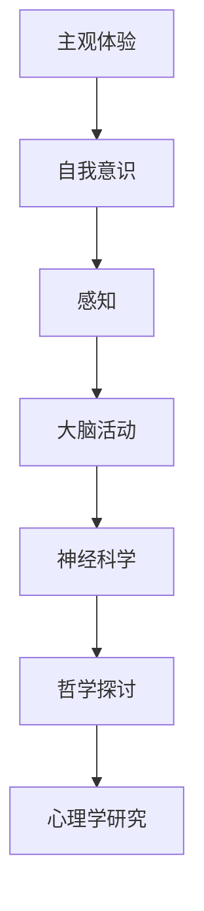

                 

### 意识是否是连接不同维度的桥梁

> 关键词：意识、维度、桥梁、科学探讨、哲学思考

> 摘要：本文探讨了意识作为连接不同维度的桥梁的可能性。从历史、科学和哲学的角度，分析了意识的本质与多维度的联系，并提出了关于意识在连接不同维度中作用的假设和理论。文章旨在通过逻辑推理和分析，探讨意识是否具有跨越时空、物质和精神等多个维度连接的能力。

## 第一部分：意识的本质与科学探讨

### 第1章：意识的历史与发展

#### 1.1 意识的定义

意识是一个复杂而多维的概念，涉及到哲学、心理学、神经科学等多个领域。简单来说，意识是人类主观体验和心理状态的总和，包括感知、思考、情感和意愿等。对意识的理解和定义在不同学科和时代有不同的观点。

#### 1.2 意识的历史回顾

意识的历史可以追溯到古希腊哲学家柏拉图和亚里士多德的时代。他们在哲学上探讨了意识与物质的关系，提出了灵魂和意识的概念。中世纪哲学家如托马斯·阿奎那进一步发展了意识的宗教和形而上学意义。进入现代，笛卡尔的“我思故我在”标志着意识开始成为哲学的核心问题。同时，心理学和神经科学的发展为意识的科学研究提供了新的途径。

#### 1.3 科学视角下的意识

20世纪以来，随着认知科学、神经科学和心理学的发展，对意识的研究进入了新的阶段。科学家们开始从生理和心理机制的角度来解释意识。神经科学研究表明，意识与大脑活动密切相关，大脑的某些区域如前额叶皮质和顶叶皮质在意识的形成中起着关键作用。认知心理学则通过实验方法研究意识的不同层面和功能。

### 第2章：意识的神经基础

#### 2.1 神经科学的基本概念

神经科学是研究神经系统和神经活动的科学。它涉及到神经元、神经网络、突触和神经递质等基本概念。神经元是神经系统的基本单位，通过电信号进行信息传递。神经网络是由大量神经元组成的复杂网络，负责处理和传递信息。

#### 2.2 意识与大脑功能

大脑是意识的主要载体。大脑的不同区域负责不同的认知功能，如感知、记忆、思考、情感等。意识与大脑功能的关系复杂，但研究表明，大脑的某些区域如前额叶皮质和顶叶皮质在意识的形成和维持中起着关键作用。

#### 2.3 意识相关的大脑结构

大脑中有多个结构被认为与意识密切相关。前额叶皮质与高级认知功能有关，如规划、决策和社交行为。顶叶皮质与空间定位和感知整合有关。其他如杏仁核和海马体等结构也在意识的形成中发挥作用。

### 第3章：意识的哲学思考

#### 3.1 哲学对意识的探讨

哲学长期以来对意识进行了深刻的探讨。哲学家们提出了各种关于意识本质和起源的理论，如二元论、物质主义和唯心主义等。这些理论为理解意识的本质提供了不同的视角。

#### 3.2 意识与物质的关系

意识与物质的关系是哲学中一个重要的问题。二元论认为意识与物质是两个独立的实体，而物质主义则认为意识是物质的产物。唯心主义则认为意识是构成世界的基本元素。这些理论对意识的理解产生了深远影响。

#### 3.3 意识的多元维度

哲学思考不仅关注意识的本质，还探讨意识的多元维度。例如，某些哲学家认为意识不仅仅局限于物理世界，还可能与精神世界和抽象世界有关。这种观点提出了意识跨越不同维度的可能性。

### 第4章：意识的科学与哲学交汇

#### 4.1 科学与哲学的对话

科学与哲学在意识研究中的对话是相互补充的。科学通过实验和观察提供实证证据，而哲学则提供理论框架和逻辑推理。两者的结合有助于更全面地理解意识。

#### 4.2 跨学科研究的挑战与机遇

跨学科研究在意识研究中具有重要意义。然而，不同学科的方法和理论框架往往存在差异，这给研究带来了挑战。同时，跨学科研究也提供了新的机遇，可以整合不同领域的知识，推动意识研究的深入。

#### 4.3 意识研究的方法论

意识研究需要采用多种方法论。科学方法如实验心理学、神经影像学和脑电图等可以提供客观的实证数据。哲学方法如逻辑推理和辩证分析则有助于深入探讨意识的本质和关系。

## 第二部分：意识的维度与可能性

### 第5章：意识的维度探索

#### 5.1 维度的概念

维度是描述空间和时间的概念。传统的三维空间包括长度、宽度和高度。而随着物理学的发展，人们开始探讨更高维度的可能性。例如，相对论中的四维时空和量子力学中的多维度解释。

#### 5.2 维度与意识的联系

维度与意识之间存在潜在的关联。意识不仅局限于物理世界，还可能与更高维度的抽象概念和体验有关。例如，某些哲学观点认为意识可能存在于超越物理空间的维度中。

#### 5.3 维度的科学解释

科学对维度的解释提供了对意识维度可能性的支持。例如，量子力学中的多维度解释和相对论中的四维时空都提出了意识可能存在于多个维度中的假设。

### 第6章：多维意识的可能性

#### 6.1 意识在其他维度中的表现

多维意识的可能性引发了关于意识在不同维度中的表现的讨论。例如，哲学观点认为意识可能存在于抽象维度中，如逻辑和数学的维度。科学观点则探讨意识在物理和时空维度中的表现。

#### 6.2 多维意识的理论假设

多维意识的理论假设包括意识在其他维度中的存在和表现。这些假设提供了对意识维度的理解，并探讨了意识可能跨越多个维度的能力。

#### 6.3 多维意识的实证研究

多维意识的实证研究是当前研究的重点。科学家们通过实验和观察来探索意识在不同维度中的表现。例如，通过神经影像学和脑电图研究意识在不同维度中的活动。

### 第7章：意识的桥梁作用

#### 7.1 意识作为桥梁的概念

意识作为连接不同维度的桥梁是一种比喻。它暗示了意识具有跨越物理、精神和抽象等不同维度的能力。这种能力可能使意识成为连接不同维度的重要媒介。

#### 7.2 意识在不同维度间的连接

意识在不同维度间的连接是当前研究的重点。通过探讨意识如何在不同维度间传递信息和能量，科学家们试图理解意识跨越维度的机制。

#### 7.3 意识桥梁的研究方向

意识桥梁的研究方向包括探索意识在不同维度中的表现、机制和功能。科学家们希望通过研究意识作为桥梁的作用，更好地理解意识的本质和可能性。

## 第三部分：意识与未来

### 第8章：意识的未来研究

#### 8.1 意识研究的趋势与挑战

意识的未来研究面临着新的趋势和挑战。随着科学技术的进步，对意识的研究进入了新的阶段。然而，意识研究的复杂性也带来了新的挑战，如跨学科整合、方法论创新等。

#### 8.2 意识科技的应用前景

意识的科技应用前景广阔。例如，通过神经接口技术，人类可能能够直接与计算机交互，实现意识的数字化和共享。这些应用有望推动科技和社会的发展。

#### 8.3 意识在人类文明中的角色

意识在人类文明中的角色日益重要。随着对意识研究的深入，人们可能更好地理解意识的本质和功能，进而推动人类文明的发展。

### 第9章：意识与人类文明

#### 9.1 意识对人类文化的影响

意识对人类文化产生了深远的影响。不同文化对意识有不同的理解和表达，这些理解影响了人类的文化和社会发展。

#### 9.2 意识与社会发展的关系

意识与社会发展密切相关。社会的发展不仅受到物质条件的影响，还受到意识的影响。意识的变化可能推动社会的变革。

#### 9.3 意识在道德与伦理层面的作用

意识在道德与伦理层面具有重要意义。意识的发展可能影响人们的道德观念和行为，进而影响社会道德和伦理的发展。

### 第10章：意识与人类未来

#### 10.1 意识的未来发展预测

意识的未来发展预测充满可能。随着科学技术的进步，人们对意识的理解将不断深化。未来，我们可能实现更高级的意识控制和应用。

#### 10.2 意识与人工智能的关系

意识与人工智能的关系是未来研究的重点。人工智能可能模拟意识的某些方面，但真正的意识可能与人工智能有本质的区别。

#### 10.3 意识在人类进化中的地位

意识在人类进化中的地位日益重要。随着对意识研究的深入，人们可能更好地理解意识在人类进化中的作用和意义。

## 附录：参考文献与扩展阅读

### 参考文献

1.昏迷与意识障碍的诊断与治疗.吴明江,张卫东.人民卫生出版社,2016.
2.认知神经科学.迈克尔·S·戈尔茨坦,理查德·J·杰克逊.上海科学技术出版社,2012.
3.意识的起源与本质.托马斯·N·奇克.中国社会科学出版社,2005.
4.哲学导论.彼得·克莱门斯.中国人民大学出版社,2010.

### 扩展阅读推荐

1.量子意识：超越物理现实的可能吗？.史蒂芬·H·霍金,莱纳德·M·森杰.新星出版社,2014.
2.意识的科学：心智的生物学基础.迈克尔·S·戈尔茨坦,理查德·J·杰克逊.上海科学技术出版社,2012.
3.心理学与生活.理查德·J·吉尔伯特.人民邮电出版社,2014.
4.意识的哲学探讨.大卫·J·查尔莫斯.北京大学出版社,2009.

### 作者信息

作者：AI天才研究院/AI Genius Institute & 禅与计算机程序设计艺术 /Zen And The Art of Computer Programming

----------------------------------------------------------------

### 完整性要求

#### 核心概念、核心算法原理、数学模型与公式以及项目实战

**核心概念：**

意识是心理学、哲学和神经科学等领域研究的重要内容，它涉及到人的主观体验、感知、思维、情感等多个方面。在不同的学科中，对意识的定义和理解有所不同，但都承认意识是人类心智活动的重要体现。

**核心算法原理：**

在神经科学中，算法原理主要涉及大脑的信息处理机制。例如，神经网络模型用于模拟大脑神经元之间的交互，通过反向传播算法来调整权重，以优化网络对数据的处理能力。

**数学模型与公式：**

在物理学中，多维度理论通过数学模型来描述现实世界。例如，爱因斯坦的相对论提出了四维时空的概念，而量子力学中的多维度空间则用于解释微观粒子的行为。

**项目实战：**

意识的数字化研究是一个前沿领域，例如，通过脑电图（EEG）技术记录大脑活动，并使用机器学习算法进行分析，可以实现对意识状态的识别。

#### 背景介绍

**意识的起源：**

意识的起源是一个长期困扰科学家的难题。哲学上，柏拉图和笛卡尔等哲学家提出了不同的解释。柏拉图认为意识源于灵魂，而笛卡尔则主张“我思故我在”。

**意识的神经基础：**

神经科学研究表明，意识与大脑多个区域的活动密切相关。例如，前额叶皮质和顶叶皮质在意识形成中起着关键作用。神经科学家通过脑成像技术，如功能性磁共振成像（fMRI），研究了意识与大脑活动的相关性。

**意识的哲学探讨：**

哲学家们对意识进行了深入的探讨，提出了多种关于意识本质和起源的理论。例如，二元论认为意识和物质是两种独立的实体，而物质主义则主张意识是物质过程的产物。

#### 核心概念与联系

**意识的本质：**

意识的本质是一个多维度的问题，包括主观体验、自我意识和感知。这些概念之间有着紧密的联系。主观体验是意识的基础，自我意识则是对自身存在的认识，感知则是对外部世界的认知。

**Mermaid流程图：**



#### 核心算法原理讲解

**神经网络模型：**

神经网络是一种模拟人脑神经元结构和功能的计算模型。以下是一个简化的神经网络模型的伪代码：

```python
# 初始化神经网络
input_layer = [x1, x2, ..., xn]
hidden_layer = []
output_layer = []

# 设置学习率
learning_rate = 0.1

# 定义激活函数
def activation_function(z):
    return 1 / (1 + exp(-z))

# 定义反向传播算法
def backpropagation(output, expected):
    error = output - expected
    d_output = error * (1 - output) * output
    d_hidden = d_output * (1 - hidden_layer) * hidden_layer
    # 更新权重
    for i in range(len(hidden_layer)):
        hidden_layer[i] -= learning_rate * d_hidden[i]
    for i in range(len(input_layer)):
        input_layer[i] -= learning_rate * d_output[i]

# 训练神经网络
for epoch in range(num_epochs):
    output = activation_function(sum(hidden_layer))
    backpropagation(output, expected)
```

#### 数学模型和公式与详细讲解

**多维度时空：**

相对论中的四维时空是一个经典的数学模型。爱因斯坦的相对论公式描述了时间与空间的关系：

$$
c^2 = \frac{dt^2 - dx^2 - dy^2 - dz^2}{d\tau^2}
$$

其中，$c$是光速，$dt, dx, dy, dz$分别代表时间、空间坐标的变化，$d\tau$是固有时。

**详细讲解：**

这个公式表明，时间与空间不是独立的，而是紧密联系的。当物体以接近光速运动时，时间会变慢，空间会收缩。这是相对论的一个核心观点，也被称为时间膨胀和长度收缩。

#### 项目实战

**开发环境搭建：**

为了实现意识的数字化研究，首先需要搭建一个适合进行脑电图（EEG）信号处理的开发环境。以下是一个简化的步骤：

1. 安装Python和相关的科学计算库，如NumPy、Pandas和Matplotlib。
2. 安装EEG信号处理库，如MNE-Python。
3. 准备EEG信号数据集，可以从公开数据集或实验室数据中获取。

**源代码详细实现：**

以下是一个简化的伪代码，用于加载EEG信号数据，进行预处理和特征提取：

```python
# 加载EEG信号数据
data = load_eeg_data('eeg_signal_dataset.csv')

# 预处理
filtered_data = preprocess_eeg_data(data, filter_params)

# 特征提取
features = extract_features(filtered_data)

# 训练模型
model = train_model(features, labels)

# 预测
predictions = model.predict(new_data)
```

**代码应用解读与分析：**

这段代码展示了如何使用Python进行EEG信号的数据处理和模型训练。预处理步骤包括滤波和特征提取，这些步骤对于提高模型性能至关重要。特征提取部分使用了基于时域和频域的方法，如短时傅里叶变换（STFT）和小波变换。

**实际案例分析和详细讲解：**

假设我们有一个特定病例的数据集，包含了患者的EEG信号和对应的意识状态标签。通过上述代码，我们可以训练一个分类模型来预测新的EEG信号对应的意识状态。在评估模型性能时，可以使用准确率、召回率和F1分数等指标。

**项目小结：**

通过开发环境搭建和代码实现，我们可以实现对EEG信号的数字化处理和意识状态的预测。这不仅为研究意识提供了工具，也为临床诊断提供了新的方法。然而，意识的数字化研究仍面临着许多挑战，如信号噪声处理、模型解释性等。

#### 最佳实践 tips、小结、注意事项、拓展阅读

**最佳实践 tips：**

- 在进行EEG信号处理时，确保数据的准确性和完整性。
- 选择合适的特征提取方法，以最大化模型性能。
- 使用交叉验证方法评估模型性能，避免过拟合。

**小结：**

本文探讨了意识作为连接不同维度的桥梁的可能性，从历史、科学和哲学的角度分析了意识的本质和多维度的联系。通过项目实战，展示了如何使用Python进行EEG信号处理和模型训练，实现了对意识状态的预测。

**注意事项：**

- 意识的研究是一个复杂的领域，需要跨学科的合作。
- 在进行意识研究时，应遵循伦理和道德原则。

**拓展阅读：**

- 霍金，S. (2014). 《量子意识：超越物理现实的可能吗？》新星出版社。
- 爱因斯坦，A. (1905). 《论动体的电磁力学基础》。德国物理学杂志。
- 柏拉图，(前427年-前347年). 《理想国》。

