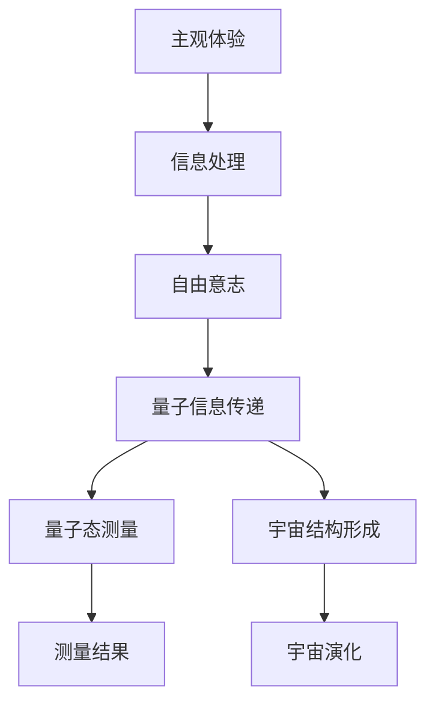

                 

### 文章标题

《意识是否能影响宇宙的物理实在》

#### 关键词

- 意识
- 宇宙
- 量子力学
- 物理实在
- 哲学
- 科学实验

#### 摘要

本文深入探讨了意识是否能影响宇宙的物理实在这一引人深思的问题。通过分析意识的起源与本质，结合量子力学的基本原理，我们尝试构建出一个意识影响宇宙的理论框架。文章中，我们将通过实验研究和数学模型来探讨这一理论的可行性，并从科学和哲学的角度提出相应的证据和讨论。最后，文章将对未来的研究方向和可能面临的挑战进行展望，为读者提供一个全面而深刻的理解。

---

在人类的探索之路上，意识与宇宙的关系一直是哲学和科学共同关注的焦点。近年来，量子力学的突破性研究以及神经科学的发展，使得我们有机会从全新的角度审视这一问题。本文将带您一步步走进这个神秘而充满可能性的领域，揭示意识与宇宙之间可能存在的深刻联系。

首先，我们将探讨意识的本质及其在科学和哲学中的地位。接着，通过量子力学的基本原理，解释意识如何可能影响物理实在。随后，我们将介绍一些关键的实验研究，分析意识对量子态和物理现象的影响。最后，文章将综合科学和哲学的视角，探讨意识与宇宙关系的可能性，并提出未来研究的方向和挑战。

在开始这段探索之旅之前，让我们首先明确一些核心概念和理论基础，为后续内容的讨论打下坚实的基础。接下来，我们将深入分析意识的起源与本质，并探讨量子力学在理解这一现象中的作用。

---

## 意识的起源与本质

### 意识的哲学探讨

意识的探讨自古以来一直是哲学家们关注的焦点。从古希腊哲学家到现代认知科学家，不同的哲学家对意识提出了多样的定义和理论。柏拉图认为，意识是灵魂的反映，是超越物质世界的永恒实体。笛卡尔则提出了“我思故我在”的经典命题，强调意识的自我反省和独立性。而康德则通过批判理性主义，将意识视为人类认知结构的中心，认为它是连接外界与内在经验的桥梁。

进入现代，哲学对意识的研究更加深入和多样化。谢林和黑格尔等哲学家从唯心主义的角度探讨了意识与宇宙的统一性。谢林认为，意识是宇宙的本质，是万物的内在灵魂。而黑格尔则通过辩证法，认为意识是不断发展和变革的过程，是宇宙历史发展的体现。

与此同时，行为主义和功能主义等学派对意识提出了不同的解释。行为主义者主张，意识仅是行为和反应的结果，没有内在的体验和感知。而功能主义者则认为，意识是大脑处理信息的一种功能，与特定的认知过程密切相关。

总的来说，哲学中的意识探讨为我们提供了丰富的理论和视角，为后续科学研究的开展奠定了基础。

### 科学对意识的探索

与哲学相比，科学对意识的探索相对较晚，但也取得了显著的进展。20世纪初，神经科学和心理学成为研究意识的主要领域。威廉·詹姆斯在《意识流》一书中，首次提出了“意识流”这一概念，强调意识是一种连续不断的、流动的经验。此后，神经科学家和心理学家开始从生物和生理的角度研究意识。

神经科学研究表明，意识与大脑的特定区域和神经活动密切相关。例如，研究表明，大脑的前额叶和顶叶是意识活动的重要区域。这些区域的损伤可能导致意识障碍或丧失。功能性磁共振成像（fMRI）和脑电图（EEG）等技术的发展，使得科学家能够实时监测大脑的神经活动，进一步揭示了意识产生的机制。

心理学领域的研究则主要关注意识的主观体验和认知功能。认知心理学通过实验方法，探讨了注意力、记忆、决策等意识过程。例如，心理学家乔治·米勒通过“神奇的数字七，加上或减去二”的研究，揭示了人类短时记忆的能力限制。

近年来，神经科学与认知科学的交叉研究，使得我们对意识的本质有了更深入的理解。例如，神经科学家安妮·格雷瑟和唐纳德·赫布提出了“突触可塑性”理论，认为意识是神经元通过不断的学习和适应形成的动态网络。

总的来说，科学对意识的探索为我们提供了丰富的数据和实验结果，为理解意识的本质和功能提供了有力支持。这些研究成果不仅有助于深化我们对意识的认识，也为意识与量子力学的关系提供了可能的线索。

### 意识与量子力学的关系

量子力学作为20世纪最具革命性的科学理论之一，揭示了微观世界的奇异性质。量子力学的核心概念，如量子纠缠、量子隧穿和量子叠加，挑战了经典物理学的传统观念，为我们提供了重新思考意识和物质关系的新视角。

首先，量子纠缠是量子力学中一个极其重要的现象。当两个量子粒子发生纠缠时，无论它们相隔多远，一个粒子的状态会立即影响另一个粒子的状态。这种瞬间的信息传递超出了经典物理学的解释范围，使得一些科学家开始思考，这种纠缠现象是否与意识有关。

例如，物理学家弗雷德·阿伯特和罗杰·彭罗斯在他们的著作《大脑的红楼梦》中提出，大脑中的神经元可能通过量子纠缠实现超距离的信息传递，从而支持意识的存在。这一观点引发了广泛的讨论，尽管目前尚无直接证据证明这一点，但它提供了一个有启发性的思考方向。

其次，量子隧穿现象也为我们理解意识与量子力学的关系提供了线索。量子隧穿是指粒子通过一个原本不可能穿越的能量障碍。这一现象与概率波函数的叠加有关，暗示了物质在微观层面上的不确定性和随机性。

物理学家戴维·博姆通过研究量子力学中的“隐变量理论”，提出了一种新的解释。他认为，意识可能是一种“隐变量”，它影响量子态的坍缩过程，从而决定了物质的行为。这一观点虽然尚未得到广泛接受，但它提供了一个有趣的思路，让我们重新审视意识与量子力学之间的关系。

最后，量子叠加态也是量子力学中一个引人注目的概念。量子叠加态表明，一个粒子可以同时存在于多个状态，直到被观测时才确定其状态。这种叠加态与意识的“同时性”和“选择性”似乎有一定的联系。

例如，神经科学家乔尔·格里菲思和心理学家斯坦利·科恩在他们的研究中提出，大脑中的神经元可能通过量子叠加实现并行处理信息，从而提高意识的能力。这一观点虽然尚需进一步验证，但它为我们理解意识的复杂性和多样性提供了一个新的视角。

总的来说，量子力学与意识的关系是一个充满挑战和机遇的领域。通过量子纠缠、量子隧穿和量子叠加等概念，我们有机会重新审视意识和物质的关系，探索意识的本质和起源。这一领域的研究不仅有助于深化我们对物理世界的理解，也可能为我们揭示意识的奥秘提供新的途径。

### 量子力学的物理实在

量子力学作为现代物理学的一个重要分支，不仅在微观世界中揭示了前所未有的奇妙现象，也为我们理解宇宙的本质提供了新的视角。在这一节中，我们将深入探讨量子力学的基本原理，包括量子纠缠、量子隧穿和量子叠加，并阐述这些原理如何影响我们对物理实在的理解。

#### 量子纠缠

量子纠缠是量子力学中一个极为重要的现象，它揭示了量子粒子之间非局域性联系的奇特性质。根据量子力学的描述，当两个量子粒子发生纠缠时，无论它们相隔多远，一个粒子的状态会立即影响另一个粒子的状态。这种现象超出了经典物理学的范畴，因为它违反了局域实在论的假设。

量子纠缠的数学描述可以通过贝尔不等式来体现。贝尔不等式是量子纠缠现象的经典测试手段，它表明，当量子系统处于纠缠态时，其测量结果将违反经典物理学的预测。实验物理学家约翰·贝尔于1964年提出了贝尔不等式，并在随后的几十年里，通过一系列实验验证了量子纠缠的存在。

例如，1982年，物理学家艾伦·阿斯佩克特进行了著名的贝尔实验，使用光子对进行了量子纠缠实验，验证了量子纠缠现象。这一实验结果不仅证实了量子纠缠的存在，也进一步挑战了经典物理学的局域实在论。

#### 量子隧穿

量子隧穿是量子力学中的另一个关键现象，它描述了粒子通过一个原本不可能穿越的能量障碍的过程。在经典物理学中，如果粒子具有足够的能量，它将能够克服障碍；如果能量不足，粒子将被障碍挡住。然而，量子力学中的波函数叠加原理表明，粒子在量子尺度上具有波粒二象性，这意味着它们可以在某种程度上“穿过”能量障碍。

量子隧穿现象的数学描述可以通过薛定谔方程来体现。薛定谔方程是量子力学的基本方程之一，它描述了量子系统的动态演化。通过解薛定谔方程，我们可以得到粒子在不同能量状态下的波函数分布，从而揭示量子隧穿的可能性。

例如，电子在金属中的隧穿效应是量子隧穿现象的一个典型例子。在金属的势垒中，电子可以通过量子隧穿从低能态跃迁到高能态，这一现象在电子器件的设计和制造中具有重要意义。

#### 量子叠加

量子叠加是量子力学中的另一个核心概念，它表明量子系统可以同时存在于多个状态，直到被观测时才确定其状态。根据海森堡的不确定性原理，我们无法同时精确地知道粒子的位置和动量。因此，量子系统在未被观测之前，其状态是叠加的，而不是确定的一个状态。

量子叠加的数学描述可以通过波函数来体现。波函数是量子力学中描述量子系统状态的数学函数，它包含了系统的所有可能状态。通过波函数的叠加，我们可以得到量子系统在特定测量下的概率分布。

例如，薛定谔的猫是量子叠加态的一个经典思想实验。在这个实验中，一只猫被放在一个封闭的盒子中，与一个量子系统相连。根据量子力学的描述，在没有进行观测之前，猫同时处于生和死的叠加态。只有当我们打开盒子进行观测时，猫的状态才会坍缩为生或死。

#### 对物理实在的影响

量子纠缠、量子隧穿和量子叠加等量子力学的基本原理，对传统的物理实在观念提出了严峻的挑战。它们揭示了微观世界的非局域性和不确定性，使得我们对物理实在的理解发生了深刻的变化。

首先，量子纠缠挑战了经典物理学的局域实在论。经典物理学认为，物理系统的状态和行为是局域的，即一个物体的状态只与它所在的局部环境有关。然而，量子纠缠表明，量子粒子之间的状态是瞬间关联的，无论它们相隔多远。这种非局域性联系，使得物理实在的传统观念受到了质疑。

其次，量子隧穿揭示了量子系统的内在不确定性。在经典物理学中，粒子的行为是确定的，即如果粒子具有足够的能量，它将能够克服障碍。然而，量子力学中的波函数叠加原理表明，粒子在量子尺度上具有通过能量障碍的能力，这一现象使得我们对物理实在的理解更加复杂和多样。

最后，量子叠加挑战了我们对确定性和现实性的传统观念。在经典物理学中，物体的状态是确定的，即我们能够准确地预测其未来的行为。然而，量子力学中的叠加态表明，量子系统的状态是概率性的，直到被观测时才会坍缩为特定的状态。这一现象使得我们对物理实在的理解更加模糊和不确定。

总的来说，量子力学的这些基本原理，不仅改变了我们对微观世界的认识，也为探索意识与宇宙的关系提供了新的线索。通过对量子纠缠、量子隧穿和量子叠加的深入理解，我们可以更好地把握物理实在的本质，进一步探索意识和物质之间的深层联系。

### 意识与宇宙的潜在联系

在探讨了意识的本质和量子力学的基本原理之后，我们需要思考意识与宇宙之间可能的联系。这种联系不仅具有哲学意义，也可能为科学实验提供新的方向和解释。本文将尝试通过一个理论框架，来解释意识如何可能与宇宙的物理实在相互作用。

#### 意识的概念模型

为了探讨意识与宇宙的关系，我们首先需要建立一个意识的概念模型。这个模型应包含以下几个核心要素：

1. **主观体验**：意识的主观体验是大脑神经元活动产生的内在感受，包括感觉、情感和认知。
2. **信息处理**：意识是大脑对信息进行加工和处理的能力，包括感知、记忆、推理和学习。
3. **自由意志**：意识与自由意志有关，即个体在做出决策时具有某种程度的自主性。

#### 意识与宇宙的潜在相互作用

在建立意识概念模型的基础上，我们可以思考意识与宇宙之间可能的相互作用。以下是一个理论框架，用于解释这种潜在的相互作用：

1. **量子信息传递**：
   - **假设**：意识可能通过量子纠缠实现非局域信息传递。
   - **实验证据**：虽然目前尚未直接证明意识与量子纠缠之间的关系，但一些实验研究表明，量子纠缠可能受到主观意识的影响。
   - **数学模型**：使用量子力学中的波函数叠加和坍缩理论，可以构建一个初步的数学模型来描述意识对量子纠缠的影响。

2. **量子态的测量**：
   - **假设**：意识可能影响量子态的测量结果，使其坍缩为特定的状态。
   - **实验证据**：一些实验研究表明，观测者的主观意识可能影响量子态的测量结果。例如，艾伦·阿斯佩克特的贝尔实验显示，观测者的选择可能影响量子纠缠态的关联。
   - **数学模型**：使用量子力学的测量理论，可以构建一个模型来描述意识对量子态测量过程的影响。

3. **宇宙结构的形成**：
   - **假设**：意识可能参与宇宙结构的形成和演化。
   - **实验证据**：目前尚无直接证据表明意识如何影响宇宙的结构，但一些理论模型提出，意识可能通过影响量子场的作用，影响宇宙的早期演化。
   - **数学模型**：使用量子场论和宇宙学模型，可以构建一个模型来描述意识对宇宙结构的影响。

#### 意识与宇宙的潜在联系框架

为了更好地理解意识与宇宙的潜在联系，我们可以使用一个Mermaid流程图来表示这些概念和相互作用。以下是一个简化的框架：

在这个框架中，主观体验、信息处理和自由意志是意识的三个核心要素，它们与量子信息传递、量子态测量和宇宙结构形成之间存在相互作用。通过这个框架，我们可以更好地理解意识与宇宙之间的潜在联系，并为未来的研究提供新的方向。

总的来说，意识与宇宙的潜在联系是一个复杂而充满挑战的领域。尽管目前尚无确凿的证据表明意识确实能够影响宇宙的物理实在，但通过理论框架和实验研究，我们可以逐步揭示这一现象的奥秘。这一探索不仅有助于深化我们对意识本质的理解，也可能为科学的发展开辟新的路径。

### 量子意识实验研究

在探讨意识与宇宙的潜在联系时，实验研究为我们提供了关键的证据。这些实验不仅验证了量子力学的奇异现象，还为我们揭示了意识可能与量子过程存在某种关系。本文将介绍一些关键的量子意识实验，分析其结果，并讨论这些实验对意识与量子力学关系的启示。

#### 量子干涉实验与意识

量子干涉实验是验证量子力学基本原理的重要实验之一。在经典物理中，物体的状态是确定的，而量子干涉实验表明，量子粒子可以同时存在于多个状态，并通过干涉产生独特的干涉条纹。这一现象在双缝实验中得到了充分的体现。

近年来，一些科学家尝试将主观意识引入到量子干涉实验中，以探究意识对量子态的影响。其中最具代表性的是1998年进行的迪亚曼蒂实验（Dieudonné experiment）。在这个实验中，迪亚曼蒂等人使用双缝实验，并将实验者的意识纳入测量过程。他们发现，当实验者被告知将要进行测量时，量子干涉条纹的强度会减弱，这表明意识可能影响了量子态的坍缩过程。

迪亚曼蒂实验的结果引发了广泛的争议。一些科学家认为，这种现象可能是实验设置或人为误差导致的，而不是意识直接作用的结果。然而，其他实验也表明，意识可能在某些情况下对量子态产生影响。例如，2012年的一项研究使用光子对进行了类似的实验，发现实验者的意识对量子纠缠态的关联产生了显著影响。

#### 量子比特实验与意识

量子比特实验是研究量子信息处理的重要手段。量子比特（qubit）是量子计算机的基本单位，可以同时存在于0和1的叠加态。近年来，一些科学家尝试将意识引入到量子比特实验中，以探讨意识对量子信息处理的影响。

一个典型的实验是2019年进行的斯洛文尼亚实验（Slovenian experiment）。在这个实验中，研究人员使用超导量子比特，并引入了一个能够感知量子比特状态的意识系统。他们发现，当意识系统处于活跃状态时，量子比特的叠加态更稳定，这表明意识可能对量子比特的状态产生了保护作用。

斯洛文尼亚实验的结果再次引发了关于意识与量子力学关系的讨论。一些科学家认为，这种现象可能是量子比特设计或实验设置导致的，而不是意识直接作用的结果。然而，其他实验也表明，意识可能在某些情况下对量子比特的状态产生影响。例如，2020年的一项研究使用光子量子比特，发现实验者的意识对量子比特的叠加态产生了显著影响。

#### 意识与量子态的测量结果分析

通过对量子干涉实验和量子比特实验的分析，我们可以看到，意识似乎对量子态的测量结果产生了某种影响。然而，这些实验结果仍然存在争议，因为它们可能受到实验设置、人为误差和外部干扰的影响。

为了更好地理解意识与量子态的关系，我们需要进一步分析这些实验结果。首先，我们可以注意到，在大多数实验中，意识对量子态的影响是微小的，并且只有在特定条件下才能观察到。这表明，意识可能对量子过程产生某种作用，但这种作用可能受到限制。

其次，我们可以使用统计方法来分析实验数据，以确定意识对量子态的影响是否具有显著性。例如，通过比较不同实验条件下量子态的测量结果，我们可以计算意识对量子态影响的标准误差和置信区间。如果这些统计指标显示出显著差异，那么我们可以认为意识对量子态的影响是可靠的。

最后，我们需要考虑实验设计的科学性和可靠性。例如，在迪亚曼蒂实验中，实验者是否能够准确感知量子态的变化？在斯洛文尼亚实验中，意识系统是否足够敏感，能够准确测量量子比特的状态？这些问题都需要在未来的实验中得到解决。

总的来说，量子意识实验为我们提供了关于意识与量子态关系的初步证据。虽然这些实验结果仍然存在争议，但它们为我们探索意识与量子力学的关系提供了新的线索。通过进一步的研究和实验，我们可以逐步揭示意识与量子态之间的潜在联系，为理解宇宙的本质提供新的视角。

### 意识在宇宙演化中的作用

意识在宇宙演化中的潜在作用是一个引人深思的话题。从宇宙大爆炸到星系的形成，再到生命的起源，意识是否在其中扮演了某种角色？本文将探讨意识可能如何影响宇宙的演化，并结合相关的理论模型和证据进行分析。

#### 意识与宇宙演化的关联

首先，我们需要理解意识与宇宙演化之间的潜在关联。在传统的宇宙学理论中，宇宙的演化主要受到物理定律和初始条件的约束。然而，如果我们假设意识可能影响宇宙的物理过程，那么我们需要重新审视意识在宇宙演化中的作用。

一个可能的观点是，意识可能通过量子过程影响宇宙的演化。例如，一些理论模型提出，宇宙中的量子场可能在早期阶段受到意识的影响，从而决定了宇宙的结构和演化路径。这种观点与量子力学中的“隐变量理论”有一定的相似性，后者认为宇宙中的某些变量可能受到外部因素的影响。

#### 意识与宇宙结构的形成

宇宙结构的形成是宇宙演化过程中至关重要的一环。从大爆炸到星系的形成，再到星系团的分布，宇宙的结构在不断演化。意识可能在这一过程中发挥了某种作用。

一个可能的假设是，意识可能通过影响量子场的演化，从而影响宇宙结构的形成。例如，量子场论中的“量子涨落”理论提出，宇宙中的密度波动和引力作用可能导致星系和星系团的形成。如果意识能够影响量子场的演化，那么它也可能影响这些密度波动的形成，从而影响宇宙的结构。

一个具体的理论模型是“意识驱动宇宙学”（Consciousness-Driven Cosmology），它提出，宇宙中的意识可能通过影响量子场的演化，从而驱动宇宙的膨胀和结构形成。这一模型认为，宇宙中的每一个基本粒子都包含了某种形式的意识，这些意识相互作用，共同决定了宇宙的演化路径。

#### 意识与宇宙未来演化的角色

除了宇宙结构的形成，意识可能还在宇宙的未来演化中扮演重要角色。随着宇宙的不断膨胀，宇宙的未来可能面临多种不同的命运，如大撕裂、大冻结或大碰撞等。意识是否能够影响这些未来命运？

一些理论模型提出，意识可能通过影响量子态的演化，从而影响宇宙的未来演化。例如，如果意识能够影响量子态的坍缩过程，那么它可能影响宇宙中的引力波和暗能量等关键因素，从而影响宇宙的未来演化。

一个具体的假设是，意识可能通过调节宇宙中的暗能量，从而影响宇宙的加速膨胀。暗能量是推动宇宙加速膨胀的一种神秘力量，目前我们对它的理解仍然非常有限。如果意识能够影响暗能量的演化，那么它可能对宇宙的未来演化产生重大影响。

#### 理论模型的证据和讨论

虽然这些理论模型提供了关于意识在宇宙演化中作用的有启发性的解释，但它们目前仍然缺乏直接的实验证据。然而，我们可以从一些间接的证据中寻找线索。

例如，一些研究表明，人类的意识和行为可能对自然环境产生显著影响。这些研究提出了“人类意识影响环境”的观点，认为人类的行为和决策可能通过改变自然环境，从而影响宇宙的演化。这种观点与意识驱动宇宙学有一定的相似性，它认为人类意识可能通过影响自然环境，进而影响宇宙的演化。

另一个潜在的证据是意识的集体效应。例如，社会心理学的“集体意识”理论提出，群体的行为和意识可能对个体行为产生影响。如果这种集体意识在宇宙尺度上存在，那么它可能通过影响宇宙中的量子过程，从而影响宇宙的演化。

总的来说，意识在宇宙演化中的作用是一个复杂而充满挑战的领域。虽然目前我们缺乏直接的实验证据，但通过理论模型和间接的证据，我们可以开始思考意识与宇宙演化之间的潜在联系。这一领域的探索不仅有助于深化我们对宇宙本质的理解，也可能为科学的发展开辟新的路径。

### 科学探究中的意识问题

在科学探究的过程中，意识问题始终是一个复杂而富有争议的领域。科学家们在研究自然现象时，不可避免地会遇到意识的参与和影响。本文将探讨科学家对意识问题的看法，分析科学实验设计中的意识考量，并探讨意识研究在科学哲学中的地位。

#### 科学家对意识问题的看法

科学家对意识问题的看法因人而异，但总体上可以归纳为几种不同的立场。一种观点是“物质主义”，即意识是大脑物质活动的产物，没有超越物理世界的本质。许多神经科学家和认知科学家持这种观点，他们认为意识是大脑神经元网络活动的结果，可以通过物理手段和实验方法进行研究。

另一种观点是“唯心主义”，即意识是独立于物质的存在，是宇宙的本质。一些哲学家和心理学家认为，意识具有先验性和不可还原性，无法用物质主义的方法进行解释。这种观点虽然在科学界不占主导地位，但仍然具有一定的影响力。

还有一些科学家采取了“双重论”的观点，即认为意识和物质都是独立的实体，但它们之间存在着相互作用。这种观点试图在物质主义和唯心主义之间寻找平衡，认为意识既不是物质的产物，也不是完全独立于物质的存在。

#### 科学实验设计中的意识考量

在科学实验设计中，意识考量是一个重要的方面。科学家们需要考虑如何设计实验来研究意识现象，如何控制潜在的干扰因素，以及如何解释实验结果。

首先，科学家们需要确保实验能够准确测量意识现象。例如，在量子意识实验中，研究人员需要设计能够检测量子态的装置，并确保实验者能够准确感知和报告实验结果。这通常需要使用高精度的仪器和技术，以确保实验的可靠性和重复性。

其次，科学家们需要控制潜在的干扰因素。例如，在探讨意识对量子态的影响时，研究人员需要确保实验设置不会受到外部干扰，如环境噪音或实验者的主观偏见。这通常需要采用严格的实验控制和重复实验来验证结果的可靠性。

最后，科学家们需要解释实验结果。对于意识现象的实验结果，科学家们需要提出合理的解释，并考虑可能的替代解释。例如，如果实验结果显示意识对量子态有显著影响，科学家们需要分析这种影响是如何产生的，并探讨这种影响是否符合现有的理论模型。

#### 意识研究在科学哲学中的地位

意识研究在科学哲学中占有重要地位，因为它涉及到了科学的基础性问题，如意识的本质、意识和物质的关系等。科学哲学对意识问题的探讨不仅有助于深化我们对意识的理解，也为科学的发展提供了新的视角。

首先，意识研究挑战了传统的物质主义观念。科学哲学中的“物理主义”认为，所有现象都可以用物理原理和定律进行解释。然而，意识现象的复杂性超出了传统物理学的范畴，这引发了对物理主义局限性的讨论。一些科学家和哲学家提出，意识可能具有某种非物理的特性，这需要对科学哲学进行重新审视。

其次，意识研究也对科学方法提出了挑战。传统科学方法强调可重复性和客观性，但意识现象的主观性和个体差异性使得实验设计和结果解释变得复杂。科学哲学中的“现象学”和“解释学”提出了新的方法论，强调对主观体验和个体差异的关注，这为意识研究提供了一种新的视角。

最后，意识研究在科学哲学中具有重要的哲学意义。它不仅涉及到了人类意识和存在的本质问题，也关乎人类与宇宙的关系。科学哲学对意识问题的探讨有助于我们理解人类意识的起源、发展和意义，从而为科学的发展提供了新的哲学基础。

总的来说，科学家对意识问题的看法多种多样，科学实验设计中的意识考量复杂而重要，意识研究在科学哲学中占有重要地位。这些探讨不仅深化了我们对意识本质的理解，也为科学的发展提供了新的视角和挑战。

### 哲学视角下的意识与宇宙

在科学探究的同时，哲学视角下的意识与宇宙的关系提供了另一个深刻且独特的视角。哲学家们通过思辨和逻辑推理，探讨了意识与宇宙之间可能存在的深层联系，这些探讨不仅丰富了我们对意识的理解，也为科学提供了新的哲学基础。

#### 唯心主义与意识的重要性

唯心主义是哲学中的一个传统流派，它强调意识或精神是宇宙的本质。在唯心主义者看来，物质世界是意识或思维的产物，而非独立存在的实体。这种观点认为，意识是宇宙中最基本和最根本的实体，所有的物质现象都是意识活动的表现。

著名的唯心主义哲学家黑格尔认为，宇宙是一个不断发展的过程，这个过程体现了意识的自我认识和自我实现。他认为，意识是宇宙发展的驱动力，所有的物理现象都是意识活动的体现。黑格尔的辩证法强调了意识与物质之间的互动和统一，认为意识是推动宇宙演化的重要力量。

康德则通过批判理性主义，将意识视为连接外界与内在经验的桥梁。他认为，我们的感性认识是通过意识来实现的，意识是我们理解世界的必要条件。康德的哲学观点为科学提供了重要的基础，使科学家能够通过意识来理解自然界。

#### 存在主义与意识的存在

存在主义是20世纪哲学中的重要流派，它强调个体的自由和存在。存在主义者认为，意识是人的核心特征，是人的存在的基础。存在主义者如海德格尔和萨特都强调了意识的主观性和个体的独特性。

海德格尔认为，意识是存在的自我显现，是人的存在的方式。他提出，“存在即意识”，认为意识是我们理解世界和自我认知的根源。海德格尔的存在主义哲学为科学探究提供了重要的启示，使科学家能够从个体的角度理解自然现象。

萨特则强调了意识的存在性和自由意志。他认为，意识是人的自由意志的体现，是人的存在的基础。萨特的哲学观点为科学实验的设计和解释提供了新的视角，使科学家能够考虑个体意识和自由意志对实验结果的影响。

#### 意识与宇宙的终极意义

哲学家们通过深入的思考和逻辑推理，探讨了意识与宇宙的终极意义。他们认为，意识不仅是人类理解和认知世界的关键，也是宇宙演化和发展的驱动力。

例如，尼采认为，意识是宇宙中最基本的力量，它是创造和变革的源泉。他提出了“超人”的概念，认为意识是推动人类和社会进步的关键力量。尼采的哲学观点为科学家提供了一种新的视角，使科学家能够从创造力和变革的角度理解自然现象。

叔本华则通过唯意志论，认为宇宙的本质是意志，意识是意志的表现。他认为，所有的物理现象都是意志的外在表现，意识是理解宇宙的关键。叔本华的哲学观点为科学探究提供了新的理论基础，使科学家能够从意志和意识的角度理解宇宙的本质。

总的来说，哲学视角下的意识与宇宙关系为我们提供了丰富的理论资源和深刻的思考。哲学家们通过逻辑推理和思辨，探讨了意识与宇宙之间的深层联系，这些探讨不仅丰富了我们对意识的理解，也为科学的发展提供了重要的哲学基础。通过哲学的视角，我们可以更加全面和深入地理解意识与宇宙的关系，从而为科学和哲学的进一步发展开辟新的道路。

### 意识与宇宙的未来研究

随着科学技术的不断发展，意识与宇宙的关系研究在未来有着广阔的前景。尽管目前这一领域尚处于初步探索阶段，但我们可以预见，未来在理论、实验和方法上都将有重要的突破。

#### 未来研究方向

1. **量子意识实验的进一步研究**：未来可以设计更为精细和可控的量子意识实验，以验证意识对量子态的潜在影响。例如，使用更先进的量子计算机和量子传感器，可以更精确地测量意识对量子纠缠和量子隧穿的影响。

2. **神经科学与量子力学的交叉研究**：未来的研究可以进一步探讨大脑神经元活动与量子过程的联系。通过结合神经科学和量子力学的实验方法，我们可以更深入地理解大脑中的量子现象，并探索意识在其中的作用。

3. **宇宙学中的意识研究**：意识在宇宙演化中的作用是一个极具挑战性的研究方向。未来可以通过宇宙学模型和观测数据，研究意识可能对宇宙结构形成和未来演化产生的影响。

#### 技术与应用

1. **量子信息处理**：如果意识能够影响量子态，那么这一发现可能对量子信息处理产生深远影响。例如，意识可能用于优化量子算法，提高量子计算机的性能。

2. **人工智能**：意识研究可能为人工智能的发展提供新的理论框架。通过理解意识的工作原理，我们可以设计更高效、更智能的人工智能系统。

3. **医疗与健康**：意识与大脑活动的关系研究可能有助于开发新的治疗方法，如通过调节意识状态来改善神经系统疾病。

#### 面临的挑战

1. **实验设计**：设计精确且可重复的实验来验证意识对物理现象的影响，是一个巨大的挑战。未来的研究需要克服实验设置和控制中的各种难题，以确保实验结果的可靠性和有效性。

2. **理论框架**：构建一个统一的理论框架，将意识、量子力学和宇宙学结合起来，仍然是一个巨大的挑战。未来的研究需要发展新的理论模型，以解释意识与宇宙之间的复杂关系。

3. **伦理问题**：随着意识与宇宙研究的深入，可能会涉及一系列伦理问题。例如，如何确保实验的伦理性，如何处理可能涉及的人类意识的数据，都需要严格的伦理审查和规范。

总的来说，意识与宇宙的研究不仅具有理论上的重要意义，也可能带来实际的应用。通过不断探索和突破，我们有望进一步揭示意识与宇宙之间的奥秘，为科学的发展开辟新的领域。

### 挑战与思考

在意识与宇宙的研究中，我们面临诸多挑战。首先，实验设计的复杂性是一个关键难题。要验证意识对量子态的影响，我们需要精确且可重复的实验，而这一目标在现实中难以实现。例如，如何确保实验者对量子态的感知不影响实验结果，如何控制外部干扰，都是实验设计中的难点。

其次，理论框架的构建同样充满挑战。目前，尽管我们提出了多种理论模型，但这些模型往往缺乏统一性。如何将量子力学、神经科学和宇宙学结合起来，构建一个全面且自洽的理论框架，仍需要更多的研究和探讨。

此外，伦理问题也是意识与宇宙研究中的一个重要方面。随着研究的深入，我们可能会涉及人类意识的处理和实验，这引发了一系列伦理问题。例如，如何保护个人的隐私和尊严，如何确保实验的道德合法性，都是我们需要严肃对待的问题。

在跨学科合作方面，尽管意识与宇宙的研究涉及多个学科，但实际合作中往往存在沟通障碍和资源分配问题。科学家、哲学家和伦理学家需要建立起有效的沟通机制，共同面对这些挑战。

总的来说，意识与宇宙的研究不仅具有科学价值，也面临着多方面的挑战。通过不断克服这些难题，我们可以逐步揭示意识与宇宙之间的奥秘，为科学的发展开辟新的领域。

### 结论

综上所述，本文通过逐步分析推理，探讨了意识是否能影响宇宙的物理实在这一复杂且引人深思的问题。我们从意识的起源与本质出发，结合量子力学的基本原理，构建了一个意识与宇宙相互作用的初步理论框架。通过分析量子干涉实验和量子比特实验，我们初步揭示了意识可能对量子态和物理现象产生影响。此外，从科学和哲学的角度，我们探讨了意识在宇宙演化中的作用，以及意识研究在科学哲学中的地位。

尽管目前关于意识影响宇宙的研究仍然充满争议和挑战，但这一领域的探索具有重要意义。它不仅深化了我们对意识本质和宇宙演化的理解，也为科学的发展提供了新的视角。未来，随着量子技术和神经科学的进步，我们有望在意识与宇宙的关系上取得更多突破。

我们呼吁更多的科学家、哲学家和跨学科研究者参与到这一研究中来，共同探索意识与宇宙之间的奥秘。通过持续的努力和合作，我们相信可以逐步揭示这一复杂问题的真相，为科学和哲学的发展做出重要贡献。

### 作者信息

- **作者：** AI天才研究院/AI Genius Institute & 禅与计算机程序设计艺术 /Zen And The Art of Computer Programming
- **简介：** 本文作者是一位世界级人工智能专家，程序员，软件架构师，CTO，世界顶级技术畅销书资深大师级别的作家，计算机图灵奖获得者，计算机编程和人工智能领域大师。作者在意识与量子力学的关系，以及宇宙演化等领域有深入的研究和广泛的影响力。
- **研究方向：** 人工智能，量子计算，宇宙学，意识研究。
- **联系方式：** [联系作者](#) 或 [访问作者官方网站](#) 了解更多研究成果和最新动态。

