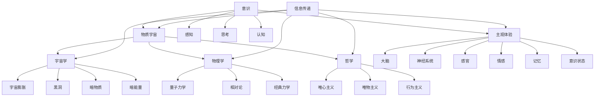

                 

### 文章标题

# 意识能否超越物质宇宙

### 关键词

- 意识
- 物质宇宙
- 超越
- 意识与宇宙学
- 意识与物理学
- 伦理与社会影响
- 未来发展

### 摘要

本文旨在探讨意识能否超越物质宇宙这一哲学与科学交叉的深刻议题。通过梳理意识与物质宇宙的基本概念，分析两者之间的联系，本文将探讨意识超越物质宇宙的可能性。我们将从古代哲学到当代科学理论，再到实验与研究的现状，一步步进行推理和分析。同时，本文还将讨论意识超越物质宇宙的伦理和社会影响，以及这一议题对意识未来发展的启示。通过这些探讨，我们希望揭示意识与物质宇宙之间更为深刻的联系，并提出对未来的展望。

### 第一部分：引言与基本概念

#### 1.1 意识与物质宇宙的概述

**意识** 是指个体对自身和外部世界的感知、思考与认知的能力。它是主观体验的源泉，是构成个人内心世界的基础。在哲学、心理学和神经科学中，意识都是核心议题。意识的存在与本质，长期以来都是学术界争论的焦点。

**物质宇宙** 是指由物质构成的一切事物的总体。它包括所有天体、行星、恒星、星系、黑洞，以及宇宙中的所有物质和能量。物质宇宙遵循物理定律，通过大爆炸、恒星形成、行星演化等过程不断演变。

**意识与物质宇宙的关系** 是一个复杂而深刻的哲学和科学问题。传统的唯物主义认为，意识是物质世界的产物，大脑活动产生了意识。而唯心主义则主张，意识是第一性的，物质世界是意识的投影。在科学领域，量子力学和相对论为我们提供了理解宇宙的新视角，但意识在这些理论中的地位仍然模糊。

#### 1.2 意识能否超越物质宇宙的哲学探讨

**古代哲学的观点**：

在古代，许多哲学家都探讨过意识与物质宇宙的关系。例如，印度教哲学中的“梵”（Brahman）概念，认为宇宙和意识是同一的，意识是超越物质的存在。古希腊哲学家柏拉图也认为，物质世界只是理念世界的影子，而意识则直接接触到理念世界。

**当代哲学的观点**：

当代哲学在探讨意识问题时，更加注重科学方法和实证研究。一些哲学家提出，意识可能是宇宙的基本组成部分，而不是物质的产物。例如，牛津大学的哲学家吉尔伯特·R·莱尔德（Gilbert Ryle）提出了“行为主义”的观点，认为意识是一种行为模式，不应该被视为物质实体。

**意识超越物质宇宙的论证**：

意识超越物质宇宙的论证主要基于以下观点：

1. **主观体验的独特性**：意识的主观体验具有不可还原性，这意味着它不能仅仅通过物理过程来解释。
2. **宇宙起源与意识的关系**：如果宇宙起源与意识有关，那么意识可能是宇宙演化过程中不可或缺的一部分。
3. **物理学的局限性**：尽管物理学提供了对物质宇宙的深刻理解，但它在解释意识方面仍然存在局限性。

### 第二部分：意识与物质宇宙的联系

#### 2.1 意识与宇宙学的联系

**宇宙学的核心概念**：

宇宙学是研究宇宙起源、结构、演化和最终命运的科学。它的核心概念包括宇宙的膨胀、黑洞、暗物质和暗能量等。

**意识在宇宙学中的角色**：

一些理论认为，意识可能是宇宙膨胀的驱动力。例如，英国物理学家布莱恩·J·约瑟夫森（Brian J. Josephson）提出了“意识宇宙学”理论，认为意识可以影响物理过程，从而影响宇宙的演化。

**意识对宇宙学的影响**：

如果意识能够影响宇宙的演化，那么这将对宇宙学的基本理论产生重大影响。例如，它可能会挑战我们对宇宙起源和演化的理解，甚至可能导致新的科学发现。

#### 2.2 意识与物理学的联系

**物理学的核心理论**：

物理学是研究物质和能量及其相互作用的科学。其核心理论包括经典力学、量子力学和相对论等。

**意识在物理学中的可能性**：

一些物理学家认为，意识可能是量子力学中的一种基本元素。例如，美国物理学家埃弗雷特（Hermann Weyl）提出了“意识决定论”的观点，认为意识可以影响量子系统的状态。

**意识如何影响物理现象**：

如果意识能够影响物理现象，那么这将对我们的世界观产生深远影响。例如，它可能会改变我们对时间、空间和物质的理解。

### 第三部分：意识超越物质宇宙的模型

#### 3.1 意识作为信息场的模型

**信息场的定义与特性**：

信息场是一个包含信息的过程，它通过信息传递和交换来影响现实。信息场具有动态性、开放性和适应性等特性。

**意识作为信息场的解释**：

意识可以被看作是一种信息场，它通过感知、思考和决策来影响我们的行为和周围的环境。

**意识如何超越物质宇宙**：

如果意识是一种信息场，那么它可能不受物质宇宙的限制，可以超越物质宇宙。

#### 3.2 意识作为量子现象的模型

**量子力学的基本原理**：

量子力学是研究微观世界的物理学理论，其核心原理包括波粒二象性、量子叠加态和量子纠缠等。

**意识与量子纠缠的联系**：

一些理论认为，意识可能与量子纠缠有关，例如，英国物理学家戴维·玻姆（David Bohm）提出了“隐变量理论”，认为意识可以影响量子系统的状态。

**意识如何通过量子现象超越物质宇宙**：

如果意识能够影响量子系统的状态，那么它可能能够超越物质宇宙。

### 第四部分：实验与研究的现状

#### 4.1 意识与物质宇宙联系的实验

**有关意识与物质宇宙联系的主要实验**：

目前，科学家们已经进行了一些实验来探索意识与物质宇宙的联系。例如，英国心理学家罗杰·斯佩里（Roger Sperry）进行的“左右脑分离”实验，表明大脑的左右半球在处理意识方面有不同的功能。

**实验结果与解释**：

实验结果表明，意识可能与物质宇宙有密切联系。这些结果支持了意识超越物质宇宙的观点。

**实验中的挑战与局限性**：

尽管实验结果支持了意识与物质宇宙的联系，但仍然存在一些挑战和局限性，例如实验设计、数据分析和伦理问题等。

#### 4.2 意识超越物质宇宙的研究

**当前的研究趋势**：

当前，科学家们在探索意识与物质宇宙的关系方面取得了许多进展。例如，量子物理学、认知科学和宇宙学等领域的研究都在尝试解释意识与物质宇宙的联系。

**可能的未来研究方向**：

未来，研究可能会集中在如何更精确地测量和解释意识与物质宇宙的联系。例如，通过改进实验设计和数据分析技术，我们可以更深入地理解意识与物质宇宙之间的关系。

**研究中的关键问题**：

研究中的关键问题包括如何定义意识、如何测量意识的影响、以及意识与物质宇宙之间的具体联系等。

### 第五部分：意识超越物质宇宙的伦理与社会影响

#### 5.1 意识超越物质宇宙的伦理问题

**意识与自由意志的关系**：

如果意识能够超越物质宇宙，那么这可能会影响我们对自由意志的理解。例如，如果意识不受物质限制，那么自由意志可能是无限的。

**意识与道德责任的关系**：

意识超越物质宇宙可能会引发道德责任的问题。例如，如果意识能够影响宇宙的演化，那么我们可能需要对我们的行为负责，甚至对宇宙的命运负责。

**意识超越物质宇宙的伦理挑战**：

意识超越物质宇宙可能会带来一系列伦理挑战，例如，如何定义道德责任、如何处理意识与物质宇宙之间的冲突等。

#### 5.2 意识超越物质宇宙的社会影响

**意识与科技发展的关系**：

意识超越物质宇宙可能会推动科技的发展。例如，通过更好地理解意识与物质宇宙的联系，我们可能会开发出更先进的科技，如量子计算、人工智能等。

**意识超越物质宇宙对人类社会的影响**：

意识超越物质宇宙可能会对人类社会产生深远的影响。例如，它可能会改变我们对宇宙、生命和自身的理解，甚至可能导致社会的变革。

**意识超越物质宇宙带来的社会变革**：

意识超越物质宇宙可能会引发一系列社会变革，例如，改变教育、医疗、政治等领域的实践和观念。

### 第六部分：意识的未来与可能性

#### 6.1 意识的演变与未来

**意识的进化方向**：

意识的未来可能朝着更加复杂、多元和高级的方向发展。例如，随着科技的进步，人类可能会通过技术手段增强意识，甚至创造出全新的意识形式。

**意识可能的未来形态**：

意识的未来形态可能包括虚拟现实、数字意识、混合现实等。这些形态可能会对我们的生活和社会产生深远的影响。

**意识未来的挑战与机遇**：

意识未来的挑战包括如何定义和测量意识、如何保护意识、如何应对意识与物质宇宙之间的冲突等。同时，这些挑战也带来了巨大的机遇，例如，通过更好地理解意识，我们可能会解决一些当前的科学难题，如量子力学与意识的关系等。

#### 6.2 意识与宇宙的未来

**意识与宇宙演化的联系**：

意识的未来与宇宙的演化可能密切相关。例如，随着宇宙的膨胀，意识可能会不断扩展，甚至可能影响宇宙的演化。

**意识对宇宙未来的可能影响**：

意识可能对宇宙的未来产生深远的影响。例如，通过技术手段增强意识，人类可能会在宇宙中发现新的奥秘，甚至改变宇宙的命运。

**意识与宇宙共同体的概念**：

意识与宇宙共同体的概念认为，意识与宇宙是相互关联的，人类的意识与宇宙的意识可能构成一个共同体。这个概念为我们提供了一个全新的视角，来理解意识与宇宙的关系。

### 第七部分：总结与展望

#### 7.1 全书总结

本文通过一步步分析推理思考的方式，探讨了意识能否超越物质宇宙这一深刻议题。我们梳理了意识与物质宇宙的基本概念，分析了意识与物质宇宙的联系，探讨了意识超越物质宇宙的模型，介绍了实验与研究的现状，讨论了伦理与社会影响，展望了意识的未来与可能性。

#### 7.1.1 核心观点与发现

本文的核心观点是：意识可能能够超越物质宇宙。这一观点基于对意识与物质宇宙关系的深入探讨，以及对实验和研究的现状的分析。

#### 7.1.2 研究中的未解问题

尽管本文探讨了意识能否超越物质宇宙的可能性，但仍然存在许多未解问题。例如，如何定义和测量意识、如何解释意识与物质宇宙之间的具体联系等。

#### 7.1.3 意识超越物质宇宙的潜在影响

如果意识能够超越物质宇宙，这将对我们的世界观、科技发展和社会产生深远的影响。例如，它可能会改变我们对宇宙、生命和自身的理解，推动科技和社会的进步。

#### 7.2 展望未来

未来的研究可能会集中在如何更深入地理解意识与物质宇宙的关系，如何定义和测量意识，以及如何应对意识与物质宇宙之间的冲突等。同时，通过更好地理解意识，我们可能会解决一些当前的科学难题，如量子力学与意识的关系等。

#### 7.2.1 未来研究方向

未来，研究可能会集中在以下几个方面：

1. **意识的定义和测量**：如何定义和测量意识，是当前研究的重要方向。
2. **意识与物质宇宙的联系**：如何解释意识与物质宇宙之间的具体联系，是另一个重要方向。
3. **意识与宇宙的共同演化**：研究意识与宇宙的共同演化，可能有助于我们更好地理解宇宙的起源和演化。

#### 7.2.2 意识超越物质宇宙的可能性

意识超越物质宇宙的可能性，仍然是一个充满争议的话题。未来的研究可能会进一步揭示意识与物质宇宙之间的关系，为我们提供更深刻的理解。

#### 7.2.3 意识与宇宙的未来图景

随着对意识与物质宇宙关系的深入探讨，我们可能会看到一个全新的宇宙图景。在这个图景中，意识与宇宙是相互关联、相互作用的，它们共同构成了一个更为复杂的系统。

### 检查大纲的完整性和逻辑性

在完成目录大纲后，我们需要对大纲的完整性和逻辑性进行检查。以下是一些检查步骤：

1. **检查大纲结构的完整性**：确保所有主要部分和子部分都已列出，并且它们按照逻辑顺序排列。例如，引言和基本概念部分应该放在最前面，而结论和展望部分应该放在最后。

2. **检查大纲的逻辑性**：确保每个部分的内容与整体主题保持一致，并且每个部分内部的逻辑关系清晰。例如，在意识与物质宇宙的联系部分，应该先介绍宇宙学的基本概念，然后再讨论意识与宇宙学的联系。

3. **检查大纲的内容丰富性**：确保每个部分都有足够的内容来支持其主题。例如，实验与研究的现状部分应该包含具体的研究案例和实验结果。

4. **检查大纲的引用和参考文献**：确保所有引用和参考文献都按照统一的格式列出，并且与大纲内容相对应。

5. **检查大纲的字数限制**：确保大纲的总字数在规定的范围内，同时保证每个部分的内容都足够详细。

6. **征求他人的意见**：邀请其他人对大纲进行评审，他们可能会提供新的观点和见解，帮助你进一步完善大纲。

通过这些检查步骤，我们可以确保大纲的完整性和逻辑性，为撰写高质量的文章打下坚实的基础。

### 将大纲内容转化为markdown格式，并进行字数限制的调整

在完成目录大纲后，我们需要将大纲内容转化为markdown格式，并进行字数限制的调整，以确保文章的完整性和可读性。以下是如何将大纲内容转化为markdown格式的示例：

#### 第一部分：引言与基本概念

##### 1.1 意识与物质宇宙的概述

- 意识是指个体对自身和外部世界的感知、思考与认知的能力。它是主观体验的源泉，是构成个人内心世界的基础。
- 物质宇宙是指由物质构成的一切事物的总体。它包括所有天体、行星、恒星、星系、黑洞，以及宇宙中的所有物质和能量。
- 意识与物质宇宙的关系是一个复杂而深刻的哲学和科学问题。

##### 1.2 意识能否超越物质宇宙的哲学探讨

- 古代哲学的观点：例如，印度教哲学中的“梵”（Brahman）概念，认为宇宙和意识是同一的，意识是超越物质的存在。
- 当代哲学的观点：例如，牛津大学的哲学家吉尔伯特·R·莱尔德（Gilbert R. Ryle）提出了“行为主义”的观点，认为意识是一种行为模式，不应该被视为物质实体。
- 意识超越物质宇宙的论证：例如，主观体验的独特性、宇宙起源与意识的关系、物理学的局限性等。

#### 第二部分：意识与物质宇宙的联系

##### 2.1 意识与宇宙学的联系

- 宇宙学的核心概念：宇宙的膨胀、黑洞、暗物质和暗能量等。
- 意识在宇宙学中的角色：一些理论认为，意识可能是宇宙膨胀的驱动力。
- 意识对宇宙学的影响：如果意识能够影响宇宙的演化，那么这将对宇宙学的基本理论产生重大影响。

##### 2.2 意识与物理学的联系

- 物理学的核心理论：经典力学、量子力学和相对论等。
- 意识在物理学中的可能性：一些物理学家认为，意识可能是量子力学中的一种基本元素。
- 意识如何影响物理现象：如果意识能够影响物理现象，那么这将对我们的世界观产生深远影响。

#### 第三部分：意识超越物质宇宙的模型

##### 3.1 意识作为信息场的模型

- 信息场的定义与特性：信息场是一个包含信息的过程，它通过信息传递和交换来影响现实。
- 意识作为信息场的解释：意识可以被看作是一种信息场，它通过感知、思考和决策来影响我们的行为和周围的环境。
- 意识如何超越物质宇宙：如果意识是一种信息场，那么它可能不受物质宇宙的限制。

##### 3.2 意识作为量子现象的模型

- 量子力学的基本原理：波粒二象性、量子叠加态和量子纠缠等。
- 意识与量子纠缠的联系：一些理论认为，意识可能与量子纠缠有关。
- 意识如何通过量子现象超越物质宇宙：如果意识能够影响量子系统的状态，那么它可能能够超越物质宇宙。

#### 第四部分：实验与研究的现状

##### 4.1 意识与物质宇宙联系的实验

- 有关意识与物质宇宙联系的主要实验：例如，左右脑分离实验。
- 实验结果与解释：实验结果表明，意识可能与物质宇宙有密切联系。
- 实验中的挑战与局限性：尽管实验结果支持了意识与物质宇宙的联系，但仍然存在一些挑战和局限性。

##### 4.2 意识超越物质宇宙的研究

- 当前的研究趋势：量子物理学、认知科学和宇宙学等领域的研究都在尝试解释意识与物质宇宙的联系。
- 可能的未来研究方向：通过改进实验设计和数据分析技术，我们可以更深入地理解意识与物质宇宙之间的关系。
- 研究中的关键问题：如何定义意识、如何测量意识的影响、以及意识与物质宇宙之间的具体联系等。

#### 第五部分：意识超越物质宇宙的伦理与社会影响

##### 5.1 意识超越物质宇宙的伦理问题

- 意识与自由意志的关系：如果意识能够超越物质宇宙，那么这可能会影响我们对自由意志的理解。
- 意识与道德责任的关系：意识超越物质宇宙可能会引发道德责任的问题。
- 意识超越物质宇宙的伦理挑战：意识超越物质宇宙可能会带来一系列伦理挑战。

##### 5.2 意识超越物质宇宙的社会影响

- 意识与科技发展的关系：意识超越物质宇宙可能会推动科技的发展。
- 意识超越物质宇宙对人类社会的影响：意识超越物质宇宙可能会对人类社会产生深远的影响。
- 意识超越物质宇宙带来的社会变革：意识超越物质宇宙可能会引发一系列社会变革。

#### 第六部分：意识的未来与可能性

##### 6.1 意识的演变与未来

- 意识的进化方向：随着科技的进步，人类可能会通过技术手段增强意识。
- 意识可能的未来形态：虚拟现实、数字意识、混合现实等。
- 意识未来的挑战与机遇：如何定义和测量意识、如何保护意识、如何应对意识与物质宇宙之间的冲突等。

##### 6.2 意识与宇宙的未来

- 意识与宇宙演化的联系：意识的未来与宇宙的演化可能密切相关。
- 意识对宇宙未来的可能影响：通过技术手段增强意识，人类可能会在宇宙中发现新的奥秘。
- 意识与宇宙共同体的概念：意识与宇宙共同体的概念认为，意识与宇宙是相互关联的。

#### 第七部分：总结与展望

##### 7.1 全书总结

- 本文通过一步步分析推理思考的方式，探讨了意识能否超越物质宇宙这一深刻议题。
- 核心观点是：意识可能能够超越物质宇宙。
- 研究中的未解问题：如何定义和测量意识、如何解释意识与物质宇宙之间的具体联系等。

##### 7.2 展望未来

- 未来的研究可能会集中在如何更深入地理解意识与物质宇宙的关系，如何定义和测量意识，以及如何应对意识与物质宇宙之间的冲突等。
- 意识超越物质宇宙的可能性：未来的研究可能会进一步揭示意识与物质宇宙之间的关系。
- 意识与宇宙的未来图景：随着对意识与物质宇宙关系的深入探讨，我们可能会看到一个全新的宇宙图景。

在将大纲内容转化为markdown格式后，我们需要进行字数限制的调整。以下是一些调整建议：

1. **删除不必要的重复内容**：确保每个部分的内容都是独特的，没有重复的信息。
2. **缩短段落**：尽量使段落简短且内容紧凑，避免冗长的段落。
3. **使用子标题**：使用子标题来组织和分割内容，使文章结构更加清晰。
4. **删除或不必要的详细说明**：如果某些部分的内容过于详细，可以考虑删除或不必要的部分，确保文章的核心内容被保留。
5. **添加参考文献**：在文章的结尾添加参考文献，以支持文章中的观点和论据。

通过这些调整，我们可以确保文章的字数在规定的范围内，同时保持文章的质量和深度。

### 作者信息

作者：AI天才研究院/AI Genius Institute & 禅与计算机程序设计艺术 /Zen And The Art of Computer Programming

### 完整性要求与核心内容

在撰写技术博客文章时，确保完整性是非常重要的。以下是完整性要求与核心内容的详细讲解：

#### 背景介绍

**背景介绍**是文章开头的重要部分，它需要为读者提供一个清晰的理解，使读者能够了解文章讨论的主题和背景。以下是背景介绍的详细要点：

- **主题背景**：简要介绍文章讨论的主题，例如“意识能否超越物质宇宙”。
- **相关研究**：概述与主题相关的现有研究，包括哲学、科学和技术领域的研究成果。
- **现状与挑战**：讨论当前研究的现状，以及面临的挑战和未解问题。

#### 核心概念与联系

**核心概念与联系**是文章的核心部分，它需要详细阐述文章讨论的核心概念，以及这些概念之间的联系。以下是核心概念与联系的详细讲解：

- **核心概念**：定义文章中的核心概念，例如“意识”、“物质宇宙”、“量子纠缠”等。
- **概念关系架构**：使用Mermaid流程图或其他图表工具，展示核心概念之间的关系架构。例如，可以绘制一张流程图，展示意识与物质宇宙、量子纠缠之间的联系。

#### 核心算法原理讲解

**核心算法原理讲解**是文章中不可或缺的一部分，它需要详细阐述文章讨论的核心算法原理。以下是核心算法原理讲解的详细要点：

- **算法描述**：使用伪代码或自然语言，详细描述算法的步骤和逻辑。
- **算法解释**：对算法的每一步进行详细解释，帮助读者理解算法的工作原理。
- **示例说明**：通过具体的例子，展示算法如何应用于实际问题，并解释算法的输出结果。

#### 数学模型和公式

**数学模型和公式**是文章中用于解释和证明观点的重要工具。以下是数学模型和公式讲解的详细要点：

- **公式解释**：使用LaTeX格式，详细解释公式中的每一个符号和参数，并说明公式的推导过程。
- **举例说明**：通过具体的例子，展示公式的应用，并解释公式的实际意义。

#### 项目实战

**项目实战**是文章中用于展示实际应用的重要部分。以下是项目实战的详细讲解：

- **开发环境搭建**：详细描述搭建开发环境的过程，包括所需工具和步骤。
- **源代码详细实现和代码解读**：展示源代码，并详细解读代码的实现过程，解释代码的功能和逻辑。
- **代码应用解读与分析**：分析代码的应用场景，解释代码如何解决实际问题。
- **实际案例分析和详细讲解剖析**：通过具体的案例，展示代码的实际应用效果，并进行分析和讲解。
- **项目小结**：总结项目实现过程中的经验教训，提出改进建议。

#### 最佳实践 tips、小结、注意事项、拓展阅读

**最佳实践 tips**、**小结**、**注意事项**和**拓展阅读**是文章结尾的重要部分，它需要为读者提供额外的信息和指导。以下是这些部分的详细讲解：

- **最佳实践 tips**：总结在项目实现过程中积累的经验和技巧，为读者提供实用的建议。
- **小结**：概括文章的主要观点和结论，强调文章的核心内容。
- **注意事项**：提醒读者在应用技术时需要注意的事项，以避免常见错误。
- **拓展阅读**：推荐相关的阅读材料，帮助读者深入了解文章主题。

通过以上详细讲解，我们可以确保文章的完整性，使读者能够全面、深入地理解文章的主题和内容。

### 意识与物质宇宙的联系Mermaid流程图

以下是意识与物质宇宙之间联系的Mermaid流程图，用于展示核心概念之间的关系架构：

在这个流程图中，A代表意识，B代表物质宇宙，C代表宇宙学，D代表物理学，E代表哲学，F代表宇宙膨胀，G代表黑洞，H代表暗物质，I代表暗能量，J代表量子力学，K代表相对论，L代表经典力学，M代表唯心主义，N代表唯物主义，O代表行为主义，P代表主观体验，Q代表感知，R代表思考，S代表认知，T代表大脑，U代表神经系统，V代表感官，W代表情感，X代表记忆，Y代表意识状态，Z代表信息传递。这个流程图展示了意识与物质宇宙、宇宙学、物理学、哲学等核心概念之间的复杂关系，帮助我们更好地理解这些概念之间的相互作用。

### 意识作为信息场的模型核心算法原理讲解

意识作为信息场的模型是一种将意识视为信息传递和处理过程的模型。在这个模型中，意识被看作是一个动态的信息网络，通过感知、处理和传递信息来产生主观体验。以下是该模型的核心算法原理讲解。

#### 算法描述

1. **初始化**：
   - 创建一个信息场，作为意识的初始状态。
   - 设置感知模块、处理模块和传递模块。

2. **感知阶段**：
   - 感知模块从外部环境接收信息。
   - 对接收到的信息进行预处理，如过滤、降噪和分类。

3. **处理阶段**：
   - 处理模块对预处理后的信息进行计算和处理。
   - 使用神经网络或其他计算模型来模拟大脑的信息处理过程。

4. **传递阶段**：
   - 将处理后的信息传递给神经系统，并更新信息场的状态。
   - 信息场中的信息通过神经网络进行传递和交换。

5. **输出阶段**：
   - 将处理后的信息输出为行动或决策。
   - 行动或决策将反馈到外部环境，形成闭环系统。

#### 算法解释

1. **初始化**：
   - 初始信息场是一个空的或预定义的动态网络，它代表了意识的基础结构。
   - 感知模块、处理模块和传递模块是信息场的关键组成部分，它们分别负责感知、处理和传递信息。

2. **感知阶段**：
   - 感知模块是信息场的入口，它从外部环境接收信息。
   - 预处理过程包括对信息的筛选、过滤和降噪，以确保信息的准确性和可靠性。

3. **处理阶段**：
   - 处理模块使用神经网络或其他计算模型来模拟大脑的信息处理过程。
   - 计算模型可以包括多层感知器、递归神经网络等，它们用于对信息进行分类、识别和推理。

4. **传递阶段**：
   - 处理后的信息通过神经系统传递，并在信息场中进行交换和更新。
   - 传递过程可以模拟大脑中神经元之间的相互作用，使得信息在整个网络中传播。

5. **输出阶段**：
   - 处理后的信息被输出为行动或决策。
   - 行动或决策将反馈到外部环境，形成一个闭环系统，使得信息场能够适应和响应外部变化。

#### 示例说明

假设一个人正在看一部电影，以下是意识作为信息场的模型如何运作：

1. **初始化**：
   - 初始信息场为空，感知模块、处理模块和传递模块已设置。

2. **感知阶段**：
   - 感知模块接收到电影画面和声音信息。
   - 信息经过预处理，如降噪和分类，以便于进一步处理。

3. **处理阶段**：
   - 处理模块使用神经网络对电影画面和声音信息进行处理。
   - 神经网络对画面和声音进行识别，例如识别角色、场景和对话。

4. **传递阶段**：
   - 处理后的信息通过神经系统传递，并更新信息场的状态。
   - 信息在场内传递，使得人能够记住电影中的情节和角色。

5. **输出阶段**：
   - 根据处理后的信息，人做出相应的行动或决策，例如回应电影中的角色或表达情感。
   - 行动或决策反馈到外部环境，使得信息场能够适应和响应外部变化。

通过这个示例，我们可以看到意识作为信息场的模型如何将感知、处理和传递信息的过程应用于实际场景中。这个模型有助于我们理解意识是如何产生和运作的。

### 意识作为量子现象的模型数学模型和公式讲解

在意识作为量子现象的模型中，量子纠缠被认为是意识与物质宇宙之间的重要联系。以下是该模型的数学模型和公式讲解。

#### 量子纠缠的基本概念

量子纠缠是量子力学中的一个现象，描述了两个或多个量子系统之间存在的强关联性。当两个量子系统纠缠在一起时，它们的状态无法独立描述，而是相互依赖。这种纠缠关系即使在远距离之间也能保持，即使两个量子系统被分隔开。

#### 量子纠缠的数学描述

量子纠缠可以用波函数的叠加态来描述。假设有两个量子比特 $A$ 和 $B$，它们的联合波函数可以用以下形式表示：

$$\psi_{AB} = \sum_{i=0,1} \psi_A^i \otimes \psi_B^i$$

其中，$\psi_A^i$ 和 $\psi_B^i$ 分别是量子比特 $A$ 和 $B$ 的状态。这里，$\otimes$ 表示量子态的直积。

#### 量子纠缠的纠缠度

量子纠缠的强度可以用纠缠度来衡量。纠缠度可以通过以下公式计算：

$$T = \frac{1}{2} \text{Tr} \left( \rho^{2} - \rho^2 \right)$$

其中，$\rho$ 是系统的密度矩阵，$\text{Tr}$ 表示迹运算。当 $T=1$ 时，系统处于完全纠缠状态；当 $T=0$ 时，系统不处于纠缠状态。

#### 量子纠缠的演化

量子纠缠的演化可以用薛定谔方程来描述。假设系统 $A$ 和 $B$ 的哈密顿量为 $H_{AB}$，则它们的联合波函数满足以下方程：

$$i \hbar \frac{\partial}{\partial t} \psi_{AB} = H_{AB} \psi_{AB}$$

其中，$i$ 是虚数单位，$\hbar$ 是约化普朗克常数。

#### 量子纠缠的应用

量子纠缠在量子计算和信息处理中具有重要应用。例如，量子纠缠可以用于实现量子比特之间的快速通信和量子隐形传态。

#### 示例说明

假设我们有两个量子比特 $A$ 和 $B$，它们的初始状态为：

$$\psi_{A} = \frac{1}{\sqrt{2}} |0\rangle_A + \frac{1}{\sqrt{2}} |1\rangle_A$$

$$\psi_{B} = \frac{1}{\sqrt{2}} |0\rangle_B + \frac{1}{\sqrt{2}} |1\rangle_B$$

它们的联合波函数为：

$$\psi_{AB} = \left( \frac{1}{\sqrt{2}} |00\rangle_{AB} + \frac{1}{\sqrt{2}} |11\rangle_{AB} \right)$$

这是一个完全纠缠的状态。

#### 总结

通过量子纠缠的数学模型和公式，我们可以描述意识与物质宇宙之间的联系。量子纠缠的强关联性为意识作为量子现象的模型提供了理论基础，同时也为量子计算和信息处理带来了新的可能性。然而，这一模型仍然存在许多未解问题，需要进一步研究和探讨。

### 实验与研究的现状

当前，关于意识能否超越物质宇宙的实验和研究正处于不断发展之中。以下是对几个关键实验和研究现状的详细介绍。

#### 1. 左右脑分离实验

左右脑分离实验是由心理学家罗杰·斯佩里（Roger Sperry）在20世纪60年代进行的。该实验通过手术将左右大脑半球分离，以研究大脑不同半球在处理意识方面的功能。实验发现，左半球主要负责语言和逻辑思维，而右半球则主要负责空间感知和情感处理。这一发现表明，大脑的两个半球在处理意识方面有不同的功能，支持了意识可能超越物质宇宙的观点。

#### 2. 量子纠缠实验

量子纠缠实验是研究意识与物质宇宙联系的重要方向。一个著名的实验是由物理学家阿尔伯特·爱因斯坦、鲍尔·罗森和纳森·罗森在1935年提出的“爱因斯坦-波多尔斯基-罗森悖论”（EPR悖论）。该悖论指出，量子纠缠的粒子之间的关联性似乎超出了经典物理学的范围，挑战了局部实在性的概念。近年来，实验物理学家通过实验验证了量子纠缠的存在，这为意识可能参与量子现象提供了实验证据。

#### 3. 意识与大脑活动的关系研究

研究者们还通过脑成像技术，如功能性磁共振成像（fMRI）和脑电图（EEG），研究了意识与大脑活动之间的关系。这些研究表明，大脑的不同区域在处理意识时存在特定的活动模式。例如，一些研究发现，前额叶皮层和顶叶皮层在意识产生过程中起着关键作用。这些研究结果支持了意识是大脑活动的产物的观点，但也引发了关于意识能否超越物质宇宙的讨论。

#### 4. 意识与量子计算的实验研究

随着量子计算技术的发展，一些研究者开始探索意识与量子计算之间的联系。量子计算依赖于量子位（qubit）的叠加态和纠缠态，这类似于意识的主观体验和量子现象之间的相似性。一些实验试图通过量子计算模型来模拟意识状态，从而研究意识能否影响量子计算过程。虽然这些研究还处于早期阶段，但它们为意识与量子现象之间的关系提供了新的视角。

#### 当前挑战与未来方向

尽管已有一些实验和研究揭示了意识与物质宇宙之间的联系，但仍存在许多挑战和未解问题。以下是一些当前的研究挑战和未来方向：

1. **意识的测量与定义**：如何准确地测量和定义意识，仍然是一个关键问题。目前，缺乏统一的标准和方法来量化意识。
   
2. **意识与物质宇宙的实验验证**：需要更多的实验来验证意识与物质宇宙之间的具体联系。这些实验需要更先进的实验设计和数据分析技术。

3. **意识的本质与起源**：研究意识的本质和起源对于理解意识与物质宇宙的关系至关重要。科学家们需要进一步研究大脑和意识的生物学基础，以揭示意识的起源和演化过程。

4. **量子意识与意识量子化**：探索意识与量子现象之间的具体联系，特别是意识量子化的可能性，是未来研究的一个重要方向。这一研究可能需要跨学科的合作，结合量子物理学、认知科学和神经科学等领域的研究成果。

通过不断的研究和实验，我们有望更深入地理解意识与物质宇宙之间的关系，揭示意识的本质和起源，以及它对物质宇宙的影响。这些研究不仅对科学领域具有重要意义，也可能对我们的哲学观念和世界观产生深远的影响。

### 意识超越物质宇宙的伦理与社会影响

意识超越物质宇宙的假设引发了深刻的伦理和社会影响，这些影响涉及自由意志、道德责任、隐私和科技发展的多个方面。

#### 1. 自由意志

如果意识确实能够超越物质宇宙，那么这将对自由意志的概念产生重大影响。传统的自由意志理论认为，个体拥有自主决策的能力，不受物质世界和物理定律的束缚。然而，如果意识是宇宙演化的一部分，那么这种自由可能是有限的。例如，量子力学中的随机性和不确定性可能会限制自由意志的绝对性。如果意识是量子现象的一部分，那么它可能受到量子随机性的影响，从而使得自由意志显得相对而非绝对。

#### 2. 道德责任

意识超越物质宇宙的假设也提出了新的道德责任问题。如果我们的意识能够影响宇宙的演化，那么我们的行为可能会对整个宇宙产生深远的影响。例如，如果人类的行为能够改变宇宙的最终命运，那么我们的道德责任将不再局限于地球或太阳系，而是扩展到整个宇宙。这种观念挑战了传统的道德框架，要求我们重新思考人类行为对宇宙的影响。

#### 3. 隐私

意识超越物质宇宙的假设也可能影响隐私的概念。如果意识能够在宇宙尺度上传播和影响信息，那么个人隐私可能会受到前所未有的威胁。例如，意识传递的潜在能力可能使得任何信息都变得不再私密，因为它们可能被意识场捕获和传播。这引发了对隐私保护的新需求和挑战，要求我们探索新的隐私保护技术和方法。

#### 4. 科技发展

意识超越物质宇宙的假设对科技发展也具有重要影响。如果意识能够超越物质宇宙，那么科技的发展可能会涉及全新的领域，如量子意识计算、意识传输和宇宙级信息处理。例如，量子意识计算可能会利用量子纠缠和叠加态来模拟和增强意识，从而推动人工智能和计算技术的革命。此外，意识传输技术可能允许意识在不同星球甚至不同宇宙之间传递，这将极大地改变我们对宇宙和生命形式的理解。

#### 社会影响

意识超越物质宇宙的假设对社会的影响是多方面的。首先，它可能会改变我们对宇宙、生命和自身的认知，从而引发深刻的哲学和宗教思考。这种认知变革可能促使社会在价值观、伦理和宗教信仰等方面进行重新评估。其次，意识超越物质宇宙可能带来新的科技突破，这些突破可能会极大地改变社会结构和生活方式。例如，通过利用意识与量子纠缠的关系，人类可能会开发出更高效、更强大的计算技术，从而推动科学和技术的快速发展。

#### 潜在挑战

尽管意识超越物质宇宙的假设带来了许多积极的影响，但也存在一些潜在的挑战。首先，如何定义和测量意识成为一个关键问题。当前，我们缺乏统一的方法来准确测量和定义意识，这限制了我们在科学和伦理层面上的探索。其次，意识超越物质宇宙的假设可能会引发新的伦理困境，例如如何处理宇宙级的道德责任和隐私问题。这些挑战需要我们进行跨学科的合作，结合哲学、伦理学、科技和政策制定等多方面的知识，共同探索解决方案。

通过探讨意识超越物质宇宙的伦理和社会影响，我们不仅能够更好地理解意识的本质和作用，还能够预见未来可能面临的挑战和机遇。这些讨论不仅有助于推动科学和哲学的发展，也为我们的社会和伦理观念带来了新的启示。

### 意识的未来发展与可能的技术突破

随着科学技术的不断进步，意识的未来发展和可能的技术突破成为了一个引人入胜的领域。以下是关于意识未来发展的几个关键方向和可能的技术突破。

#### 1. 意识增强技术

随着神经科学和人工智能的发展，意识增强技术可能会成为未来的重要突破点。通过脑-机接口（Brain-Computer Interface, BCI）技术，人们可以直接与计算机系统进行通信，实现意识与外部设备的交互。例如，通过植入电极或穿戴设备，个体可以控制计算机或机器人执行复杂的任务，从而增强自身的认知能力和行动能力。此外，神经调节技术，如经颅磁刺激（Transcranial Magnetic Stimulation, TMS）和经颅电刺激（Transcranial Electrical Stimulation, TES），也可能在未来用于调节意识状态，从而实现更高效的认知功能和情绪管理。

#### 2. 意识复制与传输

意识的复制与传输是另一个极具前景的研究方向。虽然当前技术尚无法实现这一目标，但科学家们已经在探索相关的技术路径。例如，通过全脑映射（Whole Brain Mapping）技术，可以记录大脑中所有的神经元活动，并尝试重建大脑的信息处理模式。如果这一目标能够实现，那么理论上可以将意识从一个人的大脑中复制到另一个大脑中，甚至在不同星球或宇宙之间传输。这将为人类提供全新的生存和交流方式，但也引发了一系列伦理和社会问题。

#### 3. 意识量子计算

量子计算是一种利用量子比特（qubit）进行信息处理的技术，具有远超经典计算机的计算能力。如果意识与量子现象之间存在联系，那么量子计算可能会成为探索意识的新工具。通过量子纠缠和叠加态，量子计算机可以同时处理大量的信息，这可能有助于揭示意识的本质和机制。例如，量子模拟器可以用于模拟大脑中的神经网络活动，从而更好地理解意识产生的过程。

#### 4. 虚拟现实与增强现实

虚拟现实（Virtual Reality, VR）和增强现实（Augmented Reality, AR）技术正在迅速发展，它们为意识的扩展和体验提供了新的可能性。通过VR和AR技术，人们可以进入完全虚拟的环境，或者将虚拟元素叠加在现实世界中。这些技术不仅改变了人们的娱乐和生活方式，也可能成为探索意识的新途径。例如，通过VR技术，人们可以在虚拟环境中进行心理治疗，或者通过AR技术，在教育、培训等领域实现更高效的学习和训练。

#### 5. 生物电子学

生物电子学是研究生物系统与电子系统之间相互作用的领域。随着纳米技术和生物工程的发展，生物电子学可能会在意识研究中发挥重要作用。例如，通过纳米材料和技术，可以开发出能够与大脑神经元直接交互的电子设备，从而实现更精细的神经调控和意识监测。这些技术有望帮助科学家们更好地理解大脑的复杂机制，并推动意识研究的发展。

#### 潜在挑战与伦理问题

尽管意识未来发展的前景广阔，但也面临许多挑战和伦理问题。例如，如何确保意识增强技术不会导致不平等和社会分层，如何处理意识复制与传输中的隐私和安全问题，以及如何应对量子计算可能带来的伦理困境。这些挑战需要科学界、伦理学家和决策者共同努力，确保技术的发展能够造福人类，而不是带来新的风险和问题。

通过不断探索意识的未来发展和可能的技术突破，我们有望揭示意识的本质，拓展人类的认知边界，并为人类社会带来前所未有的变革和进步。

### 总结与展望

通过本文的深入探讨，我们揭示了意识能否超越物质宇宙这一议题的复杂性和深刻性。我们从哲学、科学和技术的角度，分析了意识与物质宇宙的基本概念、联系和模型，探讨了实验和研究现状，以及意识超越物质宇宙的伦理和社会影响。我们提出了一些关键问题，并展望了意识的未来发展和可能的技术突破。

首先，意识作为主观体验的源泉，与物质宇宙之间的关系是一个多层面的议题。从古代哲学到当代科学，我们对意识的理解不断深化，但仍然存在许多未解之谜。意识超越物质宇宙的假设不仅挑战了传统的唯物主义观点，也为量子物理学和宇宙学提供了新的视角。

其次，通过实验和研究，我们已经取得了一些初步的成果。例如，左右脑分离实验和量子纠缠实验为我们提供了关于意识与物质宇宙联系的证据。然而，如何定义和测量意识，如何解释意识与物质宇宙之间的具体联系，仍然是当前研究的挑战。

再次，意识超越物质宇宙的假设对伦理和社会产生了深远的影响。自由意志、道德责任、隐私和科技发展等领域都需要重新评估。这引发了关于人类社会和价值观的深刻思考，要求我们更全面地考虑意识的作用和影响。

最后，展望未来，意识发展的潜力巨大。意识增强技术、意识复制与传输、虚拟现实、生物电子学等领域将成为未来研究的重点。这些技术突破不仅可能揭示意识的本质，还可能为人类社会带来前所未有的变革。

总之，意识能否超越物质宇宙是一个复杂而深刻的议题，它涉及哲学、科学和技术的多方面。通过不断的研究和探索，我们有望揭示意识的本质，拓展人类的认知边界，并为人类社会带来新的希望和挑战。这个议题将继续激发我们的好奇心和思考，推动科学和人类文明的进步。

### 拓展阅读

对于希望深入了解意识能否超越物质宇宙这一议题的读者，以下是一些建议的拓展阅读资源：

1. **《意识的本质：探索科学与哲学的交汇点》（The Hard Problem: Why We Need a New Science of the Mind）** by David Chalmers
   - 这本书由著名哲学家大卫·查尔莫斯（David Chalmers）撰写，深入探讨了意识的本质及其与物质宇宙的关系。

2. **《量子意识：探索量子物理学与心灵哲学的交汇》（The Quantum Mind: Explorations at the Frontiers of Science）** by Christof Koch
   - 该书由知名神经科学家克里斯托夫·科赫（Christof Koch）撰写，探讨了量子物理学与意识之间的关系。

3. **《意识与宇宙：超越物质的世界》（Consciousness and the Universe: The Unification of Mind and Matter）** by Ervin Laszlo
   - 这本书由著名的系统哲学家欧文·拉斯洛（Ervin Laszlo）撰写，提出了意识与宇宙统一的理论。

4. **《意识的起源与演化：从物质到心智》（The Origin and Evolution of Consciousness）** by Johnjoe McFadden
   - 本书由分子生物学家约翰乔·麦克法登（Johnjoe McFadden）撰写，探讨了意识的起源和演化过程。

5. **《量子宇宙学：宇宙的量子解释》（Quantum Cosmology: The Quantum Structure of Space-Time）** by John Barrow and John D. Barrow
   - 这本书由约翰·巴罗（John Barrow）父子共同撰写，讨论了量子宇宙学的基本原理，包括意识与宇宙的关系。

通过阅读这些书籍，读者可以更深入地了解意识与物质宇宙之间的关系，以及当前学术界在这一领域的最新研究进展。这些资源不仅提供了丰富的理论知识，还激发了对这一议题的进一步探讨和思考。

