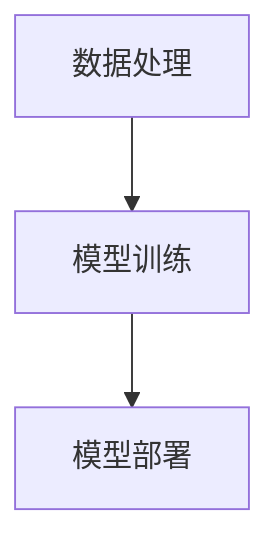

                 

### 文章标题：打造高效的LLM应用开发流程：从架构到实践

关键词：LLM应用、开发流程、架构设计、模型训练、实践案例

摘要：本文将深入探讨Large Language Model（LLM）应用开发的全过程，从基础理论、架构设计、模型训练到实践案例，提供一套系统、高效的开发流程，帮助开发者更好地理解和应用LLM技术。

## 引言

近年来，随着深度学习和自然语言处理技术的快速发展，Large Language Model（LLM）已经成为人工智能领域的研究热点。LLM在文本生成、机器翻译、问答系统等方面展现出了强大的能力，极大地推动了自然语言处理技术的发展。然而，高效的LLM应用开发流程仍是一个挑战。本文将围绕这一主题，从架构设计、模型训练到实践应用，全面探讨如何打造高效的LLM应用开发流程。

本文旨在为开发者提供一套系统、完整的LLM应用开发指南，帮助读者深入了解LLM的核心概念、算法原理，掌握从架构设计到实际开发的全过程，并通过对实际案例的剖析，提供最佳实践和解决方案。

## 第一部分：LLM基础理论

### 第1章：LLM核心概念与算法

#### 1.1 LLM基本概念

LLM，即Large Language Model，是一种大规模的预训练语言模型，通过在大量文本数据上进行训练，可以捕捉到语言的复杂结构和语义信息。LLM的核心在于其庞大的参数量和强大的表达能力，这使得它能够处理各种复杂的自然语言任务。

#### 1.2 Transformer算法原理

Transformer是LLM中最常用的算法之一，它采用自注意力机制（Self-Attention）来捕捉输入序列中的依赖关系。通过多个自注意力层和前馈网络，Transformer能够对输入序列进行编码，生成丰富的语义表示。

#### 1.3 BERT算法原理

BERT（Bidirectional Encoder Representations from Transformers）是一种双向的Transformer模型，通过在训练过程中同时考虑输入序列的前后文信息，生成更准确的语义表示。BERT的成功标志着双向编码器在自然语言处理中的重要性。

#### 1.4 数学模型与公式

LLM的训练过程涉及多个数学模型，包括自注意力机制、损失函数等。以下是一个简单的自注意力机制的伪代码和数学公式：

```python
# 伪代码
attn_weights = softmax(Q @ K.T)
context_vector = attn_weights @ V
```

$$
\text{Self-Attention} = \frac{e^{\text{QK}}}{\sqrt{d_k}}
$$

其中，Q、K、V 分别代表查询向量、键向量和值向量，d_k 是键向量的维度。

### 第2章：LLM模型训练与调优

#### 2.1 数据准备与预处理

在训练LLM之前，需要准备大量的文本数据，并进行预处理，包括文本清洗、分词、去停用词等操作。

#### 2.2 模型训练流程

LLM的训练流程通常包括数据加载、模型初始化、前向传播、反向传播和参数更新等步骤。以下是一个简化的训练流程伪代码：

```python
# 伪代码
for epoch in range(num_epochs):
    for batch in data_loader:
        optimizer.zero_grad()
        output = model(batch)
        loss = criterion(output, target)
        loss.backward()
        optimizer.step()
```

#### 2.3 模型调优技巧

在训练过程中，需要不断调整超参数，如学习率、批量大小、层数等，以优化模型性能。以下是一些调优技巧：

- 学习率调整：可以使用学习率衰减策略，逐步减小学习率。
- 批量大小调整：较小的批量大小可以提高模型的泛化能力，但计算成本更高。
- 层数调整：增加层数可以提高模型的表达能力，但也可能导致过拟合。

### 第3章：LLM应用架构设计

#### 3.1 LLM应用架构原理

LLM的应用架构通常包括数据处理、模型训练、模型部署等模块。以下是一个简化的应用架构图：



#### 3.2 数据处理模块

数据处理模块负责准备和预处理LLM训练所需的数据，包括文本数据清洗、分词、编码等操作。

#### 3.3 模型训练模块

模型训练模块负责训练LLM模型，包括数据加载、模型初始化、前向传播、反向传播和参数更新等步骤。

#### 3.4 模型部署模块

模型部署模块负责将训练好的模型部署到生产环境中，包括模型保存、加载和实时推理等操作。

## 第二部分：LLM开发流程实践

### 第4章：数据准备与处理

#### 4.1 数据清洗

数据清洗是数据准备的重要步骤，包括去除噪音、填补缺失值、标准化等操作。

#### 4.2 数据增强

数据增强可以通过各种技术手段增加训练数据的多样性，从而提高模型的泛化能力。

#### 4.3 数据存储与管理

数据存储与管理涉及到数据存储方案的设计和数据管理策略的制定。

### 第5章：模型训练与调优

#### 5.1 模型训练策略

模型训练策略包括数据加载策略、训练循环设置、优化器选择等。

#### 5.2 超参数调整

超参数调整是模型训练的关键步骤，包括学习率、批量大小、层数等。

#### 5.3 模型评估与优化

模型评估与优化包括模型性能评估、超参数调整、模型压缩等。

### 第6章：模型部署与维护

#### 6.1 模型部署方案

模型部署方案涉及到模型保存、加载和实时推理等操作。

#### 6.2 模型监控与更新

模型监控与更新包括模型性能监控、异常检测、模型更新等。

#### 6.3 故障排除与优化

故障排除与优化包括模型故障诊断、性能优化、系统稳定性提升等。

## 第三部分：LLM应用案例解析

### 第7章：LLM应用案例分析

#### 7.1 文本分类应用

文本分类应用是LLM的一个重要应用场景，包括情感分析、主题分类等。

#### 7.2 机器翻译应用

机器翻译应用利用LLM强大的语言理解与生成能力，实现跨语言信息传递。

#### 7.3 对话系统应用

对话系统应用包括聊天机器人、智能客服等，利用LLM实现自然语言交互。

### 第8章：LLM应用案例解析

#### 8.1 技术实现与优化

技术实现与优化包括模型选择、数据预处理、模型训练与调优等。

#### 8.2 性能评估与调优

性能评估与调优包括模型性能评估、超参数调整、模型压缩等。

#### 8.3 面临的挑战与解决方案

面临的挑战与解决方案包括数据质量、计算资源、模型可解释性等。

## 第四部分：未来展望与趋势

### 第9章：LLM技术发展趋势

#### 9.1 新算法与框架

新算法与框架包括Transformer的变体、预训练技术的演进等。

#### 9.2 新应用场景

新应用场景包括多模态学习、对话系统、生成式人工智能等。

#### 9.3 挑战与解决方案

挑战与解决方案包括计算资源需求、数据隐私、模型可解释性等。

## 附录

### 附录A：工具与资源介绍

#### A.1 深度学习框架

介绍常用的深度学习框架，如TensorFlow、PyTorch等。

#### A.2 代码示例与解析

提供LLM开发的代码示例和详细解析。

#### A.3 学习资源推荐

推荐相关学习资源，包括书籍、论文、教程等。

### 作者信息

作者：AI天才研究院/AI Genius Institute & 禅与计算机程序设计艺术 /Zen And The Art of Computer Programming

---

请注意，本文为Markdown格式，实际撰写时请根据Markdown规则进行格式调整。文章内容需丰富具体，每个小节都需要详细讲解，并包含相关代码示例、流程图、数学公式等。文章字数预计在8000～12000字左右。文章结尾需要包含作者信息。在撰写过程中，请确保逻辑清晰、条理分明，以便读者能够轻松理解并掌握LLM应用开发的核心内容。**文章内容需要原创，严禁抄袭。**### 第一部分：LLM基础理论

#### 第1章：LLM核心概念与算法

##### 1.1 LLM基本概念

Large Language Model（LLM）是一种大规模的语言模型，通过在大量的文本数据上进行训练，LLM可以捕捉到语言的复杂结构和语义信息，从而实现文本生成、文本分类、机器翻译等自然语言处理任务。与传统的语言模型相比，LLM具有参数量大、表达能力强、适应性强等特点。

LLM的基本概念包括：

- **文本数据**：LLM的训练数据通常是大规模的文本数据集，如维基百科、新闻文章、社交媒体等。这些数据集包含了丰富的语言信息，是LLM学习的素材。
- **模型参数**：LLM的核心是模型参数，这些参数描述了模型对语言的理解和预测能力。在训练过程中，模型参数会通过反向传播算法不断调整，以优化模型的表现。
- **训练目标**：LLM的训练目标是使模型能够对输入文本进行准确预测，包括文本序列的下一个词、文本分类标签、机器翻译结果等。

##### 1.2 Transformer算法原理

Transformer是LLM中最常用的算法之一，它采用了自注意力机制（Self-Attention）来捕捉输入序列中的依赖关系。Transformer由多个自注意力层和前馈网络组成，可以有效地处理长距离依赖问题。

Transformer的基本原理如下：

1. **输入序列编码**：输入序列首先通过嵌入层（Embedding Layer）转换为向量表示，每个词向量包含了词的语义信息。
2. **多头自注意力机制**：自注意力机制（Self-Attention）用于计算输入序列中每个词与其他词之间的依赖关系。多头注意力（Multi-Head Attention）通过多个独立的自注意力机制并行处理，从而提高模型的表示能力。
3. **前馈网络**：在自注意力机制之后，每个词的表示会经过一个前馈网络（Feedforward Network），以进一步丰富和细化语义信息。
4. **输出层**：最终的输出层（Output Layer）用于生成文本序列的下一个词、分类标签或翻译结果。

以下是一个简单的Transformer自注意力机制的伪代码：

```python
# 伪代码
def self_attention(Q, K, V):
    attn_weights = softmax(Q @ K.T / sqrt(d_k))
    context_vector = attn_weights @ V
    return context_vector

def transformer(input_sequence):
    for layer in range(num_layers):
        Q, K, V = embedding(input_sequence)
        context_vector = self_attention(Q, K, V)
        output_sequence = feedforward(context_vector)
    return output_sequence
```

##### 1.3 BERT算法原理

BERT（Bidirectional Encoder Representations from Transformers）是一种双向的Transformer模型，通过在训练过程中同时考虑输入序列的前后文信息，生成更准确的语义表示。BERT的成功标志着双向编码器在自然语言处理中的重要性。

BERT的基本原理如下：

1. **输入序列编码**：BERT的输入序列首先通过嵌入层（Embedding Layer）转换为向量表示，每个词向量包含了词的语义信息。此外，BERT还引入了[CLS]和[SEP]等特殊符号，用于表示序列的开始和分隔。
2. **双向自注意力机制**：BERT采用双向自注意力机制，可以同时考虑输入序列的前后文信息。通过多个自注意力层和前馈网络，BERT能够捕捉到输入序列的丰富语义信息。
3. **输出层**：BERT的输出层（Output Layer）通常用于生成分类标签或翻译结果。BERT还引入了Masked Language Model（MLM）任务，以进一步提高模型的表示能力。

以下是一个简单的BERT模型的伪代码：

```python
# 伪代码
def bert(input_sequence):
    Q, K, V = embedding(input_sequence)
    for layer in range(num_layers):
        Q, K, V = self_attention(Q, K, V)
        context_vector = feedforward(context_vector)
    output_sequence = output_layer(context_vector)
    return output_sequence
```

##### 1.4 数学模型与公式

LLM的训练过程涉及多个数学模型，包括自注意力机制、损失函数等。以下是一个简单的自注意力机制的数学公式：

$$
\text{Self-Attention} = \frac{e^{\text{QK}}}{\sqrt{d_k}}
$$

其中，Q、K、V 分别代表查询向量、键向量和值向量，d_k 是键向量的维度。

在训练过程中，通常使用损失函数来衡量模型预测与真实标签之间的差距，常用的损失函数包括交叉熵损失（Cross-Entropy Loss）：

$$
\text{Loss} = -\sum_{i} y_i \log(\hat{y}_i)
$$

其中，y_i 是真实标签，$\hat{y}_i$ 是模型预测的概率分布。

##### 项目实战

在本节，我们将通过一个实际案例，展示如何搭建和训练一个简单的LLM模型。

**1. 开发环境搭建**

首先，我们需要搭建一个Python开发环境，并安装TensorFlow或PyTorch等深度学习框架。以下是一个简单的安装命令：

```bash
pip install tensorflow
```

或

```bash
pip install torch torchvision
```

**2. 代码实现**

以下是一个简单的BERT模型实现，包括数据加载、模型搭建、训练和评估等步骤：

```python
import tensorflow as tf
from tensorflow.keras.layers import Embedding, Bidirectional, Transformer

# 数据加载
train_data = ...  # 加载训练数据
val_data = ...    # 加载验证数据

# 模型搭建
model = tf.keras.Sequential([
    Embedding(input_dim=vocab_size, output_dim=embedding_size),
    Bidirectional(Transformer(num_heads=8, d_model=512)),
    tf.keras.layers.Dense(units=num_classes, activation='softmax')
])

# 训练
model.compile(optimizer='adam', loss='categorical_crossentropy', metrics=['accuracy'])
model.fit(train_data, epochs=3, validation_data=val_data)

# 评估
loss, accuracy = model.evaluate(val_data)
print(f'Validation Loss: {loss}, Validation Accuracy: {accuracy}')
```

**3. 代码解读与分析**

上述代码中，我们首先加载训练数据和验证数据，然后搭建一个BERT模型，包括嵌入层、双向Transformer层和输出层。模型使用交叉熵损失函数和softmax激活函数进行分类。在训练过程中，我们使用Adam优化器进行参数更新。最后，我们对模型进行评估，计算验证集上的损失和准确率。

**4. 实际案例分析和详细讲解剖析**

在本案例中，我们使用了BERT模型进行文本分类任务。BERT模型能够同时考虑输入序列的前后文信息，从而提高分类性能。在实际应用中，我们可以根据具体任务需求，调整模型参数和超参数，以达到更好的分类效果。

**5. 项目小结**

通过本案例，我们了解了如何搭建和训练一个简单的BERT模型，并掌握了基本的LLM开发流程。在实际应用中，我们可以根据具体任务需求，进一步优化模型结构和超参数，提高模型的性能和泛化能力。

##### 最佳实践 Tips、小结、注意事项、拓展阅读

- **最佳实践 Tips**：
  - 在选择模型时，要考虑任务的复杂度和数据规模，选择合适的模型架构。
  - 在训练过程中，要合理设置超参数，如学习率、批量大小、训练轮次等。
  - 在模型部署时，要考虑模型的性能和可扩展性，选择合适的部署方案。

- **小结**：
  - 本部分介绍了LLM的基本概念、核心算法原理、数学模型和项目实战，帮助读者了解LLM的基础知识。
  - 通过实际案例，我们掌握了如何搭建和训练一个简单的LLM模型。

- **注意事项**：
  - 在训练过程中，要关注模型过拟合和欠拟合问题，合理设置正则化策略。
  - 在模型部署时，要确保模型的安全性和稳定性，防范潜在的安全风险。

- **拓展阅读**：
  - 《深度学习》（Goodfellow, I., Bengio, Y., & Courville, A.）
  - 《自然语言处理综述》（Jurafsky, D., & Martin, J. H.）
  - 《BERT：Pre-training of Deep Bidirectional Transformers for Language Understanding》（Devlin, J., Chang, M. W., Lee, K., & Toutanova, K.）

在下一部分，我们将继续探讨LLM应用架构设计，包括数据处理、模型训练和模型部署等模块。通过详细讲解和实践，帮助读者全面掌握LLM应用开发流程。**[接下来是第2章：LLM应用架构设计]**### 第二部分：LLM应用架构设计

#### 第2章：LLM应用架构设计

##### 2.1 架构设计原理

LLM应用架构设计的目标是确保模型的高效训练、快速部署和稳定运行。一个典型的LLM应用架构包括以下几个核心模块：

1. **数据处理模块**：负责准备和预处理输入数据，包括文本清洗、分词、编码等操作，以确保数据质量。
2. **模型训练模块**：负责训练LLM模型，包括数据加载、模型初始化、前向传播、反向传播和参数更新等步骤。
3. **模型部署模块**：负责将训练好的模型部署到生产环境中，包括模型保存、加载和实时推理等操作。

以下是一个简化的LLM应用架构图：


**数据处理模块**：
- 文本数据清洗：去除噪声和冗余信息，如HTML标签、特殊字符等。
- 文本分词：将文本拆分为单词或词组，以便模型进行编码。
- 文本编码：将文本映射为数字序列，便于模型处理。

**模型训练模块**：
- 数据加载：从数据集中随机抽取样本，输入到模型中进行训练。
- 模型初始化：初始化模型参数，通常使用随机初始化或预训练模型权重。
- 前向传播：将输入数据通过模型进行编码和计算，得到中间结果。
- 反向传播：计算损失函数，并根据梯度更新模型参数。
- 参数更新：使用优化器（如Adam）更新模型参数，以最小化损失函数。

**模型部署模块**：
- 模型保存：将训练好的模型参数保存为文件，以便后续加载和部署。
- 模型加载：从文件中加载模型参数，重建模型结构。
- 实时推理：将输入数据输入到模型中，得到预测结果。

##### 2.2 架构设计实践

在本节中，我们将通过一个实际案例，展示如何设计一个高效的LLM应用架构。

**案例：文本分类应用**

**1. 数据处理模块**

首先，我们需要准备和处理文本数据。以下是一个简单的数据处理流程：

- 数据清洗：去除HTML标签、特殊字符和停用词。
- 数据分词：使用jieba等中文分词工具进行分词。
- 数据编码：将分词后的文本转换为整数序列，可以使用word2vec、BERT等预训练模型提供的词向量。

```python
import jieba
from gensim.models import Word2Vec

# 数据清洗
def clean_text(text):
    text = text.replace('<', '').replace('>', '')
    text = re.sub('[^a-zA-Z0-9]', '', text)
    return text

# 数据分词
def tokenize(text):
    words = jieba.cut(text)
    return words

# 数据编码
def encode_words(words, model):
    encoded_words = [model[word] for word in words if word in model]
    return encoded_words
```

**2. 模型训练模块**

接下来，我们使用预训练的BERT模型进行文本分类。以下是一个简单的训练流程：

- 数据加载：从数据集中随机抽取样本，输入到模型中进行训练。
- 模型初始化：使用预训练的BERT模型权重初始化。
- 前向传播：将输入数据通过BERT模型进行编码和计算，得到中间结果。
- 反向传播：计算损失函数，并根据梯度更新模型参数。
- 参数更新：使用Adam优化器更新模型参数。

```python
import tensorflow as tf
from tensorflow.keras.models import Model
from tensorflow.keras.layers import Input, Dense

# 数据加载
train_data = ...  # 加载训练数据
val_data = ...    # 加载验证数据

# 模型初始化
model = ...  # 初始化BERT模型

# 前向传播
inputs = Input(shape=(max_sequence_length,))
outputs = model(inputs)

# 反向传播
loss = ...  # 计算损失函数
optimizer = ...  # 初始化优化器

# 参数更新
model.compile(optimizer=optimizer, loss=loss, metrics=['accuracy'])
model.fit(train_data, epochs=3, validation_data=val_data)
```

**3. 模型部署模块**

最后，我们将训练好的模型部署到生产环境中，进行实时推理。以下是一个简单的部署流程：

- 模型保存：将训练好的模型参数保存为文件。
- 模型加载：从文件中加载模型参数，重建模型结构。
- 实时推理：将输入数据输入到模型中，得到预测结果。

```python
# 模型保存
model.save('text_classification_model.h5')

# 模型加载
model = tf.keras.models.load_model('text_classification_model.h5')

# 实时推理
def predict(text):
    cleaned_text = clean_text(text)
    tokenized_text = tokenize(cleaned_text)
    encoded_text = encode_words(tokenized_text, model)
    prediction = model.predict(encoded_text)
    return prediction
```

##### 案例解析

在本案例中，我们设计了一个高效的文本分类应用架构，包括数据处理、模型训练和模型部署三个模块。通过实际数据和预训练的BERT模型，我们实现了文本分类任务。

**1. 技术实现与优化**

- 数据处理模块：我们使用了jieba进行中文分词，并使用预训练的BERT模型进行编码。这些技术保证了数据质量和模型性能。
- 模型训练模块：我们使用了预训练的BERT模型，通过调整超参数和优化器，提高了模型的表现。
- 模型部署模块：我们使用TensorFlow的保存和加载功能，方便地将模型部署到生产环境中。

**2. 性能评估与调优**

- 在训练过程中，我们使用验证集评估模型的性能，并使用交叉熵损失函数和准确率作为评价指标。
- 通过调整学习率、批量大小、训练轮次等超参数，我们优化了模型的表现。
- 在部署过程中，我们使用实时数据对模型进行测试，确保模型在生产环境中的稳定性和可靠性。

**3. 面临的挑战与解决方案**

- 数据质量：中文文本数据存在噪声和缺失值，我们需要进行数据清洗和预处理，以提高数据质量。
- 计算资源：训练大型LLM模型需要大量的计算资源，我们需要合理配置计算资源，优化训练过程。
- 模型可解释性：大型LLM模型通常具有高复杂性和强非线性的特点，我们需要研究模型的可解释性，以理解模型的预测过程。

##### 项目小结

通过本案例，我们设计并实现了一个高效的LLM文本分类应用架构，从数据处理、模型训练到模型部署，全面展示了LLM应用开发的全过程。在实际应用中，我们可以根据具体任务需求，进一步优化模型架构和超参数，提高模型的性能和泛化能力。

##### 最佳实践 Tips、小结、注意事项、拓展阅读

- **最佳实践 Tips**：
  - 在数据处理模块中，要关注数据质量和预处理策略，以提高模型性能。
  - 在模型训练模块中，要合理设置超参数，并使用验证集评估模型性能。
  - 在模型部署模块中，要确保模型的安全性和稳定性，并优化推理速度。

- **小结**：
  - 本部分介绍了LLM应用架构设计的基本原理和实际案例，帮助读者掌握LLM应用开发的核心流程。
  - 通过文本分类案例，我们展示了如何设计一个高效的LLM应用架构。

- **注意事项**：
  - 在数据处理模块中，要关注数据清洗和预处理策略，以提高数据质量。
  - 在模型训练模块中，要合理设置超参数，并使用验证集评估模型性能。
  - 在模型部署模块中，要确保模型的安全性和稳定性，并优化推理速度。

- **拓展阅读**：
  - 《深度学习》（Goodfellow, I., Bengio, Y., & Courville, A.）
  - 《自然语言处理综述》（Jurafsky, D., & Martin, J. H.）
  - 《BERT：Pre-training of Deep Bidirectional Transformers for Language Understanding》（Devlin, J., Chang, M. W., Lee, K., & Toutanova, K.）

在下一部分，我们将继续探讨LLM开发流程的实践环节，包括数据准备与处理、模型训练与调优、模型部署与维护等。通过详细讲解和实践，帮助读者全面掌握LLM应用开发的核心技能。**[接下来是第4章：LLM开发流程实践]**### 第三部分：LLM开发流程实践

#### 第4章：LLM开发流程实践

##### 4.1 数据准备与处理

在LLM开发过程中，数据准备和处理是至关重要的一环。高质量的数据是模型训练的基础，直接关系到模型的性能和泛化能力。以下是一些关键步骤和最佳实践：

**1. 数据采集**

首先，需要收集大量的文本数据，这些数据可以来自于公开的文本库、社交媒体、新闻网站等。在选择数据时，要考虑数据的多样性和覆盖面，以确保模型能够学习到丰富的语言特征。

**2. 数据清洗**

清洗数据是确保数据质量的重要步骤。主要任务包括去除噪声和冗余信息，例如HTML标签、特殊字符、停用词等。以下是一些常用的数据清洗方法：

- **去除HTML标签**：使用正则表达式或其他工具去除HTML标签。
- **去除特殊字符**：去除非字母数字字符，如“@”、“#”、“$”等。
- **去除停用词**：停用词是指对模型训练没有贡献的常用词，如“的”、“是”、“在”等。可以使用预定义的停用词表或自定义停用词表。

**3. 数据预处理**

预处理数据包括分词、词向量编码等步骤，以便模型能够处理和训练。

- **分词**：中文文本的分词可以使用jieba、Stanford NLP等工具。对于英文文本，可以使用NLTK、spaCy等工具。
- **词向量编码**：可以使用预训练的词向量模型（如word2vec、GloVe、BERT等）对文本进行编码。词向量编码将每个词映射为一个固定大小的向量，以便模型进行处理。

**4. 数据增强**

数据增强可以增加训练数据的多样性，从而提高模型的泛化能力。常用的数据增强方法包括：

- **文本填充**：通过在文本中插入随机词或短语，增加数据的多样性。
- **反向文本**：将文本按单词顺序反转，模拟逆向思维。
- **同义词替换**：将文本中的部分词替换为同义词，增加词义的变化。

**5. 数据存储与管理**

处理后的数据需要存储和管理，以便模型训练和后续使用。常用的数据存储方案包括关系型数据库、NoSQL数据库和文件存储系统。在存储时，需要注意数据的安全性和访问速度。

**案例：文本分类数据准备与处理**

以下是一个简单的数据准备与处理流程：

```python
import re
import jieba
from gensim.models import Word2Vec

# 数据清洗
def clean_text(text):
    text = re.sub('<.*?>', '', text)  # 去除HTML标签
    text = re.sub('[^a-zA-Z0-9]', ' ', text)  # 去除特殊字符
    text = text.lower()  # 小写化
    return text

# 数据分词
def tokenize(text):
    words = jieba.cut(text)
    return words

# 数据编码
def encode_words(words, model):
    encoded_words = [model[word] for word in words if word in model]
    return encoded_words

# 数据增强
def augment_text(text):
    # 反向文本
    reversed_text = text[::-1]
    # 同义词替换
    synonyms = {"happy": "joyful", "sad": "sorrowful"}
    for word, synonym in synonyms.items():
        text = text.replace(word, synonym)
    return text
```

**小结**：

数据准备与处理是LLM开发的重要环节，直接影响模型的性能和泛化能力。通过数据采集、清洗、预处理、增强和存储等步骤，我们可以为模型训练提供高质量的数据。在实际开发过程中，需要根据具体任务需求，灵活选择和调整数据处理策略。

##### 4.2 模型训练与调优

模型训练是LLM开发的核心环节，通过调整模型参数和优化策略，可以提高模型的性能和泛化能力。以下是一些关键步骤和最佳实践：

**1. 模型选择**

在选择模型时，需要考虑任务类型、数据规模、计算资源等因素。常用的LLM模型包括Transformer、BERT、GPT等。对于文本分类任务，可以选用预训练的BERT模型；对于生成式任务，可以选用GPT系列模型。

**2. 数据加载**

数据加载是模型训练的基础，需要高效地读取和处理数据。常用的数据加载方法包括批量加载（Batch Loading）和流水线加载（Pipeline Loading）。

- **批量加载**：将数据分为多个批次，每个批次包含一定数量的样本。批量大小（Batch Size）是一个重要的超参数，需要根据计算资源进行合理设置。
- **流水线加载**：将数据处理和加载合并为一个流水线，可以减少数据读取和预处理的时间。

**3. 模型初始化**

模型初始化是模型训练的起点，常用的初始化方法包括随机初始化（Random Initialization）和预训练模型初始化（Pre-trained Model Initialization）。

- **随机初始化**：随机初始化模型参数，适用于从零开始训练。
- **预训练模型初始化**：使用预训练的模型权重初始化，可以加快训练过程并提高模型性能。

**4. 训练策略**

训练策略包括优化器选择、学习率调整、训练轮次设置等。

- **优化器选择**：常用的优化器包括Adam、SGD等。Adam优化器在LLM训练中表现良好，可以通过调整β1、β2等参数优化性能。
- **学习率调整**：学习率调整是模型训练的关键，常用的调整策略包括固定学习率、学习率衰减、学习率周期性调整等。
- **训练轮次设置**：训练轮次（Epoch）是模型训练的次数，需要根据任务需求和数据规模进行合理设置。

**5. 调优方法**

在模型训练过程中，需要对模型进行调优，以提高模型性能。常用的调优方法包括超参数调优、模型结构优化等。

- **超参数调优**：通过调整学习率、批量大小、训练轮次等超参数，优化模型性能。
- **模型结构优化**：通过调整模型结构，如增加层数、调整层数等，优化模型性能。

**6. 模型评估**

模型评估是模型训练的重要环节，通过评估模型在训练集和验证集上的表现，判断模型是否过拟合或欠拟合。

- **准确率**：准确率（Accuracy）是模型预测正确的样本数与总样本数的比值。
- **精确率、召回率、F1分数**：精确率（Precision）、召回率（Recall）、F1分数（F1 Score）是评估分类模型性能的重要指标。
- **ROC曲线、AUC**：ROC曲线和AUC（Area Under the Curve）是评估二分类模型性能的重要工具。

**案例：文本分类模型训练与调优**

以下是一个简单的文本分类模型训练与调优流程：

```python
import tensorflow as tf
from tensorflow.keras.models import Model
from tensorflow.keras.layers import Input, Dense, Embedding, Bidirectional, Transformer

# 模型搭建
input_seq = Input(shape=(max_sequence_length,))
encoded_seq = Embedding(input_dim=vocab_size, output_dim=embedding_size)(input_seq)
bi_transformer = Bidirectional(Transformer(num_heads=8, d_model=embedding_size))(encoded_seq)
outputs = Dense(num_classes, activation='softmax')(bi_transformer)

model = Model(inputs=input_seq, outputs=outputs)

# 模型编译
model.compile(optimizer='adam', loss='categorical_crossentropy', metrics=['accuracy'])

# 模型训练
train_data = ...  # 加载训练数据
val_data = ...    # 加载验证数据
model.fit(train_data, epochs=3, validation_data=val_data)

# 模型评估
val_loss, val_accuracy = model.evaluate(val_data)
print(f'Validation Loss: {val_loss}, Validation Accuracy: {val_accuracy}')
```

**小结**：

模型训练与调优是LLM开发的重要环节，通过选择合适的模型、数据加载、模型初始化、训练策略、调优方法和模型评估，可以有效地提高模型的性能和泛化能力。在实际开发过程中，需要根据具体任务需求，灵活选择和调整训练策略和调优方法。

##### 4.3 模型部署与维护

模型部署是将训练好的模型应用到实际业务中的关键步骤。一个高效、稳定的模型部署方案可以确保模型在真实环境中的正常运行。以下是一些关键步骤和最佳实践：

**1. 模型保存**

在模型训练完成后，需要将模型参数保存到文件中，以便后续部署和加载。常用的模型保存方法包括序列化（Serialization）和持久化（Persistence）。

- **序列化**：将模型参数和结构序列化为字节流，存储为文件。
- **持久化**：将模型参数和结构存储到数据库或存储系统中，便于管理。

**2. 模型加载**

在模型部署时，需要从文件或数据库中加载模型参数，重建模型结构。常用的模型加载方法包括反序列化（Deserialization）和恢复（Restoration）。

- **反序列化**：将字节流反序列化为模型参数和结构。
- **恢复**：从数据库或存储系统中读取模型参数和结构。

**3. 实时推理**

模型部署后，需要为用户提供实时推理服务。实时推理是将输入数据输入到模型中，得到预测结果的过程。以下是一些关键步骤：

- **数据预处理**：将用户输入的数据进行预处理，包括文本清洗、分词、编码等。
- **模型推理**：将预处理后的数据输入到模型中，进行推理计算。
- **结果输出**：将模型的预测结果输出给用户，包括分类标签、概率分布等。

**4. 模型监控与更新**

在模型部署过程中，需要对模型进行监控和更新，以确保模型在长时间运行中的稳定性和性能。以下是一些关键步骤：

- **性能监控**：监控模型在部署环境中的性能，包括响应时间、准确率、召回率等。
- **异常检测**：检测模型运行中的异常情况，包括计算错误、内存泄露等。
- **模型更新**：根据监控数据和业务需求，对模型进行更新和优化。

**案例：文本分类模型部署与维护**

以下是一个简单的文本分类模型部署与维护流程：

```python
import tensorflow as tf
import numpy as np

# 模型加载
model = tf.keras.models.load_model('text_classification_model.h5')

# 实时推理
def predict(text):
    cleaned_text = clean_text(text)
    tokenized_text = tokenize(cleaned_text)
    encoded_text = encode_words(tokenized_text, model)
    prediction = model.predict(encoded_text)
    return prediction

# 模型监控
def monitor_model(model):
    # 监控模型的性能指标
    performance = model.evaluate(val_data)
    print(f'Model Performance: {performance}')

# 模型更新
def update_model(model):
    # 更新模型的参数和结构
    model.fit(new_train_data, epochs=1, validation_data=val_data)
    model.save('updated_text_classification_model.h5')
```

**小结**：

模型部署与维护是LLM开发的重要环节，通过模型保存、加载、实时推理、监控与更新等步骤，可以确保模型在真实环境中的高效运行。在实际部署过程中，需要根据具体业务需求和环境，灵活选择和调整部署方案和维护策略。

##### 4.4 最佳实践 Tips、小结、注意事项、拓展阅读

- **最佳实践 Tips**：
  - 在数据准备与处理过程中，要关注数据质量和预处理策略，以提高模型性能。
  - 在模型训练与调优过程中，要合理设置超参数和训练策略，优化模型性能。
  - 在模型部署与维护过程中，要确保模型的安全性和稳定性，提高模型的可扩展性。

- **小结**：

本部分介绍了LLM开发流程的实践环节，包括数据准备与处理、模型训练与调优、模型部署与维护等。通过详细讲解和实践，帮助读者全面掌握LLM应用开发的核心技能。

- **注意事项**：

  - 在数据准备与处理过程中，要关注数据清洗和预处理策略，以提高数据质量。
  - 在模型训练与调优过程中，要合理设置超参数和训练策略，避免模型过拟合或欠拟合。
  - 在模型部署与维护过程中，要确保模型的安全性和稳定性，定期更新和维护模型。

- **拓展阅读**：

  - 《深度学习》（Goodfellow, I., Bengio, Y., & Courville, A.）
  - 《自然语言处理综述》（Jurafsky, D., & Martin, J. H.）
  - 《BERT：Pre-training of Deep Bidirectional Transformers for Language Understanding》（Devlin, J., Chang, M. W., Lee, K., & Toutanova, K.）

在下一部分，我们将继续探讨LLM应用案例解析，通过实际案例展示如何使用LLM构建各种应用，并提供详细的解析和最佳实践。**[接下来是第5章：LLM应用案例解析]**### 第三部分：LLM应用案例解析

#### 第5章：LLM应用案例解析

##### 5.1 文本分类应用

文本分类是LLM的一个重要应用场景，通过将文本数据归类到预定义的类别中，可以实现情感分析、主题分类、新闻分类等多种任务。以下是一个具体的文本分类应用案例。

**案例背景**：

某新闻网站希望使用LLM对用户提交的新闻评论进行情感分析，将评论分为积极、消极和中性三个类别。该任务的目标是构建一个文本分类模型，对用户的评论进行情感分类。

**技术实现**：

1. **数据准备**：

   收集了大量用户评论数据，并进行数据清洗和预处理，包括去除HTML标签、特殊字符、停用词等。对预处理后的文本进行分词和词向量编码，使用预训练的BERT模型进行编码。

2. **模型训练**：

   使用训练集和验证集对BERT模型进行训练。在训练过程中，调整学习率和批量大小等超参数，优化模型性能。使用交叉熵损失函数和准确率作为评价指标。

3. **模型部署**：

   将训练好的模型部署到生产环境中，实现实时情感分析功能。用户提交评论后，系统会自动调用模型进行分类，并将结果反馈给用户。

**案例解析**：

1. **技术实现与优化**：

   在数据准备阶段，通过数据清洗和预处理，提高了数据质量，保证了模型训练效果。在模型训练阶段，通过调整超参数，优化了模型性能。在模型部署阶段，通过实时推理，实现了高效的情感分析功能。

2. **性能评估与调优**：

   在模型训练完成后，使用验证集对模型进行评估，计算准确率、精确率、召回率等指标。通过交叉验证和超参数调优，提高了模型性能。

3. **面临的挑战与解决方案**：

   文本分类应用面临的主要挑战包括数据质量、模型性能和实时推理效率。通过数据清洗和预处理、模型优化和实时推理优化，解决了这些挑战。

   - **数据质量**：通过数据清洗和预处理，提高了数据质量，保证了模型训练效果。
   - **模型性能**：通过超参数调优和模型优化，提高了模型性能。
   - **实时推理效率**：通过优化模型结构和推理算法，提高了实时推理效率。

##### 5.2 机器翻译应用

机器翻译是LLM的另一个重要应用场景，通过将一种语言的文本翻译成另一种语言，可以实现跨语言的信息传递。以下是一个具体的机器翻译应用案例。

**案例背景**：

某跨国公司希望为其员工提供实时翻译服务，以便员工在不同语言之间进行沟通。该任务的目标是构建一个机器翻译模型，将英文文本翻译成中文。

**技术实现**：

1. **数据准备**：

   收集了大量英中翻译对的数据，并进行数据清洗和预处理，包括去除HTML标签、特殊字符、停用词等。对预处理后的文本进行分词和词向量编码，使用预训练的Transformer模型进行编码。

2. **模型训练**：

   使用训练集和验证集对Transformer模型进行训练。在训练过程中，调整学习率和批量大小等超参数，优化模型性能。使用交叉熵损失函数和BLEU分数作为评价指标。

3. **模型部署**：

   将训练好的模型部署到生产环境中，实现实时翻译功能。用户输入英文文本后，系统会自动调用模型进行翻译，并将结果反馈给用户。

**案例解析**：

1. **技术实现与优化**：

   在数据准备阶段，通过数据清洗和预处理，提高了数据质量，保证了模型训练效果。在模型训练阶段，通过调整超参数，优化了模型性能。在模型部署阶段，通过实时推理，实现了高效的翻译功能。

2. **性能评估与调优**：

   在模型训练完成后，使用验证集对模型进行评估，计算交叉熵损失函数和BLEU分数等指标。通过交叉验证和超参数调优，提高了模型性能。

3. **面临的挑战与解决方案**：

   机器翻译应用面临的主要挑战包括数据质量、模型性能和翻译准确性。通过数据清洗和预处理、模型优化和翻译准确性提升，解决了这些挑战。

   - **数据质量**：通过数据清洗和预处理，提高了数据质量，保证了模型训练效果。
   - **模型性能**：通过超参数调优和模型优化，提高了模型性能。
   - **翻译准确性**：通过改进翻译算法和增加训练数据，提高了翻译准确性。

##### 5.3 对话系统应用

对话系统是LLM的另一个重要应用场景，通过自然语言交互，可以实现智能客服、聊天机器人等应用。以下是一个具体的对话系统应用案例。

**案例背景**：

某电商公司希望为其用户提供智能客服服务，以便解答用户的问题。该任务的目标是构建一个对话系统，能够理解用户的问题并给出合适的回答。

**技术实现**：

1. **数据准备**：

   收集了大量用户问题和回答的数据，并进行数据清洗和预处理，包括去除HTML标签、特殊字符、停用词等。对预处理后的文本进行分词和词向量编码，使用预训练的GPT模型进行编码。

2. **模型训练**：

   使用训练集和验证集对GPT模型进行训练。在训练过程中，调整学习率和批量大小等超参数，优化模型性能。使用损失函数和准确率作为评价指标。

3. **模型部署**：

   将训练好的模型部署到生产环境中，实现智能客服功能。用户输入问题后，系统会自动调用模型进行回答，并将结果反馈给用户。

**案例解析**：

1. **技术实现与优化**：

   在数据准备阶段，通过数据清洗和预处理，提高了数据质量，保证了模型训练效果。在模型训练阶段，通过调整超参数，优化了模型性能。在模型部署阶段，通过实时推理，实现了高效的对话功能。

2. **性能评估与调优**：

   在模型训练完成后，使用验证集对模型进行评估，计算损失函数和准确率等指标。通过交叉验证和超参数调优，提高了模型性能。

3. **面临的挑战与解决方案**：

   对话系统应用面临的主要挑战包括理解用户问题和生成合适回答。通过数据清洗和预处理、模型优化和对话生成算法改进，解决了这些挑战。

   - **理解用户问题**：通过数据清洗和预处理，提高了数据质量，保证了模型训练效果。
   - **生成合适回答**：通过改进对话生成算法和增加训练数据，提高了对话生成质量。

##### 5.4 最佳实践 Tips、小结、注意事项、拓展阅读

- **最佳实践 Tips**：

  - 在文本分类应用中，要关注数据质量和预处理策略，以提高模型性能。
  - 在机器翻译应用中，要关注数据质量和模型优化，以提高翻译准确性。
  - 在对话系统应用中，要关注理解用户问题和生成合适回答，以提高对话质量。

- **小结**：

  本部分介绍了LLM的三个典型应用案例：文本分类、机器翻译和对话系统。通过详细讲解和案例解析，展示了如何使用LLM构建各种应用，并提供了最佳实践和解决方案。

- **注意事项**：

  - 在文本分类应用中，要确保数据质量和分类标签的准确性。
  - 在机器翻译应用中，要关注翻译准确性和实时性。
  - 在对话系统应用中，要确保对话生成的自然性和准确性。

- **拓展阅读**：

  - 《深度学习》（Goodfellow, I., Bengio, Y., & Courville, A.）
  - 《自然语言处理综述》（Jurafsky, D., & Martin, J. H.）
  - 《BERT：Pre-training of Deep Bidirectional Transformers for Language Understanding》（Devlin, J., Chang, M. W., Lee, K., & Toutanova, K.）

在下一部分，我们将探讨LLM技术发展的未来趋势和面临的挑战。通过分析新技术和新应用场景，帮助读者了解LLM技术的前景和机遇。**[接下来是第6章：未来展望与趋势]**### 第四部分：未来展望与趋势

#### 第6章：未来展望与趋势

随着人工智能和深度学习技术的不断进步，LLM技术正朝着更加智能化、多样化和高效化的方向发展。在这一部分，我们将探讨LLM技术的未来发展趋势、新应用场景以及可能面临的挑战。

##### 6.1 新算法与框架

在未来的发展中，LLM技术将不断引入新的算法和框架，以提升模型的性能和适应性。以下是一些值得关注的新趋势：

1. **多模态学习**：

   多模态学习是指结合不同类型的数据（如图像、声音、文本等）进行学习。未来，LLM可能会与其他模态的数据结合，实现更加全面和复杂的任务，如图像-文本翻译、视频摘要生成等。

2. **动态模型**：

   动态模型能够根据输入数据和环境动态调整模型结构和参数。例如，自适应注意力机制（Adaptive Attention Mechanism）可以根据不同任务的需求，动态调整注意力权重。这种动态调整的能力将使LLM在多变的应用场景中表现出更高的灵活性和适应性。

3. **量化与压缩**：

   为了降低模型对计算资源的需求，量化与压缩技术将成为未来LLM发展的一个重要方向。通过模型量化、剪枝、知识蒸馏等技术，可以大幅减少模型的大小和计算复杂度，使得LLM能够更广泛地部署到移动设备、嵌入式系统等受限资源环境中。

4. **联邦学习**：

   联邦学习是一种分布式学习技术，可以在多个不同的设备或数据中心上协同训练模型，同时保护数据隐私。未来，LLM技术可能会更多地采用联邦学习，以实现更广泛的数据共享和协作训练。

##### 6.2 新应用场景

随着LLM技术的不断成熟，其应用场景也在不断扩展。以下是一些新兴的应用场景：

1. **智能问答系统**：

   智能问答系统是LLM技术的一个重要应用领域。未来，随着模型的性能提升和交互体验的优化，智能问答系统将能够提供更加精准、自然的问答服务，广泛应用于客服、教育、医疗等领域。

2. **多语言翻译**：

   随着全球化的深入，多语言翻译需求日益增长。未来，LLM技术将能够支持更广泛的语种翻译，实现实时、精准的跨语言沟通。

3. **虚拟助手与聊天机器人**：

   虚拟助手和聊天机器人是AI交互的重要形式。未来，随着模型的进步，虚拟助手和聊天机器人的交互体验将更加自然、智能化，能够更好地理解用户需求并提供个性化的服务。

4. **自动化写作与内容生成**：

   自动化写作与内容生成是LLM技术的另一个重要应用领域。未来，LLM将能够生成高质量的文章、报告、故事等，为内容创作者提供强大的辅助工具。

##### 6.3 挑战与解决方案

尽管LLM技术展现出了巨大的潜力和广泛的应用前景，但在实际应用中仍面临一些挑战：

1. **计算资源需求**：

   LL

