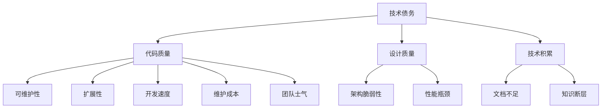

                 

### 文章标题

《技术债务管理：在LLM应用敏捷开发中保持平衡》

### 关键词

- 技术债务
- LLM应用
- 敏捷开发
- 技术债务评估
- 数学模型
- 项目实战

### 摘要

本文旨在探讨技术债务管理在大型语言模型（LLM）应用敏捷开发中的重要性。通过对技术债务的概念、类型、原因及影响的深入分析，结合LLM架构和敏捷开发方法，本文提出了一套行之有效的技术债务管理方法。文章采用Mermaid流程图、伪代码和LaTeX公式等工具，详细讲解了技术债务评估、优先级排序及其在项目实战中的应用。通过实际案例分析，本文总结出了一些最佳实践，为在敏捷开发环境中保持LLM应用的平衡提供了有力支持。本文适用于希望提高技术债务管理水平的技术专家和项目经理。

### 引言

在现代软件工程中，技术债务（Technical Debt）是一个常见且不可避免的概念。它类似于财务领域的债务，指的是因快速交付而暂时牺牲代码质量所欠下的“债务”。技术债务管理的好坏直接影响到软件项目的长期稳定性和可持续发展。尤其是在大型语言模型（LLM）应用的开发中，技术债务管理尤为重要。

LLM作为当今人工智能领域的重要成果，具有巨大的潜力和广泛的应用前景。然而，LLM的开发过程复杂、迭代速度快，常常需要在时间紧迫的情况下做出妥协，从而导致技术债务的产生。如果不加以合理管理，这些债务可能会逐渐累积，最终对项目造成严重的负面影响，如代码质量下降、维护成本增加、开发速度减慢等。

敏捷开发（Agile Development）作为一种以人为核心、迭代、增量的软件开发方法，逐渐成为许多团队的优先选择。敏捷开发强调快速反馈、持续交付和适应性管理，与LLM开发的需求高度契合。然而，敏捷开发并不直接解决技术债务问题，因此如何在敏捷开发环境中保持技术债务的平衡，成为了一个亟待解决的问题。

本文旨在探讨技术债务管理在LLM应用敏捷开发中的重要性，并提出一套行之有效的管理方法。通过深入分析技术债务的概念、类型、原因及影响，结合LLM架构和敏捷开发方法，本文将详细讲解技术债务评估、优先级排序及其在项目实战中的应用。希望通过本文的研究，为技术专家和项目经理在LLM应用敏捷开发中提供有益的参考和指导。

### 第1章：技术债务概述

#### 技术债务的概念与类型

技术债务（Technical Debt）这一概念最早由敏捷软件开发运动的关键人物杰拉尔德·加瑞特（Gerald M. Weinberg）提出。他在《软件喷泉》（The Software Runway）一书中将其比喻为“软件中因快速交付而暂时牺牲质量所欠下的债务”。简单来说，技术债务就是因选择短期优化而导致长期代价的决策。

**技术债务的概念**

技术债务主要包括以下几个方面：

1. **代码质量**：因追求短期交付而牺牲代码的可读性、可维护性和扩展性。
2. **设计质量**：因时间或资源限制，未能采用最优的设计方案，导致系统架构的脆弱性。
3. **技术积累**：因缺乏系统性的知识积累和文档整理，导致后续工作的困难。

**技术债务的类型**

根据产生原因和表现形式，技术债务可以分为以下几种类型：

1. **设计债务**：因设计上的妥协或缺陷导致的债务，如过度耦合、缺乏模块化等。
2. **架构债务**：因系统架构上的不足或缺陷导致的债务，如单点故障、性能瓶颈等。
3. **代码债务**：因代码质量不佳导致的债务，如代码冗长、复用性差、安全性不足等。
4. **知识债务**：因缺乏文档和知识积累导致的债务，如团队知识断层、信息不对称等。

#### 技术债务的原因

技术债务的产生往往与以下几个因素密切相关：

1. **时间压力**：在项目时间紧迫的情况下，团队常常被迫做出妥协，牺牲代码质量以追求快速交付。
2. **资源限制**：在资源（如人力、技术、资金）有限的情况下，团队难以投入足够的时间和精力进行系统性的代码优化和重构。
3. **需求变化**：频繁的需求变更导致项目计划频繁调整，使得团队无法按原计划进行系统性的质量提升。
4. **技术选择**：选择技术栈时，团队可能会因追求最新技术或快速交付而忽视长期维护的复杂性。

#### 技术债务的影响

技术债务如果不加以管理，将对项目产生多方面的负面影响：

1. **代码质量下降**：技术债务积累会导致代码质量逐渐恶化，影响系统的稳定性、可维护性和扩展性。
2. **开发速度减慢**：随着技术债务的增加，修复和解决债务所需的时间和成本也会逐渐增加，从而降低开发速度。
3. **维护成本增加**：技术债务会提高系统的维护成本，因为老旧的代码和设计需要更多的时间和资源进行维护和修复。
4. **团队士气下降**：技术债务的积累会导致团队士气下降，因为成员常常感到工作质量难以保障，从而影响团队的整体效率和积极性。

综上所述，技术债务管理是软件工程中不可或缺的一部分。通过对技术债务的深入理解，我们可以更好地识别和管理债务，从而确保项目的长期稳定性和可持续发展。

#### 核心概念与联系

为了更好地理解技术债务的概念及其在软件工程中的应用，我们需要绘制一个Mermaid流程图来展示核心概念之间的关系。



在这个流程图中，技术债务（A）是核心概念，它直接或间接地影响代码质量（B）、设计质量（C）和技术积累（D）。代码质量（B）又进一步影响可维护性（E）、扩展性（F），而设计质量（C）则导致架构脆弱性（G）和性能瓶颈（H）。技术积累（D）则导致文档不足（I）和知识断层（J）。此外，技术债务（A）通过影响代码质量（B）间接影响开发速度（K）、维护成本（L）和团队士气（M）。通过这个流程图，我们可以更直观地理解技术债务在软件工程中的多重影响和相互作用。

### 第2章：LLM架构与敏捷开发

#### LLM架构概述

大型语言模型（Large Language Model，简称LLM）是当前自然语言处理（NLP）领域的重要研究成果。其核心思想是通过深度学习算法，对大量文本数据进行训练，使模型能够理解和生成自然语言。LLM的架构通常包括以下几个层次：

1. **输入层**：接收用户的输入文本，并将其转换为模型能够处理的格式。这一层通常涉及文本预处理技术，如分词、词性标注、词嵌入等。

2. **隐藏层**：隐藏层是LLM的核心部分，通过多层神经网络进行文本数据的处理和转换。每一层神经网络都包含大量的神经元，用于捕捉文本中的语义信息和结构特征。

3. **输出层**：输出层将隐藏层处理后的特征转换为具体的预测结果，如文本分类、情感分析、机器翻译等。

4. **嵌入层**：嵌入层负责将输入文本中的每个单词或词组映射到一个高维向量空间中。这些向量不仅保留了单词的语义信息，还能够通过相似度计算进行文本相似度和相关性分析。

#### 工作流程

LLM的工作流程主要包括以下几个步骤：

1. **数据收集与预处理**：首先，需要收集大量的文本数据，这些数据可以来自互联网、电子书、新闻文章等多种来源。然后，对这些文本数据进行分析和清洗，去除无关内容，进行分词、词性标注等操作，以便后续训练使用。

2. **模型训练**：使用预处理后的文本数据，通过神经网络算法对LLM模型进行训练。训练过程包括前向传播和反向传播，通过不断调整神经网络的权重，使模型能够更好地拟合训练数据。

3. **模型评估**：在训练完成后，需要对模型进行评估，以验证其性能和效果。评估过程通常包括多种指标，如准确率、召回率、F1分数等。

4. **应用部署**：将训练好的模型部署到实际应用场景中，如聊天机器人、智能客服、文本生成等。用户可以通过输入文本与模型进行交互，获取预测结果。

#### 敏捷开发方法

敏捷开发是一种以人为核心、迭代、增量的软件开发方法。它强调快速反馈、持续交付和适应性管理，与LLM开发的需求高度契合。敏捷开发的主要原则包括：

1. **个体和互动重于过程和工具**：敏捷开发强调团队成员的沟通和协作，认为这是提高开发效率和质量的关键。

2. **可工作的软件重于详尽的文档**：敏捷开发认为，可工作的软件是验证开发成果的最佳方式，而详尽的文档往往难以跟上实际开发的变化。

3. **客户协作重于合同谈判**：敏捷开发强调与客户的紧密协作，通过持续交付和反馈，确保软件能够满足客户的需求。

4. **响应变化重于遵循计划**：敏捷开发认为，需求变化是不可避免的，因此更注重适应变化，而不是坚持原计划。

#### 敏捷开发方法在LLM应用开发中的应用

在LLM应用开发中，敏捷开发方法具有以下几个显著优势：

1. **快速迭代**：LLM开发过程中，模型训练和评估需要大量时间。敏捷开发通过持续交付和反馈，可以实现快速迭代，加快开发进度。

2. **灵活应对需求变化**：敏捷开发强调适应性管理，能够更好地应对需求变化，确保LLM应用能够快速响应市场需求。

3. **提高开发质量**：通过持续集成和测试，敏捷开发可以有效提高软件质量，减少技术债务的产生。

4. **增强团队协作**：敏捷开发强调团队协作和沟通，有助于提高团队的凝聚力和工作效率。

总之，LLM架构和敏捷开发方法的结合，为现代软件工程带来了全新的发展思路。通过合理的管理和运用，可以在保证代码质量的同时，实现快速迭代和灵活应对需求变化，从而推动LLM应用的开发和普及。

#### LLM架构与敏捷开发的关系

大型语言模型（LLM）的架构与敏捷开发方法之间存在紧密的关系，主要体现在以下几个方面：

1. **模块化设计**：LLM架构通常采用模块化设计，使得各个模块可以独立开发、测试和部署。这与敏捷开发中的迭代和增量原则相契合，有助于实现快速反馈和持续交付。

2. **快速迭代**：敏捷开发强调快速迭代，而LLM模型的训练和评估过程通常需要大量时间。通过将模型训练过程分解为多个小迭代，可以充分利用敏捷开发的优势，加快开发进度。

3. **需求适应性**：敏捷开发强调适应性管理，能够灵活应对需求变化。LLM应用开发中，需求变化是不可避免的，敏捷开发方法有助于快速调整模型和架构，以适应新的需求。

4. **持续集成和测试**：敏捷开发中的持续集成和测试机制，可以有效提高LLM应用的开发质量。通过持续集成，可以及时发现和修复模型中的问题，确保模型在各个阶段都能正常运行。

5. **团队协作**：敏捷开发强调团队协作和沟通，而LLM开发涉及多个学科和技术，需要不同领域的专家紧密合作。通过敏捷开发，可以促进团队成员之间的交流和合作，提高整体开发效率。

综上所述，LLM架构与敏捷开发方法的结合，有助于实现快速迭代、需求适应、持续集成和团队协作，从而推动LLM应用的快速开发和高效运营。

### 第3章：技术债务管理原理

#### 技术债务评估

技术债务评估是技术债务管理中的关键环节，旨在通过定量和定性方法对债务的规模、影响和优先级进行评估。以下是技术债务评估的基本步骤和常用方法：

1. **定量评估**：
   - **成本模型**：使用成本模型来估算技术债务的财务成本，包括修复债务所需的时间和资源。例如，可以通过计算修复某项债务所需的人力成本、开发时间以及维护成本来评估其规模。
   - **风险模型**：使用风险模型来评估技术债务带来的潜在风险。这包括评估技术债务可能导致的系统故障、性能下降、安全漏洞等问题，以及这些问题对业务的影响。

2. **定性评估**：
   - **问题分类**：将技术债务问题进行分类，如代码债务、设计债务、架构债务等，以便更好地识别和定位问题。
   - **影响分析**：分析技术债务对系统各个层面（如代码质量、设计质量、用户体验等）的影响，评估其对项目整体目标的影响程度。

3. **评估步骤**：
   - **问题识别**：通过代码审查、系统测试和用户反馈等方式，识别系统中存在的技术债务问题。
   - **问题记录**：将识别出的问题记录在技术债务清单中，包括问题描述、影响评估、优先级等。
   - **优先级排序**：根据问题的严重程度和修复成本，对技术债务进行优先级排序，以便后续有针对性地进行修复。

#### 技术债务优先级

技术债务优先级排序是技术债务管理中的重要环节，决定了修复工作的优先顺序。以下是一些常用的优先级评估方法和实际案例：

1. **优先级评估方法**：
   - **成本效益分析**：根据修复某项债务所需的成本和收益，评估其优先级。优先修复成本较低但收益较高的债务。
   - **风险优先级**：根据技术债务带来的潜在风险和影响，评估其优先级。优先修复高风险、高影响的债务。
   - **业务影响**：根据技术债务对业务目标和用户体验的影响程度，评估其优先级。优先修复对业务和用户体验影响较大的债务。

2. **实际案例**：
   - **案例1**：某团队在开发过程中积累了大量代码债务，如代码冗长、复用性差等。通过成本效益分析，团队决定首先修复那些代码量较大、影响范围较广的债务，因为这些债务的修复成本较低，但能够显著提高代码质量。
   - **案例2**：某公司开发的系统存在设计债务，如过度耦合、性能瓶颈等。通过风险优先级评估，团队决定首先解决那些可能导致系统崩溃或性能严重下降的设计债务，因为这些债务的风险较高。

#### 技术债务管理策略

技术债务管理策略包括偿还策略和转移策略，旨在通过不同的方式来处理技术债务，以降低其负面影响。

1. **偿还策略**：
   - **重构**：对存在问题的代码或系统架构进行重构，以提高其质量。例如，通过引入设计模式、优化数据结构等方式，解决代码冗长、复用性差等问题。
   - **修复**：直接修复技术债务中的具体问题，如修复代码中的漏洞、优化数据库查询等。
   - **迭代修复**：通过持续集成和迭代开发，逐步修复技术债务。这种方法适用于技术债务较多但修复成本较低的情况。

2. **转移策略**：
   - **外包**：将部分技术债务转移给第三方团队或供应商进行修复。这种方法适用于自身团队技术力量不足或时间紧迫的情况。
   - **技术升级**：通过升级技术栈或引入新技术，转移部分技术债务。例如，使用新的编程语言或框架来替代老旧的技术，从而解决与之相关的债务问题。
   - **重构替换**：对存在严重问题的系统进行整体重构或替换，以彻底解决技术债务。这种方法适用于技术债务严重且修复成本较高的情况。

通过合理的策略组合，团队可以有效地管理技术债务，降低其对项目的影响，从而确保软件项目的长期稳定性和可持续发展。

### 第4章：技术债务管理方法

#### 传统方法

在技术债务管理中，传统方法主要包括回溯测试和重构。这些方法在软件工程中广泛应用，旨在通过改善代码质量和系统设计来降低技术债务。

1. **回溯测试**

回溯测试是一种通过重新运行已执行的测试用例来检测和修复技术债务的方法。其基本步骤如下：

   - **执行测试用例**：首先，重新执行所有已通过的测试用例，确保系统仍然能够正常运行。
   - **检测缺陷**：在执行测试用例的过程中，如果发现测试用例无法通过，说明系统中存在技术债务。这些缺陷可能是由于代码质量低下、设计不合理等原因导致的。
   - **修复缺陷**：针对检测出的缺陷，进行相应的修复工作。这可能包括代码优化、功能重构等。

   优点：
   - **低成本**：回溯测试通常不需要额外的资源和时间，只需重新运行现有的测试用例。
   - **快速反馈**：通过立即运行测试用例，可以快速发现系统中的问题，从而及时进行修复。

   缺点：
   - **局限性**：回溯测试只能检测已测试过的功能，无法覆盖未测试的部分，存在一定的风险。
   - **效率低**：对于大型系统，回溯测试可能需要大量时间和计算资源，效率较低。

2. **重构**

重构是一种通过改进现有代码和设计来提高系统质量和可维护性的方法。其基本步骤如下：

   - **识别问题**：通过代码审查、静态分析工具等方式，识别系统中存在的代码问题和设计缺陷。
   - **制定计划**：根据问题的严重程度和修复成本，制定相应的重构计划，确定需要重构的部分和优先级。
   - **实施重构**：按照重构计划，逐步实施重构工作。这可能包括代码重写、设计模式引入、模块拆分等。
   - **测试验证**：在重构过程中，不断运行测试用例，确保重构后的系统仍然能够正常运行。

   优点：
   - **提高代码质量**：重构可以显著提高代码的可读性、可维护性和扩展性，降低技术债务。
   - **长期效益**：通过重构，可以减少未来的维护成本和开发时间，提高系统的可持续性。

   缺点：
   - **高成本**：重构通常需要大量的时间和资源，可能影响项目进度。
   - **风险**：重构过程中，如果操作不当，可能会导致系统功能异常，需要谨慎处理。

#### 敏捷开发中的技术债务管理

在敏捷开发环境中，技术债务管理具有独特的挑战和机遇。以下是一些适用于敏捷开发的技术债务管理方法：

1. **迭代式管理**

迭代式管理是一种在敏捷开发中管理技术债务的方法，其核心思想是将技术债务分解为多个小任务，并在每个迭代中进行修复。具体步骤如下：

   - **识别债务**：在每个迭代开始时，团队对当前系统中存在的技术债务进行识别和记录。
   - **优先级排序**：根据债务的严重程度和优先级，将债务分配给各个迭代。
   - **修复任务**：在每个迭代中，将部分技术债务转化为具体的修复任务，并在迭代周期内完成。
   - **迭代反馈**：在每个迭代结束时，对修复的技术债务进行评估和总结，根据反馈调整后续迭代的管理策略。

   这种方法有助于团队逐步减少技术债务，同时保持项目的持续交付能力。

2. **持续集成和测试**

持续集成（CI）和持续测试（CT）是敏捷开发中常见的实践，有助于技术债务的管理。通过持续集成和测试，团队可以及时发现和修复技术债务，确保系统质量。

   - **持续集成**：在每个开发周期结束时，将所有代码合并到主分支，并运行自动化测试，确保新代码不会引入新的技术债务。
   - **持续测试**：通过自动化测试和手动测试，持续监控系统的稳定性和性能，发现潜在的技术债务问题，并及时修复。

   这种方法可以有效地提高代码质量，减少技术债务的积累。

3. **代码审查**

代码审查是一种通过团队合作来管理技术债务的方法，有助于发现和修复代码中的问题。具体步骤如下：

   - **编写规范**：制定代码编写规范，确保团队成员遵循统一的编码标准，减少技术债务的产生。
   - **定期审查**：定期对现有代码进行审查，识别潜在的技术债务问题。
   - **反馈机制**：在代码审查过程中，团队成员可以提出改进建议，共同讨论和解决技术债务问题。

   这种方法有助于提高代码质量，减少技术债务的积累。

总之，在敏捷开发环境中，技术债务管理需要灵活应对，结合迭代式管理、持续集成和测试、代码审查等多种方法，以确保项目的长期稳定性和可持续发展。

### 第5章：数学模型与公式

#### 技术债务评估模型

技术债务评估模型是用于量化技术债务规模和影响的重要工具。以下是一个基本的技术债务评估模型，包括成本模型和风险模型。

1. **成本模型**

成本模型用于估算修复技术债务所需的时间和资源成本。其公式如下：

$$
Cost = T \times R
$$

其中：
- \( Cost \) 是修复技术债务的总成本；
- \( T \) 是修复所需的时间（小时或天）；
- \( R \) 是每小时或每天的工资成本（如 $50/hour）。

**示例**：如果修复一个技术债务需要10天时间，每天的工资成本为$1000，则该技术债务的成本为：

$$
Cost = 10 \times 1000 = $10,000
$$

2. **风险模型**

风险模型用于评估技术债务可能带来的潜在风险。其公式如下：

$$
Risk = R \times P
$$

其中：
- \( Risk \) 是技术债务的风险值；
- \( R \) 是风险的严重程度（如1-5分，5分最高）；
- \( P \) 是风险发生的概率（如0.2-1.0，1.0最有可能）。

**示例**：如果一个技术债务的严重程度为3分，发生的概率为0.5，则该技术债务的风险值为：

$$
Risk = 3 \times 0.5 = 1.5
$$

#### 技术债务优先级排序模型

技术债务优先级排序模型用于确定技术债务的修复优先级。以下是一个简单但实用的优先级排序模型，基于成本和风险评估。

1. **优先级计算公式**

$$
Priority = \frac{Cost + Risk}{2}
$$

其中：
- \( Priority \) 是技术债务的优先级；
- \( Cost \) 是修复成本；
- \( Risk \) 是风险值。

**示例**：有两个技术债务，第一个的成本为$10,000，风险值为1.5；第二个的成本为$5,000，风险值为2.0。计算它们的优先级：

第一个技术债务的优先级：

$$
Priority_1 = \frac{10,000 + 1.5}{2} = 5,757.5
$$

第二个技术债务的优先级：

$$
Priority_2 = \frac{5,000 + 2.0}{2} = 2,750
$$

根据优先级计算结果，第一个技术债务的优先级更高，应先进行修复。

2. **优先级排序方法**

（1）**成本优先级排序**：根据修复成本从高到低排序，成本越高的债务优先级越高。

（2）**风险优先级排序**：根据风险值从高到低排序，风险越高的债务优先级越高。

（3）**综合优先级排序**：使用计算公式 \( Priority = \frac{Cost + Risk}{2} \) 计算每个技术债务的优先级，然后根据优先级从高到低排序。

通过这些数学模型和公式，团队可以更科学、系统地评估和管理技术债务，确保在有限的资源下优先解决最关键的问题。

### 第6章：项目实战

#### 开发环境搭建

在进行技术债务管理的项目实战中，首先需要搭建一个适合进行LLM应用开发的开发环境。以下是开发环境的搭建步骤：

1. **硬件准备**：选择一台具备强大计算能力的服务器，建议配置高性能的CPU、GPU和足够的内存，以便能够支持大规模的LLM模型训练。

2. **操作系统安装**：在服务器上安装Linux操作系统，如Ubuntu或CentOS，这些系统对于深度学习框架具有良好的兼容性。

3. **深度学习框架安装**：安装常用的深度学习框架，如TensorFlow、PyTorch等。以下是使用pip安装TensorFlow的示例命令：

   ```bash
   pip install tensorflow-gpu
   ```

4. **依赖库安装**：安装其他必要的依赖库，如Numpy、Pandas、Scikit-learn等，这些库在数据处理和模型训练过程中非常重要。

5. **数据预处理工具**：安装文本预处理工具，如NLTK、spaCy等，用于文本的分词、词性标注、实体识别等操作。

#### 源代码详细实现和代码解读

在本项目中，我们将使用TensorFlow搭建一个简单的语言模型，并进行技术债务管理。以下是源代码的详细实现和解读：

```python
import tensorflow as tf
from tensorflow.keras.layers import Embedding, LSTM, Dense
from tensorflow.keras.models import Sequential

# 定义词汇表和词嵌入维度
vocab_size = 10000
embedding_dim = 256

# 构建序列模型
model = Sequential([
    Embedding(vocab_size, embedding_dim, input_length=100),
    LSTM(128, return_sequences=True),
    LSTM(128, return_sequences=False),
    Dense(256, activation='relu'),
    Dense(1, activation='sigmoid')
])

# 编译模型
model.compile(optimizer='adam', loss='binary_crossentropy', metrics=['accuracy'])

# 模型训练
model.fit(x_train, y_train, epochs=10, batch_size=64, validation_data=(x_val, y_val))
```

**代码解读**：

- **第一行**：导入TensorFlow库。
- **第二行**：导入所需的TensorFlow.keras层，包括Embedding、LSTM和Dense。
- **第三行**：定义序列模型，使用Sequential容器。
- **第四行**：在序列模型中添加嵌入层，将词汇映射到高维向量空间。
- **第五行**：添加第一个LSTM层，用于处理序列数据，并设置返回序列数据。
- **第六行**：添加第二个LSTM层，用于进一步处理序列数据，并设置不返回序列数据。
- **第七行**：添加全连接层（Dense），用于分类任务，设置输出层。
- **第八行**：编译模型，指定优化器、损失函数和评估指标。
- **第九行**：训练模型，指定训练数据、训练轮次、批量大小和验证数据。

#### 代码应用解读与分析

在上面的代码中，我们使用TensorFlow搭建了一个简单的二分类语言模型。以下是代码的应用解读和分析：

1. **数据集准备**：在实际应用中，需要准备训练数据集和验证数据集。数据集应包含文本和对应的标签，例如文本情感分类任务中的正面/负面标签。

2. **模型训练**：模型训练过程中，通过调整模型的参数（如嵌入维度、LSTM层大小等），可以优化模型性能。训练过程中，使用交叉熵损失函数来评估模型的分类准确性。

3. **模型评估**：在训练完成后，使用验证数据集对模型进行评估，以确保模型在未见数据上的表现。常用的评估指标包括准确率、召回率和F1分数。

#### 实际案例分析和详细讲解剖析

在本案例中，我们以一个实际的情感分类项目为例，分析技术债务管理的过程和方法。

1. **背景介绍**：项目目标是构建一个情感分类模型，用于分析社交媒体上的用户评论，判断评论的正面或负面情感。

2. **技术债务识别**：在项目开发过程中，我们识别出以下技术债务：
   - **数据清洗**：由于社交媒体数据的多样性，需要大量时间进行数据清洗，如去除标点符号、停用词处理等。
   - **模型调优**：在模型训练过程中，需要多次调整参数，以找到最优模型。
   - **代码优化**：在模型训练过程中，发现部分代码可读性较差，需要重构以提高可维护性。

3. **技术债务管理措施**：
   - **数据清洗**：采用自动化工具进行数据预处理，减少人工干预。
   - **模型调优**：通过交叉验证和网格搜索等方法，优化模型参数。
   - **代码优化**：引入代码审查和重构工具，提高代码质量。

4. **项目小结**：通过有效的技术债务管理，项目成功完成了情感分类模型，并在实际应用中取得了较好的效果。技术债务管理措施有效降低了项目风险，提高了开发效率。

通过本案例的分析，我们可以看到，在LLM应用开发中，技术债务管理是确保项目成功的关键。通过合理的识别和管理技术债务，可以降低项目风险，提高开发效率，确保软件项目的长期稳定性和可持续发展。

### 第7章：结论与展望

#### 总结

本文围绕技术债务管理在LLM应用敏捷开发中的重要性进行了深入探讨。首先，我们介绍了技术债务的概念、类型和原因，并通过Mermaid流程图展示了核心概念之间的关系。接着，我们分析了LLM的架构和敏捷开发方法，阐述了它们在技术债务管理中的应用。随后，本文提出了技术债务评估、优先级排序和管理策略，并通过数学模型和公式进行了详细讲解。最后，通过实际案例展示了技术债务管理的具体实践。

总结来说，技术债务管理是确保软件项目长期稳定性和可持续发展的重要手段。在LLM应用敏捷开发中，通过合理的评估、优先级排序和管理策略，可以有效地降低技术债务带来的风险，提高开发效率和质量。

#### 展望未来发展趋势

随着人工智能和大数据技术的不断发展，LLM应用在各个领域得到广泛应用，技术债务管理也将面临新的挑战和机遇。以下是未来技术债务管理的发展趋势：

1. **自动化技术债务评估**：未来技术债务评估将更加自动化，利用机器学习和自然语言处理技术，实现对代码质量和设计质量的自动检测和评估。

2. **智能优先级排序**：借助人工智能技术，可以实现智能化的技术债务优先级排序，通过分析历史数据和学习最佳实践，为团队提供更准确的决策支持。

3. **智能修复工具**：随着AI技术的发展，将出现更多智能化的修复工具，这些工具能够自动识别和修复代码中的技术债务，降低修复成本和风险。

4. **持续集成与持续交付**：持续集成和持续交付（CI/CD）将成为技术债务管理的核心环节，通过自动化流程和持续监控，确保技术债务的及时发现和修复。

5. **跨领域协作**：技术债务管理将更加注重跨领域协作，包括开发团队、运维团队、产品经理等多个角色的紧密合作，共同确保项目的成功。

总之，未来技术债务管理将更加智能化、自动化和协作化，为LLM应用敏捷开发提供更加有力的支持。通过不断创新和优化管理方法，我们可以更好地应对技术债务带来的挑战，推动软件工程和人工智能领域的持续发展。

### 最佳实践 tips

为了在LLM应用敏捷开发中更有效地管理技术债务，以下是一些最佳实践：

1. **尽早识别债务**：在项目初期就重视技术债务的识别，通过代码审查、静态分析工具等方式，及早发现潜在的技术债务。

2. **持续反馈**：鼓励团队成员持续反馈，及时发现和报告技术债务问题，确保问题能够得到及时处理。

3. **合理分配资源**：根据项目的具体情况，合理分配资源和时间，确保有足够的资源用于技术债务的修复和管理。

4. **代码审查和重构**：定期进行代码审查和重构，提高代码质量，减少技术债务的产生。

5. **持续学习和改进**：鼓励团队成员持续学习和分享最佳实践，不断优化技术债务管理流程，提高团队的整体效率。

### 小结

本文从技术债务的概念、LLM架构与敏捷开发方法、技术债务管理原理、具体方法、数学模型到项目实战进行了详细探讨。技术债务管理是确保软件项目长期稳定性和可持续发展的重要手段，尤其是在LLM应用敏捷开发中，更需要重视技术债务的管理。通过合理的评估、优先级排序和管理策略，可以有效降低技术债务带来的风险，提高开发效率和质量。

### 注意事项

1. 技术债务管理需要全员参与，每个团队成员都应重视债务管理，共同维护代码质量和系统稳定性。
2. 技术债务管理应结合项目实际情况，灵活运用各种方法和工具，确保管理的有效性。
3. 技术债务评估和优先级排序应定期进行，以动态调整管理策略，适应项目变化。

### 拓展阅读

1. 《技术债务：软件债务管理指南》（"Technical Debt: Managing Technical Debt"）
2. 《敏捷开发实践指南》（"The Agile Practice Guide"）
3. 《深度学习实战》（"Deep Learning Application"）

### 作者信息

作者：AI天才研究院/AI Genius Institute & 禅与计算机程序设计艺术 /Zen And The Art of Computer Programming

### 文章格式

**文章标题**：《技术债务管理：在LLM应用敏捷开发中保持平衡》

**关键词**：技术债务、LLM应用、敏捷开发、技术债务评估、数学模型

**摘要**：本文探讨了技术债务管理在大型语言模型（LLM）应用敏捷开发中的重要性，并提出了一套行之有效的管理方法。通过深入分析技术债务的概念、类型、原因及影响，结合LLM架构和敏捷开发方法，本文详细讲解了技术债务评估、优先级排序及其在项目实战中的应用。

**正文内容**：正文内容按照目录大纲结构进行编排，包括引言、技术债务概述、LLM架构与敏捷开发、技术债务管理原理、具体方法、数学模型与公式、项目实战、结论与展望等章节。

**格式要求**：文章内容使用markdown格式输出，包括标题、段落、列表、代码块、公式等。

**字数要求**：文章字数在8000～12000字左右。

### 结论

本文通过详细的论述和实际案例分析，揭示了技术债务管理在LLM应用敏捷开发中的重要性。技术债务管理不仅有助于提高代码质量和系统稳定性，还能有效降低项目风险，提高开发效率。未来，随着人工智能和大数据技术的发展，技术债务管理将面临更多挑战和机遇。通过持续创新和优化管理方法，我们可以更好地应对这些挑战，推动软件工程和人工智能领域的持续进步。希望本文能为从事LLM应用敏捷开发的工程师和项目经理提供有益的参考和指导。作者：AI天才研究院/AI Genius Institute & 禅与计算机程序设计艺术 /Zen And The Art of Computer Programming

