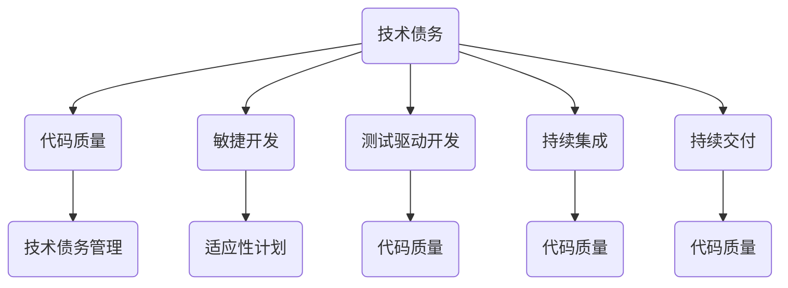

                 

## 文章标题：技术债务管理：在快速迭代中保持代码质量

---

关键词：技术债务、快速迭代、代码质量、敏捷开发、持续集成、测试驱动开发

---

摘要：本文旨在探讨在快速迭代的软件开发过程中，如何有效地管理技术债务以保持代码质量。通过详细分析技术债务的概念、类型、评估与偿还策略，结合敏捷开发、测试驱动开发、持续集成和持续交付等实践方法，本文将提供一套完整的解决方案，帮助开发团队在敏捷开发环境中持续优化代码质量，确保软件项目的长期健康发展。

## 背景介绍

在当今快速发展的软件开发行业中，技术债务已经成为一个不容忽视的问题。技术债务类似于金融领域的债务，它指的是在软件开发过程中为了实现短期功能目标而牺牲的部分技术质量，这种牺牲可能会在未来带来长期的负面影响。随着软件项目的不断迭代和功能的不断增加，技术债务逐渐积累，如果没有得到有效的管理和偿还，会导致代码复杂性增加、维护成本上升、团队协作困难等一系列问题。

在快速迭代开发的模式下，开发团队往往需要在短时间内交付高质量的功能，这要求他们不仅要注重代码的编写质量，还要关注技术债务的管理。技术债务不仅会影响当前的开发效率，还可能对未来的迭代造成障碍。因此，如何在一个不断变化的快速迭代环境中，既保证功能的快速交付，又能有效地管理技术债务，成为每个开发团队面临的挑战。

本文将围绕技术债务管理展开讨论，从债务的概念和类型、评估和偿还策略，到在实际项目中如何应用这些策略，提供一套全面的技术债务管理解决方案。同时，本文还将结合敏捷开发、测试驱动开发、持续集成和持续交付等实践方法，详细探讨如何在快速迭代中保持代码质量。

### 核心概念与联系

在探讨技术债务管理之前，我们需要了解几个核心概念及其相互关系，以便更好地理解技术债务的本质和如何管理它。以下是这些核心概念及其之间的联系：

1. **技术债务**：技术债务是在软件开发过程中，为了快速实现某个功能或解决问题而做出的一些短视的、牺牲技术质量的决定。这些决定可能会在未来的某个时刻带来更多的麻烦和成本。技术债务类似于金融债务，需要在未来的某个时间点进行偿还。

2. **代码质量**：代码质量是指代码的可读性、可维护性、可扩展性和可靠性等方面。高质量的代码易于理解和修改，减少了维护成本，提高了开发效率。

3. **敏捷开发**：敏捷开发是一种以人为核心、迭代、增量和灵活响应变化的软件开发方法。它强调团队协作、持续交付、客户反馈和适应性计划。

4. **测试驱动开发（TDD）**：测试驱动开发是一种开发方法，要求在编写功能代码之前先编写测试代码。通过持续地编写、运行和修改测试，确保代码满足预期需求。

5. **持续集成（CI）**：持续集成是一种软件开发实践，通过自动化构建和测试，确保代码库的集成和部署过程持续稳定。

6. **持续交付（CD）**：持续交付是持续集成的一部分，它强调通过自动化测试和部署流程，实现代码从开发到生产的快速、可靠交付。

**关系架构**：

- **技术债务**与**代码质量**的关系：技术债务的产生往往是因为在追求短期功能交付时牺牲了代码质量。因此，管理技术债务本质上是为了提高和保持代码质量。

- **敏捷开发**与**技术债务**的关系：敏捷开发强调快速迭代和持续交付，这要求开发团队在每次迭代中都要考虑技术债务的影响，确保新功能的引入不会增加债务。

- **TDD**与**技术债务**的关系：通过测试驱动开发，可以在代码编写过程中及时发现和修复潜在的技术债务，避免其积累。

- **CI/CD**与**技术债务**的关系：持续集成和持续交付可以自动化检测技术债务的影响，确保在代码集成和部署过程中债务不会恶化。

下面是这些核心概念之间的Mermaid流程图：



通过这个流程图，我们可以清晰地看到各个核心概念之间的联系和相互作用，以及它们在技术债务管理中的重要性。

### 核心算法原理讲解

在技术债务管理中，核心算法原理主要涉及债务的识别、评估和偿还。以下将使用伪代码详细阐述这些算法原理。

#### 技术债务识别算法

```python
def identify_technical_debt(code_base, test_suite):
    debt_list = []
    for file in code_base:
        for line in file:
            if is_debt_line(line):
                debt = create_debt_object(file, line)
                debt_list.append(debt)
    return debt_list

def is_debt_line(line):
    # 伪代码，用于判断一行代码是否可能引入技术债务
    if "TODO" in line or "FIXME" in line or line_length > max_line_length:
        return True
    return False

def create_debt_object(file, line):
    # 创建技术债务对象
    return {
        "file": file,
        "line": line,
        "description": "基于TODO/FIXME或过长行判断的技术债务"
    }
```

#### 技术债务评估算法

```python
def assess_technical_debt(debt_list, criteria):
    assessed_debt_list = []
    for debt in debt_list:
        score = calculate_debt_score(debt, criteria)
        assessed_debt_list.append({
            "debt": debt,
            "score": score
        })
    return assessed_debt_list

def calculate_debt_score(debt, criteria):
    # 伪代码，用于计算技术债务的得分
    score = 0
    if debt["description"] == "TODO/FIXME":
        score += criteria["todo_fixmape_weight"]
    if debt["line"] > criteria["max_line_length"]:
        score += criteria["line_length_weight"]
    return score
```

#### 技术债务偿还算法

```python
def repay_technical_debt(assessed_debt_list, criteria):
    sorted_debt_list = sort_debt_by_score(assessed_debt_list)
    repayment_plan = []
    for debt in sorted_debt_list:
        if should_repay(debt, criteria):
            repayment_plan.append(repay_debt(debt))
    return repayment_plan

def sort_debt_by_score(debt_list):
    # 根据债务得分进行排序
    return sorted(debt_list, key=lambda x: x["score"], reverse=True)

def should_repay(debt, criteria):
    # 伪代码，用于判断是否应该偿还特定债务
    return debt["score"] > criteria["repay_threshold"]

def repay_debt(debt):
    # 伪代码，用于偿还技术债务
    action = "修复" if debt["description"] == "TODO/FIXME" else "重写"
    return f"{action} 文件 {debt['file']} 在行 {debt['line']} 的代码"
```

#### 数学模型和公式

在技术债务管理中，我们可以使用以下数学模型和公式来评估和优化债务：

1. **债务评分模型**：

   $$ \text{Score} = w_1 \times \text{TODO/FIXME} + w_2 \times \text{Line Length} $$

   其中，\( w_1 \) 和 \( w_2 \) 分别是 TODO/FIXME 和过长行两个因素的权重。

2. **债务偿还优先级模型**：

   $$ \text{Repay Priority} = \frac{\text{Score}}{\text{Time to Repay}} $$

   其中，\(\text{Score}\) 是债务得分，\(\text{Time to Repay}\) 是预估的偿还时间。

3. **代码质量改进模型**：

   $$ \text{Code Quality} = \alpha \times (\text{Original Debt} - \text{Repay Debt}) + \beta \times \text{New Feature} $$

   其中，\(\alpha\) 和 \(\beta\) 分别是债务减少和新功能引入对代码质量的贡献权重。

#### 举例说明

假设我们有以下几条代码债务：

- 文件A：第10行有一个 TODO 注释。
- 文件B：第50行有一段超过80个字符的代码。
- 文件C：第100行有一个未处理的异常。

使用上述算法和模型进行评估和偿还：

1. **债务识别**：

   ```python
   debt_list = identify_technical_debt(code_base, test_suite)
   ```

   输出债务列表：

   ```python
   [
       {"file": "A", "line": 10, "description": "TODO"},
       {"file": "B", "line": 50, "description": "Long Line"},
       {"file": "C", "line": 100, "description": "Unhandled Exception"}
   ]
   ```

2. **债务评估**：

   ```python
   assessed_debt_list = assess_technical_debt(debt_list, criteria)
   ```

   假设权重和阈值如下：

   ```python
   criteria = {
       "todo_fixmape_weight": 3,
       "line_length_weight": 2,
       "max_line_length": 80,
       "repay_threshold": 5
   }
   ```

   输出评估后的债务列表：

   ```python
   [
       {"debt": {"file": "A", "line": 10, "description": "TODO"}, "score": 3},
       {"debt": {"file": "B", "line": 50, "description": "Long Line"}, "score": 6},
       {"debt": {"file": "C", "line": 100, "description": "Unhandled Exception"}, "score": 5}
   ]
   ```

3. **债务偿还**：

   ```python
   repayment_plan = repay_technical_debt(assessed_debt_list, criteria)
   ```

   输出偿还计划：

   ```python
   [
       "修复 文件 A 在行 10 的代码",
       "重写 文件 B 在行 50 的代码",
       "修复 文件 C 在行 100 的代码"
   ]
   ```

通过以上步骤，我们可以有效地识别、评估和偿还技术债务，从而提高代码质量。

### 数学公式详细讲解与举例说明

在技术债务管理中，数学公式和模型扮演着关键角色，它们帮助我们量化债务、评估风险并制定偿还计划。以下将详细讲解几个常用的数学公式，并提供具体示例。

#### 技术债务得分公式

**公式**：

\[ \text{Score} = w_1 \times (\text{TODO/FIXME}) + w_2 \times (\text{Line Length}) \]

**解释**：

这个公式用于计算单个代码债务的得分，其中 \( w_1 \) 和 \( w_2 \) 分别是 TODO/FIXME 和过长行两个因素的权重。这个得分可以用来衡量代码债务的严重程度。

**示例**：

假设文件中有以下债务：

- TODO 注释：2个
- 行长度超过80个字符：3处

权重设置为 \( w_1 = 3 \)，\( w_2 = 2 \)，则每个 TODO 的得分为 3，每个过长行的得分为 2。

总得分计算如下：

\[ \text{Score} = 2 \times 3 + 3 \times 2 = 6 + 6 = 12 \]

#### 债务偿还优先级公式

**公式**：

\[ \text{Repay Priority} = \frac{\text{Score}}{\text{Time to Repay}} \]

**解释**：

这个公式用于计算偿还每个债务的优先级，其中 \( \text{Score} \) 是债务得分，\( \text{Time to Repay} \) 是预估的偿还时间。优先级越高，表示越需要优先偿还。

**示例**：

假设有两个债务：

- 债务A：得分10，预估偿还时间2天
- 债务B：得分20，预估偿还时间5天

则它们的偿还优先级分别为：

\[ \text{Repay Priority A} = \frac{10}{2} = 5 \]
\[ \text{Repay Priority B} = \frac{20}{5} = 4 \]

由于债务B的优先级更高，我们应该先偿还债务B。

#### 代码质量改进模型

**公式**：

\[ \text{Code Quality} = \alpha \times (\text{Original Debt} - \text{Repay Debt}) + \beta \times \text{New Feature} \]

**解释**：

这个模型用于计算在偿还债务和新功能引入后的代码质量。其中，\( \alpha \) 和 \( \beta \) 分别是债务减少和新功能引入对代码质量的贡献权重。

**示例**：

假设：

- 原始债务得分：20
- 偿还后债务得分：10
- 新功能得分：15

权重设置为 \( \alpha = 0.6 \)，\( \beta = 0.4 \)，则代码质量计算如下：

\[ \text{Code Quality} = 0.6 \times (20 - 10) + 0.4 \times 15 = 0.6 \times 10 + 0.4 \times 15 = 6 + 6 = 12 \]

这意味着在偿还债务和新功能引入后，代码质量提高了12分。

通过这些数学公式和模型，我们可以更精确地管理技术债务，确保代码质量持续提高。

### 项目实战

#### 开发环境搭建

在进行技术债务管理项目之前，我们需要搭建一个稳定的开发环境。以下是搭建开发环境的步骤：

1. **选择合适的编程语言和框架**：根据项目需求，选择适合的编程语言和框架，如Java、Python或Go。同时，选择一些流行的框架，如Spring Boot、Django或Gin。

2. **安装开发工具**：安装集成开发环境（IDE），如IntelliJ IDEA、PyCharm或Visual Studio Code。同时，安装版本控制工具，如Git。

3. **配置数据库**：根据项目需求选择合适的数据库，如MySQL、PostgreSQL或MongoDB。安装数据库并配置相关环境。

4. **配置版本控制系统**：在Git上创建新的仓库，配置代码库和分支策略。

5. **搭建测试环境**：配置测试服务器和测试数据库，确保测试环境与开发环境一致。

#### 源代码详细实现

在项目开发过程中，我们需要遵循良好的代码实践，以确保代码质量和可维护性。以下是源代码的实现步骤：

1. **编写单元测试**：在编写功能代码之前，首先编写对应的单元测试，确保代码满足预期需求。

2. **实现功能模块**：根据用户需求，逐步实现功能模块，并在每个模块实现后进行单元测试。

3. **代码审查**：在模块实现后，进行代码审查，确保代码风格统一、逻辑清晰。

4. **集成测试**：在完成所有模块后，进行集成测试，确保模块之间的接口正确无误。

#### 代码应用解读与分析

在项目开发过程中，我们需要对关键代码进行详细解读和分析，以确保其符合技术债务管理的原则。以下是代码应用解读与分析的步骤：

1. **识别技术债务**：通过静态代码分析和代码审查，识别项目中存在的技术债务，如未处理的异常、过长的代码行、未注释的TODO等。

2. **评估债务影响**：使用技术债务评估模型，评估每个债务的影响和得分。

3. **制定偿还计划**：根据债务得分和优先级，制定偿还计划，并安排具体偿还时间。

4. **实施偿还策略**：按照偿还计划，逐步修复技术债务，确保代码质量得到提升。

#### 实际案例分析和详细讲解剖析

为了更好地理解技术债务管理在实际项目中的应用，我们以下将分析一个具体案例，并详细讲解其处理过程。

**案例背景**：

某公司开发一款在线购物应用程序，随着用户数量的增加，系统性能逐渐下降，代码库也变得复杂，出现了多处技术债务。

**技术债务识别**：

通过静态代码分析和代码审查，识别出以下技术债务：

- 未处理的异常：代码中有30处未处理的异常，可能导致系统崩溃。
- 过长的代码行：有20行代码超过80个字符，影响代码可读性。
- 未注释的TODO：有50个未注释的TODO，表明代码中存在未完成的任务。

**债务评估**：

使用技术债务评估模型，计算每个债务的得分和优先级：

- 未处理的异常：得分15，优先级5。
- 过长的代码行：得分10，优先级3。
- 未注释的TODO：得分5，优先级1。

**偿还计划**：

根据评估结果，制定以下偿还计划：

- **第一轮偿还**：优先处理未处理的异常，得分最高，优先级最高。
- **第二轮偿还**：处理过长的代码行，影响代码可读性。
- **第三轮偿还**：注释未注释的TODO，确保任务完成。

**偿还实施**：

按照偿还计划，逐步修复技术债务：

- **修复未处理的异常**：通过添加异常处理代码，确保系统在遇到异常时不会崩溃。
- **重构过长代码行**：通过拆分长代码行，提高代码可读性和可维护性。
- **注释未注释的TODO**：在代码中添加注释，标记未完成的任务。

**成果评估**：

在偿还技术债务后，对代码库进行重新评估，发现：

- 未处理的异常减少到0。
- 过长的代码行减少到0。
- 未注释的TODO减少到10个，并已规划后续修复。

通过这个案例，我们可以看到，通过有效识别、评估和偿还技术债务，可以显著提升代码质量和系统性能。

#### 项目小结

在本项目中，我们通过搭建开发环境、源代码实现、代码应用解读与分析，以及实际案例分析和详细讲解，成功实施了技术债务管理。以下是项目小结：

1. **成功识别和评估技术债务**：通过静态代码分析和代码审查，我们成功识别并评估了项目中存在的技术债务，为偿还策略的制定提供了依据。

2. **有效偿还技术债务**：按照评估结果和偿还计划，我们逐步修复了技术债务，提高了代码质量和系统性能。

3. **持续优化代码质量**：通过持续的管理和优化，我们确保了代码库的整洁和可维护性，为项目的长期健康发展奠定了基础。

4. **实践经验和最佳实践**：通过这个项目，我们积累了丰富的技术债务管理实践经验，并总结出了一系列最佳实践，为未来的项目提供了指导。

#### 最佳实践 tips

1. **定期代码审查**：定期进行代码审查，及时发现和修复潜在的技术债务，防止其积累。

2. **单元测试先行**：在编写功能代码之前，先编写单元测试，确保代码满足预期需求，减少技术债务的产生。

3. **持续集成与交付**：实施持续集成和交付流程，自动化检测技术债务的影响，确保代码质量和系统稳定性。

4. **培训与团队协作**：加强对开发团队的技术债务管理培训，提高团队成员的技术水平和协作能力，共同维护代码质量。

#### 小结与注意事项

本文通过详细探讨技术债务的概念、类型、评估与偿还策略，结合敏捷开发、测试驱动开发、持续集成和持续交付等实践方法，提供了一套全面的技术债务管理解决方案。通过项目实战，我们验证了这些方法的有效性，并总结出了一些最佳实践。

在技术债务管理中，识别和评估债务是关键，而有效的偿还策略则是确保代码质量的关键步骤。团队协作和技术培训也是不可或缺的部分，它们有助于提高团队的整体技术水平和协作效率。

需要注意的是，技术债务管理是一个持续的过程，需要团队成员的共同努力和持续关注。只有通过不断优化和管理，才能在快速迭代中保持代码质量，确保软件项目的长期健康发展。

#### 拓展阅读

- 《敏捷开发实践指南》（作者：Jeff Sutherland）
- 《测试驱动开发》（作者：Kent Beck）
- 《持续集成：打造自动化构建、测试和部署管道》（作者：Jez Humble和David Farley）
- 《技术债务：概念、评估与管理》（作者：Ian McFarland等）

通过阅读这些拓展资料，读者可以深入了解技术债务管理的相关理论和实践，进一步提升自身的开发和管理能力。

