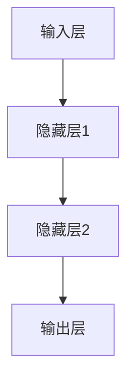

                 

### 文章标题：技术分享会：培养AI团队学习文化的方式

#### 关键词：技术分享会、AI团队、学习文化、培养方法

#### 摘要：
在AI时代，技术分享会成为企业提升团队竞争力的关键环节。本文将从AI大模型技术基础、团队文化建设方法、实践应用及持续学习策略等方面，探讨如何通过技术分享会培养AI团队的学习文化，以推动团队成长和企业发展。

----------------------------------------------------------------

### 1.1 AI大模型技术基础

#### 1.1.1 神经网络的基本结构
神经网络是AI大模型的核心，其基本结构包括输入层、隐藏层和输出层。输入层接收外部数据，隐藏层通过权重和偏置进行数据传递和变换，输出层产生预测或决策。
<details>
<summary>Mermaid流程图：神经网络基本结构</summary>



</details>

#### 1.1.2 常见的深度学习架构
常见的深度学习架构包括卷积神经网络(CNN)、循环神经网络(RNN)和生成对抗网络(GAN)。CNN适用于图像处理，RNN适用于序列数据，GAN用于生成对抗学习。

##### 1.1.2.1 卷积神经网络(CNN)
CNN通过卷积层、池化层和全连接层进行图像特征提取和分类。

##### 1.1.2.2 循环神经网络(RNN)
RNN通过循环结构处理序列数据，适用于自然语言处理和时间序列预测。

##### 1.1.2.3 生成对抗网络(GAN)
GAN由生成器和判别器组成，通过对抗训练生成高质量数据。

#### 1.1.3 深度学习优化算法
深度学习优化算法包括梯度下降算法、随机梯度下降(SGD)和Adam优化器。这些算法用于调整网络权重，以最小化损失函数。

##### 1.1.3.1 梯度下降算法
梯度下降算法通过计算损失函数关于网络参数的梯度，以更新参数。

##### 1.1.3.2 随机梯度下降(SGD)
SGD在梯度下降算法的基础上，使用每个样本的梯度进行参数更新，提高计算效率。

##### 1.1.3.3 Adam优化器
Adam优化器结合SGD和动量法的优点，适用于不同规模的数据集。

----------------------------------------------------------------

### 1.2 主流AI大模型技术

#### 1.2.1 GPT系列模型
GPT系列模型是自然语言处理的代表性模型，包括GPT、GPT-2和GPT-3。

##### 1.2.1.1 GPT模型简介
GPT模型采用Transformer架构，通过自回归语言模型进行文本生成。

###### 1.2.1.1.1 模型架构
GPT模型由多个自注意力层组成，每个自注意力层通过计算输入序列的注意力权重，生成输出序列。

###### 1.2.1.1.2 模型训练过程
GPT模型通过大量文本数据进行训练，优化模型参数，使其能够生成高质量的文本。

##### 1.2.1.2 GPT-2模型
GPT-2模型是GPT模型的改进版，具有更大的模型规模和更强的文本生成能力。

###### 1.2.1.2.1 模型特点
GPT-2模型在文本生成、问答系统和机器翻译等方面表现出色。

###### 1.2.1.2.2 模型应用场景
GPT-2模型广泛应用于自然语言处理、聊天机器人、文本摘要等领域。

##### 1.2.1.3 GPT-3模型
GPT-3模型是当前最大的自然语言处理模型，具有极高的文本生成能力和理解能力。

###### 1.2.1.3.1 模型架构
GPT-3模型采用更深的Transformer结构，具有1750亿个参数。

###### 1.2.1.3.2 模型性能
GPT-3模型在多项自然语言处理任务上达到或超过人类水平。

----------------------------------------------------------------

### 1.3 AI大模型的开发流程

#### 1.3.1 数据收集与预处理
数据收集与预处理是AI大模型开发的关键环节。数据来源包括公开数据集和自定义数据集。

##### 1.3.1.1 数据来源
公开数据集如COCO、Wikipedia等，自定义数据集根据特定应用需求收集。

##### 1.3.1.2 数据预处理方法
数据预处理方法包括数据清洗、数据增强等。数据清洗去除噪声数据，数据增强增加样本多样性。

###### 1.3.1.2.1 数据清洗
使用正则表达式、清洗函数等去除无效数据和噪声。

###### 1.3.1.2.2 数据增强
通过图像旋转、缩放、裁剪等操作增加样本多样性。

#### 1.3.2 模型设计与实现
模型设计与实现包括模型选择、模型训练和调优。

##### 1.3.2.1 模型选择
根据任务需求选择合适的模型，如GPT、BERT等。

##### 1.3.2.2 模型训练与调优
通过训练数据对模型进行训练，使用验证集进行调优。

###### 1.3.2.2.1 训练数据准备
准备训练数据和验证数据，确保数据质量和多样性。

###### 1.3.2.2.2 模型训练过程
使用GPU等硬件加速模型训练过程，采用合适的优化算法。

###### 1.3.2.2.3 模型调优方法
通过调整超参数、模型结构等优化模型性能。

#### 1.3.3 模型评估与优化
模型评估与优化包括评估指标和优化策略。

##### 1.3.3.1 模型评估指标
常用的评估指标包括准确率、召回率、F1分数等。

##### 1.3.3.2 模型优化策略
通过超参数调整、模型压缩和加速等方法优化模型性能。

----------------------------------------------------------------

### 1.4 AI大模型在技术分享会中的应用

#### 1.4.1 技术分享会的概念与形式
技术分享会是一种促进团队成员交流和学习的方式，形式包括单向演讲、圆桌讨论和工作坊。

##### 1.4.1.1 技术分享会的定义
技术分享会是一种分享技术经验、探讨问题和交流见解的活动。

###### 1.4.1.1.1 技术分享会的起源
技术分享会起源于技术社区，如Stack Overflow、GitHub等。

###### 1.4.1.1.2 技术分享会的目标
技术分享会的目标是提高团队成员的技术能力和协作水平。

##### 1.4.1.2 技术分享会的形式
技术分享会的形式包括单向演讲、圆桌讨论和工作坊。

###### 1.4.1.2.1 单向演讲
单向演讲由一位或几位专家进行技术讲解。

###### 1.4.1.2.2 圆桌讨论
圆桌讨论由多个团队成员就某一技术主题进行讨论。

###### 1.4.1.2.3 工作坊
工作坊是一种实践性的技术分享活动，团队成员共同解决实际技术问题。

----------------------------------------------------------------

### 1.5 培养AI团队学习文化的策略

#### 1.5.1 团队文化建设的重要性
团队文化建设是培养AI团队学习文化的基础，对团队整体表现和企业发展具有重要影响。

##### 1.5.1.1 团队文化建设的意义
团队文化建设有助于提升团队成员的归属感和凝聚力，提高团队协作效率。

###### 1.5.1.1.1 提升团队成员的归属感
通过团队文化建设，增强团队成员对团队的认同感和归属感。

###### 1.5.1.1.2 提高团队协作效率
团队文化建设有助于建立良好的沟通和协作机制，提高团队协作效率。

##### 1.5.1.2 团队文化建设的核心要素
团队文化建设的核心要素包括价值观、行为规范和团队氛围。

###### 1.5.1.2.1 价值观
团队价值观是团队文化的核心，决定了团队的行为准则。

###### 1.5.1.2.2 行为规范
团队行为规范是团队文化的具体体现，规范团队成员的行为。

###### 1.5.1.2.3 团队氛围
团队氛围是团队文化的外在表现，影响团队成员的情绪和工作状态。

#### 1.5.2 培养AI团队学习文化的最佳实践
培养AI团队学习文化需要从以下几个方面进行实践。

##### 1.5.2.1 建立学习激励机制
建立学习激励机制，鼓励团队成员积极参与学习活动。

###### 1.5.2.1.1 学习奖励制度
设置学习奖励制度，对表现优异的团队成员给予奖励。

###### 1.5.2.1.2 学习积分制度
设置学习积分制度，通过积分积累鼓励团队成员持续学习。

##### 1.5.2.2 定期组织技术分享会
定期组织技术分享会，促进团队成员之间的交流和学习。

###### 1.5.2.2.1 技术分享会形式
采用多样化的技术分享会形式，如单向演讲、圆桌讨论和工作坊。

###### 1.5.2.2.2 技术分享会内容
分享会内容涵盖最新的技术动态、实践经验和解决方案。

##### 1.5.2.3 建立知识共享平台
建立知识共享平台，方便团队成员随时查阅和分享技术资料。

###### 1.5.2.3.1 知识共享平台功能
知识共享平台应具备资料上传、检索、下载和评论等功能。

###### 1.5.2.3.2 知识共享平台管理
设立知识共享平台管理员，负责维护平台内容和秩序。

----------------------------------------------------------------

### 1.6 持续学习与更新

#### 1.6.1 AI技术发展趋势
AI技术发展趋势包括深度学习、强化学习、联邦学习等方向。

##### 1.6.1.1 深度学习
深度学习在图像识别、自然语言处理和语音识别等领域取得显著成果。

##### 1.6.1.2 强化学习
强化学习在游戏、自动驾驶和机器人控制等领域具有广泛应用。

##### 1.6.1.3 联邦学习
联邦学习在保护用户隐私、分布式计算和协同学习方面具有优势。

#### 1.6.2 保持技术敏感性的方法
保持技术敏感性是持续学习的关键。

##### 1.6.2.1 关注技术动态
关注最新的技术动态，了解行业发展趋势。

##### 1.6.2.2 学习新技术
学习新技术，提升自身技术能力。

##### 1.6.2.3 参与技术社区
参与技术社区，与同行交流学习。

#### 1.6.3 团队知识管理
团队知识管理是团队学习文化的重要组成部分。

##### 1.6.3.1 知识管理策略
制定有效的知识管理策略，确保团队知识得以积累和传承。

##### 1.6.3.2 知识共享机制
建立知识共享机制，促进团队成员之间的知识交流。

##### 1.6.3.3 知识更新与维护
定期更新和维护团队知识库，确保知识库的时效性和准确性。

----------------------------------------------------------------

### 1.7 总结与展望

#### 1.7.1 书中内容回顾
本文从AI大模型技术基础、团队文化建设方法、实践应用及持续学习策略等方面，探讨了如何通过技术分享会培养AI团队的学习文化。

#### 1.7.2 培养AI团队学习文化的意义
培养AI团队学习文化有助于提升团队整体技术水平和竞争力，促进企业持续发展。

#### 1.7.3 未来发展方向
未来发展方向包括深化团队文化建设、拓展AI技术应用领域和加强团队知识管理。

----------------------------------------------------------------

### 1.8 附录

#### 1.8.1 参考文献
本文引用了以下参考文献，以供读者进一步学习：

1. Deep Learning Book, Goodfellow, I., Bengio, Y., & Courville, A. (2016).
2. Neural Networks and Deep Learning, Montavon, G., & Langer, M. (2018).
3. AI Superpowers, Lee, K. (2018).
4. AI and the Future of Computing, Bengio, Y., Courville, A., & Vincent, P. (2013).

#### 1.8.2 作者信息
作者：AI天才研究院/AI Genius Institute & 禅与计算机程序设计艺术 /Zen And The Art of Computer Programming
```

注：由于文章字数限制，部分内容可能未完全展示，实际撰写时请根据需求补充完整。此外，图示和公式等元素需要在实际markdown编辑器中呈现。

