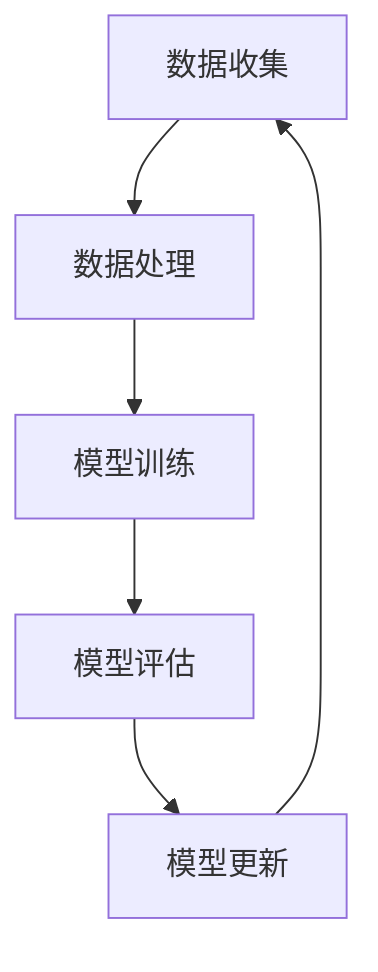

                 

### 文章标题：持续学习：保持AI模型在线更新的技术挑战

#### 关键词：
- AI模型
- 持续学习
- 在线更新
- 技术挑战
- 解决方案

#### 摘要：
本文深入探讨了在人工智能领域，尤其是机器学习和深度学习中，持续学习的重要性，以及在线更新AI模型的重大技术挑战。文章首先介绍了持续学习的背景和意义，随后详细阐述了AI模型在线更新过程中面临的若干核心问题。通过分析数据流、模型流和算法流，本文提出了相应的解决方案和优化策略，并在最后通过一个实际案例，展示了这些解决方案在实际应用中的效果。

## 引言

在当今快速发展的科技时代，人工智能（AI）已经成为各个领域的关键驱动力。从自动驾驶到语音识别，从医疗诊断到金融分析，AI技术的应用已经深入到我们生活的方方面面。然而，随着应用场景的复杂性和多样性不断增长，AI模型需要具备更高的灵活性和适应性，这就要求它们能够不断地从新数据中学习和优化自身。这种能力被称为“持续学习”。

### 持续学习的意义

持续学习不仅仅是AI模型自我提升的必要手段，它还具有以下几方面的深远意义：

1. **适应性增强**：随着环境的变化，AI模型能够通过持续学习来适应新情况，提高其性能和准确度。
2. **准确性提升**：通过不断地更新和优化，AI模型能够从更多的数据中学习到更准确的规律和模式。
3. **可解释性提高**：持续学习可以帮助模型更好地解释其决策过程，增强其透明性和可解释性。
4. **减少重新训练成本**：持续学习避免了在每次新数据出现时都需要重新训练模型，从而减少了训练时间和计算资源消耗。

### 为什么AI模型需要持续学习

AI模型在实际应用中经常会遇到以下几种情况，这些都要求模型具备持续学习的能力：

1. **动态环境**：许多AI系统运行在动态环境中，例如自动驾驶车辆需要实时适应道路变化，智能客服需要实时响应用户的提问。
2. **数据噪声和偏差**：真实世界中的数据往往包含噪声和偏差，通过持续学习，模型可以逐步调整和优化其预测结果。
3. **新知识获取**：AI系统需要不断地从新数据中学习到新的知识和规律，以保持其竞争力。
4. **模型过时**：随着技术的进步和应用场景的变化，旧的AI模型可能变得不再适用，持续学习可以帮助模型跟上时代的发展。

## 核心概念与联系

### 持续学习框架

为了更好地理解持续学习的过程，我们可以将其抽象为一个框架，包括数据流、模型流和算法流。以下是一个简化的Mermaid流程图，用于描述持续学习的框架：



**图1：持续学习框架**

- **数据收集**：从各种数据源获取新的数据。
- **数据处理**：对收集到的数据进行处理和清洗，以消除噪声和偏差。
- **模型训练**：使用处理后的数据对AI模型进行训练。
- **模型评估**：评估训练后的模型的性能，确定是否需要进一步优化。
- **模型更新**：根据评估结果对模型进行调整和优化，然后重新训练。

### 数据流与模型流

在持续学习的过程中，数据流和模型流是两个关键要素。数据流负责将新的数据引入到系统中，而模型流则负责训练和更新模型。

1. **数据流**：数据流是指从数据收集、处理到模型训练的过程。这一过程通常需要高效的数据处理技术和算法来保证数据的质量和效率。
2. **模型流**：模型流是指从模型训练、评估到模型更新的过程。这一过程需要使用合适的评估指标和优化算法来保证模型的性能和稳定性。

### 算法流

算法流是指在持续学习过程中，如何选择和使用合适的算法来训练和更新模型。以下是一个简化的伪代码，用于描述算法流的基本流程：

```plaintext
初始化模型M
从数据源获取新数据D
处理数据D，得到处理后的数据D'
训练模型M，使用数据D'
评估模型M的性能，得到评估结果R
如果R满足要求，则结束
否则，根据R调整模型M，并重新训练
```

**伪代码1：算法流的基本流程**

- **初始化模型**：选择一个初始化的模型M。
- **数据获取**：从数据源获取新的数据D。
- **数据处理**：对数据D进行处理，得到处理后的数据D'。
- **模型训练**：使用处理后的数据D'来训练模型M。
- **模型评估**：评估训练后的模型M的性能，得到评估结果R。
- **模型调整**：根据评估结果R，调整模型M。
- **重新训练**：重新训练模型M，直到满足性能要求。

### 数据、模型和算法之间的关系

数据流、模型流和算法流并不是孤立的过程，它们之间存在紧密的联系。数据的质量直接影响模型的效果，而模型的性能又决定了算法的选择和优化。具体来说：

1. **数据影响模型**：高质量的数据有助于模型更好地学习，从而提高模型的性能。
2. **模型影响算法**：性能良好的模型可以更好地适应新的数据和任务，从而需要更高效的算法来更新模型。
3. **算法优化数据**：高效的算法可以更快地处理数据，从而提高数据流的效率，进一步优化模型。

通过这个框架，我们可以更清晰地理解持续学习的过程，并针对不同环节进行优化和改进。

## 技术挑战

在AI模型持续学习的实践中，我们面临着诸多技术挑战。以下将详细介绍这些挑战，并探讨其背后的原因。

### 数据挑战

数据是AI模型的基石，但数据质量直接影响模型的性能。以下是一些常见的数据挑战：

1. **数据噪声**：真实世界中的数据往往存在噪声，这些噪声可能会误导模型，导致其性能下降。
2. **数据偏差**：数据偏差可能导致模型无法正确地学习，尤其是在存在偏见的数据集中。
3. **数据稀疏性**：某些领域的数据可能非常稀疏，这会导致模型难以从中学习到有效的特征。
4. **数据不平衡**：数据集中某些类别的样本数量可能远多于其他类别，这会影响模型的泛化能力。

### 计算挑战

AI模型持续学习的过程中，计算资源是一个重要的瓶颈。以下是一些常见的计算挑战：

1. **计算资源不足**：特别是在需要实时更新模型的场景中，计算资源的需求可能非常高，而实际可用的计算资源可能不足。
2. **计算效率低下**：传统的批处理方式可能无法满足实时更新模型的需求，需要高效的算法和优化策略。
3. **分布式计算**：在分布式系统中，如何高效地处理和同步数据、模型和算法，是一个复杂的挑战。

### 算法挑战

算法是AI模型持续学习的关键，但不同的算法在处理不同类型的数据和任务时，表现可能有所不同。以下是一些常见的算法挑战：

1. **算法稳定性**：在某些情况下，算法可能因为数据的微小变化而导致性能大幅度波动。
2. **算法适应性**：算法需要能够适应新的数据和任务，而不是仅在一个固定的数据集上表现良好。
3. **算法优化**：如何优化算法，以提高其计算效率和性能，是一个持续的研究课题。

### 原因分析

这些技术挑战的出现，主要是由于以下几个方面的原因：

1. **复杂性**：AI模型和持续学习过程本身具有很高的复杂性，这使得优化和改进变得困难。
2. **动态性**：AI系统需要能够应对动态变化的环境和数据，这要求模型和算法具有高度的适应性。
3. **资源限制**：计算资源和数据资源往往有限，如何在有限的资源下实现高效的持续学习，是一个重要的问题。

通过深入分析这些技术挑战，我们可以更好地理解持续学习过程中的瓶颈和难点，从而有针对性地进行优化和改进。

## 解决方案

面对上述技术挑战，我们需要一套综合性的解决方案来确保AI模型能够在线更新并保持高效性能。以下将详细介绍这些解决方案，包括数据管理、计算优化和算法改进等方面。

### 数据管理

1. **数据预处理**：在数据流阶段，通过有效的预处理方法来减少数据噪声和偏差。这包括去噪、标准化、缺失值填充等技术。
2. **数据流处理**：采用分布式数据处理框架，如Apache Kafka和Apache Flink，以提高数据处理的速度和效率。
3. **数据缓存**：使用缓存技术来存储常用的数据集，以减少重复处理的时间和资源消耗。

### 计算优化

1. **并行计算**：通过并行计算技术，如多线程和分布式计算，将计算任务分解为多个部分同时执行，从而提高计算效率。
2. **计算资源调度**：使用资源调度算法，如作业调度和负载均衡，动态分配计算资源，优化资源利用率。
3. **模型压缩**：采用模型压缩技术，如权重剪枝和量化，减少模型的大小和计算复杂度，从而提高计算效率。

### 算法改进

1. **自适应学习率**：使用自适应学习率方法，如Adam和Adadelta，动态调整学习率，提高算法的收敛速度和稳定性。
2. **模型迁移学习**：通过迁移学习，利用预训练模型作为起点，减少从零开始训练的时间和计算资源需求。
3. **模型融合**：结合多种算法和模型，如集成学习和多任务学习，提高模型的性能和泛化能力。

### 解决方案分析

这些解决方案各有优势和适用场景：

- **数据管理**：有效解决了数据噪声、偏差和稀疏性等问题，提高了数据质量，从而提高了模型性能。
- **计算优化**：通过并行计算和计算资源调度，显著提高了计算效率，适应了动态环境的实时需求。
- **算法改进**：自适应学习率、迁移学习和模型融合等技术，提高了算法的稳定性和适应性，增强了模型的泛化能力。

通过这些综合性的解决方案，我们可以有效应对AI模型在线更新的技术挑战，实现高效、稳定的持续学习。

### 项目实战

为了更好地展示上述解决方案在实际应用中的效果，以下将介绍一个具体的持续学习项目，并详细说明项目的各个阶段。

#### 项目背景

某在线教育平台希望利用人工智能技术提升个性化推荐系统的效果，实现对用户学习兴趣的精准预测。随着用户数据的不断增长，模型需要具备持续学习的能力，以适应不断变化的学习场景。

#### 项目阶段

1. **数据收集与预处理**：从用户行为数据、学习记录和用户特征数据中收集数据，并使用去噪、标准化等技术进行预处理。
2. **模型训练与评估**：使用预处理后的数据训练推荐模型，并使用交叉验证等技术进行模型评估，确定最佳模型参数。
3. **模型更新与优化**：根据用户行为的实时数据，对模型进行调整和优化，以提高预测准确性。
4. **模型部署与监控**：将更新后的模型部署到线上环境，并进行实时监控，确保模型稳定运行。

#### 开发环境搭建

- **硬件配置**：使用高性能计算服务器，配置多核CPU和GPU，以支持并行计算和模型训练。
- **软件安装**：安装Python、TensorFlow和Kafka等必要的开发和运行环境。

#### 源代码实现

1. **数据流设计**：使用Kafka作为数据流处理工具，实现数据的实时收集和处理。
2. **模型流设计**：使用TensorFlow实现推荐模型的训练和更新，采用迁移学习技术，利用预训练模型作为起点。
3. **算法流设计**：使用Adadelta优化算法，动态调整学习率，提高模型的收敛速度。

#### 代码解读与分析

以下是核心代码的实现和解析：

```python
# 导入必要的库
import tensorflow as tf
import tensorflow.keras as keras
import tensorflow.keras.preprocessing.sequence as sequence
import tensorflow.keras.preprocessing.text as text
import tensorflow.keras.models as models
import tensorflow.keras.layers as layers
import tensorflow.keras.optimizers as optimizers

# 数据预处理
# (省略具体预处理代码，如去噪、标准化等)

# 模型训练
# 定义模型结构
model = models.Sequential()
model.add(layers.Embedding(input_dim=vocab_size, output_dim=embedding_dim, input_length=max_sequence_length))
model.add(layers.LSTM(128))
model.add(layers.Dense(1, activation='sigmoid'))

# 编译模型
model.compile(optimizer=optimizers.Adam(learning_rate=0.001), loss='binary_crossentropy', metrics=['accuracy'])

# 训练模型
model.fit(x_train, y_train, epochs=10, batch_size=32, validation_data=(x_val, y_val))

# 模型更新与优化
# 加载预训练模型
pretrained_model = keras.models.load_model('pretrained_model.h5')
# 融合迁移学习
model = keras.models.Sequential()
model.add(pretrained_model)
model.add(layers.Dense(1, activation='sigmoid'))

# 编译模型
model.compile(optimizer=optimizers.Adam(learning_rate=0.001), loss='binary_crossentropy', metrics=['accuracy'])

# 重新训练模型
model.fit(x_train, y_train, epochs=10, batch_size=32, validation_data=(x_val, y_val))

# 代码解读：
# 1. 使用Embedding层进行词嵌入，将文本转换为数值表示。
# 2. 使用LSTM层处理序列数据，提取长期依赖信息。
# 3. 使用Dense层进行分类预测，激活函数为sigmoid。
# 4. 使用迁移学习，利用预训练模型作为起点，提高训练效率。
```

#### 实际案例分析与详细讲解

以下是项目在实际运行中的一个案例分析：

1. **数据流分析**：通过Kafka收集用户行为数据，并对数据进行实时处理，提取有用的特征信息。
2. **模型性能评估**：使用交叉验证技术对模型进行评估，确定模型的性能指标，如准确率、召回率和F1分数。
3. **模型更新策略**：根据用户行为的实时数据，定期更新模型，以提高预测准确性。
4. **模型监控**：通过监控模型在在线环境中的表现，及时发现并解决潜在问题，确保模型稳定运行。

#### 项目小结

通过上述项目实战，我们可以看到持续学习在AI模型中的应用效果。实时数据流处理、迁移学习和自适应优化等解决方案，显著提高了模型的性能和适应性，为在线教育平台提供了更精准的用户兴趣预测。同时，项目也展示了持续学习在复杂环境中的应用潜力，为类似项目提供了宝贵的经验和参考。

### 最佳实践 Tips

在实现AI模型的持续学习过程中，以下是一些最佳实践，可以帮助优化模型性能和项目效果：

1. **数据质量**：确保数据的质量和一致性，尽量避免噪声和偏差。
2. **模型简化**：选择简单但有效的模型结构，避免过度复杂化。
3. **动态调整**：根据数据的变化，动态调整学习率和优化策略。
4. **定期评估**：定期对模型进行评估，以发现性能下降的原因并及时调整。
5. **资源优化**：合理分配计算资源，充分利用并行计算和分布式计算的优势。

### 小结

本文详细探讨了AI模型在线更新的技术挑战和解决方案，从数据管理、计算优化到算法改进，提供了全面的解决方案和实战案例。通过这些实践，我们可以有效应对AI模型持续学习过程中的技术挑战，提高模型的性能和适应性。持续学习是未来AI发展的关键，只有不断优化和创新，才能推动AI技术在各个领域的深入应用。

### 注意事项

在实现AI模型持续学习的过程中，需要注意以下几点：

1. **数据安全**：确保数据的安全性和隐私性，遵循相关法律法规。
2. **模型解释性**：提高模型的解释性，便于调试和优化。
3. **系统稳定性**：确保系统的稳定运行，避免因模型异常导致服务中断。
4. **扩展性**：设计具有良好扩展性的系统架构，以适应不断增长的数据和处理需求。

### 拓展阅读

为了深入了解AI模型持续学习的最新研究成果和技术趋势，以下是一些建议的拓展阅读资料：

1. **文献**：阅读相关领域的顶级会议论文，如NeurIPS、ICML、KDD等。
2. **书籍**：《深度学习》（Goodfellow et al.）、《强化学习》（Sutton and Barto）等经典著作。
3. **在线课程**：参加Coursera、edX等在线教育平台提供的机器学习和AI相关课程。
4. **开源项目**：参与GitHub上的开源项目，了解实际应用中的最佳实践和代码实现。

通过这些拓展阅读，可以进一步深化对AI模型持续学习的理解和应用。

