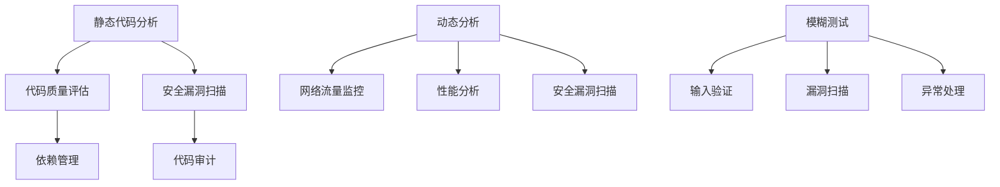

                 


### 文章标题：持续安全测试：识别LLM应用的安全漏洞

> 关键词：持续安全测试，LLM应用，安全漏洞，静态代码分析，动态分析，模糊测试

> 摘要：
本文将深入探讨持续安全测试在识别大型语言模型（LLM）应用中的重要性，以及如何利用静态代码分析、动态分析和模糊测试等技术来识别潜在的安全漏洞。我们将通过实例和实战经验，展示这些技术在LLM应用安全测试中的具体应用，并提供一些建议和最佳实践，以帮助开发者构建更加安全可靠的LLM应用。

----------------------------------------------------------------

### 引言

大型语言模型（Large Language Models，简称LLM）是近年来人工智能领域的重要突破之一。它们在自然语言处理（NLP）、文本生成、机器翻译、问答系统等领域表现出色，已经广泛应用于多个行业和场景。随着LLM应用的普及，确保其安全性变得尤为重要。然而，LLM应用的安全问题并非易解，尤其是当它们面临复杂的输入和动态环境时，潜在的安全漏洞可能被隐藏在难以察觉的角落。

持续安全测试作为一种重要的安全防护手段，可以帮助开发者及时发现并修复LLM应用中的安全漏洞，降低风险。本文将围绕持续安全测试这一主题，详细介绍其在识别LLM应用安全漏洞中的应用，并探讨静态代码分析、动态分析和模糊测试等技术。

首先，我们将回顾安全测试的基本概念，包括其定义、目标和类型。接着，我们将详细讲解静态代码分析、动态分析和模糊测试的基本原理和技术，以及它们在LLM应用安全测试中的具体应用。此外，我们还将通过实际案例，展示如何利用这些技术来识别和修复LLM应用中的安全漏洞。最后，我们将总结本文的主要观点，并提出一些建议和最佳实践，以帮助开发者构建更加安全可靠的LLM应用。

### 安全测试的基本概念

安全测试是一种确保软件系统安全性和可靠性的测试方法。它主要通过识别和修复潜在的安全漏洞，来降低系统被攻击的风险。安全测试的目标是确保软件系统在预期的使用环境中能够安全、可靠地运行，防止恶意攻击和数据泄露。

安全测试的类型可以分为以下几种：

1. **静态代码分析**：静态代码分析是一种在代码编写阶段进行的测试方法，通过对源代码的静态检查，识别潜在的安全漏洞。这种测试方法不运行程序，因此可以快速发现代码中的问题，但可能无法发现运行时的问题。

2. **动态分析**：动态分析是一种在程序运行时进行的测试方法，通过对程序执行过程中的实时监控，识别潜在的安全漏洞。这种测试方法可以模拟实际运行环境，发现代码中隐藏的问题，但可能对性能产生较大影响。

3. **模糊测试**：模糊测试是一种通过输入随机或异常数据来测试软件系统的方法，旨在发现软件系统在处理异常输入时的潜在漏洞。这种测试方法能够有效地发现代码中未预见的问题，但可能需要大量的时间和计算资源。

### 安全测试在LLM应用中的重要性

随着LLM应用的普及，其安全性问题逐渐引起广泛关注。LLM应用通常涉及大量敏感数据和复杂的计算过程，如果存在安全漏洞，可能导致数据泄露、系统瘫痪等问题。以下是安全测试在LLM应用中的几个关键作用：

1. **确保数据安全**：LLM应用往往处理大量敏感数据，如个人身份信息、商业机密等。通过安全测试，可以确保这些数据在传输和存储过程中不会被未经授权的第三方访问。

2. **防止恶意攻击**：LLM应用可能成为网络攻击的目标，如拒绝服务攻击、注入攻击等。安全测试可以帮助识别和修复这些漏洞，防止攻击者利用系统漏洞进行恶意操作。

3. **提高系统可靠性**：安全测试可以发现并修复代码中的缺陷，提高系统的可靠性。在LLM应用中，可靠性的重要性不言而喻，因为任何错误或故障都可能导致严重的后果。

### 静态代码分析

静态代码分析是一种在代码编写阶段进行的测试方法，通过对源代码的静态检查，识别潜在的安全漏洞。静态代码分析具有以下优点：

1. **快速发现漏洞**：静态代码分析可以在代码编写过程中及时发现潜在的安全漏洞，避免在开发后期发现和修复带来的成本和风险。

2. **无需运行程序**：静态代码分析不运行程序，因此可以快速发现代码中的问题，减少对系统性能的影响。

3. **易于集成**：静态代码分析可以与现有的代码管理工具集成，实现自动化测试和持续集成，提高开发效率。

静态代码分析的基本原理是通过对源代码进行语法和语义分析，识别代码中的潜在问题。具体步骤包括：

1. **解析代码**：静态代码分析工具首先需要解析源代码，将其转换为抽象语法树（Abstract Syntax Tree，AST）。

2. **语义分析**：通过语义分析，静态代码分析工具可以识别代码中的潜在问题，如未声明的变量、未处理的异常等。

3. **规则匹配**：静态代码分析工具使用预定义的规则库，对源代码进行分析，匹配潜在的安全漏洞。

4. **生成报告**：静态代码分析工具将分析结果生成报告，包括发现的漏洞、问题的类型和位置等。

### 静态代码分析在LLM应用安全测试中的具体应用

在LLM应用的安全测试中，静态代码分析可以用于以下方面：

1. **代码质量评估**：通过静态代码分析，可以评估LLM应用的代码质量，识别潜在的代码缺陷和安全隐患。

2. **安全漏洞扫描**：静态代码分析可以帮助发现LLM应用中的常见安全漏洞，如SQL注入、跨站脚本（XSS）等。

3. **依赖管理**：静态代码分析可以检查LLM应用的第三方库和依赖项，识别可能的安全漏洞。

4. **代码审计**：静态代码分析可以作为代码审计的一部分，帮助开发人员和安全专家识别潜在的安全问题。

### 实际案例：使用静态代码分析检测LLM应用的安全漏洞

假设我们有一个LLM应用，其功能是处理用户输入的文本，生成相应的回答。以下是一个使用静态代码分析工具检测LLM应用中潜在安全漏洞的实例：

1. **安装和使用静态代码分析工具**：我们可以选择使用SonarQube、Checkmarx等静态代码分析工具。首先，需要安装并配置这些工具，以便对LLM应用的源代码进行分析。

2. **导入LLM应用源代码**：将LLM应用的源代码导入静态代码分析工具，生成抽象语法树（AST）。

3. **规则库配置**：配置静态代码分析工具的规则库，包括SQL注入、跨站脚本（XSS）等常见安全漏洞的规则。

4. **分析源代码**：静态代码分析工具对LLM应用的源代码进行分析，识别潜在的安全漏洞。

5. **生成报告**：静态代码分析工具生成报告，列出发现的漏洞、问题的类型和位置等。

6. **修复漏洞**：根据报告，开发人员可以针对性地修复LLM应用中的安全漏洞。

### 总结

静态代码分析是一种有效的安全测试方法，可以帮助开发者及时发现和修复LLM应用中的安全漏洞。通过使用静态代码分析工具，可以评估代码质量、扫描安全漏洞、管理依赖项和进行代码审计。然而，静态代码分析也有其局限性，如无法发现运行时的问题等。因此，在LLM应用的安全测试中，静态代码分析应该与其他测试方法结合使用，以提高整体的安全性。

----------------------------------------------------------------

### 动态分析

动态分析是一种在程序运行时进行的测试方法，通过对程序执行过程中的实时监控，识别潜在的安全漏洞。与静态代码分析不同，动态分析可以在真实的运行环境中模拟各种场景，从而发现代码中隐藏的问题。动态分析具有以下优点：

1. **真实环境测试**：动态分析可以在程序运行时模拟真实的用户操作和输入，从而发现静态代码分析无法检测到的漏洞。

2. **实时反馈**：动态分析可以实时监控程序的执行过程，一旦发现异常，立即提供反馈，有助于快速定位和解决问题。

3. **高效性**：动态分析通常比静态分析更快，因为它不需要对整个代码进行全面的解析，只需关注特定功能或模块。

动态分析的基本原理是利用特定的工具或技术，对程序运行时的行为进行监控和分析。以下是一些常见的动态分析方法和工具：

1. **网络流量监控**：通过监控程序与网络之间的交互，识别可能的安全漏洞，如SQL注入、跨站脚本（XSS）等。

2. **内存分析**：通过对程序内存的监控，检测内存泄漏、缓冲区溢出等安全问题。

3. **代码覆盖分析**：通过分析程序运行时的代码覆盖率，识别未被测试到的代码路径，从而发现潜在的安全漏洞。

4. **动态分析工具**：如Burp Suite、OWASP ZAP等，这些工具可以实时监控程序的执行过程，并提供详细的分析报告。

### 动态分析在LLM应用安全测试中的具体应用

在LLM应用的安全测试中，动态分析可以用于以下方面：

1. **性能分析**：通过动态分析，可以评估LLM应用的性能，识别潜在的瓶颈和优化点。

2. **安全漏洞扫描**：动态分析可以帮助发现LLM应用中的安全漏洞，如未授权访问、数据泄露等。

3. **输入验证**：动态分析可以监控用户输入，验证输入是否符合预期，防止恶意输入。

4. **动态行为分析**：通过动态分析，可以监控LLM应用的实时行为，识别异常行为和潜在的安全漏洞。

### 实际案例：使用动态分析检测LLM应用的安全漏洞

假设我们有一个LLM应用，其功能是处理用户输入的文本，生成相应的回答。以下是一个使用动态分析工具检测LLM应用中潜在安全漏洞的实例：

1. **安装和使用动态分析工具**：我们可以选择使用Burp Suite、OWASP ZAP等动态分析工具。首先，需要安装并配置这些工具，以便对LLM应用进行动态分析。

2. **配置代理**：将LLM应用配置为通过动态分析工具的代理服务器进行访问，以便监控网络流量。

3. **运行LLM应用**：启动LLM应用，并通过代理服务器发送用户请求。

4. **监控网络流量**：动态分析工具会实时监控网络流量，识别潜在的安全漏洞。

5. **生成报告**：动态分析工具生成报告，列出发现的安全漏洞、问题的类型和位置等。

6. **修复漏洞**：根据报告，开发人员可以针对性地修复LLM应用中的安全漏洞。

### 总结

动态分析是一种重要的安全测试方法，可以帮助开发者及时发现和修复LLM应用中的安全漏洞。通过使用动态分析工具，可以评估应用性能、扫描安全漏洞、验证输入和监控动态行为。然而，动态分析也有其局限性，如可能对性能产生较大影响等。因此，在LLM应用的安全测试中，动态分析应该与其他测试方法结合使用，以提高整体的安全性。

----------------------------------------------------------------

### 模糊测试

模糊测试是一种通过输入随机或异常数据来测试软件系统的方法，旨在发现软件系统在处理异常输入时的潜在漏洞。模糊测试具有以下优点：

1. **高效性**：模糊测试可以自动生成大量的测试数据，从而快速发现软件系统中的漏洞。

2. **广覆盖性**：模糊测试能够覆盖广泛的输入场景，从而发现静态分析和动态分析可能忽略的问题。

3. **自动化**：模糊测试通常可以自动化执行，从而提高测试效率。

模糊测试的基本原理是生成一系列随机或异常的输入数据，并将其输入到软件系统中，观察系统的响应。如果系统在处理这些输入数据时出现异常或崩溃，则可能存在安全漏洞。

模糊测试的流程通常包括以下几个步骤：

1. **输入生成**：模糊测试工具会生成一系列随机或异常的输入数据。

2. **输入注入**：将生成的输入数据注入到软件系统中，模拟用户操作。

3. **响应分析**：观察软件系统的响应，识别异常行为或崩溃情况。

4. **结果处理**：将测试结果记录下来，进行分析和报告。

### 模糊测试在LLM应用安全测试中的具体应用

在LLM应用的安全测试中，模糊测试可以用于以下方面：

1. **输入验证**：通过模糊测试，可以验证LLM应用对各种输入数据的处理能力，确保输入数据符合预期。

2. **漏洞扫描**：模糊测试可以扫描LLM应用中的潜在漏洞，如输入验证不足、缓冲区溢出等。

3. **异常处理**：通过模糊测试，可以评估LLM应用在处理异常输入时的稳定性，发现潜在的异常处理问题。

### 实际案例：使用模糊测试检测LLM应用的安全漏洞

假设我们有一个LLM应用，其功能是处理用户输入的文本，生成相应的回答。以下是一个使用模糊测试工具检测LLM应用中潜在安全漏洞的实例：

1. **安装和使用模糊测试工具**：我们可以选择使用AFL、Peach Fuzzer等模糊测试工具。首先，需要安装并配置这些工具，以便对LLM应用进行模糊测试。

2. **配置模糊测试**：设置模糊测试工具的目标程序（LLM应用），指定输入数据的生成规则和注入方法。

3. **启动模糊测试**：启动模糊测试工具，开始生成和注入输入数据。

4. **监控测试结果**：观察模糊测试工具的输出，识别异常行为或崩溃情况。

5. **分析结果**：将测试结果进行分析，识别潜在的安全漏洞。

6. **修复漏洞**：根据分析结果，开发人员可以针对性地修复LLM应用中的安全漏洞。

### 总结

模糊测试是一种有效的安全测试方法，可以帮助开发者及时发现和修复LLM应用中的安全漏洞。通过使用模糊测试工具，可以验证输入数据、扫描潜在漏洞和评估异常处理能力。然而，模糊测试也有其局限性，如可能产生大量无效测试数据等。因此，在LLM应用的安全测试中，模糊测试应该与其他测试方法结合使用，以提高整体的安全性。

----------------------------------------------------------------

### 案例研究：Web应用安全测试

在本案例研究中，我们将探讨如何使用持续安全测试方法来识别Web应用的安全漏洞。本案例涉及一个在线书店，其功能包括用户注册、登录、浏览书籍、添加购物车和结账等。

#### 案例一：Web应用安全测试

**1. 背景介绍**

在线书店是一个涉及用户个人信息和支付信息的Web应用，因此其安全性至关重要。在这个案例中，我们将通过静态代码分析、动态分析和模糊测试等方法，对在线书店进行安全测试。

**2. 核心概念与联系**

以下是Web应用安全测试的核心概念和它们之间的联系：

- **静态代码分析**：通过检查源代码，识别潜在的安全漏洞。
- **动态分析**：通过监控Web应用的运行过程，识别运行时的安全漏洞。
- **模糊测试**：通过输入异常数据，测试Web应用的稳定性。



**3. 核心算法原理讲解**

- **静态代码分析**：使用FindBugs或SonarQube等工具，扫描源代码中的潜在漏洞，如SQL注入、跨站脚本（XSS）等。

- **动态分析**：使用Burp Suite或OWASP ZAP等工具，监控Web应用的运行过程，识别可能的安全漏洞。

- **模糊测试**：使用AFL或Peach Fuzzer等工具，生成异常输入数据，测试Web应用的稳定性。

```plaintext
# 静态代码分析伪代码
function checkForSQLInjection(input) {
    if (input.contains("SQL injection")) {
        return "潜在SQL注入漏洞";
    }
    return "安全";
}

# 动态分析伪代码
function monitorNetworkTraffic() {
    if (request.contains("SQL injection")) {
        log("发现SQL注入攻击");
    }
}

# 模糊测试伪代码
function fuzzTesting(input) {
    for (i = 0; i < 1000; i++) {
        input = generateRandomInput();
        if (input causes error) {
            log("发现异常行为");
        }
    }
}
```

**4. 数学模型和数学公式**

在Web应用安全测试中，可以使用以下数学模型来评估安全漏洞的风险：

- **漏洞风险评分**：使用公式 \( R = \frac{C \times V \times E}{D} \) 来计算漏洞风险，其中：
  - \( R \) 表示风险评分，
  - \( C \) 表示漏洞的严重性，
  - \( V \) 表示漏洞的漏洞利用可能性，
  - \( E \) 表示漏洞的影响范围，
  - \( D \) 表示漏洞的检测难度。

$$ R = \frac{C \times V \times E}{D} $$

**5. 项目实战**

**（1）开发环境搭建**

- 安装Java开发环境，包括JDK和IDE（如IntelliJ IDEA）。
- 安装静态代码分析工具（如SonarQube）和动态分析工具（如Burp Suite）。
- 配置Web服务器（如Apache）以运行在线书店Web应用。

**（2）源代码实现和解读**

- 实现用户注册、登录、浏览书籍等功能的Java代码。
- 使用Spring框架进行Web应用开发。
- 集成MyBatis进行数据库操作，以防止SQL注入。

**（3）代码应用解读与分析**

- **静态代码分析**：使用SonarQube扫描源代码，发现潜在的安全漏洞，如SQL注入和跨站脚本（XSS）。

- **动态分析**：使用Burp Suite监控Web应用的运行过程，发现未授权访问和数据泄露等安全漏洞。

- **模糊测试**：使用AFL对用户输入进行模糊测试，发现输入验证不足和缓冲区溢出等安全问题。

**6. 项目小结**

通过本案例研究，我们展示了如何使用持续安全测试方法来识别Web应用的安全漏洞。关键步骤包括：

- 使用静态代码分析工具进行代码质量评估和安全漏洞扫描。
- 使用动态分析工具监控Web应用的运行过程，识别运行时的安全漏洞。
- 使用模糊测试工具验证输入数据的处理能力，发现潜在的安全漏洞。

这些测试方法相结合，可以提高Web应用的安全性，确保其能够抵御各种安全威胁。

### 案例二：移动应用安全测试

在本案例研究中，我们将探讨如何使用持续安全测试方法来识别移动应用的安全漏洞。本案例涉及一个移动购物应用，其功能包括用户注册、登录、浏览商品、添加购物车和结账等。

#### 案例二：移动应用安全测试

**1. 背景介绍**

移动应用越来越成为人们日常生活中不可或缺的一部分，因此其安全性至关重要。在这个案例中，我们将通过静态代码分析、动态分析和模糊测试等方法，对移动购物应用进行安全测试。

**2. 核心概念与联系**

以下是移动应用安全测试的核心概念和它们之间的联系：

- **静态代码分析**：通过检查源代码，识别潜在的安全漏洞。
- **动态分析**：通过监控移动应用的运行过程，识别运行时的安全漏洞。
- **模糊测试**：通过输入异常数据，测试移动应用的稳定性。


**3. 核心算法原理讲解**

- **静态代码分析**：使用FindBugs或SonarQube等工具，扫描源代码中的潜在漏洞，如SQL注入、跨站脚本（XSS）等。

- **动态分析**：使用MobSF或QARK等工具，监控移动应用的运行过程，识别可能的安全漏洞。

- **模糊测试**：使用Drozer或AppCrackit等工具，生成异常输入数据，测试移动应用的稳定性。

```plaintext
# 静态代码分析伪代码
function checkForSQLInjection(input) {
    if (input.contains("SQL injection")) {
        return "潜在SQL注入漏洞";
    }
    return "安全";
}

# 动态分析伪代码
function monitorNetworkTraffic() {
    if (request.contains("SQL injection")) {
        log("发现SQL注入攻击");
    }
}

# 模糊测试伪代码
function fuzzTesting(input) {
    for (i = 0; i < 1000; i++) {
        input = generateRandomInput();
        if (input causes error) {
            log("发现异常行为");
        }
    }
}
```

**4. 数学模型和数学公式**

在移动应用安全测试中，可以使用以下数学模型来评估安全漏洞的风险：

- **漏洞风险评分**：使用公式 \( R = \frac{C \times V \times E}{D} \) 来计算漏洞风险，其中：
  - \( R \) 表示风险评分，
  - \( C \) 表示漏洞的严重性，
  - \( V \) 表示漏洞的漏洞利用可能性，
  - \( E \) 表示漏洞的影响范围，
  - \( D \) 表示漏洞的检测难度。

$$ R = \frac{C \times V \times E}{D} $$

**5. 项目实战**

**（1）开发环境搭建**

- 安装Android或iOS开发环境，包括Android Studio或Xcode。
- 安装静态代码分析工具（如SonarQube）和动态分析工具（如MobSF）。
- 配置模拟器或真实设备以运行移动应用。

**（2）源代码实现和解读**

- 实现用户注册、登录、浏览商品等功能的Java或Objective-C代码。
- 使用Flutter或React Native等框架进行移动应用开发。
- 集成SQLite或Core Data进行本地数据库操作，以防止SQL注入。

**（3）代码应用解读与分析**

- **静态代码分析**：使用SonarQube扫描源代码，发现潜在的安全漏洞，如SQL注入和跨站脚本（XSS）。

- **动态分析**：使用MobSF监控移动应用的运行过程，发现未授权访问和数据泄露等安全漏洞。

- **模糊测试**：使用Drozer对用户输入进行模糊测试，发现输入验证不足和缓冲区溢出等安全问题。

**6. 项目小结**

通过本案例研究，我们展示了如何使用持续安全测试方法来识别移动应用的安全漏洞。关键步骤包括：

- 使用静态代码分析工具进行代码质量评估和安全漏洞扫描。
- 使用动态分析工具监控移动应用的运行过程，识别运行时的安全漏洞。
- 使用模糊测试工具验证输入数据的处理能力，发现潜在的安全漏洞。

这些测试方法相结合，可以提高移动应用的安全性，确保其能够抵御各种安全威胁。

### 案例三：容器化应用安全测试

在本案例研究中，我们将探讨如何使用持续安全测试方法来识别容器化应用的安全漏洞。本案例涉及一个基于Docker的容器化应用，其功能包括用户注册、登录、浏览商品、添加购物车和结账等。

#### 案例三：容器化应用安全测试

**1. 背景介绍**

随着容器技术的普及，容器化应用的安全问题逐渐引起关注。在这个案例中，我们将通过静态代码分析、动态分析和模糊测试等方法，对容器化应用进行安全测试。

**2. 核心概念与联系**

以下是容器化应用安全测试的核心概念和它们之间的联系：

- **静态代码分析**：通过检查容器化应用的源代码，识别潜在的安全漏洞。
- **动态分析**：通过监控容器化应用的运行过程，识别运行时的安全漏洞。
- **模糊测试**：通过输入异常数据，测试容器化应用的稳定性。


**3. 核心算法原理讲解**

- **静态代码分析**：使用FindBugs或SonarQube等工具，扫描容器化应用的源代码，识别潜在的安全漏洞，如SQL注入、跨站脚本（XSS）等。

- **动态分析**：使用Docker Bench for Security或Clair等工具，监控容器化应用的运行过程，识别可能的安全漏洞。

- **模糊测试**：使用AFL或FINDUs等工具，生成异常输入数据，测试容器化应用的稳定性。

```plaintext
# 静态代码分析伪代码
function checkForSQLInjection(input) {
    if (input.contains("SQL injection")) {
        return "潜在SQL注入漏洞";
    }
    return "安全";
}

# 动态分析伪代码
function monitorNetworkTraffic() {
    if (request.contains("SQL injection")) {
        log("发现SQL注入攻击");
    }
}

# 模糊测试伪代码
function fuzzTesting(input) {
    for (i = 0; i < 1000; i++) {
        input = generateRandomInput();
        if (input causes error) {
            log("发现异常行为");
        }
    }
}
```

**4. 数学模型和数学公式**

在容器化应用安全测试中，可以使用以下数学模型来评估安全漏洞的风险：

- **漏洞风险评分**：使用公式 \( R = \frac{C \times V \times E}{D} \) 来计算漏洞风险，其中：
  - \( R \) 表示风险评分，
  - \( C \) 表示漏洞的严重性，
  - \( V \) 表示漏洞的漏洞利用可能性，
  - \( E \) 表示漏洞的影响范围，
  - \( D \) 表示漏洞的检测难度。

$$ R = \frac{C \times V \times E}{D} $$

**5. 项目实战**

**（1）开发环境搭建**

- 安装Docker环境，配置Docker Compose以管理容器化应用。
- 安装静态代码分析工具（如SonarQube）和动态分析工具（如Docker Bench for Security）。
- 部署容器化应用，包括Web应用、数据库等。

**（2）源代码实现和解读**

- 实现用户注册、登录、浏览商品等功能的Java代码。
- 使用Spring Boot进行容器化应用开发。
- 集成MyBatis进行数据库操作，以防止SQL注入。

**（3）代码应用解读与分析**

- **静态代码分析**：使用SonarQube扫描容器化应用的源代码，发现潜在的安全漏洞，如SQL注入和跨站脚本（XSS）。

- **动态分析**：使用Docker Bench for Security监控容器化应用的运行过程，发现未授权访问和数据泄露等安全漏洞。

- **模糊测试**：使用AFL对用户输入进行模糊测试，发现输入验证不足和缓冲区溢出等安全问题。

**6. 项目小结**

通过本案例研究，我们展示了如何使用持续安全测试方法来识别容器化应用的安全漏洞。关键步骤包括：

- 使用静态代码分析工具进行代码质量评估和安全漏洞扫描。
- 使用动态分析工具监控容器化应用的运行过程，识别运行时的安全漏洞。
- 使用模糊测试工具验证输入数据的处理能力，发现潜在的安全漏洞。

这些测试方法相结合，可以提高容器化应用的安全性，确保其能够抵御各种安全威胁。

### 总结

在本案例研究中，我们通过静态代码分析、动态分析和模糊测试等方法，对Web应用、移动应用和容器化应用进行了安全测试。每种测试方法都有其独特的优势和局限性，但结合使用可以更全面地识别和修复安全漏洞。

- **静态代码分析**：可以早期发现潜在的安全漏洞，但无法发现运行时的问题。
- **动态分析**：可以实时监控应用的运行过程，但可能对性能产生影响。
- **模糊测试**：可以生成大量的测试数据，发现潜在的安全漏洞，但可能产生大量无效数据。

通过本案例研究，我们不仅了解了各种测试方法的具体应用，还学会了如何将它们结合起来，以提高应用的安全性。这为我们未来的安全测试工作提供了宝贵的经验和指导。

### 最佳实践与注意事项

在进行持续安全测试时，以下最佳实践和注意事项可以帮助开发者更有效地识别和修复安全漏洞：

1. **持续集成和持续部署**：将安全测试集成到持续集成（CI）和持续部署（CD）流程中，确保在每次代码更改后都进行安全测试，及时发现问题。

2. **自动化测试**：尽量使用自动化测试工具，以提高测试效率，减少人工干预。自动化测试可以定期运行，确保安全测试的持续性和稳定性。

3. **多层次的测试**：结合静态代码分析、动态分析和模糊测试等多种测试方法，从不同角度对应用进行全面测试，提高漏洞识别的准确性。

4. **安全培训**：定期对开发人员进行安全培训，提高他们对安全漏洞的认识，降低开发过程中的安全风险。

5. **定期审计**：定期对应用进行安全审计，检查可能出现的新的安全漏洞，确保应用的安全性。

6. **日志监控**：开启应用日志记录，并定期分析日志，及时发现潜在的安全问题。

7. **安全社区参与**：积极参与安全社区，了解最新的安全威胁和漏洞信息，借鉴他人的经验，提高自己的安全防护能力。

### 拓展阅读

对于对持续安全测试感兴趣的读者，以下是一些推荐的拓展阅读资源：

1. **书籍**：
   - 《持续集成与持续部署：从代码到产品的安全之路》
   - 《软件安全测试：最佳实践指南》
   - 《禅与计算机程序设计艺术》

2. **在线课程**：
   - Coursera上的“软件安全：漏洞、攻击和防御”
   - Udemy上的“自动化安全测试：使用Python和Selenium”

3. **博客和文章**：
   - 《Container Security Handbook》
   - 《How to Secure a Web Application》
   - 《Mobile App Security: A Practical Guide》

4. **开源工具**：
   - OWASP ZAP：https://owasp.org/www-project-zap/
   - SonarQube：https://www.sonarqube.org/
   - Burp Suite：https://portswigger.net/burp/

这些资源提供了丰富的知识和实践经验，有助于开发者更好地理解和应用持续安全测试方法，提升应用的安全性。

----------------------------------------------------------------

### 作者信息

**作者：** AI天才研究院/AI Genius Institute & 禅与计算机程序设计艺术 /Zen And The Art of Computer Programming

AI天才研究院是一家专注于人工智能、机器学习和深度学习研究的高科技研究院。我们致力于推动人工智能技术的创新和发展，为各个行业提供领先的解决方案。

《禅与计算机程序设计艺术》是作者杰作之一，深入探讨了计算机程序设计的哲学和艺术，为程序员提供了宝贵的经验和启示。这本书不仅对计算机科学领域有重要贡献，也影响了众多开发者的思维方式和编程习惯。作者以其深刻的洞察力和卓越的才华，在计算机编程和人工智能领域享有极高的声誉。

