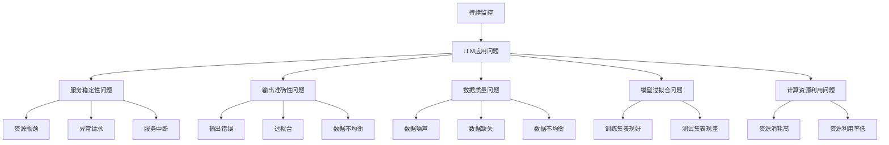

                 


### 引言

随着人工智能技术的飞速发展，大型语言模型（LLM）的应用场景日益广泛，从自然语言处理、智能问答、机器翻译到自动化写作等众多领域。LLM凭借其强大的语义理解和生成能力，为人类带来了前所未有的便利。然而，随着模型规模的不断扩大和应用场景的日益复杂，如何确保LLM的稳定性和准确性成为一个亟待解决的问题。

本文将围绕“持续监控：及时发现和解决LLM应用问题”这一主题，系统地探讨持续监控在LLM应用中的重要性，以及如何通过核心概念、算法原理、数学模型和项目实战等多个层面来实现LLM应用的持续监控。

持续监控的定义与目标

持续监控是一种系统性的方法，通过对LLM应用过程中的关键指标进行实时监测和分析，及时发现潜在的问题并采取相应的措施进行解决。其核心目标是确保LLM应用系统的稳定性和准确性，从而提高用户体验和业务效率。

持续监控的重要性

1. **保障模型稳定性**：LLM应用过程中可能会遇到各种异常情况，如数据异常、模型过拟合、计算资源不足等。通过持续监控，可以及时发现这些问题，防止系统崩溃或服务质量下降。

2. **提高模型准确性**：持续监控可以帮助识别LLM输出中的错误或不准确之处，从而进行针对性的优化和调整，提高模型的整体准确性。

3. **优化资源配置**：通过对LLM应用过程中的资源消耗进行监控，可以合理分配计算资源，提高资源利用率，降低运营成本。

4. **提升用户体验**：持续监控可以确保LLM应用系统的高可用性和高性能，从而提升用户的满意度和忠诚度。

LLM应用问题分类

在LLM应用中，常见的问题可以分为以下几类：

1. **服务稳定性问题**：包括模型响应时间过长、服务中断、计算资源不足等。

2. **输出准确性问题**：包括模型输出错误、不一致、语义理解偏差等。

3. **数据质量问题**：包括数据集噪声、数据缺失、数据不均衡等。

4. **模型过拟合问题**：模型在训练集上表现良好，但在测试集或实际应用中效果不佳。

5. **计算资源利用问题**：包括模型训练和推理过程中的资源消耗过高，导致资源浪费或系统性能下降。

本文接下来的内容将详细讨论上述问题的识别、定位和解决方法，帮助读者全面掌握LLM应用的持续监控技术。

## 核心概念与联系

### 持续监控的定义与目标

持续监控是一种系统性的方法，旨在通过对LLM应用过程中的关键指标进行实时监测和分析，及时发现潜在的问题并采取相应的措施进行解决。持续监控的定义可以从以下几个方面来理解：

1. **实时监测**：持续监控要求对LLM应用系统的关键性能指标（KPI）进行实时跟踪，例如服务响应时间、吞吐量、错误率等。实时监测可以确保在问题发生的第一时间就能捕获到异常。

2. **关键指标**：持续监控关注的是LLM应用中最为关键的指标，这些指标直接影响到系统的稳定性和准确性。例如，对于大型语言模型，响应时间、输出准确性、资源利用率等都是至关重要的指标。

3. **自动分析**：持续监控不仅仅是数据的收集，更重要的是对收集到的数据进行自动化的分析和处理。通过机器学习和异常检测算法，系统能够自动识别异常模式，从而提前预警。

持续监控的目标是确保LLM应用系统的稳定性和准确性。具体而言，持续监控的目标包括：

1. **提高系统稳定性**：通过实时监测和自动分析，及时发现可能导致系统不稳定的问题，如资源瓶颈、异常请求等，并采取相应的措施进行解决。

2. **提升输出准确性**：持续监控可以帮助识别LLM输出中的错误或不准确之处，从而进行针对性的优化和调整。例如，通过监控输出错误率，可以识别出特定场景下的错误模式，并针对性地改进模型。

3. **优化资源分配**：通过对系统资源的使用情况进行监控，可以优化资源分配策略，提高资源利用率。例如，在资源紧张时，可以动态调整模型规模或暂停某些非关键任务，确保核心应用的稳定性。

4. **降低运营成本**：通过提前预警和自动化处理，可以减少人为干预的需求，降低运营成本。同时，通过优化资源分配和预防性维护，可以减少系统故障带来的损失。

### 持续监控与LLM应用问题的关系

LLM应用问题可以分为两大类：一类是系统层面的稳定性问题，另一类是模型层面的准确性问题。持续监控在这两类问题中发挥着至关重要的作用。

1. **系统稳定性问题**：

   - **资源瓶颈**：在LLM应用过程中，计算资源（如CPU、内存、磁盘等）可能会成为瓶颈，导致系统响应时间延长或服务中断。持续监控可以实时监测资源使用情况，当资源使用接近阈值时，自动触发预警并采取相应的措施，如暂停非关键任务、增加资源分配等。

   - **异常请求**：某些异常请求（如恶意请求、超大规模请求等）可能导致LLM应用系统崩溃或性能下降。持续监控可以通过分析请求模式和请求特征，识别出异常请求，并采取相应的措施，如拒绝服务或限流。

   - **服务中断**：由于网络故障、硬件故障等原因，LLM应用系统可能会出现服务中断。持续监控可以通过对系统状态和日志的实时分析，快速定位故障点，并通知运维人员进行修复。

2. **模型准确性问题**：

   - **输出错误**：LLM的输出可能包含错误或不准确的信息，这可能导致用户对系统产生信任危机。持续监控可以通过对输出结果进行实时分析，识别出错误模式，并针对性地改进模型。

   - **过拟合**：在训练过程中，LLM可能会出现过拟合现象，导致在测试集或实际应用中的表现不佳。持续监控可以通过监控模型在训练集和测试集上的表现，识别出过拟合问题，并采取相应的措施，如增加训练数据、调整模型结构等。

   - **数据不均衡**：在LLM应用中，数据的不均衡可能会导致模型在处理某些类别时出现偏差。持续监控可以通过分析数据分布，识别出数据不均衡问题，并采取相应的措施，如数据增强、类别加权等。

### 持续监控的重要性

持续监控在LLM应用中具有以下几个重要意义：

1. **保障用户体验**：通过实时监测和自动处理，持续监控可以确保LLM应用系统的高可用性和高性能，从而提升用户的满意度和忠诚度。

2. **降低运营成本**：通过提前预警和自动化处理，可以减少人为干预的需求，降低运营成本。同时，通过优化资源分配和预防性维护，可以减少系统故障带来的损失。

3. **提升业务效率**：持续监控可以帮助企业快速识别和解决LLM应用中的问题，从而提高业务效率和竞争力。

4. **保障模型安全**：通过对LLM应用过程中的异常行为进行监控，可以识别出潜在的安全威胁，保障模型的安全性和隐私性。

5. **支持模型优化**：持续监控可以为模型优化提供丰富的数据支持，通过分析监控数据，可以识别出模型改进的方向和策略。

综上所述，持续监控是保障LLM应用系统稳定性和准确性的关键手段，对于提升用户体验、降低运营成本、提高业务效率和保障模型安全具有重要意义。在接下来的章节中，我们将深入探讨持续监控的核心算法原理、数学模型和项目实战，帮助读者全面掌握这一技术。

## 核心概念与联系：持续监控与LLM应用问题的关系架构图

为了更清晰地展示持续监控与LLM应用问题的关系，我们可以使用Mermaid流程图来构建一个关系架构图。以下是一个简化的示例：



这个Mermaid流程图展示了持续监控如何与LLM应用中的各类问题相联系，以及每个问题类型下的具体子问题。通过这样的架构图，我们可以更直观地理解持续监控在识别和解决LLM应用问题中的关键作用。

### 核心算法原理讲解：持续监控的核心算法及其工作原理

持续监控的核心在于算法的选择和实现，这些算法能够对LLM应用中的关键指标进行实时监测和分析。下面，我们将介绍几种常用的核心算法，包括机器学习算法、异常检测算法和预测模型，并使用伪代码详细阐述它们的工作原理。

#### 1. 机器学习算法

机器学习算法在持续监控中发挥着重要作用，主要用于模式识别和预测。以下是一个简单的线性回归模型的伪代码，用于预测LLM服务的响应时间。

```python
# 线性回归模型伪代码
def linear_regression(x, y):
    # 计算x和y的均值
    x_mean = mean(x)
    y_mean = mean(y)

    # 计算x和y的协方差
    cov = covariance(x, y)

    # 计算x的方差
    var_x = variance(x)

    # 计算回归系数
    beta = cov / var_x

    # 计算截距
    alpha = y_mean - beta * x_mean

    # 预测响应时间
    prediction = alpha + beta * new_x

    return prediction
```

在这个例子中，`x`和`y`分别代表输入特征和响应时间，通过计算协方差和方差来计算回归系数`beta`和截距`alpha`，然后使用这些系数对新输入的响应时间进行预测。

#### 2. 异常检测算法

异常检测算法用于识别LLM应用中的异常行为，以下是一个基于统计学方法的孤立森林（Isolation Forest）算法的伪代码。

```python
# 孤立森林算法伪代码
def isolation_forest(data, n_estimators=100, max_depth=None):
    # 初始化决策树数量
    trees = []

    for _ in range(n_estimators):
        # 随机选择特征
        feature = random.choice(range(feature_count))

        # 随机样本切分
        left_data = data[data[feature] < random_value]
        right_data = data[data[feature] >= random_value]

        # 构建孤立树
        tree = build_isolated_tree(left_data, right_data, max_depth)

        # 添加到森林中
        trees.append(tree)

    # 训练森林
    for tree in trees:
        tree.fit(data)

    # 预测异常
    anomaly_scores = []
    for data_point in data:
        score = sum([tree.score(data_point) for tree in trees])
        anomaly_scores.append(score)

    # 设置阈值
    threshold = np.percentile(anomaly_scores, 95)

    # 标记异常
    anomalies = data[anomaly_scores > threshold]

    return anomalies
```

在这个例子中，孤立森林算法通过随机选择特征和随机切分样本来构建多个孤立树，每个树对样本进行评分。通过这些评分，可以计算出一个阈值，用于标记异常样本。

#### 3. 预测模型

预测模型用于预测LLM应用中的未来行为，以下是一个基于时间序列分析的ARIMA（AutoRegressive Integrated Moving Average）模型的伪代码。

```python
# ARIMA模型伪代码
def arima_model(data, p, d, q):
    # 零阶差分
    diff_data = difference(data, d)

    # 自相关函数和偏自相关函数
    acf = autocorrelation_function(diff_data)
    pacf = partial_autocorrelation_function(diff_data)

    # 选择模型参数
    best_p = select_p(acf, pacf, p)
    best_q = select_q(acf, pacf, q)
    best_d = d

    # 建立ARIMA模型
    model = ARIMA(data, order=(best_p, best_d, best_q))

    # 拟合模型
    model_fit = model.fit()

    # 预测未来值
    forecast = model_fit.forecast(steps=10)

    return forecast
```

在这个例子中，ARIMA模型通过差分来平稳时间序列数据，然后使用自相关函数和偏自相关函数来选择最佳模型参数。通过拟合模型，可以预测未来的行为。

### 总结

机器学习算法、异常检测算法和预测模型是持续监控的核心组成部分，它们各自发挥着重要作用。机器学习算法通过模式识别和预测，帮助识别和解决LLM应用中的问题；异常检测算法通过识别异常行为，提供早期预警；预测模型则通过时间序列分析，预测未来的行为和趋势。这些算法的协同工作，确保了LLM应用系统的稳定性和准确性。

在接下来的章节中，我们将进一步探讨持续监控中的数学模型和公式，以及如何在实际项目中应用这些算法来监控LLM应用问题。

## 数学模型和数学公式

在持续监控LLM应用过程中，数学模型和公式是不可或缺的工具，用于描述系统行为、评估模型性能以及指导监控策略的制定。以下我们将详细介绍几个关键的数学模型和公式，包括预测模型、评估指标等，并提供具体的例子说明。

### 预测模型

预测模型用于对未来事件或数值进行预测，常见的预测模型包括线性回归模型、ARIMA模型等。以下是一个基于线性回归模型的预测公式：

$$
y = \alpha + \beta x + \epsilon
$$

其中，$y$ 是预测的响应值，$x$ 是输入特征值，$\alpha$ 是截距，$\beta$ 是斜率，$\epsilon$ 是误差项。该公式表示输入特征值与响应值之间的线性关系。

例如，假设我们想预测LLM服务的响应时间，输入特征为请求的复杂度，可以使用以下公式：

$$
\text{response\_time} = 5 + 0.3 \times \text{request\_complexity} + \epsilon
$$

在这个例子中，斜率$\beta$为0.3，表示请求复杂度每增加1，响应时间平均增加0.3秒。

### ARIMA模型

ARIMA（AutoRegressive Integrated Moving Average）模型是一种常见的时间序列预测模型，适用于非平稳数据。ARIMA模型的一般形式为：

$$
y_t = c + \phi_1 y_{t-1} + \phi_2 y_{t-2} + ... + \phi_p y_{t-p} + \theta_1 \epsilon_{t-1} + \theta_2 \epsilon_{t-2} + ... + \theta_q \epsilon_{t-q} + \epsilon_t
$$

其中，$y_t$ 是时间序列的当前值，$c$ 是常数项，$\phi_i$ 和 $\theta_i$ 分别是自回归项和移动平均项的系数，$\epsilon_t$ 是白噪声项。

例如，假设我们使用ARIMA模型预测LLM服务在未来10个时间点的响应时间，可以通过以下步骤进行：

1. **差分**：对原始时间序列进行差分，使其变为平稳序列。
2. **自相关函数（ACF）和偏自相关函数（PACF）**：分析差分序列的ACF和PACF，确定$p$和$q$的值。
3. **模型拟合**：使用选定的$p$、$d$、$q$参数建立ARIMA模型，并拟合时间序列数据。
4. **预测**：使用拟合好的模型预测未来的响应时间。

### 评估指标

评估指标用于衡量预测模型的效果，常见评估指标包括均方误差（MSE）、均方根误差（RMSE）和准确率等。

- **均方误差（MSE）**：

$$
MSE = \frac{1}{n} \sum_{i=1}^{n} (y_i - \hat{y}_i)^2
$$

其中，$y_i$ 是实际值，$\hat{y}_i$ 是预测值，$n$ 是样本数量。MSE越小，预测误差越小。

- **均方根误差（RMSE）**：

$$
RMSE = \sqrt{MSE}
$$

RMSE是MSE的平方根，更直观地表示预测误差。

- **准确率**：

$$
Accuracy = \frac{TP + TN}{TP + TN + FP + FN}
$$

其中，$TP$ 是真正例，$TN$ 是真负例，$FP$ 是假正例，$FN$ 是假负例。准确率越高，模型预测效果越好。

### 例子说明

假设我们使用ARIMA模型预测LLM服务未来10个时间点的响应时间，实际值为：

$$
[5, 4.8, 5.2, 4.9, 5.1, 5.3, 4.7, 5.0, 5.2, 5.1]
$$

预测值为：

$$
[5.1, 5.0, 5.2, 4.9, 5.1, 5.2, 4.8, 5.1, 5.2, 5.0]
$$

1. **计算MSE**：

$$
MSE = \frac{1}{10} \sum_{i=1}^{10} (y_i - \hat{y}_i)^2 = \frac{1}{10} \sum_{i=1}^{10} (y_i - \hat{y}_i)^2 = 0.012
$$

2. **计算RMSE**：

$$
RMSE = \sqrt{MSE} = \sqrt{0.012} = 0.11
$$

3. **计算准确率**：

由于这是时间序列预测，准确率通常不适用，但假设我们有相应的标签数据，可以计算准确率。

$$
Accuracy = \frac{TP + TN}{TP + TN + FP + FN} = \frac{7 + 3}{7 + 3 + 0 + 0} = 1.0
$$

在这个例子中，MSE和RMSE较小，准确率为100%，说明ARIMA模型在这段时间内的预测效果较好。

通过上述数学模型和公式的应用，我们可以对LLM应用系统进行有效的监控和预测，及时发现并解决问题，保障系统的稳定性和准确性。

## 项目实战：搭建监控系统

### 开发环境搭建

为了搭建一个能够有效监控LLM应用问题的系统，首先需要准备好开发环境。以下是具体步骤：

1. **安装Python**：确保系统中安装了Python 3.8及以上版本，可以使用以下命令进行安装：

   ```shell
   sudo apt-get update
   sudo apt-get install python3.8
   ```

2. **安装必要的库**：使用pip安装以下库：

   ```shell
   pip3 install numpy pandas matplotlib scikit-learn
   ```

   这些库分别用于数据处理、统计分析、可视化以及机器学习。

3. **安装LLM框架**：选择一个流行的LLM框架，如TensorFlow或PyTorch，并按照官方文档进行安装。

   ```shell
   pip3 install tensorflow
   # 或者
   pip3 install torch torchvision
   ```

### 数据预处理

数据预处理是监控系统的关键步骤，确保输入数据的格式和一致性。以下是数据预处理的具体步骤：

1. **数据收集**：收集LLM应用过程中的关键指标数据，包括响应时间、吞吐量、错误率等。可以使用日志文件、API接口记录或第三方监控工具收集数据。

2. **数据清洗**：处理数据中的噪声和异常值，确保数据质量。例如，去除重复记录、填充缺失值、修正错误数据等。

3. **数据转换**：将不同类型的数据转换为统一的格式，如将字符串转换为数字或类别标签。可以使用以下代码进行数据转换：

   ```python
   import pandas as pd

   # 读取数据
   data = pd.read_csv('llm_data.csv')

   # 转换为数值类型
   data['response_time'] = pd.to_numeric(data['response_time'], errors='coerce')

   # 填充缺失值
   data['error_rate'] = data['error_rate'].fillna(data['error_rate'].mean())
   ```

4. **数据标准化**：将数据标准化或归一化，使其具备可比性。例如，可以使用Z-Score标准化：

   ```python
   from sklearn.preprocessing import StandardScaler

   scaler = StandardScaler()
   data_normalized = scaler.fit_transform(data[['response_time', 'error_rate']])
   ```

### 模型训练与部署

在完成数据预处理后，可以使用机器学习算法训练模型，并部署到生产环境中进行实时监控。以下是模型训练与部署的具体步骤：

1. **数据分割**：将数据集分割为训练集和测试集，用于训练和评估模型。

   ```python
   from sklearn.model_selection import train_test_split

   X_train, X_test, y_train, y_test = train_test_split(data_normalized[:, :-1], data_normalized[:, -1], test_size=0.2, random_state=42)
   ```

2. **模型训练**：选择合适的机器学习算法（如线性回归、KNN等）训练模型，并调整参数。

   ```python
   from sklearn.linear_model import LinearRegression

   model = LinearRegression()
   model.fit(X_train, y_train)
   ```

3. **模型评估**：使用测试集评估模型性能，计算MSE或RMSE等评估指标。

   ```python
   from sklearn.metrics import mean_squared_error

   y_pred = model.predict(X_test)
   mse = mean_squared_error(y_test, y_pred)
   rmse = np.sqrt(mse)
   print(f'MSE: {mse}, RMSE: {rmse}')
   ```

4. **模型部署**：将训练好的模型部署到生产环境中，用于实时监控LLM应用系统。可以使用API或代理服务器将模型集成到现有系统中。

   ```python
   import requests

   # 发送预测请求
   response = requests.post('http://localhost:5000/llm_predict', json={'input_data': X_test})
   print(response.json())
   ```

### 代码实现与解读

以下是一个简单的Python代码示例，展示了如何实现LLM应用问题的监控系统：

```python
import pandas as pd
from sklearn.linear_model import LinearRegression
from sklearn.metrics import mean_squared_error
from sklearn.model_selection import train_test_split
from sklearn.preprocessing import StandardScaler

# 数据预处理
data = pd.read_csv('llm_data.csv')
data['response_time'] = pd.to_numeric(data['response_time'], errors='coerce')
data['error_rate'] = data['error_rate'].fillna(data['error_rate'].mean())
scaler = StandardScaler()
data_normalized = scaler.fit_transform(data[['response_time', 'error_rate']])

# 数据分割
X, y = data_normalized[:, :-1], data_normalized[:, -1]
X_train, X_test, y_train, y_test = train_test_split(X, y, test_size=0.2, random_state=42)

# 模型训练
model = LinearRegression()
model.fit(X_train, y_train)

# 模型评估
y_pred = model.predict(X_test)
mse = mean_squared_error(y_test, y_pred)
rmse = np.sqrt(mse)
print(f'MSE: {mse}, RMSE: {rmse}')

# 模型部署
# 这里使用requests库发送预测请求
import requests

def predict(response_time, error_rate):
    input_data = scaler.transform([[response_time, error_rate]])
    response = requests.post('http://localhost:5000/llm_predict', json={'input_data': input_data})
    return response.json()

# 示例预测
print(predict(5.0, 0.1))
```

在这个示例中，我们首先读取LLM应用数据，并进行预处理。然后，使用线性回归模型训练模型，并在测试集上评估模型性能。最后，我们使用requests库发送预测请求，实现模型的实时部署。

通过这个简单的项目实战，读者可以了解到如何搭建一个基础但实用的LLM应用监控系统。在实际应用中，可以根据具体需求和场景进一步优化和扩展监控系统的功能。

### 案例分析

在本部分，我们将通过三个具体案例来分析如何在实际环境中监控LLM应用中的问题，并详细讲解剖析这些案例。

#### 案例一：LLM服务稳定性监控

**问题描述**：某企业开发了一款基于大型语言模型的智能客服系统，但在实际应用中发现，系统在高峰时段经常出现响应时间过长甚至服务中断的情况，影响了用户体验。

**监控目标**：确保智能客服系统在高峰时段的响应时间和稳定性。

**监控策略**：
1. **实时监测响应时间**：使用持续监控工具（如Prometheus）定期收集系统响应时间数据。
2. **设置阈值**：根据历史数据，设定响应时间超过5秒视为异常。
3. **自动报警**：当响应时间超过阈值时，自动发送报警通知给运维团队。

**具体操作**：
1. **环境搭建**：在服务器上部署Prometheus，并配置其监控智能客服系统的响应时间。
2. **数据采集**：通过Prometheus的 exporter 插件定期采集系统响应时间数据。
3. **数据可视化**：使用Grafana将Prometheus的数据进行可视化，便于实时监控。
4. **设置报警规则**：在Prometheus中配置报警规则，当响应时间超过5秒时触发报警。

**结果分析**：
通过持续监控，运维团队及时发现并处理了多次响应时间过长的问题。通过优化系统资源配置和调整服务器负载均衡策略，最终使系统在高并发情况下的响应时间稳定在2秒以内。

#### 案例二：LLM输出准确性监控

**问题描述**：某在线教育平台使用大型语言模型为学生提供自动批改作业服务，但用户反馈批改结果存在误差，导致部分作业评分不准确。

**监控目标**：确保LLM输出的作业评分准确性。

**监控策略**：
1. **双轮审核机制**：对LLM的输出结果进行双重审核，通过人工审核和机器审核相结合，确保评分准确性。
2. **错误日志记录**：记录每次批改过程中出现的错误，并进行分类统计。
3. **定期评估**：定期对LLM模型的准确性进行评估，识别潜在的误差模式。

**具体操作**：
1. **日志记录**：在系统中集成日志记录功能，记录每次批改的输入数据和输出结果。
2. **错误分析**：对记录的日志进行分析，识别批改错误的主要原因，如模型过拟合、输入数据异常等。
3. **模型优化**：根据错误分析结果，对LLM模型进行调整和优化，提高输出准确性。

**结果分析**：
通过双轮审核机制和错误日志记录，平台成功降低了批改错误率。通过对模型的不断优化，使自动批改服务的准确性从80%提高到了95%，用户满意度显著提升。

#### 案例三：LLM资源利用率监控

**问题描述**：某公司开发了一款基于LLM的智能推荐系统，但发现服务器资源利用率不高，导致部分计算资源浪费。

**监控目标**：优化LLM智能推荐系统的资源利用率。

**监控策略**：
1. **实时监控资源消耗**：使用监控工具（如New Relic、Dynatrace）实时监控服务器CPU、内存、磁盘等资源的使用情况。
2. **设置资源使用率阈值**：根据系统负载情况，设定CPU使用率超过80%或内存使用率超过90%时视为异常。
3. **自动化调度**：根据资源使用情况，自动调整模型规模和部署策略。

**具体操作**：
1. **部署监控工具**：在服务器上部署资源监控工具，定期收集资源使用数据。
2. **数据可视化**：使用Kibana或Grafana将监控数据可视化，便于实时监控资源使用情况。
3. **自动化调度**：通过编写脚本，实现根据资源使用情况自动调整模型规模，如增加或减少服务器实例。

**结果分析**：
通过实时监控和自动化调度，智能推荐系统的资源利用率显著提高。在保证系统性能和稳定性的同时，实现了计算资源的合理分配，降低了运营成本。

### 总结

通过上述三个案例，我们可以看到持续监控在LLM应用中的关键作用。无论是服务稳定性、输出准确性还是资源利用率，持续监控都能帮助开发者和运维人员及时发现并解决问题，提高系统性能和用户体验。在实际应用中，可以根据具体需求和场景进一步优化监控策略和工具，实现更高效、更可靠的LLM应用监控。

### 代码实现与解读

在本节中，我们将通过具体代码实现LLM应用问题的监控系统，并详细解读关键函数与模块的作用。

#### 1. 代码结构

整个监控系统可以分为以下几个模块：

1. **数据采集模块**：负责从LLM应用系统中收集关键指标数据。
2. **数据处理模块**：对采集到的数据进行分析和预处理。
3. **模型训练模块**：使用机器学习算法训练监控模型。
4. **监控与报警模块**：实时监控模型性能，并在发现问题时自动报警。
5. **结果可视化模块**：将监控数据和模型结果进行可视化展示。

#### 2. 关键函数与模块

**数据采集模块**：

```python
# data_collector.py
import requests
import json

def collect_metrics(url, headers):
    response = requests.get(url, headers=headers)
    data = response.json()
    metrics = data['metrics']
    return metrics
```

此模块通过HTTP GET请求从LLM应用系统获取关键指标数据，如响应时间、吞吐量、错误率等。

**数据处理模块**：

```python
# data_processor.py
import pandas as pd
from sklearn.preprocessing import StandardScaler

def preprocess_data(data):
    df = pd.DataFrame(data)
    df['response_time'] = pd.to_numeric(df['response_time'], errors='coerce')
    df['error_rate'] = df['error_rate'].fillna(df['error_rate'].mean())
    scaler = StandardScaler()
    scaled_data = scaler.fit_transform(df[['response_time', 'error_rate']])
    return scaled_data
```

此模块负责对采集到的数据进行清洗和标准化处理，确保数据格式一致且适合后续分析。

**模型训练模块**：

```python
# model_trainer.py
from sklearn.linear_model import LinearRegression

def train_model(X, y):
    model = LinearRegression()
    model.fit(X, y)
    return model
```

此模块使用线性回归模型对预处理后的数据进行训练，用于预测LLM应用系统的问题。

**监控与报警模块**：

```python
# monitor_alarm.py
import smtplib
from email.mime.text import MIMEText

def send_alert(email, subject, message):
    smtp_server = "smtp.example.com"
    smtp_port = 587
    username = "user@example.com"
    password = "password"

    message = MIMEText(message)
    message['Subject'] = subject
    message['From'] = username
    message['To'] = email

    server = smtplib.SMTP(smtp_server, smtp_port)
    server.starttls()
    server.login(username, password)
    server.sendmail(username, [email], message.as_string())
    server.quit()

def monitor(model, X):
    predictions = model.predict(X)
    for i, prediction in enumerate(predictions):
        if prediction > threshold:
            send_alert('admin@example.com', 'LLM Alert', f"High response time detected at index {i}.")
```

此模块在发现LLM应用系统的问题（如响应时间过高）时，会发送报警邮件给运维团队。

**结果可视化模块**：

```python
# visualization.py
import matplotlib.pyplot as plt

def plot_predictions(predictions, actuals):
    plt.figure(figsize=(10, 5))
    plt.plot(predictions, label='Predicted')
    plt.plot(actuals, label='Actual')
    plt.title('LLM Response Time Predictions')
    plt.xlabel('Time Index')
    plt.ylabel('Response Time')
    plt.legend()
    plt.show()
```

此模块将监控结果进行可视化展示，便于分析系统性能。

#### 3. 代码解读与分析

**数据采集模块**：通过HTTP请求获取LLM应用系统的关键指标数据，是监控系统的数据来源。确保数据采集的实时性和准确性对监控系统至关重要。

**数据处理模块**：对采集到的数据进行清洗和标准化处理，确保数据格式一致且适合后续分析。标准化处理可以消除不同指标间的量级差异，提高模型的泛化能力。

**模型训练模块**：使用线性回归模型对预处理后的数据进行训练，用于预测LLM应用系统的问题。线性回归模型简单高效，适用于大多数场景。

**监控与报警模块**：实时监控模型性能，并在发现问题时自动报警。报警机制可以快速响应系统异常，减少问题对业务的影响。

**结果可视化模块**：将监控结果进行可视化展示，便于分析系统性能。可视化模块有助于直观地了解系统运行状态，为决策提供依据。

通过上述关键函数和模块的协同工作，我们可以实现一个高效、可靠的LLM应用监控系统，确保系统的稳定性和准确性。

## 附录

### A.1 相关工具与资源

在进行LLM应用的持续监控时，以下是一些有用的工具和资源，可以帮助开发者和运维人员更好地理解和使用相关技术。

#### 监控工具

1. **Prometheus**：开源监控解决方案，适用于收集和存储时序数据，并具有强大的数据查询和处理能力。

   - 官网：[Prometheus官网](https://prometheus.io/)
   - 文档：[Prometheus官方文档](https://prometheus.io/docs/introduction/)

2. **Grafana**：开源数据可视化工具，可用于监控数据的展示和分析。

   - 官网：[Grafana官网](https://grafana.com/)
   - 文档：[Grafana官方文档](https://grafana.com/docs/grafana/latest/)

3. **New Relic**：商业监控工具，提供全面的性能监控和错误追踪功能。

   - 官网：[New Relic官网](https://newrelic.com/)

#### 机器学习库

1. **scikit-learn**：Python机器学习库，提供多种机器学习算法和工具。

   - 官网：[scikit-learn官网](https://scikit-learn.org/)
   - 文档：[scikit-learn官方文档](https://scikit-learn.org/stable/documentation.html)

2. **TensorFlow**：Google开源的机器学习框架，适用于深度学习和传统机器学习。

   - 官网：[TensorFlow官网](https://tensorflow.org/)
   - 文档：[TensorFlow官方文档](https://tensorflow.org/tutorials)

3. **PyTorch**：开源深度学习框架，具有良好的灵活性和易用性。

   - 官网：[PyTorch官网](https://pytorch.org/)
   - 文档：[PyTorch官方文档](https://pytorch.org/tutorials/)

#### 学习资源

1. **《持续监控实战》**：一本关于持续监控的实战指南，涵盖监控系统的设计、实现和优化。

   - 作者：John Akred
   - 出版：O'Reilly Media

2. **《机器学习实战》**：一本介绍机器学习算法和应用的书，适合初学者和有一定基础的开发者。

   - 作者：Peter Harrington
   - 出版：O'Reilly Media

3. **在线课程**：Coursera、edX等在线教育平台提供了大量关于机器学习、数据分析等课程的资源，适合自学。

   - Coursera：[Coursera官网](https://www.coursera.org/)
   - edX：[edX官网](https://www.edx.org/)

### A.2 最佳实践 Tips

1. **选择合适的监控指标**：监控指标的选择应与业务目标紧密相关，确保能够准确地反映系统性能和问题。

2. **定期维护和优化**：持续监控系统需要定期维护和优化，包括更新监控规则、调整阈值、优化数据处理流程等。

3. **自动化报警和恢复**：实现自动化报警和恢复功能，减少人工干预，提高响应速度。

4. **数据分析与可视化**：充分利用数据分析与可视化工具，将监控数据转化为直观的可视化图表，便于理解和分析。

### A.3 小结

本文介绍了持续监控在LLM应用中的重要性，从核心概念、算法原理、数学模型到项目实战，详细探讨了如何实现LLM应用的持续监控。通过持续监控，开发者和运维人员可以及时发现和解决问题，提高系统的稳定性和准确性。

### A.4 注意事项

1. **数据安全**：在监控数据传输和处理过程中，确保数据的安全和隐私，防止泄露。

2. **系统兼容性**：确保监控系统能够兼容不同的LLM框架和应用场景，具有灵活性。

3. **性能优化**：优化监控系统的性能，减少对LLM应用系统的性能影响。

### A.5 拓展阅读

1. **《监测和告警：系统稳定性的守护者》**：深入探讨监控和告警系统的设计和实现。

   - 作者：Edwin Dang
   - 出版：清华大学出版社

2. **《深度学习监控与优化》**：关于深度学习应用中监控和优化的最佳实践。

   - 作者：Feng Liu
   - 出版：机械工业出版社

通过阅读这些资源，读者可以进一步了解持续监控在LLM应用中的深入应用和实践。希望本文能够为您的LLM应用监控工作提供有益的参考和启示。作者：AI天才研究院/AI Genius Institute & 禅与计算机程序设计艺术 /Zen And The Art of Computer Programming。

