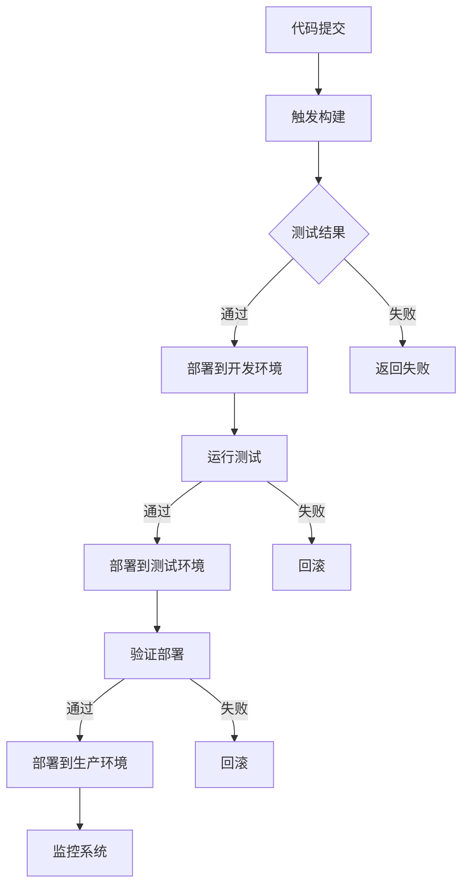

                 


### 文章标题

《持续集成与持续部署（CI/CD）在LLM应用中的实施》

### 关键词

持续集成（CI），持续部署（CD），大型语言模型（LLM），软件工程，DevOps，自动化测试，容器化，云原生，微服务，Kubernetes，GitLab，Jenkins，Docker，Nginx，Prometheus，Grafana

### 摘要

本文深入探讨了持续集成（CI）与持续部署（CD）在大型语言模型（LLM）中的应用与实施。首先，我们回顾了CI/CD的基本概念、原理及其在软件开发中的重要性。接着，分析了LLM的特殊性及其对CI/CD流程的挑战。随后，文章详细介绍了CI/CD流程设计、自动化测试、代码管理以及具体的实施步骤和工具选择。通过实际案例，展示了CI/CD在LLM开发中的应用，并提供了优化策略和未来展望。本文旨在为开发者提供一套完整的CI/CD实施指南，以提升LLM项目的开发效率和稳定性。

----------------------------------------------------------------

### 引言

随着人工智能（AI）技术的快速发展，大型语言模型（LLM）如BERT、GPT-3等在自然语言处理（NLP）领域取得了显著的成果。LLM的应用范围涵盖了文本生成、机器翻译、问答系统等多个领域，极大地推动了人工智能与实际业务的融合。然而，LLM的开发和部署过程复杂，涉及大量的数据处理、模型训练、测试与部署等环节。如何高效、稳定地进行LLM项目的开发和维护，成为开发者面临的重要问题。

持续集成（CI）与持续部署（CD）作为一种现代化的软件开发实践，通过自动化和流水线化的方式，显著提高了软件开发的效率和质量。CI/CD的核心在于将代码的集成、测试、部署等过程自动化，从而减少人为干预，降低错误率，加快迭代速度。在LLM开发中，CI/CD的应用能够帮助开发者更好地管理项目复杂性，确保模型训练和部署的准确性，提升开发效率和系统稳定性。

本文将深入探讨CI/CD在LLM应用中的实施，包括CI/CD的基本概念、原理，LLM的特殊性，CI/CD流程的设计与实现，自动化测试与代码管理，具体实施步骤，以及优化策略和未来展望。通过本文的阅读，读者将能够系统地了解CI/CD在LLM开发中的应用，掌握CI/CD实施的关键技术和最佳实践。

### 持续集成与持续部署（CI/CD）基本概念与原理

#### 1.1 持续集成（CI）

持续集成（Continuous Integration，简称CI）是一种软件开发实践，旨在通过频繁的代码集成和自动化测试，确保代码库中的每一个提交都是可集成和可运行的。其核心思想是将开发者的代码定期集成到主干分支，并通过自动化测试验证其功能是否正常。

**核心流程：**
- **提交代码：** 开发者将代码提交到版本控制系统中。
- **集成代码：** 源代码管理系统将提交的代码合并到主干分支。
- **运行测试：** 自动化测试工具运行一系列预定义的测试用例，包括单元测试、集成测试等。
- **反馈结果：** 测试结果被反馈给开发者，以便及时发现问题并进行修复。

**优势：**
- **快速发现问题：** 通过频繁的集成和测试，可以快速发现和修复代码中的缺陷。
- **提高代码质量：** 自动化的测试流程能够确保代码的可维护性和可靠性。
- **减少集成冲突：** 定期的集成可以减少不同开发者的代码合并冲突。

#### 1.2 持续部署（CD）

持续部署（Continuous Deployment，简称CD）是在持续集成的基础上，通过自动化流程将软件部署到生产环境。CD的核心思想是将软件部署过程完全自动化，从而实现快速、可靠的软件发布。

**核心流程：**
- **构建软件：** 从源代码创建可执行文件或容器镜像。
- **测试软件：** 在模拟的生产环境中进行测试，确保软件功能正常。
- **部署软件：** 自动将测试通过后的软件部署到生产环境。

**优势：**
- **提高部署速度：** 自动化的部署流程可以大幅减少部署时间，提高发布频率。
- **减少部署风险：** 通过自动化测试和模拟部署，可以降低人为操作引入的风险。
- **持续优化：** 通过持续部署，团队能够快速响应用户反馈，持续优化软件功能。

#### 1.3 CI/CD与传统开发模式的区别

与传统开发模式相比，CI/CD在以下几个方面有显著的不同：

- **开发流程：** 传统开发模式通常采用手动的集成和部署流程，而CI/CD强调自动化和流水线化的开发流程。
- **测试频率：** 传统模式测试频率较低，而CI/CD频繁进行集成和测试，确保代码质量。
- **团队协作：** CI/CD鼓励开发、测试和运维团队紧密协作，而传统模式团队之间往往存在较大的隔阂。
- **反馈速度：** 传统模式反馈速度较慢，而CI/CD能够快速反馈测试结果，加速问题定位和修复。

#### 1.4 CI/CD与DevOps的关系

DevOps是一种软件开发和运营的结合，旨在通过自动化和协作提升软件开发和运维的效率。CI/CD是DevOps实践的重要组成部分，二者密不可分。

- **CI/CD是DevOps的核心：** CI/CD通过自动化流程将开发、测试和部署结合起来，是DevOps实施的基石。
- **DevOps推动CI/CD：** DevOps理念强调开发和运维团队的合作，为CI/CD的全面实施提供了文化和技术支持。

通过CI/CD，开发者可以更快地迭代软件，运营团队能够更可靠地部署和维护软件，从而实现高效、稳定的软件开发和运营。

### 大型语言模型（LLM）概述

#### 2.1 LLM的基本概念

大型语言模型（Large Language Model，简称LLM）是一种基于深度学习的自然语言处理（NLP）模型，通过学习大量的文本数据，能够生成高质量的自然语言文本。LLM的核心是大规模神经网络，通常采用变分自编码器（VAE）、生成对抗网络（GAN）等先进技术。

**特点：**
- **大规模训练数据：** LLM需要学习大量高质量文本数据，以获得强大的语言理解能力。
- **强大的生成能力：** LLM可以生成流畅、符合语法和语义规则的文本。
- **自适应能力：** LLM可以根据输入的文本内容自适应地调整生成文本的风格和内容。

**应用领域：**
- **文本生成：** 包括文章、故事、新闻、诗歌等自然语言文本的自动生成。
- **机器翻译：** 实现多种语言之间的准确翻译。
- **问答系统：** 对用户的问题提供准确的回答。
- **文本摘要：** 自动提取长篇文章的主要内容和关键信息。

#### 2.2 LLM的发展历程

LLM的发展历程可以追溯到20世纪80年代，随着计算机性能的提升和深度学习技术的进步，LLM的研究和应用得到了快速发展。

- **早期阶段（1980s-1990s）：** 早期的研究主要集中在规则驱动的方法，如语法分析和语义分析。
- **预训练阶段（2000s）：** 2000年代，随着大规模语料库的出现和计算资源的增加，研究人员开始尝试在大量数据上进行模型预训练。
- **深度学习阶段（2010s-2020s）：** 2010年代，随着深度学习技术的突破，如Transformer架构的提出，LLM的研究和应用得到了前所未有的发展。GPT-3、BERT等大型语言模型相继问世，展示了强大的语言生成和识别能力。

#### 2.3 LLM的应用领域

LLM在多个领域展现出了强大的应用潜力，成为人工智能领域的热点。

- **人工智能助手：** 如ChatGPT、Duolingo等，提供语言学习和问题解答服务。
- **智能客服：** 在电子商务、金融等行业提供自动化的客户服务。
- **内容创作：** 自动生成文章、新闻报道、音乐、艺术作品等。
- **教育：** 在教育领域提供个性化学习辅导、智能测评等服务。
- **法律：** 自动生成法律文件、合同、案例分析等。

通过不断的技术创新和应用探索，LLM在推动人工智能与各行各业深度融合的同时，也为人类带来了前所未有的便利和效率。

### CI/CD在LLM应用中的挑战

#### 3.1 LLM开发的特点

LLM开发具有以下显著特点，这些特点对CI/CD的实施提出了独特的要求：

- **大规模数据需求：** LLM的训练和部署需要大量的高质量文本数据，这使得数据收集、处理和存储成为关键环节。
- **计算资源密集：** LLM的训练过程需要大量的计算资源，包括高性能CPU和GPU，这对CI/CD流程中的资源调度和分配提出了挑战。
- **模型版本管理：** LLM模型的开发涉及多个版本，每个版本都需要经过严格的测试和验证，如何高效管理模型版本是CI/CD流程的重要问题。
- **复杂依赖关系：** LLM项目通常涉及多个第三方库和工具，如何确保所有依赖关系的兼容性和稳定性是CI/CD面临的一大难题。

#### 3.2 CI/CD在LLM中的难点

在LLM开发中，CI/CD面临以下难点：

- **数据集成与清洗：** LLM训练的数据量大且来源多样，如何确保数据的完整性和一致性，是CI/CD流程中的关键问题。
- **模型训练与优化：** LLM的训练过程复杂且耗时，如何实现高效的模型训练和优化，是CI/CD流程的挑战。
- **自动化测试：** LLM的测试需要模拟各种复杂的语言场景，如何设计全面、有效的自动化测试用例，是CI/CD流程的关键。
- **持续部署：** LLM部署到生产环境后，如何保证模型的稳定性和性能，是CI/CD流程中的一大难题。

#### 3.3 解决方案概述

为了应对CI/CD在LLM应用中的挑战，可以采取以下解决方案：

- **数据管理平台：** 建立数据管理平台，统一数据收集、清洗、存储和共享，确保数据的一致性和完整性。
- **分布式计算资源调度：** 利用云计算平台和分布式计算框架，实现计算资源的动态调度和高效利用，提高模型训练和优化的效率。
- **模型版本管理工具：** 采用模型版本管理工具，如MLflow，实现模型版本的全生命周期管理，确保不同版本的模型能够快速、准确地部署和回滚。
- **自动化测试框架：** 设计和实现自动化测试框架，包括单元测试、集成测试和端到端测试，确保LLM模型在各种语言场景下的稳定性和准确性。
- **容器化与微服务架构：** 采用容器化和微服务架构，实现LLM模型的快速部署和扩展，提高系统的灵活性和可维护性。

通过上述解决方案，CI/CD在LLM应用中的实施将更加高效、稳定和可靠。

### CI/CD工具与平台选择

#### 4.1 常见CI/CD工具介绍

在CI/CD实践中，选择合适的工具和平台至关重要。以下是几种常见的CI/CD工具及其特点：

- **Jenkins：** Jenkins是一个开源的持续集成工具，支持多种插件，可以轻松集成各种开发和测试工具。它具有高度的可定制性和扩展性，但配置较为复杂，适用于需要高度定制化的项目。

  ```mermaid
  graph TD
  A[Jenkins] --> B[插件丰富]
  A --> C[配置复杂]
  ```

- **GitLab CI/CD：** GitLab CI/CD是GitLab内置的持续集成和持续部署工具，与GitLab的代码管理功能深度集成，适用于小型到中型的项目。它支持多阶段部署，易于配置和部署，但扩展性相对有限。

  ```mermaid
  graph TD
  A[GitLab CI/CD] --> B[与GitLab集成]
  A --> C[扩展性有限]
  ```

- **CircleCI：** CircleCI是一个云端的持续集成和持续部署平台，提供自动化的构建、测试和部署服务。它具有出色的性能和扩展性，适用于需要快速迭代的大型项目。

  ```mermaid
  graph TD
  A[CircleCI] --> B[云端服务]
  A --> C[性能优秀]
  ```

- **GitHub Actions：** GitHub Actions是GitHub提供的持续集成和持续部署服务，与GitHub的代码管理功能紧密结合，易于配置和使用。它支持多种编程语言和操作系统，适用于中小型项目和开源项目。

  ```mermaid
  graph TD
  A[GitHub Actions] --> B[与GitHub集成]
  A --> C[易用性高]
  ```

#### 4.2 常见CI/CD平台介绍

除了上述工具，还有一些常见的CI/CD平台，如Travis CI、GitLab CI/CD、Azure DevOps、AWS CodePipeline等。这些平台提供了丰富的功能，适用于不同的项目规模和需求。

- **Travis CI：** Travis CI是一个基于云的持续集成服务，适用于开源项目和私有项目。它支持多种编程语言，可以自动构建、测试和部署代码，并提供详细的报告。

  ```mermaid
  graph TD
  A[Travis CI] --> B[开源友好]
  A --> C[自动化测试]
  ```

- **GitLab CI/CD：** GitLab CI/CD是一个集成在GitLab中的持续集成和持续部署服务，支持多阶段部署和并行执行，适用于中小型项目。

  ```mermaid
  graph TD
  A[GitLab CI/CD] --> B[多阶段部署]
  A --> C[并行执行]
  ```

- **Azure DevOps：** Azure DevOps是一个由微软提供的集成平台，提供持续集成、持续交付和持续部署功能，适用于企业级项目。

  ```mermaid
  graph TD
  A[Azure DevOps] --> B[企业级服务]
  A --> C[强大的集成能力]
  ```

- **AWS CodePipeline：** AWS CodePipeline是AWS提供的持续集成和持续部署服务，支持自动构建、测试和部署代码，适用于云计算环境。

  ```mermaid
  graph TD
  A[AWS CodePipeline] --> B[云计算集成]
  A --> C[自动部署]
  ```

#### 4.3 选择合适的CI/CD工具与平台

选择合适的CI/CD工具和平台需要考虑以下几个因素：

- **项目规模：** 对于小型项目，可以选择GitHub Actions等易于配置的工具；对于大型项目，则需要选择具有高扩展性和强大功能的工具，如Jenkins或Azure DevOps。
- **开发语言：** 确保选择的CI/CD工具支持项目的编程语言和框架。
- **预算：** 开源工具如Jenkins和GitHub Actions免费，适用于预算有限的项目；云服务平台如CircleCI和AWS CodePipeline提供付费服务，适用于预算充足的项目。
- **集成需求：** 确保选择的工具能够与其他开发和测试工具无缝集成，提高开发效率。

通过综合考虑以上因素，开发者可以找到最适合自己的CI/CD工具和平台，实现高效的持续集成和持续部署。

### CI/CD流程设计

#### 5.1 CI/CD流程的基本步骤

CI/CD流程设计是确保软件从开发到部署过程高效、可靠的关键。以下是CI/CD流程的基本步骤：

1. **提交代码：** 开发者将代码提交到版本控制系统，如Git。
2. **构建代码：** CI/CD工具从版本控制系统中提取最新代码，构建出可执行的程序或容器镜像。
3. **运行测试：** 自动化测试工具运行预定义的测试用例，包括单元测试、集成测试和端到端测试。
4. **部署代码：** 如果测试通过，自动将代码部署到预定的环境，如开发、测试或生产环境。
5. **监控：** 在代码部署后，监控系统会持续监控应用程序的性能和健康状况，确保系统的稳定运行。

#### 5.2 CI/CD流程的设计原则

设计CI/CD流程时，应遵循以下原则：

- **自动化：** 将尽可能多的任务自动化，以减少手动干预，提高效率和一致性。
- **快速反馈：** 确保测试和部署过程快速完成，以便快速发现和修复问题。
- **可重复性：** 确保流程可重复，每个步骤都应严格按照预定的步骤执行，不受人为因素影响。
- **灵活性：** 设计流程时应考虑未来可能的变化和扩展，确保流程能够适应新的需求。
- **安全性：** 在流程中集成安全检查，确保部署的应用程序符合安全标准。

#### 5.3 CI/CD流程的具体实施

以下是一个典型的CI/CD流程实施步骤：

1. **代码提交：** 开发者将代码提交到Git仓库。
2. **触发构建：** Git仓库中的代码变更触发CI/CD工具（如Jenkins）的构建任务。
3. **构建代码：** CI/CD工具从Git仓库中提取代码，编译并构建出可执行文件或容器镜像。
4. **运行测试：** 自动化测试工具（如JUnit、pytest）运行预定义的测试用例，包括单元测试和集成测试。
5. **测试结果反馈：** 测试结果通过邮件、Slack等渠道反馈给开发者，若测试失败，构建过程停止。
6. **部署代码：** 如果测试通过，CI/CD工具将代码部署到开发或测试环境。
7. **验证部署：** 部署后，进行部署验证，确保应用程序在目标环境中正常运行。
8. **部署到生产环境：** 若验证通过，将代码部署到生产环境。
9. **监控：** 部署后，使用监控系统（如Prometheus、Grafana）持续监控应用程序的性能和健康状况。

#### 5.4 Mermaid流程图

以下是CI/CD流程的Mermaid流程图：



#### 5.5 伪代码

以下是一个简单的CI/CD流程的伪代码示例：

```python
# 伪代码：CI/CD流程

# 1. 代码提交到Git仓库
code_commit()

# 2. 触发构建
trigger_build()

# 3. 构建代码
build_code()

# 4. 运行测试
run_tests()

# 5. 测试结果反馈
if test_passed():
    # 5.1 部署到开发环境
    deploy_to_dev()
else:
    # 5.2 返回失败
    return_failure()

# 6. 部署到开发环境
deploy_to_dev()

# 7. 验证部署
if deploy_verified():
    # 7.1 部署到测试环境
    deploy_to_test()
else:
    # 7.2 回滚
    rollback()

# 8. 部署到测试环境
deploy_to_test()

# 9. 验证部署
if deploy_verified():
    # 9.1 部署到生产环境
    deploy_to_production()
else:
    # 9.2 回滚
    rollback()

# 10. 监控系统
monitor_system()
```

### CI/CD在LLM中的自动化测试

#### 6.1 自动化测试的基本概念

自动化测试是一种通过编写脚本或使用自动化测试工具来执行测试用例的方法。在CI/CD流程中，自动化测试是确保代码质量和系统稳定性的关键环节。自动化测试可以覆盖多个方面，包括单元测试、集成测试和端到端测试。

- **单元测试（Unit Testing）：** 测试软件中最小的可测试部分，通常是一个函数或方法。单元测试主要用于验证代码的功能是否正确。
- **集成测试（Integration Testing）：** 测试软件组件之间的接口和交互，确保各个组件协同工作。集成测试通常在单元测试之后进行。
- **端到端测试（End-to-End Testing）：** 测试软件的整体功能，从用户界面到后端服务，确保软件在真实环境中正常运行。

#### 6.2 自动化测试工具介绍

以下是一些常用的自动化测试工具：

- **Selenium：** Selenium是一个开源的自动化测试工具，主要用于Web应用的自动化测试。它支持多种浏览器，如Chrome、Firefox、Safari等，适用于复杂的多浏览器测试场景。

  ```mermaid
  graph TD
  A[Selenium] --> B[开源]
  A --> C[多浏览器支持]
  ```

- **JUnit：** JUnit是一个流行的Java单元测试框架，用于编写和运行Java程序的单元测试。它提供了丰富的测试功能和断言库。

  ```mermaid
  graph TD
  A[JUnit] --> B[Java单元测试]
  A --> C[断言库]
  ```

- **pytest：** pytest是一个Python的测试框架，用于编写和执行Python程序的测试用例。它具有简单易用、功能强大等特点。

  ```mermaid
  graph TD
  A[pytest] --> B[Python测试框架]
  A --> C[简单易用]
  ```

- **JUnit：** JUnit是一个流行的Java单元测试框架，用于编写和运行Java程序的单元测试。它提供了丰富的测试功能和断言库。

  ```mermaid
  graph TD
  A[JUnit] --> B[Java单元测试]
  A --> C[断言库]
  ```

- **pytest：** pytest是一个Python的测试框架，用于编写和执行Python程序的测试用例。它具有简单易用、功能强大等特点。

  ```mermaid
  graph TD
  A[pytest] --> B[Python测试框架]
  A --> C[简单易用]
  ```

#### 6.3 自动化测试在LLM中的应用

在LLM开发中，自动化测试至关重要，因为它需要验证模型在不同数据集上的性能，以及确保模型的稳定性和鲁棒性。以下是自动化测试在LLM中的应用：

- **训练数据测试：** 自动化测试可以验证训练数据的质量和多样性，确保数据集能够全面、准确地反映模型的训练需求。
- **模型性能测试：** 自动化测试可以测试模型在标准测试集上的性能，包括准确率、召回率、F1分数等指标。
- **鲁棒性测试：** 自动化测试可以模拟不同的输入数据，验证模型在各种异常情况下的表现，确保模型的鲁棒性。
- **接口测试：** 自动化测试可以验证LLM服务的接口是否正确，确保客户端能够正确地调用模型服务。

#### 6.4 自动化测试用例设计

设计自动化测试用例时，应考虑以下因素：

- **测试覆盖：** 确保测试用例能够覆盖模型的各个功能点，包括常见的和边缘情况。
- **测试数据：** 选择具有代表性的测试数据，确保测试结果的可靠性。
- **测试环境：** 确保测试环境与生产环境保持一致，避免环境差异导致测试失败。
- **测试频率：** 定期运行自动化测试，确保代码变更后能够快速发现潜在问题。

以下是自动化测试用例的示例：

```python
# 示例：自动化测试用例

# 1. 训练数据测试
def test_training_data():
    # 验证训练数据质量
    data_quality_check()

# 2. 模型性能测试
def test_model_performance():
    # 计算模型在测试集上的准确率
    accuracy = model_accuracy()
    assert accuracy > 0.9, "模型性能不达标"

# 3. 鲁棒性测试
def test_model_robustness():
    # 验证模型在异常数据上的表现
    robustness_check()

# 4. 接口测试
def test_model_interface():
    # 验证模型服务的接口是否正确
    interface_check()
```

通过设计全面的自动化测试用例，确保LLM在开发和部署过程中的质量，为持续集成和持续部署提供有力保障。

### CI/CD在LLM中的代码管理

#### 7.1 代码管理的基本概念

代码管理是CI/CD流程中的重要环节，它确保代码从开发到部署的整个过程都得到妥善管理。代码管理的基本概念包括版本控制、代码分支、合并请求等。

- **版本控制（Version Control）：** 版本控制是一种跟踪和管理代码变更的方法。常用的版本控制工具包括Git、SVN等。版本控制确保代码的历史记录可追溯，每个变更都记录在案，便于后续的代码审计和问题追踪。

  ```mermaid
  graph TD
  A[版本控制] --> B[代码历史记录]
  A --> C[变更追踪]
  ```

- **代码分支（Branch）：** 代码分支是代码库中的一个独立部分，用于开发新的功能或修复bug。常见的代码分支包括主分支（Master）和功能分支（Feature Branch）。通过代码分支，可以并行开发多个功能，避免主分支的代码被不稳定的功能影响。

  ```mermaid
  graph TD
  A[主分支（Master）] --> B[功能分支（Feature）]
  A --> C[修复分支（Bugfix）]
  ```

- **合并请求（Pull Request，PR）：** 合并请求是一种将功能分支或修复分支的代码合并到主分支的流程。通过合并请求，开发者可以审查代码变更，确保代码质量，并进行必要的讨论和修改。

  ```mermaid
  graph TD
  A[功能分支（Feature）] --> B[合并请求（PR）]
  B --> C[主分支（Master）]
  ```

#### 7.2 代码管理工具介绍

以下是一些常用的代码管理工具：

- **Git：** Git是一个分布式版本控制系统，用于跟踪代码的变更和管理代码库。Git支持分支、合并请求等特性，适用于各种规模的项目。

  ```mermaid
  graph TD
  A[Git] --> B[分布式版本控制]
  A --> C[分支管理]
  ```

- **GitHub：** GitHub是一个基于Git的代码托管平台，提供代码管理、分支管理和合并请求等特性。GitHub还集成了 Issue 跟踪、Wiki 等功能，方便团队协作。

  ```mermaid
  graph TD
  A[GitHub] --> B[代码托管]
  A --> C[Issue 跟踪]
  ```

- **GitLab：** GitLab是一个自建代码托管平台，提供与GitHub类似的功能，包括代码管理、分支管理和合并请求。GitLab还集成了 CI/CD 功能，方便团队进行持续集成和持续部署。

  ```mermaid
  graph TD
  A[GitLab] --> B[代码托管]
  A --> C[CI/CD]
  ```

- **Bitbucket：** Bitbucket是Atlassian公司提供的代码托管平台，支持Git和Mercurial，提供代码管理、分支管理和合并请求等功能。

  ```mermaid
  graph TD
  A[Bitbucket] --> B[代码托管]
  A --> C[分支管理]
  ```

#### 7.3 代码管理在LLM中的应用

在LLM项目中，代码管理尤为重要，因为它涉及到大规模的数据处理、模型训练和部署。以下是代码管理在LLM中的应用：

- **多分支策略：** LLM项目通常涉及多个功能模块和版本，使用多分支策略可以方便地管理不同模块和版本的开发。例如，可以使用主分支（Master）用于稳定版，功能分支（Feature）用于开发新功能，修复分支（Bugfix）用于修复bug。

- **代码审查：** 在LLM项目中，代码审查是确保代码质量的重要环节。通过代码审查，可以及时发现潜在的问题，确保代码的可维护性和可读性。在GitHub和GitLab等平台上，开发者可以发起合并请求，邀请其他成员进行代码审查。

- **版本控制：** 使用版本控制工具（如Git）可以记录LLM项目的历史变更，确保每个变更都有据可查。这对于追踪问题、回滚代码和协作开发至关重要。

- **持续集成：** 将代码管理工具与CI/CD平台集成，可以实现代码变更后的自动化构建、测试和部署。这有助于快速发现和修复代码中的问题，提高开发效率。

以下是LLM项目中的代码管理流程：

1. **创建功能分支：** 开发者根据需求创建新的功能分支，进行功能开发。
2. **代码提交：** 开发者将代码提交到功能分支，并同步到远程代码库。
3. **代码审查：** 提交代码后，其他成员可以查看代码变更，进行代码审查和讨论。
4. **合并请求：** 审查完成后，开发者发起合并请求，将功能分支的代码合并到主分支。
5. **自动化测试：** CI/CD平台会自动构建和测试合并的代码，确保代码质量。
6. **部署：** 如果测试通过，CI/CD平台将代码部署到测试或生产环境。

通过以上代码管理流程，LLM项目可以高效地进行功能开发和版本管理，确保代码质量和开发效率。

### CI/CD在LLM应用中的具体实施步骤

#### 8.1 环境准备

在进行CI/CD在LLM应用中的具体实施之前，首先需要准备合适的环境和工具。以下是环境准备的基本步骤：

1. **选择合适的云平台：** 根据项目需求，选择适合的云平台，如AWS、Azure、Google Cloud等。云平台提供了强大的计算资源和存储服务，有助于实现高效的CI/CD流程。

2. **配置虚拟机或容器：** 在云平台上创建虚拟机或容器，用于部署CI/CD工具和LLM应用。虚拟机和容器提供了隔离的环境，确保不同项目的开发和部署互不影响。

3. **安装CI/CD工具：** 在虚拟机或容器中安装CI/CD工具，如Jenkins、GitLab CI/CD等。安装过程通常包括配置工具的参数和插件，以便满足项目需求。

4. **配置代码仓库：** 在代码管理平台（如GitHub、GitLab）中创建代码仓库，用于存储LLM项目的源代码。配置仓库的Webhook，确保代码变更能够触发CI/CD流程。

5. **设置权限和安全策略：** 配置代码仓库的访问权限，确保只有授权人员可以提交代码和触发CI/CD流程。同时，设置安全策略，如代码加密和访问控制，保护代码的安全。

#### 8.2 配置CI/CD流程

配置CI/CD流程是CI/CD实施的核心步骤，以下是具体步骤：

1. **编写CI/CD配置文件：** 在代码仓库中添加CI/CD配置文件，如`.gitlab-ci.yml`或`Jenkinsfile`。配置文件定义了CI/CD流程的各个阶段，包括构建、测试和部署等。

2. **定义构建阶段：** 在CI/CD配置文件中定义构建阶段，包括下载代码、编译代码、构建模型等步骤。构建阶段需要使用合适的编译器和构建工具，如Python的`pip`和`setuptools`。

   ```yaml
   # .gitlab-ci.yml示例：构建阶段
   stages:
     - build

   build:
     stage: build
     script:
       - pip install -r requirements.txt
       - python setup.py build
     artifacts:
       paths:
         - dist/*.tar.gz
   ```

3. **定义测试阶段：** 在CI/CD配置文件中定义测试阶段，包括运行单元测试、集成测试和端到端测试。测试阶段可以使用各种测试框架和工具，如Python的`pytest`和`pytest-cov`。

   ```yaml
   # .gitlab-ci.yml示例：测试阶段
   test:
     stage: test
     script:
       - pytest tests/
       - pytest-cov tests/
   ```

4. **定义部署阶段：** 在CI/CD配置文件中定义部署阶段，包括将构建好的模型部署到测试或生产环境。部署阶段可以使用容器化技术，如Docker，将模型打包成容器镜像，并使用容器编排工具，如Kubernetes，进行部署。

   ```yaml
   # .gitlab-ci.yml示例：部署阶段
   deploy:
     stage: deploy
     script:
       - docker build -t myllm:latest .
       - kubectl apply -f deployment.yaml
   ```

5. **配置自动化测试：** 在CI/CD流程中集成自动化测试，确保模型在不同环境中的稳定性和性能。自动化测试可以使用测试框架和工具，如Selenium和pytest。

6. **配置监控和告警：** 在CI/CD流程中集成监控和告警系统，如Prometheus和Grafana，确保在模型部署后能够实时监控其性能和健康状态。

#### 8.3 具体实施案例

以下是一个具体的CI/CD在LLM应用中的实施案例，包括代码仓库、CI/CD配置文件和部署脚本：

**代码仓库结构：**

```
my-llm-project/
│
├── src/
│   ├── main.py
│   └── models/
│       └── llm.py
│
├── tests/
│   ├── test_main.py
│   └── test_llm.py
│
├── requirements.txt
├── Dockerfile
└── deployment.yaml
```

**CI/CD配置文件（.gitlab-ci.yml）：**

```yaml
stages:
  - build
  - test
  - deploy

build:
  stage: build
  script:
    - pip install -r requirements.txt
    - python setup.py build
  artifacts:
    paths:
      - dist/*.tar.gz

test:
  stage: test
  script:
    - pytest tests/
    - pytest-cov tests/

deploy:
  stage: deploy
  script:
    - docker build -t myllm:latest .
    - kubectl apply -f deployment.yaml
  only:
    - master
```

**Dockerfile：**

```Dockerfile
FROM python:3.8-slim

WORKDIR /app

COPY requirements.txt .
RUN pip install -r requirements.txt

COPY src/main.py src/
COPY src/models/llm.py src/models/

CMD ["python", "src/main.py"]
```

**Kubernetes部署文件（deployment.yaml）：**

```yaml
apiVersion: apps/v1
kind: Deployment
metadata:
  name: my-llm-service
spec:
  replicas: 1
  selector:
    matchLabels:
      app: my-llm-service
  template:
    metadata:
      labels:
        app: my-llm-service
    spec:
      containers:
      - name: my-llm-container
        image: myllm:latest
        ports:
        - containerPort: 8080
```

通过上述案例，展示了如何配置CI/CD流程，包括代码仓库、CI/CD配置文件、Dockerfile和Kubernetes部署文件。该案例实现了从代码提交到测试、构建、部署的自动化流程，确保LLM应用的高效开发和运维。

### CI/CD在LLM应用中的优化策略

#### 9.1 优化策略与方法

在LLM应用中实施CI/CD时，为了提高效率、稳定性和可维护性，可以采取以下优化策略和方法：

1. **代码优化：**
   - **代码重构：** 定期对代码进行重构，提高代码的可读性和可维护性，减少技术债务。
   - **代码压缩：** 对代码进行压缩，减少代码体积，提高构建速度。
   - **代码格式化：** 使用代码格式化工具，如Python的`black`，确保代码风格一致性。

2. **构建优化：**
   - **并行构建：** 利用多核CPU进行并行构建，提高构建速度。
   - **缓存依赖：** 缓存编译依赖，避免重复下载和编译。
   - **预编译组件：** 对于常用的库和组件，预编译并缓存，减少编译时间。

3. **测试优化：**
   - **测试覆盖率：** 提高测试覆盖率，确保代码的各个功能点都得到充分测试。
   - **自动化测试优化：** 优化自动化测试脚本，减少测试执行时间，提高测试效率。
   - **测试隔离：** 为不同类型的测试（如单元测试、集成测试、端到端测试）提供独立的执行环境，确保测试结果的准确性。

4. **部署优化：**
   - **容器化：** 使用容器化技术，如Docker，将应用程序和依赖打包在一起，提高部署的灵活性和一致性。
   - **容器编排：** 使用容器编排工具，如Kubernetes，实现自动化部署、扩展和管理。
   - **蓝绿部署：** 实施蓝绿部署策略，减少部署过程中的风险，确保系统的持续可用性。

5. **性能监控：**
   - **实时监控：** 使用实时监控系统，如Prometheus和Grafana，监控应用程序的性能和健康状况。
   - **告警机制：** 配置告警机制，及时通知团队和处理问题。
   - **性能优化：** 定期分析监控数据，优化应用程序的性能。

6. **持续学习：**
   - **数据反馈：** 利用用户数据反馈，持续优化LLM模型。
   - **版本迭代：** 定期更新LLM模型，引入新技术和新算法，提高模型的性能和适应性。

#### 9.2 优化实践案例分析

以下是一个优化实践案例，展示了如何通过优化策略提高LLM应用的CI/CD效率：

1. **代码重构：**
   - 案例背景：项目中的代码结构复杂，存在大量重复代码和冗余逻辑。
   - 解决方案：团队进行了全面的代码重构，移除了重复代码，重构了复杂的逻辑结构，提高了代码的可读性和可维护性。

2. **构建优化：**
   - 案例背景：构建过程中，依赖库的下载和编译时间较长，影响了构建速度。
   - 解决方案：团队采用了缓存依赖和并行构建的方法，将依赖库的下载和编译过程缓存，利用多核CPU进行并行构建，显著提高了构建速度。

3. **测试优化：**
   - 案例背景：自动化测试脚本执行时间较长，影响了测试效率。
   - 解决方案：团队优化了自动化测试脚本，将不同的测试用例分组执行，利用多线程并行执行测试，减少了测试执行时间。

4. **部署优化：**
   - 案例背景：部署过程中，存在部署延迟和部署失败的问题。
   - 解决方案：团队采用了蓝绿部署策略，将旧版本的应用和服务与新版本的应用和服务并行运行，降低了部署过程中的风险，提高了部署的可靠性。

5. **性能监控：**
   - 案例背景：应用程序在高峰期出现性能问题，响应时间较长。
   - 解决方案：团队使用了Prometheus和Grafana监控系统，实时监控应用程序的性能指标，通过分析监控数据，优化了数据库查询和缓存策略，提高了应用程序的性能。

通过上述优化实践，团队显著提高了LLM应用的CI/CD效率，提升了项目的开发效率和系统稳定性。

### CI/CD在LLM应用中的未来展望

#### 10.1 LLM技术的发展趋势

随着深度学习和自然语言处理技术的不断进步，LLM在多个领域展现出巨大的潜力。以下是一些LLM技术的发展趋势：

- **模型规模扩大：** LLM的规模将继续增大，以支持更复杂的语言理解和生成任务。例如，未来的模型可能会达到数万亿参数，甚至更高。
- **多模态学习：** LLM将结合图像、音频等多种模态数据，实现跨模态的知识融合和生成。
- **预训练与优化：** 预训练技术将进一步优化，结合更先进的技术，如自监督学习、元学习等，提升模型的适应性和泛化能力。
- **高效推理：** 研究将持续关注如何提高LLM的推理效率，降低计算成本，以满足实时应用的需求。

#### 10.2 CI/CD在LLM中的应用前景

CI/CD在LLM应用中的前景十分广阔，以下是一些关键点：

- **持续集成与优化：** 随着LLM模型的规模和复杂度的增加，CI/CD在确保模型质量和稳定性方面的作用将更加突出。通过自动化测试和持续集成，开发者可以快速发现和修复问题，提高模型的迭代速度。
- **自动化部署：** 随着容器化和云原生技术的普及，自动化部署LLM模型将变得更加普遍。容器化技术如Docker和Kubernetes将为CI/CD提供强大的支持，实现高效、可靠地部署大规模LLM应用。
- **分布式计算：** LLM的复杂性和大规模训练需求使得分布式计算变得至关重要。CI/CD将结合分布式计算框架，如Apache Spark和TensorFlow，实现高效的模型训练和部署。

#### 10.3 未来挑战与机遇

尽管CI/CD在LLM应用中具有巨大的潜力，但未来仍面临一些挑战和机遇：

- **计算资源需求：** LLM的训练和推理需要巨大的计算资源，这对CI/CD系统的资源管理和调度提出了更高的要求。如何高效利用云计算资源，实现计算资源的弹性伸缩，是一个重要的挑战。
- **数据隐私与安全：** LLM应用通常涉及大规模的数据处理和存储，如何保护用户数据的隐私和安全是重要的挑战。未来需要开发更安全的数据处理和存储方案，确保数据的安全性和合规性。
- **持续学习与优化：** LLM的持续学习和优化需要不断调整和更新模型。如何实现模型的动态调整和优化，保证模型的性能和稳定性，是未来的重要研究方向。
- **多模态集成：** LLM与多模态数据的集成是一个复杂的问题，如何实现不同模态数据的有效融合，提高模型的泛化能力，是一个重要的机遇。

通过不断的技术创新和优化，CI/CD将在LLM应用中发挥越来越重要的作用，推动人工智能与实际业务的深度融合。

### 结论

本文深入探讨了持续集成与持续部署（CI/CD）在大型语言模型（LLM）应用中的实施。首先，我们回顾了CI/CD的基本概念和原理，以及LLM的基本概念和发展历程。接着，分析了CI/CD在LLM开发中的挑战，并介绍了如何选择合适的CI/CD工具与平台。随后，详细阐述了CI/CD流程的设计与实现，以及自动化测试和代码管理在LLM中的应用。通过实际案例，展示了CI/CD在LLM开发中的应用，并提供了优化策略和未来展望。本文旨在为开发者提供一套完整的CI/CD实施指南，以提升LLM项目的开发效率和稳定性。

### 拓展阅读

- **CI/CD最佳实践：** [持续集成与持续部署最佳实践](https://www.jenkins.io/doc/book/publishing/)
- **LLM研究论文：** [Large Language Models Are Few-Shot Learners](https://arxiv.org/abs/2005.14165)
- **容器化与云原生：** [Kubernetes官方文档](https://kubernetes.io/docs/)
- **自动化测试：** [Selenium官方文档](https://www.selenium.dev/documentation/)
- **代码管理工具：** [GitLab官方文档](https://docs.gitlab.com/)

通过阅读这些资料，开发者可以深入了解CI/CD和LLM应用的相关技术，进一步提升自身的技术能力。

### 作者信息

作者：AI天才研究院/AI Genius Institute & 禅与计算机程序设计艺术 /Zen And The Art of Computer Programming

AI天才研究院是一家专注于人工智能技术研究和应用的高端科研机构，致力于推动人工智能领域的创新发展。同时，作者也是《禅与计算机程序设计艺术》一书的资深大师，本书深入浅出地介绍了计算机编程的哲学和艺术，深受读者喜爱。在此，感谢您的阅读和支持。

