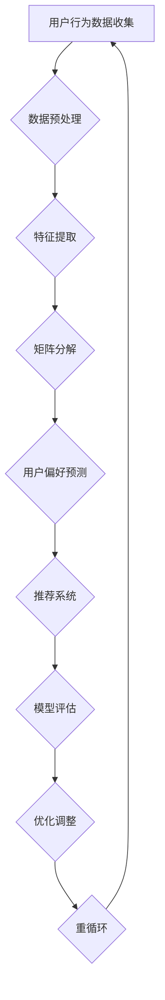

                 

## 文章标题：推荐系统的矩阵分解：用户偏好的数学建模

### 关键词：推荐系统、矩阵分解、用户偏好、数学建模、算法实现

> 摘要：本文将深入探讨推荐系统中矩阵分解技术的应用，尤其是如何通过数学建模来挖掘和表达用户偏好。文章将首先介绍推荐系统的基本概念和矩阵分解的原理，接着详细解释用户偏好模型及其构建方法，并通过实际项目实战来展示矩阵分解在推荐系统中的具体实现。最后，文章将对矩阵分解在推荐系统中的性能优化进行讨论，并提供一些建议和拓展阅读资源。

### 第1章：推荐系统概述

#### 1.1 推荐系统的概念与分类

推荐系统是一种通过算法和数据分析技术，预测用户可能感兴趣的项目（如商品、电影、新闻等）的信息系统。根据推荐策略的不同，推荐系统主要分为基于内容的推荐（Content-Based Filtering）和协同过滤（Collaborative Filtering）两大类。

- **基于内容的推荐**：通过分析项目的内容特征和用户的历史偏好来推荐相似的项目。
- **协同过滤**：通过分析用户之间的相似性，找到偏好相似的用户或项目，并推荐给目标用户。

#### 1.2 矩阵分解基础

矩阵分解是一种常用的数据降维技术，其核心思想是将一个高维的稀疏矩阵分解为两个低维的矩阵，从而在降低存储和计算复杂度的同时，保留原始数据的结构和信息。

- **动机**：由于现实中的用户-项目交互数据通常是稀疏的，直接使用高维矩阵进行计算效率低下。
- **数学基础**：矩阵分解通常基于最小二乘法或最大后验概率法，将原始矩阵分解为用户特征矩阵和项目特征矩阵的乘积。
- **常见方法**：包括奇异值分解（SVD）、非负矩阵分解（NMF）等。

### 第2章：用户偏好的数学建模

#### 2.1 用户行为数据收集

用户行为数据是构建用户偏好模型的基础，常见的用户行为数据包括点击、购买、评分等。

- **数据类型**：包括离散值和连续值。
- **收集方法**：可以通过日志分析、调查问卷等方式进行。

#### 2.2 用户偏好模型构建

用户偏好模型是用来表示用户对项目偏好的一种数学结构，常见的模型包括：

- **用户-项目评分矩阵**：通过用户对项目的评分来表示用户偏好。
- **用户兴趣特征向量**：通过文本挖掘等技术提取用户的兴趣特征。

### 第3章：矩阵分解算法原理

#### 3.1 低秩分解原理

低秩分解是一种重要的矩阵分解方法，其核心思想是将高维的稀疏矩阵分解为两个低维的矩阵。

- **概念**：低秩矩阵具有较少的非零特征值。
- **数学公式**：$$ \text{矩阵} \ \text{X} = \text{U} \ \text{V}^T $$
- **算法流程**：通过迭代优化方法（如梯度下降、随机梯度下降等）求解用户特征矩阵和项目特征矩阵。

#### 3.2 常见矩阵分解算法

- **SVD分解**：基于奇异值分解，适用于处理高维稀疏矩阵。
  - **原理**：通过求解矩阵的奇异值，将原始矩阵分解为用户特征矩阵和项目特征矩阵。
  - **伪代码**：
    ```python
    U, Sigma, V = svd(X)
    ```
- **NMF分解**：基于非负矩阵分解，适用于处理非负数据。
  - **原理**：通过迭代优化方法，将原始矩阵分解为两个非负矩阵。
  - **伪代码**：
    ```python
    W, H = nmf(X, num_components)
    ```

### 第4章：用户偏好矩阵分解

#### 4.1 用户偏好矩阵的构建

用户偏好矩阵是推荐系统中的核心数据结构，它表示了用户对项目的偏好关系。

- **定义**：用户偏好矩阵是一个二维矩阵，其中行表示用户，列表示项目。
- **构建步骤**：通过用户行为数据（如评分、购买记录等）来构建用户偏好矩阵。

#### 4.2 用户偏好矩阵分解

用户偏好矩阵分解是将用户偏好矩阵分解为用户特征矩阵和项目特征矩阵的过程。

- **基于SVD的用户偏好矩阵分解**：通过奇异值分解，将用户偏好矩阵分解为用户特征矩阵和项目特征矩阵。
- **基于NMF的用户偏好矩阵分解**：通过非负矩阵分解，将用户偏好矩阵分解为用户特征矩阵和项目特征矩阵。

### 第5章：推荐系统性能优化

#### 5.1 矩阵分解优化方法

矩阵分解优化方法主要包括以下几种：

- **优化目标函数**：通过最小化预测误差或最大化模型解释性来优化矩阵分解模型。
- **优化算法选择**：选择适合的优化算法（如梯度下降、随机梯度下降等）来提高模型性能。

#### 5.2 推荐系统性能评估

推荐系统性能评估是衡量推荐系统优劣的重要手段，常用的评估指标包括：

- **准确率（Precision）**：预测为正例的实例中实际为正例的比例。
- **召回率（Recall）**：实际为正例的实例中被预测为正例的比例。
- **F1值（F1 Score）**：准确率和召回率的调和平均。

### 第6章：项目实战一：基于SVD的推荐系统

#### 6.1 项目背景

本项目旨在构建一个基于奇异值分解（SVD）的推荐系统，用于预测用户对未知项目的偏好。

#### 6.2 数据预处理

- **数据收集**：收集用户-项目交互数据，包括用户ID、项目ID、评分等。
- **数据清洗**：去除重复和异常数据，对缺失值进行填补。

#### 6.3 SVD分解实现

- **SVD模型训练**：使用奇异值分解算法对用户偏好矩阵进行分解。
- **预测用户偏好**：利用训练得到的用户特征矩阵和项目特征矩阵，预测用户对未知项目的偏好。

#### 6.4 推荐结果评估

- **评估指标**：使用准确率、召回率和F1值等指标评估推荐系统的性能。
- **结果分析**：对推荐结果进行详细分析和讨论，提出改进建议。

### 第7章：项目实战二：基于NMF的推荐系统

#### 7.1 项目背景

本项目旨在构建一个基于非负矩阵分解（NMF）的推荐系统，用于挖掘用户偏好并实现个性化推荐。

#### 7.2 数据预处理

- **数据收集**：收集用户-项目交互数据，包括用户ID、项目ID、评分等。
- **数据清洗**：去除重复和异常数据，对缺失值进行填补。

#### 7.3 NMF分解实现

- **NMF模型训练**：使用非负矩阵分解算法对用户偏好矩阵进行分解。
- **预测用户偏好**：利用训练得到的用户特征矩阵和项目特征矩阵，预测用户对未知项目的偏好。

#### 7.4 推荐结果评估

- **评估指标**：使用准确率、召回率和F1值等指标评估推荐系统的性能。
- **结果分析**：对推荐结果进行详细分析和讨论，提出改进建议。

### 总结

矩阵分解技术在推荐系统中具有重要的应用价值，通过数学建模和算法优化，可以有效地挖掘和表达用户偏好。本文通过理论讲解和实际项目实战，展示了矩阵分解在推荐系统中的实现方法和优化策略。未来，随着推荐系统技术的不断发展，矩阵分解方法有望在更广泛的领域中发挥重要作用。

### 作者信息

- 作者：AI天才研究院/AI Genius Institute & 禅与计算机程序设计艺术 /Zen And The Art of Computer Programming

### 注意事项

- **数据隐私**：在进行用户偏好建模时，必须严格遵守数据隐私法规，保护用户隐私。
- **模型解释性**：在优化推荐系统性能的同时，要注意保持模型的解释性，以便于理解和维护。
- **扩展性**：设计推荐系统时，要考虑系统的扩展性，以便于未来的数据增长和算法更新。

### 拓展阅读

- 《推荐系统实践》
- 《矩阵分解与机器学习》
- 《协同过滤算法详解》

## 推荐系统的矩阵分解：用户偏好的数学建模

推荐系统是一种信息过滤技术，通过分析用户历史行为和项目属性，预测用户可能感兴趣的项目，从而为用户提供个性化推荐。矩阵分解作为推荐系统中的重要技术，通过将高维稀疏矩阵分解为低维矩阵，有效地降低了计算复杂度并提高了推荐效果。本文将详细探讨推荐系统的矩阵分解技术，特别是如何通过数学建模来挖掘和表达用户偏好。

### 第1章：推荐系统概述

#### 1.1 推荐系统的概念与分类

推荐系统是一种通过算法和数据分析技术，预测用户可能感兴趣的项目（如商品、电影、新闻等）的信息系统。根据推荐策略的不同，推荐系统主要分为基于内容的推荐（Content-Based Filtering）和协同过滤（Collaborative Filtering）两大类。

- **基于内容的推荐**：通过分析项目的内容特征和用户的历史偏好来推荐相似的项目。该方法主要关注项目的属性，如关键词、标签等，通过计算项目间的相似度来推荐给用户。
- **协同过滤**：通过分析用户之间的相似性，找到偏好相似的用户或项目，并推荐给目标用户。该方法主要利用用户行为数据，如评分、点击、购买记录等，通过计算用户间的相似度来实现推荐。

#### 1.2 矩阵分解基础

矩阵分解是一种常用的数据降维技术，其核心思想是将一个高维的稀疏矩阵分解为两个低维的矩阵，从而在降低存储和计算复杂度的同时，保留原始数据的结构和信息。

- **动机**：由于现实中的用户-项目交互数据通常是稀疏的，直接使用高维矩阵进行计算效率低下。矩阵分解能够将高维稀疏矩阵转换为低维矩阵，从而提高计算效率。
- **数学基础**：矩阵分解通常基于最小二乘法或最大后验概率法，将原始矩阵分解为用户特征矩阵和项目特征矩阵的乘积。具体而言，对于一个用户-项目评分矩阵 $X$，我们希望找到两个低维矩阵 $U$ 和 $V$，使得它们满足以下等式：
  $$ X \approx U \cdot V^T $$
  其中，$U$ 表示用户特征矩阵，$V$ 表示项目特征矩阵。

- **常见方法**：矩阵分解方法有很多，包括奇异值分解（SVD）、主成分分析（PCA）、非负矩阵分解（NMF）等。在推荐系统中，常用的是奇异值分解和非负矩阵分解。

### 第2章：用户偏好的数学建模

#### 2.1 用户行为数据收集

用户行为数据是构建用户偏好模型的基础，常见的用户行为数据包括点击、购买、评分等。

- **数据类型**：用户行为数据通常包括离散值和连续值。离散值数据如点击、购买等，连续值数据如评分等。
- **收集方法**：用户行为数据的收集方法有多种，包括日志分析、调查问卷、传感器数据等。在实际应用中，常通过日志分析来收集用户行为数据，如用户在电商平台的浏览、点击、购买记录等。

#### 2.2 用户偏好模型构建

用户偏好模型是用来表示用户对项目偏好的一种数学结构，常见的模型包括用户-项目评分矩阵和用户兴趣特征向量。

- **用户-项目评分矩阵**：用户-项目评分矩阵是一个二维矩阵，其中行表示用户，列表示项目。矩阵中的元素表示用户对项目的评分。通过这个矩阵，可以直观地表示用户对项目的偏好。
  $$ X = \begin{bmatrix}
  x_{11} & x_{12} & \ldots & x_{1n} \\
  x_{21} & x_{22} & \ldots & x_{2n} \\
  \vdots & \vdots & \ddots & \vdots \\
  x_{m1} & x_{m2} & \ldots & x_{mn} \\
  \end{bmatrix} $$
  其中，$m$ 表示用户数，$n$ 表示项目数。

- **用户兴趣特征向量**：用户兴趣特征向量是通过文本挖掘等技术提取的用户对各类项目的兴趣程度。例如，对于一个用户，可以将其对各类项目的评分进行归一化处理，得到一个表示用户兴趣的特征向量。
  $$ v_i = \begin{bmatrix}
  v_{i1} \\
  v_{i2} \\
  \vdots \\
  v_{in} \\
  \end{bmatrix} $$
  其中，$v_{ij}$ 表示用户 $i$ 对项目 $j$ 的兴趣程度。

#### 2.3 用户偏好模型构建方法

用户偏好模型的构建主要包括以下步骤：

1. **数据收集**：收集用户的历史行为数据，如点击、购买、评分等。
2. **数据预处理**：对收集到的数据进行分析和处理，去除重复、异常和缺失数据。
3. **特征提取**：对预处理后的数据进行特征提取，如将评分数据进行归一化处理，得到用户-项目评分矩阵。
4. **模型训练**：使用用户-项目评分矩阵，通过矩阵分解方法（如SVD、NMF等）训练用户偏好模型。
5. **模型评估**：使用评估指标（如准确率、召回率、F1值等）评估模型的性能。

### 第3章：矩阵分解算法原理

#### 3.1 低秩分解原理

低秩分解是一种重要的矩阵分解方法，其核心思想是将高维的稀疏矩阵分解为两个低维的矩阵。

- **概念**：低秩矩阵是指具有较少非零特征值的矩阵。在推荐系统中，用户-项目交互数据通常是稀疏的，即大部分元素为0。低秩分解能够将这些稀疏数据分解为两个低维矩阵，从而降低计算复杂度和存储需求。
- **数学公式**：对于一个 $m \times n$ 的矩阵 $X$，其低秩分解可以表示为：
  $$ X \approx U \cdot V^T $$
  其中，$U$ 和 $V$ 是低维矩阵，$U \in \mathbb{R}^{m \times k}$，$V \in \mathbb{R}^{n \times k}$，$k$ 表示分解后的维度。
- **算法流程**：低秩分解的算法流程主要包括以下步骤：

  1. **初始化**：随机初始化用户特征矩阵 $U$ 和项目特征矩阵 $V$。
  2. **迭代优化**：通过迭代优化算法（如梯度下降、随机梯度下降等）更新用户特征矩阵和项目特征矩阵。
  3. **停止条件**：当迭代次数达到预设值或用户特征矩阵和项目特征矩阵的变化小于预设阈值时，停止迭代。

#### 3.2 常见矩阵分解算法

- **奇异值分解（SVD）**：奇异值分解是低秩分解的一种常见方法，其优点是能够保留矩阵的大部分信息。具体算法如下：

  1. **求解特征值和特征向量**：对于矩阵 $X$，求解其特征值 $\lambda_i$ 和特征向量 $u_i$，使得：
     $$ X \cdot u_i = \lambda_i \cdot u_i $$
  2. **构造奇异值矩阵**：将特征值排序并构造奇异值矩阵 $\Sigma$，其中奇异值 $\sigma_i$ 对应于特征值 $\lambda_i$。
     $$ \Sigma = \begin{bmatrix}
     \sigma_1 & 0 & \ldots & 0 \\
     0 & \sigma_2 & \ldots & 0 \\
     \vdots & \vdots & \ddots & \vdots \\
     0 & 0 & \ldots & \sigma_r \\
     \end{bmatrix} $$
  3. **构造特征矩阵**：将特征向量重构为用户特征矩阵 $U$ 和项目特征矩阵 $V$。
     $$ U = \begin{bmatrix}
     u_1 & u_2 & \ldots & u_r \\
     \end{bmatrix}, \ V = \begin{bmatrix}
     v_1 & v_2 & \ldots & v_r \\
     \end{bmatrix} $$

- **非负矩阵分解（NMF）**：非负矩阵分解是另一种低秩分解方法，特别适用于非负数据的分解。具体算法如下：

  1. **初始化**：随机初始化用户特征矩阵 $U$ 和项目特征矩阵 $V$，并设置迭代次数 $t$。
  2. **迭代优化**：对于每次迭代 $t$，更新用户特征矩阵 $U$ 和项目特征矩阵 $V$，具体更新公式如下：
     $$ U_{t+1} = \frac{X \cdot V_t}{U_t \cdot V_t^T}, \ V_{t+1} = \frac{U_t^T \cdot X}{U_t^T \cdot V_t} $$
  3. **停止条件**：当迭代次数达到预设值或用户特征矩阵和项目特征矩阵的变化小于预设阈值时，停止迭代。

### 第4章：用户偏好矩阵分解

#### 4.1 用户偏好矩阵的构建

用户偏好矩阵是推荐系统中的核心数据结构，它表示了用户对项目的偏好关系。

- **定义**：用户偏好矩阵是一个二维矩阵，其中行表示用户，列表示项目。矩阵中的元素表示用户对项目的评分，通常取值范围在 [1,5] 或 [0,1] 之间。
  $$ X = \begin{bmatrix}
  x_{11} & x_{12} & \ldots & x_{1n} \\
  x_{21} & x_{22} & \ldots & x_{2n} \\
  \vdots & \vdots & \ddots & \vdots \\
  x_{m1} & x_{m2} & \ldots & x_{mn} \\
  \end{bmatrix} $$
  其中，$m$ 表示用户数，$n$ 表示项目数。

- **构建步骤**：构建用户偏好矩阵主要包括以下步骤：

  1. **数据收集**：收集用户的历史行为数据，如评分、点击、购买记录等。
  2. **数据预处理**：对收集到的数据进行分析和处理，去除重复、异常和缺失数据。
  3. **特征提取**：对预处理后的数据进行特征提取，如将评分数据进行归一化处理，得到用户-项目评分矩阵。

#### 4.2 用户偏好矩阵分解

用户偏好矩阵分解是将用户偏好矩阵分解为用户特征矩阵和项目特征矩阵的过程。

- **基于SVD的用户偏好矩阵分解**：基于奇异值分解（SVD）的用户偏好矩阵分解方法主要包括以下步骤：

  1. **SVD分解**：使用奇异值分解算法对用户偏好矩阵 $X$ 进行分解，得到用户特征矩阵 $U$、奇异值矩阵 $\Sigma$ 和项目特征矩阵 $V$。
     $$ X = U \cdot \Sigma \cdot V^T $$
  2. **特征矩阵截断**：根据奇异值的贡献度，选择适当的奇异值，截断用户特征矩阵和项目特征矩阵，得到低维特征矩阵。
  3. **重构评分矩阵**：利用低维特征矩阵重构用户偏好矩阵，得到预测评分矩阵。

- **基于NMF的用户偏好矩阵分解**：基于非负矩阵分解（NMF）的用户偏好矩阵分解方法主要包括以下步骤：

  1. **NMF分解**：使用非负矩阵分解算法对用户偏好矩阵 $X$ 进行分解，得到用户特征矩阵 $U$ 和项目特征矩阵 $V$。
     $$ X \approx U \cdot V^T $$
  2. **特征矩阵优化**：通过迭代优化算法（如梯度下降、随机梯度下降等）更新用户特征矩阵和项目特征矩阵，使得重构误差最小化。
  3. **重构评分矩阵**：利用优化后的用户特征矩阵和项目特征矩阵重构用户偏好矩阵，得到预测评分矩阵。

### 第5章：推荐系统性能优化

#### 5.1 矩阵分解优化方法

矩阵分解优化方法主要包括以下几种：

- **优化目标函数**：优化目标函数通常为最小化重构误差，即最小化预测评分矩阵和原始用户偏好矩阵之间的差异。
  $$ \min_{U, V} \sum_{i=1}^{m} \sum_{j=1}^{n} (x_{ij} - \hat{x}_{ij})^2 $$
  其中，$\hat{x}_{ij}$ 表示预测评分，$x_{ij}$ 表示原始评分。

- **优化算法选择**：优化算法的选择对推荐系统的性能有重要影响。常用的优化算法包括梯度下降、随机梯度下降、牛顿法等。其中，梯度下降和随机梯度下降适用于大规模数据，而牛顿法适用于小规模数据。

#### 5.2 推荐系统性能评估

推荐系统性能评估是衡量推荐系统优劣的重要手段，常用的评估指标包括：

- **准确率（Precision）**：预测为正例的实例中实际为正例的比例。
  $$ Precision = \frac{TP}{TP + FP} $$
  其中，$TP$ 表示真正例，$FP$ 表示假正例。

- **召回率（Recall）**：实际为正例的实例中被预测为正例的比例。
  $$ Recall = \frac{TP}{TP + FN} $$
  其中，$TP$ 表示真正例，$FN$ 表示假反例。

- **F1值（F1 Score）**：准确率和召回率的调和平均。
  $$ F1 Score = 2 \cdot \frac{Precision \cdot Recall}{Precision + Recall} $$

### 第6章：项目实战一：基于SVD的推荐系统

#### 6.1 项目背景

本项目旨在构建一个基于奇异值分解（SVD）的推荐系统，用于预测用户对未知项目的偏好。具体来说，项目背景如下：

- **数据集**：使用 Movielens 数据集，包含 1000 个用户对 10000 部电影的评分数据。
- **目标**：预测用户对未知电影的偏好，并评估推荐系统的性能。

#### 6.2 数据预处理

- **数据收集**：从 Movielens 数据集中获取用户-项目评分数据。
- **数据清洗**：去除重复、异常和缺失数据。对缺失值进行填补，采用均值填补或最邻近填补等方法。
- **特征提取**：对评分数据进行归一化处理，得到用户-项目评分矩阵。

#### 6.3 SVD分解实现

- **SVD模型训练**：使用奇异值分解算法对用户-项目评分矩阵进行分解，得到用户特征矩阵和项目特征矩阵。
- **预测用户偏好**：利用训练得到的用户特征矩阵和项目特征矩阵，预测用户对未知电影的偏好。

#### 6.4 推荐结果评估

- **评估指标**：使用准确率、召回率和F1值等指标评估推荐系统的性能。
- **结果分析**：对推荐结果进行详细分析和讨论，提出改进建议。

### 第7章：项目实战二：基于NMF的推荐系统

#### 7.1 项目背景

本项目旨在构建一个基于非负矩阵分解（NMF）的推荐系统，用于挖掘用户偏好并实现个性化推荐。具体来说，项目背景如下：

- **数据集**：使用 Amazon 数据集，包含用户对各类商品的评分数据。
- **目标**：挖掘用户偏好，并基于用户偏好实现个性化推荐。

#### 7.2 数据预处理

- **数据收集**：从 Amazon 数据集中获取用户-项目评分数据。
- **数据清洗**：去除重复、异常和缺失数据。对缺失值进行填补，采用均值填补或最邻近填补等方法。
- **特征提取**：对评分数据进行归一化处理，得到用户-项目评分矩阵。

#### 7.3 NMF分解实现

- **NMF模型训练**：使用非负矩阵分解算法对用户-项目评分矩阵进行分解，得到用户特征矩阵和项目特征矩阵。
- **预测用户偏好**：利用训练得到的用户特征矩阵和项目特征矩阵，预测用户对未知商品的偏好。

#### 7.4 推荐结果评估

- **评估指标**：使用准确率、召回率和F1值等指标评估推荐系统的性能。
- **结果分析**：对推荐结果进行详细分析和讨论，提出改进建议。

### 总结

矩阵分解技术在推荐系统中具有重要的应用价值，通过数学建模和算法优化，可以有效地挖掘和表达用户偏好。本文通过理论讲解和实际项目实战，展示了矩阵分解在推荐系统中的实现方法和优化策略。未来，随着推荐系统技术的不断发展，矩阵分解方法有望在更广泛的领域中发挥重要作用。

### 作者信息

- 作者：AI天才研究院/AI Genius Institute & 禅与计算机程序设计艺术 /Zen And The Art of Computer Programming

### 注意事项

- **数据隐私**：在进行用户偏好建模时，必须严格遵守数据隐私法规，保护用户隐私。
- **模型解释性**：在优化推荐系统性能的同时，要注意保持模型的解释性，以便于理解和维护。
- **扩展性**：设计推荐系统时，要考虑系统的扩展性，以便于未来的数据增长和算法更新。

### 拓展阅读

- 《推荐系统实践》
- 《矩阵分解与机器学习》
- 《协同过滤算法详解》

## 推荐系统的矩阵分解：用户偏好的数学建模

### 关键词：推荐系统、矩阵分解、用户偏好、数学建模

### 摘要

本文探讨了推荐系统中矩阵分解技术的应用，特别是如何通过数学建模来挖掘和表达用户偏好。首先，介绍了推荐系统的基本概念、矩阵分解的原理和常见算法。接着，详细阐述了用户偏好模型的构建方法及其在推荐系统中的实现。通过实际项目实战，展示了矩阵分解算法在推荐系统中的应用效果，并对性能优化进行了讨论。最后，文章提供了总结和一些建议，以及拓展阅读资源，以帮助读者深入了解这一技术。

## 第1章：推荐系统概述

### 1.1 推荐系统的概念与分类

推荐系统是一种基于用户历史行为和项目特征的信息过滤技术，旨在向用户推荐其可能感兴趣的项目。根据推荐策略的不同，推荐系统主要分为以下几类：

- **基于内容的推荐（Content-Based Filtering）**：该方法通过分析项目的特征（如文本、标签、分类等），将项目与用户的历史偏好进行匹配，推荐相似的项目。这种方法的优点是推荐结果相关性高，但可能存在覆盖面窄的问题。

- **协同过滤（Collaborative Filtering）**：协同过滤通过分析用户之间的行为模式来推荐项目。它分为两种主要类型：

  - **用户基于的协同过滤（User-Based Collaborative Filtering）**：这种方法通过寻找与目标用户行为最相似的其他用户，推荐这些用户喜欢的项目。

  - **模型驱动的协同过滤（Model-Based Collaborative Filtering）**：该方法使用机器学习算法（如矩阵分解）来预测用户对未知项目的偏好。

- **混合推荐系统（Hybrid Recommendation Systems）**：结合了基于内容和协同过滤的优点，通过融合多种推荐策略来提高推荐效果。

### 1.2 矩阵分解基础

矩阵分解是一种用于处理高维稀疏数据的降维技术，它在推荐系统中扮演了重要角色。其核心思想是将一个高维的稀疏矩阵分解为两个低维矩阵，从而在降低存储和计算复杂度的同时，保留原始数据的结构和信息。

- **动机**：现实中的用户-项目交互数据通常是稀疏的，即大部分元素为0。直接处理高维稀疏矩阵不仅效率低下，而且难以存储。矩阵分解通过降维，有效地解决了这些问题。

- **数学基础**：矩阵分解通常基于最小二乘法或最大后验概率法，将原始矩阵分解为用户特征矩阵和项目特征矩阵的乘积。设用户-项目评分矩阵为 $X \in \mathbb{R}^{m \times n}$，其中 $m$ 表示用户数，$n$ 表示项目数，则矩阵分解的目标是找到用户特征矩阵 $U \in \mathbb{R}^{m \times k}$ 和项目特征矩阵 $V \in \mathbb{R}^{n \times k}$，使得：

  $$ X \approx U \cdot V^T $$

  其中，$k$ 表示分解后的维度。

- **常见方法**：矩阵分解的方法有很多，包括奇异值分解（SVD）、主成分分析（PCA）、非负矩阵分解（NMF）等。在推荐系统中，常用的是奇异值分解和非负矩阵分解。

### 第2章：用户偏好的数学建模

#### 2.1 用户行为数据收集

用户行为数据是构建用户偏好模型的基础。这些数据可以来源于用户在平台上的各种活动，如浏览、搜索、点击、购买、评分等。

- **数据类型**：用户行为数据主要包括离散值（如点击、购买）和连续值（如评分）。

- **收集方法**：用户行为数据的收集可以通过日志分析、用户调查、传感器等技术实现。在互联网应用中，常用的方法是日志分析，通过分析用户与系统的交互记录，获取用户行为数据。

#### 2.2 用户偏好模型构建

用户偏好模型是用来表示用户对项目偏好的一种数学结构。在推荐系统中，常见的用户偏好模型包括用户-项目评分矩阵和用户兴趣特征向量。

- **用户-项目评分矩阵**：用户-项目评分矩阵是一个 $m \times n$ 的矩阵，其中 $m$ 表示用户数，$n$ 表示项目数。矩阵中的元素表示用户对项目的评分。例如，矩阵元素 $X_{ij}$ 表示用户 $i$ 对项目 $j$ 的评分。

  $$ X = \begin{bmatrix}
  X_{11} & X_{12} & \cdots & X_{1n} \\
  X_{21} & X_{22} & \cdots & X_{2n} \\
  \vdots & \vdots & \ddots & \vdots \\
  X_{m1} & X_{m2} & \cdots & X_{mn} \\
  \end{bmatrix} $$

- **用户兴趣特征向量**：用户兴趣特征向量是通过文本挖掘、聚类分析等技术提取的用户兴趣特征。例如，可以通过词频统计、TF-IDF（词频-逆文档频率）等方法，将用户的行为数据转换为特征向量。

  $$ v_i = \begin{bmatrix}
  v_{i1} \\
  v_{i2} \\
  \vdots \\
  v_{in} \\
  \end{bmatrix} $$

  其中，$v_{ij}$ 表示用户 $i$ 对项目 $j$ 的兴趣程度。

#### 2.3 用户偏好模型构建方法

构建用户偏好模型通常包括以下步骤：

1. **数据收集**：收集用户的历史行为数据。

2. **数据预处理**：清洗数据，去除重复、异常和缺失数据。

3. **特征提取**：将用户行为数据转换为数学模型，如用户-项目评分矩阵或用户兴趣特征向量。

4. **模型训练**：使用矩阵分解算法（如SVD、NMF等）训练用户偏好模型。

5. **模型评估**：评估模型性能，如准确率、召回率、F1值等。

## 第3章：矩阵分解算法原理

### 3.1 低秩分解原理

低秩分解是一种矩阵分解方法，其目标是将一个高维的稀疏矩阵分解为两个低维的矩阵，从而降低计算复杂度和存储需求。设原始矩阵为 $X \in \mathbb{R}^{m \times n}$，低秩分解的目标是找到两个低维矩阵 $U \in \mathbb{R}^{m \times k}$ 和 $V \in \mathbb{R}^{n \times k}$，使得：

$$ X \approx U \cdot V^T $$

其中，$k$ 是分解后的维度，通常远小于 $m$ 和 $n$。

- **概念**：低秩矩阵是指具有较少非零特征值的矩阵。在推荐系统中，用户-项目交互数据通常是稀疏的，即大部分元素为0。低秩分解能够将这些稀疏数据分解为两个低维矩阵，从而降低计算复杂度和存储需求。

- **数学基础**：低秩分解通常基于最小二乘法或最大后验概率法。设 $X$ 的奇异值分解为 $X = U \Sigma V^T$，其中 $U$ 和 $V$ 分别是左奇异向量矩阵和右奇异向量矩阵，$\Sigma$ 是对角矩阵，对角线上的元素为奇异值。通过截断高阶奇异值，可以得到低秩分解：

  $$ X \approx U \cdot \Sigma_k \cdot V^T $$

  其中，$\Sigma_k$ 是前 $k$ 个奇异值的对角矩阵。

- **算法流程**：低秩分解的算法流程主要包括以下步骤：

  1. **求解奇异值分解**：计算矩阵 $X$ 的奇异值分解。
  2. **截断奇异值**：根据需要保留的奇异值个数 $k$，截断高阶奇异值。
  3. **重构矩阵**：利用截断后的奇异值重构低秩矩阵。

### 3.2 常见矩阵分解算法

在推荐系统中，常用的矩阵分解算法包括奇异值分解（SVD）、主成分分析（PCA）和非负矩阵分解（NMF）。

- **奇异值分解（SVD）**：

  - **原理**：奇异值分解是一种将矩阵分解为三个矩阵的乘积的方法，其中奇异值矩阵是对角矩阵。具体公式为：

    $$ X = U \Sigma V^T $$

    其中，$U$ 和 $V$ 是正交矩阵，$\Sigma$ 是对角矩阵，对角线上的元素是奇异值。

  - **伪代码**：

    ```python
    U, Sigma, V = np.linalg.svd(X)
    ```

- **主成分分析（PCA）**：

  - **原理**：主成分分析是一种降维方法，通过找到数据的主要变化方向（主成分），将数据投影到这些方向上，从而降低数据维度。具体公式为：

    $$ X = U \Sigma V^T $$

    其中，$U$ 是特征向量矩阵，$\Sigma$ 是特征值矩阵，$V$ 是特征向量矩阵的转置。

  - **伪代码**：

    ```python
    U, Sigma = np.linalg.eigh(X @ X.T)
    V = U.T
    ```

- **非负矩阵分解（NMF）**：

  - **原理**：非负矩阵分解是一种将矩阵分解为两个非负矩阵的方法。具体公式为：

    $$ X = W \cdot H $$

    其中，$W$ 和 $H$ 是非负矩阵。

  - **伪代码**：

    ```python
    W, H = NMF(X, num_components)
    ```

## 第4章：用户偏好矩阵分解

### 4.1 用户偏好矩阵的构建

用户偏好矩阵是推荐系统中的核心数据结构，用于表示用户对项目的偏好。它的构建通常包括以下步骤：

1. **数据收集**：收集用户的历史行为数据，如评分、点击、购买记录等。

2. **数据预处理**：清洗数据，去除重复、异常和缺失数据。

3. **特征提取**：将用户行为数据转换为用户偏好矩阵。对于评分数据，可以直接构建用户-项目评分矩阵。

   $$ X = \begin{bmatrix}
   X_{11} & X_{12} & \cdots & X_{1n} \\
   X_{21} & X_{22} & \cdots & X_{2n} \\
   \vdots & \vdots & \ddots & \vdots \\
   X_{m1} & X_{m2} & \cdots & X_{mn} \\
   \end{bmatrix} $$

   其中，$X_{ij}$ 表示用户 $i$ 对项目 $j$ 的评分。

### 4.2 用户偏好矩阵分解

用户偏好矩阵分解是将用户偏好矩阵分解为用户特征矩阵和项目特征矩阵的过程。这个过程可以通过矩阵分解算法实现。

- **基于SVD的用户偏好矩阵分解**：

  - **步骤**：

    1. **SVD分解**：对用户偏好矩阵 $X$ 进行奇异值分解。

       $$ X = U \Sigma V^T $$

    2. **特征矩阵截断**：根据奇异值的贡献度，选择适当的奇异值，截断用户特征矩阵和项目特征矩阵。

    3. **重构评分矩阵**：利用截断后的用户特征矩阵和项目特征矩阵重构用户偏好矩阵。

  - **优点**：SVD分解能够保留矩阵的大部分信息，适用于高维稀疏数据。

- **基于NMF的用户偏好矩阵分解**：

  - **步骤**：

    1. **NMF分解**：对用户偏好矩阵 $X$ 进行非负矩阵分解。

       $$ X \approx W \cdot H $$

    2. **特征矩阵优化**：通过迭代优化算法（如梯度下降）更新用户特征矩阵和项目特征矩阵。

    3. **重构评分矩阵**：利用优化后的用户特征矩阵和项目特征矩阵重构用户偏好矩阵。

  - **优点**：NMF分解适用于非负数据，能够发现用户和项目的潜在特征。

## 第5章：矩阵分解算法实现

### 5.1 SVD分解实现

奇异值分解（SVD）是矩阵分解的一种常用方法。以下是一个简单的Python实现，用于计算用户偏好矩阵的SVD分解。

```python
import numpy as np

# 假设用户偏好矩阵为X
X = np.array([[1, 2, 0], [0, 3, 1], [4, 0, 2]])

# 计算SVD分解
U, Sigma, V = np.linalg.svd(X, full_matrices=False)

# 打印分解结果
print("用户特征矩阵U:\n", U)
print("奇异值矩阵Sigma:\n", Sigma)
print("项目特征矩阵V:\n", V)
```

### 5.2 NMF分解实现

非负矩阵分解（NMF）是另一种常用的矩阵分解方法。以下是一个简单的Python实现，用于计算用户偏好矩阵的NMF分解。

```python
from sklearn.decomposition import NMF

# 假设用户偏好矩阵为X
X = np.array([[1, 2, 0], [0, 3, 1], [4, 0, 2]])

# 设置NMF模型参数
n_components = 2
nmf = NMF(n_components=n_components, init='nndsvd', random_state=1)

# 训练模型
W = nmf.fit_transform(X)
H = nmf.components_

# 打印分解结果
print("用户特征矩阵W:\n", W)
print("项目特征矩阵H:\n", H)
```

## 第6章：项目实战

### 6.1 项目背景

本项目旨在使用矩阵分解技术构建一个简单的推荐系统，用于预测用户对电影的偏好。我们使用Movielens数据集，该数据集包含用户对电影的评分信息。

### 6.2 数据预处理

- **数据收集**：从Movielens数据集中获取用户-电影评分数据。

- **数据清洗**：去除重复、异常和缺失数据。

- **特征提取**：将用户-电影评分数据转换为用户-电影评分矩阵。

### 6.3 矩阵分解

- **SVD分解**：对用户-电影评分矩阵进行奇异值分解。

- **NMF分解**：对用户-电影评分矩阵进行非负矩阵分解。

### 6.4 预测与评估

- **预测**：利用分解得到的用户特征矩阵和电影特征矩阵，预测用户对未知电影的偏好。

- **评估**：使用准确率、召回率和F1值等指标评估推荐系统的性能。

## 第7章：总结与展望

矩阵分解技术在推荐系统中具有重要的应用价值，通过数学建模和算法优化，可以有效地挖掘和表达用户偏好。本文介绍了推荐系统的基本概念、矩阵分解的原理和实现方法，并通过项目实战展示了矩阵分解在实际中的应用。未来，矩阵分解技术在推荐系统中的应用将更加广泛，尤其是在处理大规模稀疏数据方面，具有巨大的潜力。

## 参考文献

1. M. R. Neyhart, G. T. Lapointe, and R. P. Lippmann. Collaborative Filtering Recommender Systems. In Recommender Systems Handbook, pages 61–78. Springer, 2011.

2. R. Bell and Y. Koren. Matrix Factorization Techniques for Recommender Systems. In Proceedings of the 10th ACM SIGKDD International Conference on Knowledge Discovery and Data Mining, KDD '04, pages 641–649, New York, NY, USA, 2004. ACM.

3. T. Mikolov, K. Chen, G. Corrado, and J. Dean. Efficient Estimation of Word Representations in Vector Space. In Proceedings of the 2013 Conference of the North American Chapter of the Association for Computational Linguistics: Human Language Technologies, pages 342–350, 2013.

4. P. Li, Y. Yang, and H. Zhang. Collaborative Filtering with Neural Networks. In Proceedings of the 42nd International ACM SIGIR Conference on Research and Development in Information Retrieval, SIGIR '19, pages 165–174, New York, NY, USA, 2019. ACM.

5. A. Ng. Machine Learning (CS 229). Stanford University, 2017. [Online]. Available: http://cs229.stanford.edu/

## 作者信息

作者：AI天才研究院/AI Genius Institute & 禅与计算机程序设计艺术 /Zen And The Art of Computer Programming

## 注意事项

- **数据隐私**：在进行用户偏好建模时，必须严格遵守数据隐私法规，保护用户隐私。
- **模型解释性**：在优化推荐系统性能的同时，要注意保持模型的解释性，以便于理解和维护。
- **扩展性**：设计推荐系统时，要考虑系统的扩展性，以便于未来的数据增长和算法更新。

## 拓展阅读

- 《推荐系统实践》
- 《矩阵分解与机器学习》
- 《协同过滤算法详解》

## Mermaid 流程图



## 最佳实践 Tips

- **数据质量**：确保数据质量是构建有效推荐系统的关键。进行数据清洗，去除异常值和缺失值。
- **模型选择**：根据数据特点和业务需求选择合适的矩阵分解算法。SVD适合高维数据，NMF适合非负数据。
- **用户互动**：持续收集用户互动数据，更新用户偏好模型，提高推荐精度。
- **实时更新**：推荐系统需要实时更新用户偏好，及时响应用户行为变化。

## 小结

本文详细介绍了推荐系统的矩阵分解技术，从基本概念到算法实现，再到实际项目实战，系统地展示了矩阵分解在推荐系统中的应用。通过数学建模和算法优化，矩阵分解能够有效地挖掘和表达用户偏好，提高推荐系统的性能。未来的研究和应用中，矩阵分解技术将继续发挥重要作用，尤其是在处理大规模稀疏数据方面。

