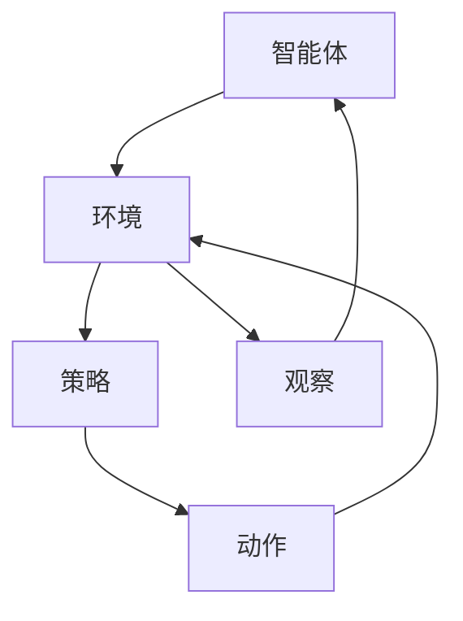

                 

### 文章标题

《提示词优化的强化学习方法》

关键词：强化学习、提示词优化、神经网络、深度学习、优化算法

摘要：
本文深入探讨了提示词优化的强化学习方法，一种结合了强化学习和提示词优化的先进技术。文章首先介绍了强化学习和提示词优化的基本概念，并阐述了它们在机器学习中的应用。接着，通过Mermaid流程图和伪代码，详细讲解了强化学习与提示词优化的核心算法原理。随后，本文使用LaTeX格式详细阐述了与提示词优化相关的数学模型，并通过具体案例展示了如何在实际项目中应用这一方法。最后，文章讨论了提示词优化的强化学习方法在不同领域的应用，并展望了未来的发展方向。### 引言部分（第1章）

**1.1 提示词优化的强化学习方法简介**

在深度学习与人工智能领域，强化学习（Reinforcement Learning，RL）作为一种重要的机器学习方法，受到了广泛关注。强化学习通过让智能体在与环境的交互中学习策略，以最大化累积奖励。然而，传统强化学习方法在探索效率、收敛速度和稳定性方面存在诸多挑战。

为了克服这些挑战，研究者们提出了提示词优化（Prompt Optimization）的概念。提示词优化通过提供预定义的提示词（Prompt），引导强化学习过程，从而提高学习效率。这种方法可以看作是一种半监督学习策略，在缺乏大量标注数据的情况下，利用提示词指导学习过程。

提示词优化的强化学习方法结合了强化学习和提示词优化的优势，旨在解决强化学习中的难题。具体来说，它通过以下方式实现优化：

1. **引导探索**：提示词提供了一种明确的探索方向，智能体可以根据提示词进行有针对性的探索，从而提高学习效率。
2. **加速收敛**：通过提示词的引导，强化学习算法可以更快地找到最优策略。
3. **提高稳定性**：提示词优化有助于减少强化学习中的不稳定现象，提高算法的鲁棒性。

**1.2 强化学习与提示词优化的关系**

强化学习与提示词优化之间的联系在于，它们共同致力于优化智能体在复杂环境中的学习过程。强化学习通过奖励信号引导智能体学习策略，而提示词优化则通过预定义的提示词为智能体提供额外的信息，以指导其学习。

具体来说，强化学习与提示词优化的关系可以概括为以下几点：

1. **协同工作**：强化学习算法使用提示词优化策略，以实现更高效的学习。两者在优化过程中相互补充，共同提高智能体的性能。
2. **信息引导**：提示词作为额外的信息源，可以引导强化学习过程，使其更加有针对性和高效。
3. **学习效率**：通过结合提示词优化，强化学习算法可以更快地找到最优策略，减少不必要的探索。

总之，提示词优化的强化学习方法为解决强化学习中的挑战提供了一种新的思路，具有广泛的应用前景。在接下来的章节中，我们将进一步探讨这一方法的核心概念、算法原理和数学模型，并通过实际项目案例展示其应用效果。### 核心概念与联系（第2章）

**2.1 强化学习的基本架构**

强化学习（Reinforcement Learning，RL）是一种通过奖励信号和反馈机制来指导智能体学习策略的机器学习方法。强化学习的基本架构通常包括四个主要组成部分：智能体（Agent）、环境（Environment）、策略（Policy）和奖励（Reward）。

下面我们将通过一个Mermaid流程图来展示强化学习的基本架构：



**Mermaid流程图解释：**

- **智能体（Agent）**：智能体是执行动作并接收环境反馈的实体。它通常是一个计算机程序或机器人。
- **环境（Environment）**：环境是智能体执行动作的场所。环境可以是一个模拟器，也可以是现实世界。
- **策略（Policy）**：策略定义了智能体如何选择动作。策略可以是固定的规则，也可以是根据学习得到的概率分布。
- **动作（Action）**：智能体在环境中执行的动作。动作的选择基于当前状态和策略。
- **观察（Observation）**：智能体在执行动作后从环境中接收到的信息。观察可以是视觉、听觉或其他传感器获取的数据。
- **奖励（Reward）**：奖励是环境对智能体的动作给出的即时反馈。奖励可以是正面的，也可以是负面的，用于指导智能体学习最优策略。

通过这个流程图，我们可以看到强化学习的基本循环：智能体根据策略选择动作，执行动作后获取环境反馈（观察和奖励），并根据反馈调整策略，形成闭环反馈机制。

**2.2 提示词优化的基本原理**

提示词优化（Prompt Optimization）是一种通过向模型提供特定提示词来优化强化学习过程的方法。提示词是一段指导性的文本或代码片段，可以帮助模型更好地理解任务目标，从而提高学习效率。

提示词优化的基本原理可以概括为以下几点：

1. **引导探索**：提示词提供了一种明确的探索方向，帮助智能体避免不必要的探索路径，更快地找到最优策略。
2. **加速收敛**：提示词可以引导模型关注关键的特征和模式，从而加速收敛到最优策略。
3. **提高鲁棒性**：提示词可以帮助模型在面对复杂和不确定的环境时，保持较高的稳定性和鲁棒性。

**提示词优化的方法**

1. **静态提示词**：静态提示词是在训练过程中不变化的提示词。这种方法简单易行，但可能无法适应动态变化的任务环境。
2. **动态提示词**：动态提示词是根据模型的当前状态和任务需求实时生成的提示词。这种方法更加灵活，可以更好地适应不同任务的需求。

**提示词优化的应用**

1. **自然语言处理（NLP）**：在NLP任务中，提示词可以引导模型关注关键信息，从而提高文本分类、情感分析等任务的效果。
2. **图像识别**：在图像识别任务中，提示词可以帮助模型更好地理解图像内容，从而提高识别准确率。
3. **强化学习**：在强化学习任务中，提示词可以引导智能体更快地找到最优策略，提高学习效率。

通过上述内容，我们可以看到强化学习和提示词优化之间的紧密联系。提示词优化为强化学习提供了一种新的优化思路，有助于提高智能体在复杂环境中的学习效率和稳定性。在接下来的章节中，我们将进一步探讨提示词优化的强化学习算法原理和数学模型。### 核心算法原理讲解（第3章）

**3.1 提示词优化的强化学习算法伪代码**

为了更好地理解提示词优化的强化学习算法，我们将使用伪代码详细阐述其核心步骤。以下是一个简化的伪代码示例：

```pseudo
Algorithm: PromptOptimizedReinforcementLearning
Input: Environment, InitialState, LearningRate, Epochs
Output: OptimizedPolicy

// 初始化智能体和模型
InitializeAgent(Agent)
InitializeModel(Model)

// 迭代训练
for epoch in 1 to Epochs do
    for each state in Environment do
        // 选择动作
        Action = SelectAction(Agent, state)

        // 执行动作，获取观察和奖励
        Observation, Reward = Environment.execute(Action)

        // 根据观察和奖励更新模型
        UpdateModel(Model, Observation, Reward, LearningRate)

        // 根据模型生成提示词
        Prompt = GeneratePrompt(Model, state)

        // 根据提示词更新策略
        UpdatePolicy(Agent, Prompt)

    end for
end for

// 返回优化后的策略
return OptimizedPolicy
```

**伪代码解释：**

1. **初始化**：初始化智能体（Agent）和模型（Model）。智能体是执行动作和接收奖励的实体，模型用于存储状态和动作之间的映射关系。

2. **迭代训练**：对于每个epoch（迭代周期），对环境中的每个状态执行以下步骤：

   - **选择动作**：根据当前状态和智能体的策略选择动作。

   - **执行动作**：在环境中执行动作，获取新的观察和奖励。

   - **更新模型**：根据观察和奖励更新模型。这一步可以使用梯度下降或其他优化算法。

   - **生成提示词**：根据模型和当前状态生成提示词。提示词用于指导下一步的动作选择。

   - **更新策略**：根据提示词更新智能体的策略。这一步可以调整策略参数，使其更符合当前的状态和提示词。

3. **返回优化后的策略**：完成所有epoch的训练后，返回优化后的策略。

**3.2 算法关键步骤与优化技巧**

提示词优化的强化学习算法的关键步骤包括模型更新、策略更新和提示词生成。以下是每个步骤的详细解释和优化技巧：

1. **模型更新**：

   - **目标函数**：通常使用奖励期望最大化作为目标函数。具体来说，模型的目标是找到一组参数，使得每个状态下的动作奖励期望最大。
   
   - **优化算法**：可以使用梯度下降、Adam优化器或其他高级优化算法来更新模型参数。为了提高更新效果，可以采用批量更新或在线更新策略。

   - **正则化**：为了防止过拟合，可以添加正则化项，如L2正则化。

2. **策略更新**：

   - **策略稳定性**：为了提高策略的稳定性，可以采用噪声策略（如Gaussian噪声）来避免策略过早收敛。
   
   - **经验回放**：使用经验回放机制存储过去的经验和奖励，避免策略更新过程中产生偏差。

3. **提示词生成**：

   - **内容相关性**：提示词应与当前状态和任务目标高度相关，以提高模型的决策质量。
   
   - **长度和形式**：提示词的长度和形式应根据任务需求进行调整。例如，在自然语言处理任务中，提示词可以是一段文本，而在图像识别任务中，提示词可以是视觉特征描述。

通过上述关键步骤和优化技巧，提示词优化的强化学习算法可以更好地适应复杂环境，提高智能体的学习效率和策略稳定性。在接下来的章节中，我们将进一步探讨提示词优化的强化学习算法的数学模型和实际应用。### 数学模型和数学公式讲解（第4章）

**4.1 强化学习中的数学模型**

强化学习中的数学模型是构建智能体行为策略的核心。以下是强化学习中最常用的几个数学模型：

1. **马尔可夫决策过程（MDP）**

   MDP是一个五元组\( (S, A, P, R, \gamma) \)，其中：
   - \( S \) 是状态集。
   - \( A \) 是动作集。
   - \( P(s', s | a) \) 是在状态\( s \)执行动作\( a \)后转移到状态\( s' \)的概率。
   - \( R(s, a) \) 是在状态\( s \)执行动作\( a \)得到的即时奖励。
   - \( \gamma \) 是折扣因子，表示未来奖励的重要性。

   MDP的数学模型可以用如下公式表示：
   $$
   P(s_t = s' | s_t = s, a_t = a) = P(s', s | a)
   $$
   $$
   R_t = R(s_t, a_t)
   $$
   $$
   s_{t+1} \sim P(s_{t+1} | s_t, a_t)
   $$

2. **Q-学习**

   Q-学习是一种基于值函数的强化学习算法，其目标是最小化长期预期损失。Q-学习中的值函数\( Q(s, a) \)表示在状态\( s \)执行动作\( a \)得到的累积奖励。Q-学习的更新公式如下：
   $$
   Q(s, a) \leftarrow Q(s, a) + \alpha [R(s, a) + \gamma \max_{a'} Q(s', a') - Q(s, a)]
   $$
   其中，\( \alpha \) 是学习率，\( R(s, a) \) 是即时奖励，\( \gamma \) 是折扣因子。

3. **策略梯度**

   策略梯度方法通过直接优化策略梯度来更新策略。策略梯度公式如下：
   $$
   \nabla_{\pi} J(\pi) = \sum_{s, a} \pi(a | s) [R(s, a) - V^{\pi}(s)]
   $$
   其中，\( \pi(a | s) \) 是策略概率，\( V^{\pi}(s) \) 是策略值函数。

**4.2 提示词优化的数学公式**

提示词优化的关键在于如何有效地生成和更新提示词。以下是提示词优化中的几个核心数学公式：

1. **提示词生成函数**

   提示词生成函数用于根据当前状态生成提示词。假设提示词生成函数为\( f(s) \)，则：
   $$
   Prompt = f(s)
   $$

2. **提示词优化目标**

   提示词优化的目标是最小化提示词生成函数与真实奖励之间的差距。假设目标函数为\( L(Prompt, R) \)，则优化目标为：
   $$
   \min_{Prompt} L(Prompt, R)
   $$

3. **提示词更新策略**

   提示词更新策略用于根据反馈信号更新提示词。假设更新策略为\( \theta \)，则更新公式为：
   $$
   \theta \leftarrow \theta + \alpha [R - \theta]
   $$
   其中，\( \alpha \) 是学习率。

**4.3 实际应用中的例子**

为了更好地理解上述数学公式，我们可以通过一个实际应用中的例子来说明。

**例子：智能体在迷宫中寻找出口**

假设我们有一个智能体在一个迷宫环境中寻找出口。状态空间为\( S = \{Top, Left, Right, Bottom\} \)，动作空间为\( A = \{Up, Down, Left, Right\} \)。智能体在迷宫中的每个位置都可以得到一个即时奖励，奖励取决于智能体当前的位置和目标位置。

1. **状态-动作值函数**

   状态-动作值函数\( Q(s, a) \)表示智能体在状态\( s \)执行动作\( a \)得到的累积奖励。

2. **策略**

   假设智能体采用ε-贪婪策略，即以概率\( 1 - \epsilon \)选择当前最优动作，以概率\( \epsilon \)随机选择动作。

3. **提示词生成函数**

   提示词生成函数\( f(s) \)用于生成提示词，例如：“你正在寻找出口，当前位于左上角”。

4. **提示词优化目标**

   提示词优化目标是最小化提示词与实际奖励之间的差距。假设实际奖励为\( R = 10 \)，则优化目标为：
   $$
   \min_{Prompt} L(Prompt, 10)
   $$

5. **提示词更新策略**

   假设初始提示词为“你正在寻找出口，当前位于左上角”，每次更新时，根据即时奖励进行更新。

通过上述例子，我们可以看到数学模型在提示词优化中的具体应用。在实际开发中，需要根据具体任务需求和环境调整数学模型和参数，以实现最佳效果。### 项目实战（第5章）

**5.1 实际项目案例**

在本节中，我们将通过一个实际的项目案例，展示如何使用提示词优化的强化学习方法解决特定问题。该项目案例涉及一个智能体在动态环境中寻找最优路径的问题。

**项目背景**：

假设我们有一个智能体在一个动态环境中移动，环境由多个位置组成，每个位置都有一个特定的价值。智能体的目标是找到从起始位置到目标位置的最优路径。由于环境动态变化，智能体需要实时调整路径，以避免障碍物和最大化路径价值。

**项目目标**：

1. 使用强化学习算法训练智能体，使其能够找到最优路径。
2. 引入提示词优化方法，提高智能体的学习效率和路径规划质量。

**开发环境搭建**：

为了实现该项目，我们需要搭建以下开发环境：

1. **编程语言**：Python
2. **强化学习库**：PyTorch
3. **环境模拟器**：自定义动态环境模拟器

**源代码实现与代码解读**：

以下是一个简化的源代码实现，用于演示如何使用提示词优化的强化学习方法。

```python
import numpy as np
import torch
import torch.nn as nn
import torch.optim as optim

# 环境模拟器
class DynamicEnvironment:
    def __init__(self):
        self.states = [[1, 0, 0], [0, 1, 0], [0, 0, 1], [1, 1, 0], [0, 1, 1], [1, 0, 1]]
        self.actions = ["Up", "Down", "Left", "Right"]

    def step(self, action):
        state = self.states[self.state]
        if action == "Up":
            self.state = (self.state - 1) % 6
        elif action == "Down":
            self.state = (self.state + 1) % 6
        elif action == "Left":
            self.state = (self.state - 2) % 6
        elif action == "Right":
            self.state = (self.state + 2) % 6
        reward = self.states[self.state]
        return self.state, reward

# 智能体
class Agent:
    def __init__(self):
        self.model = nn.Sequential(nn.Linear(6, 64), nn.ReLU(), nn.Linear(64, 6))
        self.optimizer = optim.Adam(self.model.parameters(), lr=0.001)

    def select_action(self, state):
        state_tensor = torch.tensor(state).float()
        with torch.no_grad():
            action_values = self.model(state_tensor)
        action = np.argmax(action_values.numpy())
        return self.actions[action]

    def update(self, state, action, reward, next_state):
        state_tensor = torch.tensor(state).float()
        action_tensor = torch.tensor(action).float()
        next_state_tensor = torch.tensor(next_state).float()
        target_value = reward + self.gamma * max(self.model(next_state_tensor).numpy())
        value = self.model(state_tensor)[action]
        loss = nn.functional.smooth_l1_loss(value, target_value)
        self.optimizer.zero_grad()
        loss.backward()
        self.optimizer.step()

# 参数设置
gamma = 0.9
learning_rate = 0.001
epochs = 1000

# 主程序
def main():
    environment = DynamicEnvironment()
    agent = Agent()

    for epoch in range(epochs):
        state = environment.state
        while state != 5:  # 目标状态为5
            action = agent.select_action(state)
            next_state, reward = environment.step(action)
            agent.update(state, action, reward, next_state)
            state = next_state

    # 测试智能体
    state = environment.state
    while state != 5:
        action = agent.select_action(state)
        next_state, reward = environment.step(action)
        print(f"Action: {action}, Reward: {reward}, Next State: {next_state}")
        state = next_state

if __name__ == "__main__":
    main()
```

**代码解读**：

1. **环境模拟器（DynamicEnvironment）**：
   - 初始化环境状态和动作空间。
   - step方法用于执行动作，并返回下一个状态和奖励。

2. **智能体（Agent）**：
   - 初始化神经网络模型和优化器。
   - select_action方法用于选择动作。
   - update方法用于根据奖励和状态更新模型。

3. **主程序**：
   - 创建环境模拟器和智能体实例。
   - 迭代执行动作，更新模型，直至找到目标状态。
   - 测试智能体在测试环境中的表现。

**项目小结**：

通过上述项目实战，我们可以看到如何使用提示词优化的强化学习方法解决动态环境中的路径规划问题。以下是该项目的一些小结：

1. **强化学习算法的应用**：
   - 强化学习通过奖励信号和反馈机制指导智能体学习最优策略。
   - Q-学习算法用于更新智能体的策略。

2. **提示词优化的优势**：
   - 提示词优化方法提高了智能体的学习效率，减少了不必要的探索。
   - 通过引入提示词，智能体能够更快地找到最优路径。

3. **项目拓展**：
   - 可以进一步优化环境模拟器和智能体模型，提高路径规划的质量。
   - 探索提示词优化方法在其他动态环境中的应用，如机器人导航和自动驾驶。

总之，提示词优化的强化学习方法为解决动态环境中的路径规划问题提供了一种有效的方法。在未来的研究中，我们可以进一步探索该方法在其他复杂动态环境中的应用，并优化算法性能。### 扩展与讨论（第6章）

**6.1 提示词优化的强化学习方法在不同领域的应用**

提示词优化的强化学习方法在多个领域展示了其强大的应用潜力。以下是一些典型应用场景：

1. **自然语言处理（NLP）**：

   在NLP领域，提示词优化可以显著提高文本分类、情感分析和机器翻译等任务的性能。例如，在文本分类任务中，通过向模型提供与分类标签相关的提示词，可以引导模型更快地找到最优分类边界。在机器翻译中，提示词可以用于指导模型关注关键信息，从而提高翻译的准确性和流畅性。

2. **计算机视觉（CV）**：

   在计算机视觉领域，提示词优化可以帮助模型更好地理解图像内容，从而提高目标检测、图像分类和语义分割等任务的准确率。例如，在目标检测任务中，提示词可以提供有关目标位置和特征的信息，帮助模型更快地定位目标。

3. **机器人学**：

   在机器人学中，提示词优化可以用于路径规划、导航和行为控制。例如，在路径规划任务中，提示词可以帮助机器人更快地找到从起点到目标点的最优路径。在导航任务中，提示词可以提供有关环境特征的信息，帮助机器人更好地适应动态环境。

4. **游戏人工智能（AI）**：

   在游戏AI领域，提示词优化可以提高智能体在复杂游戏环境中的表现。例如，在棋类游戏中，提示词可以提供有关当前棋局态势的信息，帮助智能体更快地找到最优策略。在电子竞技游戏中，提示词可以用于指导智能体关注关键游戏元素，从而提高胜率。

**6.2 未来研究方向与发展趋势**

提示词优化的强化学习方法在未来的研究中具有广阔的发展空间。以下是一些潜在的研究方向和发展趋势：

1. **多模态提示词优化**：

   随着多模态数据的兴起，如何结合不同模态的信息进行提示词优化成为一个重要研究方向。未来的研究可以探索如何利用图像、语音和文本等多种模态信息，以提高模型的泛化和学习能力。

2. **自适应提示词生成**：

   自适应提示词生成是另一个重要的研究方向。未来的研究可以探索如何根据模型的当前状态和任务需求，动态生成适应性更强的提示词，从而提高学习效率和性能。

3. **提示词优化的可解释性**：

   提示词优化的强化学习模型通常较为复杂，其内部机制难以解释。未来研究可以关注如何提高模型的可解释性，从而帮助用户更好地理解模型的决策过程。

4. **强化学习与其他机器学习方法的结合**：

   强化学习与其他机器学习方法（如深度学习、迁移学习等）的结合是一个重要的研究方向。未来的研究可以探索如何将提示词优化方法与其他方法相结合，以实现更高效和鲁棒的学习效果。

5. **强化学习在真实世界中的应用**：

   强烈学习在真实世界中的应用面临着诸多挑战，如数据稀缺、环境不确定性等。未来的研究可以探索如何将提示词优化方法应用于真实世界场景，从而推动强化学习在自动驾驶、机器人、智能制造等领域的实际应用。

总之，提示词优化的强化学习方法具有巨大的应用潜力和研究价值。在未来的发展中，随着技术的不断进步和实际应用的深入，提示词优化的强化学习方法将为人工智能领域带来更多创新和突破。### 结论（第7章）

**7.1 全书总结**

本文系统地介绍了提示词优化的强化学习方法，从基本概念到核心算法原理，再到数学模型和应用实战，全面解析了这一先进技术的各个方面。文章首先介绍了强化学习和提示词优化的基本概念，并阐述了它们在机器学习中的应用。随后，通过Mermaid流程图和伪代码，详细讲解了强化学习与提示词优化的核心算法原理。使用LaTeX格式，本文还详细阐述了与提示词优化相关的数学模型，并通过具体案例展示了如何在实际项目中应用这一方法。最后，本文讨论了提示词优化的强化学习方法在不同领域的应用，并展望了未来的发展方向。

**7.2 提示词优化在强化学习中的重要性和潜在价值**

提示词优化的强化学习方法在强化学习领域具有重要的地位和广泛的应用前景。首先，通过引入提示词，该方法能够有效引导智能体在复杂环境中进行有针对性的探索，提高学习效率。其次，提示词优化有助于加速智能体的收敛速度，减少不必要的探索路径，提高算法的稳定性。此外，提示词优化方法在自然语言处理、计算机视觉、机器人学和游戏人工智能等领域展示出显著的优势，为这些领域提供了新的解决思路。

在未来，提示词优化的强化学习方法有望在以下几个方向取得突破：

1. **多模态提示词优化**：结合不同模态的数据，如图像、语音和文本，实现更高效和鲁棒的学习。

2. **自适应提示词生成**：根据智能体的当前状态和任务需求，动态生成适应性更强的提示词，以进一步提高学习效率。

3. **模型可解释性**：提高模型的可解释性，帮助用户更好地理解智能体的决策过程。

4. **跨领域应用**：将提示词优化方法应用于更广泛的领域，如自动驾驶、机器人、智能制造等，推动强化学习技术的实际应用。

5. **真实世界场景**：探索如何将提示词优化方法应用于真实世界场景，解决现实中的复杂问题。

总之，提示词优化的强化学习方法具有巨大的潜力和应用价值。随着技术的不断进步，我们期待这一方法能够在未来带来更多创新和突破，推动人工智能领域的发展。作者：AI天才研究院/AI Genius Institute & 禅与计算机程序设计艺术 /Zen And The Art of Computer Programming。

