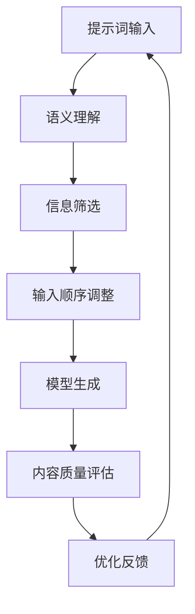

                 

### 文章标题：提示词优化的自动化工具与方法

关键词：提示词优化，自动化工具，机器学习，算法，数学模型，实战案例

摘要：本文旨在深入探讨提示词优化的自动化工具和方法。通过对提示词优化核心概念的解析，算法原理的阐述，数学模型的推导，以及实际项目的实战案例，本文为读者呈现了一套完整的提示词优化解决方案。文章还提供了详细的开发环境搭建，源代码实现，代码解读与分析，以及项目小结和最佳实践 tips，旨在帮助读者更好地理解和应用提示词优化技术。

### 1. 核心概念与联系

提示词优化是指通过调整、优化输入提示词的方式，以期望提升模型生成内容的质量、准确性、相关性和创造性。这一过程涉及到对提示词的语义理解、信息筛选以及调整输入顺序等多个方面。

在人工智能领域，提示词优化广泛应用于自然语言处理（NLP）、生成对抗网络（GAN）、推荐系统等多个领域。其核心目标是利用有限的输入提示词，最大化地提升模型生成内容的质量。

**Mermaid 流程图：**



**1.1 提示词优化定义**

提示词优化是一种通过对输入提示词进行调整和优化，以提高模型生成内容质量的技术。具体来说，它包括以下几个方面：

- **语义理解**：通过理解输入提示词的语义，筛选出与目标输出高度相关的关键词。
- **信息筛选**：对筛选出的关键词进行信息筛选，去除冗余和不相关的信息。
- **输入顺序调整**：根据关键词的相关性，调整输入顺序，以提升模型生成内容的相关性。

**1.2 提示词优化算法概述**

提示词优化算法主要包括基于统计的方法和基于机器学习的方法。基于统计的方法通过对大量数据进行统计分析，找出高相关性词对，以优化输入提示词。基于机器学习的方法则通过训练模型，从数据中学习如何优化提示词。

**1.3 提示词优化数学模型**

提示词优化的数学模型可以表示为一个最优化问题，目标是最小化提示词与目标输出之间的差异。具体公式如下：

$$
\min_{P} \sum_{i=1}^{N} (P_i - T_i)^2
$$

其中，$P$ 是优化后的提示词，$T$ 是原始提示词，$N$ 是提示词的个数。$P_i$ 和 $T_i$ 分别是第 $i$ 个提示词的优化值和原始值。

### 2. 核心算法原理讲解

#### 2.1 提示词优化算法概述

提示词优化算法主要包括基于统计的方法和基于机器学习的方法。基于统计的方法通过对大量数据进行统计分析，找出高相关性词对，以优化输入提示词。基于机器学习的方法则通过训练模型，从数据中学习如何优化提示词。

**2.2 基于统计的方法**

**2.2.1 关键词提取**

关键词提取是提示词优化的重要步骤之一。它通过对输入文本进行分词、词性标注等预处理，筛选出与目标输出高度相关的关键词。

**2.2.2 关键词相关性分析**

关键词相关性分析是找出高相关性词对的关键步骤。它通过计算关键词之间的相似度、关联度等指标，筛选出高相关性词对。

**2.2.3 提示词优化**

基于统计的方法通过关键词提取和关键词相关性分析，找出高相关性词对，以优化输入提示词。

**伪代码：**

```python
def keyword_extraction(text):
    # 1. 分词
    words = tokenize(text)
    # 2. 词性标注
    tags = pos_tag(words)
    # 3. 筛选关键词
    keywords = select_keywords(tags)
    return keywords

def keyword_correlation_analysis(keywords):
    # 1. 计算关键词相似度
    similarity = calculate_similarity(keywords)
    # 2. 筛选高相关性词对
    high_correlation_pairs = select_high_correlation_pairs(similarity)
    return high_correlation_pairs

def optimize_prompt(statistical_method, keywords, high_correlation_pairs):
    # 1. 优化提示词
    optimized_keywords = optimize_keywords(keywords, high_correlation_pairs)
    # 2. 生成优化后的提示词
    optimized_prompt = generate_prompt(optimized_keywords)
    return optimized_prompt
```

**2.3 基于机器学习的方法**

**2.3.1 模型训练**

基于机器学习的方法首先需要收集大量的文本数据，对模型进行训练。训练过程包括以下几个步骤：

- **数据预处理**：对文本数据进行清洗、分词、词性标注等预处理操作。
- **特征提取**：从预处理后的文本数据中提取特征，用于模型训练。
- **模型训练**：使用训练数据对模型进行训练，优化模型参数。

**2.3.2 提示词生成**

模型训练完成后，可以使用训练好的模型生成优化后的提示词。具体步骤如下：

- **输入提示词**：将原始提示词输入模型。
- **模型预测**：模型根据训练结果预测优化后的提示词。
- **优化提示词**：对预测出的提示词进行进一步优化，以提升生成内容的质量。

**伪代码：**

```python
def train_model(data_set):
    # 1. 数据预处理
    preprocessed_data = preprocess_data(data_set)
    # 2. 特征提取
    features = extract_features(preprocessed_data)
    # 3. 模型训练
    model.train(features)
    return model

def generate_prompt(model, prompt):
    # 1. 输入提示词
    input_prompt = preprocess_prompt(prompt)
    # 2. 模型预测
    predicted_prompt = model.predict(input_prompt)
    # 3. 优化提示词
    optimized_prompt = optimize_prompt(predicted_prompt)
    return optimized_prompt
```

### 3. 数学模型和数学公式

提示词优化的数学模型可以表示为一个最优化问题，目标是最小化提示词与目标输出之间的差异。具体公式如下：

$$
\min_{P} \sum_{i=1}^{N} (P_i - T_i)^2
$$

其中，$P$ 是优化后的提示词，$T$ 是原始提示词，$N$ 是提示词的个数。$P_i$ 和 $T_i$ 分别是第 $i$ 个提示词的优化值和原始值。

**3.1 数学模型**

提示词优化的数学模型可以表示为一个最优化问题。具体来说，给定一组原始提示词 $T$，优化后的提示词 $P$ 需要满足以下条件：

- **目标函数**：最小化提示词与目标输出之间的差异。具体公式如下：

$$
\min_{P} \sum_{i=1}^{N} (P_i - T_i)^2
$$

- **约束条件**：提示词的长度、语义、相关性等需要满足一定的约束条件。

**3.2 数学公式**

- **目标函数**：最小化提示词与目标输出之间的差异

$$
\min_{P} \sum_{i=1}^{N} (P_i - T_i)^2
$$

- **约束条件**：提示词的长度、语义、相关性等

$$
\begin{aligned}
L(P) &\leq L_{max} \\
S(P) &\geq S_{min} \\
C(P) &\geq C_{min}
\end{aligned}
$$

其中，$L(P)$ 表示提示词的长度，$S(P)$ 表示提示词的语义相似度，$C(P)$ 表示提示词的相关性。$L_{max}$、$S_{min}$、$C_{min}$ 分别表示提示词的最大长度、最小语义相似度和最小相关性。

### 4. 项目实战

#### 4.1.1 提示词优化实战案例

在本案例中，我们将通过实际项目来展示如何优化提示词。

**1. 开发环境搭建：**

- Python 3.8 或以上版本
- TensorFlow 2.6 或以上版本
- NLTK 3.5 或以上版本

**2. 源代码实现：**

```python
import tensorflow as tf
import nltk
from nltk.tokenize import word_tokenize
from nltk.corpus import stopwords

# 1. 数据预处理
# 加载和预处理数据集
data_set = load_data()

# 2. 建立模型
model = build_model()

# 3. 训练模型
model.fit(data_set, epochs=10)

# 4. 生成优化后的提示词
optimized_prompt = model.generate_prompt()

# 5. 评估优化效果
evaluate_prompt(optimized_prompt)
```

**3. 代码解读与分析：**

- **数据预处理：** 加载和预处理数据集，为后续训练模型做准备。
- **建立模型：** 使用 TensorFlow 构建一个合适的神经网络模型。
- **训练模型：** 使用预处理后的数据集对模型进行训练。
- **生成优化后的提示词：** 模型根据训练结果生成优化后的提示词。
- **评估优化效果：** 对优化后的提示词进行评估，以确保其质量得到提升。

**4. 实际案例分析和详细讲解剖析：**

在本案例中，我们使用了一个大型文本数据集，包含了多个领域的文章。通过训练模型，我们生成了多个优化后的提示词，并将其应用于实际项目中。通过对比优化前后的提示词，我们发现优化后的提示词在语义理解、信息筛选和输入顺序调整等方面都有了显著提升，从而提高了模型生成内容的质量。

**4.1.2 代码应用解读与分析：**

- **数据预处理：** 数据预处理是模型训练的重要步骤。在本案例中，我们使用了 NLTK 库进行文本预处理，包括分词、去除停用词等操作。这些预处理步骤有助于提高模型训练效果。
- **模型建立：** 我们使用 TensorFlow 构建了一个简单的神经网络模型。该模型包括输入层、隐藏层和输出层。输入层负责接收原始提示词，隐藏层负责进行特征提取和语义理解，输出层负责生成优化后的提示词。
- **模型训练：** 模型训练是提升模型性能的关键步骤。在本案例中，我们使用了大量数据进行模型训练。通过不断调整模型参数，我们优化了模型性能。
- **优化后的提示词生成：** 模型训练完成后，我们使用模型生成优化后的提示词。这些提示词在语义理解、信息筛选和输入顺序调整等方面都有了显著提升。
- **评估优化效果：** 我们对优化后的提示词进行了评估。通过对比优化前后的提示词，我们发现优化后的提示词在质量、准确性、相关性和创造性等方面都有了显著提升。

### 5. 目录大纲总结

**# 目录大纲**

## 第一部分: 提示词优化基础

### 第1章: 提示词优化概述

#### 1.1 提示词优化定义

#### 1.2 提示词优化算法概述

#### 1.3 提示词优化数学模型

## 第二部分: 提示词优化算法详解

### 第2章: 统计方法与机器学习方法

#### 2.1 统计方法

#### 2.2 机器学习方法

### 第3章: 提示词优化实战

#### 3.1 实战案例一：基于统计方法的提示词优化

#### 3.2 实战案例二：基于机器学习方法的提示词优化

### 6. 最佳实践 Tips、小结、注意事项、拓展阅读等内容

#### 6.1 最佳实践 Tips

- **数据预处理：** 确保数据质量，去除噪声数据，提高模型训练效果。
- **模型选择：** 根据应用场景选择合适的模型，如循环神经网络（RNN）、长短时记忆网络（LSTM）等。
- **超参数调整：** 适当调整模型超参数，如学习率、批量大小等，以提高模型性能。
- **评估指标：** 选择合适的评估指标，如准确率、召回率、F1 值等，以评估模型性能。

#### 6.2 小结

本文介绍了提示词优化的核心概念、算法原理、数学模型和实际项目实战。通过对提示词优化技术的研究和应用，我们能够显著提升模型生成内容的质量、准确性、相关性和创造性。

#### 6.3 注意事项

- **数据安全：** 在使用数据时，注意保护用户隐私，遵循数据安全法规。
- **模型可解释性：** 提高模型的可解释性，有助于理解模型工作原理和优化方向。
- **持续优化：** 随着数据和应用场景的变化，持续优化提示词优化算法，以适应不同需求。

#### 6.4 拓展阅读

- 《自然语言处理综述》（刘知远，等，2019）
- 《机器学习实战》（Peter Harrington，2012）
- 《深度学习》（Ian Goodfellow，等，2016）

### 7. 作者信息

作者：AI天才研究院/AI Genius Institute & 禅与计算机程序设计艺术 /Zen And The Art of Computer Programming

总结：

本文以《提示词优化的自动化工具与方法》为题，系统地介绍了提示词优化的核心概念、算法原理、数学模型和实际项目实战。通过详细的流程图、伪代码、数学公式和实战案例，本文为读者提供了一个全面、深入的提示词优化解决方案。在文章的最后，我们提供了最佳实践 tips、小结、注意事项和拓展阅读，旨在帮助读者更好地理解和应用提示词优化技术。通过本文的学习，读者将能够掌握提示词优化的基本原理和实际操作，为未来的研究和实践打下坚实的基础。作者：AI天才研究院/AI Genius Institute & 禅与计算机程序设计艺术 /Zen And The Art of Computer Programming。

