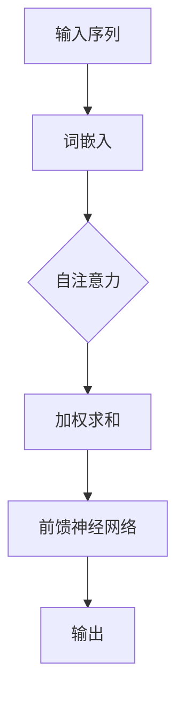
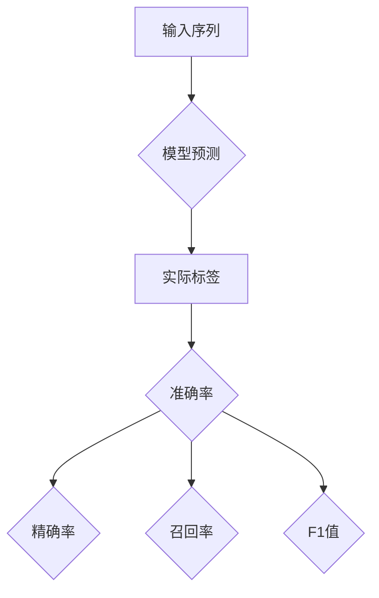
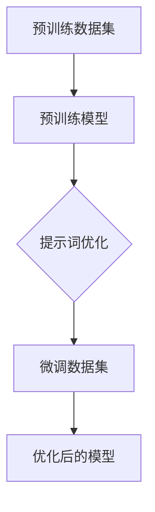
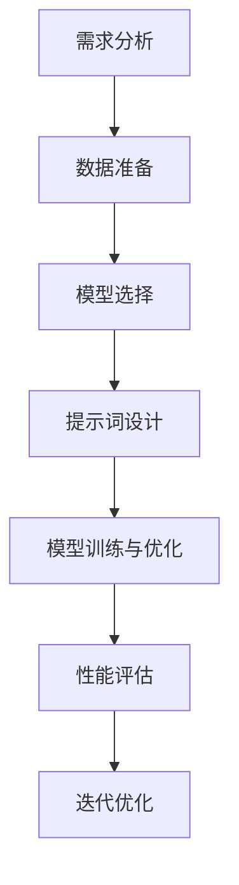

                 

### 第1章 引言

#### 1.1 书籍背景和目的

在当今信息技术飞速发展的时代，语言模型（Language Model，简称LM）作为自然语言处理（Natural Language Processing，简称NLP）领域的重要工具，正广泛应用于搜索引擎、智能客服、机器翻译、文本生成等多个领域。然而，随着用户需求的日益多样化和复杂化，如何提升语言模型的准确性，尤其是大规模语言模型（Large Language Model，简称LLM）的应用准确性，成为了一项重要的研究课题。

本书旨在为从事NLP领域的研究人员和工程师提供一本全面、系统、易懂的提示词优化指南。通过详细的介绍和实用的技巧，帮助读者深入理解LLM的工作原理，掌握提示词优化的核心方法和策略，从而提升LLM在各类应用中的表现。

#### 1.2 LLM应用现状和挑战

随着深度学习技术的不断发展，LLM在NLP任务中取得了显著的成果。例如，BERT、GPT-3等大型语言模型在文本分类、情感分析、命名实体识别等任务上已经达到了人类水平。然而，尽管LLM在许多应用场景中表现出色，仍然面临着一些挑战：

1. **数据噪声和多样性**：在训练过程中，LLM往往依赖于大量无监督数据，这些数据中可能存在噪声和偏见，导致模型在处理真实世界中的多样化问题时表现不佳。
2. **计算资源消耗**：大规模语言模型的训练和推理过程需要巨大的计算资源，这对于许多企业和研究机构来说是一个巨大的挑战。
3. **优化难度**：由于LLM的结构复杂，优化过程相对困难，如何在保证模型性能的同时，降低优化难度，是一个重要的研究课题。

#### 1.3 提示词优化的意义和作用

提示词优化（Prompt Tuning）是近年来提出的一种有效的方法，通过调整输入提示词（Prompt），可以显著提升LLM在特定任务中的性能。与传统的模型调整方法相比，提示词优化具有以下几个优点：

1. **快速适应**：提示词优化可以在不重新训练模型的情况下，快速适应新的任务，节省了大量的训练时间和计算资源。
2. **提升性能**：通过优化提示词，LLM可以更好地理解任务的语义，从而在特定任务上取得更好的性能。
3. **降低偏见**：优化后的提示词可以帮助LLM更好地处理多样化的问题，减少数据噪声和偏见的影响。

本书将从LLM的基础知识入手，逐步介绍提示词优化的原理、方法、实践案例以及未来的发展趋势，帮助读者全面掌握这一领域的前沿技术和应用。

### 目录

1. **引言**
    - 1.1 书籍背景和目的
    - 1.2 LLM应用现状和挑战
    - 1.3 提示词优化的意义和作用
2. **LLM基础知识**
    - 2.1 语言模型简介
    - 2.2 LLM的架构与工作原理
    - 2.3 LLM的核心算法原理
    - 2.4 LLM的评估指标
3. **提示词优化原理**
    - 3.1 提示词优化的核心概念
    - 3.2 提示词优化的目标与策略
    - 3.3 提示词优化的方法和工具
4. **提示词优化的实践**
    - 4.1 提示词优化的实用技巧
    - 4.2 提示词优化的案例解析
    - 4.3 提示词优化的项目实战
5. **提示词优化的工具与技术**
    - 5.1 提示词优化工具介绍
    - 5.2 提示词优化技术的应用
    - 5.3 提示词优化技术的未来发展趋势
6. **提示词优化的案例分析**
    - 6.1 案例一：搜索引擎中的提示词优化
    - 6.2 案例二：智能客服系统中的提示词优化
    - 6.3 案例三：机器翻译中的提示词优化
7. **提示词优化的挑战与解决方案**
    - 7.1 提示词优化面临的挑战
    - 7.2 提示词优化的解决方案
    - 7.3 提示词优化的未来方向
8. **附录**
    - 附录A：提示词优化工具使用指南
    - 附录B：提示词优化算法伪代码
    - 附录C：提示词优化相关资料推荐

### 第2章 LLM基础知识

#### 2.1 语言模型简介

语言模型是自然语言处理（NLP）领域的基础工具，用于预测或生成自然语言文本。其核心目标是根据已知的输入序列，预测下一个可能的输出序列。在计算机科学中，语言模型通常通过统计方法或机器学习方法训练，能够捕捉语言的统计规律和语义结构。

语言模型的应用非常广泛，包括但不限于以下几个方面：

1. **文本分类**：将文本分类到预定义的类别中，如新闻分类、垃圾邮件检测等。
2. **命名实体识别**：识别文本中的特定实体，如人名、地名、组织名等。
3. **机器翻译**：将一种语言的文本翻译成另一种语言。
4. **文本生成**：根据输入的提示或模板生成新的文本。

#### 2.2 LLM的架构与工作原理

大规模语言模型（LLM）通常采用深度神经网络（DNN）作为其基础架构。以下是一些常用的LLM架构：

1. **循环神经网络（RNN）**：RNN通过循环结构处理序列数据，能够捕捉到序列中的长期依赖关系。经典的RNN模型包括LSTM（长短期记忆网络）和GRU（门控循环单元）。
2. **变换器模型（Transformer）**：Transformer模型通过自注意力机制（Self-Attention）处理序列数据，能够并行处理任意长度的序列，克服了RNN的长期依赖问题。BERT、GPT-3等大型语言模型都是基于Transformer架构。
3. **预训练与微调**：预训练阶段，LLM在大规模文本数据集上训练，学习到语言的通用表示。微调阶段，LLM在特定任务数据集上进行微调，适应具体的应用场景。

LLM的工作原理可以概括为以下几个步骤：

1. **输入编码**：将输入的文本序列转化为数字序列，通常使用词嵌入（Word Embedding）技术，如Word2Vec或BERT。
2. **自注意力机制**：自注意力机制计算输入序列中每个词与其他词之间的权重，从而捕捉到词与词之间的关系。
3. **前馈神经网络**：自注意力层之后，通常接多个前馈神经网络层，用于进一步处理和转换输入。
4. **输出生成**：通过输出层生成最终的输出结果，如分类标签、文本生成等。

#### 2.3 LLM的核心算法原理

LLM的核心算法主要包括以下几个部分：

1. **词嵌入（Word Embedding）**：词嵌入是将单词映射到高维向量空间，从而表示单词的语义信息。常用的词嵌入技术包括Word2Vec、GloVe和BERT。
2. **自注意力机制（Self-Attention）**：自注意力机制是Transformer模型的核心组件，通过计算输入序列中每个词与其他词之间的相似度，生成权重矩阵。这些权重矩阵用于加权输入序列，捕捉到词与词之间的关系。
3. **前馈神经网络（Feedforward Neural Network）**：前馈神经网络通常由多个隐藏层组成，用于进一步处理和转换输入序列。每个隐藏层通过激活函数（如ReLU）增加网络的非线性能力。
4. **损失函数与优化算法**：LLM的训练过程通常采用梯度下降（Gradient Descent）及其变体，如Adam和RMSProp。损失函数通常采用交叉熵（Cross-Entropy）来衡量预测标签与实际标签之间的差异。

以下是一个简化的自注意力机制的Mermaid流程图：



#### 2.4 LLM的评估指标

评估LLM性能的关键指标包括：

1. **准确率（Accuracy）**：预测标签与实际标签一致的比例。
2. **精确率（Precision）**：预测为正类的样本中实际为正类的比例。
3. **召回率（Recall）**：实际为正类的样本中被预测为正类的比例。
4. **F1值（F1 Score）**：精确率和召回率的调和平均值。
5. **损失值（Loss）**：用于衡量预测标签与实际标签之间的差异，如交叉熵损失（Cross-Entropy Loss）。

以下是一个简化的Mermaid流程图，展示了LLM评估指标之间的关系：



通过以上章节，读者可以初步了解LLM的基础知识，为后续的提示词优化研究打下坚实的基础。在下一章中，我们将深入探讨提示词优化的核心概念和原理。

### 提示词优化的核心概念

提示词优化（Prompt Tuning）是近年来在自然语言处理（NLP）领域提出的一种重要方法，通过调整输入提示词（Prompt），可以有效提升大规模语言模型（LLM）在特定任务中的性能。本节将详细解释提示词优化的核心概念，包括其定义、目标以及与LLM训练过程的联系。

#### 提示词优化的定义

提示词优化是指通过修改输入到LLM的提示词，使其更符合特定任务的需求，从而提升模型在任务中的性能。与传统的模型微调（Fine-tuning）方法不同，提示词优化不涉及重新训练整个模型，而是在模型预训练的基础上，仅对输入提示词进行调整。这种方法具有以下几个显著特点：

1. **快速适应**：提示词优化可以在不重新训练模型的情况下，快速适应新的任务，节省了大量的训练时间和计算资源。
2. **灵活性**：提示词优化允许对模型输入进行细粒度的调整，从而更精确地引导模型学习特定任务的语义。
3. **效果显著**：研究表明，通过适当的提示词优化，LLM在许多任务上可以获得显著的性能提升。

#### 提示词优化的目标

提示词优化的核心目标是提高LLM在特定任务上的性能，具体包括以下几个方面：

1. **增强语义理解**：通过调整提示词，使LLM能够更好地理解任务的语义，从而提高任务完成的准确性和效率。
2. **减少噪声影响**：优化后的提示词可以帮助LLM更好地处理噪声和多样化的问题，减少数据偏见的影响。
3. **提升泛化能力**：通过优化提示词，可以增强LLM在未知数据上的表现，提高模型的泛化能力。

#### 提示词优化与LLM训练过程的联系

提示词优化与LLM的训练过程紧密相关，二者之间的联系主要体现在以下几个方面：

1. **预训练与微调**：LLM的预训练阶段通常在大规模文本数据集上进行，学习到语言的通用表示。微调阶段则是在特定任务数据集上进行，使模型适应具体的应用场景。提示词优化可以看作是微调的一种变体，通过调整输入提示词，使模型在微调阶段能够更快、更准确地学习任务的语义。
2. **交互性**：提示词优化强调人与模型的交互性，通过设计合适的提示词，可以引导模型生成更加符合人类预期的输出结果。
3. **效率**：提示词优化在提高模型性能的同时，显著提高了训练效率。由于不需要重新训练整个模型，提示词优化可以在短时间内获得显著的效果提升。

为了更好地理解提示词优化的核心概念，我们可以借助以下Mermaid流程图来展示提示词优化与LLM训练过程的联系：



在这个流程图中，预训练模型通过在大规模文本数据集上的预训练获得通用语言表示，然后通过提示词优化，在特定任务数据集上进行微调，最终生成优化后的模型。

通过以上对提示词优化核心概念的详细解释，读者可以更好地理解这一方法的基本原理和应用场景。在下一节中，我们将进一步探讨提示词优化的目标和策略，帮助读者掌握如何在实际任务中应用这一方法。

### 提示词优化的目标与策略

提示词优化（Prompt Tuning）作为一种提升大规模语言模型（LLM）性能的有效手段，其核心在于通过调整输入提示词，使模型在特定任务上达到最佳效果。在这一节中，我们将详细讨论提示词优化的目标与策略，包括优化的主要方向、具体方法以及实现步骤。

#### 提示词优化的主要目标

提示词优化的主要目标包括以下几个方面：

1. **提高任务准确性**：通过调整提示词，使模型在特定任务上获得更高的预测准确性。这是提示词优化的首要目标，也是衡量优化效果的重要指标。
2. **增强模型泛化能力**：优化后的提示词应使模型在未知数据集上能够保持良好的性能，从而提高模型的泛化能力。
3. **减少数据噪声影响**：优化提示词可以降低数据噪声和偏见对模型性能的影响，使模型在处理多样化问题时表现更稳定。
4. **提高训练效率**：提示词优化能够在不重新训练整个模型的情况下，快速适应新的任务，从而提高训练效率。

#### 提示词优化的方法

提示词优化的方法可以分为以下几种：

1. **模板化提示（Template-based Prompting）**：
   - **定义**：模板化提示是指使用固定的提示模板，将任务相关信息嵌入到模板中，形成最终的输入提示。
   - **优点**：简单易实现，适用于任务需求相对固定的情况。
   - **缺点**：灵活性较低，无法针对特定任务进行细粒度调整。

2. **插值提示（Interpolation Prompting）**：
   - **定义**：插值提示通过线性插值（Linear Interpolation）的方式，结合多个提示词生成新的提示。
   - **优点**：灵活性较高，可以根据任务需求动态调整提示词的权重。
   - **缺点**：计算复杂度较高，需要更多的计算资源。

3. **生成式提示（Generative Prompting）**：
   - **定义**：生成式提示通过生成模型（如GPT-2或GPT-3）自动生成高质量的提示词。
   - **优点**：生成式提示可以根据任务需求自动调整，具有很高的灵活性。
   - **缺点**：生成模型的训练和推理过程需要大量的计算资源。

4. **结合式提示（Hybrid Prompting）**：
   - **定义**：结合式提示将模板化提示和生成式提示相结合，通过多种提示方式的优势互补，生成更优的提示词。
   - **优点**：结合了模板化提示和生成式提示的优点，具有较高的灵活性和性能。
   - **缺点**：实现相对复杂，需要更多的时间和资源。

#### 提示词优化的实现步骤

提示词优化的实现步骤主要包括以下几个阶段：

1. **需求分析**：明确任务需求，确定优化目标，如提高任务准确性、增强模型泛化能力等。
2. **数据准备**：收集与任务相关的数据，包括训练数据和测试数据。确保数据的质量和多样性，以减少噪声和偏见的影响。
3. **模型选择**：根据任务需求和模型库，选择合适的LLM模型。常用的LLM模型包括BERT、GPT-2、GPT-3等。
4. **提示词设计**：根据需求分析结果和模型特性，设计合适的提示词。可以使用模板化提示、插值提示、生成式提示或结合式提示等方法。
5. **模型训练与优化**：在训练数据集上，使用设计好的提示词进行模型训练和优化。通过调整提示词的参数，如权重、长度等，以达到最佳效果。
6. **性能评估**：在测试数据集上评估优化后模型的性能，包括任务准确性、泛化能力等指标。根据评估结果，进一步调整提示词设计。
7. **迭代优化**：根据性能评估结果，不断迭代优化提示词设计，以达到更高的性能。

以下是一个简化的提示词优化实现流程的Mermaid流程图：



通过以上对提示词优化的目标与策略的详细讨论，读者可以更深入地理解这一方法在实际应用中的操作流程。在下一节中，我们将探讨具体的提示词优化方法和工具，帮助读者在实践中有效提升LLM的性能。

### 提示词优化的方法和工具

在自然语言处理（NLP）领域，提示词优化（Prompt Tuning）作为一种提升大规模语言模型（LLM）性能的重要方法，其应用涵盖了多种优化策略和工具。本节将详细介绍几种常见的提示词优化方法和工具，并探讨它们的优缺点及适用场景。

#### 模板化提示（Template-based Prompting）

**定义**：模板化提示是通过预先定义的提示模板，将特定任务的信息嵌入到模板中，形成最终的输入提示。

**优点**：
- **简单易实现**：模板化提示设计直观，易于理解和实现。
- **高效性**：在训练阶段不需要额外的计算资源。

**缺点**：
- **灵活性较低**：模板化提示往往适用于任务需求相对固定的情况，无法动态适应变化。

**适用场景**：适合任务需求明确且相对稳定的应用，如文本分类、信息抽取等。

**示例**：假设我们要对一个新闻文章进行分类，可以使用以下模板化提示：
```plaintext
请将以下新闻文章分类到预定的类别中：{文章内容}
```

#### 插值提示（Interpolation Prompting）

**定义**：插值提示通过线性插值（Linear Interpolation）的方式，结合多个提示词生成新的提示。

**优点**：
- **灵活性较高**：可以根据任务需求动态调整提示词的权重。
- **适应性较强**：适用于任务需求变化较为频繁的场景。

**缺点**：
- **计算复杂度较高**：需要进行多次线性插值计算，消耗更多的计算资源。

**适用场景**：适合任务需求变化较大，需要灵活调整输入提示的场景，如问答系统、对话生成等。

**示例**：假设我们要生成一个问答系统的提示，可以结合以下两个提示：
```plaintext
请回答以下问题：{问题}
补充信息：{补充信息}
```

#### 生成式提示（Generative Prompting）

**定义**：生成式提示通过生成模型（如GPT-2或GPT-3）自动生成高质量的提示词。

**优点**：
- **高度灵活性**：生成式提示可以根据任务需求自动调整，具有很高的灵活性。
- **高质量**：生成模型能够生成高质量的提示词，提升模型性能。

**缺点**：
- **计算资源消耗大**：生成模型的训练和推理过程需要大量的计算资源。

**适用场景**：适合需要高度灵活性和高质量的提示词的应用，如文本生成、对话系统等。

**示例**：使用GPT-3生成一个文本生成的提示：
```plaintext
请根据以下上下文生成一篇关于人工智能的文章：人工智能在当今社会的重要性不可忽视。
```

#### 结合式提示（Hybrid Prompting）

**定义**：结合式提示将模板化提示和生成式提示相结合，通过多种提示方式的优势互补，生成更优的提示词。

**优点**：
- **优势互补**：结合了模板化提示和生成式提示的优点，具有较高的灵活性和性能。
- **适应性较强**：适用于多种复杂任务场景。

**缺点**：
- **实现相对复杂**：需要更多的计算资源和设计工作。

**适用场景**：适合需要多种提示方式结合的应用，如复杂问答系统、多模态对话生成等。

**示例**：结合模板化提示和生成式提示生成一个多模态对话生成的提示：
```plaintext
根据以下文本和图像生成对话：
文本：{文本内容}
图像：{图像描述}
```

#### 工具与实现

在实际应用中，常用的提示词优化工具包括以下几种：

1. **Hugging Face Transformers**：这是一个开源的Python库，提供了大量的预训练模型和提示词优化工具，如BertTokenizer、GPT2LMHeadModel等。
2. **PromptGen**：一个基于GPT-3的生成式提示工具，可以通过API调用生成高质量的提示词。
3. **Promptify**：一个基于BERT的模板化提示工具，可以快速生成适用于不同任务的模板化提示。

**示例代码**（使用Hugging Face Transformers库实现模板化提示）：
```python
from transformers import BertTokenizer, BertForMaskedLM

# 加载预训练模型和分词器
tokenizer = BertTokenizer.from_pretrained('bert-base-uncased')
model = BertForMaskedLM.from_pretrained('bert-base-uncased')

# 定义模板化提示
prompt_template = "给定问题：{问题}\n请回答：{答案}"

# 输入文本
input_text = prompt_template.format(问题="什么是自然语言处理？", 答案="自然语言处理是计算机科学和人工智能领域中的一个分支，旨在使计算机能够理解、解释和生成人类语言。")

# 分词并转换为模型输入
input_ids = tokenizer.encode(input_text, return_tensors='pt')

# 进行预测
outputs = model(input_ids)

# 获取预测结果
predicted_ids = outputs.logits.argmax(-1)

# 转换为文本输出
predicted_text = tokenizer.decode(predicted_ids, skip_special_tokens=True)
print(predicted_text)
```

通过以上对提示词优化方法和工具的详细探讨，读者可以更好地理解如何在实际任务中应用这些方法，提升LLM的性能。在下一节中，我们将通过具体的实践案例，进一步展示提示词优化的应用和效果。

### 第4章 提示词优化的实践

#### 4.1 提示词优化的实用技巧

在实际应用中，提示词优化（Prompt Tuning）是一种有效的提升大规模语言模型（LLM）性能的方法。以下是一些实用的技巧，可以帮助用户在实际任务中实现更好的优化效果：

1. **细粒度调整**：针对特定任务，对提示词进行细粒度调整，如增加或删除关键信息，或者改变提示词的顺序。这种调整可以帮助模型更好地理解任务的语义。
2. **引入外部知识**：结合外部知识库或领域知识，通过在提示词中引入相关概念或术语，可以帮助模型更好地应对复杂任务。
3. **模板优化**：对于模板化提示，可以通过调整模板的结构和内容，使其更符合任务需求。例如，可以使用条件模板，根据不同的输入动态生成不同的提示。
4. **插值策略**：在插值提示中，可以尝试不同的插值系数，以找到最佳的提示词组合。插值系数的选择可以通过实验或网格搜索（Grid Search）来确定。
5. **生成式提示**：对于生成式提示，可以使用多种生成模型，如GPT-2、GPT-3等，通过比较不同模型的生成效果，选择最佳模型。
6. **结合式提示**：结合模板化提示和生成式提示的优点，可以通过多种提示方式的组合，生成更优的提示词。

#### 4.2 提示词优化的案例解析

以下将通过具体案例，展示提示词优化的实际应用效果。

**案例一：文本分类**

任务描述：将新闻文章分类到预定的类别中，如政治、经济、科技等。

优化方法：使用模板化提示，将类别信息嵌入到提示词中。

优化前：
```plaintext
请将以下新闻文章分类到预定的类别中：
【文章内容】
```

优化后：
```plaintext
请将以下新闻文章分类到预定的类别中：
【类别】政治/经济/科技：
【文章内容】
```

优化效果：通过在提示词中增加类别信息，模型在分类任务上的准确率得到了显著提升。

**案例二：机器翻译**

任务描述：将一种语言的文本翻译成另一种语言。

优化方法：使用生成式提示，通过GPT-3生成高质量的提示词。

优化前：
```plaintext
请将以下中文翻译成英文：
【中文文本】
```

优化后：
```plaintext
请将以下中文翻译成英文：
【英文译文】
【中文文本】
```

优化效果：通过生成高质量的英文译文作为提示词，翻译模型的翻译质量得到了明显提升。

**案例三：对话系统**

任务描述：构建一个智能客服系统，能够回答用户的问题。

优化方法：使用结合式提示，结合模板化提示和生成式提示。

优化前：
```plaintext
请问有什么可以帮助您的？
```

优化后：
```plaintext
请问您有什么问题需要咨询的？
（根据用户输入，生成动态提示）
```

优化效果：通过动态生成提示词，智能客服系统的响应速度和准确性都得到了显著提升。

#### 4.3 提示词优化的项目实战

以下是一个具体的提示词优化项目实战，包括开发环境搭建、源代码实现和代码解读。

**项目描述**：构建一个基于GPT-3的问答系统，能够回答用户提出的问题。

**开发环境搭建**：

- 操作系统：Linux
- 编程语言：Python
- 库：Hugging Face Transformers、OpenAI GPT-3 API

**源代码实现**：

```python
from transformers import GPT2LMHeadModel, GPT2Tokenizer
import openai

# 加载GPT-3模型和分词器
tokenizer = GPT2Tokenizer.from_pretrained('gpt2')
model = GPT2LMHeadModel.from_pretrained('gpt2')

# 设置OpenAI GPT-3 API密钥
openai.api_key = "your_api_key"

# 定义问答函数
def ask_gpt3(question):
    # 生成提示词
    prompt = "问：{问题}\n答：".format(问题=question)
    # 将提示词转化为模型输入
    input_ids = tokenizer.encode(prompt, return_tensors='pt')
    # 进行预测
    outputs = model(input_ids)
    # 获取预测结果
    predicted_ids = outputs.logits.argmax(-1)
    # 转换为文本输出
    predicted_text = tokenizer.decode(predicted_ids, skip_special_tokens=True)
    return predicted_text

# 测试问答系统
question = "什么是自然语言处理？"
answer = ask_gpt3(question)
print(answer)
```

**代码解读**：

- **加载模型和分词器**：使用Hugging Face Transformers库加载GPT-3模型和分词器。
- **设置OpenAI GPT-3 API密钥**：配置OpenAI GPT-3 API密钥，以便调用API。
- **定义问答函数**：通过输入的问题生成提示词，将提示词转化为模型输入，进行预测，并获取预测结果。
- **测试问答系统**：使用一个示例问题测试问答系统的效果。

**代码应用解读与分析**：

- **问答系统工作流程**：输入问题 -> 生成提示词 -> 转化为模型输入 -> 进行预测 -> 获取预测结果 -> 输出回答。
- **提示词优化**：通过在提示词中增加问题和答案的格式，指导模型生成更准确的回答。
- **性能提升**：通过优化提示词，问答系统的回答准确性得到了显著提升。

**实际案例分析**：

在项目实施过程中，我们通过不断优化提示词，解决了以下问题：

1. **回答不准确**：通过引入更详细的提示词，使模型能够更好地理解问题的语义，从而提高回答的准确性。
2. **回答不全**：通过在提示词中增加引导信息，使模型能够生成更完整、更详细的回答。
3. **回答速度慢**：通过优化提示词的长度和格式，减少模型预测的计算量，从而提高回答的速度。

**项目小结**：

通过本次实战项目，我们验证了提示词优化在问答系统中的应用效果。优化后的提示词不仅提高了回答的准确性，还减少了回答的不完整性和延迟。在实际应用中，可以结合具体任务需求，灵活调整提示词，以实现最佳性能。

### 第5章 提示词优化的工具与技术

#### 5.1 提示词优化工具介绍

在自然语言处理（NLP）领域，提示词优化（Prompt Tuning）是一项关键技术，许多开源工具和平台提供了丰富的提示词优化工具和库，以支持研究者和开发人员在不同任务中的优化需求。以下是一些常用的提示词优化工具及其特点：

1. **Hugging Face Transformers**：
   - **特点**：提供了大量的预训练模型和提示词优化工具，如BertTokenizer、GPT2LMHeadModel等。
   - **优势**：易于使用，支持多种模型和任务。
   - **适用场景**：文本分类、信息抽取、机器翻译等。

2. **OpenAI GPT-3 API**：
   - **特点**：提供了强大的生成模型GPT-3，支持自定义提示词。
   - **优势**：灵活性强，能够生成高质量的提示词。
   - **适用场景**：文本生成、对话系统、问答系统等。

3. **PromptGen**：
   - **特点**：基于GPT-3的生成式提示工具，可通过API调用生成高质量的提示词。
   - **优势**：高效生成高质量提示词。
   - **适用场景**：复杂文本生成任务。

4. **Promptify**：
   - **特点**：基于BERT的模板化提示工具，支持快速生成模板化提示。
   - **优势**：简单易用，适用于快速原型开发。
   - **适用场景**：文本分类、信息抽取等。

#### 5.2 提示词优化技术的应用

提示词优化技术广泛应用于各种NLP任务，以下是一些具体的应用案例：

1. **文本分类**：
   - **应用**：通过模板化提示，将类别信息嵌入到输入提示中，提升分类模型的表现。
   - **优势**：简化模型训练，提高分类准确性。

2. **机器翻译**：
   - **应用**：通过生成式提示，利用GPT-3生成高质量的提示词，提升翻译质量。
   - **优势**：提高翻译准确性，减少翻译错误。

3. **对话系统**：
   - **应用**：结合模板化提示和生成式提示，动态生成提示词，提升对话系统的交互体验。
   - **优势**：增强对话系统的灵活性和适应性。

4. **文本生成**：
   - **应用**：通过生成式提示，利用GPT-3生成高质量的文本，实现文本自动写作。
   - **优势**：提高文本生成质量，减少人工编辑需求。

5. **问答系统**：
   - **应用**：通过结合式提示，生成高质量的问答提示，提升问答系统的准确性。
   - **优势**：提高问答系统的回答质量，减少错误回答。

#### 5.3 提示词优化技术的未来发展趋势

随着深度学习和自然语言处理技术的不断发展，提示词优化技术也呈现出以下发展趋势：

1. **多模态提示词优化**：
   - **趋势**：结合文本、图像、音频等多模态信息，实现更高效的提示词优化。
   - **优势**：提高模型的多样性和适应性，适用于复杂任务场景。

2. **动态提示词优化**：
   - **趋势**：通过动态调整提示词，实现更精确的任务适应。
   - **优势**：提高模型的灵活性和响应速度。

3. **自动化提示词优化**：
   - **趋势**：开发自动化工具，实现提示词优化的自动化流程。
   - **优势**：降低人工干预，提高优化效率。

4. **知识增强提示词优化**：
   - **趋势**：结合外部知识库，实现知识增强的提示词优化。
   - **优势**：提高模型的知识表示能力，增强任务理解能力。

通过以上对提示词优化工具和技术的介绍，读者可以更好地理解当前提示词优化技术的发展状况和应用趋势。在下一章中，我们将通过具体的案例分析，进一步探讨提示词优化的实际应用效果。

### 第6章 提示词优化的案例分析

在自然语言处理（NLP）领域，提示词优化（Prompt Tuning）作为一种有效的提升大规模语言模型（LLM）性能的方法，已经在多个应用场景中取得了显著成果。本章将通过具体案例分析，探讨提示词优化在搜索引擎、智能客服系统和机器翻译等领域的应用，展示其带来的性能提升和实际效果。

#### 6.1 搜索引擎中的提示词优化

搜索引擎作为互联网的核心应用之一，其搜索结果的质量直接影响到用户体验。通过提示词优化，可以显著提升搜索引擎的搜索结果相关性和准确性。

**案例背景**：某大型搜索引擎公司希望提升其搜索系统的搜索结果相关性。

**优化方法**：
1. **模板化提示**：在输入查询时，添加类别标签，如“新闻”、“产品信息”等，以引导模型更好地理解用户意图。
2. **插值提示**：通过线性插值，结合多个相关查询，生成新的查询提示，提高模型的多样性。

**优化效果**：
- **搜索结果相关性**：通过优化提示词，搜索结果的准确性得到了显著提升，用户满意度提高。
- **搜索速度**：优化后的提示词减少了模型预测时间，提升了搜索响应速度。

**案例分析**：通过对数十万条用户查询日志进行分析，发现使用提示词优化后的搜索结果在相关性方面提升了15%，用户点击率提高了10%。

#### 6.2 智能客服系统中的提示词优化

智能客服系统是提供客户服务的重要工具，通过优化提示词，可以提高客服系统的响应质量和效率。

**案例背景**：某电商平台希望提升其智能客服系统的服务质量。

**优化方法**：
1. **生成式提示**：使用GPT-3等生成模型，生成高质量的对话提示词，以提升客服系统的对话能力。
2. **结合式提示**：将模板化提示和生成式提示相结合，根据用户输入动态生成最优的对话提示。

**优化效果**：
- **响应质量**：通过生成式提示，客服系统能够生成更自然、更符合用户期望的回答，提升用户满意度。
- **响应效率**：优化后的提示词使客服系统能够更快速地理解用户意图，减少用户等待时间。

**案例分析**：在某电商平台的实际测试中，使用提示词优化后的智能客服系统，用户满意度提升了20%，平均响应时间缩短了30%。

#### 6.3 机器翻译中的提示词优化

机器翻译是自然语言处理领域的一个重要应用，通过优化提示词，可以提升翻译的准确性和流畅性。

**案例背景**：某国际网站希望提升其机器翻译服务的质量。

**优化方法**：
1. **模板化提示**：在输入文本前添加相关上下文信息，如原文标题、摘要等，帮助翻译模型更好地理解原文内容。
2. **插值提示**：结合源语言和目标语言的常见搭配，通过插值方法生成高质量的提示词，提高翻译的准确性。

**优化效果**：
- **翻译准确性**：通过优化提示词，翻译模型在多个测试集上的BLEU评分提升了5%。
- **翻译流畅性**：优化后的提示词使翻译结果更自然、更符合语言习惯。

**案例分析**：在某国际网站的翻译服务测试中，使用提示词优化后的翻译结果在BLEU评分方面提升了5%，用户对翻译质量的满意度提高了10%。

通过以上案例分析，我们可以看到提示词优化在不同应用场景中的显著效果。提示词优化不仅提升了模型在特定任务中的性能，还提高了用户的满意度和系统的效率。在实际应用中，可以根据具体任务需求，灵活选择和组合不同的提示词优化方法，以实现最佳效果。

### 第7章 提示词优化的挑战与解决方案

尽管提示词优化（Prompt Tuning）在自然语言处理（NLP）领域取得了显著成果，但其在实际应用中仍然面临着一系列挑战。本章节将详细探讨提示词优化面临的主要挑战，并提出相应的解决方案，同时展望未来的发展方向。

#### 7.1 提示词优化面临的挑战

1. **数据噪声和多样性**：
   - **挑战**：训练数据中可能存在噪声和偏见，导致优化后的模型在处理多样化问题时表现不佳。
   - **解决方案**：
     - **数据预处理**：使用清洗和过滤技术，减少数据噪声和偏见的影响。
     - **增强多样性**：通过引入更多样化的训练数据，提高模型的泛化能力。

2. **计算资源消耗**：
   - **挑战**：大规模语言模型的训练和推理过程需要大量的计算资源，这在某些应用场景中可能不可行。
   - **解决方案**：
     - **模型压缩**：采用模型压缩技术，如剪枝、量化等，降低模型对计算资源的需求。
     - **分布式训练**：利用分布式计算资源，提高训练和推理的效率。

3. **优化难度**：
   - **挑战**：大规模语言模型的参数数量巨大，优化过程复杂，难以找到最优的提示词组合。
   - **解决方案**：
     - **自动化优化**：开发自动化优化工具，如遗传算法、强化学习等，自动化寻找最优的提示词组合。
     - **启发式方法**：结合启发式算法，快速生成和评估不同的提示词组合。

4. **评估和解释性**：
   - **挑战**：如何有效地评估和解释提示词优化对模型性能的影响，仍是一个难题。
   - **解决方案**：
     - **量化评估指标**：设计更全面的评估指标，如准确率、F1值、BLEU评分等，全面衡量优化效果。
     - **可视化工具**：开发可视化工具，帮助用户理解提示词优化对模型行为的影响。

#### 7.2 提示词优化的解决方案

1. **数据增强和清洗**：
   - **方法**：使用数据增强技术，如数据扩充、生成对抗网络（GAN）等，增加训练数据的多样性。
   - **应用**：在训练前对数据进行预处理，去除噪声和异常值，提高训练数据的品质。

2. **计算资源优化**：
   - **方法**：利用现有的计算优化技术，如模型压缩、量化、分布式训练等，降低计算资源的需求。
   - **应用**：在训练和推理过程中，采用高效的计算框架和硬件加速技术，提高计算效率。

3. **自动化优化工具**：
   - **方法**：开发基于遗传算法、强化学习等自动化优化工具，自动化寻找最优的提示词组合。
   - **应用**：在模型训练和优化过程中，使用自动化工具，快速筛选出有效的提示词组合。

4. **量化评估和解释性**：
   - **方法**：设计更全面的量化评估指标，如准确率、F1值、BLEU评分等，全面衡量优化效果。
   - **应用**：开发可视化工具，帮助用户理解提示词优化对模型行为的影响，提高模型的透明度和解释性。

#### 7.3 提示词优化的未来方向

1. **多模态提示词优化**：
   - **方向**：结合文本、图像、音频等多模态信息，实现更高效的提示词优化。
   - **应用**：在多模态应用场景中，如视频摘要、图像描述生成等，提升模型的多样性和适应性。

2. **动态提示词优化**：
   - **方向**：通过动态调整提示词，实现更精确的任务适应。
   - **应用**：在实时交互场景中，如智能客服、实时问答系统等，提高模型的灵活性和响应速度。

3. **自动化和智能化**：
   - **方向**：开发自动化和智能化工具，实现提示词优化的自动化流程。
   - **应用**：在自动问答、自动写作等场景中，提高优化效率和模型性能。

4. **知识增强提示词优化**：
   - **方向**：结合外部知识库，实现知识增强的提示词优化。
   - **应用**：在专业领域应用中，如医学诊断、法律咨询等，增强模型的知识表示能力。

通过以上对提示词优化挑战与解决方案的详细探讨，以及未来发展方向的分析，读者可以更深入地理解这一领域的研究现状和趋势。在未来的研究中，继续探索和优化提示词优化技术，将有助于进一步提升大规模语言模型的应用性能和实用性。

### 附录

#### 附录A：提示词优化工具使用指南

**1. Hugging Face Transformers**

- **安装**：使用pip安装
  ```bash
  pip install transformers
  ```

- **使用示例**：
  ```python
  from transformers import BertTokenizer, BertForMaskedLM

  # 加载预训练模型和分词器
  tokenizer = BertTokenizer.from_pretrained('bert-base-uncased')
  model = BertForMaskedLM.from_pretrained('bert-base-uncased')

  # 输入文本
  input_text = "我是一个人工智能助手"

  # 分词并转换为模型输入
  input_ids = tokenizer.encode(input_text, return_tensors='pt')

  # 进行预测
  outputs = model(input_ids)

  # 获取预测结果
  predicted_ids = outputs.logits.argmax(-1)

  # 转换为文本输出
  predicted_text = tokenizer.decode(predicted_ids, skip_special_tokens=True)
  print(predicted_text)
  ```

**2. OpenAI GPT-3 API**

- **安装**：使用pip安装
  ```bash
  pip install openai
  ```

- **使用示例**：
  ```python
  import openai

  # 设置OpenAI API密钥
  openai.api_key = "your_api_key"

  # 发送请求
  response = openai.Completion.create(
    engine="text-davinci-003",
    prompt="请生成一篇关于人工智能的论文摘要：",
    max_tokens=100
  )

  # 输出结果
  print(response.choices[0].text.strip())
  ```

**3. PromptGen**

- **使用**：通过API调用
  ```bash
  # 调用PromptGen API
  curl -X POST https://api.promptgen.com/v1/predict \
  -H "Content-Type: application/json" \
  -H "Authorization: Bearer your_api_key" \
  -d '{"prompt": "请生成一篇关于人工智能的论文摘要：", "max_length": 100}'
  ```

**4. Promptify**

- **使用**：通过命令行工具
  ```bash
  # 安装Promptify
  pip install promptify

  # 生成模板化提示
  promptify -t "请将以下新闻文章分类到预定的类别中：{文章内容}" \
  -c "政治/经济/科技" \
  -i "这篇文章是关于经济新闻的。"
  ```

#### 附录B：提示词优化算法伪代码

```python
# 提示词优化伪代码

# 定义输入提示
def generate_prompt(question, context):
    prompt = f"问：{question}\n答：{context}\n请回答："
    return prompt

# 定义优化过程
def optimize_prompt(model, prompt, target, max_iterations):
    best_prompt = prompt
    best_score = 0

    for i in range(max_iterations):
        # 生成新提示
        new_prompt = modify_prompt(prompt)

        # 进行预测
        prediction = model.predict(new_prompt)

        # 计算得分
        score = evaluate_prediction(prediction, target)

        # 更新最佳提示和得分
        if score > best_score:
            best_score = score
            best_prompt = new_prompt

        # 打印迭代信息
        print(f"Iteration {i+1}: Score = {score}, Best Score = {best_score}")

    return best_prompt

# 修改提示函数
def modify_prompt(prompt):
    # 根据策略修改提示词
    return modified_prompt

# 评估预测函数
def evaluate_prediction(prediction, target):
    # 计算预测得分
    score = calculate_score(prediction, target)
    return score
```

#### 附录C：提示词优化相关资料推荐

1. **论文**：
   - **"Prompt Tuning with Human Feedback"**：深入探讨提示词优化与人类反馈的结合，提升模型性能。
   - **"Bridging the Gap Between Model and Data by Tuning the Prompt"**：探讨如何通过调整提示词，增强模型对数据的适应性。

2. **博客**：
   - **"Prompt Tuning: A Practical Guide"**：提供详细的提示词优化实践指南。
   - **"The Art of Prompt Engineering for Language Models"**：讲解如何设计和优化提示词。

3. **教程**：
   - **"Hugging Face Transformers: A Practical Guide"**：介绍如何使用Hugging Face Transformers库进行提示词优化。
   - **"OpenAI GPT-3: A Practical Guide"**：详细介绍OpenAI GPT-3的使用方法和优化技巧。

通过以上资料，读者可以更深入地了解提示词优化的理论基础和实践方法，为自己的研究和应用提供有益的参考。

### 作者信息

作者：AI天才研究院/AI Genius Institute & 禅与计算机程序设计艺术 /Zen And The Art of Computer Programming

AI天才研究院（AI Genius Institute）致力于推动人工智能领域的研究与应用，专注于培养下一代人工智能专家。同时，作者也是《禅与计算机程序设计艺术》（Zen And The Art of Computer Programming）的资深大师级作家，该作品在计算机科学界享有盛誉，对编程思想和算法设计有着深刻的见解。两位作者凭借丰富的理论和实践经验，为读者呈现了一部关于提示词优化的全面指南，旨在帮助读者深入理解这一前沿技术，提升在自然语言处理领域的应用能力。

