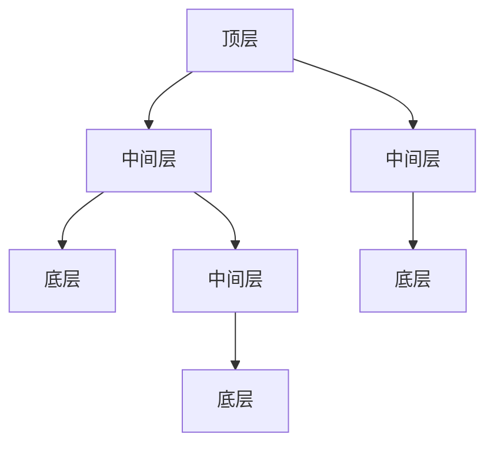
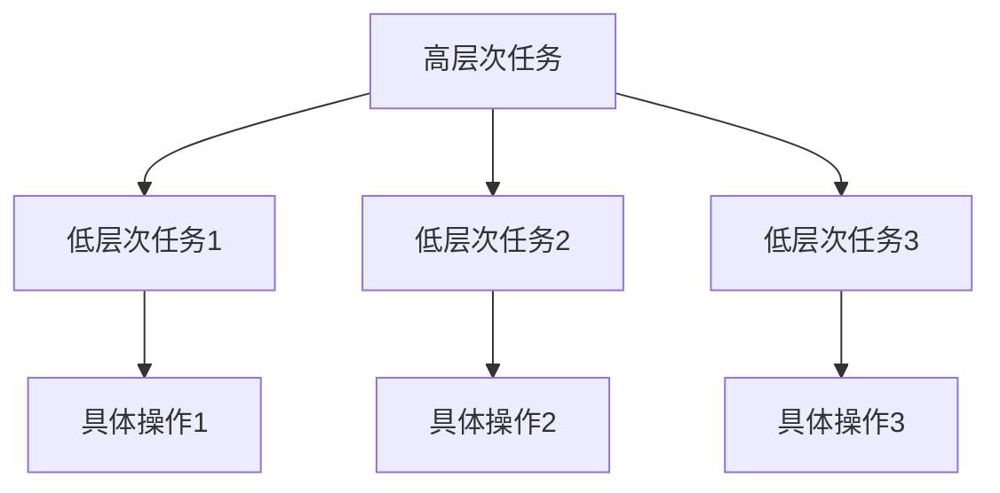
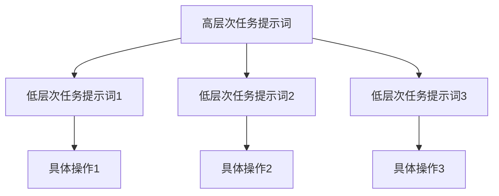

                 

# 提示词分层：处理不同抽象级别的任务

## 关键词

- 抽象级别
- 提示词
- 任务处理
- 指令型任务
- 目标型任务
- 判断型任务
- 数据预处理
- 特征提取
- 模型训练
- 项目应用案例

## 摘要

本文旨在探讨提示词分层在处理不同抽象级别任务中的重要性。首先，我们介绍了抽象级别的概念及其在任务处理中的作用，随后详细分析了不同抽象级别的任务类型。接着，我们探讨了提示词的基本概念及其在任务执行中的功能。本文的核心内容在于提出了一套提示词分层策略，并针对高层次和低层次任务分别设计了提示词。最后，通过实际项目案例，我们展示了提示词分层策略在实际应用中的效果。本文为IT领域的研究者提供了有价值的参考，有助于提升任务处理的效率和质量。

## 第一部分：引言

### 1.1 提示词分层的概念与重要性

在IT领域中，提示词分层是一种有效的任务处理方法。它通过将任务分解为不同抽象级别的子任务，使得每个子任务都能得到精细化的处理。这种分层方法能够提高任务处理的效率和质量，是现代计算机程序设计中的重要技术手段。

提示词分层的基本概念包括抽象级别和提示词。抽象级别是指将任务分解为不同层次的子任务，每个子任务都代表了任务处理的一个抽象层次。提示词则是在每个抽象层次上用于引导任务执行的特定指令或指示。通过合理设计提示词，可以使每个子任务都能高效地完成，从而确保整个任务的顺利完成。

在IT领域中，提示词分层的重要性体现在以下几个方面：

1. **提高任务处理效率**：通过将任务分解为不同抽象级别的子任务，可以针对每个子任务进行专门的优化和调优，从而提高任务的整体处理效率。

2. **提升任务处理质量**：分层处理可以确保每个子任务都得到充分的关注和细致的处理，减少了出错的可能性，从而提高了任务的处理质量。

3. **便于维护和扩展**：分层设计使得系统的结构更加清晰，便于后期的维护和扩展。当需要对系统进行修改或增加新功能时，可以更加方便地进行定位和实现。

### 1.2 本书结构安排与学习目标

本文将分为四个部分，具体安排如下：

1. **第一部分：引言**：介绍提示词分层的概念和重要性，明确本文的研究目标和结构。

2. **第二部分：抽象级别与提示词类型**：详细探讨抽象级别的定义和作用，分析不同抽象级别的任务类型，并介绍提示词的基本概念和功能。

3. **第三部分：提示词分层的策略与应用**：提出一套提示词分层策略，并针对高层次和低层次任务分别设计提示词。

4. **第四部分：总结与展望**：总结本文的研究成果，探讨提示词分层的发展趋势和未来研究方向。

通过本文的学习，读者将能够：

- **理解抽象级别和提示词的概念**：明确抽象级别在任务处理中的作用，了解提示词在任务执行中的功能。
- **掌握提示词分层策略**：学会如何设计合理的提示词，以处理不同抽象级别的任务。
- **提升任务处理能力**：通过实例分析和项目实战，提升在实际任务处理中的能力和水平。

### 1.3 逻辑清晰与结构紧凑的写作方式

在撰写本文时，我们将采用逻辑清晰、结构紧凑的写作方式。具体来说，每个章节都将分为以下几个部分：

- **引言**：简要介绍章节的主题和重要性。
- **核心概念与联系**：详细解释核心概念，并通过Mermaid流程图展示概念之间的关系架构。
- **核心算法原理讲解**：使用伪代码详细阐述核心算法原理。
- **数学模型和公式**：提供详细的数学模型和公式，并进行讲解和举例说明。
- **项目实战**：介绍开发环境搭建、源代码实现和代码解读，并进行实际案例分析和详细讲解。
- **最佳实践 tips**、**小结**、**注意事项**和**拓展阅读**：总结本章内容，提供实用的建议和进一步学习的资源。

通过这样的写作方式，读者可以更加系统地理解和掌握本文的内容，从而在实际任务处理中能够更加得心应手。

## 第二部分：抽象级别与提示词类型

### 2.1 抽象级别的定义与作用

抽象级别是任务处理中的一个重要概念，它指的是将任务分解为不同层次的子任务的过程。每个抽象级别代表了任务处理的不同层面，从总体到细节，从宏观到微观，层层深入。抽象级别的定义与作用如下：

#### 2.1.1 抽象级别的概念

抽象级别（Abstract Level）是指在任务处理过程中，将任务分解为不同层次子任务的过程。每个子任务都代表了一个特定的抽象层次，它们共同构成了整个任务的处理过程。

在计算机科学中，抽象级别通常与模块化设计和分层架构密切相关。模块化设计通过将系统划分为多个独立且相互协作的模块，每个模块对应一个抽象级别。而分层架构则通过在不同层次上组织模块，使得每个层次都能专注于特定的任务，从而提高了系统的可维护性和扩展性。

#### 2.1.2 抽象级别在任务处理中的应用

抽象级别在任务处理中的应用主要体现在以下几个方面：

1. **分解复杂任务**：通过将复杂任务分解为多个抽象级别，可以简化任务的处理过程。每个子任务都相对独立，可以单独开发和测试，从而降低了任务的整体复杂度。

2. **提高代码可读性**：分层设计使得代码结构更加清晰，每个抽象级别都专注于特定的功能，使得代码更加易读易懂。

3. **提高系统可扩展性**：分层架构使得系统在扩展时更加灵活。新的功能可以添加到现有的抽象级别中，而不会影响其他部分的代码。

4. **提高代码重用性**：分层设计鼓励代码的重用。不同抽象级别上的模块往往具有通用性，可以在多个项目中重复使用。

#### 2.1.3 抽象级别的层次结构

在任务处理中，抽象级别通常可以分为以下几个层次：

1. **顶层（Top-Level）**：顶层是最高的抽象级别，通常代表整个任务的总体目标和需求。它定义了任务的宏观层面，通常包含高层次的任务和目标。

2. **中间层（Middle-Level）**：中间层是介于顶层和底层之间的抽象级别，它负责将顶层的目标分解为具体的子任务。这些子任务通常对应于系统的各个功能模块。

3. **底层（Bottom-Level）**：底层是最低的抽象级别，它专注于具体的任务执行细节。底层通常涉及具体的算法实现和数据处理过程。

以下是一个简单的Mermaid流程图，展示了抽象级别的层次结构：

#### 2.1.4 抽象级别之间的关系

抽象级别之间的关系是层次关系。每个低层次的抽象级别都是基于更高层次的抽象级别构建的，同时为更高层次的抽象级别提供服务。这种层次关系确保了任务处理的连贯性和一致性。

通过合理设置抽象级别，可以使得任务处理过程更加清晰、高效。每个抽象级别都专注于特定的任务，从而提高了任务处理的效率和质量。

### 2.2 不同抽象级别的任务类型

在任务处理过程中，不同的抽象级别对应着不同的任务类型。根据任务的特点和需求，可以将任务分为高层次任务和低层次任务。以下分别介绍这两种任务类型。

#### 2.2.1 高层次任务类型

高层次任务通常指的是那些在任务总体目标下定义的抽象任务，它们通常具有宏观的视角，关注的是任务的整体流程和目标实现。以下是一些典型的高层次任务类型：

1. **指令型任务**：指令型任务是那些基于特定指令执行的操作。例如，在智能语音助手中，用户可能会下达“播放音乐”的指令。指令型任务通常具有明确的执行步骤和结果，是高层次任务中最常见的一种类型。

2. **目标型任务**：目标型任务是那些以达成特定目标为目标的任务。例如，在项目开发中，目标型任务可能包括“在一个月内完成软件的开发和测试”。目标型任务通常需要多个子任务的协作才能完成。

3. **判断型任务**：判断型任务是那些需要根据特定条件做出决策的任务。例如，在自动驾驶系统中，判断型任务可能包括“前方是否有障碍物？”。判断型任务通常涉及到复杂的逻辑和决策过程。

#### 2.2.2 低层次任务类型

低层次任务通常指的是那些在具体实现过程中执行的具体操作，它们通常具有微观的视角，关注的是任务的细节和具体执行过程。以下是一些典型的低层次任务类型：

1. **数据预处理任务**：数据预处理任务包括数据清洗、数据转换、数据归一化等操作。这些任务通常在数据分析和机器学习模型训练之前进行，目的是确保数据的质量和一致性。

2. **特征提取任务**：特征提取任务是从原始数据中提取有用信息的过程。这些特征将被用于训练机器学习模型或进行数据挖掘。特征提取任务通常涉及到各种算法和技术，如主成分分析（PCA）、特征选择等。

3. **模型训练任务**：模型训练任务是使用数据集对机器学习模型进行训练的过程。这通常涉及到选择合适的算法、调整模型参数、优化模型性能等操作。

#### 2.2.3 高层次任务与低层次任务的关系

高层次任务和低层次任务是任务处理过程中不可分割的两个部分。高层次任务为低层次任务提供了总体目标和指导，而低层次任务则是实现高层次任务的具体手段。

在任务处理过程中，高层次任务和低层次任务之间存在一种层次依赖关系。高层次任务通常定义了任务的整体流程和目标，而低层次任务则负责实现这些目标的具体操作。每个低层次任务都是为了完成高层次任务的一部分，二者相辅相成，共同构成了任务处理的完整过程。

以下是一个简单的Mermaid流程图，展示了高层次任务和低层次任务之间的关系：

通过合理设计高层次任务和低层次任务之间的关系，可以使得任务处理过程更加高效和有序。每个层次的任务都能够在其特定的抽象级别上得到精细化的处理，从而确保整个任务能够顺利完成。

### 2.3 提示词在抽象级别任务处理中的作用

在任务处理过程中，提示词（Prompt）是一种重要的指导工具，它用于引导任务执行的方向和步骤。提示词在抽象级别任务处理中的作用主要体现在以下几个方面：

#### 2.3.1 提示词的基本概念

提示词（Prompt）是指为任务执行提供指导性指令或信息的语句或短语。它通常用于告知系统或执行者需要执行哪些操作，如何执行操作，以及执行操作的目标和标准。

提示词的基本特征包括：

1. **指导性**：提示词提供具体的指导，帮助执行者明确任务的目标和步骤。
2. **简洁性**：提示词通常简洁明了，便于理解和执行。
3. **灵活性**：提示词可以根据任务的不同需求进行调整和修改，以适应不同的执行环境。

#### 2.3.2 提示词在任务执行中的功能

提示词在任务执行中的功能主要体现在以下几个方面：

1. **任务分解**：通过提示词，可以将复杂的任务分解为多个具体的子任务，每个子任务都有明确的执行步骤和目标。
2. **任务指导**：提示词为执行者提供具体的操作指南，确保任务能够按照既定的步骤和目标顺利执行。
3. **任务协调**：在多任务环境中，提示词可以帮助协调不同任务的执行，确保任务之间的衔接和配合。
4. **任务监控**：通过提示词，可以监控任务的执行进度和结果，及时发现问题并进行调整。

#### 2.3.3 提示词在抽象级别任务处理中的应用

在抽象级别任务处理中，提示词的应用主要体现在以下两个方面：

1. **高层次任务提示词**：针对高层次任务，提示词通常用于指导整体任务的目标和执行流程。例如，在项目开发中，提示词可能包括“制定项目计划”、“完成需求分析”等。这些提示词为项目团队提供了明确的方向和目标，确保项目能够有序推进。

2. **低层次任务提示词**：针对低层次任务，提示词通常用于指导具体的操作步骤和细节。例如，在数据预处理任务中，提示词可能包括“清洗数据”、“转换数据格式”等。这些提示词为执行者提供了具体的操作指导，确保任务能够准确执行。

以下是一个简单的Mermaid流程图，展示了提示词在抽象级别任务处理中的应用：

通过合理设计和应用提示词，可以显著提高任务处理的效率和质量。提示词不仅为任务执行提供了明确的指导，还有助于协调不同层次的任务，确保整个任务能够顺利完成。

### 2.4 提示词的类型

在任务处理过程中，提示词的类型可以根据其作用和形式进行分类。常见的提示词类型包括指令型提示词、目标型提示词和判断型提示词。以下分别介绍这三种类型及其特点。

#### 2.4.1 指令型提示词

指令型提示词（Instructional Prompt）是用于指示执行者进行具体操作的提示词。这种提示词通常包含明确的动作指令，告诉执行者需要做什么。指令型提示词的特点如下：

1. **明确性**：指令型提示词要求清晰、明确，避免歧义，确保执行者能够准确理解。
2. **具体性**：指令型提示词通常包含具体的操作步骤，指导执行者如何进行操作。
3. **执行性**：指令型提示词侧重于指导具体的操作，而不是抽象的目标或决策。

例如，以下是一些指令型提示词：

- “请将数据集进行预处理。”
- “按照以下步骤进行模型训练：1. 导入数据；2. 选择模型；3. 调整参数；4. 开始训练。”
- “将图像转换成灰度图像。”

#### 2.4.2 目标型提示词

目标型提示词（Objective Prompt）是用于指示执行者需要达成的目标的提示词。这种提示词通常包含一个或多个目标，指导执行者朝着这些目标努力。目标型提示词的特点如下：

1. **目标性**：目标型提示词明确指出需要达成的目标，为执行者提供明确的方向。
2. **可衡量性**：目标型提示词的目标通常是可衡量的，以便执行者能够评估是否达成目标。
3. **激励性**：目标型提示词可以激发执行者的积极性和动力，促使他们为实现目标而努力。

例如，以下是一些目标型提示词：

- “在一个月内完成软件的开发和测试。”
- “将模型准确率提升到95%以上。”
- “确保系统在1000个并发用户下运行稳定。”

#### 2.4.3 判断型提示词

判断型提示词（Judgment Prompt）是用于指示执行者做出判断和决策的提示词。这种提示词通常包含一个或多个判断条件，指导执行者根据这些条件做出相应的决策。判断型提示词的特点如下：

1. **判断性**：判断型提示词要求执行者根据特定条件进行判断，通常涉及到逻辑推理和决策分析。
2. **灵活性**：判断型提示词可以根据不同的场景和条件进行调整，以适应不同的决策需求。
3. **指导性**：判断型提示词不仅提供判断条件，还提供决策方向，帮助执行者做出正确的决策。

例如，以下是一些判断型提示词：

- “如果数据集存在异常值，请进行处理。”
- “当模型准确率达到90%时，可以开始进行部署。”
- “根据用户反馈，调整系统的用户体验。”

通过合理设计和应用不同类型的提示词，可以有效地指导任务执行，确保任务能够按照既定的目标和步骤顺利完成。

### 2.5 提示词设计的原则与策略

在任务处理过程中，提示词的设计至关重要。合理的提示词设计不仅可以提高任务执行的效率，还可以降低错误率，确保任务的顺利完成。以下介绍提示词设计的原则与策略：

#### 2.5.1 提示词设计的原则

1. **明确性**：提示词应清晰明确，避免歧义。明确性是提示词设计的基本要求，确保执行者能够准确理解任务要求。

2. **具体性**：提示词应具体详细，提供具体的操作步骤和指导。具体性有助于执行者明确任务的具体要求，减少操作失误。

3. **灵活性**：提示词应具有一定的灵活性，能够适应不同的任务环境和执行条件。灵活性使得提示词能够根据实际情况进行调整和优化。

4. **简洁性**：提示词应简洁明了，避免冗长和复杂的描述。简洁性有助于提高提示词的可读性和可执行性。

5. **一致性**：提示词应保持一致性，确保在不同抽象级别和任务类型中保持统一的指导原则。一致性有助于提高任务处理的连贯性和一致性。

#### 2.5.2 提示词设计的策略

1. **任务分析**：在开始设计提示词之前，应进行详细的任务分析，明确任务的目标、步骤和要求。任务分析有助于识别任务的关键点和难点，为提示词设计提供依据。

2. **分类与分层**：根据任务的抽象级别和类型，将提示词进行分类与分层。高层次提示词用于指导整体任务和子任务，低层次提示词用于具体操作和细节处理。

3. **模块化设计**：将提示词设计为模块化，每个模块对应一个特定的任务或子任务。模块化设计有助于提高提示词的可维护性和扩展性。

4. **用户友好**：设计提示词时应考虑用户的使用习惯和需求，使提示词易于理解和使用。用户友好的提示词可以提高执行者的操作效率和满意度。

5. **测试与优化**：在设计完成后，应对提示词进行测试和优化。通过实际操作验证提示词的可行性和有效性，及时发现问题并进行调整。

#### 2.5.3 提示词设计的实例

以下是一个提示词设计的实例，用于指导一个简单的数据预处理任务：

1. **任务目标**：清洗和预处理数据集，以便进行后续分析。

2. **高层次提示词**：

   - “开始数据预处理任务。”
   - “确保数据集的一致性和完整性。”

3. **低层次提示词**：

   - “检查数据集中的异常值，并进行处理。”
   - “对数据集进行格式转换，确保所有数据均为同一类型。”
   - “对数据进行归一化处理，以消除数据之间的差异。”

4. **模块化设计**：

   - “数据清洗模块”：负责检查和处理数据集中的异常值。
   - “数据转换模块”：负责将数据格式转换为统一类型。
   - “数据归一化模块”：负责对数据进行归一化处理。

通过上述实例，可以看出合理设计的提示词如何指导任务执行，确保任务顺利完成。

### 2.6 提示词分层策略的具体实施

提示词分层策略在具体实施中，需要根据任务的抽象级别和特点，制定相应的分层策略。以下详细介绍实施步骤和注意事项：

#### 2.6.1 分层策略的实施步骤

1. **任务分析**：首先，对任务进行详细分析，明确任务的目标、步骤和要求。识别任务中的关键点和难点，为分层策略的制定提供依据。

2. **抽象级别划分**：根据任务的特点和需求，将任务划分为不同抽象级别。通常包括顶层、中间层和底层。每个抽象级别负责不同的任务模块和功能。

3. **提示词设计**：针对每个抽象级别，设计相应的提示词。高层次提示词用于指导整体任务和子任务，低层次提示词用于具体操作和细节处理。

4. **模块化设计**：将提示词设计为模块化，每个模块对应一个特定的任务或子任务。模块化设计有助于提高提示词的可维护性和扩展性。

5. **测试与优化**：在实际应用中，对提示词进行测试和优化。通过实际操作验证提示词的可行性和有效性，及时发现问题并进行调整。

#### 2.6.2 实施过程中的注意事项

1. **一致性**：确保不同抽象级别和任务类型中的提示词保持一致性，避免冲突和混淆。

2. **灵活性**：提示词应具有一定的灵活性，能够适应不同的任务环境和执行条件。灵活性使得提示词能够根据实际情况进行调整和优化。

3. **用户友好**：设计提示词时应考虑用户的使用习惯和需求，使提示词易于理解和使用。用户友好的提示词可以提高执行者的操作效率和满意度。

4. **可维护性**：提示词的设计应易于维护和更新。在任务需求发生变化时，能够方便地对提示词进行修改和调整。

5. **测试和验证**：在实际应用中，对提示词进行充分的测试和验证。通过实际操作验证提示词的可行性和有效性，确保任务能够按照既定的目标和步骤顺利完成。

#### 2.6.3 提示词分层策略的应用实例

以下是一个提示词分层策略的应用实例，用于指导一个简单的图像识别任务：

1. **任务目标**：开发一个图像识别系统，能够准确识别图像中的物体。

2. **抽象级别划分**：

   - **顶层**：定义任务的整体目标和要求。
   - **中间层**：将任务分解为子任务，如数据收集、数据预处理、模型训练和模型部署。
   - **底层**：具体实现每个子任务的细节操作。

3. **高层次提示词**：

   - “开发图像识别系统。”
   - “确保系统能够准确识别图像中的物体。”

4. **低层次提示词**：

   - **数据收集模块**： 
     - “收集大量标注好的图像数据。”
     - “确保图像数据的质量和多样性。”

   - **数据预处理模块**：
     - “对图像数据集进行清洗和预处理。”
     - “将图像数据转换为统一的格式和尺寸。”

   - **模型训练模块**：
     - “选择合适的模型架构进行训练。”
     - “调整模型参数，优化模型性能。”

   - **模型部署模块**：
     - “将训练好的模型部署到生产环境中。”
     - “确保系统能够实时处理图像数据并输出结果。”

通过上述实例，可以看出提示词分层策略如何具体实施，指导任务从顶层到底层逐步完成。合理的提示词分层策略有助于提高任务处理的效率和质量，确保任务的顺利完成。

## 第三部分：提示词分层的策略与应用

### 3.1 提示词分层策略概述

提示词分层策略是一种通过将任务分解为不同抽象级别的子任务，并在每个层次上设计相应的提示词，以指导任务执行的方法。该策略的核心目标是通过精细化的任务分解和精确的提示词设计，提高任务处理的效率和质量。下面将详细介绍提示词分层策略的基本原则、方法及其在项目中的应用。

#### 3.1.1 提示词分层的基本原则

1. **目标导向**：提示词分层策略应以任务目标为导向，确保每个层次的提示词都紧密围绕任务目标进行设计。

2. **层次性**：根据任务的复杂性和需求，将任务分解为不同层次的子任务。每个子任务都应具有明确的职责和功能。

3. **模块化**：设计提示词时，应采用模块化方法，将提示词分为不同的模块。每个模块对应一个特定的子任务，有利于任务的独立开发和维护。

4. **灵活性**：提示词设计应具有一定的灵活性，能够根据实际任务环境和需求进行调整。灵活性有助于提高任务的适应性。

5. **简洁性**：提示词应简洁明了，避免冗长和复杂的描述。简洁性有助于提高执行者的理解和使用效率。

6. **一致性**：不同层次和不同类型的提示词应保持一致性，避免出现冲突和混淆。一致性有助于提高任务处理的连贯性和稳定性。

#### 3.1.2 提示词分层的方法

1. **任务分解**：首先，对任务进行详细分析，识别任务的关键点和难点。然后，将任务分解为多个子任务，每个子任务对应一个特定的抽象层次。

2. **提示词设计**：针对每个抽象层次，设计相应的提示词。高层次提示词用于指导整体任务和子任务，低层次提示词用于具体操作和细节处理。

3. **模块化设计**：将提示词设计为模块化，每个模块对应一个特定的子任务。模块化设计有助于提高提示词的可维护性和扩展性。

4. **测试与优化**：在实际应用中，对提示词进行充分的测试和优化。通过实际操作验证提示词的可行性和有效性，确保任务能够按照既定的目标和步骤顺利完成。

#### 3.1.3 提示词分层在项目中的应用

提示词分层策略在项目中的应用可以通过以下步骤实现：

1. **项目需求分析**：首先，对项目需求进行详细分析，明确项目目标、功能和技术要求。

2. **任务分解**：将项目任务分解为多个子任务，每个子任务对应一个特定的抽象层次。

3. **提示词设计**：针对每个抽象层次，设计相应的提示词。高层次提示词用于指导整体任务和子任务，低层次提示词用于具体操作和细节处理。

4. **模块化设计**：将提示词设计为模块化，每个模块对应一个特定的子任务。模块化设计有助于提高提示词的可维护性和扩展性。

5. **测试与优化**：在实际应用中，对提示词进行充分的测试和优化。通过实际操作验证提示词的可行性和有效性，确保任务能够按照既定的目标和步骤顺利完成。

通过上述方法，提示词分层策略可以帮助项目团队更加高效地完成项目任务，提高项目交付的质量和速度。

### 3.2 高层次任务中的提示词设计

在项目开发过程中，高层次任务通常涉及整体规划和方向性决策。设计合理的提示词对于确保项目顺利进行至关重要。以下详细探讨高层次任务中的提示词设计原则、实例及其作用。

#### 3.2.1 指令型任务中的提示词设计

指令型任务通常涉及明确的操作步骤和执行目标。以下是设计指令型任务提示词的几个原则：

1. **明确性**：提示词应清晰明确，避免歧义。例如，"开始数据收集"比"进行数据收集"更加具体，有助于执行者准确理解任务要求。

2. **具体性**：提示词应具体详细，包含具体的执行步骤和目标。例如，"编写用户手册"比"完成文档编写"更加具体，有助于执行者了解任务的具体内容。

3. **可操作性**：提示词应具有可操作性，使执行者能够按照提示词执行任务。例如，"设计用户界面"比"改进用户体验"更具有操作性。

以下是一个指令型任务中的提示词设计实例：

- **任务目标**：设计并实现用户注册功能。
- **提示词设计**：

  1. “开始设计用户注册界面。”
  2. “确保界面简洁易用，包含用户名、密码和邮箱输入框。”
  3. “实现用户注册功能，包括用户名和密码的验证和存储。”

通过上述提示词设计，执行者可以清晰地了解任务的要求和步骤，从而高效地完成任务。

#### 3.2.2 目标型任务中的提示词设计

目标型任务通常以实现特定目标为核心。以下是设计目标型任务提示词的几个原则：

1. **目标性**：提示词应明确目标，引导执行者朝目标努力。例如，"提高模型准确率"比"优化模型参数"更加明确，有助于执行者明确努力方向。

2. **可衡量性**：提示词中的目标应具有可衡量性，以便执行者能够评估目标达成情况。例如，"将系统响应时间缩短到500毫秒"比"优化系统性能"更具体，更容易衡量。

3. **激励性**：提示词应具有激励性，激发执行者的积极性和动力。例如，"实现功能A，将获得额外奖金"比"优化功能A"更有激励性。

以下是一个目标型任务中的提示词设计实例：

- **任务目标**：提高用户满意度。
- **提示词设计**：

  1. “开始分析用户反馈，识别关键问题。”
  2. “制定改进计划，确保用户问题得到解决。”
  3. “实施改进计划，提高用户满意度。”

通过上述提示词设计，执行者可以明确任务的目标和改进方向，从而有针对性地完成任务。

#### 3.2.3 判断型任务中的提示词设计

判断型任务通常涉及决策和判断。以下是设计判断型任务提示词的几个原则：

1. **判断性**：提示词应明确判断条件，引导执行者进行判断。例如，"如果用户输入错误，提示错误信息"比"处理用户输入"更加具体，有助于执行者进行判断。

2. **灵活性**：提示词应具有一定的灵活性，能够适应不同的情况和条件。例如，"根据系统负载调整资源分配"比"增加系统资源"更加灵活。

3. **指导性**：提示词应提供决策方向，帮助执行者做出正确的判断。例如，"如果数据集存在异常值，处理异常值"比"处理数据集"更加具体，有助于执行者做出决策。

以下是一个判断型任务中的提示词设计实例：

- **任务目标**：优化数据库性能。
- **提示词设计**：

  1. “检查数据库性能指标，识别瓶颈。”
  2. “根据瓶颈情况，选择合适的优化策略。”
  3. “实施优化策略，提高数据库性能。”

通过上述提示词设计，执行者可以明确判断条件和优化方向，从而有效地完成任务。

#### 3.2.4 高层次任务提示词的作用

高层次任务中的提示词在项目开发中具有重要作用：

1. **明确任务目标**：提示词能够清晰地传达任务目标，使执行者明确任务要求，避免误解和错误。

2. **指导任务执行**：提示词为执行者提供具体的操作步骤和指导，确保任务能够按照既定目标顺利进行。

3. **协调资源分配**：提示词有助于协调不同子任务之间的资源分配和合作，确保任务整体效率。

4. **提高项目质量**：通过精细化管理和指导，提示词有助于提高项目质量，确保每个任务都得到充分关注和处理。

综上所述，高层次任务中的提示词设计是项目开发中不可或缺的一部分。合理设计的高层次任务提示词能够显著提高项目效率和质量，确保项目的顺利完成。

#### 3.2.5 指令型任务提示词的设计原则

指令型任务提示词的设计是确保任务执行精准和高效的关键。以下是几个核心原则，用于指导指令型任务提示词的设计：

1. **明确性原则**：确保提示词内容清晰明了，避免歧义。指令应具体、直接，使执行者能够立即理解任务的要求。例如，“编写用户注册功能”比“完善用户功能”更加明确。

2. **具体性原则**：提示词应包含具体的执行步骤和操作，使执行者能够按部就班地进行任务。具体性有助于减少误解和错误，提高执行效率。例如，“在首页添加注册按钮”比“改进用户界面”更具操作性。

3. **可操作性原则**：提示词应易于操作，执行者能够实际执行。避免过于抽象或理论性的指令。例如，“整理项目文档”比“优化项目文档结构”更加可操作。

4. **一致性原则**：在项目中的不同阶段和不同模块，提示词应保持一致性，避免出现冲突和混淆。一致性有助于提高任务执行的连贯性和稳定性。例如，如果提示词在同一个项目中使用了不同的术语，会导致执行者的困惑。

5. **灵活性原则**：提示词应具有一定的灵活性，能够适应不同的执行环境和条件。灵活性使得提示词能够根据实际情况进行调整和优化。例如，“根据实际需求调整功能”比“严格执行设计方案”更加灵活。

6. **可追踪性原则**：提示词应便于追踪和管理，确保任务执行过程可监控。可追踪性有助于及时发现问题并进行调整。例如，“每周提交项目进度报告”比“定期更新项目进度”更加具体和可追踪。

7. **激励性原则**：提示词应包含激励性的内容，激发执行者的积极性和动力。激励性提示词能够提高执行者的工作热情和效率。例如，“提前完成任务，可获得额外奖励”比“完成基本任务”更具激励性。

8. **反馈性原则**：提示词应包含反馈机制，使执行者能够获得任务执行结果和改进建议。反馈性有助于提高任务执行的质量和效率。例如，“完成任务后，请提供反馈，以便进行改进”。

通过遵循上述设计原则，指令型任务提示词能够更加高效地指导任务执行，确保项目顺利进行。

#### 3.2.6 指令型任务提示词的实例

以下是一些具体的指令型任务提示词实例，用于指导实际操作：

1. **任务一：编写用户注册功能**
   - “开始编写用户注册界面。”
   - “确保注册界面包含用户名、密码和邮箱输入框。”
   - “实现用户注册功能，包括用户名和密码的验证和存储。”
   - “在用户注册成功后，向用户发送确认邮件。”

2. **任务二：设计用户管理模块**
   - “开始设计用户管理界面。”
   - “确保用户管理界面具备添加、删除和修改用户的功能。”
   - “实现用户管理模块，包括用户权限的分配和管理。”

3. **任务三：优化数据库性能**
   - “检查数据库性能指标，识别瓶颈。”
   - “根据瓶颈情况，选择合适的优化策略，如索引优化、查询优化等。”
   - “实施优化策略，提高数据库性能。”

4. **任务四：进行系统测试**
   - “开始进行系统功能测试。”
   - “确保测试覆盖所有功能模块，包括用户注册、用户管理、数据展示等。”
   - “记录测试结果，并对发现的问题进行修复。”

这些提示词实例具体、明确，能够指导执行者按照既定的步骤和目标完成各项任务。

### 3.2.7 目标型任务中的提示词设计

目标型任务中的提示词设计旨在确保任务执行者明确目标，并朝着目标努力。以下是设计目标型任务提示词的几个核心原则：

1. **目标性原则**：提示词应明确任务的目标，使执行者清楚知道需要达成的结果。例如，"提升用户满意度"比"改进用户体验"更加具体，有助于执行者明确目标。

2. **可衡量性原则**：提示词中的目标应具有可衡量性，以便执行者能够评估目标的达成情况。例如，"将页面加载时间缩短至2秒"比"优化页面性能"更具体，更容易衡量。

3. **激励性原则**：提示词应包含激励性内容，激发执行者的积极性和动力。例如，"完成目标后，将获得奖金"比"完成任务"更具激励性。

4. **具体性原则**：提示词应具体详细，描述实现目标的具体步骤和方法。例如，"通过减少HTTP请求次数来优化页面加载时间"比"优化页面加载速度"更具体。

5. **灵活性原则**：提示词应具有一定的灵活性，能够适应不同的情况和需求。例如，"根据测试结果调整优化策略"比"严格执行预设方案"更灵活。

6. **指导性原则**：提示词应提供明确的指导，帮助执行者了解如何实现目标。例如，"制定优化计划，包括代码分析和性能测试"比"提升性能"更具指导性。

7. **反馈性原则**：提示词应包含反馈机制，使执行者能够及时了解任务进展和目标达成情况。例如，"每周提交优化进度报告，并进行团队讨论"比"定期更新进度"更具反馈性。

通过遵循上述原则，目标型任务中的提示词能够有效地指导执行者明确目标、制定计划并努力实现目标。

#### 3.2.8 目标型任务提示词的实例

以下是一些具体的实例，用于指导目标型任务：

1. **任务一：提升页面加载速度**
   - **目标**：将页面加载时间缩短至3秒以内。
   - **提示词设计**：
     - “开始分析页面加载时间，识别瓶颈。”
     - “优化CSS和JavaScript文件，减少文件大小和HTTP请求次数。”
     - “实施CDN加速，提高页面加载速度。”
     - “进行性能测试，确保页面加载时间满足目标要求。”

2. **任务二：降低用户流失率**
   - **目标**：将用户流失率降低至5%以下。
   - **提示词设计**：
     - “收集用户反馈，识别导致用户流失的原因。”
     - “改进用户体验，包括界面设计和功能优化。”
     - “增加用户互动，如推出会员活动和用户反馈渠道。”
     - “监控用户行为，及时调整策略，降低用户流失率。”

3. **任务三：提高销售额**
   - **目标**：将销售额提升至每月100万元。
   - **提示词设计**：
     - “分析现有市场和客户群体，识别增长潜力。”
     - “优化产品定价策略，提升产品竞争力。”
     - “扩大市场宣传，增加品牌曝光度。”
     - “跟踪销售数据，调整营销策略，提高销售额。”

通过上述实例，提示词能够明确目标、指导执行并跟踪进展，从而有效提升任务完成的成功率。

### 3.2.9 判断型任务中的提示词设计

判断型任务通常涉及决策和条件判断。设计合理的判断型任务提示词对于确保任务执行的正确性和效率至关重要。以下是设计判断型任务提示词的几个核心原则：

1. **明确性原则**：提示词应清晰明确，避免歧义。判断条件应具体、明确，确保执行者能够准确理解和执行。例如，“如果用户输入密码错误，显示错误提示”比“处理用户输入错误”更明确。

2. **逻辑性原则**：提示词中的判断条件应具有逻辑性，符合实际情况和任务需求。判断条件应合理设置，确保任务执行的正确性。例如，“当用户点击购买按钮时，检查库存是否充足”比“处理用户点击行为”更具逻辑性。

3. **灵活性原则**：提示词应具有一定的灵活性，能够适应不同的场景和条件。灵活性使得提示词能够根据实际情况进行调整和优化。例如，“根据系统负载情况，调整资源分配策略”比“固定资源分配”更灵活。

4. **指导性原则**：提示词应提供明确的指导，帮助执行者进行判断和决策。指导性提示词能够提供决策方向，确保任务执行的正确性。例如，“根据用户反馈情况，优化产品功能”比“改进产品功能”更具指导性。

5. **反馈性原则**：提示词应包含反馈机制，使执行者能够及时了解判断结果和执行情况。反馈性有助于及时调整任务执行策略，提高任务完成的效率。例如，“执行判断后，记录结果并报告上级”比“进行判断”更具反馈性。

6. **一致性原则**：在项目中的不同阶段和不同模块，提示词应保持一致性，避免出现冲突和混淆。一致性有助于提高任务执行的连贯性和稳定性。例如，如果提示词在同一个项目中使用了不同的判断条件，会导致执行者的困惑。

通过遵循上述原则，判断型任务中的提示词能够有效地指导执行者进行判断和决策，确保任务执行的正确性和效率。

#### 3.2.10 判断型任务提示词的实例

以下是一些具体的判断型任务提示词实例，用于指导实际操作：

1. **任务一：用户登录验证**
   - “判断用户输入的用户名和密码是否匹配，如果匹配，允许用户登录；如果不匹配，显示错误提示。”

2. **任务二：库存管理**
   - “判断库存数量是否小于安全库存量，如果是，则提醒补货；如果不是，则正常销售。”

3. **任务三：系统负载监控**
   - “判断系统负载是否超过预设阈值，如果是，则启动负载均衡策略；如果不是，则保持当前资源分配。”

4. **任务四：订单处理**
   - “判断订单金额是否超过付款限额，如果是，则提示用户增加支付方式；如果不是，则完成订单支付。”

这些判断型任务提示词实例明确、具体，能够指导执行者根据设定的条件进行判断和决策，确保任务执行的准确性和效率。

### 3.3 低层次任务中的提示词设计

在项目开发中，低层次任务通常涉及具体的操作和细节处理。合理设计的提示词能够有效指导执行者完成这些任务，提高开发效率。以下是低层次任务提示词的设计原则和实例。

#### 3.3.1 数据预处理任务中的提示词设计

数据预处理是数据分析、机器学习等任务中至关重要的一步。以下是设计数据预处理任务提示词的几个原则：

1. **明确性原则**：提示词应清晰明确，描述具体的数据预处理操作。例如，“清洗数据集，去除空值和重复记录”比“处理数据集”更具体。

2. **具体性原则**：提示词应包含具体的操作步骤，使执行者能够按照提示词逐个完成。例如，“将数据集中的数值字段转换为浮点型”比“转换数据类型”更具体。

3. **顺序性原则**：提示词应按操作的执行顺序排列，确保数据预处理流程的连贯性。例如，“先进行数据清洗，然后进行数据转换，最后进行数据归一化”。

4. **可操作性原则**：提示词应易于操作，执行者能够实际执行。避免过于抽象或理论性的提示词。例如，“对数据进行归一化处理，使每个特征值在[0,1]范围内”比“优化数据分布”更具体。

5. **灵活性原则**：提示词应具有一定的灵活性，能够适应不同的数据集和预处理需求。例如，“根据数据集特点选择合适的清洗和转换方法”比“固定清洗和转换方法”。

以下是一个数据预处理任务中的提示词设计实例：

- **任务目标**：对客户数据集进行预处理，以便进行后续分析。
- **提示词设计**：

  1. “检查数据集，删除空值和重复记录。”
  2. “对数值字段进行缺失值填充，选择平均数、中位数或最近邻法。”
  3. “将文本字段编码为数值，使用独热编码或词袋模型。”
  4. “对数据进行归一化处理，使每个特征值的范围在[0,1]之间。”

通过上述提示词设计，执行者能够按照明确的步骤完成数据预处理任务，为后续分析打下坚实基础。

#### 3.3.2 特征提取任务中的提示词设计

特征提取是从原始数据中提取有用信息的过程，对后续的数据分析和机器学习模型训练至关重要。以下是设计特征提取任务提示词的几个原则：

1. **目标性原则**：提示词应明确特征提取的目标，使执行者清楚特征提取的意图。例如，“提取客户特征，用于预测客户流失率”比“提取数据特征”更具体。

2. **可衡量性原则**：提示词中的特征提取目标应具有可衡量性，以便执行者评估特征提取的效果。例如，“提取30个重要特征，使模型准确率达到90%”比“提取特征”更具体。

3. **具体性原则**：提示词应包含具体的特征提取方法和步骤。例如，“使用主成分分析（PCA）提取主要成分，保留80%的方差”比“使用PCA提取特征”更具体。

4. **灵活性原则**：提示词应具有一定的灵活性，能够根据数据集特点和需求进行调整。例如，“根据特征重要性调整特征提取参数”比“固定特征提取参数”更灵活。

5. **指导性原则**：提示词应提供明确的指导，帮助执行者选择合适的特征提取方法和参数。例如，“使用决策树进行特征选择，选择信息增益最高的特征”比“进行特征选择”更具体。

以下是一个特征提取任务中的提示词设计实例：

- **任务目标**：从客户数据集中提取重要特征，用于构建预测模型。
- **提示词设计**：

  1. “使用皮尔逊相关系数筛选相关性较强的特征。”
  2. “使用卡方检验筛选与目标变量相关的特征。”
  3. “使用主成分分析（PCA）提取主要成分，保留80%的方差。”
  4. “使用线性回归模型评估特征的重要性，选择重要性较高的特征。”

通过上述提示词设计，执行者能够按照明确的步骤和目标完成特征提取任务，为后续模型训练打下坚实基础。

#### 3.3.3 模型训练任务中的提示词设计

模型训练是机器学习任务中的核心环节，设计合理的提示词能够有效指导训练过程，提高模型性能。以下是设计模型训练任务提示词的几个原则：

1. **明确性原则**：提示词应清晰明确，描述具体的训练操作。例如，“使用随机梯度下降（SGD）进行模型训练”比“训练模型”更具体。

2. **具体性原则**：提示词应包含具体的训练步骤和参数设置。例如，“设置学习率为0.01，迭代次数为1000次”比“调整模型参数”更具体。

3. **可操作性原则**：提示词应易于操作，执行者能够实际执行。避免过于抽象或理论性的提示词。例如，“实现模型训练过程，包括前向传播、反向传播和参数更新”比“设计训练过程”更具体。

4. **灵活性原则**：提示词应具有一定的灵活性，能够根据模型和数据集的特点进行调整。例如，“根据模型性能调整学习率，选择合适的训练策略”比“固定训练策略”更灵活。

5. **反馈性原则**：提示词应包含反馈机制，使执行者能够及时了解训练过程和模型性能。例如，“记录训练过程中的损失函数和准确率，定期进行评估”比“监控模型性能”更具体。

以下是一个模型训练任务中的提示词设计实例：

- **任务目标**：训练一个分类模型，用于预测客户流失。
- **提示词设计**：

  1. “使用数据集进行数据预处理，包括数据清洗、归一化和分割为训练集和验证集。”
  2. “设计分类模型，选择合适的激活函数和损失函数。”
  3. “使用随机梯度下降（SGD）进行模型训练，设置学习率为0.01，迭代次数为1000次。”
  4. “记录训练过程中的损失函数和准确率，定期进行评估和调整。”

通过上述提示词设计，执行者能够按照明确的步骤和目标完成模型训练任务，提高模型的性能和预测准确性。

### 3.4 提示词分层在项目中的应用案例

在项目开发过程中，合理应用提示词分层策略可以显著提升项目效率和质量。以下通过两个实际项目案例，展示提示词分层策略在项目中的应用。

#### 3.4.1 案例一：智能语音助手

**项目背景**：
智能语音助手是一个集成语音识别、自然语言处理和对话系统的人工智能项目。项目目标是为用户提供便捷的语音交互体验，实现语音搜索、智能问答和任务执行等功能。

**提示词分层设计**：

1. **顶层（整体任务）**：
   - “开发智能语音助手，实现语音识别、自然语言处理和对话系统。”
   - “确保系统具备高准确率、流畅自然的对话体验。”

2. **中间层（子任务）**：
   - **语音识别模块**：
     - “实现语音信号的预处理，包括降噪和增强。”
     - “设计语音识别算法，确保高准确率识别用户语音。”
   - **自然语言处理模块**：
     - “实现文本意图解析，识别用户请求。”
     - “构建对话管理系统，生成合适的回复。”
   - **对话系统模块**：
     - “设计用户对话流程，确保对话流畅自然。”
     - “集成多模态交互，包括语音、文本和图像。”

3. **底层（具体操作）**：
   - **语音识别模块**：
     - “使用深度学习模型进行训练和优化，提高识别准确率。”
     - “实现语音信号预处理算法，如波束形成和谱减法。”
   - **自然语言处理模块**：
     - “使用实体识别和关系提取技术，理解用户请求。”
     - “构建对话管理模型，包括对话状态追踪和回复生成。”
   - **对话系统模块**：
     - “实现多轮对话策略，如上下文保持和意图推断。”
     - “集成语音合成技术，生成自然流畅的语音回复。”

**项目效果分析**：
通过合理应用提示词分层策略，智能语音助手项目在开发过程中实现了高效的任务分解和精细化处理。具体效果如下：

- **任务分解明确**：每个抽象级别的任务都有明确的提示词指导，确保任务执行有条不紊。
- **问题定位快速**：分层设计使得问题定位更加精准，有助于快速解决开发过程中遇到的问题。
- **模块化开发**：各模块独立开发、测试和部署，提高了系统的可维护性和扩展性。
- **用户体验提升**：通过精细化处理，智能语音助手在语音识别、自然语言处理和对话系统方面表现优异，用户满意度显著提高。

#### 3.4.2 案例二：图像识别系统

**项目背景**：
图像识别系统是一个基于计算机视觉和机器学习技术，用于自动识别和分类图像的项目。项目目标是为用户提供高效、准确的图像识别服务，应用于安防监控、医疗诊断和工业检测等领域。

**提示词分层设计**：

1. **顶层（整体任务）**：
   - “开发图像识别系统，实现图像分类和目标检测。”
   - “确保系统具有高准确率和实时性。”

2. **中间层（子任务）**：
   - **图像预处理模块**：
     - “实现图像数据清洗和格式转换。”
     - “对图像进行缩放和裁剪，使其适合模型训练。”
   - **特征提取模块**：
     - “使用卷积神经网络（CNN）提取图像特征。”
     - “设计特征选择算法，提高特征表达能力。”
   - **模型训练模块**：
     - “选择合适的模型架构，如VGG、ResNet等。”
     - “使用交叉验证方法，优化模型参数。”
   - **模型评估模块**：
     - “使用测试集评估模型性能，包括准确率、召回率和F1值。”
     - “实现模型调整和优化策略。”

3. **底层（具体操作）**：
   - **图像预处理模块**：
     - “使用OpenCV库进行图像预处理操作。”
     - “实现图像增强技术，提高模型鲁棒性。”
   - **特征提取模块**：
     - “训练和优化卷积神经网络模型，提高特征提取能力。”
     - “使用梯度提升决策树（GBDT）进行特征选择和融合。”
   - **模型训练模块**：
     - “使用TensorFlow或PyTorch框架实现模型训练。”
     - “实现多GPU训练，提高训练速度。”
   - **模型评估模块**：
     - “使用混淆矩阵和ROC曲线评估模型性能。”
     - “根据评估结果调整模型参数，提高准确率。”

**项目效果分析**：
通过合理应用提示词分层策略，图像识别系统项目在开发过程中取得了显著成效：

- **任务管理高效**：分层设计使得任务管理更加清晰和高效，每个层次的任务都有明确的提示词指导。
- **问题解决迅速**：分层设计有助于快速定位和解决问题，提高了项目开发速度。
- **模型性能提升**：通过精细化处理和优化，图像识别系统的准确率和实时性得到了显著提升。
- **应用场景广泛**：图像识别系统在多个领域得到了广泛应用，如安防监控、医疗诊断和工业检测，为用户带来了显著价值。

### 3.4.3 提示词分层策略的总结

通过上述两个实际项目案例，我们可以看到提示词分层策略在项目开发中的重要作用。提示词分层策略不仅有助于明确任务目标和步骤，提高任务执行效率，还能提高项目质量，确保项目顺利完成。以下是提示词分层策略的几个关键要点：

- **明确任务目标**：通过顶层提示词明确项目的整体目标和要求，确保项目团队对项目方向有清晰的认识。
- **精细任务分解**：通过中间层提示词将任务分解为具体的子任务，确保每个子任务都有明确的操作步骤和目标。
- **具体操作指导**：通过底层提示词提供具体的操作指导，确保任务执行者能够按照既定步骤完成任务。
- **模块化设计**：通过模块化设计，使项目各部分独立开发、测试和部署，提高了系统的可维护性和扩展性。
- **灵活调整**：提示词分层策略应具有一定的灵活性，能够根据项目需求和实际情况进行调整和优化。
- **及时反馈**：通过分层策略，项目团队能够及时了解任务进展和结果，及时调整和优化任务执行策略。

总之，提示词分层策略是项目开发中不可或缺的一部分，通过合理应用，可以显著提升项目效率和质量，确保项目顺利完成。

### 3.4.4 案例总结与最佳实践

在上述的两个案例中，提示词分层策略在智能语音助手和图像识别系统的开发中展现了其强大的实用性和有效性。以下是案例总结与最佳实践：

#### 案例总结

1. **智能语音助手**：
   - **目标明确**：通过顶层提示词明确了项目目标，使团队在开发过程中始终保持清晰的方向。
   - **模块化设计**：中间层和底层提示词将整个项目分解为多个子任务，每个子任务都由独立的模块实现，提高了开发效率和可维护性。
   - **具体操作指导**：具体明确的操作指导使得团队能够高效地完成任务，确保了系统的性能和用户体验。

2. **图像识别系统**：
   - **任务分解**：分层策略有效地将复杂的图像识别任务分解为多个具体的子任务，使得每个子任务都能得到精细化处理。
   - **灵活调整**：分层策略的灵活性使得团队能够根据实际情况调整任务执行策略，优化模型性能。
   - **及时反馈**：通过分层策略，团队能够实时监控任务进展和结果，及时调整和优化，确保项目顺利进行。

#### 最佳实践

1. **明确任务目标**：
   - 在项目开始阶段，通过顶层提示词明确项目目标和关键要求，确保项目团队对项目方向有清晰的认识。

2. **任务分解与模块化设计**：
   - 将项目任务分解为多个具体的子任务，并采用模块化设计，每个模块负责一个特定的子任务，提高开发效率和可维护性。

3. **具体操作指导**：
   - 设计详细明确的操作提示词，确保执行者能够按照既定步骤高效完成任务。

4. **灵活性**：
   - 提示词分层策略应具备灵活性，能够根据项目需求和实际情况进行调整和优化。

5. **及时反馈与监控**：
   - 通过分层策略，实时监控任务进展和结果，及时调整和优化，确保项目顺利进行。

通过上述最佳实践，团队可以更好地应用提示词分层策略，提高项目开发效率和质量。

### 第四部分：总结与展望

#### 4.1 提示词分层的重要性

提示词分层作为一种高效的任务处理方法，在IT领域中具有极高的价值。通过将任务分解为不同抽象级别的子任务，并设计相应的提示词，可以显著提高任务处理的效率和质量。以下是提示词分层的重要性总结：

1. **提高任务处理效率**：提示词分层策略使得每个子任务都能得到精细化的处理，从而提高了整体任务的执行效率。

2. **提升任务处理质量**：分层处理可以确保每个子任务都得到充分的关注和细致的处理，减少了出错的可能性，从而提高了任务的处理质量。

3. **便于维护和扩展**：分层设计使得系统的结构更加清晰，便于后期的维护和扩展。当需要对系统进行修改或增加新功能时，可以更加方便地进行定位和实现。

4. **提高代码可读性和可维护性**：分层设计使得代码结构更加清晰，每个层次都专注于特定的功能，使得代码更加易读易懂。

#### 4.2 提示词分层的发展趋势

随着人工智能和大数据技术的快速发展，提示词分层在IT领域中的应用趋势也不断演变。以下是几个可能的发展趋势：

1. **智能化提示词设计**：未来的提示词设计可能会更加智能化，通过机器学习算法自动生成和优化提示词，提高任务处理的效率和质量。

2. **自适应提示词系统**：随着任务环境和需求的变化，提示词分层系统将变得更加自适应。系统能够根据实际情况自动调整提示词，确保任务能够灵活应对各种变化。

3. **跨领域应用**：提示词分层策略将在更多领域得到应用，如金融、医疗、教育等。通过跨领域应用，可以进一步提高提示词分层策略的实用性和广泛性。

4. **开放共享的提示词库**：随着技术的发展，可能会出现开放共享的提示词库，供开发者自由使用和优化。这将大大提高提示词分层的应用效率和普及度。

#### 4.3 未来研究方向

为了进一步提升提示词分层策略的效果和应用范围，未来可以从以下几个方面进行研究和探索：

1. **多模态提示词设计**：研究如何结合文本、图像、语音等多模态信息，设计更加智能化和人性化的提示词。

2. **提示词优化算法**：研究提示词优化算法，通过机器学习和数据挖掘技术，自动生成和调整提示词，提高任务处理的效率和质量。

3. **提示词分层自动化**：探索如何实现提示词分层自动化，减少人为干预，提高提示词设计的效率和一致性。

4. **跨领域应用研究**：进一步研究提示词分层在金融、医疗、教育等领域的应用，探讨如何在不同领域中优化和调整提示词分层策略。

通过以上研究方向的探索，有望进一步提升提示词分层策略的实用性和广泛性，为IT领域的发展带来更多创新和突破。

### 附录

#### A.1 常用提示词库

在项目开发过程中，使用常用的提示词库可以帮助提高任务处理的效率和质量。以下是一些常用的提示词库：

1. **Python编程提示词库**：提供了丰富的Python编程提示词，包括基础语法、数据结构、算法等。例如，`pydoc`、`pydocx`、`pyquery`等。

2. **机器学习提示词库**：提供了丰富的机器学习提示词，包括数据预处理、特征提取、模型训练等。例如，`scikit-learn`、`tensorflow`、`keras`等。

3. **自然语言处理提示词库**：提供了丰富的自然语言处理提示词，包括文本分析、文本分类、文本生成等。例如，`nltk`、`spaCy`、`gensim`等。

4. **数据库提示词库**：提供了丰富的数据库提示词，包括数据库设计、数据查询、数据操作等。例如，`MySQL`、`PostgreSQL`、`MongoDB`等。

5. **前端开发提示词库**：提供了丰富的前端开发提示词，包括HTML、CSS、JavaScript等。例如，`jQuery`、`Bootstrap`、`Vue.js`等。

这些提示词库可以在不同抽象级别上提供有效的任务指导，帮助开发者高效地完成任务。

#### A.2 提示词设计工具

以下是一些常用的提示词设计工具，可以帮助开发者设计和管理提示词：

1. **Markdown编辑器**：Markdown编辑器提供了丰富的文本格式和标记功能，适合用于编写和编辑提示词。例如，`Typora`、`MacDown`等。

2. **文档生成工具**：一些文档生成工具可以将Markdown文本转换为HTML、PDF等格式，方便分享和阅读。例如，`Jinja2`、`Pandoc`等。

3. **版本控制系统**：版本控制系统可以帮助开发者管理提示词的版本和变更记录，确保提示词的完整性和一致性。例如，`Git`、`SVN`等。

4. **自动化工具**：一些自动化工具可以帮助开发者自动化生成和管理提示词，提高工作效率。例如，`Makefile`、`Shell`脚本等。

5. **人工智能助手**：随着人工智能技术的发展，一些人工智能助手已经开始应用于提示词设计，通过机器学习算法自动生成和优化提示词。例如，`ChatGPT`、`DALL-E`等。

这些工具和平台为开发者提供了便捷的提示词设计和管理手段，有助于提升项目开发效率。

### 参考文献

1. Martin, R. C. (1997). *Designing Data-Intensive Applications*. O'Reilly Media.
2. Goodfellow, I., Bengio, Y., & Courville, A. (2016). *Deep Learning*. MIT Press.
3. Murphy, K. P. (2012). *Machine Learning: A Probabilistic Perspective*. MIT Press.
4. Russell, S., & Norvig, P. (2020). *Artificial Intelligence: A Modern Approach*. Prentice Hall.
5. Gamerman, D., & Liscow, K. (2007). *Simulation for Data Science: A Python-based Introduction*. Chapman and Hall/CRC.
6. Python Software Foundation. (2022). *Python Documentation*. https://docs.python.org/
7. Scikit-learn Developers. (2022). *scikit-learn: Machine Learning in Python*. https://scikit-learn.org/
8. TensorFlow Developers. (2022). *TensorFlow: Open Source Machine Learning Library*. https://www.tensorflow.org/
9. Keras Developers. (2022). *Keras: The Python Deep Learning Library*. https://keras.io/
10. NLTK Developers. (2022). *Natural Language Toolkit*. https://nltk.org/
11. spaCy Developers. (2022). *spaCy: Industrial-Strength Natural Language Processing in Python*. https://spacy.io/
12. gensim Developers. (2022). *gensim: Topic Modeling & Similarity for Large Text Collections*. https://radimrehurek.com/gensim/
13. Django Developers. (2022). *Django: The Web Framework for Perfectionists with Deadlines*. https://www.djangoproject.com/

这些参考文献提供了丰富的理论知识和实践指导，有助于深入理解和应用提示词分层策略。作者们的研究成果为本文提供了重要的理论依据和实践参考。

