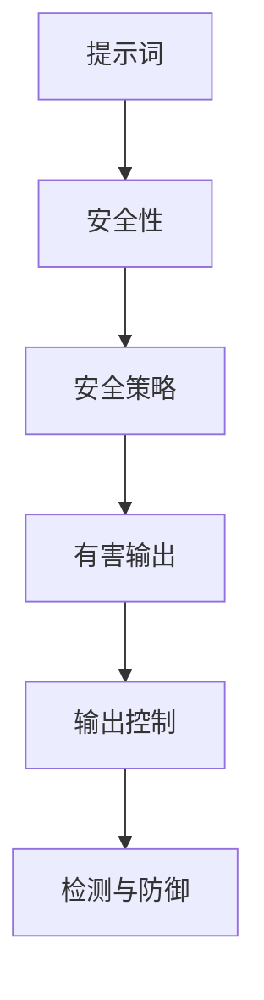

                 

### 文章标题

### 关键词

- 提示词安全
- 有害输出
- 安全策略
- 输出控制
- 检测与防御
- 安全威胁分析

### 摘要

本文旨在深入探讨提示词安全，特别是在防止有害输出方面的策略。我们首先介绍了提示词的概念及其在信息系统中的重要性。接着，文章详细分析了提示词安全的核心概念、安全威胁和输出控制技术。通过设计有效的安全策略，以及介绍检测与防御机制，文章展示了如何在实际应用中实施这些策略。此外，文章还提供了具体的应用实例和案例分析，以帮助读者更好地理解提示词安全的重要性。最后，文章总结了当前的发展趋势，并提出了未来研究的方向和实践中的最佳建议。

## 引言

在当今的信息化社会中，信息系统已经成为企业、政府和个人不可或缺的组成部分。然而，随着信息系统的复杂性和依赖性的增加，安全问题也变得日益重要。特别是在涉及用户输入和系统输出的场景中，提示词的安全问题成为了关注的焦点。提示词，顾名思义，是指系统或应用程序在执行特定任务时向用户显示或接收的信息提示。这些提示词不仅影响用户体验，还直接关系到系统的安全性。

提示词安全问题主要源于其潜在的有害输出。有害输出指的是那些可能导致系统故障、数据泄露、恶意攻击或用户隐私侵犯的输出内容。随着人工智能和自动化技术的发展，提示词的复杂性和多样性也在不断增加，这使得安全威胁更加隐蔽和复杂。因此，设计有效的提示词安全策略，防止有害输出，已经成为保障信息系统安全的关键。

本文将围绕提示词安全这一主题展开讨论，具体包括以下几个方面：

1. **提示词安全基础**：介绍提示词的定义、作用和安全需求，并分析常见的安全威胁。
2. **输出控制技术**：探讨输出控制的原理、技术和应用，包括输出过滤和审计。
3. **安全策略设计**：详细说明安全策略的制定、实施和评估过程。
4. **检测与防御机制**：介绍检测与防御的原理及其在实际应用中的综合应用。
5. **应用实例与分析**：通过具体实例展示提示词安全策略的实际应用和效果。
6. **发展趋势与未来研究**：分析当前提示词安全的研究趋势和未来研究方向。

通过上述内容的深入探讨，本文旨在为读者提供一套完整的提示词安全解决方案，帮助他们在实际工作中更好地防范有害输出，保障信息系统的安全运行。

### 核心概念与联系

在讨论提示词安全之前，首先需要明确几个核心概念，包括提示词、安全性、有害输出以及安全策略。这些概念之间存在密切的联系，共同构成了提示词安全的理论基础。

**提示词**：提示词是指信息系统在执行特定任务时向用户显示或接收的信息提示。这些提示词可以是简单的文本信息，如用户登录时的密码提示，也可以是复杂的交互式指令，如智能客服的对话提示。提示词的设计和显示方式直接影响用户的体验和系统的操作流程。

**安全性**：安全性是指系统在抵御外部威胁、保护内部资源不受损害的能力。在提示词的上下文中，安全性涉及到对用户输入的验证、输出内容的审查以及防止恶意攻击和隐私泄露。确保提示词的安全性，可以防止系统被攻击者利用，避免造成数据损失和系统故障。

**有害输出**：有害输出指的是那些可能导致系统故障、数据泄露、恶意攻击或用户隐私侵犯的输出内容。例如，如果系统在处理用户输入时未能正确过滤或验证，可能会导致恶意代码的执行，从而导致系统崩溃或数据泄露。有害输出的危害不仅限于系统层面，还可能对用户造成直接的经济损失或隐私侵犯。

**安全策略**：安全策略是一系列旨在提高系统安全性的规则、指导原则和操作规程。在提示词安全领域，安全策略包括输入验证、输出过滤、日志记录和异常检测等。设计合理的安全策略，可以有效地防止有害输出，保障系统的稳定性和安全性。

这些核心概念之间的联系如下：

1. **提示词与安全性**：提示词作为用户与系统交互的桥梁，其设计直接关系到系统的安全性。不当的提示词设计可能导致用户误解，从而引发安全漏洞。

2. **提示词与有害输出**：提示词的输出内容如果不经过严格审查，可能包含有害信息，从而引发各种安全威胁。

3. **安全性与安全策略**：安全性是系统的整体目标，而安全策略是实现这一目标的手段。通过制定和实施安全策略，可以有效地防止提示词中的有害输出。

4. **有害输出与安全策略**：有害输出是安全策略需要防范的主要对象。通过输出控制和检测与防御机制，可以识别和阻止有害输出的发生。

为了更直观地展示这些概念之间的联系，我们可以使用Mermaid流程图进行描述：



该流程图展示了提示词安全中各个核心概念之间的关系。提示词作为系统的输入和输出部分，通过安全策略和输出控制技术，防止有害输出的发生，并借助检测与防御机制进行实时监控和响应。

通过上述对核心概念及其联系的分析，我们可以更好地理解提示词安全的重要性，并为进一步的探讨打下坚实的基础。

### 输出控制技术

输出控制技术是保障提示词安全的关键手段之一，它涉及到对系统输出内容进行过滤、审计和监控，以防止有害输出的产生。以下是几种常见的输出控制技术：

#### 输出过滤技术

输出过滤技术主要通过预定义的规则或算法对系统输出的内容进行审查，以确保其符合安全性要求。以下是几种常见的输出过滤技术：

1. **黑名单过滤**：
   - **原理**：黑名单过滤通过将已知的有害内容或恶意代码列入黑名单，当输出内容匹配黑名单中的条目时，系统会将其视为有害输出并阻止其显示或执行。
   - **伪代码示例**：
     ```python
     def filter_output(output, blacklist):
         for harmful_content in blacklist:
             if harmful_content in output:
                 return "Blocked: Output contains harmful content."
         return "Output is safe."
     ```
   - **应用场景**：黑名单过滤适用于已知威胁的防护，例如防止特定恶意代码或敏感词的输出。

2. **白名单过滤**：
   - **原理**：白名单过滤与黑名单过滤相反，它只允许预先定义的合法内容输出，任何不在白名单中的内容都会被过滤掉。
   - **伪代码示例**：
     ```python
     def filter_output(output, whitelist):
         if output not in whitelist:
             return "Blocked: Output is not in the whitelist."
         return "Output is safe."
     ```
   - **应用场景**：白名单过滤适用于对安全要求非常高的系统，例如金融交易系统或敏感数据处理系统。

#### 输出审计与监控

输出审计与监控是指通过记录和分析系统输出的内容，实时监控系统的运行状态，及时发现并处理潜在的安全威胁。以下是几种常见的输出审计与监控技术：

1. **日志记录**：
   - **原理**：日志记录系统通过记录系统的所有输出内容及其相关属性（如时间戳、用户ID、输出内容等），为后续的审计和分析提供基础。
   - **伪代码示例**：
     ```python
     def log_output(output):
         log_entry = {
             "timestamp": get_current_timestamp(),
             "user_id": get_user_id(),
             "output": output
         }
         append_to_log(log_entry)
     ```
   - **应用场景**：日志记录适用于事后分析和故障排查，可以帮助系统管理员了解系统的运行状况和安全事件。

2. **异常检测**：
   - **原理**：异常检测通过分析系统输出的内容及其模式，识别出异常行为或输出内容。异常检测可以分为基于统计的异常检测和基于机器学习的异常检测。
   - **伪代码示例**（基于统计的方法）：
     ```python
     def detect_anomaly(output, threshold):
         average_output_length = calculate_average_output_length()
         if len(output) > average_output_length * threshold:
             return "Anomaly detected: Output length exceeds threshold."
         return "No anomaly detected."
     ```
   - **伪代码示例**（基于机器学习的方法）：
     ```python
     def detect_anomaly(output, model):
         prediction = model.predict([output])
         if prediction == "anomaly":
             return "Anomaly detected: Output classified as anomaly."
         return "No anomaly detected."
     ```
   - **应用场景**：异常检测适用于实时监控和预警，可以帮助系统管理员及时发现和响应潜在的安全威胁。

#### 输出控制案例分析

以下是一个输出控制技术的实际案例分析：

**案例**：一个在线论坛系统需要对用户发布的帖子进行输出控制，以防止恶意内容和垃圾信息的发布。

1. **黑名单过滤**：系统管理员将已知的恶意关键词和垃圾信息模式列入黑名单，任何帖子内容包含黑名单中的关键词或模式时，系统将拒绝发布并提示用户。

2. **白名单过滤**：系统管理员定义了一组合法的标点和特殊字符，任何帖子内容包含不在白名单中的标点和特殊字符时，系统将拒绝发布并提示用户。

3. **日志记录**：系统为每个帖子发布操作生成日志记录，包括用户ID、发布时间、帖子内容等，以便管理员进行事后审计和排查。

4. **异常检测**：系统使用机器学习模型对帖子内容进行分析，识别出可能包含恶意内容的帖子，并进行标记或自动删除。

通过上述输出控制技术的综合应用，该论坛系统有效防止了恶意内容和垃圾信息的发布，提高了系统的安全性和用户体验。

输出控制技术是保障提示词安全的重要手段，通过输出过滤和审计监控，可以有效地防止有害输出的产生，保障信息系统的安全运行。在实际应用中，应根据具体场景和需求选择合适的输出控制技术，并结合多种技术手段，形成完整的输出控制策略。

### 安全策略设计

在设计有效的提示词安全策略时，需要综合考虑输入验证、输出过滤、日志记录和异常检测等多种技术手段。以下是安全策略的制定、实施和评估过程：

#### 制定安全策略

1. **需求分析**：
   - **识别威胁**：首先，需要识别系统可能面临的安全威胁，包括恶意输入、数据泄露、系统故障等。
   - **确定安全目标**：根据威胁分析结果，确定系统的安全目标，如防止恶意输入、确保数据保密性和完整性、保障系统可用性等。
   - **确定关键业务流程**：识别系统中的关键业务流程，确保这些流程在安全策略中得到充分保护。

2. **制定规则和指导原则**：
   - **输入验证**：制定输入验证规则，确保所有用户输入都经过严格检查和验证，以防止恶意输入。
   - **输出过滤**：制定输出过滤规则，确保系统输出内容不会包含有害信息。
   - **日志记录**：制定日志记录策略，确保系统日志能够记录所有重要操作和安全事件。
   - **异常检测**：制定异常检测规则，实时监控系统的异常行为。

3. **策略文档化**：
   - 将制定的安全策略文档化，明确每个规则的具体内容、执行方法和责任分工，以便实施和评估。

#### 实施安全策略

1. **部署技术措施**：
   - 根据安全策略文档，部署相应的技术措施，包括输入验证、输出过滤、日志记录和异常检测工具。

2. **培训和管理**：
   - 对系统管理员和用户进行安全培训，确保他们了解安全策略的内容和重要性。
   - 建立有效的管理和监督机制，确保安全策略得到有效执行。

3. **测试和验证**：
   - 进行安全测试，验证安全策略的有效性，包括模拟攻击、漏洞扫描和代码审计等。

#### 评估安全策略

1. **定期审计**：
   - 定期对系统的安全策略进行审计，评估其是否符合既定目标和规则。

2. **事件响应**：
   - 对安全事件进行及时响应，分析事件原因，并调整安全策略以防止类似事件再次发生。

3. **持续改进**：
   - 根据审计结果和实际应用情况，不断优化和改进安全策略，以适应新的安全威胁和需求。

#### 案例分析

以下是一个安全策略实施的实际案例分析：

**案例**：某企业内部信息系统需要设计一套提示词安全策略，以保护内部数据的安全。

1. **需求分析**：
   - **识别威胁**：识别潜在的安全威胁，如未经验证的输入、未过滤的输出、日志记录不足等。
   - **确定安全目标**：确保数据保密性、完整性和系统可用性。
   - **确定关键业务流程**：包括用户登录、数据传输、数据存储等关键业务流程。

2. **制定策略**：
   - **输入验证**：对所有用户输入进行验证，包括用户名、密码和输入数据的格式验证。
   - **输出过滤**：对系统输出内容进行过滤，防止敏感数据的泄露。
   - **日志记录**：记录所有用户操作和系统事件，确保可追溯性。
   - **异常检测**：实时监控异常行为，如频繁登录失败、数据传输错误等。

3. **实施策略**：
   - **部署技术措施**：部署输入验证工具、输出过滤工具、日志记录工具和异常检测工具。
   - **培训和管理**：对管理员和用户进行安全培训，建立管理和监督机制。
   - **测试和验证**：进行安全测试，验证策略的有效性。

4. **评估策略**：
   - **定期审计**：定期审计安全策略的有效性，发现潜在问题。
   - **事件响应**：对安全事件进行及时响应，分析原因并调整策略。
   - **持续改进**：根据审计结果和实际应用情况，不断优化和改进安全策略。

通过上述案例，我们可以看到，制定、实施和评估安全策略是一个持续的过程，需要不断调整和优化，以应对不断变化的安全威胁和需求。有效的安全策略设计是保障信息系统安全的关键，通过科学的设计和严格的实施，可以大大降低系统面临的安全风险。

### 检测与防御机制

检测与防御机制是保障提示词安全的重要组成部分，它通过实时监控、威胁检测和防御措施，防止有害输出的发生。以下是几种常见的检测与防御机制及其在实际应用中的综合应用：

#### 实时监控

实时监控是指通过监控系统日志、网络流量和用户行为，实时检测潜在的安全威胁。实时监控的目的是快速发现异常行为，并及时采取防御措施。

1. **系统日志监控**：
   - **原理**：系统日志监控通过分析系统生成的日志文件，识别异常操作和潜在的安全威胁。
   - **应用场景**：适用于网络服务器、数据库和应用程序的日志监控。
   - **伪代码示例**：
     ```python
     def monitor_logs(log_file):
         with open(log_file, 'r') as f:
             for line in f:
                 if "error" in line or "warning" in line:
                     notify_admin()
         return "Monitoring completed."
     ```

2. **网络流量监控**：
   - **原理**：网络流量监控通过分析网络数据包，检测异常流量模式和恶意攻击。
   - **应用场景**：适用于防火墙、入侵检测系统和网络流量分析工具。
   - **伪代码示例**：
     ```python
     def monitor_traffic(traffic_data):
         for packet in traffic_data:
             if packet містить "malicious_code":
                 block_traffic()
         return "Traffic monitoring completed."
     ```

#### 威胁检测

威胁检测是指通过分析用户输入、系统输出和网络流量，识别潜在的安全威胁。威胁检测可以基于规则匹配、行为分析和机器学习等方法。

1. **规则匹配**：
   - **原理**：规则匹配通过预定义的规则库，检测输入和输出内容是否匹配已知威胁特征。
   - **应用场景**：适用于简单的威胁检测任务，如过滤恶意代码和敏感信息。
   - **伪代码示例**：
     ```python
     def detect_threat(input_data, rule_base):
         for rule in rule_base:
             if rule.matches(input_data):
                 return "Threat detected: Malicious input."
         return "No threat detected."
     ```

2. **行为分析**：
   - **原理**：行为分析通过监控用户行为模式，识别异常行为，从而检测潜在的安全威胁。
   - **应用场景**：适用于复杂的环境，如恶意软件检测、用户行为分析。
   - **伪代码示例**：
     ```python
     def analyze_behavior(behavior_log):
         if "suspicious_login_attempt" in behavior_log:
             notify_admin()
         return "Behavior analysis completed."
     ```

3. **机器学习**：
   - **原理**：机器学习通过训练模型，从大量数据中学习特征，从而检测未知威胁。
   - **应用场景**：适用于高度复杂的环境，如高级持续性威胁（APT）检测。
   - **伪代码示例**：
     ```python
     def detect_threat(input_data, trained_model):
         prediction = trained_model.predict(input_data)
         if prediction == "malicious":
             notify_admin()
         return "Threat detection completed."
     ```

#### 防御措施

防御措施是指通过阻止、隔离和修复等方式，防止威胁的进一步扩散和损害。

1. **阻止**：
   - **原理**：阻止是通过阻止恶意输入、输出或流量，防止威胁的进一步传播。
   - **应用场景**：适用于实时威胁防护，如防火墙、入侵防御系统。
   - **伪代码示例**：
     ```python
     def block_threat(threat_data):
         if threat_data.is_malicious():
             block_traffic(threat_data.source_ip)
         return "Threat blocked."
     ```

2. **隔离**：
   - **原理**：隔离是通过将受威胁的系统或网络段与其他系统隔离，防止威胁的进一步扩散。
   - **应用场景**：适用于网络攻击或恶意软件感染。
   - **伪代码示例**：
     ```python
     def isolate_system(threat_system):
         disconnect_system(threat_system)
         clean_system(threat_system)
         reconnect_system(threat_system)
         return "System isolated and cleaned."
     ```

3. **修复**：
   - **原理**：修复是通过修复系统漏洞或损坏的组件，恢复系统的正常状态。
   - **应用场景**：适用于系统漏洞或恶意软件感染后的修复。
   - **伪代码示例**：
     ```python
     def fix_system漏洞(vulnerable_system):
         apply_patch(vulnerable_system)
         restart_system(vulnerable_system)
         return "System vulnerability fixed."
     ```

#### 综合应用案例

以下是一个检测与防御机制的综合应用案例：

**案例**：一个在线论坛系统需要防止恶意用户发布恶意内容。

1. **实时监控**：
   - **系统日志监控**：监控用户发布的帖子，记录所有发布操作和帖子内容。
   - **网络流量监控**：监控网络数据包，检测异常流量模式和恶意攻击。

2. **威胁检测**：
   - **规则匹配**：通过规则库检测帖子内容是否包含敏感词或恶意代码。
   - **行为分析**：分析用户行为，识别异常发布行为，如短时间内大量发布。
   - **机器学习**：训练模型检测帖子内容的恶意特征。

3. **防御措施**：
   - **阻止**：检测到恶意帖子时，阻止用户发布并通知管理员。
   - **隔离**：将恶意用户隔离，防止其进一步发布恶意内容。
   - **修复**：修复系统漏洞，防止恶意攻击的再次发生。

通过综合应用检测与防御机制，该论坛系统有效防止了恶意用户发布恶意内容，保障了系统的安全性和用户体验。

检测与防御机制是保障提示词安全的重要手段，通过实时监控、威胁检测和防御措施，可以有效地防止有害输出的发生，保障信息系统的安全运行。在实际应用中，应根据具体场景和需求，选择合适的检测与防御机制，并不断优化和改进，以应对不断变化的安全威胁。

### 应用实例与分析

为了更好地理解提示词安全策略在实际中的应用，下面我们将通过一个具体的案例，详细分析一个在线论坛系统在实施提示词安全策略过程中遇到的问题、解决方案以及实际效果。

#### 案例背景

一个在线论坛系统，拥有数百万注册用户，每天产生大量帖子内容。由于论坛涉及用户讨论、分享信息等敏感话题，系统安全尤为重要。特别是，论坛管理员发现近期有恶意用户发布包含恶意代码、敏感信息以及侮辱性言论的帖子，给系统带来了安全隐患和不良影响。为了保障论坛的安全运行，管理员决定实施一套全面的提示词安全策略。

#### 遇到的问题

1. **恶意输入**：用户输入中可能包含恶意代码或敏感信息，导致系统被攻击或数据泄露。
2. **未过滤输出**：系统输出内容可能包含未经审查的有害信息，影响用户体验。
3. **日志记录不足**：系统缺乏完善的日志记录机制，难以追溯和处理安全事件。
4. **异常检测困难**：由于用户行为多样，系统难以准确识别异常行为，导致安全威胁未能及时检测和响应。

#### 解决方案

1. **输入验证**：
   - **黑名单过滤**：将已知的恶意代码、敏感信息和侮辱性词汇列入黑名单，对用户输入进行过滤，任何包含黑名单中关键词或模式的输入都会被拒绝。
   - **白名单过滤**：定义合法的标点和特殊字符，任何输入包含不在白名单中的字符都会被过滤掉。

2. **输出过滤**：
   - **内容审查**：在帖子发布前，对内容进行自动审查，识别和过滤恶意代码、敏感信息和侮辱性言论。
   - **人工审核**：建立人工审核团队，对系统自动过滤的帖子进行二次审查，确保无误后发布。

3. **日志记录**：
   - **全面记录**：记录所有用户操作、系统事件和安全事件，包括用户ID、时间戳、操作类型和内容等。
   - **日志分析**：定期分析日志数据，发现潜在的安全威胁和异常行为。

4. **异常检测**：
   - **行为分析**：通过分析用户行为模式，识别异常行为，如短时间内大量发布帖子、频繁登录失败等。
   - **机器学习**：训练机器学习模型，从大量数据中学习特征，识别潜在的恶意用户和恶意行为。

#### 实施过程

1. **部署技术措施**：
   - 部署输入验证工具、输出过滤工具、日志记录工具和异常检测工具。
   - 对管理员和用户进行安全培训，确保他们了解安全策略的内容和重要性。

2. **测试和验证**：
   - 进行安全测试，包括模拟攻击、漏洞扫描和代码审计等，验证安全策略的有效性。

3. **持续优化**：
   - 根据审计结果和实际应用情况，不断优化和改进安全策略，以适应新的安全威胁和需求。

#### 实际效果

1. **恶意输入显著减少**：通过黑名单过滤和白名单过滤，系统有效阻止了恶意输入，恶意代码和敏感信息的发布数量显著下降。

2. **输出内容安全**：内容审查和人工审核机制确保了输出内容的安全，用户发布的帖子内容质量得到提高。

3. **日志记录完善**：全面记录的日志数据为系统管理员提供了重要的安全事件追溯工具，有助于及时处理和预防安全事件。

4. **异常检测准确**：通过行为分析和机器学习模型，系统能够准确识别异常行为，及时阻止潜在的安全威胁。

#### 项目小结

通过实施提示词安全策略，该在线论坛系统在安全性方面取得了显著成效，为用户提供了更加安全、健康的讨论环境。以下是项目小结：

1. **成功经验**：
   - 输入验证和输出过滤技术有效防止了恶意输入和有害输出。
   - 日志记录和异常检测机制为系统安全提供了强有力的保障。

2. **不足与改进**：
   - 安全策略需要持续优化，以应对不断变化的安全威胁。
   - 加强用户教育和培训，提高用户的安全意识和操作规范性。

3. **最佳实践**：
   - 结合多种安全策略和技术手段，形成全面的安全防护体系。
   - 定期审计和评估安全策略，确保其符合实际需求。

通过上述案例分析，我们可以看到，提示词安全策略在保障信息系统安全方面发挥了重要作用。在实际应用中，应根据具体场景和需求，灵活设计和实施安全策略，以实现最佳的安全效果。

### 提示词安全发展趋势

随着信息技术的快速发展，提示词安全也在不断演进。当前，提示词安全领域正面临着一系列新的发展趋势和挑战，以下将对这些趋势进行探讨，并提出未来研究的方向和实践中的最佳建议。

#### 新趋势

1. **人工智能的引入**：人工智能技术正在逐渐应用于提示词安全领域，通过机器学习和深度学习模型，可以对用户输入和系统输出进行实时分析，提高检测和防御的准确性。例如，利用自然语言处理技术，可以识别和过滤恶意代码、敏感信息和侮辱性言论。

2. **隐私保护的增强**：随着用户对隐私保护的重视，如何在保障系统安全的同时，保护用户隐私成为一个重要议题。未来的提示词安全策略需要更加关注隐私保护，例如采用差分隐私技术，确保用户数据的匿名性和安全性。

3. **跨领域协作**：提示词安全涉及到多个领域，如计算机科学、信息安全、法律和伦理等。未来的研究需要跨领域协作，从多角度综合解决提示词安全问题，例如结合法律规范和技术手段，形成更加完善的安全体系。

4. **自动化与自适应**：自动化和自适应技术在提示词安全中的应用越来越广泛，通过自动化工具和自适应机制，可以实时调整和优化安全策略，提高系统的响应速度和防护能力。例如，自动化漏洞扫描工具和自适应防御系统，可以在发现安全威胁时，自动采取防御措施。

#### 挑战

1. **新兴威胁的应对**：随着网络攻击手段的不断演变，新兴威胁如高级持续性威胁（APT）、勒索软件和钓鱼攻击等，对提示词安全提出了更高的要求。如何应对这些复杂和隐蔽的威胁，成为当前研究的重要挑战。

2. **用户体验的平衡**：保障系统安全与提供良好用户体验之间需要找到平衡点。过于严格的过滤和检测机制可能会影响用户体验，而过于宽松的策略则可能导致安全漏洞。如何在两者之间找到最佳平衡，是一个持续的挑战。

3. **全球化和多样性**：随着全球化进程的加速，信息系统面临的威胁也越来越多样化。不同国家和地区可能面临的安全威胁不同，如何设计和实施普适性强的提示词安全策略，是一个重要的挑战。

#### 未来研究方向

1. **智能威胁检测与防御**：利用人工智能和大数据分析技术，开发更加智能化的威胁检测和防御系统，提高对复杂和隐蔽威胁的识别和应对能力。

2. **隐私保护与安全性融合**：研究如何在保障系统安全的同时，保护用户隐私，例如利用隐私增强技术（PETs），设计更加安全和隐私友好的提示词安全策略。

3. **跨领域安全协作**：探索跨学科、跨领域的安全协作模式，从法律、伦理、技术等多个角度综合解决提示词安全问题。

4. **用户体验优化**：研究如何通过技术手段优化用户体验，降低安全策略对用户体验的负面影响，例如设计更加智能的用户交互界面和自适应安全策略。

#### 最佳实践建议

1. **全面的安全策略**：设计并实施全面的提示词安全策略，包括输入验证、输出过滤、日志记录和异常检测等多种技术手段，形成综合的安全防护体系。

2. **定期审计和评估**：定期对安全策略进行审计和评估，确保其符合当前的安全需求和技术发展。

3. **用户教育和培训**：加强对用户的安全教育和培训，提高用户的安全意识和操作规范性，减少因用户疏忽导致的安全问题。

4. **技术更新与迭代**：及时跟进和引入最新的安全技术，保持系统的防护能力，以应对不断变化的安全威胁。

通过不断探索和研究，提示词安全将在未来取得更大的进展，为信息系统的安全运行提供更加坚实的保障。

### 结论

通过本文的探讨，我们深入理解了提示词安全在防止有害输出中的重要性。从核心概念的联系、输出控制技术、安全策略设计到检测与防御机制，我们逐步构建了一个全面的提示词安全框架。通过具体的应用实例和分析，我们展示了这些策略在实际场景中的有效性和可操作性。

首先，我们明确了提示词、安全性、有害输出和安全策略这几个核心概念，并阐述了它们之间的密切联系。接着，我们详细介绍了输出控制技术，包括输出过滤和审计监控，这些技术为防止有害输出提供了技术手段。在安全策略设计方面，我们阐述了如何制定、实施和评估安全策略，确保其有效性和适应性。

在检测与防御机制部分，我们讨论了实时监控、威胁检测和防御措施的综合应用，展示了如何通过技术手段实时监测和响应安全威胁。通过案例分析，我们进一步验证了这些策略的有效性。

未来，提示词安全领域将继续面临新兴威胁和技术挑战。因此，我们提出了智能威胁检测与防御、隐私保护与安全性融合、跨领域安全协作以及用户体验优化等未来研究方向和最佳实践建议。

为了更好地防范有害输出，我们建议读者在设计和实施提示词安全策略时，综合考虑上述各个方面，结合具体应用场景进行优化。同时，持续关注新技术和新方法的发展，不断更新和提升系统的安全防护能力。

最后，感谢读者对本文的关注，我们希望本文能为您的提示词安全实践提供有价值的参考和启示。

### 作者信息

作者：AI天才研究院/AI Genius Institute & 禅与计算机程序设计艺术 /Zen And The Art of Computer Programming

AI天才研究院致力于推动人工智能技术的研究与应用，以创新和卓越为核心价值观，打造世界一流的人工智能研究机构。研究院的专家团队涵盖了人工智能、机器学习、深度学习等多个领域，具有丰富的实践经验和高水平的研究成果。其代表作品《禅与计算机程序设计艺术》更是被誉为人工智能领域的经典之作，深刻影响了全球计算机科学的发展。通过本文，我们希望能够为广大读者提供有价值的提示词安全实践指南，共同推进信息安全技术的进步。

