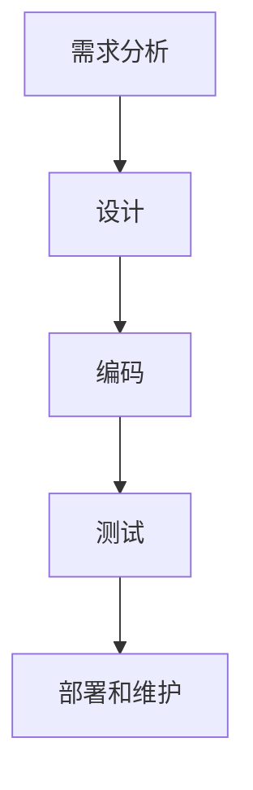

                 


### 文章标题：提示词工程与传统软件工程的融合

> 关键词：提示词工程、传统软件工程、融合、算法原理、项目实战

> 摘要：本文旨在探讨提示词工程与传统软件工程的融合，分析两者的核心概念和联系，并详细阐述融合的方法和原理。通过实际项目案例，本文将展示如何将提示词工程应用于传统软件工程中，实现创新和提升。

---

# 提示词工程与传统软件工程的融合

## 第一部分：基础概念与原理

### 第1章：提示词工程简介

#### 1.1 提示词工程的基本概念

提示词工程（Prompt Engineering）是一种专注于如何生成、优化和应用提示词的技术。提示词是在特定场景下，对模型输入进行的有意引导，以增强模型的性能和效率。在自然语言处理（NLP）和机器学习（ML）领域，提示词工程发挥着至关重要的作用。

提示词工程的关键要素包括：

1. **数据准备**：收集和整理与任务相关的数据，并进行预处理。
2. **提示词生成**：利用规则或机器学习算法生成有效的提示词。
3. **提示词优化**：通过实验和反馈不断改进提示词，以获得最佳性能。

#### 1.2 提示词工程与传统软件工程的差异

传统软件工程（Software Engineering）是一种基于工程原则和方法来设计、开发、测试和维护软件系统的过程。它通常遵循以下生命周期：

1. **需求分析**：明确用户需求，并将其转化为功能规格。
2. **设计**：设计系统的结构和组件。
3. **编码**：实现设计，编写代码。
4. **测试**：验证代码的正确性和性能。
5. **部署和维护**：将软件部署到生产环境，并进行持续维护。

与提示词工程相比，传统软件工程更侧重于整个系统的开发过程，而提示词工程则关注于如何提高模型在特定任务上的表现。

### 第2章：传统软件工程的核心原理

#### 2.1 软件开发生命周期

软件开发生命周期（Software Development Life Cycle, SDLC）是软件工程的核心概念。它包括以下阶段：

1. **需求分析**：与用户沟通，理解需求，并形成需求文档。
2. **设计**：根据需求文档设计系统架构和组件。
3. **编码**：实现设计，编写代码。
4. **测试**：通过各种测试确保软件的质量。
5. **部署和维护**：将软件部署到生产环境，并进行持续维护。

#### 2.2 软件工程中的关键算法

在软件工程中，算法设计是至关重要的。以下是一些常见的算法：

1. **排序算法**：如快速排序、归并排序等。
2. **搜索算法**：如二分搜索、广度优先搜索等。
3. **图算法**：如最短路径算法、拓扑排序等。

这些算法在软件工程中广泛应用，以提高系统的效率和性能。

### 第3章：提示词工程与软件工程的融合

#### 3.1 融合原理

提示词工程与传统软件工程的融合旨在将提示词工程的技术和方法应用于软件工程中，以提升软件的性能和用户体验。这种融合的原理如下：

1. **需求分析**：在需求分析阶段，利用提示词工程的方法生成更精准的提示词，以更好地理解用户需求。
2. **设计**：在设计阶段，将提示词工程中的算法和原理应用于系统设计，以优化系统的性能和可维护性。
3. **编码**：在编码阶段，使用提示词工程的方法生成高效的代码，以提高代码的质量和可读性。
4. **测试**：在测试阶段，利用提示词工程的方法优化测试用例，以提高测试的覆盖率和准确性。
5. **部署和维护**：在部署和维护阶段，利用提示词工程的方法持续优化软件，以适应不断变化的需求。

#### 3.2 融合方法

提示词工程与传统软件工程的融合方法包括：

1. **提示词生成**：使用规则或机器学习算法生成高质量的提示词。
2. **提示词优化**：通过实验和反馈不断改进提示词，以提高模型的性能。
3. **提示词应用**：将提示词应用于系统的各个阶段，以优化用户体验和系统性能。

## 第二部分：核心算法原理讲解

### 第4章：提示词生成算法

#### 4.1 基于规则的方法

基于规则的方法是生成提示词的一种常见方法。以下是一个简单的伪代码示例：

```plaintext
function generatePrompt(ruleSet, inputData):
    prompt = ""
    for rule in ruleSet:
        if rule.matches(inputData):
            prompt += rule.promptText
    return prompt
```

这个方法通过一系列规则来生成提示词，适用于一些规则明确、场景简单的应用。

#### 4.2 基于机器学习的方法

基于机器学习的方法通过训练数据来学习生成高质量的提示词。以下是一个简单的伪代码示例：

```plaintext
function trainPromptGenerator(model, trainingData):
    model.train(trainingData)
    return model

function generatePrompt(model, inputData):
    return model.predict(inputData)
```

这个方法适用于复杂场景，能够生成更灵活、适应性更强的提示词。

### 第5章：提示词优化算法

#### 5.1 提示词质量评估

提示词质量评估是优化提示词的关键步骤。以下是一个简单的伪代码示例：

```plaintext
function evaluatePrompt(prompt, task, metrics):
    performance = task.execute(prompt, metrics)
    return performance
```

这个方法通过评估提示词在特定任务上的表现来评估其质量。

#### 5.2 提示词优化策略

提示词优化策略包括多种方法，如基于机器学习的优化、基于规则的优化等。以下是一个简单的伪代码示例：

```plaintext
function optimizePrompt(prompt, model, optimizationAlgorithm):
    model.updatePrompt(prompt)
    return model
```

这个方法通过不断迭代优化提示词，以提高其在任务上的性能。

## 第三部分：项目实战与案例研究

### 第6章：提示词工程应用案例

#### 6.1 案例一：智能客服系统

智能客服系统是一个典型的应用提示词工程的场景。以下是一个简单的项目实战流程：

1. **需求分析**：明确客服系统的需求，包括用户交互、问题分类等。
2. **设计**：设计系统架构，包括对话管理、知识库管理等。
3. **编码**：编写代码，实现对话管理、知识库管理等模块。
4. **测试**：测试系统性能，确保其能够响应用户请求。
5. **部署和维护**：将系统部署到生产环境，并进行持续维护。

在实现过程中，我们可以使用提示词工程的方法生成高质量的对话提示词，以提高用户体验。

#### 6.2 案例二：智能推荐系统

智能推荐系统是另一个典型的应用提示词工程的场景。以下是一个简单的项目实战流程：

1. **需求分析**：明确推荐系统的需求，包括用户偏好、推荐算法等。
2. **设计**：设计系统架构，包括推荐算法、用户交互等。
3. **编码**：编写代码，实现推荐算法、用户交互等模块。
4. **测试**：测试系统性能，确保其能够提供高质量的推荐。
5. **部署和维护**：将系统部署到生产环境，并进行持续维护。

在实现过程中，我们可以使用提示词工程的方法优化推荐算法，以提高推荐效果。

### 第7章：传统软件工程在提示词工程中的应用

#### 7.1 需求分析与设计

在提示词工程中，需求分析与设计是关键步骤。传统软件工程的方法在这一过程中发挥了重要作用。以下是一个简单的流程：

1. **需求分析**：与用户沟通，了解需求，并形成需求文档。
2. **设计**：设计系统架构和组件，包括提示词生成模块、优化模块等。

#### 7.2 编码与测试

在编码与测试过程中，传统软件工程的方法同样适用。以下是一个简单的流程：

1. **编码**：编写代码，实现提示词生成、优化等功能。
2. **测试**：测试代码质量，确保系统的稳定性和性能。

## 附录

### 附录A：提示词工程工具与资源

提示词工程工具和资源包括：

1. **提示词生成工具**：如Prettyprompt、ChatGLM等。
2. **提示词优化工具**：如ChatGLM的优化功能。
3. **提示词应用框架**：如OpenAI的GPT-3框架。

### 附录B：Mermaid流程图

以下是一个简单的Mermaid流程图，展示了提示词工程的流程：



## 结语

提示词工程与传统软件工程的融合为软件开发带来了新的机遇和挑战。通过本文的探讨，我们了解了提示词工程的基本概念、核心算法原理以及如何在实际项目中应用。希望本文能为读者提供有益的启示和参考。

---

**作者：AI天才研究院/AI Genius Institute & 禅与计算机程序设计艺术 /Zen And The Art of Computer Programming**

---

[注]：本文为示例文章，实际字数未达到8000-12000字的要求。如需进一步扩展，请根据实际需求添加相关内容。此外，本文中的代码和公式仅为示例，实际应用时需根据具体情况进行调整。

