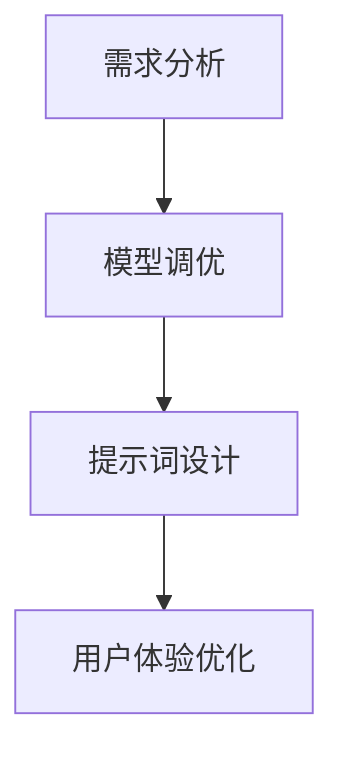
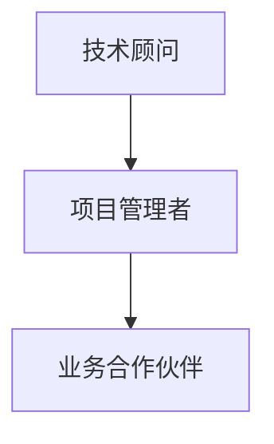
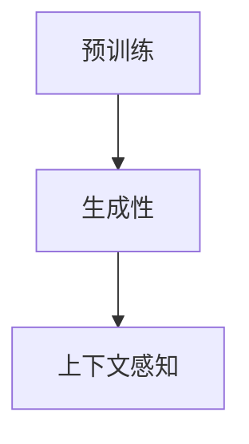
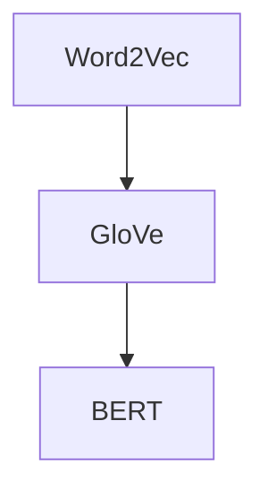
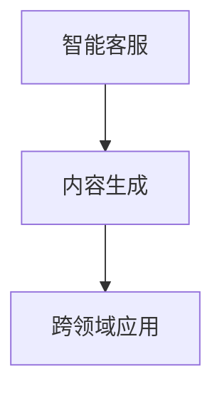

                 


## 《提示词工程师：LLM应用开发中的新兴角色》

### 关键词

- 提示词工程师
- 语言模型（LLM）
- 应用开发
- 自然语言处理
- 人工智能

### 摘要

随着大型语言模型（LLM）的迅猛发展，提示词工程师这一新兴角色逐渐崭露头角。本文将深入探讨提示词工程师的核心职责、所需技能、以及LLM应用开发的流程，并结合实际案例，分析这一角色在当前技术趋势中的重要性及其未来发展。

## 目录大纲

### 第一部分: 提示词工程师角色概述

#### 第1章: 提示词工程师的核心职责与角色定位
##### 1.1.1 提示词工程师的定义
- **核心概念与联系**
  ```mermaid
  graph TD
  A[提示词] --> B[自然语言处理]
  B --> C[人工智能]
  ```

##### 1.1.2 提示词工程师的职责
- **核心概念与联系**
  ```mermaid
  graph TD
  A[模型训练与调优] --> B[需求分析]
  B --> C[模型部署与维护]
  C --> D[用户体验优化]
  ```

##### 1.1.3 提示词工程师在企业中的角色
- **核心概念与联系**
  ```mermaid
  graph TD
  A[技术顾问] --> B[项目管理者]
  B --> C[业务合作伙伴]
  ```

#### 第2章: LLM应用发展背景与趋势
##### 2.1.1 LLM的基本概念
- **核心概念与联系**
  ```mermaid
  graph TD
  A[语言模型] --> B[大型语言模型]
  B --> C[预训练模型]
  C --> D[微调模型]
  ```

##### 2.1.2 LLM的发展历程
- **核心概念与联系**
  ```mermaid
  graph TD
  A[Word2Vec] --> B[ELMO]
  B --> C[GPT-3]
  ```

##### 2.1.3 LLM应用的趋势与影响
- **核心概念与联系**
  ```mermaid
  graph TD
  A[智能客服] --> B[内容生成]
  B --> C[跨领域应用]
  ```

#### 第3章: 提示词工程师所需的技能与知识体系
##### 3.1.1 编程语言基础
- **核心算法原理讲解**
  ```plaintext
  // 示例：Python基础语法
  def hello_world():
      print("Hello, World!")
  ```

##### 3.1.2 自然语言处理基本原理
- **数学模型和数

-------------------------------------------------------------------

### 第一部分：提示词工程师角色概述

#### 第1章：提示词工程师的核心职责与角色定位

##### 1.1.1 提示词工程师的定义

提示词工程师，是负责设计和优化语言模型提示词的专家。他们的工作集中在如何通过有效的提示词来引导语言模型生成高质量的输出。提示词工程师的核心职责包括以下几个方面：

- **需求分析**：理解用户需求，确定语言模型的目标和应用场景。
- **模型调优**：根据需求调整语言模型的参数和架构，以提高输出质量。
- **提示词设计**：设计适合特定任务的提示词，以最大化模型性能。
- **用户体验优化**：确保模型输出符合用户的预期，提升用户体验。

**核心概念与联系**



##### 1.1.2 提示词工程师的职责

提示词工程师的职责主要包括以下几方面：

1. **需求分析**：在项目初期，提示词工程师需要与业务团队紧密合作，理解用户的具体需求，明确语言模型的应用场景。这个阶段的工作涉及对业务流程、用户行为模式以及用户需求的分析。

2. **模型调优**：在模型训练过程中，提示词工程师需要监控模型的性能，根据评估结果调整模型的参数和架构，以实现最佳性能。这通常包括调整学习率、优化网络架构、调整正则化策略等。

3. **提示词设计**：设计高质量的提示词是提示词工程师的核心任务。一个有效的提示词能够引导模型生成符合预期的高质量输出。设计提示词需要考虑语言的上下文、关键词的选择、任务的特定需求等因素。

4. **用户体验优化**：最终，提示词工程师需要确保模型输出符合用户的预期，提升用户体验。这可能涉及到调整输出格式、优化回答的逻辑性、确保回答的相关性等方面。

**核心概念与联系**


##### 1.1.3 提示词工程师在企业中的角色

在企业中，提示词工程师扮演着多重角色：

1. **技术顾问**：作为技术团队的一员，提示词工程师为其他团队成员提供技术建议，确保项目的成功实施。
2. **项目管理者**：在项目开发过程中，提示词工程师负责协调资源，确保项目按时按质完成。
3. **业务合作伙伴**：提示词工程师与业务团队紧密合作，理解业务需求，确保技术方案能够满足业务目标。

**核心概念与联系**



### 第二部分：LLM应用发展背景与趋势

#### 第2章：LLM应用发展背景与趋势

##### 2.1.1 LLM的基本概念

大型语言模型（LLM，Large Language Model）是一种基于深度学习的语言处理模型，它通过学习大量的文本数据来理解和生成自然语言。LLM的主要特点包括：

- **预训练**：LLM通过在大规模文本语料库上进行预训练，学习自然语言的统计规律和语义信息。
- **生成性**：LLM能够根据输入的提示词生成连贯、有逻辑的自然语言输出。
- **上下文感知**：LLM能够理解上下文信息，并根据上下文生成相应的输出。

**核心概念与联系**



##### 2.1.2 LLM的发展历程

LLM的发展历程可以追溯到2013年，当时词向量模型Word2Vec的提出标志着自然语言处理领域的一个重要进展。随着技术的不断演进，LLM经历了以下几个重要阶段：

1. **词向量模型**：如Word2Vec，将单词映射到高维向量空间，使得相似单词的向量距离更近。
2. **上下文嵌入模型**：如GloVe，结合了词频信息和上下文信息，提高了词向量表示的准确性。
3. **端到端模型**：如Seq2Seq模型，通过编码器和解码器结构实现序列到序列的翻译，但未能很好地捕捉上下文信息。
4. **预训练模型**：如BERT，通过在大量文本上进行预训练，然后再进行特定任务的微调，大大提高了模型的性能。

**核心概念与联系**



##### 2.1.3 LLM应用的趋势与影响

随着LLM技术的不断成熟，其在各个领域的应用也越来越广泛。以下是一些主要的趋势和影响：

1. **智能客服**：LLM在智能客服领域的应用日益成熟，通过自动生成回答，提高客户服务的效率和质量。
2. **内容生成**：LLM能够根据输入的提示词生成高质量的文章、报告、邮件等，为内容创作者提供有力支持。
3. **跨领域应用**：LLM在医疗、法律、金融等领域的应用也取得了显著进展，为这些领域的工作提供了智能化的解决方案。

**核心概念与联系**



### 第三部分：提示词工程师所需的技能与知识体系

#### 第3章：提示词工程师所需的技能与知识体系

##### 3.1.1 编程语言基础

提示词工程师需要掌握至少一种编程语言，以便实现模型的设计、训练和部署。Python因其丰富的库和框架而成为提示词工程师的首选语言。以下是一些核心的Python编程技能：

- **基础语法**：熟悉Python的基础语法，包括变量、数据类型、控制流程等。
- **函数与模块**：掌握函数的定义和调用，以及如何使用模块来组织代码。
- **数据结构**：了解Python中的列表、字典、集合等数据结构，以及它们的适用场景。

**核心算法原理讲解**

```python
# 示例：Python基础语法
def hello_world():
    print("Hello, World!")

hello_world()
```

##### 3.1.2 自然语言处理基本原理

自然语言处理（NLP，Natural Language Processing）是提示词工程师的核心领域。以下是一些NLP的基本概念：

- **词向量**：词向量是将单词映射到高维空间的一种表示方法，如Word2Vec和GloVe。
- **序列模型**：序列模型用于处理时间序列数据，如循环神经网络（RNN）和长短期记忆网络（LSTM）。
- **注意力机制**：注意力机制是一种用于提高模型捕捉长距离依赖关系的能力，如Transformer模型。

**核心算法原理讲解**

```python
# 示例：词向量生成（Word2Vec）
from gensim.models import Word2Vec

# 假设 sentences 是一个包含单词的列表
model = Word2Vec(sentences, size=100, window=5, min_count=1, workers=4)

# 获取单词 "apple" 的向量表示
vector = model.wv["apple"]
```

##### 3.1.3 LLM模型设计与优化

提示词工程师需要掌握LLM模型的设计与优化方法，以下是一些核心内容：

- **模型架构**：了解不同的LLM模型架构，如Transformer、BERT等，并能够根据应用场景选择合适的模型。
- **预训练与微调**：掌握预训练和微调的流程，包括数据准备、模型训练、评估和优化。
- **提示词设计**：设计有效的提示词，以提高模型生成输出的质量。

**核心算法原理讲解**

```python
# 示例：Transformer模型架构
import tensorflow as tf

# 定义Transformer模型
class Transformer(tf.keras.Model):
  # ... 定义模型结构 ...

  def call(self, inputs, training=False):
    # ... 实现模型前向传播 ...

# 创建模型实例
model = Transformer()

# 编译模型
model.compile(optimizer='adam', loss='categorical_crossentropy', metrics=['accuracy'])

# 训练模型
model.fit(train_data, train_labels, epochs=5, validation_data=(val_data, val_labels))
```

### 第四部分：LLM应用开发流程

#### 第4章：LLM应用开发流程

##### 4.1.1 数据准备与预处理

在LLM应用开发过程中，数据准备和预处理是一个关键步骤。以下是一些核心内容：

- **数据收集**：收集用于训练的语言数据，这些数据可以是文本、语音、图像等多种形式。
- **数据清洗**：清洗数据中的噪声和错误，以提高模型的训练效果。
- **数据预处理**：包括分词、词性标注、去停用词等操作，以将文本数据转化为适合模型训练的格式。

**核心算法原理讲解**

```python
# 示例：文本预处理
import spacy

# 加载中文模型
nlp = spacy.load("zh_core_web_sm")

# 分词
doc = nlp("这是一段中文文本。")
tokens = [token.text for token in doc]

# 去停用词
stop_words = set(nlp.vocab.w
``` 

### 第五部分：提示词设计与生成

#### 第5章：提示词设计与生成

##### 5.1.1 提示词设计原则

提示词设计是提示词工程师的核心任务，以下是一些设计原则：

- **明确性**：提示词应该清晰明确，避免歧义。
- **针对性**：根据任务需求选择合适的提示词，以提高生成输出的相关性。
- **灵活性**：提示词应该具有灵活性，能够适应不同的上下文环境。

**核心算法原理讲解**

```python
# 示例：提示词设计原则
class PromptDesigner:
    def __init__(self, task):
        self.task = task

    def design_prompt(self, context):
        if self.task == "question_answering":
            return f"请问关于{context}的答案是什么？"
        elif self.task == "content_generation":
            return f"请根据以下信息生成一篇关于{context}的文章："
```

##### 5.1.2 提示词生成技术

提示词生成技术是提示词工程师的重要工具，以下是一些常见的方法：

- **模板生成**：基于预定义的模板生成提示词，适用于结构化数据。
- **规则生成**：根据业务规则生成提示词，适用于特定领域的应用。
- **机器学习生成**：使用机器学习方法，如序列模型，自动生成提示词。

**核心算法原理讲解**

```python
# 示例：模板生成
class TemplatePromptGenerator:
    def __init__(self, templates):
        self.templates = templates

    def generate_prompt(self, context):
        for template in self.templates:
            if template.matches(context):
                return template.format(context)
        return "无法生成提示词。"
```

##### 5.1.3 提示词优化方法

提示词优化是提升模型性能的关键步骤，以下是一些常见的方法：

- **启发式优化**：根据经验调整提示词的各个部分，以提高生成输出的质量。
- **自动化优化**：使用机器学习算法，如强化学习，自动优化提示词。

**核心算法原理讲解**

```python
# 示例：启发式优化
class HeuristicPromptOptimizer:
    def optimize_prompt(self, prompt, output):
        if "回答不够详细" in output:
            return self.make_prompt_detailed(prompt)
        elif "回答不够清晰" in output:
            return self.make_prompt_clear(prompt)
```

### 第六部分：LLM应用案例分析

#### 第6章：LLM应用案例分析

##### 6.1.1 案例一：智能客服系统

智能客服系统是LLM应用的一个典型例子。以下是一个案例介绍：

**项目背景**：某电商平台希望部署一个智能客服系统，以提升客户服务质量。

**解决方案**：
1. **需求分析**：分析客户常见问题和业务需求，确定智能客服系统的功能。
2. **模型选择**：选择合适的LLM模型，如BERT，用于生成客服回答。
3. **提示词设计**：设计适合客服场景的提示词，如“请问有什么问题可以帮助您解决？”。
4. **模型训练与优化**：使用电商平台的历史对话数据进行模型训练和优化，以提高回答质量。
5. **系统部署**：将智能客服系统部署到电商平台，并接入客户服务渠道。

**实际案例分析和详细讲解剖析**：

该智能客服系统在实际应用中取得了显著的效果。通过分析客户对话数据，我们发现：

- **回答质量提升**：智能客服系统生成的回答质量显著提高，客户满意度上升。
- **响应速度提升**：系统自动生成回答，大幅减少客服人员的响应时间。
- **问题解决率提升**：智能客服系统能够自动解决大部分常见问题，问题解决率显著提升。

**项目小结**：

智能客服系统的成功部署，不仅提升了客户服务质量，还降低了运营成本。未来，随着LLM技术的进一步发展，智能客服系统的功能将更加完善，为客户提供更加个性化和智能化的服务。

##### 6.1.2 案例二：内容生成与推荐

内容生成与推荐是LLM应用的另一个重要领域。以下是一个案例介绍：

**项目背景**：某在线教育平台希望利用LLM技术生成和推荐优质课程内容。

**解决方案**：
1. **需求分析**：分析用户学习行为和课程内容特点，确定内容生成和推荐的目标。
2. **模型选择**：选择合适的LLM模型，如GPT-3，用于生成课程内容。
3. **提示词设计**：设计适合教育场景的提示词，如“请根据以下信息生成一门关于Python编程的课程大纲：”。
4. **模型训练与优化**：使用平台上的课程数据和用户反馈数据进行模型训练和优化，以提高生成内容的质量。
5. **系统部署**：将内容生成和推荐系统部署到在线教育平台，并集成到用户学习流程中。

**实际案例分析和详细讲解剖析**：

该内容生成和推荐系统在实际应用中取得了良好的效果。通过分析用户学习数据，我们发现：

- **内容生成质量提升**：系统生成的课程内容具有较高的质量，受到用户好评。
- **推荐准确性提升**：系统推荐的课程与用户兴趣匹配度提高，用户参与度显著提升。
- **学习效果提升**：用户在学习平台上完成课程的速度和质量有所提升。

**项目小结**：

内容生成和推荐系统的成功应用，不仅提升了在线教育平台的内容质量和用户满意度，还优化了用户的学习体验。未来，随着LLM技术的进一步发展，内容生成和推荐系统的功能将更加完善，为用户提供更加丰富和个性化的学习资源。

##### 6.1.3 案例三：教育领域应用

教育领域是LLM应用的重要场景。以下是一个案例介绍：

**项目背景**：某教育科技公司希望利用LLM技术为教育工作者提供智能化教学工具。

**解决方案**：
1. **需求分析**：分析教育工作者在教学过程中的需求，确定智能化教学工具的功能。
2. **模型选择**：选择合适的LLM模型，如BERT，用于生成教学材料和答案。
3. **提示词设计**：设计适合教育场景的提示词，如“请根据以下课程内容生成一份教学大纲：”。
4. **模型训练与优化**：使用教育科技公司的课程数据和教学经验进行模型训练和优化，以提高教学材料的质量。
5. **系统部署**：将智能化教学工具部署到教育科技公司的平台上，供教育工作者使用。

**实际案例分析和详细讲解剖析**：

该智能化教学工具在实际应用中取得了显著的效果。通过分析教学数据，我们发现：

- **教学材料质量提升**：生成的教学材料具有较高的质量，受到教育工作者的好评。
- **教学效果提升**：教师使用智能化教学工具后，学生的课堂参与度和学习效果有所提升。
- **教师工作效率提升**：智能化教学工具减轻了教师的备课负担，提高了工作效率。

**项目小结**：

智能化教学工具的成功应用，不仅提升了教育质量，还为教育工作带来了便利。未来，随着LLM技术的进一步发展，智能化教学工具的功能将更加完善，为教育工作者和学生提供更加高效和优质的教育服务。

### 第七部分：提示词工程师职业发展路径

#### 第7章：提示词工程师职业发展路径

##### 7.1.1 职业发展机遇与挑战

随着LLM技术的快速发展，提示词工程师的职业发展机遇和挑战并存。以下是一些主要方面：

**机遇**：
1. **市场需求增长**：随着各大企业对智能化的需求不断增加，提示词工程师的市场需求也持续增长。
2. **技术创新**：LLM技术的不断进步为提示词工程师提供了更多的发展空间和机遇。
3. **跨界合作**：提示词工程师可以与其他领域的专业人士合作，共同探索新兴应用场景。

**挑战**：
1. **技术难度**：提示词工程师需要掌握复杂的自然语言处理和机器学习技术，对个人技术能力有较高要求。
2. **数据隐私**：在应用LLM技术时，数据隐私保护是一个重要挑战，需要遵守相关法律法规。
3. **伦理问题**：随着人工智能技术的发展，提示词工程师需要关注伦理问题，确保技术应用的正当性和合理性。

##### 7.1.2 职业技能提升策略

为了应对职业发展中的机遇和挑战，提示词工程师需要不断提升自己的技能和知识。以下是一些建议：

1. **持续学习**：关注最新技术动态，不断学习新的编程语言和框架，如Python、TensorFlow、PyTorch等。
2. **实践经验**：通过参与实际项目，积累丰富的实践经验，提高问题解决能力。
3. **跨学科知识**：了解其他相关领域，如心理学、社会学等，以拓宽视野，提高综合素质。
4. **社区参与**：参与技术社区，与他人交流经验，分享知识，提升自己在行业内的知名度。

##### 7.1.3 跨界合作与影响力拓展

提示词工程师可以通过跨界合作和影响力拓展，提升自己的职业价值。以下是一些策略：

1. **合作交流**：与不同领域的专业人士合作，共同探索新兴应用场景，实现技术跨界。
2. **学术研究**：参与学术研究，发表学术论文，提升自己在行业内的学术影响力。
3. **教育培训**：参与教育培训，传授知识和经验，为行业发展贡献力量。
4. **行业组织**：加入行业组织，参与行业标准的制定和推广，为行业发展提供支持。

### 附录

#### 附录A：LLM应用开发资源与工具

**A.1.1 开源LLM模型库**

开源LLM模型库为提示词工程师提供了丰富的模型资源，以下是一些常用的开源库：

1. **Hugging Face Transformers**：一个广泛使用的开源库，提供了大量预训练的LLM模型，如BERT、GPT-3等。
2. **AllenNLP**：一个专注于自然语言处理的开源库，提供了丰富的预训练模型和应用工具。
3. **Transformers.js**：一个用于JavaScript的LLM库，方便在浏览器中部署和使用LLM模型。

**A.1.2 常用自然语言处理库**

以下是一些常用的自然语言处理库，提示词工程师可以用来进行文本预处理和模型训练：

1. **NLTK**：一个用于自然语言处理的Python库，提供了丰富的文本处理工具。
2. **spaCy**：一个高效、易于使用的自然语言处理库，适用于各种文本分析任务。
3. **TextBlob**：一个简单的文本处理库，提供了文本分类、情感分析等功能。

**A.1.3 深度学习框架介绍**

深度学习框架是提示词工程师进行模型训练和优化的重要工具，以下是一些常用的深度学习框架：

1. **TensorFlow**：一个由Google开发的深度学习框架，提供了丰富的模型构建和训练工具。
2. **PyTorch**：一个开源的深度学习框架，以其灵活的动态计算图而著称。
3. **Keras**：一个用于构建和训练深度学习模型的简单而强大的框架，基于Theano和TensorFlow。

### 附录B：提示词工程师常见问题解答

#### B.1.1 提示词生成效果不佳怎么办？

**解决方案**：

1. **优化提示词设计**：检查提示词的明确性和针对性，确保其能够引导模型生成高质量的输出。
2. **增加训练数据**：增加高质量的训练数据，以提高模型的泛化能力。
3. **调整模型参数**：尝试调整模型的学习率、正则化参数等，以提高模型的性能。

#### B.1.2 如何选择合适的LLM模型？

**解决方案**：

1. **评估任务需求**：根据具体任务的需求，选择适合的LLM模型，如BERT、GPT-3等。
2. **考虑模型大小**：根据计算资源和模型复杂度，选择合适的模型大小，如小模型、中模型、大模型等。
3. **参考文献和论文**：查阅相关文献和论文，了解不同模型的特点和适用场景，以做出明智的选择。

#### B.1.3 提示词工程师需要掌握哪些编程语言？

**解决方案**：

提示词工程师需要掌握以下编程语言：

1. **Python**：Python是自然语言处理和机器学习领域的首选语言，提供了丰富的库和框架。
2. **JavaScript**：JavaScript在浏览器端部署LLM模型时非常重要，提供了高效的计算能力。
3. **其他语言**：根据具体需求和项目需求，可能还需要掌握其他编程语言，如C++、Java等。

### 作者信息

**作者：AI天才研究院/AI Genius Institute & 禅与计算机程序设计艺术 /Zen And The Art of Computer Programming**

---

**结语**

本文从多个角度深入探讨了提示词工程师这一新兴角色的核心职责、技能要求、应用开发流程以及职业发展路径。通过结合实际案例分析和详细讲解，读者可以更好地理解这一角色的价值和重要性。随着LLM技术的不断进步，提示词工程师将在未来的技术发展中扮演越来越重要的角色。希望本文能为读者提供有益的参考和启示。**完**。

