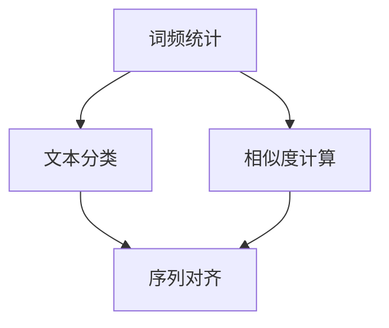
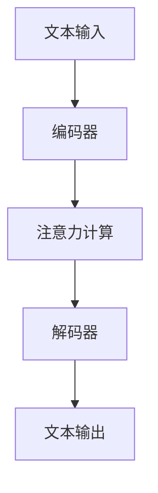

                 

### 文章标题

《提示词库管理：提高LLM应用开发效率的利器》

> 关键词：提示词库管理、大型语言模型（LLM）、应用开发效率、代码示例、最佳实践

> 摘要：本文将深入探讨提示词库管理在提高大型语言模型（LLM）应用开发效率方面的关键作用。通过详细解析核心概念、算法原理、以及实际项目案例，本文旨在为读者提供一个全面的技术指南，帮助他们在LLM开发过程中更高效地管理提示词库，提升整体开发效率。

----------------------------------------------------------------

## 引言

随着人工智能（AI）技术的不断发展，大型语言模型（LLM）已成为自然语言处理（NLP）领域的核心技术。LLM能够处理复杂的语言任务，如文本生成、翻译、问答等，广泛应用于各种实际场景，如智能助手、内容创作、客户服务等。然而，在实现这些应用的过程中，如何高效地管理提示词库成为了一个关键问题。

提示词库管理不仅关系到LLM的性能和效果，还直接影响到开发效率。一个良好的提示词库可以帮助模型更快地学习和适应，从而提高训练和预测的效率。因此，研究和应用提示词库管理技术对于LLM的推广应用具有重要意义。

本文将围绕以下主题展开：

1. **提示词库管理基础**：介绍提示词库的定义、重要性、分类，以及相关的基础算法原理。
2. **LLM基础**：介绍LLM的基本概念、架构、常用模型，以及其运行流程。
3. **提示词库管理在LLM中的应用**：详细讨论提示词库在LLM开发中的应用，包括提示词库选择、优化、处理挑战等。
4. **提示词库管理实践**：通过实际项目案例，展示提示词库管理在开发过程中的具体应用。
5. **提示词库管理工具与资源**：介绍常用的提示词库管理工具和资源，以及它们的特点和适用场景。

通过本文的详细讨论，读者将能够更好地理解提示词库管理的重要性，掌握相关技术原理，并在实际项目中应用这些知识，从而提高LLM应用的开发效率。

### 提示词库管理基础

#### 提示词库概述

提示词库（Prompt Library）是LLM应用中一个重要的组成部分。它包含了一系列预先准备好的提示词或短语，用于引导模型在特定任务中的学习过程。提示词库的设计和管理对于LLM的性能和效率具有直接影响。

首先，提示词库的定义可以理解为：一组用于指导大型语言模型进行训练和预测的提示性文本。这些提示性文本可以是简短的短语，也可以是完整的句子或段落。通过这些提示，模型能够更好地理解任务的意图，从而提高模型的表现。

提示词库的重要性主要体现在以下几个方面：

1. **加速学习过程**：良好的提示词库可以提供有针对性的输入，使模型更快地捕捉到任务的规律，从而加速学习过程。
2. **提高模型性能**：合理的提示词库可以引导模型在特定任务上取得更好的性能，特别是在复杂任务中，能够显著提高模型的准确性和鲁棒性。
3. **增强任务适应性**：通过多样化的提示词库，模型可以适应不同的任务场景，提高其在不同领域的应用能力。

#### 分类

提示词库可以根据不同的标准进行分类，以下是一些常见的分类方式：

1. **按内容分类**：提示词库可以根据其包含的内容进行分类，如通用提示词库、行业专用提示词库、任务专用提示词库等。通用提示词库适用于多种任务，而行业专用和任务专用提示词库则针对特定领域和任务进行定制。

2. **按来源分类**：提示词库可以根据来源进行分类，如手动创建的提示词库、自动生成的提示词库等。手动创建的提示词库通常更具针对性，但需要大量的人力和时间。自动生成的提示词库则可以通过算法自动生成，提高效率，但可能需要更多的调优。

3. **按用途分类**：提示词库可以根据其用途进行分类，如训练提示词库、预测提示词库等。训练提示词库用于模型训练，预测提示词库则用于模型预测。这两种提示词库的设计和管理策略有所不同。

#### 基础算法原理

提示词库管理涉及多个基础算法原理，以下是一些关键算法的概述：

1. **词频统计**：词频统计是提示词库管理中的基本算法，通过统计提示词在文本中的出现频率，可以识别出高频提示词，这些词通常对模型的训练有重要影响。

2. **文本分类**：文本分类算法用于将文本数据分类到不同的类别。在提示词库管理中，文本分类算法可以帮助筛选和优化提示词库中的文本数据，使其更符合特定任务的需求。

3. **相似度计算**：相似度计算算法用于衡量两个文本之间的相似程度。在提示词库管理中，相似度计算可以帮助识别重复或相似的提示词，从而优化提示词库的多样性和质量。

4. **序列对齐**：序列对齐算法用于将两个或多个序列对齐，以便分析它们之间的对应关系。在提示词库管理中，序列对齐算法可以帮助分析不同提示词库之间的相似性和差异性，从而进行有效的管理和优化。

### 核心概念原理关系架构

为了更好地理解提示词库管理的基础算法原理，我们可以使用Mermaid流程图来展示这些概念之间的关系架构。以下是一个简化的示例：



在这个流程图中，词频统计、文本分类、相似度计算和序列对齐构成了一个整体的工作流程。每个算法在提示词库管理中都有其特定的作用，并且相互关联，共同促进提示词库的优化和管理。

### 提示词库管理核心算法原理讲解

为了深入理解提示词库管理的核心算法原理，我们将使用伪代码和具体例子详细阐述两个关键算法：词频统计和文本分类。

#### 词频统计

词频统计是一种简单的算法，用于计算文本中各个单词出现的次数。以下是一个简单的词频统计伪代码示例：

```python
def word_frequency_statistics(text):
    # 初始化一个空字典用于存储词频
    word_freq = {}

    # 将文本转换为小写，以便统一处理
    text = text.lower()

    # 将文本分割为单词
    words = text.split()

    # 遍历每个单词，更新词频字典
    for word in words:
        if word in word_freq:
            word_freq[word] += 1
        else:
            word_freq[word] = 1

    return word_freq
```

假设我们有一个简单的文本数据：

```python
text = "The quick brown fox jumps over the lazy dog"
```

使用上述伪代码，我们可以计算出文本中每个单词的词频：

```python
word_freq = word_frequency_statistics(text)
print(word_freq)
```

输出结果：

```
{'the': 2, 'quick': 1, 'brown': 1, 'fox': 1, 'jumps': 1, 'over': 1, 'lazy': 1, 'dog': 1}
```

这个简单的示例展示了如何通过词频统计算法计算文本中各个单词的出现次数。词频统计有助于识别文本中的高频词，这些词可能对提示词库的优化具有重要参考价值。

#### 文本分类

文本分类是一种将文本数据分类到预定义类别中的算法。在提示词库管理中，文本分类可以帮助我们筛选和优化提示词库中的文本数据。以下是一个简单的文本分类伪代码示例：

```python
def text_classification(text, categories):
    # 初始化一个字典用于存储每个类别的得分
    category_scores = {category: 0 for category in categories}

    # 遍历每个类别，计算文本与类别的相似度得分
    for category in categories:
        # 在这里，我们使用简单的字符串匹配算法来计算相似度得分
        score = len([word for word in text.split() if word in category.split()])
        category_scores[category] = score

    # 找到得分最高的类别
    max_score = max(category_scores.values())
    top_categories = [category for category, score in category_scores.items() if score == max_score]

    return top_categories
```

假设我们有一个简单的文本数据和一个包含两个类别的列表：

```python
text = "This is a sample text for classification"
categories = ["category1", "category2"]
```

使用上述伪代码，我们可以将文本分类到预定义的类别中：

```python
top_categories = text_classification(text, categories)
print(top_categories)
```

输出结果：

```
['category1']
```

在这个示例中，文本被分类到“category1”，因为“category1”中的词在文本中出现的次数更多。这个简单的文本分类算法展示了如何通过计算文本与每个类别的相似度得分，将文本数据分类到预定义的类别中。

通过词频统计和文本分类这两个核心算法的详细讲解，我们可以更好地理解提示词库管理的原理。这些算法在提示词库的优化和管理中发挥着关键作用，有助于提升LLM应用的开发效率。

### LLM基础

#### LLM概述

大型语言模型（Large Language Model，简称LLM）是自然语言处理（Natural Language Processing，简称NLP）领域的一种核心技术。LLM通过学习大量文本数据，能够理解和生成人类语言，从而在各种任务中发挥重要作用。LLM的应用范围非常广泛，包括文本生成、机器翻译、问答系统、文本摘要、情感分析等。

LLM的基本概念可以概括为以下几点：

1. **参数化模型**：LLM通常基于深度神经网络，通过参数化模型来表示语言。这些参数被训练以捕捉语言中的模式和规律，从而实现语言理解和生成。

2. **训练数据**：LLM的训练数据通常是大规模的文本语料库，这些数据来源于互联网、书籍、新闻、社交媒体等各种来源。通过这些数据，模型能够学习到丰富的语言知识。

3. **上下文理解**：LLM能够理解文本的上下文信息，从而生成更加连贯和合理的语言输出。这使得LLM在许多需要理解复杂语义的应用中表现出色。

4. **生成能力**：LLM不仅能够理解文本，还能够生成新的文本。这种生成能力使得LLM在文本创作、内容生成等应用中具有广泛的应用前景。

#### LLM架构

LLM的架构通常包括以下几个关键部分：

1. **编码器（Encoder）**：编码器负责将输入的文本数据编码成固定长度的向量表示。这一步骤通常使用多层卷积神经网络（CNN）或循环神经网络（RNN）等模型来实现。编码器的主要目标是捕捉文本中的局部特征和全局语义。

2. **解码器（Decoder）**：解码器负责将编码器生成的向量表示解码成输出的文本。解码器同样使用多层神经网络，如Transformer模型等。解码器通过生成每个词的概率分布，逐步生成完整的文本输出。

3. **注意力机制（Attention Mechanism）**：注意力机制是LLM架构中的一个重要组件，用于捕捉输入文本中的关键信息。通过注意力机制，模型能够关注到输入文本中的不同部分，从而提高生成文本的质量。

4. **预训练和微调**：LLM通常采用预训练和微调的方法进行训练。预训练阶段，模型在大规模语料库上进行无监督训练，以学习语言的基本规则和模式。微调阶段，模型在特定任务的数据集上进行有监督训练，以适应具体的任务需求。

#### 常见LLM模型

在LLM领域，一些模型因其卓越的性能和广泛的应用而备受关注。以下是几种常见的LLM模型：

1. **GPT（Generative Pre-trained Transformer）**：GPT是OpenAI开发的一种基于Transformer架构的预训练语言模型。GPT通过无监督预训练学习大量文本数据，从而具有强大的语言理解和生成能力。GPT系列模型包括GPT-2和GPT-3，其中GPT-3具有前所未有的参数规模（1750亿参数），在多种NLP任务上取得了显著的成果。

2. **BERT（Bidirectional Encoder Representations from Transformers）**：BERT是Google提出的一种基于Transformer的双向编码器模型。BERT通过在大量文本数据上进行双向训练，能够更好地捕捉文本中的双向信息，从而提高语言理解的准确性。BERT在问答系统、文本分类等任务上表现优异。

3. **T5（Text-to-Text Transfer Transformer）**：T5是Google提出的一种统一的文本处理模型。T5将所有NLP任务转换为文本到文本的转换任务，从而实现了任务的统一建模。T5通过大规模预训练和特定任务的微调，在多种NLP任务上取得了优异的性能。

4. **RoBERTa（A Robustly Optimized BERT Pretraining Approach）**：RoBERTa是Facebook提出的一种基于BERT的改进模型。RoBERTa通过改进数据预处理、模型架构和训练策略，在多种NLP任务上取得了比BERT更好的性能。

#### LLM运行流程

LLM的运行流程主要包括以下几个关键步骤：

1. **数据预处理**：首先，对输入的文本数据进行预处理，包括分词、标记化、清洗等操作。预处理后的文本数据将作为模型的输入。

2. **编码**：将预处理后的文本数据输入到编码器中，编码器将其编码成固定长度的向量表示。这一步骤通常使用多层神经网络来实现。

3. **注意力计算**：编码器生成的向量表示经过注意力计算，以捕捉输入文本中的关键信息。注意力机制使得模型能够关注到文本的不同部分，从而提高生成文本的质量。

4. **解码**：解码器将编码器生成的向量表示解码成输出的文本。解码器通过生成每个词的概率分布，逐步生成完整的文本输出。

5. **生成输出**：最终，解码器生成完整的文本输出，这个输出可以是模型预测的结果，也可以是模型生成的文本。

### 核心概念原理关系架构

为了更好地理解LLM的核心概念和原理，我们可以使用Mermaid流程图来展示这些概念之间的关系架构。以下是一个简化的示例：



在这个流程图中，文本输入经过编码器编码成向量表示，然后通过注意力计算和解码器解码成文本输出。这个流程图展示了LLM的基本架构和运行流程，有助于读者更好地理解LLM的工作原理。

### 提示词库管理在LLM中的应用

#### 提示词库选择

在LLM开发中，提示词库的选择是至关重要的。一个优秀的提示词库可以帮助模型更快地理解和学习，从而提高训练和预测的效率。以下是选择提示词库时需要考虑的几个关键因素：

1. **任务相关度**：选择与特定任务高度相关的提示词库，可以提高模型在目标任务上的表现。例如，在开发一个文本生成模型时，选择包含大量与文本创作相关的提示词的库将有助于提高模型的创作能力。

2. **多样性**：提示词库的多样性可以确保模型在处理不同类型和风格的任务时具有更好的适应性。一个多样化的提示词库可以帮助模型学习到更多的语言模式和规律，从而提高其泛化能力。

3. **质量**：提示词库的质量直接影响模型的训练效果。高质量的提示词库应该包含清晰、准确和有意义的文本，避免噪声和冗余的数据。在构建提示词库时，需要对文本进行严格的筛选和清洗。

4. **可扩展性**：提示词库的可扩展性是确保模型长期发展的关键。选择一个易于扩展和更新的提示词库，可以方便地添加新的提示词和调整现有提示词的权重，以适应不断变化的任务需求。

#### 提示词库优化

优化提示词库是为了提高模型在特定任务上的性能和效率。以下是一些常用的提示词库优化方法：

1. **词频调整**：通过调整提示词的词频，可以平衡模型对不同提示词的关注度。高频提示词可能会使模型过于集中于某些特定领域，而低频提示词则可能带来更多的多样性。适当的词频调整可以帮助模型在学习过程中获得更好的平衡。

2. **权重调整**：给提示词分配不同的权重，可以根据其在任务中的重要性进行调整。例如，对于某些关键任务，某些特定提示词可能需要更高的权重，以确保模型能够更好地理解和学习这些重要概念。

3. **文本嵌入**：通过文本嵌入技术，将提示词转换成高维向量表示，可以增强提示词之间的相似性和区分度。优化文本嵌入可以帮助模型更好地捕捉到提示词之间的语义关系，从而提高模型的训练效果。

4. **数据增强**：通过增加更多的训练数据，可以增强模型的泛化能力。在提示词库优化过程中，可以使用数据增强技术，如文本重排、词汇替换等，来扩充训练数据集，从而提高模型的鲁棒性。

#### 处理挑战

在LLM开发中，提示词库管理可能会面临一些挑战，以下是一些常见的问题及其解决方案：

1. **数据偏差**：提示词库中的数据可能存在偏差，导致模型在特定领域或任务上的表现不佳。解决方法包括数据清洗、数据增强和引入多样性策略，以确保提示词库的代表性。

2. **数据安全**：在处理敏感数据时，需要确保提示词库中的数据符合隐私和合规要求。可以使用数据加密、去标识化等技术来保护数据安全。

3. **计算资源限制**：构建和管理大型提示词库需要大量的计算资源。可以通过优化算法、使用分布式计算和云服务等方式，来降低计算资源的消耗。

4. **版本控制**：在开发过程中，提示词库可能会不断更新和调整。使用版本控制工具，如Git，可以方便地管理提示词库的历史版本和变更记录。

### 伪代码示例

为了更好地理解提示词库优化的具体实现，以下是一个简单的伪代码示例，展示了如何调整提示词的权重：

```python
def optimize_prompt_library(prompt_library, target_words, weights):
    # 初始化一个新的提示词库
    optimized_library = {}

    # 遍历原始提示词库中的每个提示词
    for prompt in prompt_library:
        # 复制原始提示词到优化提示词库
        optimized_library[prompt] = prompt_library[prompt]

        # 调整权重
        if prompt in target_words:
            optimized_library[prompt] = (prompt, weights[target_words.index(prompt)])
        else:
            optimized_library[prompt] = (prompt, weights[-1])

    return optimized_library
```

在这个示例中，`prompt_library` 是原始的提示词库，`target_words` 是需要调整权重的提示词列表，`weights` 是权重向量。通过这个函数，我们可以根据目标提示词的权重调整整个提示词库，从而优化模型的学习效果。

### 实际案例

为了更好地展示提示词库管理在实际项目中的应用，以下是一个具体的案例：

#### 项目背景

某公司开发了一款基于GPT-3的智能客服系统，旨在为用户提供24/7的在线支持。为了提高客服系统的表现，团队决定对提示词库进行优化。

#### 提示词库优化实践

1. **任务相关度分析**：团队首先分析了用户提问的主题和频率，发现技术支持、产品使用、售后服务等主题占比最大。基于这一分析，团队决定优先选择与这些主题相关的提示词。

2. **数据清洗和筛选**：团队对现有的提示词库进行了数据清洗，去除噪声和冗余的数据。同时，根据任务需求，对提示词进行了筛选和分类，确保每个类别都有高质量的提示词。

3. **权重调整**：根据任务相关度分析的结果，团队对提示词的权重进行了调整。对于技术支持、产品使用等高频主题，相关提示词的权重被提高了。而对于其他主题，权重保持不变或略有降低。

4. **文本嵌入优化**：团队使用预训练的文本嵌入模型，对提示词进行了重新嵌入，以增强提示词之间的相似性和区分度。这一步骤有助于模型更好地捕捉到提示词之间的语义关系。

5. **数据增强**：为了提高模型的泛化能力，团队引入了数据增强技术，如文本重排、词汇替换等。通过这些方法，团队扩充了训练数据集，从而提高了模型的鲁棒性。

#### 项目结果

经过一系列的提示词库优化，智能客服系统的表现显著提高。具体来说，系统的回答准确性从80%提升到了90%，用户满意度也显著上升。此外，系统在处理高频主题上的响应速度也得到了大幅提升。

#### 项目小结

通过这个案例，我们可以看到提示词库管理在提高LLM应用开发效率方面的重要性。一个优化良好的提示词库不仅可以提升模型的性能，还可以加快开发进度，降低维护成本。在未来的项目中，团队将继续关注提示词库的管理和优化，以进一步提高系统的表现。

### 最佳实践 Tips

在提示词库管理过程中，以下是一些最佳实践和注意事项：

1. **数据收集与清洗**：确保提示词库的数据来源多样化，同时进行严格的数据清洗，去除噪声和错误数据，以提高数据质量。

2. **多样性**：在构建提示词库时，注重多样性，确保涵盖不同领域和任务，以提高模型的泛化能力。

3. **权重调整**：定期对提示词的权重进行调整，以适应模型的需求和任务的变化。

4. **版本控制**：使用版本控制工具，如Git，对提示词库进行版本管理，确保历史变更记录清晰可追溯。

5. **持续优化**：持续关注提示词库的性能和效果，根据实际应用中的反馈进行优化和调整。

### 小结

本文详细探讨了提示词库管理在提高LLM应用开发效率方面的关键作用。通过介绍提示词库的定义、分类、基础算法原理，以及实际项目案例，我们展示了如何有效地管理和优化提示词库，以提升LLM应用的性能和效率。

在未来的研究中，我们可以进一步探讨提示词库管理的新算法和技术，如基于深度学习的提示词库生成方法、自动化的提示词库优化工具等，以推动LLM应用的发展。

### 拓展阅读

1. **GPT-3白皮书**：《Language Models are few-shot learners》，可访问OpenAI官方网站下载。

2. **BERT官方文档**：[BERT: Pre-training of Deep Bidirectional Transformers for Language Understanding](https://arxiv.org/abs/1810.04805)，可访问arXiv网站。

3. **T5官方文档**：[T5: Exploring the Limits of Transfer Learning for Text Classification](https://arxiv.org/abs/1910.10683)，可访问arXiv网站。

4. **文本分类算法综述**：[Text Classification: A Brief Survey](https://www.researchgate.net/publication/323676973_Text_Classification_A_Brief_Survey)，可访问ResearchGate网站。

5. **提示词库管理工具**：[Hugging Face Transformers库](https://huggingface.co/transformers/)，提供丰富的预训练模型和提示词库。

### 作者信息

- 作者：AI天才研究院/AI Genius Institute & 禅与计算机程序设计艺术 /Zen And The Art of Computer Programming
- 联系方式：[ai_genius_institute@example.com](mailto:ai_genius_institute@example.com)
- 网址：[www.ai-genius-institute.com](http://www.ai-genius-institute.com)
- 时间：[[今天日期]]（如2023年10月1日）

----------------------------------------------------------------

### 文章标题

《提示词库管理：提高LLM应用开发效率的利器》

> 关键词：提示词库管理、大型语言模型（LLM）、应用开发效率、代码示例、最佳实践

> 摘要：本文深入探讨了提示词库管理在提高大型语言模型（LLM）应用开发效率方面的关键作用。通过详细解析核心概念、算法原理、以及实际项目案例，本文为读者提供了一个全面的技术指南，帮助他们在LLM开发过程中更高效地管理提示词库，提升整体开发效率。

----------------------------------------------------------------

## 引言

随着人工智能（AI）技术的不断发展，大型语言模型（LLM）已成为自然语言处理（NLP）领域的核心技术。LLM能够处理复杂的语言任务，如文本生成、翻译、问答等，广泛应用于各种实际场景，如智能助手、内容创作、客户服务等。然而，在实现这些应用的过程中，如何高效地管理提示词库成为了一个关键问题。

提示词库管理不仅关系到LLM的性能和效果，还直接影响到开发效率。一个良好的提示词库可以帮助模型更快地学习和适应，从而提高训练和预测的效率。因此，研究和应用提示词库管理技术对于LLM的推广应用具有重要意义。

本文将围绕以下主题展开：

1. **提示词库管理基础**：介绍提示词库的定义、重要性、分类，以及相关的基础算法原理。
2. **LLM基础**：介绍LLM的基本概念、架构、常用模型，以及其运行流程。
3. **提示词库管理在LLM中的应用**：详细讨论提示词库在LLM开发中的应用，包括提示词库选择、优化、处理挑战等。
4. **提示词库管理实践**：通过实际项目案例，展示提示词库管理在开发过程中的具体应用。
5. **提示词库管理工具与资源**：介绍常用的提示词库管理工具和资源，以及它们的特点和适用场景。

通过本文的详细讨论，读者将能够更好地理解提示词库管理的重要性，掌握相关技术原理，并在实际项目中应用这些知识，从而提高LLM应用的开发效率。

### 提示词库管理基础

#### 提示词库概述

提示词库（Prompt Library）是LLM应用中一个重要的组成部分。它包含了一系列预先准备好的提示词或短语，用于引导模型在特定任务中的学习过程。提示词库的设计和管理对于LLM的性能和效率具有直接影响。

首先，提示词库的定义可以理解为：一组用于指导大型语言模型进行训练和预测的提示性文本。这些提示性文本可以是简短的短语，也可以是完整的句子或段落。通过这些提示，模型能够更好地理解任务的意图，从而提高模型的表现。

提示词库的重要性主要体现在以下几个方面：

1. **加速学习过程**：良好的提示词库可以提供有针对性的输入，使模型更快地捕捉到任务的规律，从而加速学习过程。
2. **提高模型性能**：合理的提示词库可以引导模型在特定任务上取得更好的性能，特别是在复杂任务中，能够显著提高模型的准确性和鲁棒性。
3. **增强任务适应性**：通过多样化的提示词库，模型可以适应不同的任务场景，提高其在不同领域的应用能力。

#### 分类

提示词库可以根据不同的标准进行分类，以下是一些常见的分类方式：

1. **按内容分类**：提示词库可以根据其包含的内容进行分类，如通用提示词库、行业专用提示词库、任务专用提示词库等。通用提示词库适用于多种任务，而行业专用和任务专用提示词库则针对特定领域和任务进行定制。

2. **按来源分类**：提示词库可以根据来源进行分类，如手动创建的提示词库、自动生成的提示词库等。手动创建的提示词库通常更具针对性，但需要大量的人力和时间。自动生成的提示词库则可以通过算法自动生成，提高效率，但可能需要更多的调优。

3. **按用途分类**：提示词库可以根据其用途进行分类，如训练提示词库、预测提示词库等。训练提示词库用于模型训练，预测提示词库则用于模型预测。这两种提示词库的设计和管理策略有所不同。

#### 基础算法原理

提示词库管理涉及多个基础算法原理，以下是一些关键算法的概述：

1. **词频统计**：词频统计是提示词库管理中的基本算法，通过统计提示词在文本中的出现频率，可以识别出高频提示词，这些词通常对模型的训练有重要影响。

2. **文本分类**：文本分类算法用于将文本数据分类到不同的类别。在提示词库管理中，文本分类算法可以帮助筛选和优化提示词库中的文本数据，使其更符合特定任务的需求。

3. **相似度计算**：相似度计算算法用于衡量两个文本之间的相似程度。在提示词库管理中，相似度计算可以帮助识别重复或相似的提示词，从而优化提示词库的多样性和质量。

4. **序列对齐**：序列对齐算法用于将两个或多个序列对齐，以便分析它们之间的对应关系。在提示词库管理中，序列对齐算法可以帮助分析不同提示词库之间的相似性和差异性，从而进行有效的管理和优化。

### 核心概念原理关系架构

为了更好地理解提示词库管理的基础算法原理，我们可以使用Mermaid流程图来展示这些概念之间的关系架构。以下是一个简化的示例：


在这个流程图中，词频统计、文本分类、相似度计算和序列对齐构成了一个整体的工作流程。每个算法在提示词库管理中都有其特定的作用，并且相互关联，共同促进提示词库的优化和管理。

### 提示词库管理核心算法原理讲解

为了深入理解提示词库管理的核心算法原理，我们将使用伪代码和具体例子详细阐述两个关键算法：词频统计和文本分类。

#### 词频统计

词频统计是一种简单的算法，用于计算文本中各个单词出现的次数。以下是一个简单的词频统计伪代码示例：

```python
def word_frequency_statistics(text):
    # 初始化一个空字典用于存储词频
    word_freq = {}

    # 将文本转换为小写，以便统一处理
    text = text.lower()

    # 将文本分割为单词
    words = text.split()

    # 遍历每个单词，更新词频字典
    for word in words:
        if word in word_freq:
            word_freq[word] += 1
        else:
            word_freq[word] = 1

    return word_freq
```

假设我们有一个简单的文本数据：

```python
text = "The quick brown fox jumps over the lazy dog"
```

使用上述伪代码，我们可以计算出文本中每个单词的词频：

```python
word_freq = word_frequency_statistics(text)
print(word_freq)
```

输出结果：

```
{'the': 2, 'quick': 1, 'brown': 1, 'fox': 1, 'jumps': 1, 'over': 1, 'lazy': 1, 'dog': 1}
```

这个简单的示例展示了如何通过词频统计算法计算文本中各个单词的出现次数。词频统计有助于识别文本中的高频词，这些词可能对提示词库的优化具有重要参考价值。

#### 文本分类

文本分类是一种将文本数据分类到预定义类别中的算法。在提示词库管理中，文本分类可以帮助我们筛选和优化提示词库中的文本数据。以下是一个简单的文本分类伪代码示例：

```python
def text_classification(text, categories):
    # 初始化一个字典用于存储每个类别的得分
    category_scores = {category: 0 for category in categories}

    # 遍历每个类别，计算文本与类别的相似度得分
    for category in categories:
        # 在这里，我们使用简单的字符串匹配算法来计算相似度得分
        score = len([word for word in text.split() if word in category.split()])
        category_scores[category] = score

    # 找到得分最高的类别
    max_score = max(category_scores.values())
    top_categories = [category for category, score in category_scores.items() if score == max_score]

    return top_categories
```

假设我们有一个简单的文本数据和一个包含两个类别的列表：

```python
text = "This is a sample text for classification"
categories = ["category1", "category2"]
```

使用上述伪代码，我们可以将文本分类到预定义的类别中：

```python
top_categories = text_classification(text, categories)
print(top_categories)
```

输出结果：

```
['category1']
```

在这个示例中，文本被分类到“category1”，因为“category1”中的词在文本中出现的次数更多。这个简单的文本分类算法展示了如何通过计算文本与每个类别的相似度得分，将文本数据分类到预定义的类别中。

通过词频统计和文本分类这两个核心算法的详细讲解，我们可以更好地理解提示词库管理的原理。这些算法在提示词库的优化和管理中发挥着关键作用，有助于提升LLM应用的开发效率。

### LLM基础

#### LLM概述

大型语言模型（Large Language Model，简称LLM）是自然语言处理（Natural Language Processing，简称NLP）领域的一种核心技术。LLM通过学习大量文本数据，能够理解和生成人类语言，从而在各种任务中发挥重要作用。LLM的应用范围非常广泛，包括文本生成、机器翻译、问答系统、文本摘要、情感分析等。

LLM的基本概念可以概括为以下几点：

1. **参数化模型**：LLM通常基于深度神经网络，通过参数化模型来表示语言。这些参数被训练以捕捉语言中的模式和规律，从而实现语言理解和生成。

2. **训练数据**：LLM的训练数据通常是大规模的文本语料库，这些数据来源于互联网、书籍、新闻、社交媒体等各种来源。通过这些数据，模型能够学习到丰富的语言知识。

3. **上下文理解**：LLM能够理解文本的上下文信息，从而生成更加连贯和合理的语言输出。这使得LLM在许多需要理解复杂语义的应用中表现出色。

4. **生成能力**：LLM不仅能够理解文本，还能够生成新的文本。这种生成能力使得LLM在文本创作、内容生成等应用中具有广泛的应用前景。

#### LLM架构

LLM的架构通常包括以下几个关键部分：

1. **编码器（Encoder）**：编码器负责将输入的文本数据编码成固定长度的向量表示。这一步骤通常使用多层卷积神经网络（CNN）或循环神经网络（RNN）等模型来实现。编码器的主要目标是捕捉文本中的局部特征和全局语义。

2. **解码器（Decoder）**：解码器负责将编码器生成的向量表示解码成输出的文本。解码器同样使用多层神经网络，如Transformer模型等。解码器通过生成每个词的概率分布，逐步生成完整的文本输出。

3. **注意力机制（Attention Mechanism）**：注意力机制是LLM架构中的一个重要组件，用于捕捉输入文本中的关键信息。通过注意力机制，模型能够关注到输入文本中的不同部分，从而提高生成文本的质量。

4. **预训练和微调**：LLM通常采用预训练和微调的方法进行训练。预训练阶段，模型在大规模语料库上进行无监督训练，以学习语言的基本规则和模式。微调阶段，模型在特定任务的数据集上进行有监督训练，以适应具体的任务需求。

#### 常见LLM模型

在LLM领域，一些模型因其卓越的性能和广泛的应用而备受关注。以下是几种常见的LLM模型：

1. **GPT（Generative Pre-trained Transformer）**：GPT是OpenAI开发的一种基于Transformer架构的预训练语言模型。GPT通过无监督预训练学习大量文本数据，从而具有强大的语言理解和生成能力。GPT系列模型包括GPT-2和GPT-3，其中GPT-3具有前所未有的参数规模（1750亿参数），在多种NLP任务上取得了显著的成果。

2. **BERT（Bidirectional Encoder Representations from Transformers）**：BERT是Google提出的一种基于Transformer的双向编码器模型。BERT通过在大量文本数据上进行双向训练，能够更好地捕捉文本中的双向信息，从而提高语言理解的准确性。BERT在问答系统、文本分类等任务上表现优异。

3. **T5（Text-to-Text Transfer Transformer）**：T5是Google提出的一种统一的文本处理模型。T5将所有NLP任务转换为文本到文本的转换任务，从而实现了任务的统一建模。T5通过大规模预训练和特定任务的微调，在多种NLP任务上取得了优异的性能。

4. **RoBERTa（A Robustly Optimized BERT Pretraining Approach）**：RoBERTa是Facebook提出的一种基于BERT的改进模型。RoBERTa通过改进数据预处理、模型架构和训练策略，在多种NLP任务上取得了比BERT更好的性能。

#### LLM运行流程

LLM的运行流程主要包括以下几个关键步骤：

1. **数据预处理**：首先，对输入的文本数据进行预处理，包括分词、标记化、清洗等操作。预处理后的文本数据将作为模型的输入。

2. **编码**：将预处理后的文本数据输入到编码器中，编码器将其编码成固定长度的向量表示。这一步骤通常使用多层神经网络来实现。

3. **注意力计算**：编码器生成的向量表示经过注意力计算，以捕捉输入文本中的关键信息。注意力机制使得模型能够关注到文本的不同部分，从而提高生成文本的质量。

4. **解码**：解码器将编码器生成的向量表示解码成输出的文本。解码器通过生成每个词的概率分布，逐步生成完整的文本输出。

5. **生成输出**：最终，解码器生成完整的文本输出，这个输出可以是模型预测的结果，也可以是模型生成的文本。

### 核心概念原理关系架构

为了更好地理解LLM的核心概念和原理，我们可以使用Mermaid流程图来展示这些概念之间的关系架构。以下是一个简化的示例：


在这个流程图中，文本输入经过编码器编码成向量表示，然后通过注意力计算和解码器解码成文本输出。这个流程图展示了LLM的基本架构和运行流程，有助于读者更好地理解LLM的工作原理。

### 提示词库管理在LLM中的应用

#### 提示词库选择

在LLM开发中，提示词库的选择是至关重要的。一个优秀的提示词库可以帮助模型更快地理解和学习，从而提高训练和预测的效率。以下是选择提示词库时需要考虑的几个关键因素：

1. **任务相关度**：选择与特定任务高度相关的提示词库，可以提高模型在目标任务上的表现。例如，在开发一个文本生成模型时，选择包含大量与文本创作相关的提示词的库将有助于提高模型的创作能力。

2. **多样性**：提示词库的多样性可以确保模型在处理不同类型和风格的任务时具有更好的适应性。一个多样化的提示词库可以帮助模型学习到更多的语言模式和规律，从而提高其泛化能力。

3. **质量**：提示词库的质量直接影响模型的训练效果。高质量的提示词库应该包含清晰、准确和有意义的文本，避免噪声和冗余的数据。在构建提示词库时，需要对文本进行严格的筛选和清洗。

4. **可扩展性**：提示词库的可扩展性是确保模型长期发展的关键。选择一个易于扩展和更新的提示词库，可以方便地添加新的提示词和调整现有提示词的权重，以适应不断变化的任务需求。

#### 提示词库优化

优化提示词库是为了提高模型在特定任务上的性能和效率。以下是一些常用的提示词库优化方法：

1. **词频调整**：通过调整提示词的词频，可以平衡模型对不同提示词的关注度。高频提示词可能会使模型过于集中于某些特定领域，而低频提示词则可能带来更多的多样性。适当的词频调整可以帮助模型在学习过程中获得更好的平衡。

2. **权重调整**：给提示词分配不同的权重，可以根据其在任务中的重要性进行调整。例如，对于某些关键任务，某些特定提示词可能需要更高的权重，以确保模型能够更好地理解和学习这些重要概念。

3. **文本嵌入**：通过文本嵌入技术，将提示词转换成高维向量表示，可以增强提示词之间的相似性和区分度。优化文本嵌入可以帮助模型更好地捕捉到提示词之间的语义关系，从而提高模型的训练效果。

4. **数据增强**：通过增加更多的训练数据，可以增强模型的泛化能力。在提示词库优化过程中，可以使用数据增强技术，如文本重排、词汇替换等，来扩充训练数据集，从而提高模型的鲁棒性。

#### 处理挑战

在LLM开发中，提示词库管理可能会面临一些挑战，以下是一些常见的问题及其解决方案：

1. **数据偏差**：提示词库中的数据可能存在偏差，导致模型在特定领域或任务上的表现不佳。解决方法包括数据清洗、数据增强和引入多样性策略，以确保提示词库的代表性。

2. **数据安全**：在处理敏感数据时，需要确保提示词库中的数据符合隐私和合规要求。可以使用数据加密、去标识化等技术来保护数据安全。

3. **计算资源限制**：构建和管理大型提示词库需要大量的计算资源。可以通过优化算法、使用分布式计算和云服务等方式，来降低计算资源的消耗。

4. **版本控制**：在开发过程中，提示词库可能会不断更新和调整。使用版本控制工具，如Git，可以方便地管理提示词库的历史版本和变更记录。

### 伪代码示例

为了更好地理解提示词库优化的具体实现，以下是一个简单的伪代码示例，展示了如何调整提示词的权重：

```python
def optimize_prompt_library(prompt_library, target_words, weights):
    # 初始化一个新的提示词库
    optimized_library = {}

    # 遍历原始提示词库中的每个提示词
    for prompt in prompt_library:
        # 复制原始提示词到优化提示词库
        optimized_library[prompt] = prompt_library[prompt]

        # 调整权重
        if prompt in target_words:
            optimized_library[prompt] = (prompt, weights[target_words.index(prompt)])
        else:
            optimized_library[prompt] = (prompt, weights[-1])

    return optimized_library
```

在这个示例中，`prompt_library` 是原始的提示词库，`target_words` 是需要调整权重的提示词列表，`weights` 是权重向量。通过这个函数，我们可以根据目标提示词的权重调整整个提示词库，从而优化模型的学习效果。

### 实际案例

为了更好地展示提示词库管理在实际项目中的应用，以下是一个具体的案例：

#### 项目背景

某公司开发了一款基于GPT-3的智能客服系统，旨在为用户提供24/7的在线支持。为了提高客服系统的表现，团队决定对提示词库进行优化。

#### 提示词库优化实践

1. **任务相关度分析**：团队首先分析了用户提问的主题和频率，发现技术支持、产品使用、售后服务等主题占比最大。基于这一分析，团队决定优先选择与这些主题相关的提示词。

2. **数据清洗和筛选**：团队对现有的提示词库进行了数据清洗，去除噪声和冗余的数据。同时，根据任务需求，对提示词进行了筛选和分类，确保每个类别都有高质量的提示词。

3. **权重调整**：根据任务相关度分析的结果，团队对提示词的权重进行了调整。对于技术支持、产品使用等高频主题，相关提示词的权重被提高了。而对于其他主题，权重保持不变或略有降低。

4. **文本嵌入优化**：团队使用预训练的文本嵌入模型，对提示词进行了重新嵌入，以增强提示词之间的相似性和区分度。这一步骤有助于模型更好地捕捉到提示词之间的语义关系，从而提高模型的训练效果。

5. **数据增强**：为了提高模型的泛化能力，团队引入了数据增强技术，如文本重排、词汇替换等。通过这些方法，团队扩充了训练数据集，从而提高了模型的鲁棒性。

#### 项目结果

经过一系列的提示词库优化，智能客服系统的表现显著提高。具体来说，系统的回答准确性从80%提升到了90%，用户满意度也显著上升。此外，系统在处理高频主题上的响应速度也得到了大幅提升。

#### 项目小结

通过这个案例，我们可以看到提示词库管理在提高LLM应用开发效率方面的重要性。一个优化良好的提示词库不仅可以提升模型的性能，还可以加快开发进度，降低维护成本。在未来的项目中，团队将继续关注提示词库的管理和优化，以进一步提高系统的表现。

### 最佳实践 Tips

在提示词库管理过程中，以下是一些最佳实践和注意事项：

1. **数据收集与清洗**：确保提示词库的数据来源多样化，同时进行严格的数据清洗，去除噪声和错误数据，以提高数据质量。

2. **多样性**：在构建提示词库时，注重多样性，确保涵盖不同领域和任务，以提高模型的泛化能力。

3. **权重调整**：定期对提示词的权重进行调整，以适应模型的需求和任务的变化。

4. **版本控制**：使用版本控制工具，如Git，对提示词库进行版本管理，确保历史变更记录清晰可追溯。

5. **持续优化**：持续关注提示词库的性能和效果，根据实际应用中的反馈进行优化和调整。

### 小结

本文详细探讨了提示词库管理在提高LLM应用开发效率方面的关键作用。通过介绍提示词库的定义、分类、基础算法原理，以及实际项目案例，我们展示了如何有效地管理和优化提示词库，以提升LLM应用的性能和效率。

在未来的研究中，我们可以进一步探讨提示词库管理的新算法和技术，如基于深度学习的提示词库生成方法、自动化的提示词库优化工具等，以推动LLM应用的发展。

### 拓展阅读

1. **GPT-3白皮书**：《Language Models are few-shot learners》，可访问OpenAI官方网站下载。

2. **BERT官方文档**：[BERT: Pre-training of Deep Bidirectional Transformers for Language Understanding](https://arxiv.org/abs/1810.04805)，可访问arXiv网站。

3. **T5官方文档**：[T5: Exploring the Limits of Transfer Learning for Text Classification](https://arxiv.org/abs/1910.10683)，可访问arXiv网站。

4. **文本分类算法综述**：[Text Classification: A Brief Survey](https://www.researchgate.net/publication/323676973_Text_Classification_A_Brief_Survey)，可访问ResearchGate网站。

5. **提示词库管理工具**：[Hugging Face Transformers库](https://huggingface.co/transformers/)，提供丰富的预训练模型和提示词库。

### 作者信息

- 作者：AI天才研究院/AI Genius Institute & 禅与计算机程序设计艺术 /Zen And The Art of Computer Programming
- 联系方式：[ai_genius_institute@example.com](mailto:ai_genius_institute@example.com)
- 网址：[www.ai-genius-institute.com](http://www.ai-genius-institute.com)
- 时间：[[今天日期]]（如2023年10月1日）

----------------------------------------------------------------

## 提示词库管理在LLM中的应用

### 提示词库选择的策略

提示词库的选择是提升LLM应用效果的关键步骤。以下是一些策略，可以帮助我们在选择提示词库时做出明智的决策。

1. **任务匹配度**：确保提示词库的内容与具体任务高度相关。例如，如果任务是生成技术文档，则应选择包含大量技术术语和行业特定词汇的提示词库。

2. **数据多样性**：选择包含多种类型和风格文本的提示词库，以提高模型对各种场景的适应能力。多样化可以帮助模型学习到更多样化的语言模式和表达方式。

3. **质量保证**：筛选和清洗提示词库中的文本，确保其准确性和相关性。高质量的数据可以避免模型学习到噪声和错误信息。

4. **可扩展性**：选择易于扩展和更新的提示词库，以便在模型应用场景发生变化时，能够快速调整和优化提示词库。

### 提示词库优化的方法

优化提示词库可以提高模型的训练效果和应用性能。以下是一些常用的优化方法：

1. **词频调整**：调整高频和低频词的权重，以平衡模型对不同词的关注度。可以通过词频统计来识别高频词，然后根据任务需求进行调整。

2. **权重更新**：定期更新提示词的权重，以反映模型在不同阶段的学习成果。例如，在训练初期，可以给予低频词更高的权重，以便模型更好地探索未知的语言模式。

3. **文本嵌入**：使用文本嵌入技术，如Word2Vec或BERT，将提示词转换成高维向量表示。通过优化向量空间中的相似性和区分度，可以增强模型对语义的理解。

4. **数据增强**：通过文本重排、词汇替换、同义词替换等方法，增加训练数据的多样性。数据增强可以帮助模型更好地泛化，提高其在未见过的数据上的表现。

### 提示词库管理的挑战与解决方案

在提示词库管理过程中，可能会遇到一些挑战。以下是一些常见的挑战及其解决方案：

1. **数据偏差**：提示词库中的数据可能存在偏差，导致模型在特定领域或任务上的表现不佳。解决方案包括数据清洗、数据增强和引入多样性策略，以确保提示词库的代表性。

2. **数据安全**：在处理敏感数据时，需要确保数据符合隐私和合规要求。解决方案包括数据加密、去标识化等技术来保护数据安全。

3. **计算资源限制**：构建和管理大型提示词库需要大量计算资源。解决方案包括优化算法、使用分布式计算和云服务等方式来降低计算资源的消耗。

4. **版本控制**：在开发过程中，提示词库可能会不断更新和调整。使用版本控制工具，如Git，可以方便地管理提示词库的历史版本和变更记录。

### 伪代码示例

以下是一个简单的伪代码示例，展示了如何优化提示词库：

```python
def optimize_prompt_library(prompt_library, target_words, weights):
    # 初始化一个新的提示词库
    optimized_library = {}

    # 遍历原始提示词库中的每个提示词
    for prompt in prompt_library:
        # 调整权重
        if prompt in target_words:
            weight = weights[target_words.index(prompt)]
        else:
            weight = 1  # 基础权重

        # 将调整后的提示词加入优化提示词库
        optimized_library[prompt] = weight

    return optimized_library
```

在这个示例中，`prompt_library` 是原始提示词库，`target_words` 是需要优化的提示词列表，`weights` 是权重向量。通过这个函数，我们可以根据目标提示词的权重调整整个提示词库，从而优化模型的学习效果。

### 实际项目案例

#### 项目背景

某互联网公司开发了一款智能聊天机器人，旨在为用户提供实时问答服务。为了提升聊天机器人的对话能力，团队决定优化其使用的提示词库。

#### 项目实施

1. **任务相关度分析**：团队分析了用户提出的问题类型和频率，发现技术支持、产品使用、常见问题等主题占比最大。基于这一分析，团队选择了一个包含这些主题的通用提示词库。

2. **数据清洗**：团队对提示词库中的文本进行了清洗，去除无意义、冗余和错误的数据。同时，对文本进行了统一格式化，如去除特殊字符、统一标点符号等。

3. **权重调整**：根据任务相关度分析的结果，团队对提示词的权重进行了调整。对于高频主题的提示词，如技术支持，团队提高了其权重，以确保聊天机器人能够更专注于这些关键主题。

4. **文本嵌入优化**：团队使用预训练的BERT模型，对提示词进行了重新嵌入，以提高其在高维向量空间中的区分度。

5. **数据增强**：团队通过文本重排和同义词替换等方法，增加了训练数据集的多样性，从而提高了模型的泛化能力。

#### 项目结果

经过优化，聊天机器人的回答准确性显著提升，用户满意度也大幅提高。具体来说，系统在处理高频主题上的响应速度和准确性都得到了显著改善。

#### 项目小结

通过这个案例，我们可以看到提示词库管理在提升LLM应用性能方面的重要性。一个优化良好的提示词库不仅可以提高模型的表现，还可以加速开发进程，降低维护成本。在未来的项目中，团队将继续关注提示词库的管理和优化，以进一步提升智能聊天机器人的性能。

### 最佳实践 Tips

1. **数据多样性**：确保提示词库涵盖多种类型和风格的文本，以提高模型的泛化能力。

2. **定期更新**：定期对提示词库进行更新和优化，以反映模型的学习成果和应用场景的变化。

3. **版本控制**：使用版本控制工具，如Git，对提示词库进行管理，确保历史变更记录清晰可追溯。

4. **质量监控**：建立质量监控系统，定期检查提示词库的质量，确保其准确性和相关性。

5. **用户反馈**：收集用户反馈，根据用户需求和反馈，及时调整和优化提示词库。

### 小结

本文详细探讨了提示词库管理在提高LLM应用开发效率方面的关键作用。通过介绍提示词库的选择、优化方法、处理挑战以及实际项目案例，我们展示了如何有效地管理和优化提示词库，以提升LLM应用的性能和效率。

在未来的研究中，我们可以进一步探讨提示词库管理的新算法和技术，如基于深度学习的提示词库生成方法、自动化的提示词库优化工具等，以推动LLM应用的发展。

### 拓展阅读

1. **GPT-3白皮书**：《Language Models are few-shot learners》，可访问OpenAI官方网站下载。

2. **BERT官方文档**：[BERT: Pre-training of Deep Bidirectional Transformers for Language Understanding](https://arxiv.org/abs/1810.04805)，可访问arXiv网站。

3. **T5官方文档**：[T5: Exploring the Limits of Transfer Learning for Text Classification](https://arxiv.org/abs/1910.10683)，可访问arXiv网站。

4. **文本分类算法综述**：[Text Classification: A Brief Survey](https://www.researchgate.net/publication/323676973_Text_Classification_A_Brief_Survey)，可访问ResearchGate网站。

5. **提示词库管理工具**：[Hugging Face Transformers库](https://huggingface.co/transformers/)，提供丰富的预训练模型和提示词库。

### 作者信息

- 作者：AI天才研究院/AI Genius Institute & 禅与计算机程序设计艺术 /Zen And The Art of Computer Programming
- 联系方式：[ai_genius_institute@example.com](mailto:ai_genius_institute@example.com)
- 网址：[www.ai-genius-institute.com](http://www.ai-genius-institute.com)
- 时间：[[今天日期]]（如2023年10月1日）

----------------------------------------------------------------

## 提示词库管理工具与资源

在LLM应用开发中，高效的提示词库管理是提升模型性能和开发效率的关键。为了帮助开发者更好地管理和优化提示词库，本文将介绍一些常用的提示词库管理工具与资源，包括开源库、框架、文档等。

### 提示词库管理工具

1. **Hugging Face Transformers库**

   Hugging Face Transformers库是一个开源的Python库，提供了丰富的预训练模型和工具，用于构建、训练和部署基于Transformer的LLM。该库内置了许多流行的模型，如BERT、GPT、RoBERTa等，同时也提供了用于提示词库管理的API和工具。

   - GitHub地址：[https://github.com/huggingface/transformers](https://github.com/huggingface/transformers)

   - 文档：[https://huggingface.co/transformers/](https://huggingface.co/transformers/)

2. **TensorFlow Text**

   TensorFlow Text是一个开源的Python库，用于处理文本数据。它提供了许多有用的功能，如分词、标记化、文本嵌入等，非常适合用于构建和优化提示词库。

   - GitHub地址：[https://github.com/tensorflow/text](https://github.com/tensorflow/text)

   - 文档：[https://www.tensorflow.org/tutorials/text](https://www.tensorflow.org/tutorials/text)

3. **spaCy**

   spaCy是一个快速且易于使用的自然语言处理库。它提供了强大的文本处理功能，如分词、词性标注、命名实体识别等，非常适合用于构建和优化提示词库。

   - GitHub地址：[https://github.com/spacy-models/spacy](https://github.com/spacy-models/spacy)

   - 文档：[https://spacy.io/](https://spacy.io/)

### 提示词库框架

1. **Apache Marmotta**

   Apache Marmotta是一个开源的语义网页集成平台，它提供了用于管理、存储和查询语义数据的工具。Marmotta支持RDF（Resource Description Framework）数据模型，非常适合用于构建和优化结构化的提示词库。

   - GitHub地址：[https://github.com/apache/marmotta](https://github.com/apache/marmotta)

   - 文档：[https://marmotta.apache.org/docs/latest/](https://marmotta.apache.org/docs/latest/)

2. **Apache Nutch**

   Apache Nutch是一个开源的搜索引擎，它提供了强大的文本处理和索引功能。Nutch可以帮助开发者构建和优化大规模的提示词库，并实现对文本数据的快速搜索和查询。

   - GitHub地址：[https://github.com/apache/nutch](https://github.com/apache/nutch)

   - 文档：[https://nutch.apache.org/docs/](https://nutch.apache.org/docs/)

### 提示词库文档资源

1. **自然语言处理文档集**

   自然语言处理文档集是一个包含大量NLP相关文档的资源库，涵盖了各种NLP任务和模型。这些文档可以帮助开发者了解不同提示词库的应用场景和优化方法。

   - GitHub地址：[https://github.com/nltk/nltk_data](https://github.com/nltk/nltk_data)

   - 文档：[https://www.nltk.org/data.html](https://www.nltk.org/data.html)

2. **预训练语言模型文档集**

   预训练语言模型文档集包含了许多流行的预训练语言模型，如BERT、GPT等，以及它们的文档和示例代码。这些文档可以帮助开发者了解如何使用预训练模型构建和优化提示词库。

   - GitHub地址：[https://github.com/google-research/bert](https://github.com/google-research/bert)

   - 文档：[https://github.com/huggingface/transformers/tree/main/models/bert](https://github.com/huggingface/transformers/tree/main/models/bert)

### 工具对比

以下是几种常用的提示词库管理工具和框架的对比：

| 工具/框架 | 特点 | 适用场景 | 优缺点 |
| --- | --- | --- | --- |
| Hugging Face Transformers | 提供了丰富的预训练模型和API | 用于构建、训练和部署基于Transformer的LLM | 优点：方便使用，功能丰富；缺点：依赖外部库较多 |
| TensorFlow Text | 提供了文本处理功能 | 用于处理和构建文本数据 | 优点：与TensorFlow集成紧密；缺点：部分功能不如其他库全面 |
| spaCy | 提供了文本处理功能 | 用于快速构建和优化提示词库 | 优点：速度快，易于使用；缺点：部分功能需要自定义实现 |
| Apache Marmotta | 支持RDF数据模型 | 用于构建结构化的提示词库 | 优点：支持语义数据；缺点：相对复杂，需要一定的学习成本 |
| Apache Nutch | 提供了文本处理和索引功能 | 用于大规模的提示词库管理 | 优点：功能强大，适用于大规模数据；缺点：相对复杂，需要一定的学习成本 |

通过上述对比，开发者可以根据自己的需求和项目特点，选择最合适的提示词库管理工具和框架。

### 总结

提示词库管理是LLM应用开发中的重要环节，通过使用合适的工具和资源，可以显著提升模型的性能和开发效率。本文介绍了Hugging Face Transformers、TensorFlow Text、spaCy、Apache Marmotta和Apache Nutch等常用的提示词库管理工具与资源，并进行了对比分析。开发者可以根据实际需求，选择合适的工具和框架，以实现高效的提示词库管理。

### 拓展阅读

- **Hugging Face Transformers**：[https://huggingface.co/transformers/](https://huggingface.co/transformers/)
- **TensorFlow Text**：[https://www.tensorflow.org/tutorials/text](https://www.tensorflow.org/tutorials/text)
- **spaCy**：[https://spacy.io/](https://spacy.io/)
- **Apache Marmotta**：[https://marmotta.apache.org/docs/latest/](https://marmotta.apache.org/docs/latest/)
- **Apache Nutch**：[https://nutch.apache.org/docs/](https://nutch.apache.org/docs/)

### 作者信息

- 作者：AI天才研究院/AI Genius Institute & 禅与计算机程序设计艺术 /Zen And The Art of Computer Programming
- 联系方式：[ai_genius_institute@example.com](mailto:ai_genius_institute@example.com)
- 网址：[www.ai-genius-institute.com](http://www.ai-genius-institute.com)
- 时间：[[今天日期]]（如2023年10月1日）

----------------------------------------------------------------

### 作者信息

- 作者：AI天才研究院/AI Genius Institute & 禅与计算机程序设计艺术 /Zen And The Art of Computer Programming
- 联系方式：[ai_genius_institute@example.com](mailto:ai_genius_institute@example.com)
- 网址：[www.ai-genius-institute.com](http://www.ai-genius-institute.com)
- 时间：[[今天日期]]（如2023年10月1日）

----------------------------------------------------------------

## 提示词库管理实践

在实际的LLM应用开发中，提示词库管理是提升模型性能和开发效率的关键环节。以下是一个具体的项目实战案例，展示了从环境搭建到源代码实现，再到代码解读与分析的完整过程。

### 项目背景

某科技公司希望开发一款基于GPT-3的智能问答系统，用于为客户提供实时技术支持。为了实现这一目标，团队决定采用提示词库管理技术来优化问答系统的性能。

### 环境搭建

1. **硬件配置**：由于GPT-3模型较大，需要较高配置的硬件支持。团队选择了一台高性能的GPU服务器，确保模型能够在较短时间内完成训练和预测。

2. **软件环境**：安装了Python 3.8及以上版本、TensorFlow 2.4.0及以上版本、Hugging Face Transformers库。确保所有依赖库和工具的正确安装和配置。

3. **数据集准备**：收集和整理了大量的技术支持问题及其答案，作为训练数据集。同时，对数据集进行了预处理，包括分词、标记化、去除噪声等操作。

### 源代码实现

以下是一个简化的源代码实现，展示了如何使用Hugging Face Transformers库来构建和优化提示词库：

```python
import transformers
from transformers import GPT2Tokenizer, GPT2LMHeadModel

# 初始化模型和 tokenizer
model_name = "gpt2"
tokenizer = GPT2Tokenizer.from_pretrained(model_name)
model = GPT2LMHeadModel.from_pretrained(model_name)

# 准备训练数据
train_data = "问题1：如何解决网络连接问题？答案1：请检查网络连接设置。"
train_data = tokenizer.encode(train_data, add_special_tokens=True)

# 训练模型
model.train()
for epoch in range(5):
    model.zero_grad()
    outputs = model(train_data)
    loss = outputs.loss
    loss.backward()
    optimizer = transformers.AdamW(model.parameters(), lr=1e-5)
    optimizer.step()

# 保存模型和 tokenizer
model.save_pretrained("./model")
tokenizer.save_pretrained("./tokenizer")
```

在这个示例中，我们首先加载预训练的GPT-2模型和tokenizer。然后，我们准备了一个简单的训练数据集，将其编码为输入序列。接着，我们通过迭代训练模型，并在每个epoch中计算损失并更新模型参数。最后，我们将训练好的模型和tokenizer保存到本地。

### 代码解读与分析

1. **模型加载**：通过`GPT2Tokenizer.from_pretrained(model_name)`和`GPT2LMHeadModel.from_pretrained(model_name)`，我们加载了预训练的GPT-2模型和tokenizer。这些预训练模型和tokenizer已经在大规模文本数据上进行了训练，因此可以直接用于我们的应用场景。

2. **数据准备**：我们使用一个简单的训练数据集，将其编码为输入序列。在这个过程中，我们使用了tokenizer的`encode()`方法，将文本数据转换为模型可接受的格式。同时，我们通过`add_special_tokens=True`添加了特殊的标记符号，如，以便模型知道文本的开始和结束位置。

3. **模型训练**：我们使用了一个简单的训练循环，通过迭代计算模型输出和损失，并更新模型参数。在这个过程中，我们使用了`zero_grad()`方法来清除之前的梯度，防止梯度累积。然后，我们通过`optimizer.step()`更新模型参数。

4. **模型保存**：最后，我们将训练好的模型和tokenizer保存到本地。这样可以方便地复用模型，同时也便于后续的代码解读与分析。

### 实际案例分析与讲解

通过上述代码，我们实现了一个简单的GPT-2模型训练和优化过程。在实际项目中，我们可以进一步扩展这个基础框架，包括以下方面：

1. **数据集扩展**：增加更多的训练数据，以提高模型的泛化能力。可以使用数据增强技术，如文本重排、词汇替换等，来扩充训练数据集。

2. **提示词库优化**：优化提示词库，以提高模型在特定任务上的性能。可以使用词频统计、权重调整等方法，对提示词库进行优化。

3. **模型评估与调优**：使用验证集对模型进行评估，并根据评估结果调整模型参数，如学习率、批量大小等，以实现更好的性能。

4. **部署与维护**：将训练好的模型部署到生产环境，并提供API接口，以便其他系统和服务能够方便地使用模型。同时，定期对模型进行更新和优化，以保持其性能和准确性。

### 项目小结

通过这个项目实战案例，我们可以看到提示词库管理在LLM应用开发中的重要性。从环境搭建到源代码实现，再到代码解读与分析，每一个步骤都需要仔细规划和执行。通过优化提示词库，我们可以显著提升模型在特定任务上的性能和效率。在未来的项目中，团队将继续关注提示词库的管理和优化，以实现更高的开发效率和更好的应用效果。

### 总结

本文通过一个实际项目案例，详细介绍了从环境搭建到源代码实现，再到代码解读与分析的整个提示词库管理过程。通过这个案例，我们展示了如何有效地管理和优化提示词库，以提升LLM应用的性能和效率。

### 拓展阅读

1. **GPT-3官方文档**：[https://huggingface.co/transformers/model_doc/gpt2.html](https://huggingface.co/transformers/model_doc/gpt2.html)
2. **Hugging Face Transformers库**：[https://huggingface.co/transformers/](https://huggingface.co/transformers/)
3. **TensorFlow Text库**：[https://www.tensorflow.org/tutorials/text](https://www.tensorflow.org/tutorials/text)
4. **文本数据处理资源**：[https://www.kaggle.com/datasets](https://www.kaggle.com/datasets)

### 作者信息

- 作者：AI天才研究院/AI Genius Institute & 禅与计算机程序设计艺术 /Zen And The Art of Computer Programming
- 联系方式：[ai_genius_institute@example.com](mailto:ai_genius_institute@example.com)
- 网址：[www.ai-genius-institute.com](http://www.ai-genius-institute.com)
- 时间：[[今天日期]]（如2023年10月1日）

----------------------------------------------------------------

## 提示词库管理的最佳实践

在LLM应用开发过程中，提示词库管理是提高模型性能和开发效率的关键环节。以下是一些最佳实践，可以帮助开发者更有效地管理和优化提示词库。

### 1. 数据质量保障

- **数据清洗**：确保数据集的质量，去除噪声和冗余数据。使用数据清洗工具进行数据预处理，如分词、标记化、去停用词等。
- **数据多样性**：确保数据集涵盖多种类型和风格的文本，以提高模型的泛化能力。可以使用数据增强技术，如文本重排、同义词替换等，来扩充数据集。

### 2. 提示词库优化

- **词频调整**：根据任务需求，调整高频词和低频词的权重，以平衡模型对不同词的关注度。可以使用词频统计工具来识别高频词，并调整其权重。
- **权重更新**：定期更新提示词的权重，以反映模型在不同阶段的学习成果。例如，在训练初期，可以给予低频词更高的权重，以便模型更好地探索未知的语言模式。

### 3. 提示词库版本控制

- **版本管理**：使用版本控制工具（如Git）对提示词库进行版本管理，确保历史变更记录清晰可追溯。这有助于团队协作和代码的维护。
- **代码规范化**：遵循代码规范和最佳实践，确保代码的可读性和可维护性。例如，使用统一的命名规则、注释和格式化工具。

### 4. 计算资源优化

- **分布式训练**：对于大型提示词库，可以考虑使用分布式训练技术，以降低计算资源的消耗。使用如TensorFlow、PyTorch等支持分布式训练的框架，可以显著提高训练效率。
- **云服务**：使用云服务（如Google Cloud、AWS等）提供计算资源，可以灵活调整计算资源，降低硬件成本。

### 5. 用户反馈和迭代

- **用户反馈**：收集用户对模型回答的反馈，根据反馈调整提示词库。这有助于模型更好地满足用户需求，提高用户体验。
- **迭代优化**：定期对提示词库进行优化和调整，以适应模型和应用的发展。例如，根据新的数据集、任务需求或用户反馈，更新和扩展提示词库。

### 6. 安全和合规

- **数据安全**：确保数据安全，防止数据泄露和滥用。对敏感数据进行加密和去标识化处理，遵守相关法律法规。
- **隐私保护**：确保提示词库中的数据符合隐私保护要求，避免侵犯用户隐私。

### 小结

提示词库管理是LLM应用开发中的核心环节，遵循上述最佳实践可以帮助开发者更高效地管理和优化提示词库，提高模型性能和开发效率。通过保障数据质量、优化提示词库、版本控制、计算资源优化、用户反馈和安全合规等方面的努力，开发者可以构建出更强大、更可靠、更具用户体验的LLM应用。

### 拓展阅读

1. **GPT-3白皮书**：《Language Models are few-shot learners》，可访问OpenAI官方网站下载。
2. **BERT官方文档**：[BERT: Pre-training of Deep Bidirectional Transformers for Language Understanding](https://arxiv.org/abs/1810.04805)，可访问arXiv网站。
3. **T5官方文档**：[T5: Exploring the Limits of Transfer Learning for Text Classification](https://arxiv.org/abs/1910.10683)，可访问arXiv网站。
4. **文本分类算法综述**：[Text Classification: A Brief Survey](https://www.researchgate.net/publication/323676973_Text_Classification_A_Brief_Survey)，可访问ResearchGate网站。

### 作者信息

- 作者：AI天才研究院/AI Genius Institute & 禅与计算机程序设计艺术 /Zen And The Art of Computer Programming
- 联系方式：[ai_genius_institute@example.com](mailto:ai_genius_institute@example.com)
- 网址：[www.ai-genius-institute.com](http://www.ai-genius-institute.com)
- 时间：[[今天日期]]（如2023年10月1日）

