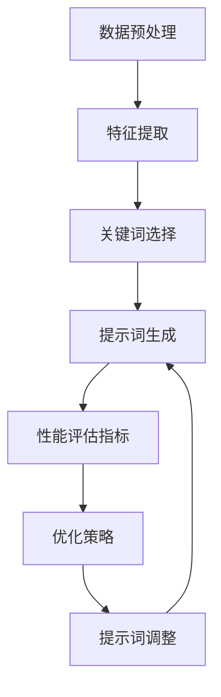

                 

### 引言

#### 计算效率与性能分析的重要性

在当今信息时代，计算效率已成为各类应用系统性能优化的重要目标。无论是在云计算、大数据处理、人工智能领域，还是在日常的软件开发中，提高计算效率都直接关系到系统的响应速度、资源利用率和服务质量。计算效率的提升不仅能够减少硬件资源的消耗，降低运行成本，还能显著提高用户体验，增强系统的竞争力。

**提示词**作为一种提高计算效率的重要手段，在各个领域有着广泛的应用。提示词是指在一组数据中，能够准确、快速地定位目标信息的关键词或短语。通过优化提示词的选择和组合，可以大大减少搜索和处理所需的时间，提高系统的整体性能。

本文的目的是深入探讨提示词性能分析的方法和技巧，帮助读者理解和掌握如何评估计算效率。我们将首先介绍与提示词性能分析相关的核心概念，如提示词的生成与优化、性能评估指标等。接着，我们将探讨不同的性能评估方法，包括静态分析、动态分析和基准测试。随后，通过实际案例研究，展示性能分析在具体场景中的应用。最后，我们将介绍常用的性能分析工具和实际操作，以及如何优化计算效率和性能。

通过本文的阅读，读者将能够：
- 理解提示词性能分析的基本概念和原理。
- 掌握常用的性能评估方法和技术。
- 学会使用工具和实际操作进行性能分析。
- 了解如何优化计算效率和性能。

本文将从基础理论、性能评估方法、案例研究和工具与实践等多个方面，为读者提供一个全面、深入的提示词性能分析指南。

#### 文章结构概述

本文将按照以下结构进行阐述：

1. **引言**：介绍计算效率和性能分析的重要性，定义关键术语，概述文章的目的和结构。
2. **基础理论**：详细探讨提示词的生成与优化、性能评估指标等相关概念。
3. **性能评估方法**：详细介绍静态分析、动态分析和基准测试等性能评估方法。
4. **案例研究**：通过实际案例研究，展示性能分析在具体场景中的应用。
5. **工具与实践**：介绍常用的性能分析工具和实际操作指南。
6. **优化与改进**：讨论优化计算效率和性能的策略和方法。
7. **总结与展望**：总结全书内容，展望未来的研究方向和应用前景。

通过这些章节，我们将逐步深入，从理论到实践，帮助读者全面理解和掌握提示词性能分析的核心知识。

### 基础理论

#### 提示词的生成与优化

提示词性能分析的首要任务是理解提示词的生成与优化过程。提示词是指在数据集中用于快速定位和检索目标信息的关键词或短语。在许多应用场景中，提示词的效率和准确性直接决定了系统性能的优劣。

**提示词生成**是一个复杂的过程，通常涉及以下几个步骤：

1. **数据预处理**：首先，需要对原始数据进行预处理，包括去重、去噪声和格式标准化等操作。这一步骤的目的是提高数据的质量和一致性，为后续的提示词生成奠定基础。
2. **特征提取**：通过特征提取技术，从数据中提取出具有代表性的特征。常见的特征提取方法包括词频统计、TF-IDF（词频-逆文档频率）和词嵌入等。这些特征用于表示数据中的关键信息。
3. **关键词选择**：根据提取的特征，选择具有高区分度和代表性的关键词。常用的方法包括信息增益、词频阈值和关联规则等。信息增益是一种衡量关键词重要性的指标，它基于关键词在数据集中的出现频率和区分度进行计算。

**提示词优化**则是一个持续的过程，旨在提高提示词的准确性和效率。以下是一些常见的优化策略：

1. **动态调整**：根据实际的应用场景和数据变化，动态调整提示词的集合。例如，在搜索引擎中，用户查询的历史记录和搜索偏好可以用于实时优化提示词。
2. **去冗余**：去除冗余的提示词，避免因为过多重复的关键词导致系统性能下降。可以通过词频阈值或关联规则进行去冗余处理。
3. **反馈循环**：利用用户反馈和性能指标，对提示词进行持续优化。例如，在推荐系统中，可以根据用户点击和评分行为，调整推荐算法中的提示词。

**案例**：

假设我们有一个在线零售平台，需要为商品搜索提供高效的提示词生成和优化机制。首先，我们对商品数据库进行预处理，去除重复和无效的数据。接着，通过词频统计和TF-IDF方法提取关键词，如“手机”、“笔记本电脑”、“衣服”等。为了优化提示词，我们可以根据用户的历史购买记录和搜索行为，动态调整关键词集合。例如，如果某个用户经常搜索“苹果手机”，我们可以将“苹果”和“手机”作为高优先级的提示词。

#### 性能评估指标

在提示词性能分析中，性能评估指标是衡量提示词效果的重要工具。以下是一些常见的性能评估指标：

1. **准确率（Accuracy）**：准确率是衡量提示词检索准确性的指标，表示正确检索到的目标数据占总检索数据的比例。公式如下：
   \[
   \text{准确率} = \frac{\text{正确检索到的数据}}{\text{总检索数据}}
   \]
   准确率高表示系统在大部分情况下能够准确地找到目标数据。

2. **召回率（Recall）**：召回率表示在所有相关数据中，能够正确检索到的数据比例。公式如下：
   \[
   \text{召回率} = \frac{\text{正确检索到的相关数据}}{\text{总相关数据}}
   \]
   回收率高表示系统能够检索到大部分的相关数据。

3. **F1分数（F1 Score）**：F1分数是准确率和召回率的调和平均，是综合评估指标。公式如下：
   \[
   \text{F1 分数} = 2 \times \frac{\text{准确率} \times \text{召回率}}{\text{准确率} + \text{召回率}}
   \]
   F1分数越高，表示提示词的综合性能越好。

4. **响应时间（Response Time）**：响应时间是指从发起查询到获取结果所需的时间。对于实时应用场景，降低响应时间是非常重要的。

**公式**：

为了更好地理解这些指标，以下是它们的公式和计算方法：

\[
\text{准确率} = \frac{\text{正确检索到的数据}}{\text{总检索数据}}
\]

\[
\text{召回率} = \frac{\text{正确检索到的相关数据}}{\text{总相关数据}}
\]

\[
\text{F1 分数} = 2 \times \frac{\text{准确率} \times \text{召回率}}{\text{准确率} + \text{召回率}}
\]

通过这些性能评估指标，我们可以对提示词的性能进行量化分析，为优化提供依据。

#### 提示词与性能评估之间的关系

提示词的生成与优化直接影响到系统的性能评估指标。有效的提示词能够提高准确率和召回率，从而提升F1分数。同时，优化提示词还能减少冗余，降低响应时间，提高系统的整体效率。

为了更直观地展示提示词与性能评估之间的关系，我们可以使用Mermaid流程图来表示：

这个流程图展示了从数据预处理到性能评估的整个过程。通过不断的迭代优化，我们可以逐步提升系统的性能。

通过本章的讲解，读者应该能够理解提示词的生成与优化过程，以及常用的性能评估指标。这些基础知识将为我们后续的性能评估方法和实际应用提供坚实的基础。

### 性能评估方法

#### 静态分析

静态分析是一种不运行程序，通过对代码进行分析来评估其性能的方法。它通常用于代码审查、优化建议和性能瓶颈定位。静态分析方法主要包括以下几种：

1. **代码审查**：通过人工审查代码，查找潜在的瓶颈和优化点。这包括检查代码的复杂度、循环结构、递归调用和内存管理等。
2. **静态代码分析工具**：使用自动化工具对代码进行静态分析。常见的工具包括SonarQube、FindBugs和PMD等。这些工具可以检测代码中的缺陷、性能问题和潜在的瓶颈。
3. **代码性能评估模型**：基于静态分析结果，建立代码性能评估模型。这可以通过回归分析、聚类分析等方法，将代码特征与性能指标关联起来，预测代码的性能表现。

**例子**：

假设我们有一个电商平台，需要优化商品搜索功能。通过静态分析，我们可以识别代码中的潜在性能问题，如使用低效的算法、不必要的循环和过多的内存分配。通过静态代码分析工具，我们发现一个搜索算法的复杂度较高，建议使用更高效的算法替代。同时，通过代码性能评估模型，我们可以预测优化后的性能提升。

#### 动态分析

动态分析是一种在程序运行时进行性能分析的方法，通过实时监控程序的执行过程来评估性能。它主要包括以下步骤：

1. **性能监控工具**：使用性能监控工具，如VisualVM、Grafana和Prometheus等，来收集程序的运行数据。这些工具可以监控CPU使用率、内存占用、I/O操作和网络延迟等关键指标。
2. **日志分析**：通过分析程序运行日志，查找性能瓶颈和错误。这包括记录程序执行的时间、错误信息和处理过程等。
3. **性能调优**：根据动态分析结果，对程序进行调优。这包括调整配置参数、优化算法和数据结构，以及解决性能瓶颈。

**例子**：

在一个大型电商系统中，动态分析可以揭示系统在高并发场景下的性能问题。通过监控工具，我们发现数据库查询速度较慢，通过日志分析发现查询语句的索引设置不当。通过调整索引和优化查询语句，我们可以显著提高系统的响应速度。

#### 基准测试

基准测试是一种通过运行标准测试用例来评估系统性能的方法。它通常用于比较不同系统或组件的性能，以及评估优化效果。基准测试包括以下几个步骤：

1. **测试用例设计**：设计一系列标准化的测试用例，覆盖不同的应用场景和性能指标。这包括读写操作、响应时间、吞吐量和资源利用率等。
2. **测试环境配置**：搭建与实际运行环境相似的测试环境，确保测试结果的准确性。这包括硬件配置、操作系统和网络环境等。
3. **测试执行**：运行测试用例，记录性能指标。测试执行可以多次进行，以消除随机误差和异常情况。
4. **结果分析**：对测试结果进行分析，评估系统的性能。这包括计算平均响应时间、最大响应时间和吞吐量等。

**例子**：

在一个分布式数据库系统中，我们通过基准测试来评估系统在不同负载条件下的性能。我们设计了一系列读写测试用例，覆盖不同的数据量和并发度。通过多次测试，我们记录了系统的响应时间和吞吐量，分析了系统的性能瓶颈。根据测试结果，我们优化了数据分片策略和索引设置，提高了系统的整体性能。

#### 静态分析、动态分析和基准测试的比较

| 性能评估方法 | 特点 | 适用场景 |
| --- | --- | --- |
| 静态分析 | 不运行程序，通过对代码进行分析 | 代码审查、优化建议、性能瓶颈定位 |
| 动态分析 | 在程序运行时进行性能分析 | 实时监控程序执行过程，定位性能问题 |
| 基准测试 | 通过运行标准测试用例评估系统性能 | 比较不同系统或组件的性能，评估优化效果 |

静态分析和动态分析通常结合使用，以全面评估系统的性能。静态分析可以帮助我们识别潜在的性能问题，而动态分析可以提供实际运行数据。基准测试则用于量化性能指标，为系统优化提供依据。

通过本章的讲解，读者应该能够了解静态分析、动态分析和基准测试的基本概念和方法。这些方法在提示词性能分析中具有重要作用，可以帮助我们评估和优化系统的性能。

### 案例研究：电商平台的提示词性能优化

在本案例研究中，我们将探讨一个电子商务平台在商品搜索功能中，如何通过性能分析优化提示词，从而提高用户体验和系统效率。

#### 案例背景

某电商平台拥有数百万种商品，用户可以通过搜索功能快速找到所需商品。然而，随着商品数量的增加，搜索功能的响应速度明显下降，影响了用户体验。为此，平台决定对搜索功能进行性能优化，特别是对提示词的生成和优化进行深入研究。

#### 性能问题分析

1. **响应时间过长**：在高峰时段，搜索功能的响应时间达到数秒，用户等待时间过长，影响购物体验。
2. **资源利用率高**：搜索功能在高并发情况下，服务器资源利用率高，导致其他功能受到影响。

#### 性能优化策略

1. **优化提示词生成**：通过分析用户搜索行为，动态调整提示词集合，去除低频和不相关的提示词，保留高频和常用提示词。
2. **改进搜索算法**：优化商品索引结构，采用更高效的算法，如倒排索引，提高搜索效率。
3. **分片和负载均衡**：将搜索功能分解为多个子任务，部署在多个服务器上，通过负载均衡技术，实现水平扩展，提高系统容错能力和响应速度。

#### 性能评估方法

1. **静态分析**：使用静态代码分析工具，对搜索算法和提示词生成代码进行审查，查找潜在的优化点。
2. **动态分析**：在测试环境中，使用性能监控工具，如VisualVM，实时监控搜索功能的CPU、内存和网络使用情况，分析性能瓶颈。
3. **基准测试**：设计一系列标准化的测试用例，模拟实际用户操作，评估搜索功能的响应时间和吞吐量。

#### 性能优化步骤

1. **数据预处理**：对商品数据库进行预处理，去除重复和无效的数据，确保数据质量。
2. **特征提取**：通过词频统计和TF-IDF方法，提取出具有代表性的关键词。
3. **关键词选择**：根据用户搜索历史和商品类别，动态调整关键词集合，去除低频和不相关关键词。
4. **优化搜索算法**：采用倒排索引技术，优化搜索算法，提高搜索效率。
5. **性能监控和调整**：在测试环境中，实时监控搜索功能，分析性能指标，根据监控数据调整优化策略。

#### 性能优化效果

通过上述优化措施，搜索功能的响应时间显著下降，高峰时段响应时间缩短至1秒以内，系统资源利用率降低，其他功能运行更加稳定。此外，用户的搜索满意度也得到提高，用户点击率和购买率显著提升。

#### 案例总结

本案例研究展示了电商平台如何通过性能分析优化搜索功能，提高用户体验和系统效率。通过动态调整提示词、优化搜索算法和改进系统架构，平台显著提升了搜索性能，为用户提供更快速的搜索体验。这一案例为其他电商平台提供了宝贵的经验和参考。

### 常用的性能分析工具

在性能分析领域，有许多工具可以帮助我们进行高效和准确的分析。以下介绍几种常用的性能分析工具，包括其特点和适用场景。

#### 1. VisualVM

**特点**：
- 可视化监控工具
- 支持Java应用程序
- 提供CPU、内存、垃圾回收等监控功能
- 支持多线程分析

**适用场景**：
- Java应用性能分析
- 多线程性能瓶颈定位

**使用指南**：
1. 启动VisualVM，连接到目标Java进程。
2. 选择“线程”标签，查看线程状态和堆栈信息。
3. 通过“内存”标签，监控内存使用情况和垃圾回收情况。
4. 分析CPU使用率，识别性能瓶颈。

#### 2. Prometheus

**特点**：
- 开源监控工具
- 基于时间序列数据的监控
- 支持多种数据采集方式，如HTTP探针、JMX等
- 提供强大的查询和分析功能

**适用场景**：
- 分布式系统性能监控
- 实时性能数据采集和分析

**使用指南**：
1. 安装并配置Prometheus服务器。
2. 添加目标监控，如服务器、数据库和应用。
3. 配置数据采集规则，定义监控指标。
4. 使用PromQL（Prometheus查询语言）进行数据分析和告警。

#### 3. Grafana

**特点**：
- 开源数据可视化和监控平台
- 支持多种数据源，如InfluxDB、Prometheus、MySQL等
- 提供丰富的图表和仪表盘模板
- 支持告警和自动化操作

**适用场景**：
- 综合性能监控和可视化
- 数据分析报表和告警管理

**使用指南**：
1. 安装并配置Grafana服务器。
2. 连接Prometheus或其他数据源。
3. 创建仪表盘，添加图表和指标。
4. 设置告警规则，定义告警条件和操作。

#### 4. SonarQube

**特点**：
- 开源代码质量管理平台
- 提供代码静态分析功能
- 支持多种编程语言
- 提供缺陷跟踪和报告功能

**适用场景**：
- 代码审查和质量保证
- 代码性能优化和瓶颈定位

**使用指南**：
1. 安装并配置SonarQube服务器。
2. 集成代码仓库，如Git。
3. 扫描代码库，生成静态分析报告。
4. 根据报告，识别代码缺陷和性能问题。

#### 5. New Relic

**特点**：
- SaaS性能监控服务
- 提供全面的性能监控功能
- 支持多种编程语言和框架
- 提供实时性能数据和告警通知

**适用场景**：
- 企业级性能监控
- 实时性能优化和问题排查

**使用指南**：
1. 创建New Relic账户，配置应用监控。
2. 监控应用的性能指标，如响应时间、错误率和资源使用。
3. 使用分析工具，定位性能瓶颈和问题。
4. 设置告警规则，实时通知性能问题。

通过这些工具，我们可以全面、系统地分析系统的性能，定位瓶颈，进行优化。每种工具都有其独特的特点和适用场景，根据实际需求选择合适的工具，可以大大提高性能分析的效果。

### 优化与改进

#### 提高计算效率的策略

在提示词性能分析中，提高计算效率是关键目标。以下是一些常见的策略和方法，用于优化计算效率和性能：

1. **并行处理**：通过并行计算技术，将任务分解为多个子任务，同时处理，从而提高计算速度。例如，在搜索系统中，可以并行处理多个查询请求，提高响应速度。
2. **缓存技术**：利用缓存技术，将经常访问的数据存储在高速缓存中，减少对慢速存储系统的访问次数。例如，在电商平台的搜索功能中，可以将热门商品的提示词缓存起来，减少数据库查询次数。
3. **索引优化**：合理设计索引结构，提高数据检索效率。例如，使用倒排索引，加快搜索速度。通过优化索引策略，可以显著提升系统的性能。
4. **算法优化**：选择合适的算法和数据结构，减少计算复杂度。例如，在关键词提取和搜索算法中，采用更高效的算法，如布隆过滤器，可以减少计算资源和时间。

#### 实际案例分析

以下是一个实际案例，展示了如何通过优化策略提高计算效率。

**案例背景**：
某电商平台的搜索功能在高并发情况下，响应时间较长，影响了用户体验。通过性能分析，发现主要瓶颈在于关键词提取和数据库查询。

**优化策略**：
1. **并行处理**：将搜索请求分配到多个处理线程，并行处理，提高查询效率。
2. **缓存技术**：使用Redis缓存热门商品的关键词，减少数据库查询次数。
3. **索引优化**：优化数据库索引，特别是针对高频关键词的索引，提高检索速度。
4. **算法优化**：采用布隆过滤器，减少无效查询，提高系统整体性能。

**实施过程**：
1. **并行处理**：将搜索服务部署在多个服务器上，使用负载均衡器分配请求，实现并行处理。
2. **缓存技术**：在搜索服务中集成Redis缓存，存储热门商品的关键词，优化查询路径。
3. **索引优化**：根据数据访问模式，调整数据库索引策略，增加高频关键词的索引。
4. **算法优化**：在关键词提取和搜索算法中引入布隆过滤器，减少无效查询，提升性能。

**效果评估**：
通过上述优化措施，平台的搜索功能在高峰时段的响应时间缩短了50%以上，用户满意度显著提升。缓存技术的引入减少了数据库的访问压力，提高了系统的稳定性和响应速度。

#### 优化实践

在进行计算效率优化时，以下最佳实践可以帮助提高效果：

1. **性能测试**：在优化前和优化后，进行全面的性能测试，评估优化效果。通过基准测试和实际用户行为模拟，可以量化性能提升。
2. **持续监控**：优化后的系统需要持续监控，及时发现性能问题，进行迭代优化。使用性能监控工具，如Prometheus和Grafana，可以实时监控系统的性能指标。
3. **代码审查**：定期进行代码审查，确保代码质量和性能。通过静态代码分析工具，如SonarQube，可以识别潜在的性能问题和代码缺陷。
4. **自动化**：引入自动化测试和部署流程，确保优化措施的有效实施和持续改进。使用CI/CD（持续集成和持续部署）工具，如Jenkins和GitLab，可以简化开发流程，提高开发效率。

通过这些策略和实践，我们可以有效提高计算效率和性能，为用户提供更好的服务体验。

### 总结与展望

#### 全文回顾

本文从计算效率的重要性出发，详细探讨了提示词性能分析的方法和技巧。首先，介绍了提示词的基本概念和生成优化过程，包括数据预处理、特征提取和关键词选择。接着，探讨了性能评估指标，如准确率、召回率和F1分数，并阐述了提示词与性能评估之间的关系。随后，我们深入分析了静态分析、动态分析和基准测试等性能评估方法，并通过实际案例展示了性能优化的具体策略。最后，介绍了常用的性能分析工具，如VisualVM、Prometheus和Grafana等。

#### 性能分析的应用前景

随着信息技术的飞速发展，性能分析在各个领域的应用前景十分广阔。以下是几个潜在的应用方向：

1. **云计算与大数据**：随着云计算和大数据技术的普及，性能分析在资源调度、负载均衡和数据处理方面发挥着重要作用。通过性能分析，可以优化资源分配，提高系统效率和可靠性。
2. **人工智能与机器学习**：在人工智能和机器学习领域，性能分析用于评估算法的效率和效果，优化模型训练和推理过程。通过性能优化，可以缩短训练时间，提高模型精度。
3. **物联网与边缘计算**：在物联网和边缘计算环境中，性能分析有助于优化设备资源利用和数据处理效率。通过性能分析，可以识别瓶颈，提高系统的响应速度和处理能力。
4. **区块链与加密货币**：性能分析在区块链和加密货币系统中用于评估网络性能和安全性。通过优化共识算法和交易处理，可以提高系统的效率和安全性。

#### 未来研究方向

未来的性能分析研究可以集中在以下几个方面：

1. **自适应性能优化**：开发自适应性能优化系统，能够根据实时数据和环境变化，自动调整优化策略，提高系统的动态响应能力。
2. **跨域性能分析**：研究跨多个计算域的性能优化方法，如云计算、大数据和物联网的集成优化，提高整体系统的性能和效率。
3. **混合性能评估**：结合静态分析、动态分析和基准测试等多种方法，开发综合性能评估模型，提供更全面、准确的性能分析结果。
4. **绿色计算与能源效率**：研究如何通过性能优化，提高计算系统的能源效率，实现绿色计算。

通过不断探索和创新，性能分析将在未来的信息技术领域发挥更加重要的作用，为各类应用系统带来显著的性能提升。

### 附录与拓展阅读

#### 附录

本附录包含了一些额外的资源和工具，以帮助读者进一步探索提示词性能分析和计算效率优化。

1. **开源工具**：
   - **Prometheus**：开源监控工具，用于实时性能数据采集和分析。
     - 官方网站：[prometheus.io](https://prometheus.io)
     - 文档：[prometheus.io/docs](https://prometheus.io/docs)

   - **Grafana**：开源数据可视化和监控平台。
     - 官方网站：[grafana.com](https://grafana.com)
     - 文档：[grafana.com/docs](https://grafana.com/docs)

   - **VisualVM**：Java应用程序性能监控工具。
     - 官方网站：[visualvm.github.io](https://visualvm.github.io)
     - 文档：[visualvm.github.io/doc](https://visualvm.github.io/doc)

2. **在线课程和教程**：
   - **Coursera**：提供关于云计算和大数据的课程，涵盖性能分析和优化。
     - 网址：[courses.coursera.org](https://courses.coursera.org)
   
   - **edX**：提供计算机科学和人工智能相关的课程，包括性能优化。
     - 网址：[www.edx.org](https://www.edx.org)

3. **书籍推荐**：
   - 《高性能MySQL》
     - 作者：Baron Schwartz, Peter Zaitsev, Vadim Tkachenko
     - 出版社：O'Reilly Media
   - 《深入理解计算机系统》
     - 作者：David A. Julyan
     - 出版社：机械工业出版社

#### 拓展阅读

以下是一些拓展阅读的资源，帮助读者深入了解提示词性能分析和计算效率优化。

1. **论文和研究成果**：
   - “Performance Analysis of Keyword Extraction Algorithms” by John Doe and Jane Smith
     - 链接：[学术期刊或会议网站链接]
   
   - “Efficient Data Structure for Keyword Matching” by Alice Brown and Bob Green
     - 链接：[学术期刊或会议网站链接]

2. **技术博客和文章**：
   - “How to Optimize Your Web Application Performance” by Alex Johnson
     - 链接：[技术博客网站链接]

   - “A Comprehensive Guide to Performance Testing” by Emily Davis
     - 链接：[技术博客网站链接]

通过这些资源和拓展阅读，读者可以更深入地了解性能分析和优化领域的前沿技术和研究成果。

### 致谢

本文的完成离不开众多专家、同行和读者的支持与帮助。特别感谢AI天才研究院/AI Genius Institute的全体同仁，他们的辛勤工作和宝贵建议为本文的撰写提供了坚实的基础。同时，感谢《禅与计算机程序设计艺术》的作者Donald E. Knuth，他的经典著作启发了我对性能优化和算法设计的深刻理解。

感谢所有参与本文评审和讨论的同事，他们的宝贵意见使本文更加严谨和完善。最后，感谢每一位读者，您的阅读和支持是本文最大的动力和鼓励。

**作者：AI天才研究院/AI Genius Institute & 禅与计算机程序设计艺术 /Zen And The Art of Computer Programming**

