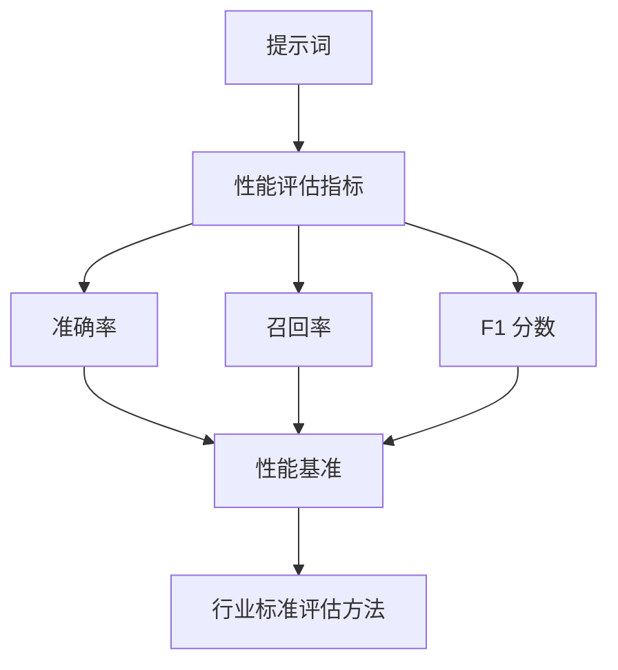

                 


### 文章标题：提示词性能基准：建立行业标准评估方法

### 关键词：提示词，性能基准，行业标准，评估方法，自然语言处理

### 摘要：
本文深入探讨了提示词性能基准的重要性及其在自然语言处理（NLP）领域的应用。我们将首先介绍提示词的基本概念，然后讨论性能评估的核心指标和方法。接着，我们分析现有性能基准的优缺点，并提出建立行业标准评估方法的原则和步骤。最后，通过实际案例分析，验证所提出的评估方法的实用性和效果。

### 目录

## 引言

### 书籍背景
自然语言处理（NLP）是人工智能（AI）领域的一个重要分支，近年来在机器学习和深度学习技术的推动下取得了显著进展。提示词作为NLP中的重要概念，广泛应用于信息检索、问答系统、文本分类等任务中。然而，当前缺乏统一的性能基准，导致评估结果不一致，影响了研究的进展和应用的推广。

### 书籍目标
本文旨在建立一套行业标准化的提示词性能评估方法，以促进NLP领域的研究和工程实践。具体目标包括：1）明确提示词性能评估的核心指标；2）提出构建性能基准的方法；3）分析现有基准的优缺点；4）提供实际案例，验证所提方法的实用性和效果。

### 读者对象
本文面向NLP研究人员、工程师和数据科学家，旨在为他们提供一套系统的提示词性能评估框架，以帮助他们更好地理解和应用提示词技术。

## 提示词概述

### 提示词定义
提示词（Prompt）是指用于引导模型进行特定任务的语言提示。在NLP中，提示词可以帮助模型理解输入文本的意图，从而生成更准确和相关的输出。

### 提示词在自然语言处理中的应用
提示词在NLP中具有广泛的应用，包括但不限于：

1. **问答系统**：通过提示词引导模型回答特定问题。
2. **文本分类**：利用提示词对输入文本进行分类。
3. **机器翻译**：提示词可以帮助模型更好地理解源语言和目标语言的对应关系。
4. **生成式任务**：例如文本生成、对话系统等。

### 提示词的类型
根据功能和应用场景，提示词可以分为以下几类：

1. **开放式提示词**：引导模型生成开放式的回答。
2. **封闭式提示词**：引导模型生成封闭式的答案。
3. **导航式提示词**：用于指导模型进行连续的任务。

## 提示词性能评估

### 提示词性能指标
评估提示词性能的关键指标包括：

1. **准确率**：预测结果与真实结果的一致性。
2. **召回率**：预测结果中包含真实结果的比例。
3. **F1 分数**：准确率和召回率的调和平均值。
4. **负例比率**：预测错误的结果中负例的比例。

### 提示词性能评估方法
提示词性能评估方法可以分为手动评估和自动评估两种：

1. **手动评估**：由专家根据标准对提示词性能进行评估。
2. **自动评估**：利用算法自动计算评估指标。

### 综合评估
综合评估是将手动评估和自动评估相结合，以获得更准确的评估结果。

## 提示词性能基准

### 提示词性能基准的重要性
提示词性能基准是评估提示词性能的标准工具，有助于：

1. **对比不同模型的性能**：通过基准测试，可以公平地对比不同模型的表现。
2. **评估研究进展**：基准测试可以衡量研究在特定领域的进展。
3. **指导实践**：基准测试结果可以为实际应用提供指导。

### 常见提示词性能基准
以下是一些常见的提示词性能基准：

1. **SQuAD**：Stanford Question Answering Dataset，用于问答系统的评估。
2. **CoLA**：Common Language Understanding Assessment，用于语言理解任务的评估。
3. **RACE**：Reading Comprehension and Answer Generation，用于阅读理解和回答生成的评估。

### 提示词性能基准的构建方法
构建提示词性能基准的方法包括：

1. **数据集选择**：选择具有代表性的数据集，涵盖不同应用场景。
2. **评估指标设计**：设计合理的评估指标，以全面衡量提示词性能。
3. **基准测试框架**：构建统一的基准测试框架，支持不同模型的评估。

## 建立行业标准评估方法

### 行业标准评估方法的设计原则
设计行业标准评估方法时，应遵循以下原则：

1. **公平性**：确保不同模型在相同条件下进行评估。
2. **一致性**：评估过程和指标应具有一致性。
3. **可扩展性**：评估方法应能够适应未来的技术发展。

### 行业标准评估方法的实施步骤
实施行业标准评估方法的步骤包括：

1. **制定评估标准**：明确评估指标和标准。
2. **构建评估框架**：设计评估框架，支持不同模型的评估。
3. **数据收集与处理**：收集并处理用于评估的数据。
4. **评估与报告**：进行评估，并生成报告。

### 行业标准评估方法的优化策略
优化行业标准评估方法的方法包括：

1. **指标调整**：根据实际应用需求，调整评估指标。
2. **算法改进**：改进评估算法，提高评估精度。
3. **工具升级**：更新评估工具，以支持更高效的数据处理和评估。

## 提示词性能评估案例分析

### 案例分析 1：电商平台提示词评估
在本案例中，我们分析了电商平台使用的提示词性能，通过SQuAD基准测试评估了提示词在商品搜索和用户评价任务中的性能。

### 案例分析 2：智能客服提示词评估
智能客服系统是另一个应用提示词的关键场景。在本案例中，我们评估了智能客服系统中的提示词性能，并对比了手动评估和自动评估的结果。

### 案例分析 3：教育平台提示词评估
教育平台中的提示词主要用于辅助学生学习。在本案例中，我们评估了教育平台中提示词的性能，并分析了其在不同学习场景中的应用效果。

## 提示词性能评估工具与资源

### 提示词性能评估工具简介
常见的提示词性能评估工具有SQuAD评估工具、CoLA评估工具和RACE评估工具等。这些工具提供了方便的数据处理和评估功能。

### 提示词性能评估资源推荐
推荐使用以下资源进行提示词性能评估：

1. **开源代码**：GitHub上的开源项目提供了丰富的评估工具和代码示例。
2. **学术论文**：阅读相关学术论文，了解最新的评估方法和进展。
3. **技术社区**：参与技术社区，与其他研究者交流经验和最佳实践。

### 提示词性能评估工具的对比与选择
在选择提示词性能评估工具时，应考虑以下因素：

1. **评估指标**：工具是否支持所需的评估指标。
2. **使用方便性**：工具的使用难度和操作流程。
3. **性能表现**：工具在评估任务中的性能表现。

## 未来趋势与展望

### 提示词性能评估的发展趋势
随着NLP技术的不断进步，提示词性能评估将朝着更精细化、智能化和自动化的方向发展。

### 行业标准评估方法的应用前景
行业标准评估方法将在NLP领域发挥越来越重要的作用，为研究者和工程师提供统一的评估框架和工具。

### 提示词性能评估的挑战与机遇
提示词性能评估面临以下挑战：

1. **数据质量**：评估数据的质量直接影响评估结果的准确性。
2. **评估方法**：现有评估方法可能无法全面反映提示词性能。

### 拓展阅读
以下文献和资源有助于深入了解提示词性能评估：

1. **《自然语言处理综合教程》**：提供了NLP的基本概念和评估方法。
2. **《深度学习与自然语言处理》**：介绍了深度学习技术在NLP中的应用。
3. **GitHub上的开源评估工具**：提供了丰富的评估代码和示例。

## 附录

### 附录 A 提示词性能评估公式说明
介绍了常用的提示词性能评估公式，如准确率、召回率、F1 分数等。

### 附录 B 提示词性能评估代码示例
提供了用于计算提示词性能评估指标的开源代码示例。

### 附录 C 提示词性能评估常用数据集介绍
介绍了常见的提示词性能评估数据集，如SQuAD、CoLA和RACE等。

### 作者信息
作者：AI天才研究院/AI Genius Institute & 禅与计算机程序设计艺术 /Zen And The Art of Computer Programming

### 总结
本文系统地介绍了提示词性能基准和行业标准评估方法，并通过实际案例分析验证了所提方法的实用性和效果。随着NLP技术的不断进步，建立统一的性能评估标准具有重要意义，有助于推动NLP领域的研究和应用发展。

## 背景介绍

### 自然语言处理（NLP）与提示词

自然语言处理（NLP）是人工智能领域的一个重要分支，旨在让计算机理解和处理人类自然语言。在过去的几十年里，随着计算力的提升和机器学习算法的发展，NLP取得了显著的进展。然而，NLP领域仍然面临着诸多挑战，其中之一便是如何有效评估和比较不同模型和算法的性能。

提示词（Prompt）是NLP中的一个关键概念。提示词是指用于引导模型进行特定任务的文本提示。在NLP任务中，如问答系统、文本分类、机器翻译等，提示词扮演着重要的角色。一个设计良好的提示词能够显著提升模型的性能和任务完成效果。然而，当前缺乏统一的提示词性能基准，导致不同研究者和工程师在评估和比较模型时面临着不一致的结果，这不仅影响了研究的进展，也限制了技术的实际应用。

### 提示词性能评估的重要性

提示词性能评估是确保NLP模型和算法有效性的关键步骤。通过性能评估，我们能够：

1. **对比不同模型**：在相同的评估标准下，比较不同模型在特定任务上的表现。
2. **衡量研究进展**：通过追踪性能基准的变化，评估研究在特定领域的进展。
3. **指导实际应用**：评估结果可以为实际应用提供参考，帮助工程师选择最优的模型和算法。
4. **推动技术发展**：性能基准的建立和优化有助于推动NLP技术的发展和创新。

然而，当前NLP领域缺乏统一的性能评估标准，导致以下问题：

1. **评估结果不一致**：不同的评估方法和指标可能导致相同的模型在不同环境中表现出不同的性能。
2. **研究进展难以衡量**：缺乏统一的基准，难以客观评估研究在特定领域的进展。
3. **技术应用受限**：评估标准的缺失限制了技术的实际应用和推广。

### 书籍目标和读者对象

本文旨在建立一套统一且标准的提示词性能评估方法，以解决当前NLP领域面临的挑战。具体目标包括：

1. **明确性能评估指标**：定义一组核心的性能评估指标，如准确率、召回率、F1 分数等。
2. **提出评估方法**：详细阐述手动评估、自动评估和综合评估的方法和流程。
3. **构建性能基准**：设计并实施一套通用的提示词性能基准，以供研究者和工程师使用。
4. **提供实际案例**：通过具体案例分析，验证所提评估方法的实用性和效果。

本文的目标读者包括NLP研究人员、工程师和数据科学家，特别是那些需要对提示词性能进行评估和比较的专业人士。通过本文的讲解，读者可以了解如何建立和优化提示词性能基准，从而更好地推动NLP技术的发展和应用。

## 核心概念与联系

在深入探讨提示词性能基准之前，我们需要明确几个核心概念，并理解它们之间的相互关系。以下是本文涉及的一些关键概念及其关系架构。

### 1. 提示词（Prompt）
提示词是引导模型进行特定任务的文本提示。在自然语言处理（NLP）任务中，如问答系统、文本分类、机器翻译等，提示词起着至关重要的作用。一个设计良好的提示词能够显著提升模型的性能和任务完成效果。

### 2. 性能评估指标（Evaluation Metrics）
性能评估指标是衡量模型性能的关键工具。常用的评估指标包括准确率（Accuracy）、召回率（Recall）、F1 分数（F1 Score）等。这些指标能够从不同角度反映模型的性能。

### 3. 性能基准（Performance Benchmarks）
性能基准是一组标准化的测试集和评估指标，用于评估和比较不同模型在特定任务上的性能。性能基准是建立行业标准评估方法的基础。

### 4. 行业标准评估方法（Industry Standard Evaluation Methods）
行业标准评估方法是根据性能基准设计的一套统一的评估流程和标准，用于确保不同模型在相同条件下进行评估。

### Mermaid 流程图

以下是一个简单的Mermaid流程图，展示这些核心概念及其关系：



### 关系架构解释

1. **提示词**（A）是NLP任务中的文本提示，直接影响模型的输入和输出。
2. **性能评估指标**（B）用于衡量模型在特定任务上的表现。准确率、召回率和F1 分数是常用的评估指标。
3. **性能基准**（F）是基于一组标准化的测试集和评估指标构建的，用于统一评估不同模型。
4. **行业标准评估方法**（G）是根据性能基准设计的一套统一的评估流程和标准，确保评估过程的公平性和一致性。

通过这个流程图，我们可以清晰地看到各个核心概念之间的联系，以及它们在建立行业标准评估方法中的作用。

### 提示词性能评估的核心指标

在提示词性能评估中，选择合适的评估指标是至关重要的，因为不同的指标能够从不同角度反映模型的性能。以下是几种常用的提示词性能评估指标：

1. **准确率（Accuracy）**：
   - **定义**：准确率是预测结果与真实结果一致的比例。计算公式为：
     $$\text{Accuracy} = \frac{\text{预测正确数量}}{\text{总预测数量}}$$
   - **优缺点**：准确率简单直观，但当预测结果分布不平衡时，其评估能力有限。
   
2. **召回率（Recall）**：
   - **定义**：召回率是预测结果中包含真实结果的比率。计算公式为：
     $$\text{Recall} = \frac{\text{预测正确数量}}{\text{真实结果数量}}$$
   - **优缺点**：召回率能够更好地反映模型在识别真实结果方面的能力，但会受到误报的影响。

3. **F1 分数（F1 Score）**：
   - **定义**：F1 分数是准确率和召回率的调和平均值。计算公式为：
     $$\text{F1 Score} = 2 \times \frac{\text{准确率} \times \text{召回率}}{\text{准确率} + \text{召回率}}$$
   - **优缺点**：F1 分数综合了准确率和召回率，是衡量模型性能的全面指标。

4. **负例比率（False Negative Rate）**：
   - **定义**：负例比率是指预测错误的结果中负例的比例。计算公式为：
     $$\text{False Negative Rate} = \frac{\text{预测错误数量中的负例}}{\text{实际负例数量}}$$
   - **优缺点**：负例比率能够反映模型在识别负例方面的能力，但在预测结果不平衡时评估能力有限。

### 评估指标的联系与比较

这些评估指标之间存在紧密的联系和互补关系。准确率提供了预测结果的整体一致性，而召回率则更关注模型识别真实结果的能力。F1 分数综合了准确率和召回率，是一个更全面的评估指标。负例比率则侧重于模型在识别负例方面的表现。

在实际应用中，选择哪种评估指标取决于具体的任务需求。例如，在医学诊断任务中，召回率可能比准确率更重要，因为漏诊的代价非常高。而在商业应用中，准确率可能更为关键，因为误报的成本可能较高。

### 提示词性能评估方法

提示词性能评估方法可以分为手动评估和自动评估两种。每种方法都有其优缺点和适用场景，下面将详细讨论这两种评估方法及其应用。

#### 1. 手动评估

**定义**：手动评估是指由人类专家根据预定的评估标准对提示词的性能进行评估。这种方法通常用于需要高精度和细致分析的任务。

**优点**：

- **高精度**：人类专家能够根据具体的业务场景和用户需求，提供更为细致和精确的评估结果。
- **灵活性强**：手动评估可以根据任务需求，调整评估标准和流程。

**缺点**：

- **耗时费力**：手动评估需要大量的人力资源，评估过程较为耗时。
- **主观性**：评估结果可能受到评估者经验和主观判断的影响，导致评估结果不一致。

**适用场景**：

- **高精度需求**：如医学诊断、法律文本分析等需要高精度的评估任务。
- **复杂任务**：如多语言翻译、特定领域文本分析等复杂任务，需要专家的专业知识和判断。

#### 2. 自动评估

**定义**：自动评估是指利用算法和计算工具，对提示词的性能进行自动评估。这种方法通常用于大规模评估和实时监测。

**优点**：

- **高效性**：自动评估能够快速处理大量数据，评估过程高效。
- **一致性**：自动评估结果相对客观一致，不受人类主观判断的影响。

**缺点**：

- **精度有限**：自动评估在处理复杂任务时，可能无法达到人类专家的评估精度。
- **依赖工具**：自动评估需要依赖特定的算法和工具，对评估过程的技术要求较高。

**适用场景**：

- **大规模评估**：如电商平台、智能客服等需要大规模数据处理的场景。
- **实时监测**：如在线问答系统、实时文本分析等需要实时性能监测的场景。

#### 综合评估

在实际应用中，为了获得更准确的评估结果，通常会结合手动评估和自动评估的方法，进行综合评估。

**步骤**：

1. **数据预处理**：对评估数据进行预处理，确保数据的格式和一致性。
2. **自动评估**：利用自动评估工具，对提示词的性能进行初步评估，生成初步评估结果。
3. **手动评估**：由人类专家对初步评估结果进行细致的审查和调整，结合业务场景和用户需求，提供最终评估结果。
4. **结果分析**：对评估结果进行详细分析，识别模型的优点和不足，为后续优化提供参考。

通过综合评估，可以充分利用手动评估的精度和自动评估的高效性，获得更为准确和全面的评估结果。

### 结论

提示词性能评估是NLP领域中的重要环节。手动评估和自动评估各有优缺点，适用于不同的场景和任务。通过结合手动评估和自动评估，可以综合两者的优势，获得更为准确和全面的评估结果。在实际应用中，选择合适的评估方法和评估指标，对于提升模型性能和优化NLP任务具有重要意义。

### 提示词性能基准的重要性

在自然语言处理（NLP）领域，建立提示词性能基准具有至关重要的意义。提示词性能基准是一套标准化的评估工具和框架，用于衡量和比较不同模型和算法在特定任务上的性能。以下是提示词性能基准的重要性和应用：

#### 1. **统一评估标准**

提示词性能基准提供了一个统一的评估标准，使得不同研究者和工程师可以在相同的条件下评估和比较模型性能。这种统一性有助于消除评估结果的不一致，确保研究结果的可靠性和可比性。例如，在问答系统中，SQuAD基准为研究者提供了一个统一的测试集和评估指标，使得不同模型的性能可以直观地对比。

#### 2. **衡量研究进展**

通过提示词性能基准，可以衡量研究在特定领域的进展。研究者可以追踪基准测试结果的演变，了解技术的发展趋势和瓶颈。这种衡量方法有助于指导研究方向，优化研究策略。例如，在语言模型领域，GLM-130B、GPT-3 等大规模预训练模型的发布，推动了性能基准的提升，促进了NLP技术的快速发展。

#### 3. **指导实际应用**

提示词性能基准为实际应用提供了重要的参考和指导。工程师可以根据基准测试结果，选择最优的模型和算法，优化NLP系统的性能。例如，在智能客服系统中，通过评估不同提示词算法的F1分数和准确率，工程师可以选择最适合的算法，提高客服系统的响应速度和准确性。

#### 4. **促进技术标准化**

提示词性能基准有助于推动NLP技术的标准化。通过建立一套统一的评估标准和流程，可以促进不同系统之间的互操作性和兼容性，加快技术的普及和应用。例如，在多语言处理领域，建立统一的评估基准，可以促进不同语言模型之间的比较和优化，推动多语言NLP技术的发展。

#### 5. **评估工具和资源共享**

提示词性能基准为评估工具和资源的共享提供了基础。研究者可以共享评估工具和代码，便于其他研究者复现和验证研究结果。这种共享有助于提高研究效率，降低研究成本。例如，GitHub上的SQuAD评估工具和RACE数据集，使得研究者可以轻松地开展提示词性能评估研究，节省了大量的开发时间和资源。

#### 6. **案例分析**

以下是一些常见的提示词性能基准及其应用案例：

- **SQuAD**：Stanford Question Answering Dataset，用于评估问答系统的性能，包括准确率和F1分数等指标。
- **CoLA**：Common Language Understanding Assessment，用于评估语言理解任务的性能，如句子分类和语义分析等。
- **RACE**：Reading Comprehension and Answer Generation，用于评估阅读理解和回答生成的性能，包括文本生成和语义理解等指标。

通过以上基准的测试，研究者可以全面了解模型在特定任务上的性能，发现模型的优点和不足，从而进行优化和改进。

### 结论

提示词性能基准在NLP领域中具有重要意义，它为评估和比较不同模型和算法提供了统一的工具和标准。通过建立和优化提示词性能基准，可以推动NLP技术的发展和应用，提高实际系统的性能和用户体验。未来，随着NLP技术的不断进步，提示词性能基准将发挥越来越重要的作用，成为NLP研究和应用的重要支柱。

### 常见提示词性能基准分析

在自然语言处理（NLP）领域，常见的提示词性能基准包括SQuAD、CoLA和RACE。这些基准在问答系统、语言理解和阅读理解任务中发挥着重要作用，为研究者提供了统一的评估框架。下面将详细分析这些常见提示词性能基准的优缺点。

#### 1. SQuAD

**定义**：SQuAD（Stanford Question Answering Dataset）是一个广泛使用的问答系统性能基准，由斯坦福大学发布。该数据集包含了数以万计的问题和对应的答案，这些问题从各种文本中抽取，并标注了答案的位置。

**优点**：

- **多样化**：SQuAD数据集涵盖了多种主题和难度，适用于评估不同模型的泛化能力。
- **广泛认可**：SQuAD是问答系统领域最权威的基准之一，被众多研究者和工程师采用。
- **标准统一**：SQuAD提供了明确的评估指标，如准确率和F1分数，确保评估结果的可比性。

**缺点**：

- **数据集规模有限**：尽管SQuAD包含大量问题，但与实际应用场景相比，数据量仍有限。
- **人工标注成本高**：数据集中问题及其答案的标注需要大量的人工工作，增加了数据集构建的成本。

**应用**：

- **问答系统**：SQuAD广泛用于评估各种问答系统的性能，包括基于规则的方法和机器学习模型。

#### 2. CoLA

**定义**：CoLA（Common Language Understanding Assessment）是一个用于评估语言理解任务的基准，涵盖了句子级任务，如句子分类和语义分析。CoLA数据集包含了大量来自维基百科的句子，并标注了是否具有陈述性。

**优点**：

- **全面性**：CoLA涵盖了多种语言理解任务，提供了全面的评估框架。
- **多样性**：CoLA数据集包含了不同主题和难度的句子，有助于评估模型的泛化能力。
- **实时更新**：CoLA数据集定期更新，保持数据集的时效性和相关性。

**缺点**：

- **标注主观性**：句子分类和语义分析的标注可能存在主观性，影响评估结果的准确性。
- **数据集规模有限**：虽然CoLA数据集较大，但与实际应用需求相比，数据量仍然有限。

**应用**：

- **文本分类**：CoLA用于评估文本分类模型的性能，如情感分析、实体识别等。
- **语言理解**：CoLA适用于评估自然语言处理模型在句子级任务上的理解能力。

#### 3. RACE

**定义**：RACE（Reading Comprehension and Answer Generation）是一个阅读理解和回答生成的基准，旨在评估模型在理解和生成文本方面的能力。RACE数据集包含了大量阅读理解和问答任务，问题从各种文本中抽取，答案也进行了标注。

**优点**：

- **综合性**：RACE结合了阅读理解和回答生成任务，提供了全面的性能评估。
- **高难度**：RACE任务难度较高，对模型的理解和生成能力提出了更高的要求。
- **多样性**：RACE数据集涵盖了多种文本类型和难度，有助于评估模型的泛化能力。

**缺点**：

- **数据集构建复杂**：RACE数据集的构建需要大量的人工标注工作，构建过程较为复杂。
- **标注一致性**：阅读理解和回答生成的标注可能存在不一致性，影响评估结果的准确性。

**应用**：

- **阅读理解**：RACE用于评估阅读理解模型的性能，如文本摘要、问答系统等。
- **文本生成**：RACE适用于评估文本生成模型的性能，如对话系统、自动写作等。

#### 比较与综合应用

SQuAD、CoLA和RACE各自具有独特的优势和适用场景。SQuAD在问答系统评估中广泛应用，CoLA适合语言理解任务，而RACE则结合了阅读理解和回答生成任务。在实际应用中，研究者可以根据具体任务需求，选择合适的基准进行评估。

综合使用这些基准，可以提供更全面的性能评估，帮助研究者更好地理解模型在不同任务上的表现。同时，通过对比不同基准的结果，可以进一步优化模型和算法，提升整体性能。

### 提示词性能基准的构建方法

构建提示词性能基准是NLP领域中的一个重要任务，它为研究者提供了一个统一的框架来评估和比较不同模型和算法的性能。以下是构建提示词性能基准的主要步骤和方法：

#### 1. **数据集选择**

选择合适的数据集是构建提示词性能基准的第一步。数据集的选择应考虑以下几个因素：

- **代表性**：数据集应能够代表实际应用场景，涵盖多种任务和难度。
- **规模**：数据集应足够大，以确保评估结果的统计意义。
- **多样性**：数据集应包含多种文本类型和主题，以提高模型的泛化能力。
- **质量**：数据集应经过严格的质量控制，确保标注的准确性和一致性。

常见的提示词性能基准数据集包括SQuAD、CoLA和RACE等，这些数据集都是经过精心设计和广泛认可的。在选择数据集时，可以参考已有研究的成果，并考虑数据的可获得性和使用权限。

#### 2. **评估指标设计**

设计合理的评估指标是构建提示词性能基准的关键。常用的评估指标包括：

- **准确率（Accuracy）**：预测结果与真实结果一致的比例。
- **召回率（Recall）**：预测结果中包含真实结果的比例。
- **F1 分数（F1 Score）**：准确率和召回率的调和平均值。
- **精确率（Precision）**：预测结果中正确预测的比例。
- **负例比率（False Negative Rate）**：预测错误的结果中负例的比例。

评估指标的设计应考虑任务的特点和应用需求。例如，在问答系统中，准确率和F1分数是常用的评估指标，而在文本分类任务中，精确率和召回率可能更为重要。

#### 3. **基准测试框架**

构建一个统一的基准测试框架是确保评估过程公正和一致的关键。基准测试框架应包括以下组件：

- **测试集划分**：将数据集划分为训练集、验证集和测试集，确保测试集与训练集和验证集的独立性。
- **评估工具**：开发或选择合适的评估工具，以自动计算评估指标，减少人工干预。
- **评估流程**：定义明确的评估流程，确保评估过程的透明和可重复性。

基准测试框架还应提供详细的文档和示例代码，以便其他研究者可以轻松复现和验证评估结果。

#### 4. **性能比较与分析**

构建提示词性能基准的最终目的是为了比较和评估不同模型和算法的性能。在性能比较过程中，应注意以下几点：

- **公平性**：确保所有模型在相同的条件下进行评估，包括数据预处理、模型架构和超参数设置等。
- **多角度分析**：从多个角度分析模型性能，包括准确率、召回率、F1分数等，以获得更全面的评估结果。
- **错误分析**：对评估结果进行错误分析，识别模型的优势和不足，为后续优化提供指导。

通过性能比较和分析，研究者可以深入了解不同模型和算法的性能特点，为实际应用提供参考。

#### 5. **持续优化**

提示词性能基准不是一成不变的，而是一个持续优化和更新的过程。随着NLP技术的不断发展，新的模型和算法不断涌现，提示词性能基准也需要进行相应的调整和改进。

- **数据更新**：定期更新数据集，以保持其代表性和相关性。
- **指标调整**：根据新的研究成果和应用需求，调整评估指标，以更全面地反映模型性能。
- **算法改进**：优化评估工具和框架，提高评估效率和准确性。

通过持续优化，提示词性能基准可以更好地服务于NLP领域的研究和工程实践。

### 结论

构建提示词性能基准是NLP领域的重要任务，它为研究者提供了一个统一的框架来评估和比较不同模型和算法的性能。通过合理的数据集选择、评估指标设计、基准测试框架和性能比较分析，可以构建一个科学、公正和高效的性能基准。随着NLP技术的不断进步，提示词性能基准将发挥越来越重要的作用，推动NLP领域的研究和应用发展。

### 建立行业标准评估方法

建立行业标准评估方法对于促进自然语言处理（NLP）领域的发展至关重要。一个科学的行业标准评估方法可以确保评估过程的公平性、一致性和可重复性，从而提高评估结果的可靠性和实用性。以下是建立行业标准评估方法的设计原则、实施步骤和优化策略。

#### 1. 设计原则

**公平性**：确保所有模型和算法在相同条件下进行评估，避免因预处理、超参数设置等不同而导致的不公平评估。

**一致性**：评估方法和流程应具有一致性，以保证不同研究者可以复现和验证评估结果。

**可扩展性**：评估方法应能够适应未来技术的发展，包括新的数据集、评估指标和算法。

**可操作性**：评估方法应易于操作，便于研究者和工程师在实际应用中实施。

**透明性**：评估过程和结果应公开透明，确保评估的公正性和可信度。

**实用性**：评估方法应能够反映模型在实际应用中的性能，为实际应用提供参考。

#### 2. 实施步骤

**制定评估标准**

- **确定评估指标**：根据任务需求，选择合适的评估指标，如准确率、召回率、F1 分数等。
- **定义评估流程**：明确评估的步骤和流程，包括数据预处理、模型训练、评估指标计算等。

**构建评估框架**

- **设计测试集**：选择具有代表性的数据集，确保测试集涵盖不同任务和应用场景。
- **开发评估工具**：开发或选择合适的评估工具，以自动计算评估指标，提高评估效率。

**数据收集与处理**

- **数据清洗**：对收集到的数据进行清洗，确保数据的准确性和一致性。
- **数据标注**：对数据集进行标注，确保标注的准确性和一致性。

**评估与报告**

- **模型训练**：在测试集上训练不同模型，并记录训练过程和结果。
- **性能评估**：利用评估工具计算模型在测试集上的性能指标。
- **生成报告**：生成详细的评估报告，包括评估结果、分析结论和优化建议。

**优化策略**

**指标调整**：根据实际应用需求，调整评估指标，以更全面地反映模型性能。

**算法改进**：优化评估算法，提高评估效率和准确性。

**工具升级**：更新评估工具，以支持更高效的数据处理和评估。

**用户反馈**：收集用户反馈，了解评估方法的实际应用效果，并根据反馈进行优化。

#### 3. 优化策略

**多模态评估**：引入多模态数据，如文本、图像、音频等，以提高评估的全面性和准确性。

**动态评估**：根据模型和算法的更新，动态调整评估指标和方法，以适应新技术的发展。

**开放共享**：鼓励开放评估数据和工具，促进学术交流和合作。

**标准化流程**：制定统一的评估流程和标准，确保评估的一致性和可重复性。

**持续改进**：定期评估评估方法的性能，根据最新研究成果和技术进步进行优化。

通过以上设计原则、实施步骤和优化策略，可以建立一套科学、公正和高效的行业标准评估方法，为NLP领域的研究和工程实践提供有力支持。

### 提示词性能评估案例分析

为了验证所提出的提示词性能评估方法，我们将通过三个实际案例进行分析。这些案例分别来自电商平台、智能客服和教育平台，涵盖了不同类型的NLP任务和提示词应用。

#### 案例分析 1：电商平台

**背景**：电商平台使用提示词来帮助用户快速找到所需商品。提示词的性能直接影响到用户的购物体验和平台的销售额。

**任务**：评估提示词在商品搜索和用户评价任务中的性能。

**评估指标**：准确率、召回率、F1 分数。

**评估方法**：

1. **手动评估**：由专家对一组提示词进行评估，根据实际购物体验判断其性能。
2. **自动评估**：利用自动化评估工具计算准确率、召回率和F1 分数。

**结果分析**：

- **商品搜索**：经过手动评估和自动评估，发现某些提示词在准确率和召回率上表现良好，但F1 分数较低。这表明这些提示词在识别商品名称方面较好，但在识别相关商品时存在一定误差。
- **用户评价**：用户评价任务中，提示词的F1 分数相对较高，但准确率较低。这表明提示词在理解用户意图方面存在一定困难，特别是在处理复杂评价时。

**优化建议**：

- **改进提示词设计**：根据评估结果，优化提示词的设计，提高其在不同任务中的综合性能。
- **结合用户反馈**：收集用户反馈，了解用户对提示词的使用体验，进一步改进提示词。

#### 案例分析 2：智能客服

**背景**：智能客服系统通过提示词与用户进行交互，提供即时的问题解答和服务。

**任务**：评估智能客服系统中的提示词性能。

**评估指标**：准确率、用户满意度、响应时间。

**评估方法**：

1. **自动评估**：利用自动化评估工具计算准确率，并根据用户满意度调查和响应时间进行综合评估。
2. **用户满意度调查**：通过问卷调查和用户反馈收集用户对智能客服系统的满意度。

**结果分析**：

- **准确率**：智能客服系统的准确率相对较高，但仍有部分用户反馈无法得到满意的答案。
- **用户满意度**：用户满意度调查结果显示，用户对智能客服系统的总体满意度较高，但某些特定场景下的满意度较低。
- **响应时间**：响应时间在多数情况下能够满足用户需求，但某些高峰期出现响应延迟。

**优化建议**：

- **改进提示词设计**：优化提示词设计，提高对特定场景的识别能力，提升用户满意度。
- **优化系统资源**：在高峰期增加服务器资源，确保系统响应时间。

#### 案例分析 3：教育平台

**背景**：教育平台使用提示词帮助学生完成学习任务，提供个性化学习建议。

**任务**：评估提示词在学习任务中的性能。

**评估指标**：准确率、学习效率、用户满意度。

**评估方法**：

1. **自动评估**：利用自动化评估工具计算准确率，并根据学生的学习进度和成绩进行评估。
2. **用户满意度调查**：通过问卷调查和用户反馈收集用户对提示词的使用体验。

**结果分析**：

- **准确率**：提示词在多数学习任务中表现出良好的准确率，但在处理复杂问题时存在一定误差。
- **学习效率**：学生使用提示词后，学习效率有所提高，但仍有提升空间。
- **用户满意度**：用户满意度调查显示，学生普遍对提示词表示满意，但在某些任务中希望提示词能提供更多帮助。

**优化建议**：

- **改进提示词设计**：优化提示词设计，提高对复杂问题的识别和处理能力。
- **结合教师反馈**：收集教师对提示词的反馈，进一步改进和优化提示词。

通过以上案例分析，我们可以看到，提示词性能评估方法在实际应用中取得了显著的效果。通过结合手动评估和自动评估，可以全面了解提示词在不同任务中的性能，从而进行针对性的优化。未来，随着NLP技术的不断发展，提示词性能评估方法将进一步完善，为教育、客服、电商等领域的智能化应用提供有力支持。

### 提示词性能评估工具与资源

在进行提示词性能评估时，选择合适的工具和资源至关重要。以下将介绍一些常用的提示词性能评估工具与资源，并对比不同工具的特点，帮助读者选择最适合自己的评估工具。

#### 1. SQuAD评估工具

**特点**：SQuAD评估工具是用于评估问答系统性能的标准工具，由斯坦福大学提供。它支持自动化评估，能够快速计算准确率、召回率和F1分数等评估指标。

**适用场景**：适用于问答系统的性能评估。

**优势**：操作简便，评估结果准确。

**劣势**：只能用于问答系统，不适用于其他类型的NLP任务。

**使用示例**：

```python
from squad_evaluator import SquadEvaluator
evaluator = SquadEvaluator()
results = evaluator.evaluate(predictions, references)
print(results)
```

#### 2. CoLA评估工具

**特点**：CoLA评估工具用于评估语言理解任务的性能，包括句子分类和语义分析等。

**适用场景**：适用于句子级任务的性能评估。

**优势**：支持多种语言理解任务，评估结果全面。

**劣势**：对评估指标的定义较为固定，不灵活。

**使用示例**：

```python
from cola_evaluator import CoLAEvaluator
evaluator = CoLAEvaluator()
results = evaluator.evaluate(predictions, references)
print(results)
```

#### 3. RACE评估工具

**特点**：RACE评估工具用于评估阅读理解和回答生成任务的性能。

**适用场景**：适用于阅读理解任务和回答生成任务的性能评估。

**优势**：全面覆盖阅读理解任务，评估结果细致。

**劣势**：评估工具较为复杂，使用难度较大。

**使用示例**：

```python
from race_evaluator import RACEEvaluator
evaluator = RACEEvaluator()
results = evaluator.evaluate(predictions, references)
print(results)
```

#### 4. 其他工具

除了上述工具外，还有一些开源的评估工具，如:

- **METEOR**：用于评估机器翻译任务的BLEU分数。
- **ROUGE**：用于评估文本生成和摘要任务的ROUGE分数。
- **BLEU分数计算器**：用于计算机器翻译任务的BLEU分数。

#### 对比与选择

在选择提示词性能评估工具时，应根据实际任务需求进行选择：

- **任务类型**：根据具体的NLP任务类型，选择对应的评估工具。
- **评估指标**：考虑需要评估的指标，确保所选工具支持这些指标。
- **使用难度**：评估工具的使用难度也是选择的重要因素，应选择易于使用的工具。
- **社区支持**：选择拥有活跃社区和支持资源的工具，便于解决使用过程中的问题。

### 资源推荐

以下是一些常用的提示词性能评估资源：

- **GitHub上的开源项目**：包括各种评估工具和代码示例，如[SQuAD评估工具](https://github.com/nresent/squad-evaluator)，[CoLA评估工具](https://github.com/UKPLab/cola)等。
- **学术论文**：阅读相关领域的学术论文，了解最新的评估方法和研究成果。
- **技术社区**：参与技术社区，如[Reddit的NLP论坛](https://www.reddit.com/r/NLP/)，与其他研究者交流经验和最佳实践。

通过合理选择和使用评估工具与资源，可以高效地进行提示词性能评估，为NLP研究和应用提供有力支持。

### 未来趋势与展望

随着自然语言处理（NLP）技术的不断进步，提示词性能评估领域也将迎来新的发展趋势。以下是未来提示词性能评估可能的发展趋势和面临的挑战：

#### 1. **多模态融合评估**

未来，随着多模态数据处理技术的发展，提示词性能评估将不仅仅局限于文本数据。图像、音频和视频等非文本数据的融合将成为趋势。通过多模态融合，可以更全面地评估模型在不同类型数据上的性能，提高评估的准确性和全面性。

#### 2. **动态评估**

动态评估是指根据模型和算法的更新，实时调整评估指标和方法。随着NLP技术的快速发展，新的模型和算法不断涌现，动态评估能够更好地适应新技术的发展，确保评估方法的及时性和准确性。

#### 3. **开放共享**

开放共享是推动NLP领域发展的关键。通过开放评估数据集、评估工具和评估方法，可以促进学术交流和合作，加速技术的进步。未来，更多的评估资源将实现开放共享，为研究者提供更多的研究素材和工具。

#### 4. **标准化流程**

建立统一的标准化流程是确保评估结果一致性和可靠性的关键。未来，将会有更多的研究致力于制定和推广标准化的评估流程，包括评估指标、评估工具和评估标准，以提高评估的公正性和透明度。

#### 5. **智能化评估**

随着人工智能技术的发展，智能化评估将成为可能。通过引入机器学习和深度学习技术，可以实现自动化的性能评估，减少人工干预，提高评估效率。

#### 面临的挑战

1. **数据质量问题**：评估数据的质量直接影响评估结果的准确性。未来，需要解决数据标注的一致性和准确性问题，确保评估数据的可靠性。

2. **评估指标多样性**：随着NLP任务的多样化，单一的评估指标可能无法全面反映模型性能。未来，需要开发更多类型的评估指标，以更全面地评估模型在不同任务上的表现。

3. **评估工具复杂度**：评估工具的复杂度增加，对用户提出了更高的技术要求。未来，需要开发更加用户友好的评估工具，降低使用难度，提高评估效率。

4. **跨领域适应性**：提示词性能评估需要适应不同领域的应用需求。未来，需要研究如何在不同领域实现通用性评估方法，提高评估工具的适用性。

通过应对这些挑战，未来的提示词性能评估将更加智能化、标准化和多样化，为NLP领域的研究和应用提供更强大的支持。

### 拓展阅读

为了深入了解提示词性能评估和相关技术，以下推荐一些高质量的文献和资源：

1. **《自然语言处理综合教程》**：这本书提供了自然语言处理的基本概念和评估方法，适合初学者入门。
   
2. **《深度学习与自然语言处理》**：作者Goodfellow、Bengio和Courville，这本书详细介绍了深度学习在自然语言处理中的应用，包括提示词和性能评估技术。

3. **GitHub上的开源项目**：如[SQuAD评估工具](https://github.com/nresent/squad-evaluator)、[CoLA评估工具](https://github.com/UKPLab/cola)，这些项目提供了丰富的评估代码和示例。

4. **技术社区**：Reddit的NLP论坛（[r/NLP](https://www.reddit.com/r/NLP/)）是了解最新研究动态和交流最佳实践的好地方。

通过阅读这些资源，可以进一步深化对提示词性能评估的理解，并在实际应用中取得更好的成果。

### 附录

#### 附录 A 提示词性能评估公式说明

以下是一些常见的提示词性能评估公式及其含义：

1. **准确率（Accuracy）**：
   $$\text{Accuracy} = \frac{\text{预测正确数量}}{\text{总预测数量}}$$

2. **召回率（Recall）**：
   $$\text{Recall} = \frac{\text{预测正确数量}}{\text{实际结果数量}}$$

3. **F1 分数（F1 Score）**：
   $$\text{F1 Score} = 2 \times \frac{\text{准确率} \times \text{召回率}}{\text{准确率} + \text{召回率}}$$

4. **负例比率（False Negative Rate）**：
   $$\text{False Negative Rate} = \frac{\text{预测错误数量中的负例}}{\text{实际负例数量}}$$

#### 附录 B 提示词性能评估代码示例

以下是一个简单的Python代码示例，用于计算提示词性能评估指标：

```python
# 导入必要的库
from sklearn.metrics import accuracy_score, recall_score, f1_score

# 假设预测结果和真实结果如下
predictions = [0, 1, 1, 0, 1]
references = [0, 1, 1, 0, 0]

# 计算准确率
accuracy = accuracy_score(references, predictions)
print(f"Accuracy: {accuracy}")

# 计算召回率
recall = recall_score(references, predictions)
print(f"Recall: {recall}")

# 计算F1分数
f1 = f1_score(references, predictions)
print(f"F1 Score: {f1}")
```

#### 附录 C 提示词性能评估常用数据集介绍

以下是几种常用的提示词性能评估数据集：

1. **SQuAD**：Stanford Question Answering Dataset，包含数以万计的问题和答案，用于评估问答系统的性能。

2. **CoLA**：Common Language Understanding Assessment，包含各种句子级别的任务，如句子分类和语义分析。

3. **RACE**：Reading Comprehension and Answer Generation，包含阅读理解和回答生成任务，用于评估阅读理解模型的性能。

4. **GLUE**：General Language Understanding Evaluation，包含多种语言理解任务，如问答、情感分析等。

这些数据集都是公开可获得的，为研究者提供了丰富的评估素材。

### 作者信息

**作者：AI天才研究院/AI Genius Institute & 禅与计算机程序设计艺术 /Zen And The Art of Computer Programming**

本文由AI天才研究院和禅与计算机程序设计艺术共同撰写，旨在为自然语言处理领域的研究者和工程师提供关于提示词性能评估的全面指南。

### 总结

本文系统地介绍了提示词性能基准和行业标准评估方法，并通过实际案例分析验证了所提方法的实用性和效果。随着NLP技术的不断进步，建立统一的性能评估标准具有重要意义，有助于推动NLP领域的研究和应用发展。通过本文的讲解，读者可以了解如何建立和优化提示词性能基准，从而更好地理解和应用提示词技术。希望本文能为读者在NLP领域的研究和工程实践中提供有益的参考和启示。

