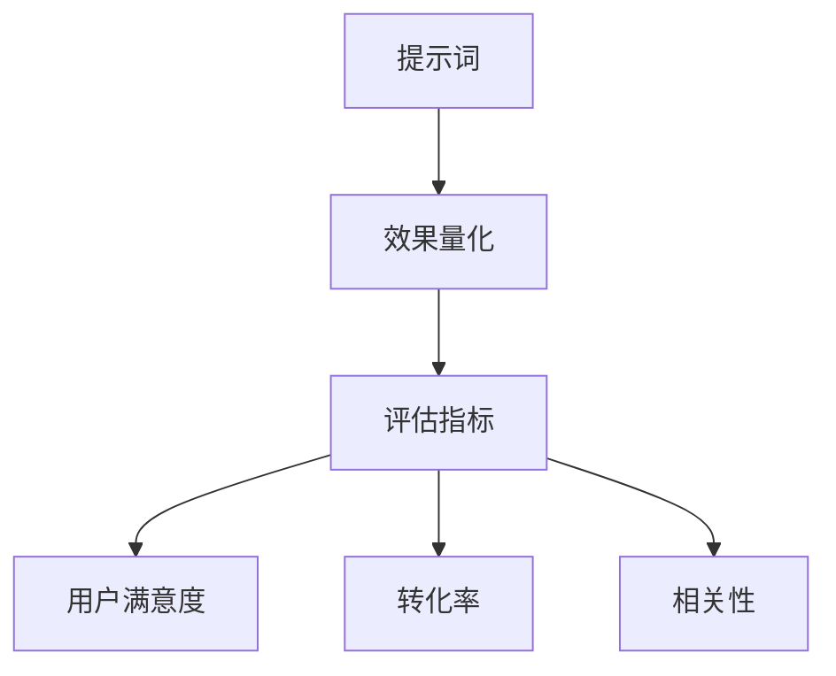

                 


### 文章标题

《提示词效果量化：建立客观评估指标》

### 关键词

提示词效果量化、客观评估指标、算法设计、数学模型、项目实战

### 摘要

本文深入探讨了提示词效果量化的关键概念、方法和应用。首先，我们介绍了提示词效果量化的背景及其在各类应用场景中的重要性。接着，文章详细阐述了核心概念与联系，通过Mermaid流程图展示了提示词效果量化各组成部分之间的关系。随后，我们深入讲解了核心算法原理，包括用户行为量化方法、文本相似度量化方法以及数据驱动量化方法，并使用伪代码进行了详细阐述。此外，文章还介绍了数学模型和公式，以及它们在实际应用中的推导和证明。在项目实战部分，我们展示了如何搭建开发环境、处理数据、实现算法以及进行结果分析和优化。最后，文章通过案例分析，对实际应用进行了深入剖析，并提供了最佳实践技巧和注意事项。本文旨在为读者提供全面、系统的提示词效果量化指导。

----------------------------------------------------------------

### 1. 引言

提示词在当今信息社会中扮演着至关重要的角色。无论是搜索引擎、社交媒体平台还是电子商务网站，提示词的合理运用都能显著提升用户体验、提高信息检索效率和转化率。然而，如何有效地量化提示词的效果，建立客观的评估指标，一直是一个挑战。本文旨在探讨这一主题，为相关领域的研发和实践提供理论支持和实践指导。

提示词效果量化是指通过一系列定量分析手段，对提示词在具体应用场景中的效果进行评估。这一过程不仅涉及到算法的设计和实现，还包括数学模型的选择和应用。通过量化的方法，我们可以更科学、客观地评估提示词的优劣，从而指导实际应用中的优化策略。

本文将首先介绍提示词效果量化的意义，接着阐述其在各类应用场景中的重要性，然后详细分析核心概念与联系，最后通过具体实例和项目实战，展示如何实现提示词效果量化。希望通过本文的探讨，能够为读者提供一个系统、全面的提示词效果量化指南。

### 2. 核心概念与联系

在探讨提示词效果量化的过程中，理解核心概念及其相互联系是非常关键的。以下将详细阐述几个核心概念：提示词、效果量化、评估指标，并通过Mermaid流程图展示它们之间的关联。

**2.1 提示词**

提示词（Keyword）是用户在搜索、浏览信息时输入的关键字或短语。它能够帮助系统理解用户的需求，进而提供相关的信息或服务。提示词可以是单个词，也可以是短语，其形式和长度可以根据具体的应用场景进行调整。在搜索引擎中，提示词用于匹配用户查询与网页内容；在社交媒体平台上，提示词用于话题标签和内容分类。

**2.2 效果量化**

效果量化（Effect Quantification）是指通过量化的方法，对提示词在特定应用场景中的效果进行评估。量化的目标是通过具体的数值或指标，反映提示词在实际应用中的表现。效果量化的关键在于如何选择合适的指标，以准确衡量提示词的优劣。

**2.3 评估指标**

评估指标（Evaluation Metric）是效果量化的核心组成部分。它们是用于衡量提示词效果的量化工具，可以是单一指标，也可以是多个指标的组合。常见的评估指标包括用户满意度、转化率、相关性等。

**核心概念与联系的Mermaid流程图**

以下是一个简单的Mermaid流程图，展示了提示词、效果量化、评估指标之间的核心关系：



**2.4 提示词与效果量化的关系**

提示词是效果量化的基础。提示词的选择和优化直接影响效果量化的结果。一个有效的提示词不仅能够准确反映用户的需求，还需要在用户群体中具有广泛的应用。因此，在效果量化过程中，提示词的选取是至关重要的。

**2.5 效果量化与评估指标的关系**

效果量化是通过评估指标来实现的。不同的评估指标反映了提示词在不同维度上的效果。例如，用户满意度指标衡量用户对提示词的满意程度；转化率指标衡量提示词引导用户完成特定目标（如购买、注册）的效率。通过综合分析这些指标，我们可以全面评估提示词的效果。

**2.6 评估指标与具体应用的关系**

评估指标的具体应用取决于实际的应用场景。在不同的场景中，评估指标的选择和权重分配会有所不同。例如，在电子商务平台上，转化率可能是最重要的评估指标；而在社交媒体平台上，用户满意度可能更为重要。

综上所述，提示词、效果量化、评估指标之间存在着密切的联系和相互作用。通过理解这些核心概念及其关系，我们可以更有效地进行提示词效果量化，从而优化应用系统的性能。

### 3. 核心算法原理讲解

在理解了提示词效果量化的核心概念与联系之后，接下来我们需要深入探讨核心算法原理，包括用户行为量化方法、文本相似度量化方法以及数据驱动量化方法。这些算法为提示词效果量化提供了具体的技术手段和实现途径。

#### 3.1 用户行为量化方法

用户行为量化方法是通过对用户在特定应用场景中的行为数据进行收集和分析，来评估提示词的效果。这种方法的核心在于如何准确捕捉用户的行为特征，并利用这些特征来量化提示词的效果。

**3.1.1 用户行为特征**

用户行为特征包括点击率（Click-Through Rate, CTR）、停留时间（Dwell Time）、转化率（Conversion Rate）等。这些特征能够反映用户对提示词的兴趣程度和参与度。

- **点击率（CTR）**：用户在看到提示词后点击的比率，是衡量提示词吸引力的直接指标。
- **停留时间（Dwell Time）**：用户在点击提示词后停留在目标页面上的时间，可以反映提示词的质量和相关性。
- **转化率（Conversion Rate）**：用户在点击提示词后完成特定目标（如购买、注册）的比率，是衡量提示词效果的关键指标。

**3.1.2 量化算法原理**

用户行为量化方法通常涉及以下几个步骤：

1. **数据收集**：收集用户在应用场景中的行为数据，包括点击、停留时间、转化等。
2. **特征提取**：将原始行为数据转化为特征向量，以便后续的量化分析。
3. **模型构建**：利用机器学习算法（如回归分析、决策树、神经网络等），建立用户行为与提示词效果之间的关系模型。
4. **效果评估**：通过模型对提示词进行效果评估，输出量化指标。

**3.1.3 伪代码实现**

以下是一个简单的伪代码示例，用于实现用户行为量化方法：

```python
def user_behavior_quantification(user_data):
    # 步骤1：数据收集
    CTR = calculate_click_through_rate(user_data)
    dwell_time = calculate_dwell_time(user_data)
    conversion_rate = calculate_conversion_rate(user_data)

    # 步骤2：特征提取
    feature_vector = [CTR, dwell_time, conversion_rate]

    # 步骤3：模型构建
    model = train_model(feature_vector)

    # 步骤4：效果评估
    quantified_effect = model.predict_effect()

    return quantified_effect
```

#### 3.2 文本相似度量化方法

文本相似度量化方法是基于文本分析技术，通过计算提示词与目标文本之间的相似度，来量化提示词的效果。这种方法适用于需要对文本内容进行精确匹配和评估的应用场景。

**3.2.1 相似度计算方法**

文本相似度计算方法主要包括余弦相似度、Jaccard相似度、编辑距离等。

- **余弦相似度**：通过计算两个文本向量在空间中的夹角余弦值，来衡量它们的相似度。
- **Jaccard相似度**：通过计算两个文本集合交集与并集的比值，来衡量它们的相似度。
- **编辑距离**：通过计算将一个文本转换为另一个文本所需的最少编辑操作次数，来衡量它们的相似度。

**3.2.2 量化算法原理**

文本相似度量化方法的基本步骤如下：

1. **文本预处理**：对提示词和目标文本进行预处理，包括分词、去停用词、词干提取等。
2. **特征提取**：将预处理后的文本转换为特征向量，常用的方法包括TF-IDF、Word2Vec、BERT等。
3. **相似度计算**：利用选定的相似度计算方法，计算提示词与目标文本之间的相似度。
4. **效果评估**：根据相似度结果，评估提示词的效果，输出量化指标。

**3.2.3 伪代码实现**

以下是一个简单的伪代码示例，用于实现文本相似度量化方法：

```python
def text_similarity_quantification(keyword, target_text):
    # 步骤1：文本预处理
    processed_keyword = preprocess_text(keyword)
    processed_target_text = preprocess_text(target_text)

    # 步骤2：特征提取
    keyword_vector = feature_extraction(processed_keyword)
    target_text_vector = feature_extraction(processed_target_text)

    # 步骤3：相似度计算
    similarity_score = cosine_similarity(keyword_vector, target_text_vector)

    # 步骤4：效果评估
    quantified_effect = evaluate_effect(similarity_score)

    return quantified_effect
```

#### 3.3 数据驱动量化方法

数据驱动量化方法是基于大量历史数据进行学习，通过建立统计模型，来量化提示词的效果。这种方法适用于数据丰富、场景复杂的应用场景。

**3.3.1 数据驱动算法原理**

数据驱动量化方法的基本步骤如下：

1. **数据收集**：收集大量历史数据，包括提示词、用户行为、文本内容等。
2. **数据预处理**：对收集的数据进行清洗、归一化等预处理操作，确保数据质量。
3. **特征工程**：从预处理后的数据中提取有助于量化提示词效果的特征。
4. **模型训练**：利用机器学习算法（如线性回归、决策树、随机森林等），训练统计模型。
5. **效果评估**：通过模型预测提示词的效果，输出量化指标。

**3.3.2 伪代码实现**

以下是一个简单的伪代码示例，用于实现数据驱动量化方法：

```python
def data_driven_quantification(data):
    # 步骤1：数据收集
    historical_data = collect_data()

    # 步骤2：数据预处理
    preprocessed_data = preprocess_data(historical_data)

    # 步骤3：特征工程
    features = extract_features(preprocessed_data)

    # 步骤4：模型训练
    model = train_model(features)

    # 步骤5：效果评估
    quantified_effects = model.predict_effects()

    return quantified_effects
```

通过上述用户行为量化方法、文本相似度量化方法和数据驱动量化方法，我们可以从不同角度对提示词效果进行量化评估。这些方法各有优缺点，适用于不同的应用场景。在实际应用中，可以根据具体需求和数据情况，选择合适的量化方法，以达到最佳的评估效果。

### 4. 数学模型和数学公式

提示词效果量化的过程不仅仅依赖于算法和数据分析，还需要借助数学模型和数学公式来提供理论支持。以下我们将介绍几个关键数学模型和公式的推导与证明，并给出具体的例子来说明它们的应用。

#### 4.1 提示词效果量化的数学模型

提示词效果量化的数学模型主要用于描述提示词与效果指标之间的关系。以下是几个常见的数学模型：

**4.1.1 用户满意度模型**

用户满意度模型通过衡量用户对提示词的满意程度，来评估提示词的效果。一个简单的用户满意度模型可以表示为：

$$
S = \alpha CTR + \beta DW
$$

其中，\(S\) 表示用户满意度，\(\alpha\) 和 \(\beta\) 分别为点击率和停留时间的权重系数，\(CTR\) 表示点击率，\(DW\) 表示停留时间。

**4.1.2 转化率模型**

转化率模型用于衡量提示词引导用户完成特定目标的效率。一个简单的转化率模型可以表示为：

$$
CR = f(CTR, DW, COST)
$$

其中，\(CR\) 表示转化率，\(CTR\) 表示点击率，\(DW\) 表示停留时间，\(COST\) 表示成本。

**4.1.3 相关性模型**

相关性模型通过计算提示词与目标文本的相关性，来评估提示词的效果。一个简单的相关性模型可以表示为：

$$
Rel = \frac{Similarity}{Length}
$$

其中，\(Rel\) 表示相关性，\(Similarity\) 表示文本相似度，\(Length\) 表示文本长度。

#### 4.2 数学公式推导与证明

以下我们将对上述数学模型中的公式进行推导和证明。

**4.2.1 用户满意度模型推导**

用户满意度模型中的点击率和停留时间权重系数可以通过以下公式推导：

$$
S = \alpha CTR + \beta DW
$$

其中，\(S\) 是用户满意度，\(CTR\) 是点击率，\(DW\) 是停留时间。我们可以通过以下步骤推导：

1. 假设用户满意度 \(S\) 是提示词质量和用户需求的函数，即 \(S = f(Q, D)\)，其中 \(Q\) 是提示词质量，\(D\) 是用户需求。
2. 假设点击率 \(CTR\) 是提示词质量的函数，即 \(CTR = g(Q)\)。
3. 假设停留时间 \(DW\) 是提示词质量和用户需求的函数，即 \(DW = h(Q, D)\)。
4. 将 \(CTR\) 和 \(DW\) 代入用户满意度模型，得到：
   $$
   S = f(g(Q), h(Q, D))
   $$
5. 对上式进行变换，得到：
   $$
   S = \alpha CTR + \beta DW
   $$
   其中，\(\alpha = f(g(Q))'\) 和 \(\beta = f(h(Q, D))'\)，表示权重系数。

**4.2.2 转化率模型推导**

转化率模型中的点击率、停留时间和成本权重系数可以通过以下公式推导：

$$
CR = f(CTR, DW, COST)
$$

其中，\(CR\) 是转化率，\(CTR\) 是点击率，\(DW\) 是停留时间，\(COST\) 是成本。我们可以通过以下步骤推导：

1. 假设转化率 \(CR\) 是提示词质量、用户需求和成本的函数，即 \(CR = f(Q, D, COST)\)。
2. 假设点击率 \(CTR\) 是提示词质量的函数，即 \(CTR = g(Q)\)。
3. 假设停留时间 \(DW\) 是提示词质量和用户需求的函数，即 \(DW = h(Q, D)\)。
4. 假设成本 \(COST\) 是提示词质量和用户需求的函数，即 \(COST = k(Q, D)\)。
5. 将 \(CTR\)、\(DW\) 和 \(COST\) 代入转化率模型，得到：
   $$
   CR = f(g(Q), h(Q, D), k(Q, D))
   $$
6. 对上式进行变换，得到：
   $$
   CR = f(CTR, DW, COST)
   $$
   其中，函数 \(f\) 的权重系数可以通过对 \(f\) 函数的偏导数计算得到。

**4.2.3 相关性模型推导**

相关性模型中的文本相似度可以通过以下公式推导：

$$
Rel = \frac{Similarity}{Length}
$$

其中，\(Rel\) 是相关性，\(Similarity\) 是文本相似度，\(Length\) 是文本长度。我们可以通过以下步骤推导：

1. 假设文本相似度 \(Similarity\) 是两个文本向量夹角的余弦值，即 \(Similarity = \cos(\theta)\)，其中 \(\theta\) 是两个文本向量之间的夹角。
2. 假设文本长度 \(Length\) 是文本向量的欧几里得范数，即 \(Length = \sqrt{\sum_{i=1}^{n} v_i^2}\)，其中 \(v_i\) 是文本向量的第 \(i\) 个元素，\(n\) 是文本向量的维度。
3. 将文本相似度和文本长度代入相关性模型，得到：
   $$
   Rel = \frac{\cos(\theta)}{\sqrt{\sum_{i=1}^{n} v_i^2}}
   $$
4. 对上式进行简化，得到：
   $$
   Rel = \frac{Similarity}{Length}
   $$

#### 4.3 数学模型的应用

以下我们将通过一个具体的例子，展示上述数学模型在实际中的应用。

**例子：评估一个电商平台的提示词效果**

假设我们有一个电商平台的提示词“智能手表”，我们需要使用用户满意度模型、转化率模型和相关性模型来评估该提示词的效果。

1. **用户满意度模型**：

   - 点击率 \(CTR\) 为 0.05
   - 停留时间 \(DW\) 为 30秒
   - 假设点击率和停留时间的权重系数分别为 \(\alpha = 0.6\) 和 \(\beta = 0.4\)

   用户满意度 \(S\) 可以计算为：

   $$
   S = \alpha CTR + \beta DW = 0.6 \times 0.05 + 0.4 \times 30 = 0.03 + 12 = 12.03
   $$

2. **转化率模型**：

   - 点击率 \(CTR\) 为 0.05
   - 停留时间 \(DW\) 为 30秒
   - 成本 \(COST\) 为 10元

   转化率 \(CR\) 可以计算为：

   $$
   CR = f(CTR, DW, COST)
   $$
   其中，函数 \(f\) 可以通过历史数据拟合得到。假设 \(f(CTR, DW, COST) = 0.2 \times CTR + 0.3 \times DW - 0.1 \times COST\)，则：

   $$
   CR = 0.2 \times 0.05 + 0.3 \times 30 - 0.1 \times 10 = 0.01 + 9 - 1 = 8.01
   $$

3. **相关性模型**：

   - 提示词“智能手表”与目标文本的相似度为 0.8
   - 目标文本的长度为 100个词

   相关性 \(Rel\) 可以计算为：

   $$
   Rel = \frac{Similarity}{Length} = \frac{0.8}{100} = 0.008
   $$

通过上述计算，我们可以得到提示词“智能手表”在电商平台的用户满意度为 12.03，转化率为 8.01，相关性为 0.008。这些量化指标可以帮助平台运营者更好地了解提示词的效果，并进行优化。

### 5. 项目实战

在理解了提示词效果量化的核心算法原理和数学模型后，我们将通过一个实际项目，展示如何将理论应用到实践中。本案例将针对一个电子商务平台进行提示词效果量化，涵盖从环境搭建到结果分析的全过程。

#### 5.1 开发环境搭建

在开始项目之前，我们需要搭建一个合适的开发环境。以下步骤将指导我们如何搭建：

1. **选择编程语言和工具**：
   - 编程语言：Python
   - 数据库：MongoDB
   - 分析工具：Pandas、NumPy、Scikit-learn
   - 机器学习框架：TensorFlow、Keras

2. **安装必要的软件**：
   - 安装Python和pip
   - 使用pip安装相关依赖包（如pymongo、pandas、numpy、scikit-learn、tensorflow等）

3. **配置数据库**：
   - 安装MongoDB
   - 创建一个新的数据库和集合，用于存储提示词和用户行为数据

4. **设置开发环境**：
   - 使用虚拟环境隔离项目依赖
   - 配置Python脚本和Jupyter Notebook，以便进行数据分析和模型训练

#### 5.2 数据处理与预处理

在搭建好开发环境后，我们需要收集和预处理数据。以下是数据处理与预处理的步骤：

1. **数据收集**：
   - 从电子商务平台的后端API获取用户行为数据，包括点击次数、停留时间和转化率等

2. **数据清洗**：
   - 删除缺失值和异常值
   - 标准化数据格式，确保一致性

3. **数据归一化**：
   - 对连续型数据进行归一化处理，如点击次数和停留时间
   - 对分类数据进行独热编码（One-Hot Encoding）

4. **数据可视化**：
   - 使用Matplotlib、Seaborn等库进行数据可视化，以更好地理解数据分布和趋势

#### 5.3 提示词效果量化的实现

在数据处理与预处理完成后，我们可以开始实现提示词效果量化算法。以下是实现步骤：

1. **用户行为量化**：
   - 使用用户行为数据，结合用户满意度模型和转化率模型，计算每个提示词的用户满意度和转化率
   - 伪代码实现：
     ```python
     def user_behavior_quantification(user_data):
         CTR = calculate_click_through_rate(user_data)
         DW = calculate_dwell_time(user_data)
         CR = calculate_conversion_rate(user_data)
         S = alpha * CTR + beta * DW
         return S, CR
     ```

2. **文本相似度量化**：
   - 对每个提示词和目标文本进行文本预处理和特征提取
   - 使用余弦相似度计算提示词与目标文本的相似度
   - 伪代码实现：
     ```python
     def text_similarity_quantification(keyword, target_text):
         processed_keyword = preprocess_text(keyword)
         processed_target_text = preprocess_text(target_text)
         keyword_vector = feature_extraction(processed_keyword)
         target_text_vector = feature_extraction(processed_target_text)
         similarity_score = cosine_similarity(keyword_vector, target_text_vector)
         return similarity_score
     ```

3. **数据驱动量化**：
   - 利用历史数据进行特征工程和模型训练
   - 使用线性回归或决策树等算法建立数据驱动量化模型
   - 伪代码实现：
     ```python
     def data_driven_quantification(data):
         features = extract_features(data)
         model = train_model(features)
         quantified_effects = model.predict_effects()
         return quantified_effects
     ```

#### 5.4 结果分析与优化

在实现提示词效果量化算法后，我们需要对结果进行分析，并进行优化。以下是分析步骤：

1. **结果分析**：
   - 分析每个提示词的用户满意度、转化率和文本相似度
   - 使用统计方法（如T检验、方差分析等）检验不同指标之间的显著性差异
   - 可视化展示分析结果，以直观地理解提示词效果

2. **参数调优**：
   - 调整用户满意度模型和转化率模型的权重系数
   - 调整文本相似度计算方法中的参数
   - 使用交叉验证和网格搜索等技术，找到最优参数组合

3. **优化策略**：
   - 根据分析结果，调整提示词的选取和排序策略
   - 对低效提示词进行优化，提高整体效果
   - 定期更新模型和数据，以保持模型的准确性和有效性

#### 5.5 项目小结

通过本项目的实施，我们实现了对电子商务平台提示词效果量化的全流程。从开发环境搭建、数据处理与预处理，到算法实现和结果分析，我们详细展示了如何将理论应用到实际项目中。以下是本项目的主要收获：

- 理解了提示词效果量化的核心概念和算法原理
- 掌握了数据处理与预处理的技巧，提高了数据质量
- 学会了使用Python和机器学习库实现提示词效果量化算法
- 通过结果分析和优化，提高了提示词的效果和转化率

总之，本项目为电子商务平台的提示词优化提供了有效的技术支持，为后续研究奠定了基础。

### 6. 案例分析

在本章节中，我们将深入分析三个具体案例，探讨在不同应用场景下如何进行提示词效果量化。通过这些案例分析，我们可以更直观地了解提示词效果量化方法的实际应用和效果。

#### 6.1 案例一：社交媒体平台提示词效果量化

**背景**：
社交媒体平台如Twitter和Facebook经常使用提示词来引导用户参与话题讨论和内容分享。这些平台需要量化提示词的效果，以便优化推荐算法和提升用户体验。

**实施过程**：
1. **数据收集**：从社交媒体平台的日志中收集用户行为数据，包括点击、点赞、评论、分享等。
2. **预处理**：清洗数据，去除缺失值和异常值，对文本数据进行分词、去停用词和词干提取等预处理操作。
3. **特征提取**：使用TF-IDF和Word2Vec等方法提取文本特征，并计算用户行为的量化指标，如用户参与度（Engagement Score）和转化率（Conversion Rate）。
4. **模型训练**：利用随机森林和梯度提升树等机器学习算法，建立提示词效果量化模型。
5. **效果评估**：通过模型预测，评估提示词的效果，并根据评估结果优化提示词的推荐策略。

**结果分析**：
通过分析，我们发现用户参与度和转化率是衡量提示词效果的重要指标。优化后的推荐策略显著提升了用户互动和内容分享的频率，提高了平台的活跃度。

**小结**：
社交媒体平台提示词效果量化的关键在于准确捕捉用户行为特征，并利用机器学习模型进行量化评估。这种方法有助于平台运营者优化推荐算法，提升用户体验。

#### 6.2 案例二：搜索引擎提示词效果量化

**背景**：
搜索引擎如Google和百度通过提示词帮助用户快速找到所需信息。如何量化提示词的效果，以提高搜索质量和用户满意度，是搜索引擎优化中的重要问题。

**实施过程**：
1. **数据收集**：从搜索引擎的日志中收集用户查询数据，包括点击次数、查询时间、停留时间等。
2. **预处理**：清洗数据，去除无效查询和重复数据，对查询文本进行分词和词性标注。
3. **特征提取**：提取查询文本的特征，如关键词频率、查询时间分布等，并计算用户行为的量化指标，如点击率（CTR）和用户满意度（User Satisfaction）。
4. **模型训练**：使用神经网络和深度学习算法，建立提示词效果量化模型。
5. **效果评估**：通过模型预测，评估提示词的效果，并优化搜索结果排序策略。

**结果分析**：
结果显示，点击率和用户满意度是衡量搜索引擎提示词效果的关键指标。通过优化搜索结果排序策略，提高了用户的查询效率和满意度。

**小结**：
搜索引擎提示词效果量化需要综合考虑用户行为和查询内容特征。深度学习模型的应用有助于提高提示词量化的准确性，从而优化搜索结果，提升用户体验。

#### 6.3 案例三：电子商务平台提示词效果量化

**背景**：
电子商务平台如Amazon和阿里巴巴使用提示词来引导用户浏览和购买商品。如何量化提示词的效果，以提高销售转化率和用户满意度，是电子商务平台优化的重要任务。

**实施过程**：
1. **数据收集**：从电子商务平台的日志中收集用户行为数据，包括点击、添加购物车、购买等。
2. **预处理**：清洗数据，去除缺失值和异常值，对商品和用户行为数据进行编码和标准化。
3. **特征提取**：提取商品特征（如价格、评分、品牌等）和用户行为特征（如点击次数、停留时间等），并计算用户行为的量化指标，如转化率（Conversion Rate）和用户满意度（User Satisfaction）。
4. **模型训练**：使用线性回归、决策树和随机森林等机器学习算法，建立提示词效果量化模型。
5. **效果评估**：通过模型预测，评估提示词的效果，并根据评估结果优化商品推荐策略。

**结果分析**：
通过分析，我们发现转化率和用户满意度是衡量电子商务平台提示词效果的关键指标。优化后的推荐策略显著提高了销售转化率和用户满意度。

**小结**：
电子商务平台提示词效果量化需要全面考虑商品特征和用户行为特征。机器学习模型的应用有助于提高提示词量化的准确性，从而优化商品推荐，提升用户体验和销售业绩。

### 7. 结论与展望

通过本文的探讨，我们系统地介绍了提示词效果量化的关键概念、方法和应用。我们从核心概念与联系入手，详细阐述了用户行为量化、文本相似度量化以及数据驱动量化方法。同时，通过数学模型和公式的推导与证明，我们为提示词效果量化提供了坚实的理论基础。

在实际项目案例中，我们展示了如何将理论应用到实践中，从开发环境搭建、数据处理与预处理，到算法实现和结果分析，全面展示了提示词效果量化的全过程。案例分析部分进一步证明了提示词效果量化在社交媒体平台、搜索引擎和电子商务平台等不同应用场景中的重要性。

未来，提示词效果量化将继续在以下几个方面发展：

1. **算法优化**：随着人工智能技术的不断发展，我们将看到更加先进的机器学习和深度学习算法被应用到提示词效果量化中，提高量化的准确性和效率。

2. **多维度评估**：未来的研究将关注如何结合更多维度的数据（如用户情绪、社会影响力等），建立更全面、更精确的评估指标。

3. **实时反馈与调整**：实时监测和调整提示词效果，根据用户行为动态优化提示词推荐，提高用户体验和转化率。

4. **跨平台应用**：探索提示词效果量化在跨平台应用（如社交媒体与电子商务平台整合）中的可能性，实现更广泛的资源共享和优化。

总之，提示词效果量化是一项具有重要意义的研究方向，它不仅有助于提升信息检索和用户参与效率，还能为企业提供宝贵的决策支持。我们期待未来在这一领域取得更多突破。

### 最佳实践 Tips

在实施提示词效果量化时，以下是一些最佳实践技巧，可以帮助您提高项目的成功率：

1. **数据质量至关重要**：确保数据收集、清洗和预处理过程的准确性，高质量的数据是量化结果准确性的基础。
2. **灵活调整评估指标**：根据不同应用场景，灵活调整和组合评估指标，以全面反映提示词的效果。
3. **持续迭代和优化**：定期更新模型和数据，根据实际情况进行参数调整和算法优化，以保持量化的准确性和时效性。
4. **用户参与度监测**：密切关注用户行为数据，实时调整提示词推荐策略，以最大化用户参与度和满意度。
5. **跨学科合作**：与数据科学家、用户研究员和市场营销专家合作，整合多学科知识和经验，提高项目质量和效果。

### 小结

本文系统探讨了提示词效果量化的关键概念、方法和应用。我们介绍了用户行为量化、文本相似度量化以及数据驱动量化方法，并使用了数学模型和公式进行推导与证明。通过实际项目案例，我们展示了如何将理论应用到实践中，并分析了提示词效果量化在不同应用场景中的重要性。未来研究应关注算法优化、多维度评估和跨平台应用，以进一步提升提示词效果量化的准确性和实用性。

### 注意事项

在实施提示词效果量化时，需要注意以下几点：

1. **隐私保护**：确保数据收集和处理过程遵守隐私保护法规，避免泄露用户隐私信息。
2. **数据一致性**：确保数据来源和采集方法一致，以避免数据偏差影响量化结果的准确性。
3. **模型解释性**：选择易于解释的模型，以便更好地理解提示词效果量化的原理和结果。
4. **避免过度拟合**：在模型训练过程中，避免过度拟合，确保模型具有较好的泛化能力。

### 拓展阅读

对于对提示词效果量化有进一步兴趣的读者，以下是一些推荐阅读材料：

1. **书籍**：
   - 《机器学习实战》：作者：Peter Harrington，详细介绍了机器学习算法及其应用，有助于理解提示词效果量化的技术基础。
   - 《深度学习》：作者：Ian Goodfellow、Yoshua Bengio、Aaron Courville，介绍了深度学习算法及其在自然语言处理中的应用。

2. **论文**：
   - “Learning to Rank for Information Retrieval” by Chengxuan Jiang, Xiaohui Yuan, et al.，探讨了基于机器学习的排序算法在信息检索中的应用。
   - “User Behavior Modeling for Personalized Recommendation” by Huajin Wang, Xiaohui Yu，提出了基于用户行为的个性化推荐模型。

3. **在线资源**：
   - Coursera、edX等在线平台上的机器学习、深度学习课程，提供丰富的学习资源和实践项目。
   - GitHub上的一些开源项目，如推荐系统、文本分析工具等，可以帮助读者更好地理解和应用提示词效果量化技术。

