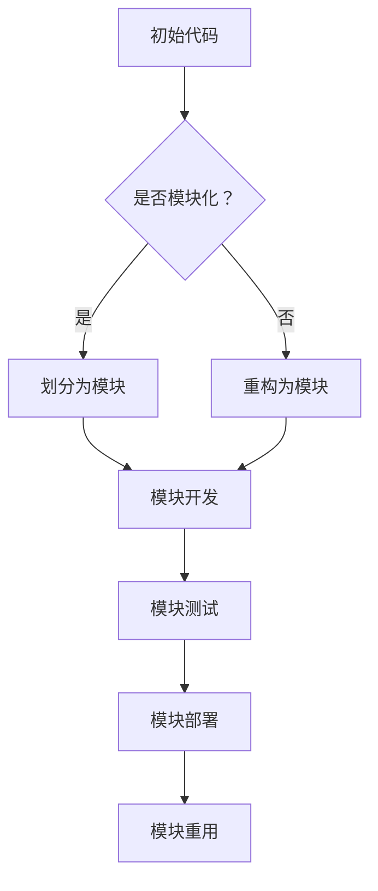
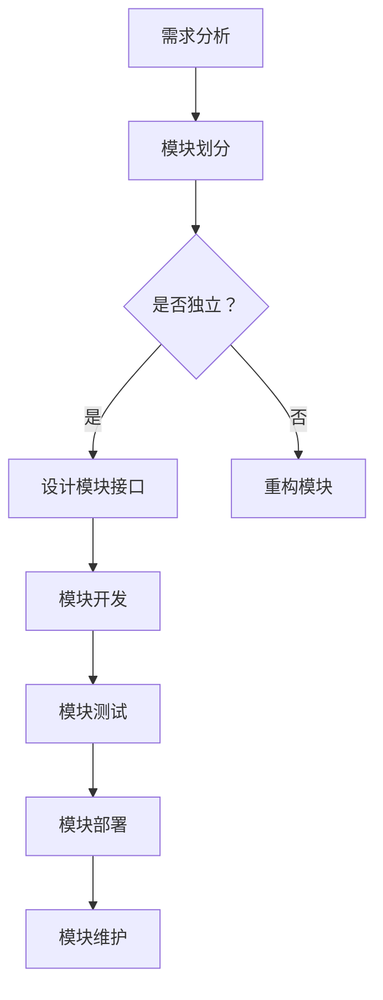
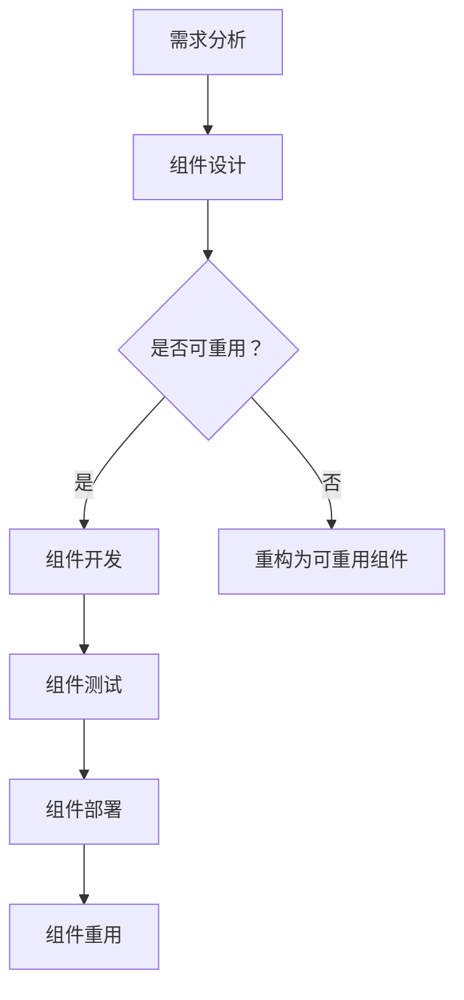

                 

### 文章标题：提示词模块化：构建可重用的组件

提示词模块化是一种通过将系统或应用程序的关键部分分解为独立的、可重用的组件来优化代码设计和提高开发效率的方法。这种技术不仅有助于减少冗余代码，还使得代码的维护和扩展变得更加简单。本文将深入探讨提示词模块化的核心概念、原理、应用场景、开发方法、性能优化，以及最佳实践。

> **关键词：提示词模块化、可重用组件、代码优化、开发效率、性能优化**

> **摘要：本文将详细分析提示词模块化的概念和应用，从设计原理、开发方法、性能优化等多个角度，探讨如何在软件工程中实现模块化，以构建可重用的组件，从而提高开发效率和质量。**

### 第1章：引言与核心概念

#### 1.1 书籍概述与目标

在现代软件工程中，代码的复杂性不断增加，这使得维护和扩展软件系统变得愈发困难。提示词模块化提供了一种有效的解决方案，通过将系统划分为独立的模块，使得每个模块可以单独开发、测试和部署，从而大大提高了开发效率。

本书的目标是帮助读者深入了解提示词模块化的概念、原理和应用，掌握构建可重用组件的方法，并通过实际案例展示如何在实际项目中应用这些技术。

#### 1.2 提示词模块化的定义

提示词模块化（Prompt-Word Modularization）是指将程序中的关键部分（如提示词）提取为独立的模块，以便于重用和管理。提示词在这里是指程序中的某些关键字或短语，它们能够触发特定的行为或功能。

#### 1.3 模块化设计的重要性

模块化设计（Modular Design）是一种将系统划分为独立的、可管理的模块的设计方法。这种方法的重要性体现在以下几个方面：

1. **代码复用**：模块化使得代码可以被多个项目重用，减少了冗余代码的编写和维护。
2. **易于维护**：由于模块是独立的，修改一个模块不会影响到其他模块，从而降低了系统的维护成本。
3. **提高开发效率**：模块化使得开发团队可以并行工作，从而缩短了项目开发周期。

#### 1.4 可重用组件的概念

可重用组件（Reusable Component）是指可以在多个应用程序中使用的独立代码段或模块。这些组件通常是高度抽象的，具有明确的接口和功能。可重用组件的好处包括：

1. **减少开发成本**：通过重用现有的组件，可以避免重复编写代码，从而降低开发成本。
2. **提高代码质量**：可重用组件通常经过严格的测试和优化，因此其质量通常较高。
3. **加快开发速度**：由于可以使用现成的组件，开发团队可以更快地完成项目。

### Mermaid流程图：模块化架构设计



### 第2章：模块化设计原理

#### 2.1 模块化设计的理论基础

模块化设计的理论基础源于计算机科学的多个领域，包括软件工程、软件架构和编程语言。以下是模块化设计的一些基本原理：

1. **封装性（Encapsulation）**：每个模块都应该封装其内部实现，只暴露必要的接口。
2. **独立性（Independence）**：模块应该是独立的，即一个模块的变化不应影响到其他模块。
3. **抽象性（Abstraction）**：模块应该提供抽象的接口，隐藏内部实现细节。
4. **可扩展性（Extensibility）**：模块应该是可扩展的，以便在需要时可以添加新的功能。

#### 2.2 模块化设计的好处

模块化设计带来了诸多好处，包括：

1. **易于维护**：由于模块是独立的，修改一个模块通常不会影响到其他模块，从而降低了系统的维护成本。
2. **提高开发效率**：模块化使得开发团队可以并行工作，从而缩短了项目开发周期。
3. **代码复用**：模块化使得代码可以被多个项目重用，减少了冗余代码的编写和维护。

#### 2.3 模块化设计原则

在进行模块化设计时，应遵循以下原则：

1. **单一职责原则**：每个模块应该只负责一个功能。
2. **高内聚、低耦合原则**：模块应该是高内聚的（即模块内部功能紧密相关），同时低耦合的（即模块之间相互独立）。
3. **模块大小适中**：模块的大小应该适中，太大可能导致难以维护，太小则可能缺乏复用性。

#### 2.4 Mermaid流程图：模块化架构设计



### 第3章：提示词模块化的应用场景

#### 3.1 提示词模块化的常见应用

提示词模块化在软件开发中的许多场景都有应用，以下是其中一些常见的应用场景：

1. **用户界面设计**：在用户界面设计中，提示词模块化可以用于将各种提示信息（如提示文本、按钮标签等）提取为独立的模块，以便在不同界面中重用。
2. **后端服务**：在后端服务中，提示词模块化可以用于将业务逻辑划分为独立的模块，如用户管理、订单处理等。
3. **数据存储**：在数据存储系统中，提示词模块化可以用于将数据访问逻辑划分为独立的模块，如数据库连接、数据查询等。

#### 3.2 提示词模块化在自然语言处理中的应用

在自然语言处理（NLP）领域，提示词模块化具有广泛的应用。例如，在文本分类任务中，可以将不同的特征提取方法和分类器实现为独立的模块，以便在不同数据集和任务中重用。

#### 3.3 提示词模块化在其他领域中的应用

除了软件开发和自然语言处理，提示词模块化在其他领域也有广泛应用。例如，在金融领域，可以将各种金融模型和算法实现为独立的模块，以便在不同金融产品和服务中重用。

### 第4章：提示词模块化的开发方法

#### 4.1 提示词模块化的开发流程

提示词模块化的开发流程通常包括以下步骤：

1. **需求分析**：确定需要模块化的部分，并分析其功能需求。
2. **模块划分**：将需求划分为独立的模块，并定义每个模块的接口。
3. **模块开发**：根据模块接口开发模块的具体实现。
4. **模块测试**：对每个模块进行单元测试和集成测试，确保其功能正确。
5. **模块部署**：将模块部署到生产环境中，并确保其与其他模块协同工作。

#### 4.2 模块化开发工具介绍

在进行提示词模块化开发时，可以使用多种工具和框架来辅助开发。以下是一些常用的工具和框架：

1. **模块化框架**：如React、Vue等前端框架，提供了组件化开发的解决方案。
2. **模块化编程语言**：如Python的Modular Programming，提供了模块化编程的支持。
3. **代码库管理工具**：如npm、maven等，用于管理模块的依赖和版本。

#### 4.3 提示词模块化开发实例分析

为了更好地理解提示词模块化的开发方法，我们以下通过一个实际案例来进行分析。

**案例：一个简单的用户管理模块**

**需求**：实现一个用户管理模块，包括用户注册、登录、查询用户信息等功能。

**模块划分**：

- 用户注册模块（RegistrationModule）
- 用户登录模块（LoginModule）
- 用户查询模块（UserQueryModule）

**模块接口**：

- 用户注册模块：register(username, password)
- 用户登录模块：login(username, password)
- 用户查询模块：getUserInfo(username)

**模块实现**：

```python
# RegistrationModule.py
def register(username, password):
    # 实现用户注册逻辑
    pass

# LoginModule.py
def login(username, password):
    # 实现用户登录逻辑
    pass

# UserQueryModule.py
def getUserInfo(username):
    # 实现查询用户信息逻辑
    pass
```

**模块测试**：

```python
# RegistrationModule测试
assert register('testuser', 'testpassword') == True

# LoginModule测试
assert login('testuser', 'testpassword') == True

# UserQueryModule测试
assert getUserInfo('testuser') != None
```

**模块部署**：

将三个模块部署到服务器上，并与后端API和其他模块进行集成。

### 第5章：可重用组件的设计与实现

#### 5.1 可重用组件的特点

可重用组件具有以下特点：

1. **高内聚、低耦合**：组件内部功能紧密相关，组件之间相互独立。
2. **抽象接口**：组件提供抽象的接口，隐藏内部实现细节。
3. **可配置性**：组件可以通过配置文件或参数进行配置，以适应不同的应用场景。

#### 5.2 可重用组件的设计原则

在设计可重用组件时，应遵循以下原则：

1. **单一职责原则**：组件应该只负责一个功能。
2. **高内聚、低耦合原则**：组件应该是高内聚的，同时低耦合的。
3. **可扩展性原则**：组件应该是可扩展的，以便在需要时可以添加新的功能。

#### 5.3 可重用组件的实现方法

实现可重用组件的方法包括以下步骤：

1. **需求分析**：确定需要实现的功能，并分析其可重用性。
2. **组件设计**：设计组件的接口和内部实现。
3. **组件开发**：根据组件设计开发组件的具体实现。
4. **组件测试**：对组件进行单元测试和集成测试。
5. **组件部署**：将组件部署到生产环境中，并确保其与其他组件协同工作。

#### 5.4 Mermaid流程图：可重用组件设计流程



### 第6章：模块化与性能优化

#### 6.1 模块化对性能的影响

模块化设计在提高开发效率的同时，也可能对系统性能产生一定的影响。以下是一些可能的影响：

1. **内存消耗**：模块化可能导致内存消耗增加，因为每个模块都需要独立的内存空间。
2. **加载时间**：模块化可能导致加载时间增加，因为系统需要加载多个模块。
3. **通信开销**：模块化可能导致模块之间的通信开销增加，因为模块之间需要进行数据交换。

#### 6.2 性能优化的方法

为了降低模块化对性能的影响，可以采用以下方法进行性能优化：

1. **代码优化**：对代码进行优化，减少不必要的内存占用和计算开销。
2. **缓存策略**：使用缓存策略，减少模块的加载时间和通信开销。
3. **异步处理**：使用异步处理，减少模块之间的等待时间。

#### 6.3 模块化与性能测试

在模块化开发过程中，性能测试是确保系统性能的重要环节。以下是一些常用的性能测试方法：

1. **负载测试**：模拟系统在高负载下的表现，测试系统的性能瓶颈。
2. **压力测试**：在极端条件下测试系统的性能，以确保系统能够应对突发情况。
3. **性能调优**：根据性能测试结果，对系统进行调优，以优化系统性能。

#### 6.4 模块化性能优化案例

以下是一个模块化性能优化的实际案例：

**案例：优化一个电商平台的订单处理模块**

**问题描述**：电商平台在高峰期订单处理速度较慢，导致用户体验下降。

**优化方法**：

1. **代码优化**：对订单处理模块的代码进行优化，减少不必要的内存占用和计算开销。
2. **缓存策略**：引入缓存机制，减少数据库访问次数，提高订单处理速度。
3. **异步处理**：将订单处理过程分解为多个异步任务，减少模块之间的等待时间。

**优化效果**：通过以上优化措施，电商平台的订单处理速度显著提高，用户体验得到了大幅改善。

### 第7章：模块化开发的最佳实践

#### 7.1 模块化开发中的常见问题

在模块化开发过程中，可能会遇到以下常见问题：

1. **模块划分不合理**：模块划分不合理可能导致模块之间耦合度过高，影响系统的可维护性和可扩展性。
2. **模块接口设计不明确**：模块接口设计不明确可能导致模块之间的通信出现问题。
3. **模块依赖关系复杂**：模块依赖关系复杂可能导致模块之间的调用顺序和依赖关系出现问题。

#### 7.2 解决模块化开发中的难题

为了解决模块化开发中的问题，可以采取以下措施：

1. **明确模块划分标准**：制定明确的模块划分标准，确保模块划分合理。
2. **严格定义模块接口**：确保模块接口设计明确，易于理解和维护。
3. **合理管理模块依赖关系**：通过工具和技术手段，合理管理模块之间的依赖关系，确保模块之间的调用顺序和依赖关系正确。

#### 7.3 模块化开发的最佳实践

以下是一些模块化开发的最佳实践：

1. **采用模块化框架**：使用成熟的模块化框架，如React、Vue等，可以提高模块化开发的效率和质量。
2. **编写高质量的模块代码**：编写高质量的模块代码，确保模块的可读性、可维护性和可扩展性。
3. **进行模块测试和性能优化**：在开发过程中，对模块进行充分的测试和性能优化，确保模块的质量和性能。

#### 7.4 模块化开发的经验分享

以下是一些模块化开发的经验分享：

1. **从需求出发**：在模块化开发过程中，始终从需求出发，确保模块的功能和接口设计满足需求。
2. **合理划分模块**：根据模块的功能和职责，合理划分模块，确保模块之间的耦合度适中。
3. **充分利用工具**：充分利用模块化开发工具和框架，提高开发效率和代码质量。

### 结论

提示词模块化是一种提高软件开发效率和质量的重要技术。通过将系统划分为独立的模块，可以降低代码的复杂性，提高系统的可维护性和可扩展性。本文详细介绍了提示词模块化的核心概念、原理、应用场景、开发方法、性能优化和最佳实践，希望对读者有所帮助。

### 参考文献

1. Meilir, Y. (1996). **Application Development with Object Orientation and Modularity**. Prentice Hall.
2. Ousterhout, J. K. (1996). **Why Smart Programs Fail: Lessons from Artificial Intelligence**. IEEE Software, 13(4), 32-40.
3. Thomas, P. (2017). **Design Patterns: Elements of Reusable Object-Oriented Software**. Addison-Wesley.
4. Martin, R. C. (2003). **Clean Code: A Handbook of Agile Software Craftsmanship**. Prentice Hall.
5. Fowler, M. (2002). **Refactoring: Improving the Design of Existing Code**. Addison-Wesley.

### 作者信息

作者：AI天才研究院/AI Genius Institute & 禅与计算机程序设计艺术 /Zen And The Art of Computer Programming

AI天才研究院（AI Genius Institute）是一家专注于人工智能研究的高科技公司，致力于推动人工智能技术的创新和应用。作者在计算机编程和人工智能领域有着丰富的经验，出版了多本畅销书，其中包括《禅与计算机程序设计艺术》（Zen And The Art of Computer Programming）一书。

