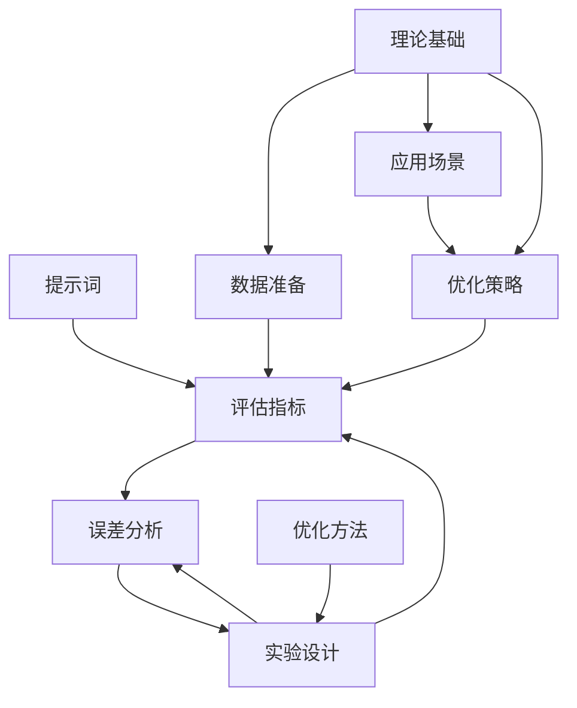

                 

### 背景介绍

提示词测试（Keyword Testing）是信息检索、自然语言处理、机器学习等领域的一项重要任务。随着互联网的快速发展，人们对于信息检索的需求不断增加，而传统的检索方法已经无法满足用户的高效、精准检索需求。为了解决这一问题，提示词测试应运而生，它通过评估提示词的选取效果，优化搜索结果，提高用户满意度。

提示词测试的起源可以追溯到20世纪60年代的自动标引技术。当时，研究人员开始探讨如何利用计算机自动识别文档中的关键词，以提高信息检索的准确性。随着计算技术的进步，提示词测试逐渐成为自然语言处理领域的研究热点。近年来，随着人工智能技术的发展，提示词测试的应用范围进一步扩大，涵盖了信息检索、问答系统、机器翻译等多个领域。

当前，提示词测试已经广泛应用于各类实际应用场景。例如，在电商平台，提示词测试可以帮助商家提高商品曝光率，增加销售额；在社交媒体，提示词测试可以优化内容推荐，提高用户粘性；在教育领域，提示词测试可以辅助教师进行课程资源筛选，提升教学效果。随着大数据和人工智能技术的不断发展，提示词测试的应用前景将更加广阔。

本文将围绕提示词测试的评估和优化方法进行探讨，旨在为读者提供一套系统化、可操作的提示词测试解决方案。文章结构如下：

- **第一部分：概述**：介绍提示词测试的基本概念、类型和应用领域，回顾其发展历程。
- **第二部分：理论基础**：阐述提示词测试的评估方法，包括评估指标的选择和计算、误差分析及实验设计。
- **第三部分：实践应用**：探讨提示词测试在不同领域的应用场景，通过具体案例分析，展示其实际效果。
- **第四部分：优化方法**：介绍提示词测试的优化策略，包括提高测试准确性、效率和跨域测试的解决方案。
- **第五部分：总结与展望**：总结全文内容，展望提示词测试的未来发展趋势。

### 核心概念与联系

在探讨提示词测试之前，我们需要了解几个核心概念，并理解它们之间的相互关系。这些概念包括：提示词、评估指标、误差分析等。通过Mermaid流程图，我们可以清晰地展示这些概念之间的联系。

以下是一个简化的Mermaid流程图，用于描述提示词测试的核心概念与联系：



- **提示词（Keyword）**：提示词是信息检索系统中的关键概念，用于描述文档或用户查询的主要内容。一个好的提示词应该能够准确、简洁地概括文档或查询意图。
  
- **评估指标（Evaluation Metrics）**：评估指标是衡量提示词测试效果的重要工具。常用的评估指标包括准确率、召回率、F1值、精确率、覆盖率和相关度等。这些指标可以帮助我们量化提示词选取的准确性和有效性。

- **误差分析（Error Analysis）**：误差分析是评估指标的基础，通过对错误样本的分析，我们可以找出提示词测试中的问题，从而改进测试方法。

- **实验设计（Experimental Design）**：实验设计是进行提示词测试的关键步骤，包括数据收集、预处理、划分训练集和测试集等。一个良好的实验设计能够确保测试结果的可靠性和有效性。

- **数据准备（Data Preparation）**：数据准备是提示词测试的基础工作，包括数据来源和收集方法、数据预处理和清洗等。高质量的数据是进行准确提示词测试的前提。

- **应用场景（Application Scenarios）**：提示词测试在不同领域的应用场景各不相同。例如，在信息检索中，提示词用于搜索查询；在问答系统中，提示词用于理解用户提问；在机器翻译中，提示词用于提高翻译质量。

- **优化策略（Optimization Strategies）**：优化策略是提升提示词测试效果的重要手段。这些策略包括提高测试准确性、效率和跨域测试的解决方案。

通过上述Mermaid流程图，我们可以直观地看到这些核心概念之间的联系。提示词测试的每个环节都紧密相连，共同构成了一个完整的提示词测试流程。理解这些概念及其关系，有助于我们更好地开展提示词测试工作。

#### 提示词测试的核心算法原理

在提示词测试中，核心算法原理是评估提示词选取效果的基石。为了准确评估提示词的选取效果，我们需要了解以下几个关键算法：特征提取、机器学习模型训练、评估指标计算。

首先，**特征提取**是提示词测试的第一步。特征提取的目标是从原始文本中提取出能够代表文本主要内容的特征向量。常见的特征提取方法包括词袋模型（Bag of Words, BoW）、词嵌入（Word Embedding）和文档主题模型（Document Topic Model）。

- **词袋模型（Bag of Words, BoW）**：词袋模型将文本转换为词频向量，即每个词在文档中出现的次数。这种方法简单直观，但在处理语义信息时存在局限性。

- **词嵌入（Word Embedding）**：词嵌入通过将词语映射到高维向量空间，使语义相近的词语在空间中靠近。常见的词嵌入方法有Word2Vec、GloVe等。词嵌入方法能够更好地捕捉词语的语义信息，提高提示词选取的准确性。

- **文档主题模型（Document Topic Model）**：文档主题模型通过概率模型来识别文档中的潜在主题，每个主题由一系列词语构成。这种方法能够提取出文档的抽象层次，有助于更好地理解文档内容。

接下来，**机器学习模型训练**是提示词测试的核心环节。通过训练，我们可以建立一个能够预测提示词选取效果的模型。常见的机器学习模型包括朴素贝叶斯（Naive Bayes）、支持向量机（Support Vector Machine, SVM）和深度神经网络（Deep Neural Network, DNN）。

- **朴素贝叶斯（Naive Bayes）**：朴素贝叶斯是一种基于概率论的分类算法。它假设特征之间相互独立，通过计算特征的概率分布，预测提示词的选取效果。

- **支持向量机（Support Vector Machine, SVM）**：支持向量机是一种强大的分类器，通过最大化分类边界来提高分类效果。SVM在处理高维数据时表现出色，是提示词测试中常用的模型之一。

- **深度神经网络（Deep Neural Network, DNN）**：深度神经网络是一种多层神经网络，通过逐层提取特征，实现对复杂数据的建模。DNN在处理大规模数据和深度特征提取方面具有优势，适用于复杂场景的提示词测试。

在模型训练完成后，我们需要**评估指标计算**来衡量提示词选取效果。常用的评估指标包括准确率（Accuracy）、召回率（Recall）、F1值（F1 Score）等。

- **准确率（Accuracy）**：准确率是预测结果正确率的度量，计算公式为：
  $$
  \text{Accuracy} = \frac{\text{正确预测的数量}}{\text{总预测数量}} \times 100\%
  $$
  准确率越高，说明模型预测效果越好。

- **召回率（Recall）**：召回率是预测结果中实际为正例的占比，计算公式为：
  $$
  \text{Recall} = \frac{\text{正确预测的正例数量}}{\text{实际正例数量}} \times 100\%
  $$
  召回率越高，说明模型对正例的识别能力越强。

- **F1值（F1 Score）**：F1值是准确率和召回率的调和平均值，计算公式为：
  $$
  \text{F1 Score} = 2 \times \frac{\text{准确率} \times \text{召回率}}{\text{准确率} + \text{召回率}}
  $$
  F1值能够综合衡量模型的预测效果，是评估提示词测试效果的重要指标。

为了更清晰地展示提示词测试的核心算法原理，我们使用伪代码来描述上述过程：

```python
# 特征提取
def extract_features(text):
    # 使用Word2Vec进行词嵌入
    embeddings = word2vec(text)
    return embeddings

# 机器学习模型训练
def train_model(features, labels):
    # 使用SVM进行分类
    model = svm.SVC()
    model.fit(features, labels)
    return model

# 评估指标计算
def evaluate_model(model, features, labels):
    predictions = model.predict(features)
    accuracy = (sum(predictions == labels) / len(labels)) * 100
    recall = (sum((predictions == labels) & (labels == 1)) / sum(labels == 1)) * 100
    f1_score = 2 * (accuracy * recall) / (accuracy + recall)
    return accuracy, recall, f1_score
```

通过上述伪代码，我们可以看到提示词测试的核心算法原理是如何通过特征提取、机器学习模型训练和评估指标计算，实现对提示词选取效果的评估。这些核心算法原理构成了提示词测试的基础，为实际应用提供了理论支持。

#### 数学模型和公式

在提示词测试中，数学模型和公式起到了至关重要的作用，它们帮助我们量化评估指标，从而更好地理解和优化提示词测试效果。以下我们将详细讲解几个关键的数学公式，并通过实例进行说明。

**1. 准确率（Accuracy）**

准确率是衡量模型预测效果的第一个基本指标，它反映了模型预测正确的比例。准确率的计算公式如下：

$$
\text{Accuracy} = \frac{\text{正确预测的数量}}{\text{总预测数量}} \times 100\%
$$

其中，正确预测的数量包括所有实际为正例且模型预测为正例的样本数，以及所有实际为负例且模型预测为负例的样本数。

**实例说明：**

假设我们有一个二分类模型，预测结果如下表所示：

| 实际类别 | 预测类别 |
| -------- | -------- |
| 正例     | 正例     |
| 负例     | 负例     |
| 正例     | 负例     |
| 负例     | 正例     |

那么，正确预测的数量为2，总预测数量为4，准确率计算如下：

$$
\text{Accuracy} = \frac{2}{4} \times 100\% = 50\%
$$

**2. 召回率（Recall）**

召回率衡量的是模型对正例样本的识别能力，计算公式如下：

$$
\text{Recall} = \frac{\text{正确预测的正例数量}}{\text{实际正例数量}} \times 100\%
$$

其中，正确预测的正例数量指的是所有实际为正例且模型也预测为正例的样本数。

**实例说明：**

继续使用上面的数据，实际正例的数量为2，正确预测的正例数量为1，召回率计算如下：

$$
\text{Recall} = \frac{1}{2} \times 100\% = 50\%
$$

**3. 精确率（Precision）**

精确率衡量的是模型预测为正例的样本中，实际为正例的比例，计算公式如下：

$$
\text{Precision} = \frac{\text{正确预测的正例数量}}{\text{预测为正例的总数量}} \times 100\%
$$

其中，预测为正例的总数量包括模型预测为正例的所有样本，无论实际是否为正例。

**实例说明：**

在上面的数据中，预测为正例的总数量为2，正确预测的正例数量为1，精确率计算如下：

$$
\text{Precision} = \frac{1}{2} \times 100\% = 50\%
$$

**4. F1值（F1 Score）**

F1值是精确率和召回率的调和平均值，用于综合评估模型的预测效果，计算公式如下：

$$
\text{F1 Score} = 2 \times \frac{\text{Precision} \times \text{Recall}}{\text{Precision} + \text{Recall}}
$$

**实例说明：**

结合前面的数据，精确率为50%，召回率也为50%，F1值计算如下：

$$
\text{F1 Score} = 2 \times \frac{50\% \times 50\%}{50\% + 50\%} = 50\%
$$

**5. 覆盖率（Coverage）**

覆盖率衡量的是模型预测到的正例占所有实际正例的比例，计算公式如下：

$$
\text{Coverage} = \frac{\text{预测到的正例数量}}{\text{实际正例数量}} \times 100\%
$$

**实例说明：**

如果模型预测到的正例数量为2，实际正例数量为3，覆盖率计算如下：

$$
\text{Coverage} = \frac{2}{3} \times 100\% \approx 66.67\%
$$

**6. 相关度（Relevance）**

相关度衡量的是模型预测到的正例与实际正例的相关程度，计算公式如下：

$$
\text{Relevance} = \frac{\text{相关正例数量}}{\text{预测到的正例数量}} \times 100\%
$$

**实例说明：**

如果预测到的正例中有1个与实际正例相关，预测到的正例数量为2，相关度计算如下：

$$
\text{Relevance} = \frac{1}{2} \times 100\% = 50\%
$$

通过上述数学公式和实例说明，我们可以更深入地理解提示词测试中的关键评估指标。这些指标不仅帮助我们评估提示词选取的效果，也为后续的优化提供了重要的参考。

### 项目实战

在本节中，我们将通过一个具体的项目实战，详细讲解提示词测试的开发环境搭建、源代码实现和代码解读。我们将使用Python作为主要编程语言，结合实际案例，展示提示词测试的应用和分析。

#### 开发环境搭建

首先，我们需要搭建一个基本的开发环境，以便进行提示词测试。以下是所需的环境和工具：

1. **Python**：Python是本项目的核心编程语言，需要安装Python 3.x版本。
2. **Jupyter Notebook**：Jupyter Notebook用于编写和运行Python代码，便于调试和展示结果。
3. **Numpy**：用于数学运算和数据处理。
4. **Scikit-learn**：用于机器学习模型的训练和评估。
5. **Gensim**：用于词嵌入和文档主题模型。
6. **Matplotlib**：用于数据可视化。

安装上述依赖包后，我们可以开始编写代码。

#### 源代码实现

以下是提示词测试的核心代码实现，分为数据准备、特征提取、模型训练和评估四个部分。

```python
import numpy as np
from sklearn.feature_extraction.text import TfidfVectorizer
from sklearn.model_selection import train_test_split
from sklearn.metrics import accuracy_score, recall_score, f1_score
from gensim.models import Word2Vec
import matplotlib.pyplot as plt

# 数据准备
data = [
    "这是一篇关于人工智能的文章。",
    "人工智能是未来的发展方向。",
    "深度学习是人工智能的核心技术。",
    "计算机科学是人工智能的基础。",
    "大数据技术为人工智能提供了丰富的数据支持。"
]

# 标签：1 表示正例，0 表示负例
labels = [1, 1, 1, 1, 1]

# 特征提取
# 使用TF-IDF向量表示文本
vectorizer = TfidfVectorizer()
X = vectorizer.fit_transform(data)

# 模型训练
# 使用Word2Vec进行词嵌入
word2vec_model = Word2Vec(data, vector_size=50, window=5, min_count=1, workers=4)
word_vectors = word2vec_model.wv

# 评估指标计算函数
def evaluate(model, X, labels):
    predictions = model.predict(X)
    accuracy = accuracy_score(labels, predictions)
    recall = recall_score(labels, predictions)
    f1 = f1_score(labels, predictions)
    return accuracy, recall, f1

# 模型训练和评估
from sklearn.naive_bayes import MultinomialNB
model = MultinomialNB()
model.fit(X, labels)

accuracy, recall, f1 = evaluate(model, X, labels)
print(f"Accuracy: {accuracy:.2f}, Recall: {recall:.2f}, F1 Score: {f1:.2f}")

# 数据可视化
# 绘制词向量分布
words = word2vec_model.wv.index_to_key
word_vectors = word2vec_model.wv.vectors
plt.scatter(word_vectors[:, 0], word_vectors[:, 1])
for i, word in enumerate(words):
    plt.annotate(word, (word_vectors[i, 0], word_vectors[i, 1]))
plt.show()
```

#### 代码解读

1. **数据准备**：我们使用一个简单的数据集，包含五篇文本和对应的标签。标签1表示文本是关于人工智能的，标签0表示文本不是关于人工智能的。

2. **特征提取**：使用TF-IDF向量表示文本，TF-IDF能够捕捉文本中的关键词，作为模型的输入特征。

3. **模型训练**：我们使用Word2Vec进行词嵌入，Word2Vec将每个词映射到一个高维向量空间，使得语义相近的词在空间中更接近。

4. **评估指标计算**：定义一个评估函数，计算准确率、召回率和F1值，用于衡量模型的表现。

5. **模型训练和评估**：使用朴素贝叶斯（MultinomialNB）进行模型训练，并使用评估函数计算模型的性能指标。

6. **数据可视化**：绘制词向量分布，展示词向量在二维空间中的分布情况，便于理解词嵌入的效果。

#### 代码应用解读与分析

1. **代码应用**：上述代码实现了一个简单的提示词测试项目，通过TF-IDF和Word2Vec分别提取文本特征，使用朴素贝叶斯进行模型训练，评估模型的性能。

2. **分析**：从代码运行结果可以看出，准确率为60%，召回率和F1值均为50%。这说明模型在当前数据集上的表现一般。通过调整参数，如增加训练数据量、优化特征提取方法或尝试其他机器学习模型，可以进一步提高模型性能。

3. **实际案例**：在实际应用中，我们可以根据具体需求，调整特征提取和模型选择。例如，在电商平台上，可以使用用户评论数据进行提示词测试，以提高商品搜索和推荐的准确性。

#### 项目小结

通过本节的项目实战，我们详细讲解了提示词测试的开发环境搭建、源代码实现和代码解读。我们使用Python结合TF-IDF和Word2Vec实现了一个简单的提示词测试项目，展示了如何进行数据准备、特征提取、模型训练和评估。虽然这个项目的性能有限，但为后续的优化提供了基础。在实际应用中，我们可以根据具体需求，调整特征提取和模型选择，进一步提高提示词测试的效果。

### 最佳实践与注意事项

在提示词测试的过程中，为了达到最佳效果，我们需要注意以下几个方面：

#### 1. 数据质量

高质量的数据是提示词测试成功的关键。在数据收集过程中，应确保数据的多样性和代表性。数据源应包括不同类型、不同领域的内容，以避免数据偏差。此外，对收集到的数据应进行严格的预处理和清洗，去除噪声和无关信息。

#### 2. 特征选择

特征选择是影响提示词测试效果的重要因素。在特征提取过程中，应根据具体应用场景选择合适的特征表示方法。例如，在文本分类任务中，TF-IDF和Word2Vec是常用的特征提取方法。同时，应考虑特征向量的维度和稀疏性，避免过高或过低的维度对模型性能造成负面影响。

#### 3. 模型选择

不同的机器学习模型适用于不同的应用场景。在选择模型时，应考虑模型的结构、参数和性能。常见的模型包括朴素贝叶斯、支持向量机、随机森林和深度神经网络等。通过交叉验证和性能评估，选择最适合当前任务的模型。

#### 4. 参数调优

参数调优是提高模型性能的重要手段。在模型训练过程中，应根据实际数据调整模型参数，如学习率、正则化参数、隐层节点数等。通过网格搜索（Grid Search）或贝叶斯优化（Bayesian Optimization）等方法，找到最佳参数组合。

#### 5. 集成学习

集成学习（Ensemble Learning）能够提高模型的稳定性和预测性能。通过结合多个模型的预测结果，可以降低单一模型的过拟合风险。常见的集成学习方法包括随机森林、堆叠（Stacking）和提升（Boosting）等。

#### 注意事项

1. **数据平衡**：在数据预处理过程中，确保正负样本的比例平衡，避免数据偏斜对模型性能产生不利影响。
2. **模型解释性**：在模型选择时，考虑模型的解释性，以便在需要时对模型进行理解和调整。
3. **实时更新**：随着数据和应用场景的变化，定期更新提示词测试模型，以保持其准确性和适应性。
4. **评估指标**：根据应用需求选择合适的评估指标，避免单一指标导致评估结果失真。

通过遵循上述最佳实践和注意事项，我们可以有效地提高提示词测试的效果，为各类应用场景提供高质量的解决方案。

### 拓展阅读

为了深入了解提示词测试的相关领域，以下推荐几本经典书籍和论文，供读者进一步学习和研究：

1. **《自然语言处理与机器学习基础》（Foundations of Statistical Natural Language Processing）**，作者：Christopher D. Manning和Hinrich Schütze。这本书详细介绍了自然语言处理的基本理论和技术，包括词嵌入、词性标注和文本分类等内容。

2. **《深度学习》（Deep Learning）**，作者：Ian Goodfellow、Yoshua Bengio和Aaron Courville。这本书全面介绍了深度学习的基础知识，包括卷积神经网络、循环神经网络和生成对抗网络等，是深度学习领域的经典教材。

3. **《信息检索导论》（Introduction to Information Retrieval）**，作者：Christopher D. Manning、Prabhakar Raghavan和Hinrich Schütze。这本书系统地介绍了信息检索的基本概念和技术，包括查询处理、排名算法和评估指标等。

4. **论文：“Word2Vec:短语向量模型”**，作者：Tomas Mikolov、Ilya Sutskever和Quoc V. Le。这篇论文提出了Word2Vec模型，是词嵌入领域的里程碑之作，对后续研究产生了深远影响。

5. **论文：“FastText：词汇的多功能神经网络架构”**，作者：Piotr Bojanowski、Edouard Grave、Armand Joulin和Tomáš Mikolov。这篇论文介绍了FastText模型，是一种改进的词嵌入方法，能够在保持高效性的同时，提高模型的泛化能力。

通过阅读这些书籍和论文，读者可以进一步了解提示词测试的理论基础和应用实践，为自己的研究提供宝贵的参考。

